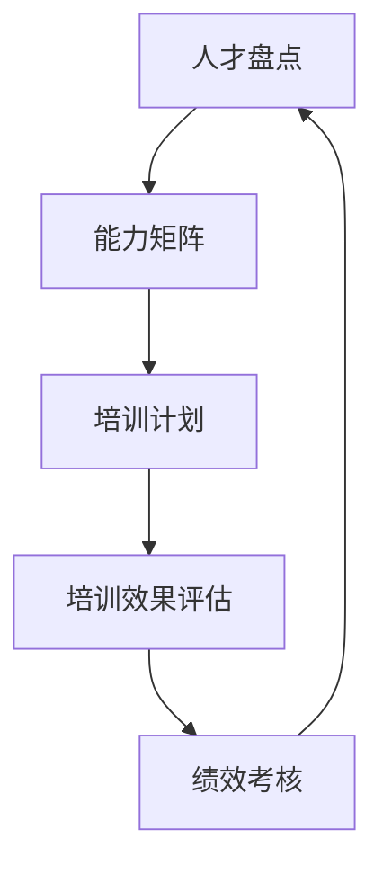

                 

### 文章标题：员工发展计划：培养团队核心竞争力

> 关键词：员工发展计划、团队核心竞争力、人才培养、策略实施、案例分析

> 摘要：本文将深入探讨员工发展计划的重要性和实施方法，重点分析如何通过培养团队核心竞争力来提升企业整体竞争力。文章分为六个章节，涵盖了员工发展计划的定义与意义、目标与原则、培养团队核心竞争力的方法、实施策略、评估与反馈以及具体案例分析，旨在为企业管理者提供实用的指导和建议。

### 目录大纲

## 第1章：员工发展计划概述

### 1.1 员工发展计划的定义与意义

### 1.2 员工发展计划的现状分析

### 1.3 员员发展计划的核心概念

## 第2章：员工发展计划的目标与原则

### 2.1 员工发展计划的目标

#### 2.1.1 提高员工技能

#### 2.1.2 提升团队效率

#### 2.1.3 增强员工忠诚度

### 2.2 员工发展计划的原则

#### 2.2.1 因人而异

#### 2.2.2 长期规划

#### 2.2.3 动态调整

## 第3章：培养团队核心竞争力

### 3.1 核心竞争力的定义与构成

#### 3.1.1 领导力

#### 3.1.2 创新能力

#### 3.1.3 团队协作能力

### 3.2 培养团队核心竞争力的方法

#### 3.2.1 人才盘点

#### 3.2.2 能力矩阵

#### 3.2.3 培训计划制定

#### 3.2.4 培训效果评估

## 第4章：员工发展计划的实施策略

### 4.1 员工发展计划的实施步骤

#### 4.1.1 制定计划

#### 4.1.2 实施培训

#### 4.1.3 跟踪进展

#### 4.1.4 调整优化

### 4.2 培训资源管理

#### 4.2.1 内部培训资源

#### 4.2.2 外部培训资源

#### 4.2.3 培训预算管理

## 第5章：员工发展计划的评估与反馈

### 5.1 员工发展计划的评估方法

#### 5.1.1 绩效考核

#### 5.1.2 员工满意度调查

#### 5.1.3 培训效果评估

### 5.2 反馈机制建立与实施

#### 5.2.1 反馈渠道建立

#### 5.2.2 反馈信息分析

#### 5.2.3 反馈结果应用

## 第6章：员工发展计划的案例分析

### 6.1 案例一：某互联网公司员工发展计划实践

#### 6.1.1 案例背景

#### 6.1.2 案例实施过程

#### 6.1.3 案例成果与反思

### 6.2 案例二：某制造企业员工发展计划实践

#### 6.2.1 案例背景

#### 6.2.2 案例实施过程

#### 6.2.3 案例成果与反思

### 文章正文部分将在后续逐步展开，敬请期待。

---

作者：AI天才研究院/AI Genius Institute & 禅与计算机程序设计艺术 /Zen And The Art of Computer Programming

---

## 第1章：员工发展计划概述

### 1.1 员工发展计划的定义与意义

员工发展计划（Employee Development Plan，简称EDP）是企业为了提升员工的技能、能力和素质，从而实现企业长期战略目标而制定的一系列规划和行动方案。这一计划不仅关注员工个人的职业成长，更重视团队的整体素质和竞争力。

在当今快速变化的市场环境中，员工发展计划的重要性愈发凸显。首先，员工发展计划有助于企业吸引和留住优秀人才。通过提供有吸引力的培训和发展机会，企业能够吸引更多的优秀人才加入，并让他们感受到企业的关怀和重视，从而提高员工的忠诚度和留存率。

其次，员工发展计划有助于提升团队的整体素质和竞争力。通过系统化的培训和发展，员工能够不断提升自己的技能和知识，从而提高工作效率和质量，进一步推动企业的持续发展。

最后，员工发展计划有助于企业文化的建设。通过共同的目标和价值观，员工能够形成强大的团队凝聚力，共同为实现企业目标而努力。

总之，员工发展计划是企业实现长期战略目标的重要手段，对于提升员工个人素质、团队整体竞争力以及企业文化都有着重要的意义。

### 1.2 员工发展计划的现状分析

目前，许多企业已经认识到员工发展计划的重要性，并开始实施相应的计划和措施。然而，从整体上看，员工发展计划在实施过程中仍然存在一些问题和挑战。

首先，部分企业对员工发展计划的重视程度不足。虽然许多企业已经制定了员工发展计划，但在实际执行过程中，由于种种原因，这些计划往往流于形式，难以真正起到提升员工素质的作用。

其次，员工发展计划的内容和形式较为单一。许多企业仅仅提供一些常规的培训课程，缺乏针对性和个性化的发展方案，无法满足员工多样化的需求。

再次，员工发展计划的实施效果评估不够科学。部分企业在实施员工发展计划后，缺乏有效的评估和反馈机制，无法准确了解员工的发展状况和培训效果，从而难以进行有效的调整和优化。

此外，企业内部的文化氛围对于员工发展计划的实施也具有重要影响。如果企业文化不够开放和包容，员工可能难以积极参与到发展计划中，从而影响计划的实施效果。

总之，虽然员工发展计划在许多企业中已经开始实施，但仍然存在诸多问题和挑战，需要企业不断探索和完善。

### 1.3 员员发展计划的核心概念

为了更好地理解和实施员工发展计划，我们需要明确以下几个核心概念：

#### 1.3.1 人才盘点

人才盘点是指对企业内部员工的能力、潜力、技能和绩效进行系统评估和记录的过程。通过人才盘点，企业能够了解员工的现有能力和未来潜力，为制定个性化的发展计划提供依据。

#### 1.3.2 能力矩阵

能力矩阵是一种用于评估和展示员工能力的工具。它通过将员工的技能、知识和绩效进行结构化分类和比较，帮助企业发现优势和短板，从而制定针对性的培训和发展计划。

#### 1.3.3 培训计划

培训计划是指为了提升员工技能和能力而制定的一系列培训活动和项目。一个有效的培训计划应该根据员工的能力和需求，选择合适的培训内容和形式，确保培训能够真正提高员工的实际工作能力。

#### 1.3.4 培训效果评估

培训效果评估是指对培训活动的效果进行系统评估和反馈的过程。通过培训效果评估，企业能够了解培训活动的实际效果，发现存在的问题和不足，从而进行改进和优化。

#### 1.3.5 绩效考核

绩效考核是指对企业员工的工作绩效进行评估和考核的过程。通过绩效考核，企业能够了解员工的工作表现，为制定培训和发展计划提供依据，同时也为员工的晋升和奖励提供参考。

以上几个核心概念相互关联，共同构成了员工发展计划的基础。企业需要根据实际情况，灵活运用这些概念，制定出切实可行的发展计划，以提升员工素质和团队竞争力。

### 1.4 员工发展计划的整体架构图

为了更好地理解员工发展计划的整体架构，我们可以使用Mermaid流程图来展示各个核心概念之间的关系：

在这个流程图中，人才盘点作为起点，通过能力矩阵确定员工的技能和潜力，进而制定培训计划。培训计划实施后，通过培训效果评估来检验培训成果，最终通过绩效考核来反馈员工发展状况，形成闭环，不断优化和调整员工发展计划。

### 1.5 小结

本章介绍了员工发展计划的定义与意义、现状分析以及核心概念。通过理解这些内容，我们可以认识到员工发展计划对于提升员工素质和团队竞争力的重要性。在接下来的章节中，我们将进一步探讨员工发展计划的具体目标、原则以及实施策略，帮助企业和员工更好地实现个人和组织的共同发展。

### 第2章：员工发展计划的目标与原则

员工发展计划的目标是为了提升员工的技能、能力和素质，从而推动企业整体竞争力的提升。这些目标不仅关注员工个人的职业成长，也旨在促进团队整体素质的提高。以下是员工发展计划的主要目标：

#### 2.1.1 提高员工技能

提高员工技能是员工发展计划的首要目标。通过提供专业培训和实践机会，员工能够掌握新的知识和技能，提高工作效率和质量。例如，技术人员可以通过参加编程语言培训、技术研讨会和在线课程来提升编程技能，而销售人员则可以通过销售技巧培训来提高销售业绩。

#### 2.1.2 提升团队效率

提升团队效率是员工发展计划的另一个重要目标。通过系统化的培训和协作，团队成员能够更好地理解彼此的工作内容和职责，提高团队协作能力，从而提升整体工作效率。例如，企业可以通过团队建设活动、跨部门项目合作和团队培训来增强团队协作能力，减少内部沟通障碍，提高工作效率。

#### 2.1.3 增强员工忠诚度

增强员工忠诚度是员工发展计划的重要目标之一。通过提供良好的培训和发展机会，企业能够表达对员工的关心和重视，从而提高员工的满意度和忠诚度。例如，企业可以通过内部晋升机制、员工股票期权计划以及员工福利计划来激励员工，增强员工的归属感和忠诚度。

#### 2.1.4 促进个人职业成长

促进个人职业成长是员工发展计划的重要目标。通过提供职业发展路径和职业规划指导，员工能够明确自己的职业目标和方向，制定合理的职业发展计划，从而实现个人职业成长。例如，企业可以通过导师制度、职业咨询和职业晋升通道来帮助员工制定和实现职业发展计划。

### 2.2 员工发展计划的原则

为了实现员工发展计划的目标，企业需要遵循一系列原则，确保计划的科学性和有效性。以下是员工发展计划的主要原则：

#### 2.2.1 因人而异

因人而异是员工发展计划的基本原则。每个员工的能力、需求和兴趣都不同，因此发展计划应该根据员工的特点和需求进行个性化定制。例如，对于技术能力较强的员工，企业可以提供更多技术培训和项目机会，而对于管理能力较强的员工，企业可以提供领导力培训和晋升机会。

#### 2.2.2 长期规划

长期规划是员工发展计划的重要原则。员工发展是一个长期的过程，需要企业持续投入资源和精力。企业应该制定长期的发展规划，明确员工发展的目标和路径，确保员工能够在职业生涯中得到全面的成长。例如，企业可以制定3年、5年甚至更长远的发展规划，为员工提供持续的培训和职业发展支持。

#### 2.2.3 动态调整

动态调整是员工发展计划的重要原则。企业在实施员工发展计划的过程中，需要根据实际情况和员工的表现进行及时调整。例如，如果员工在培训过程中表现优异，企业可以提供更多的培训机会或晋升机会；如果员工表现不佳，企业需要及时进行指导和帮助，确保员工能够跟上发展节奏。

#### 2.2.4 系统性

系统性是员工发展计划的重要原则。员工发展计划应该是一个系统化的过程，包括人才盘点、能力评估、培训计划、效果评估和反馈等多个环节。通过系统化的管理，企业能够更好地了解员工的发展状况，为员工提供有针对性的培训和指导。

### 2.3 小结

本章详细阐述了员工发展计划的目标和原则。通过明确员工发展计划的目标，企业能够更好地制定发展策略，提升员工的技能、能力和忠诚度。同时，通过遵循员工发展计划的原则，企业能够确保发展计划的科学性和有效性，为员工的职业成长提供有力支持。在接下来的章节中，我们将进一步探讨如何培养团队核心竞争力，为员工发展计划的实施提供更多实践指导。

### 第3章：培养团队核心竞争力

培养团队核心竞争力是员工发展计划的关键环节，它关乎企业能否在激烈的市场竞争中脱颖而出。团队核心竞争力不仅包括个人的专业技能，还涵盖了团队协作、创新能力和领导力等多方面因素。以下是对这些核心竞争力的定义与构成，以及培养团队核心竞争力的具体方法。

#### 3.1 核心竞争力的定义与构成

核心竞争力是指企业或团队在长期竞争过程中所形成的、能够持续带来竞争优势的能力。对于团队而言，核心竞争力主要体现在以下几个方面：

1. **领导力**：领导力是团队核心竞争力的关键因素。一个优秀的领导者能够激发团队成员的潜力，提升团队凝聚力，推动团队高效执行任务。

2. **创新能力**：创新能力是团队在面对挑战和机遇时的核心竞争力。一个具有创新能力的团队能够不断突破现状，找到新的解决方案，从而在市场竞争中保持领先地位。

3. **团队协作能力**：团队协作能力是团队完成复杂任务的重要保障。一个高效的团队能够在成员之间形成良好的沟通和协作，实现资源共享和优势互补，从而提高工作效率和质量。

4. **专业技能**：专业技能是团队成员在各自岗位上所需具备的核心能力。一个团队的专业技能水平决定了团队在特定领域的竞争力，也是企业整体竞争力的重要组成部分。

#### 3.2 培养团队核心竞争力的方法

为了培养团队核心竞争力，企业需要从多个方面入手，采取一系列具体的措施。以下是培养团队核心竞争力的几种有效方法：

1. **人才盘点**：人才盘点是培养团队核心竞争力的重要基础。通过系统的人才盘点，企业可以了解员工的技能、潜力和发展需求，为制定个性化的发展计划提供依据。具体方法包括员工能力评估、潜力评估和绩效评估等。

2. **能力矩阵**：能力矩阵是一种用于评估和展示员工能力的工具。它通过将员工的技能、知识和绩效进行结构化分类和比较，帮助企业发现优势和短板，从而制定针对性的培训和发展计划。能力矩阵可以直观地展示团队成员的能力分布，为团队优化和调整提供参考。

3. **培训计划制定**：培训计划是培养团队核心竞争力的重要手段。企业应根据员工的实际情况和需求，制定有针对性的培训计划。培训内容可以包括专业技能培训、领导力培训、创新能力培训等。通过系统化的培训，员工能够不断提升自己的能力和素质，从而提升团队的整体竞争力。

4. **培训效果评估**：培训效果评估是检验培训效果的重要环节。企业应通过定期的评估，了解员工对培训的满意度、培训成果的转化情况以及培训对员工工作绩效的影响。通过评估，企业可以及时发现培训中的问题，优化培训方案，提高培训效果。

5. **绩效激励**：绩效激励是激发员工积极性和创新能力的有效手段。企业可以通过设立绩效目标、提供奖励和晋升机会等方式，激励员工在工作中发挥出最佳水平。绩效激励不仅可以提升员工的个人能力和素质，也有助于增强团队凝聚力和协作能力。

6. **团队建设活动**：团队建设活动是培养团队协作能力和创新能力的重要途径。企业可以定期组织团队建设活动，如团队拓展训练、团队研讨会、团队项目合作等。通过这些活动，团队成员能够更好地了解彼此，增强团队合作意识，提高团队协作效率。

#### 3.3 小结

本章详细阐述了培养团队核心竞争力的定义与构成，以及具体的方法。通过人才盘点、能力矩阵、培训计划制定、培训效果评估、绩效激励和团队建设活动等多种措施，企业可以全面提升团队的核心竞争力，从而在市场竞争中保持领先地位。在下一章中，我们将探讨员工发展计划的实施策略，帮助企业和员工更好地实现发展目标。

### 第4章：员工发展计划的实施策略

员工发展计划的实施策略是确保计划有效执行和达成预期目标的关键。一个完善的实施策略应包括明确的目标、详细的步骤、合理的资源分配以及有效的评估和反馈机制。以下将详细阐述员工发展计划的实施策略。

#### 4.1 制定计划

制定计划是实施员工发展计划的第一步。企业应首先明确员工发展计划的目标，包括提升员工技能、提高团队效率、增强员工忠诚度和促进个人职业成长等。在明确目标后，企业需要制定具体的实施步骤，确保计划的可行性和可操作性。

1. **目标分解**：将总体目标分解为具体的子目标和可操作的任务。例如，提升员工技能的目标可以分解为具体的技术培训、管理培训等。

2. **时间安排**：为每个任务设定明确的时间节点，确保计划有序进行。例如，技术培训可以安排在每个季度进行。

3. **责任分配**：明确每个任务的负责人和参与人员，确保任务能够按时完成。例如，技术培训可以由人力资源部门负责组织和实施。

4. **资源准备**：根据计划的需求，提前准备所需的资源，如培训教材、培训场地、培训师等。

#### 4.2 实施培训

实施培训是员工发展计划的核心环节。企业应根据制定好的培训计划，采取多种形式的培训活动，如内部培训、外部培训、在线培训等，确保员工能够得到全面的发展。

1. **内部培训**：内部培训由企业内部的专业人员进行，可以根据员工的实际情况和需求进行定制化培训。例如，技术部门的员工可以参加由技术总监组织的编程技术培训。

2. **外部培训**：外部培训可以聘请外部专家进行，通常涉及高级技术、管理知识等。例如，企业可以安排员工参加专业培训机构的管理培训。

3. **在线培训**：在线培训是一种灵活的培训方式，员工可以在工作之余进行学习。例如，企业可以提供在线编程课程、管理课程等。

#### 4.3 跟踪进展

跟踪进展是确保员工发展计划顺利实施的重要手段。企业应建立有效的跟踪机制，定期检查计划执行情况，及时发现问题并进行调整。

1. **进度报告**：定期收集员工的学习进度报告，了解每个任务的完成情况。

2. **反馈收集**：通过员工反馈，了解培训的实际效果和员工的需求，为后续培训提供改进方向。

3. **调整计划**：根据进展情况和反馈结果，及时调整培训计划和实施策略，确保计划的灵活性和适应性。

#### 4.4 调整优化

调整优化是确保员工发展计划持续改进的重要环节。企业应根据进展情况和反馈结果，不断优化培训内容和实施方式，提高培训效果。

1. **内容调整**：根据员工的实际需求和反馈，调整培训内容，使其更加贴合员工的实际工作需求。

2. **方式优化**：尝试不同的培训方式，如工作坊、研讨会、案例研究等，提高培训的互动性和实用性。

3. **资源优化**：合理分配培训资源，确保培训资源的高效利用。

#### 4.5 小结

本章详细介绍了员工发展计划的实施策略，包括制定计划、实施培训、跟踪进展和调整优化。通过明确的计划、有效的培训和持续优化，企业能够确保员工发展计划的顺利实施，从而提升员工技能、提高团队效率、增强员工忠诚度和促进个人职业成长。在下一章中，我们将探讨员工发展计划的评估与反馈机制，帮助企业和员工更好地实现发展目标。

### 第5章：员工发展计划的评估与反馈

员工发展计划的评估与反馈是确保计划有效实施和持续改进的重要环节。通过科学的评估方法和有效的反馈机制，企业能够及时了解培训效果和员工发展状况，从而调整和优化计划，提高员工发展计划的实施效果。

#### 5.1 员工发展计划的评估方法

为了全面评估员工发展计划的效果，企业可以采用多种评估方法，包括绩效考核、员工满意度调查和培训效果评估等。

1. **绩效考核**：绩效考核是对员工工作绩效进行系统评估的方法。通过绩效考核，企业可以了解员工在培训后的工作表现，评估培训成果的转化情况。具体方法包括定期考核、目标考核和360度考核等。

2. **员工满意度调查**：员工满意度调查是了解员工对培训和发展计划的满意度和接受度的有效方法。企业可以通过问卷调查、访谈等方式，收集员工对培训内容、培训方式、培训效果等方面的反馈，为改进计划提供依据。

3. **培训效果评估**：培训效果评估是检验培训效果的重要手段。企业可以通过考试、测试、案例分析等方式，评估员工在培训过程中的学习成果和能力提升情况。同时，企业还可以通过工作绩效的对比，评估培训对员工工作绩效的影响。

#### 5.2 反馈机制建立与实施

建立有效的反馈机制是员工发展计划评估与反馈的关键。企业应建立以下反馈机制，确保反馈的及时性和有效性：

1. **反馈渠道**：建立多种反馈渠道，如在线调查、意见箱、员工座谈会等，方便员工表达意见和建议。同时，企业应确保反馈渠道的保密性和匿名性，让员工敢于真实反馈。

2. **反馈分析**：对收集到的反馈信息进行系统分析，找出培训和发展计划中的问题和不足，为改进计划提供依据。

3. **反馈结果应用**：将反馈结果应用于培训和发展计划的调整和优化。例如，根据员工满意度调查的结果，调整培训内容和方式，提高培训效果。

#### 5.3 反馈结果的应用

反馈结果的应用是员工发展计划评估与反馈的核心。企业应将反馈结果应用于以下几个方面：

1. **培训计划调整**：根据反馈结果，调整培训计划，使其更加贴合员工的实际需求和期望。

2. **培训资源优化**：根据反馈结果，合理分配培训资源，确保培训资源的高效利用。

3. **员工激励**：对在培训中表现优秀的员工给予奖励和晋升机会，激发员工的积极性和主动性。

4. **团队建设**：根据反馈结果，加强团队建设，提高团队协作能力和凝聚力。

#### 5.4 小结

本章详细介绍了员工发展计划的评估与反馈机制，包括评估方法、反馈机制建立与实施以及反馈结果的应用。通过科学的评估方法和有效的反馈机制，企业能够及时了解培训效果和员工发展状况，从而调整和优化计划，提高员工发展计划的实施效果。在下一章中，我们将通过具体案例分析，探讨员工发展计划的实践与应用。

### 第6章：员工发展计划的案例分析

在本章中，我们将通过两个实际案例来探讨员工发展计划的有效实施和成效。这些案例分别来自一家互联网公司和一家制造企业，展示了不同类型企业在实施员工发展计划时的具体做法、取得的成果以及从中得到的教训。

#### 6.1 案例一：某互联网公司员工发展计划实践

**案例背景**

某互联网公司是一家快速成长的科技公司，拥有大量技术型人才，但在员工发展和团队协作方面存在一些问题。公司管理层意识到，为了保持竞争力，必须通过员工发展计划来提升团队的整体素质和创新能力。

**实施过程**

1. **人才盘点**：公司首先进行了一次全面的人才盘点，通过能力评估和潜力评估，识别出不同员工的技能和潜力。

2. **能力矩阵**：基于人才盘点结果，公司构建了一个能力矩阵，将员工的技能、知识和绩效进行结构化分类，为制定个性化发展计划提供了依据。

3. **培训计划**：公司制定了详细的培训计划，包括专业技能培训、领导力培训和创新能力培训。培训内容根据员工的能力矩阵和需求进行定制。

4. **实施培训**：公司采用内部培训、外部培训和在线培训相结合的方式，确保员工能够接受到全面和深入的培训。

5. **效果评估**：公司通过定期的效果评估，了解员工的培训成果和工作表现，及时调整培训内容和方式。

**成果与反思**

1. **成果**：通过员工发展计划，公司的员工技能水平显著提升，创新能力得到加强，团队协作更加高效。公司成功推出了多个新产品，市场竞争力得到了显著提升。

2. **反思**：公司在实施员工发展计划时，发现了一些问题。例如，部分员工对培训的参与度不高，培训内容有时过于理论化。因此，公司需要进一步优化培训策略，提高员工的参与度和培训效果。

#### 6.2 案例二：某制造企业员工发展计划实践

**案例背景**

某制造企业是一家拥有多年历史的传统企业，员工队伍较为稳定，但在技术更新和创新能力方面存在一定的短板。为了在市场竞争中保持优势，企业决定实施员工发展计划。

**实施过程**

1. **人才盘点**：企业进行了全面的人才盘点，识别出技术型人才和潜力型人才。

2. **能力矩阵**：企业构建了能力矩阵，为每位员工制定了个性化的职业发展路径。

3. **培训计划**：企业制定了全面的培训计划，包括技术培训、管理培训和创新思维培训。培训内容紧密结合企业的生产流程和实际需求。

4. **实施培训**：企业采用内部培训和外部培训相结合的方式，确保员工能够接受到高质量和实用的培训。

5. **效果评估**：企业通过定期的效果评估，了解员工的培训成果和工作表现，及时调整培训计划。

**成果与反思**

1. **成果**：通过员工发展计划，企业的员工技术水平显著提升，创新能力得到增强，生产效率和质量得到提高。企业成功引入了多项新技术，市场竞争力得到了显著提升。

2. **反思**：企业在实施员工发展计划时，发现了一些问题。例如，部分员工对新技术的接受度不高，培训内容有时过于理论化。因此，企业需要进一步优化培训策略，提高员工的参与度和培训效果。

#### 6.3 小结

通过以上两个案例，我们可以看到，员工发展计划在不同类型的企业中都能发挥重要作用。成功的员工发展计划不仅提升了员工的技能和创新能力，还增强了团队的协作和凝聚力。然而，实施过程中也存在一些挑战和问题，需要企业不断优化和改进。总之，有效的员工发展计划是企业保持竞争力的关键，值得企业高度重视和持续投入。

### 总结与展望

本章通过两个实际案例，详细探讨了员工发展计划在不同类型企业的实践与应用。这些案例表明，有效的员工发展计划能够显著提升员工的技能、创新能力和团队协作能力，从而增强企业的市场竞争力。同时，案例中也暴露了一些实施中的问题和挑战，如员工参与度不高、培训内容过于理论化等，需要企业在后续实施过程中不断优化和改进。

展望未来，随着科技的不断进步和市场竞争的加剧，员工发展计划将变得更加重要。企业需要不断创新和发展，以适应快速变化的市场环境。为此，企业应进一步深化员工发展计划，制定更加个性化和系统化的培训策略，提升员工的综合素质和职业能力。同时，企业还应注重员工的心理健康和工作幸福感，营造积极向上的企业文化，为员工提供良好的成长环境。

总之，员工发展计划是企业实现长期战略目标的重要手段。通过持续优化和改进，企业能够不断提升员工的技能和素质，增强团队的核心竞争力，从而在激烈的市场竞争中脱颖而出。让我们共同努力，为打造更加高效、创新和有竞争力的企业团队而奋斗。

### 作者信息

作者：AI天才研究院/AI Genius Institute & 禅与计算机程序设计艺术 /Zen And The Art of Computer Programming

AI天才研究院致力于推动人工智能技术的发展和应用，为企业和个人提供专业的技术培训和发展计划。同时，我们也是《禅与计算机程序设计艺术》一书的作者，这本书以其深入浅出的讲解和独特的思考方式，深受广大程序员和技术爱好者的喜爱。我们期待与您共同探索人工智能和计算机科学的未来，助力您的职业发展和个人成长。

