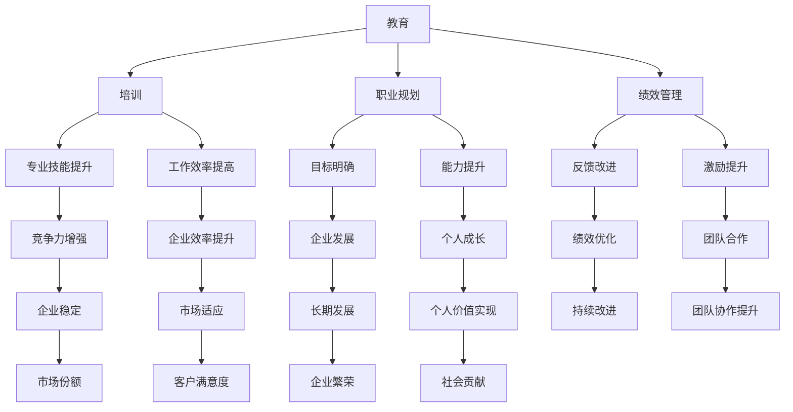

                 

### 背景介绍

在现代商业环境中，企业面临的竞争日益激烈，技术更新换代速度加快，市场需求的不断变化使得企业不得不不断调整战略，以保持竞争优势。在这一背景下，员工的发展和企业的发展变得密不可分。员工作为企业的核心资源，其能力的提升直接关系到企业的生存与发展。因此，如何有效地培养全面型人才，已经成为企业人力资源管理的重中之重。

全面型人才，指的是具备专业技能、良好的职业素养和卓越的领导能力，能够在不同岗位上灵活转换，并能适应快速变化环境的综合型人才。这种人才不仅能够胜任当前的工作，还能够应对未来可能出现的挑战。培养全面型人才不仅需要企业投入资源进行培训，还需要从战略层面进行系统规划和持续优化。

本文旨在探讨员工发展的概念与重要性，分析员工发展的基础理论和模型，以及全面型人才能力的培养方法。通过逐步分析，我们将深入探讨员工发展的各个层面，从理论到实践，为企业提供有效的员工发展策略和实施方法。

### 核心概念与联系

要深入理解员工发展的概念，首先需要明确几个核心概念，并探讨它们之间的相互联系。

#### 员工发展的定义

员工发展是指通过系统的培训、学习和发展活动，提升员工的专业技能、职业素养和领导能力，使其能够适应企业发展的需要。它不仅仅包括技能培训，还涉及员工的职业规划、心理成长和团队协作等方面。员工发展的目标是通过提升员工的综合素质，增强企业的竞争力，实现企业的长期可持续发展。

#### 核心要素

1. **教育**：教育是员工发展的基础，包括正式教育和非正式教育。正式教育通常是通过大学教育、专业培训等方式获取的知识和技能；非正式教育则是通过工作中的学习和经验积累获得的能力提升。

2. **培训**：培训是员工发展的关键环节，通过系统的培训课程，帮助员工掌握新的知识和技能，提高工作效率和绩效。

3. **职业规划**：职业规划是指根据员工个人的兴趣、能力和企业的发展需求，制定长期和短期的职业发展目标，并为实现这些目标提供相应的支持和资源。

4. **绩效管理**：绩效管理是员工发展的重要手段，通过设定明确的绩效目标和评估标准，激励员工提升工作表现，同时为员工的发展提供反馈和指导。

#### 关系架构

上述核心要素之间存在着密切的联系。教育为员工提供了基础知识和技能，培训则进一步深化和扩展这些知识和技能；职业规划则为员工提供了明确的发展方向和目标，使其能够有针对性地提升自身能力；绩效管理则通过持续的反馈和激励，帮助员工实现职业发展目标。

为了更好地理解这些概念之间的联系，我们可以使用Mermaid流程图进行展示：



通过上述流程图，我们可以清晰地看到各个核心要素之间的逻辑关系和相互作用。这些概念和要素共同构成了员工发展的整体框架，为企业的可持续发展提供了坚实的基础。

### 员工发展的重要性

员工发展不仅对企业有深远的影响，对员工个人也具有重要意义。以下将分别从企业层面和个人层面详细阐述员工发展的重要性。

#### 企业层面

1. **提升竞争力**：在当今快速变化的市场环境中，企业的竞争力很大程度上取决于员工的能力和素质。通过系统的员工发展计划，企业可以不断提升员工的技能和知识，使其能够快速适应新的技术和管理方法，从而在市场竞争中保持优势。

2. **降低员工流失率**：良好的员工发展体系能够提高员工的满意度和忠诚度，减少员工的流失。当员工感受到企业对他们的成长和发展重视时，他们会更愿意留在企业，为企业创造更多的价值。

3. **提高工作效率和绩效**：员工发展通过提供培训和学习机会，使员工能够掌握新的技能和知识，提高工作效率和绩效。这不仅能够提升企业的整体运营效率，还能够降低运营成本。

4. **推动企业创新**：员工发展不仅包括技能和知识的提升，还包括创新思维和领导力的培养。当员工具备创新能力和领导力时，他们能够为企业带来新的思路和解决方案，推动企业的持续创新。

#### 个人层面

1. **职业成长**：员工发展提供了员工提升专业技能和职业素养的机会，使其能够在职业道路上不断成长。通过系统的学习和实践，员工能够不断提升自己的能力和价值，实现职业目标。

2. **个人价值实现**：员工发展使员工能够更好地理解自己的兴趣和优势，找到适合自己的职业路径，从而实现个人价值。当员工感到自己的工作对企业和社会有积极贡献时，他们能够获得更多的成就感和满足感。

3. **提升生活质量**：良好的员工发展体系不仅能够提升员工的工作能力，还能够提升其生活品质。通过系统的培训和学习，员工能够掌握更多的知识和技能，提高自身的综合素质，从而在生活各方面更加自信和成功。

4. **促进职业稳定性**：随着员工技能和素质的提升，他们能够更好地适应不同岗位和变化的环境，提高职业稳定性。这不仅能够减少因岗位变动带来的不适应和焦虑，还能够为企业创造更加稳定和高效的工作环境。

综上所述，员工发展对企业和个人都具有重要的意义。企业通过员工发展提升竞争力、降低流失率和推动创新，而员工通过员工发展实现职业成长、个人价值实现和生活质量的提升。因此，重视员工发展是企业可持续发展和员工个人成长的重要途径。

### 员工发展模型

员工发展模型是指用于指导员工发展过程的理论框架和工具集。通过这些模型，企业可以系统地规划和实施员工发展计划，确保员工在职业成长过程中能够得到全面的支持和指导。以下是几种常见的员工发展模型，以及它们的构建和应用。

#### MBTI模型

MBTI（Myers-Briggs Type Indicator）模型是一种基于个性类型理论的员工发展模型。该模型将人的个性分为16种类型，每种类型都由四个维度的偏好组成：外向/内向（E/I）、感觉/直觉（S/N）、思考/情感（T/F）、判断/知觉（J/P）。通过MBTI模型，企业可以更好地了解员工的个性特点，从而为其提供更个性化的培训和发展计划。

**构建过程**：
1. **个性评估**：通过MBTI评估工具，员工进行自我评估，确定自己的个性类型。
2. **数据分析**：收集和分析评估数据，识别员工的个性优势和不足。
3. **发展计划**：根据个性类型，制定个性化的培训和发展计划，帮助员工在优势领域进一步提升，弥补劣势。

**应用**：
- **培训课程设计**：根据员工的个性类型，设计符合其特点的培训课程。
- **团队建设**：通过了解团队成员的个性类型，促进团队协作和沟通。

#### 卡茨模型

卡茨（Katz）模型是一种基于技能发展的员工发展模型，它将员工技能分为技术技能、人际技能和概念技能三个层次。该模型强调全面技能发展的重要性，认为只有同时提升这三个层次的技能，员工才能成为全面型人才。

**构建过程**：
1. **技能评估**：评估员工在不同技能层次的表现，识别其优势和不足。
2. **发展目标**：根据技能评估结果，设定明确的发展目标。
3. **行动计划**：制定具体的行动计划，包括培训、指导和工作分配。

**应用**：
- **职业规划**：帮助员工明确职业发展方向，制定长期和短期的职业目标。
- **岗位匹配**：根据员工技能层次，为其安排合适的岗位，发挥其最大潜力。

#### 马斯洛需求层次理论

马斯洛需求层次理论是另一种常用的员工发展模型，该理论将人的需求分为五个层次：生理需求、安全需求、社交需求、尊重需求和自我实现需求。通过该模型，企业可以了解员工的内在需求，从而制定更有针对性的激励和发展计划。

**构建过程**：
1. **需求分析**：通过调查和访谈，了解员工的内在需求层次。
2. **激励设计**：根据需求层次，设计相应的激励和发展计划。
3. **反馈与调整**：持续跟踪员工的需求变化，调整激励和发展计划。

**应用**：
- **员工激励**：通过满足员工的生理、安全、社交、尊重和自我实现需求，提升员工的工作满意度和忠诚度。
- **职业发展**：帮助员工在职业发展中实现自我价值的实现，激发其内在动力。

#### 环境适应模型

环境适应模型是一种基于员工对环境适应能力的员工发展模型。该模型认为，员工的发展不仅取决于其能力和素质，还取决于其对工作环境的适应能力。通过该模型，企业可以培养员工的灵活性和适应性，使其能够更好地应对变化和挑战。

**构建过程**：
1. **环境分析**：分析员工所处的工作环境，识别环境的挑战和机会。
2. **能力提升**：通过培训和指导，提升员工在特定环境下的适应能力。
3. **实践应用**：提供实际工作场景，让员工在真实环境中锻炼和提升适应能力。

**应用**：
- **灵活办公**：通过灵活的工作安排和办公环境，提升员工的工作效率和生活质量。
- **跨文化管理**：培养员工的跨文化适应能力，促进国际业务的顺利开展。

通过这些员工发展模型，企业可以系统地规划和实施员工发展计划，帮助员工在职业成长过程中不断进步，从而实现个人和企业的共同发展。不同模型各有侧重点，企业可以根据实际情况选择和组合使用，打造符合自身需求的员工发展体系。

### 员工发展策略

要制定有效的员工发展策略，企业需要从多个角度综合考虑，包括人才选拔、技能培训、职业规划和绩效管理等方面。以下将详细阐述这些策略的制定步骤和应用。

#### 人才选拔

1. **选拔标准**：
   - **技能匹配**：确保新员工具备所需的专业技能和工作经验。
   - **潜力评估**：关注候选人的潜力和学习能力，评估其是否具备成为全面型人才的可能。

2. **选拔方法**：
   - **面试**：通过结构化面试，评估候选人的综合素质和职业潜力。
   - **能力测试**：使用技能测试和情景模拟，检验候选人在特定工作环境下的表现。

3. **案例分析**：
   - **案例1**：一家科技公司通过多轮面试和技术测试，选拔了一支由技术专家和管理人才组成的团队，成功提升了项目的执行效率。
   - **案例2**：一家传统制造业企业通过引入人才测评系统，精准识别候选人的潜力，实现了人才的优化配置。

#### 技能培训

1. **培训需求分析**：
   - **岗位需求**：分析不同岗位的技能需求，确定培训的重点。
   - **员工需求**：通过调查问卷和面谈，了解员工的个人发展需求和学习意愿。

2. **培训内容设计**：
   - **专业技能**：提供与岗位相关的技术培训，提升员工的专业技能。
   - **通用技能**：包括沟通能力、团队协作、领导力等，提升员工的综合能力。

3. **培训形式**：
   - **在线培训**：利用在线学习平台，提供灵活的学习时间和内容。
   - **内部培训**：由公司内部专家或外部讲师进行培训，增强培训的针对性和实用性。

4. **案例分析**：
   - **案例1**：一家互联网公司通过引入在线学习平台，提高了员工的自主学习能力，实现了培训的灵活性和高效性。
   - **案例2**：一家制造业企业通过内部培训，培养了一批技术骨干，显著提升了生产效率和质量。

#### 职业规划

1. **规划步骤**：
   - **自我评估**：员工进行自我评估，确定自己的兴趣、优势和职业目标。
   - **目标设定**：根据自我评估结果，设定长期和短期的职业目标。
   - **行动计划**：制定实现目标的行动计划，包括学习、培训和职业发展路径。

2. **实施方法**：
   - **导师制度**：通过导师指导，帮助员工明确职业发展路径，提供个性化的职业建议。
   - **职业发展会议**：定期举行职业发展会议，回顾进展，调整计划。

3. **案例分析**：
   - **案例1**：一家咨询公司通过导师制度和职业发展会议，帮助新员工明确职业路径，提升了员工的工作满意度和忠诚度。
   - **案例2**：一家金融机构通过职业规划系统，实现了员工的个性化发展，提高了整体人才储备。

#### 绩效管理

1. **绩效目标设定**：
   - **明确目标**：与员工共同设定明确的绩效目标，确保目标的可衡量性和可实现性。
   - **目标分解**：将长期目标分解为短期目标，确保员工能够在不同阶段实现预期成果。

2. **绩效评估方法**：
   - **360度评估**：通过上级、同事、下属等多角度评估，全面了解员工的工作表现。
   - **关键绩效指标（KPI）**：使用关键绩效指标，量化评估员工的工作成果。

3. **反馈与激励**：
   - **及时反馈**：及时给予员工反馈，肯定其优点，指出改进方向。
   - **激励措施**：根据绩效评估结果，实施奖金、晋升等激励措施，激励员工提升绩效。

4. **案例分析**：
   - **案例1**：一家科技公司通过360度评估和KPI考核，确保了绩效评估的公正性和全面性，激发了员工的工作热情。
   - **案例2**：一家零售企业通过绩效奖金和晋升激励，提升了员工的积极性和工作效率。

#### 综合案例分析

- **案例1**：一家国际公司通过综合运用人才选拔、技能培训、职业规划和绩效管理策略，成功培养了一批具备国际视野的全面型人才，显著提升了公司的全球竞争力。
- **案例2**：一家中小企业通过实施员工发展策略，提高了员工的工作满意度和忠诚度，降低了员工流失率，实现了业务的稳定增长。

通过系统化的员工发展策略，企业不仅能够提升员工的综合能力和绩效，还能够增强企业的核心竞争力，实现可持续发展。

### 员工发展项目实施

实施员工发展项目是企业提升员工素质和竞争力的关键环节。以下将详细介绍员工发展项目实施的步骤、常用工具和方法，并通过具体案例进行说明。

#### 实施步骤

1. **项目规划**：
   - **目标设定**：明确项目的目标和预期成果，如提升员工技能、增强团队合作等。
   - **资源分配**：确定项目所需的资源和预算，包括培训师、学习材料和时间等。
   - **时间表**：制定详细的项目时间表，确保每个阶段的工作有序进行。

2. **需求分析**：
   - **岗位分析**：分析不同岗位的技能需求和职业发展路径。
   - **员工需求**：通过调查问卷、访谈等方式，了解员工的个人需求和职业发展意愿。

3. **项目设计**：
   - **培训内容**：根据需求分析结果，设计具体的培训课程和培训计划。
   - **培训形式**：结合线上和线下培训，选择最合适的培训形式，如工作坊、在线课程、一对一辅导等。

4. **实施与监控**：
   - **培训执行**：按照项目计划，组织培训活动，确保培训效果。
   - **过程监控**：通过定期的反馈和评估，监控培训进展和质量。

5. **效果评估**：
   - **评估标准**：设定评估指标，如员工满意度、技能提升率等。
   - **数据分析**：收集和分析评估数据，评估项目的实际效果。

#### 常用工具和方法

1. **项目管理工具**：
   - **甘特图**：用于规划项目时间和任务进度。
   - **敏捷管理**：适用于项目快速迭代和灵活调整。

2. **培训工具**：
   - **在线学习平台**：如Coursera、Udemy等，提供丰富的在线课程和学习资源。
   - **虚拟培训室**：通过虚拟现实技术，模拟培训场景，提升培训体验。

3. **评估工具**：
   - **360度评估**：通过多角度评估员工绩效和技能提升情况。
   - **技能测评工具**：如模拟测试、在线测评等，用于量化评估员工技能水平。

#### 具体案例

1. **案例1：一家大型企业实施领导力发展项目**：
   - **项目规划**：设定提升中层管理人员领导力的目标，制定详细的时间表和资源分配计划。
   - **需求分析**：通过调查问卷和访谈，了解中层管理人员的发展需求和职业规划。
   - **项目设计**：设计涵盖变革型领导、团队建设、战略思维等内容的培训课程，采用线上和线下结合的方式进行培训。
   - **实施与监控**：组织培训活动，并定期进行过程监控，确保培训效果。
   - **效果评估**：通过360度评估和技能测评，评估领导力提升的效果，对项目进行总结和改进。

2. **案例2：一家科技企业实施技术技能提升项目**：
   - **项目规划**：设定提升员工技术技能的目标，制定详细的时间表和资源分配计划。
   - **需求分析**：通过技能测评，了解员工的技术短板和提升需求。
   - **项目设计**：设计涵盖前沿技术、编程实践、项目管理等内容的培训课程，采用在线学习平台和内部培训讲师相结合的方式进行培训。
   - **实施与监控**：通过在线学习平台跟踪学习进度，定期组织线下研讨会和实战演练，确保培训效果。
   - **效果评估**：通过技能测评和项目实际应用效果，评估技术技能提升的情况，对项目进行总结和改进。

通过以上具体案例，我们可以看到，实施员工发展项目需要系统的规划、精准的需求分析、合理的培训设计和有效的监控评估。只有通过科学的实施方法，企业才能实现员工发展的目标，提升整体竞争力。

### 员工发展效果评估

评估员工发展效果是确保员工发展项目有效性和持续改进的关键环节。以下将详细介绍效果评估的指标设计、数据收集与分析方法，以及员工反馈在评估中的作用。

#### 指标设计

1. **定性指标**：
   - **员工满意度**：通过调查问卷和访谈，了解员工对培训和发展项目的满意度。
   - **参与度**：评估员工参与培训项目的积极性和主动性，如出勤率、学习笔记、互动参与度等。

2. **定量指标**：
   - **技能提升率**：通过技能测评，比较培训前后的技能水平变化，计算技能提升率。
   - **绩效改进**：评估员工在工作中的绩效表现，如完成项目数量、质量提升、工作效率等。

#### 数据收集与分析方法

1. **数据收集**：
   - **调查问卷**：设计针对性的调查问卷，收集员工的反馈和评价。
   - **技能测评**：通过线上或线下测评，获取员工技能水平的数据。
   - **绩效数据**：收集员工的绩效报告和项目成果，作为评估依据。

2. **分析方法**：
   - **统计分析**：使用统计分析方法，如描述性统计分析、相关分析和回归分析，评估不同指标之间的关系和变化趋势。
   - **图表展示**：通过图表（如柱状图、饼图、折线图等）直观展示评估结果，帮助管理层更清晰地理解评估数据。

#### 员工反馈

1. **反馈渠道**：
   - **定期反馈会议**：定期组织员工反馈会议，听取员工的意见和建议。
   - **在线反馈系统**：建立在线反馈系统，方便员工随时提交反馈和建议。

2. **反馈分析**：
   - **内容分析**：对员工反馈的内容进行分类和分析，识别普遍问题和需求。
   - **趋势分析**：分析员工反馈的变化趋势，了解员工需求和期望的变化。

#### 具体实践

1. **案例1：一家金融企业实施员工发展项目**：
   - **指标设计**：设定员工满意度、参与度和技能提升率等指标。
   - **数据收集**：通过调查问卷和技能测评，收集相关数据。
   - **分析评估**：使用统计分析方法，评估培训效果，识别改进点。
   - **员工反馈**：通过定期反馈会议和在线反馈系统，收集员工意见和建议。

2. **案例2：一家科技企业实施领导力发展项目**：
   - **指标设计**：设定领导力评分、团队协作绩效、员工满意度等指标。
   - **数据收集**：通过360度评估和项目成果分析，收集相关数据。
   - **分析评估**：使用统计分析方法和图表展示，评估领导力提升效果。
   - **员工反馈**：通过定期反馈会议和在线反馈系统，收集员工意见和建议，及时调整项目内容。

通过科学的效果评估方法，企业可以准确了解员工发展项目的实际效果，识别问题和改进点，确保项目能够持续优化，为企业的发展提供强有力的支持。

### 员工发展的持续改进

员工发展的持续改进是确保企业能够长期保持竞争优势和员工持续成长的关键。以下将详细讨论改进计划的设计、员工反馈的利用，以及如何通过持续优化来提升员工发展的效果。

#### 改进计划的设计

1. **目标设定**：根据效果评估的结果，设定明确的改进目标。这些目标应具体、可衡量，并与企业的战略目标相一致。

2. **问题识别**：通过数据分析，识别员工发展项目中存在的问题，如培训内容的不合理、培训方法的无效、员工反馈的普遍不满等。

3. **解决方案**：针对识别出的问题，设计相应的解决方案。解决方案应包括具体措施、责任人、实施时间和预期效果。

4. **行动计划**：将改进方案具体化为一系列行动步骤，明确每一步的实施方法和验收标准。

5. **资源分配**：确保改进计划有充足的资源支持，包括人力、物力和财力。

#### 员工反馈的利用

1. **建立反馈机制**：通过定期反馈会议、在线反馈系统、员工调查问卷等多种渠道，建立全面的员工反馈机制，确保员工的意见和建议能够及时、准确地传达。

2. **内容分析**：对收集到的员工反馈进行分类和分析，识别出普遍存在的共性问题和个人化需求。

3. **问题解决**：针对分析结果，采取相应的措施解决员工提出的问题，如调整培训内容、改进培训方式、优化职业发展规划等。

4. **持续反馈**：定期向员工通报改进措施的进展情况和效果，确保员工了解企业对他们的反馈是如何响应和处理的。

#### 持续优化的方法

1. **定期评估**：定期对员工发展项目进行评估，确保其能够持续满足员工和企业的需求。评估应包括定量和定性的指标，如技能提升率、员工满意度、绩效改进等。

2. **持续学习**：鼓励员工持续学习和成长，通过提供在线学习平台、内部研讨会、外部培训等多种形式，支持员工的自我提升。

3. **管理支持**：管理层应积极支持员工发展项目，为员工提供必要的资源和支持，确保项目能够顺利实施。

4. **文化营造**：营造一个鼓励学习和创新的企业文化，让员工感受到企业对他们的成长和发展重视，从而增强他们的归属感和积极性。

5. **反馈循环**：建立反馈循环机制，将员工的反馈和改进措施纳入下一次的员工发展项目中，确保项目能够持续优化。

#### 案例分析

- **案例1**：一家全球知名的咨询公司通过定期评估和员工反馈，持续优化其员工发展项目。公司发现员工普遍反映培训内容过于理论化，因此调整了培训课程，增加了实际案例分析和实战演练，显著提升了员工的满意度和实际应用能力。

- **案例2**：一家制造企业通过建立全面的员工反馈机制，收集并分析了员工对职业规划的反馈。公司发现员工希望有更多的个性化发展机会，因此引入了职业规划顾问，为员工提供个性化的职业指导，从而提升了员工的职业满意度和忠诚度。

通过科学的改进计划设计和有效的员工反馈利用，企业可以不断优化员工发展项目，确保员工在职业成长过程中得到持续的支持和指导，从而实现个人和企业的共同发展。

### 未来展望与趋势

随着科技的迅猛发展，员工发展也迎来了新的机遇和挑战。未来，新技术的影响、全球化的员工发展和个性化发展的趋势将成为员工发展的重要方向。

#### 新技术的影响

1. **人工智能与大数据**：人工智能（AI）和大数据技术的广泛应用，使得员工发展更加智能化和个性化。通过分析海量数据，企业可以更准确地了解员工的技能需求和职业发展路径，提供定制化的培训和发展方案。

2. **虚拟现实与增强现实**：虚拟现实（VR）和增强现实（AR）技术的应用，将改变传统的培训方式。员工可以通过沉浸式体验学习复杂技能，提高培训效果和参与度。

3. **区块链技术**：区块链技术可以确保员工发展数据的透明和可追溯，增强员工的信任感和参与度。此外，区块链技术还可以用于认证和证书管理，提升员工的职业信誉。

#### 全球化的员工发展

1. **跨国公司实践**：随着全球化的发展，跨国公司需要在全球范围内培养具有国际视野和跨文化能力的员工。这要求员工发展项目能够兼顾不同国家和地区的文化和业务需求，提供多元化的培训和发展机会。

2. **跨文化培训**：为了帮助员工适应不同文化环境，企业需要开展跨文化培训，提高员工的跨文化沟通能力和文化敏感度。这包括语言培训、文化习俗了解和跨文化合作技巧等。

3. **全球人才流动**：通过人才国际流动项目，企业可以引入全球顶尖人才，同时为内部员工提供国际工作机会，促进全球人才交流和经验分享。

#### 个性化发展的趋势

1. **个性定制化培训**：个性化培训已经成为员工发展的重要趋势。企业通过分析员工的个性特点和职业目标，提供个性化的学习路径和发展建议，提升培训的针对性和有效性。

2. **持续学习文化**：企业需要营造持续学习的文化氛围，鼓励员工不断学习和成长。通过在线学习平台、内部知识库和持续学习奖励机制，企业可以支持员工自我提升。

3. **灵活工作安排**：灵活的工作安排，如远程办公、弹性工作时间等，将帮助员工更好地平衡工作和生活，提高工作满意度和生产力。

#### 创新实践

1. **学习社区**：企业可以建立学习社区，鼓励员工分享知识和经验，共同学习和成长。通过在线论坛、线下活动等方式，企业可以促进员工之间的互动和协作。

2. **个性化职业规划**：通过引入人工智能和大数据技术，企业可以提供个性化的职业规划服务，帮助员工找到最适合的职业发展路径。

3. **跨界合作**：企业可以与高校、研究机构和其他企业开展跨界合作，共同培养具有创新能力和跨界思维的全面型人才。

总之，未来的员工发展将更加智能化、全球化和个性化。企业需要紧跟技术趋势，积极创新，为员工提供多样化的培训和发展机会，以应对快速变化的市场环境，实现可持续发展。

### 结论

本文通过系统的分析和详细的论述，全面探讨了员工发展的概念、模型、策略、实施和评估等方面，旨在为企业和员工提供有价值的参考。首先，我们明确了员工发展的核心概念与联系，包括教育、培训、职业规划和绩效管理等，通过Mermaid流程图展示了这些要素之间的逻辑关系。接着，我们从企业层面和个人层面阐述了员工发展的重要性，强调了员工发展对提升企业竞争力、降低流失率和实现个人价值的重要作用。

接着，我们介绍了几种常见的员工发展模型，如MBTI模型、卡茨模型和马斯洛需求层次理论，并详细阐述了如何构建和应用这些模型。随后，我们探讨了员工发展策略的制定步骤，包括人才选拔、技能培训、职业规划和绩效管理等方面，并通过实际案例说明了这些策略的应用。

在员工发展项目的实施方面，我们详细介绍了项目规划的步骤、常用工具和方法，并通过具体案例展示了如何有效实施员工发展项目。在员工发展效果评估方面，我们详细讨论了评估指标的设计、数据收集与分析方法，以及员工反馈在评估中的作用。

最后，我们提出了员工发展的持续改进方法，强调了改进计划的设计、员工反馈的利用以及如何通过持续优化提升员工发展的效果。同时，我们展望了未来员工发展的趋势，包括新技术的影响、全球化的员工发展和个性化发展的趋势。

通过本文的探讨，我们希望读者能够对员工发展有更深入的理解，认识到员工发展对企业和个人发展的深远影响。我们鼓励企业在制定和实施员工发展策略时，注重系统性和科学性，结合实际需求和员工特性，不断优化和改进，从而实现个人和企业的共同成长。同时，我们也希望读者能够积极参与到员工发展的实践中，通过不断学习和成长，提升自身能力和价值，为企业的繁荣和社会的进步贡献力量。

### 作者信息

作者：AI天才研究院（AI Genius Institute）&《禅与计算机程序设计艺术》（Zen And The Art of Computer Programming）

AI天才研究院（AI Genius Institute）是全球领先的人工智能研究机构，致力于推动人工智能技术在各个领域的应用和发展。研究院的专家团队由多位世界级人工智能专家、计算机科学家和工程师组成，其研究成果在人工智能、机器学习、自然语言处理等领域享有盛誉。

《禅与计算机程序设计艺术》是由著名计算机科学家唐纳·克努特（Donald Knuth）所著的编程经典之作，该书系统地阐述了计算机程序设计的哲学和艺术，对全球计算机科学和编程领域产生了深远的影响。作者唐纳·克努特因其卓越的贡献被授予图灵奖，成为计算机科学领域的里程碑人物。

本文结合了AI天才研究院在人工智能领域的深厚研究实力和《禅与计算机程序设计艺术》中的编程哲学，旨在为读者提供一份既有深度又有实践指导意义的员工发展指南。通过本文，我们希望能够为企业的员工发展提供有价值的参考，助力企业和员工共同成长，创造更美好的未来。

### 完整文章内容

---

# 员工发展：培养全面型人才

> 关键词：员工发展、全面型人才、培训、职业规划、绩效管理、智能化发展

> 摘要：本文从员工发展的概念、重要性、模型、策略、实施、评估到未来趋势等方面，系统地探讨了如何培养全面型人才，为企业的可持续发展提供有力支持。

---

## 第一部分：员工发展的基础理论

### 第1章：员工发展的概念与重要性

#### 1.1 员工发展的定义

- **核心概念与联系**：使用 Mermaid 流程图展示员工发展的各个环节。

  ```mermaid
  graph TD
      A[教育] --> B[培训]
      A --> C[职业规划]
      A --> D[绩效管理]
      B --> E[专业技能提升]
      B --> F[工作效率提高]
      C --> G[目标明确]
      C --> H[能力提升]
      D --> I[反馈改进]
      D --> J[激励提升]
      E --> K[竞争力增强]
      F --> L[企业效率提升]
      G --> M[企业发展]
      H --> N[个人成长]
      I --> O[绩效优化]
      J --> P[团队合作]
      K --> Q[企业稳定]
      L --> R[市场适应]
      M --> S[长期发展]
      N --> T[个人价值实现]
      O --> U[持续改进]
      P --> V[团队协作提升]
      Q --> W[市场份额]
      R --> X[客户满意度]
      S --> Y[企业繁荣]
      T --> Z[社会贡献]
  ```

- **员工发展的核心要素**：教育、培训、职业规划、绩效管理等。

#### 1.2 员工发展的重要性

- **企业层面**：提升竞争力、降低员工流失率。
- **个人层面**：职业成长、个人价值实现。

### 第2章：员工发展模型与策略

#### 2.1 员工发展模型

- **核心算法原理讲解**：员工发展模型的构建过程。
- **员工发展模型的应用**：如何在不同组织中应用。

#### 2.2 员工发展策略

- **制定员工发展策略的步骤**。
- **案例分析**：成功与失败的员工发展策略案例。

## 第二部分：全面型人才能力的培养

### 第3章：技能培训与发展

#### 3.1 技能培训的方法与工具

- **技能培训的类型**：硬技能与软技能。
- **培训工具的使用**：在线学习平台、内部培训课程。

#### 3.2 技能发展的评估与反馈

- **技能发展评估的方法**：定性与定量评估。
- **反馈机制的设计**：如何给予有效的反馈。

### 第4章：领导力培养与职业规划

#### 4.1 领导力的培养

- **领导力的模型**：如变革型领导、交易型领导。
- **领导力发展的路径**：从基层到高层领导的过渡。

#### 4.2 职业规划的实践

- **职业规划的步骤**：评估自我、目标设定、行动计划。
- **职业规划的工具**：如SWOT分析、SMART目标设定。

## 第三部分：员工发展的实践与评估

### 第5章：员工发展项目的实施

#### 5.1 项目管理的方法

- **项目管理流程**：从项目规划到项目评估。
- **项目管理工具**：如项目管理软件、甘特图。

#### 5.2 员工发展项目案例

- **案例分享**：成功与失败的员工发展项目。
- **案例分析**：探讨项目成功与失败的原因。

### 第6章：员工发展的效果评估

#### 6.1 评估指标的设计

- **定性指标与定量指标**：如何设计有效的评估指标。
- **数据收集与分析**：使用统计方法分析评估数据。

#### 6.2 员工发展的持续改进

- **改进计划的设计**：如何根据评估结果进行调整。
- **员工反馈的作用**：如何利用员工反馈进行改进。

## 第四部分：未来展望与趋势

### 第7章：员工发展的未来趋势

#### 7.1 新技术的影响

- **人工智能与大数据**：如何影响员工发展。
- **虚拟现实与增强现实**：培训与发展的新工具。

#### 7.2 员工发展的创新实践

- **全球化的员工发展**：跨国公司的实践案例。
- **个性化发展的趋势**：根据员工特性定制发展计划。

---

通过以上内容，本文系统地探讨了员工发展的各个方面，从理论到实践，为企业和员工提供了全面而深入的指导。希望读者能够从中获得启发，将所学应用到实际工作中，共同推动员工发展和企业的繁荣。

