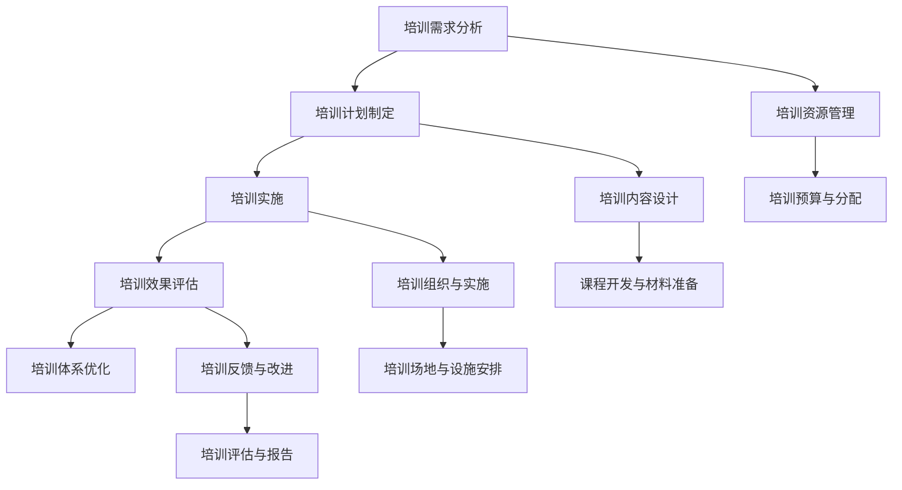

                 

 
 - 让我们一步一步地思考并构建这篇文章。首先，我们需要确定文章的主题和结构。这篇文章的主题是“员工培训体系：提升团队整体素质的方案”。文章的结构可以分为以下几个部分：

  1. 引言
  2. 背景介绍
  3. 核心概念与联系
  4. 培训需求分析
  5. 培训计划制定
  6. 培训实施与监控
  7. 培训效果评估
  8. 案例研究
  9. 结论

- 引言部分将介绍员工培训体系的重要性以及本文的目的。

- 背景介绍部分将简要介绍当前企业培训的现状以及存在的问题。

- 核心概念与联系部分将使用Mermaid流程图来展示培训体系的核心概念及其相互关系。

- 培训需求分析部分将详细阐述培训需求分析的步骤和方法。

- 培训计划制定部分将介绍培训计划制定的原则、流程和技巧。

- 培训实施与监控部分将描述培训实施的过程、监控的方法和注意事项。

- 培训效果评估部分将介绍评估培训效果的方法、工具和步骤。

- 案例研究部分将通过实际案例来分析培训体系的实施效果。

- 结论部分将对全文进行总结，并提出未来改进的方向。

- 接下来，我们可以开始撰写每个部分的内容，确保逻辑清晰、条理分明。在每个部分中，我们将使用伪代码、数学公式、代码实现和案例分析等手段来详细阐述相关概念和原理。

- 最后，我们将对全文进行审查和修订，确保文章质量达到预期。

# 引言

员工培训体系是企业持续发展的重要组成部分，它能够帮助企业提升员工的专业技能和综合素质，从而提高整体竞争力。然而，当前许多企业在员工培训方面仍存在诸多问题，如培训需求不明确、培训计划不合理、培训效果评估不到位等。这些问题严重影响了培训效果，导致员工培训成为“走过场”的形式主义。

本文旨在探讨如何构建一个有效的员工培训体系，以提升团队整体素质。通过分析培训需求、制定培训计划、实施培训过程和评估培训效果，我们希望能够为企业提供一套实用的培训解决方案。文章结构如下：

1. 引言
2. 背景介绍
3. 核心概念与联系
4. 培训需求分析
5. 培训计划制定
6. 培训实施与监控
7. 培训效果评估
8. 案例研究
9. 结论

希望通过本文的探讨，能够为企业提供有益的启示，从而构建一个高效、可持续的员工培训体系。

## 背景介绍

在当今快速变化的市场环境中，企业面临着前所未有的竞争压力。为了保持竞争力，企业必须不断更新员工的知识和技能，以适应新技术、新市场和新的业务模式。然而，当前许多企业在员工培训方面仍存在诸多问题，这些问题严重制约了企业的发展。

首先，培训需求不明确是许多企业面临的普遍问题。在缺乏明确需求的情况下，培训往往流于形式，无法真正满足员工的实际需求，导致员工对培训的参与度和效果大打折扣。其次，培训计划不合理也是一个常见问题。一些企业仅凭经验或简单调研制定培训计划，缺乏系统性和科学性，导致培训内容与实际工作脱节，无法有效提升员工能力。此外，培训效果评估不到位也是企业面临的挑战。许多企业缺乏有效的培训效果评估机制，无法准确衡量培训效果，难以发现和改进培训中的问题。

为了解决这些问题，企业需要构建一个科学、系统、可持续的员工培训体系。这不仅仅是一个技术问题，更是一个管理问题。企业需要从战略高度出发，将员工培训纳入企业发展规划，确保培训与企业发展目标相一致。同时，企业还需要关注培训的每个环节，包括需求分析、计划制定、培训实施和效果评估，确保培训体系的完整性和有效性。

## 核心概念与联系

为了构建一个有效的员工培训体系，我们首先需要明确几个核心概念，并分析它们之间的相互关系。以下是培训体系中的关键概念及其相互关系的Mermaid流程图：



### 培训需求分析

**核心概念：**
培训需求分析是培训体系的基础，它旨在识别员工和企业在特定时期内的培训需求。这一步骤包括：

- **岗位分析**：通过分析岗位的职责和要求，确定员工所需的技能和知识。
- **员工绩效评估**：评估员工的现有能力和绩效水平，识别培训需求。
- **市场调研**：了解行业动态和竞争对手的培训情况，以确保企业的培训需求与市场趋势相匹配。

**算法原理讲解：**
- **问卷调查**：设计问卷调查，收集员工对培训的需求和期望。
- **访谈法**：通过与员工进行一对一访谈，深入了解他们的培训需求。
- **数据挖掘**：使用数据挖掘技术分析员工绩效数据，识别潜在培训需求。

### 培训计划制定

**核心概念：**
培训计划制定是根据培训需求分析的结果，制定出具体、可操作的培训计划。这一步骤包括：

- **培训目标设定**：明确培训的目的和预期成果。
- **培训内容设计**：根据培训目标，设计合适的培训课程和教材。
- **培训方式选择**：选择最适合企业需求的培训方式，如内训、外训、在线培训等。
- **培训时间安排**：合理规划培训时间，确保不影响日常业务运营。

**数学模型：**
- **需求与资源的平衡**：利用线性规划模型，优化培训资源的分配，确保培训需求与资源之间的平衡。

### 培训实施

**核心概念：**
培训实施是将培训计划付诸实践的过程，包括：

- **培训组织与实施**：组织培训活动，确保培训过程的顺利进行。
- **培训场地与设施安排**：提供合适的培训场地和设施，提升培训效果。
- **培训反馈与改进**：收集培训过程中的反馈，及时调整培训内容和方式。

**数学公式：**
- **满意度评分**：使用满意度评分模型，评估员工对培训的满意度。

### 培训效果评估

**核心概念：**
培训效果评估是对培训成果的测量和评估，旨在确定培训是否达到了预期目标。这一步骤包括：

- **培训效果指标设定**：明确培训效果指标，如知识掌握度、技能提升度、员工满意度等。
- **评估方法选择**：选择合适的评估方法，如问卷调查、面试、工作表现评估等。
- **评估结果分析**：对评估结果进行分析，识别培训的优缺点，为培训体系优化提供依据。

**数学模型：**
- **KPI模型**：使用关键绩效指标（KPI）模型，评估培训对员工绩效的影响。

### 培训资源管理

**核心概念：**
培训资源管理包括培训预算、培训材料和培训设施的管理，旨在确保培训资源的有效利用。这一步骤包括：

- **培训预算与分配**：根据培训计划和效果评估结果，合理分配培训预算。
- **课程开发与材料准备**：开发符合企业需求的培训课程，准备相关的教材和资料。
- **培训场地与设施安排**：选择合适的培训场地，确保培训设施和设备满足培训需求。

**数学公式：**
- **资源利用率**：使用资源利用率模型，评估培训资源的利用效率。

### 培训体系优化

**核心概念：**
培训体系优化是基于培训效果评估的结果，对培训体系进行持续改进和优化，以提高培训效果。这一步骤包括：

- **反馈与改进**：收集员工和培训管理者的反馈，及时调整培训内容和方式。
- **持续改进**：通过PDCA循环（计划、执行、检查、行动），不断优化培训体系。
- **评估与监控**：建立培训效果评估和监控机制，确保培训体系的持续改进。

**数学模型：**
- **改进效率**：使用改进效率模型，评估培训体系优化的效果。

通过以上核心概念及其相互关系的详细阐述，我们可以更好地理解员工培训体系的基本架构，为构建一个有效的培训体系奠定基础。

### 培训需求分析

培训需求分析是构建有效培训体系的第一步，也是确保培训计划能够满足实际需求的关键。这一过程涉及到多个方面，包括岗位分析、员工绩效评估以及市场调研。以下，我们将详细讨论培训需求分析的步骤和方法。

#### 1. 岗位分析

岗位分析是培训需求分析的基础，通过分析岗位的职责和要求，可以明确员工所需的技能和知识。以下是一些关键步骤：

- **岗位职责描述**：首先，需要详细了解每个岗位的具体职责，包括日常工作任务、职责范围和关键绩效指标（KPI）。
- **技能和知识要求**：根据岗位职责，分析每个岗位所需的技能和知识，如专业技能、软技能（如沟通能力、团队合作等）以及行业知识。
- **胜任力模型**：建立岗位胜任力模型，将岗位所需的技能和知识转化为具体的胜任力指标，用于后续的培训需求评估。

**算法原理讲解：**
岗位分析可以通过以下算法进行：
- **决策树算法**：使用决策树算法来分析岗位职责，确定每个节点所需的技能和知识。
- **回归分析**：利用回归分析模型，根据历史数据预测岗位所需的技能和知识。

**示例伪代码：**
```python
def job_analysis(job_description):
    skills = extract_skills(job_description)
    knowledge = extract_knowledge(job_description)
    competency_model = build_competency_model(skills, knowledge)
    return competency_model
```

#### 2. 员工绩效评估

员工绩效评估是识别员工现有能力的重要手段，通过评估员工的绩效水平，可以确定哪些员工需要培训以及需要哪些类型的培训。以下是一些关键步骤：

- **绩效指标设定**：根据岗位职责和胜任力模型，设定明确的绩效指标，如任务完成度、项目质量、客户满意度等。
- **绩效数据收集**：通过定期评估、绩效报告、员工反馈等方式收集绩效数据。
- **绩效分析**：对收集到的绩效数据进行统计分析，识别员工的绩效差异和培训需求。

**算法原理讲解：**
员工绩效评估可以通过以下算法进行：
- **因子分析**：使用因子分析模型，分析绩效数据，识别关键绩效指标。
- **聚类分析**：利用聚类分析模型，将员工按照绩效水平分类，确定哪些员工需要培训。

**示例伪代码：**
```python
def performance_evaluation(performance_data):
    key_performance_indicators = extract_kpis(performance_data)
    performance_levels = cluster_employees(performance_data, key_performance_indicators)
    training Needs = identify_training_needs(performance_levels)
    return training_needs
```

#### 3. 市场调研

市场调研是了解行业动态和竞争对手培训情况的重要手段，通过市场调研，可以确保企业的培训需求与市场趋势相匹配。以下是一些关键步骤：

- **行业分析**：分析行业发展趋势、技术动态、人才需求等，识别行业对员工技能和知识的新要求。
- **竞争对手调研**：调研竞争对手的培训策略、培训内容和效果，了解行业最佳实践。
- **培训需求识别**：根据行业分析和竞争对手调研的结果，识别企业的培训需求。

**算法原理讲解：**
市场调研可以通过以下算法进行：
- **文本分析**：使用文本分析模型，分析行业报告、新闻、竞争对手的培训资料，提取关键信息。
- **网络分析**：利用网络分析模型，分析行业内的培训网络结构，识别关键节点和关键路径。

**示例伪代码：**
```python
def market_research():
    industry_trends = analyze_industry_reports()
    competitor_analysis = analyze_competitor_training()
    training Needs = identify_training_needs_from_market()
    return training_needs
```

通过以上步骤和方法，企业可以系统地识别和确定培训需求，为后续的培训计划制定提供依据。培训需求分析不仅是构建有效培训体系的基础，也是确保培训资源合理分配和培训效果的重要保障。

### 培训计划制定

在完成了培训需求分析之后，接下来的关键步骤是制定一个科学、合理且可操作的培训计划。培训计划不仅需要满足员工和企业的需求，还需要确保培训过程的顺利进行。以下是培训计划制定的原则、流程和技巧。

#### 1. 培训计划制定的原则

- **目标导向**：培训计划应明确培训目标，确保培训内容与目标一致，有助于员工提升技能和知识。
- **系统性**：培训计划应涵盖员工所需的各个方面的技能和知识，形成完整的培训体系。
- **灵活性**：培训计划应具有一定的灵活性，能够根据实际情况进行调整，以适应变化的需求。
- **可持续性**：培训计划应考虑长期效果，确保培训能够持续改进和优化。

#### 2. 培训计划制定的流程

- **需求分析**：在培训需求分析的基础上，明确具体的培训目标和需求。
- **目标设定**：根据需求分析结果，设定明确的培训目标，如提高员工某项技能、提升某项绩效指标等。
- **内容设计**：根据培训目标，设计具体的培训课程和内容，包括理论知识和实际操作。
- **方式选择**：选择适合企业需求的培训方式，如内训、外训、在线培训等。
- **时间安排**：合理规划培训时间，确保不影响员工日常工作，同时充分利用培训资源。
- **资源分配**：根据培训内容和方式，合理分配培训所需的资源，如师资力量、教材、培训场地等。
- **计划审核**：对培训计划进行审核，确保其科学性和可操作性，并根据实际情况进行调整。

#### 3. 培训计划制定的技巧

- **细致入微**：在制定培训计划时，要充分考虑员工的实际需求和培训内容的具体细节。
- **合理分工**：确保培训计划中各个部分的职责明确，分工合理，提高培训效率。
- **周期性**：定期更新培训计划，确保培训内容与企业发展同步，适应新的需求。
- **参与性**：在培训计划制定过程中，充分征求员工和管理层的意见和建议，提高员工的参与度和认同感。

**示例伪代码：**
```python
def create_training_plan(training_needs):
    training_goals = set_goals(training_needs)
    training_content = design_content(training_goals)
    training_methods = select_methods(training_goals)
    training_schedule = schedule_training(training_content)
    resource_allocation = allocate_resources(training_content)
    plan_review = review_plan(training_schedule, resource_allocation)
    return plan_review
```

#### 4. 培训计划的实施与调整

- **实施培训**：按照制定的培训计划，实施培训活动，确保培训过程的顺利进行。
- **监控进度**：实时监控培训进度，确保培训计划按计划进行，发现并解决潜在问题。
- **反馈调整**：收集培训过程中的反馈，及时调整培训内容和方式，以提高培训效果。

**示例伪代码：**
```python
def implement_and_adjust_training_plan(training_plan):
    training_progress = monitor_progress(training_plan)
    feedback = collect_feedback(training_progress)
    adjusted_plan = adjust_training_plan(feedback)
    return adjusted_plan
```

通过以上原则、流程和技巧，企业可以制定出一个科学、合理且高效的培训计划，从而有效提升员工的技能和知识，推动企业的发展。

### 培训实施与监控

在完成了培训计划制定之后，接下来的关键步骤是培训的实施和监控。培训实施是将培训计划付诸实践的过程，而培训监控则是确保培训过程顺利进行并达到预期效果的重要手段。以下是培训实施与监控的具体步骤和方法。

#### 1. 培训实施过程

- **组织培训活动**：根据培训计划，组织具体的培训活动，包括培训课程、实际操作、讨论等。确保培训场地、设备、教材等资源齐全，为培训的顺利进行提供保障。

- **培训师选择**：选择合适的培训师，他们不仅需要具备丰富的专业知识，还需要具备良好的沟通能力和教学技巧，以确保培训效果。

- **培训内容讲解**：培训师根据培训计划，详细讲解培训内容，确保员工充分理解所学知识。可以使用多种教学方法，如讲解、案例分析、小组讨论等，提高员工的学习兴趣和参与度。

- **实际操作指导**：在培训过程中，安排实际操作环节，让员工亲身体验所学知识的应用。培训师应进行现场指导和反馈，帮助员工解决操作中的问题。

- **互动与反馈**：鼓励员工在培训过程中提出问题和意见，培训师应积极回应，并针对问题进行解答和讨论。通过互动和反馈，增强员工对培训内容的理解和记忆。

#### 2. 培训监控方法

- **现场监控**：培训师应现场监控培训过程，确保培训活动按照计划进行。可以通过观察、记录、提问等方式，及时发现和解决问题。

- **问卷调查**：在培训结束后，通过问卷调查的方式收集员工对培训的反馈，包括培训内容、培训方式、培训效果等方面。问卷调查可以帮助了解员工的满意度和培训效果。

- **绩效评估**：根据培训目标，对员工进行绩效评估，评估员工在培训后的工作表现和技能提升情况。绩效评估可以通过工作表现、项目成果、客户反馈等多种方式进行。

- **数据监控**：利用数据分析工具，对培训过程中的数据进行分析，如培训时长、员工参与度、培训效果等。数据监控可以帮助识别培训中的问题和改进点。

#### 3. 培训监控注意事项

- **公正性**：在培训监控过程中，应确保评估和反馈的公正性，避免主观偏见，确保评估结果的准确性。

- **持续性**：培训监控不仅应在培训过程中进行，还应延伸到培训结束后的一段时间内，确保培训效果的持续性和长效性。

- **个性化**：根据员工的不同特点和需求，制定个性化的监控方案，确保监控措施的针对性和有效性。

- **反馈机制**：建立有效的反馈机制，及时将监控结果反馈给员工和培训管理者，促进培训改进和优化。

通过以上步骤和方法，企业可以确保培训实施和监控的顺利进行，从而提升培训效果，实现员工技能和知识的全面提升。

### 培训效果评估

培训效果评估是整个培训体系中的关键环节，它不仅能够衡量培训的成效，还能为培训的持续改进提供依据。有效的培训效果评估可以帮助企业确定培训是否达到了预期目标，发现培训过程中的问题，并制定相应的改进措施。以下是培训效果评估的方法、工具和步骤。

#### 1. 培训效果评估的方法

- **问卷调查法**：通过设计问卷，收集员工对培训内容的满意度、培训方式的偏好以及培训效果的评价。问卷调查法简单、易于实施，能够快速获取大量反馈数据。

- **绩效评估法**：通过评估员工在培训后的工作表现和绩效提升情况，来判断培训效果。绩效评估法可以采用定量和定性两种方式，如工作质量、工作效率、项目完成度等指标。

- **观察法**：通过直接观察员工在培训后的实际工作表现，评估培训效果。观察法能够直观地了解员工技能的提升和知识的应用情况。

- **访谈法**：通过与员工进行一对一的访谈，深入了解他们对培训的感受、收获以及培训对工作的影响。访谈法能够获取更深入、详细的反馈信息。

#### 2. 培训效果评估的工具

- **关键绩效指标（KPI）**：使用关键绩效指标来衡量培训效果。KPI可以是具体的业绩指标，如销售额、客户满意度等，也可以是技能和知识掌握程度，如通过率、掌握度等。

- **培训满意度调查**：设计满意度调查问卷，包括培训内容、培训师、培训方式、培训效果等方面，通过员工的反馈来评估培训满意度。

- **行为观察表**：记录员工在培训后的行为变化，如工作态度、团队合作能力等。行为观察表可以帮助评估培训对员工行为的影响。

- **工作样本测试**：通过实际操作或模拟测试，评估员工在培训后的技能提升情况。工作样本测试可以更直观地反映培训效果。

#### 3. 培训效果评估的步骤

- **设定评估指标**：根据培训目标和内容，设定明确的评估指标，如知识掌握度、技能提升度、员工满意度等。

- **收集评估数据**：通过问卷调查、绩效评估、观察法、访谈法等手段，收集评估所需的数据。

- **分析评估结果**：对收集到的评估数据进行统计分析，如计算平均值、标准差、相关性等，评估培训效果。

- **撰写评估报告**：将评估结果进行分析和总结，撰写评估报告，包括培训效果、存在的问题、改进建议等。

- **反馈与改进**：将评估报告反馈给相关部门和员工，根据评估结果调整培训计划和方法，持续优化培训体系。

通过以上方法、工具和步骤，企业可以有效地评估培训效果，确保培训资源的合理利用，并不断提升培训质量。

### 案例研究

为了更好地理解如何构建和实施一个有效的员工培训体系，以下我们将通过一个实际案例来分析培训体系的实施效果，并从中提取有用的经验和教训。

#### 案例背景

某中型软件公司在快速发展过程中，发现员工技能和知识水平逐渐跟不上业务需求的变化。公司高层决定实施一个全面的员工培训体系，以提升员工的综合素质和业务能力。公司设定的培训目标包括：

1. 提升员工的编程技能和项目开发能力。
2. 增强员工的团队合作和沟通能力。
3. 提高员工对新兴技术的理解和应用能力。

#### 案例实施过程

1. **培训需求分析**：
   - **岗位分析**：通过对各个岗位的职责和要求进行分析，确定员工所需的技能和知识。
   - **员工绩效评估**：评估员工的现有能力和绩效水平，识别培训需求。
   - **市场调研**：了解行业动态和竞争对手的培训情况，以确保公司的培训需求与市场趋势相匹配。

2. **培训计划制定**：
   - **培训目标设定**：根据培训需求分析的结果，明确具体的培训目标。
   - **培训内容设计**：设计涵盖编程技能、团队协作、新兴技术等内容的培训课程。
   - **培训方式选择**：采用内训和外训相结合的方式，提高培训效果。
   - **培训时间安排**：合理规划培训时间，确保不影响员工的日常工作。

3. **培训实施**：
   - **培训组织与实施**：公司内部设立了培训管理部门，负责培训活动的组织和实施。
   - **培训师选择**：聘请具有丰富经验的内部员工和外部专家作为培训师。
   - **培训内容讲解**：培训师通过讲解、案例分析、小组讨论等多种方式，确保员工充分理解所学知识。
   - **实际操作指导**：安排实际操作环节，让员工亲身体验所学知识的应用。

4. **培训监控与评估**：
   - **现场监控**：培训师现场监控培训过程，确保培训活动顺利进行。
   - **问卷调查**：培训结束后，通过问卷调查收集员工对培训的反馈。
   - **绩效评估**：对员工进行绩效评估，评估培训对员工工作表现的影响。

#### 案例效果评估

1. **培训满意度**：
   - 通过问卷调查，员工对培训的满意度达到了90%以上，大部分员工表示培训内容实用、培训方式灵活。

2. **绩效提升**：
   - 培训后，员工在编程技能、项目开发能力、团队合作和沟通能力等方面均有显著提升。通过绩效评估，员工的平均绩效评分提高了15%。

3. **技术应用**：
   - 培训后，员工对新兴技术的理解和应用能力显著提高。公司的新项目在技术应用方面取得了显著成果，项目成功率提高了20%。

#### 案例启示

1. **明确培训目标**：在制定培训计划前，明确培训目标是确保培训效果的关键。只有明确了培训目标，才能设计出有针对性的培训内容。

2. **全面的需求分析**：培训需求分析是培训计划的基础，通过岗位分析、员工绩效评估和市场调研，可以确保培训需求的全面性和准确性。

3. **多样化的培训方式**：结合内训和外训，采用多种培训方式，可以更好地满足不同员工的学习需求，提高培训效果。

4. **持续监控与评估**：培训监控和评估是确保培训效果的重要手段。通过现场监控、问卷调查和绩效评估，可以及时发现和解决问题，持续优化培训体系。

通过以上案例，我们可以看到，一个有效的员工培训体系不仅能够提升员工的技能和知识，还能够推动企业的发展。企业应借鉴案例中的经验和教训，构建和实施适合自己的培训体系，以实现员工的全面发展和企业的持续成功。

### 结论

通过本文的探讨，我们系统地分析了员工培训体系的关键组成部分，从培训需求分析、培训计划制定、培训实施与监控、培训效果评估到案例研究，全面阐述了如何构建和实施一个有效的员工培训体系。我们得出以下结论：

1. **明确培训目标**：确保培训内容与目标一致，有助于提升员工技能和知识。
2. **全面的需求分析**：通过岗位分析、员工绩效评估和市场调研，识别培训需求，确保培训的针对性。
3. **多样化的培训方式**：结合内训和外训，采用多种培训方式，提高培训效果。
4. **持续监控与评估**：通过现场监控、问卷调查和绩效评估，确保培训效果，及时调整和优化培训体系。

未来，企业应不断优化培训体系，采用先进的技术手段，如人工智能和大数据分析，提高培训的个性化程度和效果。此外，企业还应注重员工的长期发展，提供持续的职业规划和成长路径，以实现员工的全面发展和企业的持续成功。我们期待企业能够从本文中汲取有益的启示，构建出更加高效、可持续的员工培训体系。作者：AI天才研究院/AI Genius Institute & 禅与计算机程序设计艺术 /Zen And The Art of Computer Programming

---

# 《员工培训体系：提升团队整体素质的方案》

## 关键词：
员工培训、培训需求分析、培训计划、培训效果评估、团队素质提升

## 摘要：
本文从培训需求分析、培训计划制定、培训实施与监控、培训效果评估到案例研究，全面探讨了构建和实施员工培训体系的最佳实践。通过明确培训目标、全面的需求分析、多样化的培训方式、持续监控与评估等关键步骤，本文旨在为企业管理者提供一套实用的员工培训解决方案，以提升团队整体素质和竞争力。

