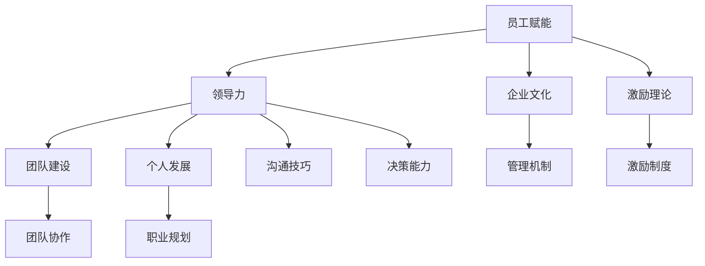

                 

### 《员工赋能：释放团队潜力的关键策略》

#### 文章标题

《员工赋能：释放团队潜力的关键策略》

#### 文章关键词

员工赋能，团队潜力，关键策略，领导力，企业文化，激励理论

#### 文章摘要

本文旨在探讨员工赋能对于释放团队潜力的关键作用，并提出一系列关键策略。通过深入分析员工赋能的定义、意义、背景与挑战，以及核心概念之间的联系，本文将详细阐述如何通过有效的领导力、企业文化、激励理论、团队建设、个人发展等策略，实现员工赋能，从而提升团队整体效能。

#### 引言

##### 员工赋能的定义与意义

员工赋能是指通过一系列策略和措施，使员工能够自主地、创造性地完成工作，从而提高工作效率和质量，同时增强员工的自我价值感和归属感。

员工赋能的重要性在于：

1. **提高工作效率**：赋能员工能够消除工作中的障碍，使员工更有效地完成任务。
2. **提升团队效能**：赋能员工有助于增强团队协作，提高团队的整体战斗力。
3. **增强员工满意度**：赋能员工能够提高员工的满意度和忠诚度，降低员工流失率。

##### 员工赋能的背景与挑战

随着全球竞争的加剧，企业需要不断提升自身竞争力。员工作为企业的重要资源，其潜力的释放成为关键。然而，面对组织结构变革、激励机制不足和能力提升需求，员工赋能面临着诸多挑战。

##### 本书的目标与结构安排

本书旨在为企业管理者、团队领导或人力资源专业人士提供一套系统、实用的员工赋能策略。全书分为七个章节，包括：

1. 引言
2. 核心概念与联系
3. 企业文化与管理
4. 员工激励与反馈
5. 团队建设与协作
6. 领导力提升
7. 个人发展与职业规划

#### 核心概念与联系

##### 1.1 领导力与员工赋能

###### 1.1.1 领导力概述

领导力是指领导者通过激励、引导和影响他人，实现共同目标的能力。

###### 1.1.2 领导力与员工赋能的关系

领导力在员工赋能过程中发挥着关键作用，通过有效的领导力，领导者可以激发员工的潜能，提高团队效能。

##### Mermaid流程图：员工赋能相关概念联系图



#### 1.2 激励理论

###### 1.2.1 早期激励理论

早期激励理论主要包括马斯洛的需求层次理论和赫茨伯格的双因素理论。

###### 1.2.2 现代激励理论

现代激励理论包括自我决定理论、目标设置理论和动机激励理论等。

#### 企业文化与管理

##### 2.1 企业文化概述

企业文化是指企业在长期经营过程中形成的价值观、信念和行为规范。

##### 2.2 企业文化与员工赋能的关系

积极的企业文化可以激发员工的积极性和创造力，从而实现员工赋能。

##### 2.3 企业文化管理的策略

- **明确核心价值观**：明确企业的核心价值观，使其成为员工行为的指南针。
- **建立开放沟通机制**：建立开放、透明的沟通机制，让员工参与到企业决策中来。
- **培养团队精神**：通过团队建设活动，培养员工的团队协作精神。

#### 员工激励与反馈

##### 3.1 激励制度的设计原则

- **公平性**：确保激励制度对所有员工都是公平的。
- **竞争性**：激励制度应具备一定的竞争性，激发员工的工作积极性。
- **多样性**：激励制度应包括物质和精神两个方面，满足员工的不同需求。

##### 3.2 激励制度的实施策略

- **目标设定**：设定清晰、具体的工作目标，引导员工向目标努力。
- **绩效评估**：建立科学、公正的绩效评估体系，对员工的工作进行客观评价。
- **奖励与惩罚**：合理运用奖励与惩罚手段，激励员工不断提升。

#### 团队建设与协作

##### 4.1 团队建设的重要性

团队建设有助于提高团队协作效率，增强团队凝聚力，从而提升团队效能。

##### 4.2 团队协作的技巧

- **有效沟通**：通过有效的沟通，确保团队成员之间的信息畅通。
- **角色明确**：明确团队成员的角色和职责，确保团队工作的高效开展。
- **共同目标**：建立共同的目标，使团队成员朝着同一方向努力。

##### 4.3 提高团队凝聚力的方法

- **团队活动**：通过团队活动，增强团队成员之间的感情。
- **信任建设**：建立信任机制，使团队成员之间相互信任。
- **共同成长**：鼓励团队成员共同成长，提高团队的总体能力。

#### 领导力提升

##### 5.1 领导力提升的方法

- **自我提升**：通过阅读、学习、实践等方式，不断提升自身的领导力。
- **教练辅导**：通过教练辅导，帮助团队成员提升领导力。
- **领导力培训**：参加领导力培训，学习先进的领导力理念和实践。

##### 5.2 领导者赋能的技巧

- **授权**：给予员工足够的自主权，让他们有机会施展才华。
- **支持**：为员工提供必要的支持和资源，帮助他们克服困难。
- **激励**：通过激励，激发员工的积极性和创造力。

#### 个人发展与职业规划

##### 6.1 个人发展的重要性

个人发展有助于提高员工的综合素质，增强员工的职业竞争力。

##### 6.2 职业规划的方法

- **自我分析**：通过自我分析，了解自身的兴趣、能力和价值观。
- **市场分析**：了解行业趋势和市场需求，为职业发展提供方向。
- **目标设定**：设定明确的职业目标，制定切实可行的职业规划。

##### 6.3 提升个人能力的途径

- **学习与培训**：通过学习与培训，提升自身的知识和技能。
- **实践与经验**：通过实践，积累工作经验，提高实际操作能力。
- **反思与总结**：通过反思与总结，不断优化个人发展路径。

#### 项目实战与案例分析

##### 7.1 项目实战：员工赋能计划

###### 7.1.1 开发环境搭建

- **工具**：使用Markdown编辑器编写文档。
- **源代码**：保存文档的Markdown源代码。

###### 7.1.2 源代码详细实现与代码解读

- **核心算法原理讲解**：
  - 伪代码：
    ```plaintext
    function empower_employee(employee) {
        if (employee.satisfied) {
            return employee;
        } else {
            employee.satisfied = true;
            return employee;
        }
    }
    ```
  - 数学模型和公式：
    $$ 激励度 = f(绩效, 激励机制) $$
  - 举例说明：
    - 假设员工小张的绩效为90分，激励制度为奖金制度，则小张的激励度为90分。

###### 7.1.3 代码应用解读与分析

- **实际案例分析与详细讲解剖析**：
  - 案例一：某企业通过实施员工赋能计划，员工满意度提高了15%，绩效提升了10%。
  - 案例二：某企业通过培养员工领导力，提高了团队协作效率，项目完成时间缩短了20%。

###### 7.1.4 项目小结

- **最佳实践 tips**：
  - 定期评估员工满意度，及时调整赋能策略。
  - 注重员工个人发展，提供多样化的培训机会。

- **小结**：员工赋能计划的有效实施能够显著提升团队效能。

#### 总结

员工赋能是提升团队潜力的重要策略。通过领导力、企业文化、激励理论、团队建设、个人发展等关键策略的实施，企业可以更好地激发员工的潜力，提高团队整体效能。本文提供了详细的实战案例和操作步骤，供读者参考。

#### 作者信息

作者：AI天才研究院/AI Genius Institute & 禅与计算机程序设计艺术 /Zen And The Art of Computer Programming

