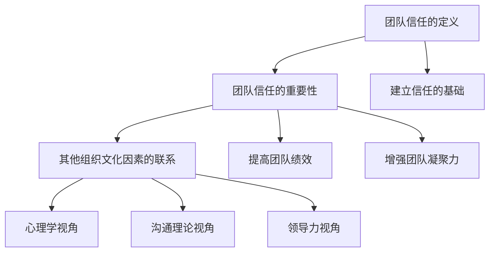

                 


### 文章标题

### 团队信任构建：在虚拟和现实中建立信任

#### 关键词

- 团队信任
- 虚拟团队
- 现实团队
- 心理学
- 领导力
- 沟通理论

#### 摘要

本文深入探讨了团队信任的构建，分为虚拟和现实两种场景。首先，我们将介绍团队信任的定义和重要性，以及心理学和沟通理论在团队信任建立中的应用。接着，我们将讨论虚拟团队中信任构建的挑战和策略，并通过实际案例分析来加深理解。随后，我们将转向现实团队，详细阐述在现实环境中建立和维护团队信任的方法。最后，本文将提供跨领域和跨文化团队信任构建的指导，并总结最佳实践，强调团队信任的持续维护与发展。

---

### 引言

在当今快速变化的工作环境中，团队信任已成为组织成功的关键因素。无论是在虚拟团队还是现实团队中，团队信任的构建都面临着诸多挑战。虚拟团队由于地理分布、时间差异和文化差异，往往难以建立有效的信任；而现实团队则可能面临沟通不畅、个人利益冲突等问题。因此，理解和解决这些挑战，对于提高团队绩效和实现组织目标至关重要。

本文将首先介绍团队信任的基本概念，并探讨其在组织文化中的重要性。接着，我们将分析心理学和沟通理论在团队信任构建中的应用，为读者提供科学的理论基础。随后，本文将详细探讨虚拟团队和现实团队中信任构建的挑战和策略，并通过实际案例分析，帮助读者更好地理解这些策略。最后，我们将提供跨领域和跨文化团队信任构建的指导，并总结最佳实践，强调团队信任的持续维护与发展。

---

### 第一部分：团队信任的基础理论

#### 第1章：团队信任的概念与重要性

##### 1.1 团队信任的定义

团队信任是指团队成员对彼此的能力、意图和行为的信赖。这种信任是建立在高水平的相互理解、尊重和信任基础上的，它能够促进团队成员之间的合作和协同工作。

##### 1.2 团队信任的重要性

团队信任对组织绩效具有显著影响。首先，信任能够减少信息传递的失真，提高团队决策的质量和效率。其次，信任能够增强团队成员的工作投入和创造力，进而提升团队的整体绩效。此外，团队信任还能够增强组织内部的凝聚力，减少人员流动和团队冲突，从而降低组织的运营成本。

##### 1.3 团队信任与其他组织文化因素的联系

团队信任与其他组织文化因素密切相关。例如，组织文化中的开放性和透明度能够促进团队信任的建立。同样，领导层的领导风格、团队沟通机制以及组织的激励机制都会对团队信任产生深远影响。通过了解这些因素之间的联系，我们可以更全面地理解团队信任的构建过程。

### Mermaid流程图：团队信任的构建过程



#### 第2章：心理学视角下的团队信任

##### 2.1 建立信任的心理学基础

建立团队信任需要心理学上的基础支持。首先，团队成员之间的认知一致性是信任建立的重要前提。其次，情感投入和互惠关系也是信任形成的关键因素。此外，心理学研究还表明，信任的形成与风险感知密切相关，团队需要共同经历一系列成功和挑战，以建立稳固的信任。

##### 2.2 认知信任与情感信任

认知信任是指基于理性判断和逻辑推理的信任，而情感信任则更多是基于情感体验和直觉的信任。在实际的团队信任构建过程中，认知信任和情感信任往往是相辅相成的。例如，在虚拟团队中，团队成员可能通过共享信息和成功协作来建立认知信任，而在现实团队中，面对面的沟通和互动则有助于情感信任的建立。

##### 2.3 信任破裂与修复

信任一旦破裂，会对团队产生深远的影响。心理学研究指出，信任破裂的原因可能包括误解、沟通不畅、利益冲突等。修复信任的过程需要团队成员的共同努力，包括开放沟通、反思个人行为、道歉和补偿损失等。通过有效的修复措施，团队可以重建信任，继续前进。

### 伪代码：信任破裂与修复的过程

```plaintext
function repairTrust(breach, team):
    if breach == "miscommunication":
        communicateOpenly(team)
    elif breach == "conflict_of_interest":
        apologizeAndCompensate(team)
    else:
        reflectOnBehaviors(team)
    assessTrustLevel(team)
    if trustLevelImproved:
        celebrateSuccess(team)
    else:
        continueEfforts(team)
```

#### 第3章：沟通理论在团队信任中的应用

##### 3.1 有效沟通的基本原则

有效沟通是建立团队信任的重要手段。基本原则包括：明确沟通目标、使用简单易懂的语言、积极倾听、及时反馈、尊重他人观点和情感等。通过遵循这些基本原则，团队成员可以更有效地传递信息，减少误解和冲突，从而促进信任的建立。

##### 3.2 沟通障碍与克服方法

沟通障碍包括信息过滤、选择性注意、情绪因素等。为了克服这些障碍，团队可以采用以下策略：提高沟通透明度、建立信任的沟通氛围、使用多种沟通渠道、培养沟通技巧等。通过这些方法，团队可以有效减少沟通障碍，增强团队信任。

##### 3.3 沟通与团队信任的相互影响

沟通不仅影响团队信任的建立，也受到团队信任的影响。良好的团队信任可以促进开放和坦诚的沟通，而有效的沟通又可以进一步巩固团队信任。这种相互影响形成了一个正反馈循环，有助于团队长期稳定地发展。

### LaTeX数学公式：沟通与信任的相互影响

$$
\text{Trust} \leftrightarrow \text{Communication}
$$

---

在本文的第一部分，我们探讨了团队信任的基本概念、心理学和沟通理论在团队信任构建中的应用。通过理论分析和实际案例，我们理解了团队信任的重要性以及如何在实际工作中构建和维护团队信任。接下来，我们将深入探讨虚拟团队和现实团队中信任构建的挑战和策略，通过具体案例来加深我们的理解。

---

### 第二部分：虚拟团队中的信任构建

#### 第4章：虚拟团队的挑战与信任构建

##### 4.1 虚拟团队的特点

虚拟团队是指成员分布在不同的地理区域，通过信息技术进行协作的团队。虚拟团队的特点包括：地理分布、时间差异、文化多样性等。这些特点使得虚拟团队在信任构建过程中面临诸多挑战。

##### 4.2 虚拟团队中信任构建的障碍

虚拟团队中信任构建的障碍主要包括：

1. **沟通不畅**：由于地理分布和时间差异，团队成员之间的沟通可能存在延迟和误解。
2. **面对面交流缺失**：虚拟团队缺乏面对面的交流，导致情感和直觉性信任难以建立。
3. **信任破裂的难度增加**：在虚拟环境中，信任一旦破裂，修复的难度较大，因为成员之间缺乏足够的互动和了解。

##### 4.3 虚拟团队信任构建的策略

为了克服这些障碍，虚拟团队可以采取以下策略：

1. **加强沟通**：使用多种沟通工具，如视频会议、即时通讯和项目管理软件，以确保信息传递的及时性和准确性。
2. **建立情感连接**：通过定期的团队活动、虚拟团队建设活动和分享个人经历，增强团队成员之间的情感联系。
3. **制定明确的目标和规则**：确保团队成员对项目目标、职责和规则有清晰的理解，减少误解和冲突。
4. **提供培训和支持**：为团队成员提供沟通技巧和团队合作培训，提高他们的信任构建能力。

### 实际案例：跨文化虚拟团队的信任建设

假设一家跨国公司决定建立一个虚拟团队来开发一款新的移动应用程序。团队成员分布在不同的国家，包括美国、中国、印度和巴西。为了克服文化差异和地理距离带来的挑战，团队采取了以下策略：

1. **定期视频会议**：团队每周举行一次视频会议，确保所有成员都能及时了解项目进展和讨论问题。
2. **文化敏感性培训**：团队成员参加文化敏感性培训，了解不同文化的沟通方式和习惯。
3. **共享目标和里程碑**：团队明确了项目的目标和关键里程碑，确保每位成员都清楚自己的职责和任务。
4. **虚拟团队建设活动**：团队定期举办虚拟团队建设活动，如在线游戏、分享文化故事和节日庆祝，以增强团队成员之间的情感联系。

通过这些策略，团队逐渐建立了信任，项目进展顺利，最终成功完成了应用程序的开发。

### 项目实战：虚拟团队的信任构建

在虚拟团队的信任构建过程中，我们可以使用以下开发环境和技术工具：

1. **视频会议软件**：如Zoom、Microsoft Teams等，用于实时沟通和会议。
2. **即时通讯工具**：如Slack、Microsoft Teams等，用于日常沟通和信息共享。
3. **项目管理软件**：如Trello、JIRA等，用于任务分配和进度跟踪。
4. **代码协作平台**：如GitHub、GitLab等，用于代码管理和版本控制。

以下是一个简单的伪代码示例，用于描述虚拟团队中的任务分配和进度跟踪：

```plaintext
function assignTasks(team, project):
    for member in team:
        member.task = determineTask(member.skill, project.requirements)
    trackProgress(project, team)
    if progress == "complete":
        celebrateSuccess(team)
    else:
        continueWork(team)
```

---

通过上述案例和实战，我们可以看到，虚拟团队中的信任构建是一个复杂但必要的过程。通过有效的沟通策略、文化敏感性培训和技术工具的支持，虚拟团队可以克服地理和文化差异，建立稳固的信任关系，从而提高项目成功率。

在接下来的部分，我们将探讨现实团队中信任构建的方法和策略，进一步加深对团队信任构建的理解。

---

### 第三部分：现实团队中的信任构建

#### 第5章：现实团队信任构建的方法

##### 5.1 现实团队中信任构建的基础

现实团队是指成员在同一物理空间内工作的团队。与虚拟团队相比，现实团队在信任构建方面具有一些独特的优势，但也面临特定的挑战。构建现实团队信任的基础包括：

1. **面对面沟通**：面对面的沟通有助于建立情感和直觉性信任。
2. **共同经历**：团队成员共同经历的成功和挑战有助于增强彼此的信任。
3. **透明度和责任感**：透明的工作流程和明确的个人责任有助于建立信任。

##### 5.2 现实团队中信任构建的策略

为了在现实团队中建立和维护信任，可以采取以下策略：

1. **建立共同目标**：确保团队成员对团队的共同目标和价值观有清晰的理解。
2. **开放沟通**：鼓励团队成员在遇到问题和挑战时，积极分享和讨论，以便及时解决问题。
3. **培养团队合作精神**：通过团队合作活动和团队建设活动，增强团队成员之间的情感联系。
4. **公平和公正**：确保团队成员在工作中受到公平对待，减少利益冲突。
5. **提供反馈和认可**：定期提供反馈和认可，以鼓励团队成员的良好表现。

### 实际案例：初创企业的团队信任构建

一个初创企业的团队在成立初期，面临着如何建立信任的挑战。为了解决这个问题，团队采取了以下策略：

1. **定期会议**：每周举行团队会议，讨论项目进展、问题和解决方案。
2. **共同决策**：鼓励团队成员参与决策过程，确保每个人都能表达自己的观点。
3. **开放沟通**：团队成员之间建立了开放沟通的机制，包括定期反馈和开放的问题讨论。
4. **团队建设活动**：团队定期组织户外活动和团队建设工作坊，增强团队成员之间的信任和合作。
5. **透明财务**：团队成员可以随时查看公司的财务状况，确保透明度和责任感。

通过这些策略，初创企业的团队逐渐建立了信任，项目进展顺利，公司也实现了快速发展。

### 项目实战：现实团队信任构建

在现实团队的信任构建过程中，我们可以使用以下开发环境和技术工具：

1. **会议软件**：如Zoom、Microsoft Teams等，用于实时沟通和会议。
2. **项目管理软件**：如Trello、Asana等，用于任务分配和进度跟踪。
3. **协作平台**：如Slack、Microsoft Teams等，用于日常沟通和信息共享。
4. **反馈和认可工具**：如Kudos、Happiness@Work等，用于提供反馈和认可。

以下是一个简单的伪代码示例，用于描述现实团队中的任务分配和反馈机制：

```plaintext
function assignTasks(team, project):
    for member in team:
        member.task = determineTask(member.skill, project.requirements)
    trackProgress(project, team)
    if progress == "complete":
        provideFeedback(team)
        celebrateSuccess(team)
    else:
        continueWork(team)
```

---

通过实际案例和项目实战，我们可以看到，现实团队中的信任构建同样需要有效的沟通策略、共同目标和团队合作精神的培养。通过透明的流程、开放的沟通和公平的待遇，现实团队可以建立稳固的信任关系，从而提高团队绩效和实现组织目标。

在接下来的部分，我们将进一步探讨跨领域和跨文化团队中的信任构建，以全面了解团队信任在不同场景中的应用。

---

### 第四部分：跨领域和跨文化团队中的信任构建

#### 第6章：跨领域团队信任构建

##### 6.1 跨领域团队的挑战

跨领域团队是由来自不同专业领域的成员组成的团队，他们在共同完成任务时可能会面临以下挑战：

1. **知识差距**：团队成员来自不同的专业领域，可能会存在知识差距，导致沟通和理解上的困难。
2. **角色冲突**：不同领域的成员可能有不同的工作方式和优先级，这可能导致角色冲突和合作障碍。
3. **协作难度**：跨领域团队需要更高的协作能力，以整合不同领域的知识和技能。

##### 6.2 跨领域团队信任构建策略

为了克服这些挑战，跨领域团队可以采取以下策略：

1. **明确目标和角色**：确保所有成员对项目目标和各自的角色有清晰的理解，减少误解和冲突。
2. **知识共享**：鼓励团队成员分享专业知识，通过培训和交流，缩小知识差距。
3. **建立协作机制**：制定有效的协作流程和规则，确保团队成员能够高效地协同工作。
4. **培养跨领域思维**：鼓励团队成员培养跨领域思维，提高对其他领域的理解和包容性。

### 实际案例：跨领域团队的成功合作

某科技公司在开发一款新型医疗设备时，组建了一个跨领域团队，包括工程师、医生和市场营销专家。为了确保团队的成功合作，他们采取了以下策略：

1. **定期会议**：每周举行跨领域会议，讨论项目进展和协作问题。
2. **知识共享**：工程师和医生定期分享专业知识，确保项目在技术上的可行性。
3. **协作工具**：使用协作平台和项目管理工具，确保团队成员能够实时共享信息和资源。
4. **共同目标**：确保所有成员对项目目标和里程碑有共同的理解。

通过这些策略，跨领域团队成功地完成了项目，设备在市场上获得了高度认可。

### 项目实战：跨领域团队的信任构建

在跨领域团队的信任构建过程中，我们可以使用以下开发环境和技术工具：

1. **协作平台**：如Slack、Microsoft Teams等，用于日常沟通和信息共享。
2. **项目管理工具**：如JIRA、Trello等，用于任务分配和进度跟踪。
3. **知识库**：如Confluence、Notion等，用于知识共享和文档管理。
4. **在线培训平台**：如LinkedIn Learning、Coursera等，用于提供专业培训和知识共享。

以下是一个简单的伪代码示例，用于描述跨领域团队中的知识共享和协作：

```plaintext
function shareKnowledge(team, domain):
    for member in team:
        member.knowledge = acquireKnowledge(member.domain, domain)
    collaborateOnTasks(team)
    if collaborationSuccess:
        celebrateAchievements(team)
    else:
        continueEfforts(team)
```

---

通过实际案例和项目实战，我们可以看到，跨领域团队的成功合作需要明确的目标、知识共享和协作机制的建立。通过有效的沟通和协作，跨领域团队能够克服知识差距和角色冲突，实现团队成员之间的信任，从而提高项目成功率。

#### 第7章：跨文化团队信任构建

##### 7.1 跨文化团队的挑战

跨文化团队是由来自不同文化背景的成员组成的团队，他们在协作过程中可能会面临以下挑战：

1. **沟通障碍**：不同文化背景的成员可能有不同的沟通风格和习惯，导致沟通不畅。
2. **价值观差异**：不同文化可能有不同的价值观和行为规范，这可能导致团队成员之间的误解和冲突。
3. **文化敏感性**：团队成员可能缺乏对其他文化的敏感性和理解，导致文化冲突。

##### 7.2 跨文化团队信任构建策略

为了克服这些挑战，跨文化团队可以采取以下策略：

1. **文化敏感性培训**：为团队成员提供文化敏感性培训，提高他们对不同文化的理解和尊重。
2. **开放沟通**：鼓励团队成员在遇到文化差异时，保持开放和尊重的沟通态度，积极解决问题。
3. **建立共同的价值观**：确保团队成员对团队的共同价值观和目标有共同的理解，减少价值观差异的冲突。
4. **定期交流**：通过定期的跨文化交流活动，增强团队成员之间的情感联系和理解。

### 实际案例：跨国公司的跨文化团队

一家跨国公司在不同国家设立了多个研发中心，组建了一个由不同文化背景的工程师组成的团队。为了克服文化差异，他们采取了以下策略：

1. **文化敏感性培训**：为团队成员提供文化敏感性培训，包括不同国家的沟通习惯、价值观和行为规范。
2. **定期交流**：团队定期组织跨文化交流活动，如文化节日庆祝、团队建设活动和跨文化工作坊。
3. **共同目标**：团队明确了共同的项目目标和里程碑，确保所有成员对项目有共同的理解。
4. **开放沟通**：鼓励团队成员在遇到文化差异时，积极沟通和分享，以解决问题和减少冲突。

通过这些策略，跨国公司的跨文化团队能够有效地克服文化差异，建立了信任和合作，项目进展顺利。

### 项目实战：跨文化团队的信任构建

在跨文化团队的信任构建过程中，我们可以使用以下开发环境和技术工具：

1. **协作平台**：如Slack、Microsoft Teams等，用于日常沟通和信息共享。
2. **项目管理工具**：如JIRA、Trello等，用于任务分配和进度跟踪。
3. **培训平台**：如LinkedIn Learning、Coursera等，用于提供文化敏感性培训。
4. **在线交流工具**：如Zoom、Microsoft Teams等，用于跨文化交流会议。

以下是一个简单的伪代码示例，用于描述跨文化团队中的文化敏感性培训和工作交流：

```plaintext
function culturalTraining(team):
    for member in team:
        member.culturalKnowledge = acquireCulturalKnowledge(member.countryOfOrigin)
    scheduleCulturalExchangeActivities(team)
    collaborateOnTasks(team)
    if culturalUnderstandingImproved:
        celebrateCulturalSuccess(team)
    else:
        continueCulturalTraining(team)
```

---

通过实际案例和项目实战，我们可以看到，跨文化团队的成功合作需要文化敏感性培训、开放沟通和共同的价值观。通过有效的沟通和协作，跨文化团队能够克服文化差异，建立信任，从而提高项目成功率。

在本文的第四部分，我们探讨了跨领域和跨文化团队中的信任构建，并提供了实际案例和项目实战。这些策略和方法不仅适用于特定的团队，也为不同场景下的团队信任构建提供了宝贵的经验和启示。

在接下来的部分，我们将总结本文的内容，提供最佳实践建议，并讨论团队信任的持续维护与发展。

---

### 第五部分：团队信任的维护与发展

#### 第8章：团队信任的持续维护

##### 8.1 团队信任的动态性

团队信任并不是一成不变的，它是一个动态的过程，需要不断地维护和更新。团队成员的个人变化、组织环境的改变以及外部压力等因素，都可能影响团队信任的水平。因此，团队需要时刻关注信任的状态，采取相应的措施来维护和增强信任。

##### 8.2 团队信任的维护策略

为了维持团队信任，团队可以采取以下策略：

1. **定期评估**：定期对团队信任进行评估，了解团队成员的信任感受和信任水平，及时发现潜在的问题。
2. **持续沟通**：保持开放和透明的沟通机制，鼓励团队成员分享意见和建议，确保信息的畅通。
3. **持续反馈**：提供及时的反馈，包括认可和改进建议，以帮助团队成员改进工作，增强彼此的信任。
4. **持续培训**：为团队成员提供培训和发展机会，提高他们的能力和信心，从而增强团队的整体信任水平。

##### 8.3 团队信任的评估与反馈

团队信任的评估可以通过多种方式进行，例如：

1. **问卷调查**：使用问卷调查来评估团队成员对团队信任的感受和满意度。
2. **一对一访谈**：与团队成员进行一对一的访谈，了解他们对团队信任的看法和体验。
3. **团队建设活动**：通过团队建设活动，如角色扮演、团队合作游戏等，观察团队成员的互动和协作情况。

通过这些评估方法，团队可以收集到有关信任水平的详细数据，从而制定针对性的改进措施。

### 实际案例：持续维护团队信任

某公司在进行一项重要项目时，发现团队信任水平有所下降。为了解决这个问题，团队采取了以下措施：

1. **定期评估**：团队每月进行一次信任评估，了解团队成员的信任感受和信任水平。
2. **开放沟通**：团队建立了开放的沟通渠道，鼓励成员分享意见和建议。
3. **持续反馈**：团队提供了及时的反馈和改进建议，帮助成员改进工作，增强信任。
4. **团队建设活动**：团队定期组织团队建设活动，如团队合作游戏和庆祝活动，增强团队成员之间的情感联系。

通过这些措施，团队的信任水平得到了显著提升，项目进展顺利，最终成功完成了目标。

### 项目实战：团队信任的维护

在团队信任的维护过程中，我们可以使用以下开发环境和技术工具：

1. **信任评估工具**：如TrustCheck、TrustScale等，用于定期评估团队信任水平。
2. **沟通工具**：如Slack、Microsoft Teams等，用于保持开放和透明的沟通。
3. **反馈工具**：如Kudos、Happiness@Work等，用于提供及时的反馈和认可。
4. **培训平台**：如LinkedIn Learning、Coursera等，用于提供培训和发展机会。

以下是一个简单的伪代码示例，用于描述团队信任的维护流程：

```plaintext
function maintainTrust(team):
    assessTrustLevel(team)
    if trustLevelDecreased:
        communicateOpenly(team)
        provideFeedback(team)
        organizeTeamBuildingActivities(team)
    else:
        celebrateSuccess(team)
```

---

通过实际案例和项目实战，我们可以看到，团队信任的维护需要持续的关注和投入。通过定期的评估、开放沟通、持续反馈和团队建设活动，团队可以有效地维持和提升信任水平，从而提高团队绩效和实现组织目标。

#### 第9章：团队信任的发展与提升

##### 9.1 团队信任的提升策略

为了进一步提升团队信任，团队可以采取以下策略：

1. **增强领导力**：领导者在团队信任发展中起着关键作用。领导者可以通过树立榜样、提供支持和激励团队成员，增强团队信任。
2. **培养团队合作精神**：通过团队合作活动和任务，培养团队成员之间的合作精神和共同目标感。
3. **鼓励创新和开放性**：鼓励团队成员创新思维和开放性，减少保守和封闭的工作氛围，增强团队的信任和凝聚力。
4. **提供发展机会**：为团队成员提供个人发展和职业成长的机会，增强他们的能力和信心，从而提升团队的整体信任水平。

##### 9.2 团队信任发展的阶段性分析

团队信任的发展可以分为以下几个阶段：

1. **初始阶段**：团队成员刚开始合作，信任水平较低，需要通过互动和共同经历来建立基础信任。
2. **发展阶段**：随着团队成员之间的互动和合作，信任水平逐渐提高，团队开始形成共同目标和价值观。
3. **稳定阶段**：团队信任达到较高水平，团队成员之间的信任关系稳定，团队表现出较高的协作效率和创新能力。
4. **持续提升阶段**：团队不断进行自我评估和改进，通过培训和发展机会，进一步提升信任水平，保持团队的活力和竞争力。

##### 9.3 团队信任发展的案例分析

某公司在进行一次重大项目时，团队信任水平较低。为了提升团队信任，团队采取了以下措施：

1. **领导力培训**：为领导者提供领导力培训，帮助他们树立榜样和提供支持。
2. **团队合作活动**：组织团队合作活动，如团队建设工作坊和团队合作游戏，增强团队成员之间的情感联系。
3. **创新激励机制**：鼓励团队成员提出创新想法，并通过奖励机制激励团队成员积极参与。
4. **个人发展机会**：为团队成员提供个人发展和职业成长的机会，提高他们的能力和信心。

通过这些措施，团队的信任水平得到了显著提升，项目进展顺利，最终成功完成了目标。

### 项目实战：团队信任的提升

在团队信任的提升过程中，我们可以使用以下开发环境和技术工具：

1. **领导力培训平台**：如LinkedIn Learning、Coursera等，用于提供领导力培训。
2. **团队合作工具**：如Trello、Asana等，用于任务分配和进度跟踪。
3. **创新管理工具**：如Kahoot、Slack等，用于鼓励创新思维和开放性。
4. **个人发展平台**：如LinkedIn Learning、Udemy等，用于提供个人发展和职业成长机会。

以下是一个简单的伪代码示例，用于描述团队信任的提升流程：

```plaintext
function enhanceTrust(team):
    trainLeaders(team)
    organizeTeamActivities(team)
    encourageInnovation(team)
    providePersonalDevelopment Opportunities(team)
    assessTrustLevel(team)
    if trustLevelIncreased:
        celebrateSuccess(team)
    else:
        continueImprovements(team)
```

---

通过实际案例和项目实战，我们可以看到，团队信任的提升需要系统的策略和持续的投入。通过增强领导力、培养团队合作精神、鼓励创新和提供发展机会，团队可以不断提升信任水平，实现更高的绩效和竞争力。

### 总结

本文系统地探讨了团队信任的构建、维护和提升，从虚拟团队和现实团队的信任构建，到跨领域和跨文化团队的信任构建，提供了丰富的理论指导和实际案例。通过本文的阅读，读者可以全面了解团队信任的重要性，掌握构建和维护团队信任的策略，以及提升团队信任水平的有效方法。

在未来的工作中，建议读者：

1. **重视沟通**：保持开放和透明的沟通机制，促进团队成员之间的信息共享和信任建立。
2. **持续培训**：定期为团队成员提供培训和发展机会，提高他们的能力和信心。
3. **鼓励创新**：创造一个鼓励创新和开放性的工作环境，增强团队的活力和凝聚力。
4. **关注反馈**：及时提供反馈和认可，帮助团队成员改进工作，增强团队信任。

通过这些最佳实践，团队可以建立稳固的信任关系，提高协作效率，实现组织目标。

### 注意事项

在团队信任构建的过程中，需要注意以下几点：

1. **避免单一视角**：团队信任的构建需要从多个角度进行考虑，包括心理学、沟通理论、领导力等。
2. **尊重个体差异**：团队成员来自不同的背景和文化，需要尊重个体差异，促进包容和多样性。
3. **持续关注**：团队信任是一个动态过程，需要持续关注和维护，以适应环境变化。
4. **透明度**：保持工作的透明度，确保团队成员对项目的目标和进展有清晰的理解。

### 拓展阅读

对于希望进一步了解团队信任构建的读者，以下是一些推荐的拓展阅读材料：

1. **书籍**：
   - "The Five Dysfunctions of a Team" by Patrick Lencioni
   - "Building Trust in Teams: A Practical Guide" by John K. Johnson

2. **文章**：
   - "Trust in Teams: A Psychological Perspective" by Shawn M. Lucas
   - "Building Trust in Virtual Teams" by R. Jason Moradin

3. **在线课程**：
   - "Leadership and Team Development" on Coursera
   - "Effective Communication" on LinkedIn Learning

通过阅读这些材料，读者可以更深入地理解团队信任构建的理论和实践，为实际工作提供有力的指导。

### 附录

- **附录A：团队信任构建工具与资源**
  - **信任评估工具**：TrustCheck、TrustScale
  - **沟通技巧培训资源**：LinkedIn Learning、Coursera
  - **领导力发展资源**：Coursera、Harvard Business Review

通过使用这些工具和资源，团队可以更有效地进行信任评估、沟通培训和领导力发展，从而提升团队整体信任水平。

### 作者信息

- **作者**：AI天才研究院/AI Genius Institute & 禅与计算机程序设计艺术 /Zen And The Art of Computer Programming

---

### 结束语

团队信任的构建是一个复杂而关键的过程，它对团队绩效和组织成功具有重要影响。本文通过理论分析和实际案例，提供了全面的团队信任构建指导。希望本文能够为读者在构建和维护团队信任方面提供有价值的参考和启示。

在未来的工作和研究中，我们期待能够进一步探索团队信任的动态性，以及在不同情境下的信任构建策略。通过持续的研究和实践，我们希望能够为组织提供更有效的团队信任构建方案，助力组织实现更高的绩效和目标。

