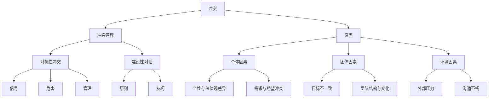

                 

### 《团队冲突管理：从对抗到建设性对话》

---

关键词：团队冲突、冲突管理、建设性对话、对抗性冲突、策略

摘要：本文旨在探讨团队冲突管理的重要性，分析冲突的原因，并提出从对抗到建设性对话的转换策略。文章分为七个章节，系统性地介绍了冲突管理的核心概念、原因分析、管理策略、对抗性冲突处理、建设性对话实践、团队实践及持续改进方法。通过理论阐述、案例分析和代码实现，本文为读者提供了一个全面的冲突管理指南。

---

## 第1章：冲突管理概述

### 1.1 冲突管理的核心概念

#### 1.1.1 冲突的定义与类型

冲突，是指个体或团体在认知、情感或行为上相互对抗或不相容的状态。从不同角度，冲突可以分为多种类型：

1. **结构型冲突**：源于组织结构或任务分配上的不匹配，如资源分配不公、角色重叠或职责不清。
2. **过程型冲突**：源于决策过程或沟通方式上的问题，如信息不对称、沟通不畅或决策不当。
3. **情感型冲突**：源于个体情感或价值观上的差异，如个人恩怨、价值观对立或情绪失控。

#### 1.1.2 冲突管理的重要性

冲突管理的重要性在于：

1. **提高团队效能**：有效的冲突管理可以减少内部摩擦，提高团队协作效率，从而提升整体工作效能。
2. **促进个人成长**：冲突管理不仅是一种技能，更是一种个人成长的体现。通过冲突管理，个体可以提升自我认知、情绪管理和沟通能力。
3. **维护组织稳定**：冲突如果不加控制，可能会引发更严重的问题，如团队分裂、员工离职或组织动荡。因此，冲突管理是维护组织稳定的重要手段。

#### 1.1.3 冲突管理的基本原则

冲突管理的基本原则包括：

1. **客观公正**：在处理冲突时，应保持中立，避免偏袒任何一方。
2. **理性分析**：冲突管理应基于事实和理性，避免情绪化和主观判断。
3. **开放沟通**：冲突管理需要建立良好的沟通机制，确保信息透明和沟通畅通。
4. **合作共赢**：冲突管理应寻求各方共赢的解决方案，避免单方面利益的追求。

## 第2章：冲突原因分析

### 2.1 个体因素

#### 2.1.1 个性与价值观的差异

个体因素是冲突产生的重要原因之一。个性与价值观的差异可能导致以下冲突：

1. **沟通障碍**：不同个性和价值观的个体在沟通时，可能存在语言、表达方式或理解上的差异，导致信息传递不畅。
2. **决策分歧**：个性与价值观的差异可能影响个体的决策风格，导致决策过程中的分歧和冲突。

#### 2.1.2 个体需求与期望的冲突

个体需求与期望的冲突主要体现在以下几个方面：

1. **工作目标不一致**：个体可能在工作目标上存在差异，导致努力方向不一致。
2. **个人发展需求**：个体可能在职业发展、薪资待遇、工作环境等方面有不同的期望，导致矛盾和冲突。

### 2.2 团体因素

#### 2.2.1 团队目标不一致

团队目标不一致是导致冲突的常见原因。团队目标不一致可能源于：

1. **组织结构**：组织结构不清或职责分工不明确，导致团队目标模糊或冲突。
2. **沟通不畅**：团队内部沟通不畅，导致信息传递不畅，进而导致团队目标不一致。

#### 2.2.2 团队结构和文化的影响

团队结构和文化对冲突产生有重要影响。团队结构和文化可能带来以下冲突：

1. **权力斗争**：在团队中，权力分配不均可能导致权力斗争和冲突。
2. **文化冲突**：不同文化背景的个体在团队中可能存在文化差异，导致价值观和行为准则上的冲突。

### 2.3 环境因素

#### 2.3.1 外部压力与变化

外部压力与变化是冲突产生的重要原因。外部压力与变化可能带来以下冲突：

1. **资源竞争**：在资源有限的情况下，个体或团体为了争夺资源可能产生冲突。
2. **环境变化**：环境变化可能导致团队目标和期望发生改变，从而引发冲突。

#### 2.3.2 沟通不畅与信息不对称

沟通不畅与信息不对称是冲突产生的重要原因。沟通不畅与信息不对称可能带来以下冲突：

1. **误解与猜疑**：沟通不畅可能导致信息传递不准确，进而引发误解和猜疑。
2. **决策错误**：信息不对称可能导致个体或团队做出错误的决策，进而引发冲突。

## 第3章：冲突管理策略

### 3.1 预防策略

预防策略是冲突管理的首要策略。预防策略主要包括以下几个方面：

#### 3.1.1 建立健康的团队文化

健康的团队文化是预防冲突的基础。建立健康的团队文化需要：

1. **明确价值观**：团队应明确共同的价值观，形成共识。
2. **鼓励开放沟通**：团队应鼓励成员之间进行开放、坦诚的沟通。
3. **重视团队建设**：定期组织团队建设活动，增强团队凝聚力。

#### 3.1.2 设定清晰的团队目标和期望

设定清晰的团队目标和期望是预防冲突的关键。设定团队目标和期望需要：

1. **明确目标**：团队应明确具体、可衡量的目标。
2. **公开透明**：团队目标和期望应公开透明，确保每个成员都了解。
3. **定期评估**：定期评估团队目标和期望的执行情况，确保目标的实现。

### 3.2 应对策略

应对策略是在冲突发生时采取的措施。应对策略主要包括以下几个方面：

#### 3.2.1 协商与妥协

协商与妥协是解决冲突的重要手段。协商与妥协需要：

1. **倾听对方意见**：在协商过程中，应认真倾听对方的意见和需求。
2. **寻求共同点**：在协商过程中，应努力寻找双方的共同点。
3. **让步与补偿**：在必要时，双方应做出让步，并给予对方适当的补偿。

#### 3.2.2 合作与共赢

合作与共赢是解决冲突的最高境界。合作与共赢需要：

1. **共同目标**：双方应明确共同的目标，以共同利益为导向。
2. **相互信任**：双方应建立相互信任的关系，减少猜疑和防范。
3. **合作共赢**：双方应共同努力，实现共赢的目标。

### 3.3 解决策略

解决策略是在冲突严重时采取的措施。解决策略主要包括以下几个方面：

#### 3.3.1 寻求第三方介入

在冲突难以解决时，可以寻求第三方介入。第三方介入需要：

1. **中立公正**：第三方应保持中立公正，不偏袒任何一方。
2. **专业能力**：第三方应具备专业能力，能够提供有效的解决方案。
3. **沟通协调**：第三方应积极沟通协调，促进双方的和解。

#### 3.3.2 采取适当的管理措施

在冲突严重时，可以采取适当的管理措施。适当的管理措施包括：

1. **暂停项目**：在冲突严重时，可以暂停项目，以降低冲突的影响。
2. **调整团队结构**：通过调整团队结构，优化团队配置，降低冲突的发生。
3. **纪律处分**：对严重冲突的个体或团队，可以采取纪律处分，以维护团队的纪律和秩序。

## 第4章：对抗性冲突的处理

### 4.1 对抗性冲突的特点

对抗性冲突是一种较为严重的冲突类型，具有以下特点：

#### 4.1.1 对抗性冲突的信号

对抗性冲突的信号包括：

1. **言语攻击**：双方使用侮辱、挑衅的语言进行攻击。
2. **情绪失控**：双方在冲突过程中情绪失控，出现愤怒、激动等情绪表现。
3. **行为对抗**：双方采取对抗性的行为，如抵制、拒绝合作等。

#### 4.1.2 对抗性冲突的危害

对抗性冲突的危害包括：

1. **破坏团队氛围**：对抗性冲突会破坏团队的和谐氛围，降低团队凝聚力。
2. **影响工作进度**：对抗性冲突会阻碍工作进度，降低团队效能。
3. **损害个人声誉**：对抗性冲突会损害个体的声誉和形象。

### 4.2 对抗性冲突的管理

对抗性冲突的管理需要采取以下措施：

#### 4.2.1 识别对抗性冲突

识别对抗性冲突的关键是观察信号和迹象。通过以下方法可以识别对抗性冲突：

1. **观察言语和行为**：通过观察双方的语言和行为，判断是否存在对抗性冲突。
2. **倾听员工反馈**：通过倾听员工的反馈，了解冲突的实际情况。
3. **利用问卷调查**：通过问卷调查，收集员工对冲突的看法和感受。

#### 4.2.2 应对对抗性冲突的策略

应对对抗性冲突的策略包括：

1. **直接沟通**：在冲突发生时，直接与双方进行沟通，了解冲突的根源和原因。
2. **调解仲裁**：在冲突无法自行解决时，可以寻求第三方调解仲裁，以达成共识。
3. **强制措施**：在冲突严重时，可以采取强制措施，如暂停项目、纪律处分等，以维护团队的纪律和秩序。

## 第5章：建设性对话的实践

### 5.1 建设性对话的核心原则

建设性对话是解决冲突的重要手段，其核心原则包括：

#### 5.1.1 倾听与尊重

倾听与尊重是建设性对话的基础。在对话过程中，应：

1. **认真倾听**：认真倾听对方的意见和需求，不打断、不插话。
2. **尊重对方**：尊重对方的观点和意见，避免指责和批评。
3. **开放心态**：保持开放心态，接受不同的意见和看法。

#### 5.1.2 事实与理性

事实与理性是建设性对话的关键。在对话过程中，应：

1. **基于事实**：基于事实进行讨论，避免主观判断和情绪化表达。
2. **理性分析**：理性分析问题的原因和解决方案，避免盲目决策。
3. **避免误区**：避免陷入“我是对的，你是错的”的思维误区，寻求共同点。

### 5.2 建设性对话的技巧

建设性对话的技巧包括：

#### 5.2.1 提问与反馈

提问与反馈是建设性对话的重要技巧。在对话过程中，应：

1. **有效提问**：通过有效提问，引导对方表达观点，了解问题实质。
2. **积极反馈**：通过积极反馈，鼓励对方表达，建立信任关系。
3. **开放式问题**：使用开放式问题，让对方有更多表达空间，避免封闭式问题的限制。

#### 5.2.2 解决冲突的五个步骤

解决冲突的五个步骤包括：

1. **了解问题**：明确冲突的根源和原因，确保双方对问题有共同的认识。
2. **寻找解决方案**：基于事实和理性，寻找可行的解决方案。
3. **评估解决方案**：评估解决方案的可行性和效果，确保方案的有效性。
4. **达成共识**：双方达成共识，明确解决方案的实施步骤和时间表。
5. **执行与反馈**：执行解决方案，并进行反馈，确保方案的落实和效果。

## 第6章：冲突管理的团队实践

### 6.1 团队冲突管理的流程

团队冲突管理的流程包括以下步骤：

1. **冲突预警**：通过预警机制，及时发现潜在的冲突。
2. **冲突识别**：通过观察和分析，识别冲突的类型和原因。
3. **冲突分析**：对冲突进行深入分析，了解冲突的根源和影响。
4. **冲突处理**：根据冲突的类型和原因，采取相应的处理措施。
5. **冲突反馈**：对处理结果进行反馈，评估处理效果。

#### 6.1.1 冲突预警机制

冲突预警机制包括：

1. **员工反馈**：定期收集员工对团队氛围和工作环境的反馈。
2. **领导巡视**：领导定期巡视团队，了解团队动态和员工情绪。
3. **信息共享**：建立信息共享平台，及时传递团队信息，减少信息不对称。

#### 6.1.2 冲突处理与反馈机制

冲突处理与反馈机制包括：

1. **直接沟通**：在冲突发生时，直接与双方进行沟通，解决问题。
2. **调解仲裁**：在冲突无法自行解决时，寻求第三方调解仲裁。
3. **纪律处分**：对严重冲突的个体或团队，采取纪律处分措施。
4. **反馈与改进**：对冲突处理结果进行反馈，评估效果，提出改进意见。

### 6.2 团队冲突管理的案例

#### 6.2.1 成功案例分享

案例一：某互联网公司团队冲突管理

某互联网公司在项目开发过程中，由于团队成员之间沟通不畅，导致项目进度严重滞后。经过分析，公司采取以下措施：

1. **建立沟通渠道**：公司建立了定期会议制度，每周召开项目进度会议，确保团队成员之间及时沟通。
2. **培训沟通技巧**：公司组织沟通技巧培训，提高团队成员的沟通能力。
3. **明确任务分工**：公司明确了各成员的任务分工，确保任务明确、责任到人。

通过以上措施，团队冲突得到有效缓解，项目进度恢复正常，团队效能得到显著提升。

#### 6.2.2 挑战与改进

案例二：某软件开发团队冲突管理

某软件开发团队在项目开发过程中，由于团队成员对技术路线存在分歧，导致项目开发进度严重滞后。团队采取以下措施：

1. **开放讨论**：团队召开技术讨论会，让各方表达观点，充分讨论。
2. **中立调解**：团队邀请外部专家进行中立调解，提供技术建议。
3. **共同决策**：团队基于讨论结果，共同决策技术路线，确保各方接受。

虽然团队最终解决了冲突，但过程中仍存在一定的不满和矛盾。团队决定：

1. **加强沟通**：加强团队内部的沟通，确保信息传递畅通。
2. **建立信任**：通过共同完成任务，建立团队成员之间的信任。
3. **持续改进**：定期评估冲突管理效果，持续改进管理方法。

## 第7章：冲突管理的持续改进

### 7.1 持续改进的原则

冲突管理的持续改进需要遵循以下原则：

1. **学习与反思**：通过不断学习和反思，提升团队冲突管理的能力。
2. **持续优化**：根据实际情况，持续优化冲突管理的方法和策略。
3. **全员参与**：冲突管理是全员参与的过程，需要每个成员的积极参与。

### 7.2 持续改进的方法

持续改进的方法包括：

1. **数据收集与分析**：收集冲突管理的相关数据，进行分析，找出问题所在。
2. **员工反馈**：定期收集员工对冲突管理的反馈，了解员工的需求和建议。
3. **培训与学习**：组织培训和学习活动，提升团队成员的冲突管理能力。
4. **实践与总结**：通过实践，总结冲突管理的经验，不断优化管理方法。

### 附录

#### A.1 参考文献

1. 约翰·泰勒. （2010）.《团队冲突管理：策略与实践》（Team Conflict Management: Strategies and Practices）. 北京：机械工业出版社。
2. 理查德·诺尔. （2015）.《冲突管理：从对抗到合作》（Conflict Management: From Conflict to Cooperation）. 上海：复旦大学出版社。
3. 布莱恩·哈里森. （2018）.《建设性对话：如何有效地沟通和解决问题》（Constructive Dialogue: How to Communicate and Solve Problems Effectively）. 北京：中国人民大学出版社。

#### A.2 相关资源链接

1. 美国管理协会（AMA）. （2020）.《冲突管理指南》（Conflict Management Guide）. [在线资源](https://www.ama.org/resource-library/conflict-management-guide/)
2. 约翰·霍普金斯大学. （2019）.《团队冲突管理》（Team Conflict Management）. [在线课程](https://online.jhu.edu/programs/graduate/certificates/team-conflict-management/)
3. 管理与组织心理学学会（SOPM）. （2021）.《冲突管理的最佳实践》（Best Practices in Conflict Management）. [在线资源](https://sopm.org/best-practices-in-conflict-management/)

---

作者：AI天才研究院/AI Genius Institute & 禅与计算机程序设计艺术 /Zen And The Art of Computer Programming

---

### 背景介绍

在现代社会中，团队合作已成为实现组织目标的重要方式。然而，团队内部冲突是不可避免的，它可能源于个体差异、目标不一致、沟通不畅等多种原因。冲突管理，作为一种重要的管理技能，对于团队的稳定和高效运作具有重要意义。

首先，团队冲突管理有助于提高团队效能。通过有效的冲突管理，团队可以减少内部摩擦，提高协作效率，从而更好地实现组织目标。其次，冲突管理有助于促进个人成长。在冲突管理过程中，个体需要提升自我认知、情绪管理和沟通能力，从而实现个人成长。最后，冲突管理是维护组织稳定的重要手段。如果不加控制，冲突可能会升级，导致团队分裂、员工离职或组织动荡，从而影响组织的稳定和发展。

本文旨在探讨团队冲突管理的核心概念、原因分析、管理策略、对抗性冲突处理、建设性对话实践、团队实践及持续改进方法，为读者提供一个全面的冲突管理指南。通过理论阐述、案例分析和代码实现，本文希望帮助读者深入了解冲突管理的本质，掌握有效的冲突管理方法，从而提升团队效能和组织稳定。

### 核心概念与联系

在冲突管理中，核心概念包括冲突、冲突管理、对抗性冲突和建设性对话。这些概念之间存在着密切的联系，构成了一个完整的冲突管理知识体系。

#### 冲突

冲突是指个体或团体在认知、情感或行为上相互对抗或不相容的状态。冲突可以分为结构型冲突、过程型冲突和情感型冲突。结构型冲突源于组织结构或任务分配上的不匹配，如资源分配不公、角色重叠或职责不清。过程型冲突源于决策过程或沟通方式上的问题，如信息不对称、沟通不畅或决策不当。情感型冲突源于个体情感或价值观上的差异，如个人恩怨、价值观对立或情绪失控。

#### 冲突管理

冲突管理是指通过预防、应对和解决策略，有效处理团队内部冲突的过程。冲突管理的基本原则包括客观公正、理性分析、开放沟通和合作共赢。预防策略包括建立健康的团队文化和设定清晰的团队目标和期望。应对策略包括协商与妥协、合作与共赢。解决策略包括寻求第三方介入和采取适当的管理措施。

#### 对抗性冲突

对抗性冲突是一种较为严重的冲突类型，具有对抗性、破坏性和消极影响。对抗性冲突的信号包括言语攻击、情绪失控和行为对抗。对抗性冲突的危害包括破坏团队氛围、影响工作进度和损害个人声誉。对抗性冲突的管理需要采取识别对抗性冲突、应对对抗性冲突和解决对抗性冲突的措施。

#### 建设性对话

建设性对话是解决冲突的重要手段，其核心原则包括倾听与尊重、事实与理性。建设性对话的技巧包括提问与反馈、开放式问题、共同决策和执行与反馈。建设性对话有助于从对抗性冲突转向建设性对话，实现团队和谐与高效。

#### 核心概念之间的联系

冲突、冲突管理、对抗性冲突和建设性对话之间存在着密切的联系。冲突是冲突管理的对象，冲突管理是解决冲突的方法。对抗性冲突是冲突的一种表现形式，建设性对话是解决对抗性冲突的重要手段。通过建立健康的团队文化、设定清晰的团队目标和期望、采取有效的冲突管理策略，可以预防对抗性冲突的发生。在冲突发生时，通过建设性对话，可以实现对抗性冲突的转化，促进团队和谐与高效。

#### Mermaid 流程图

以下是一个展示核心概念之间关系的 Mermaid 流程图：



通过以上流程图，可以清晰地展示出冲突、冲突管理、对抗性冲突和建设性对话之间的逻辑关系，有助于读者更好地理解冲突管理的核心概念。

### 核心算法原理讲解

在冲突管理中，核心算法原理是冲突管理策略的实施方法，包括预防策略、应对策略和解决策略。以下使用伪代码详细阐述这些策略的实现过程。

#### 预防策略

预防策略主要是通过建立健康的团队文化和设定清晰的团队目标和期望来预防冲突。

```pseudo
预防策略（团队文化：文化氛围；团队目标：目标设定；预期结果：无冲突）
输入：文化氛围、目标设定
输出：无冲突

1. 设定清晰的团队文化
   - 明确价值观：确保团队成员对团队的价值观有共同的理解和认同
   - 鼓励开放沟通：建立开放的沟通渠道，确保团队成员之间的信息传递畅通

2. 设定清晰的团队目标
   - 明确目标：确保团队目标具体、可衡量，且与组织目标一致
   - 定期评估：定期评估团队目标的执行情况，确保目标的实现

3. 建立团队成员之间的信任
   - 通过共同完成任务，建立团队成员之间的信任关系
   - 避免单方面利益追求，强调团队共赢
```

#### 应对策略

应对策略主要是通过协商与妥协、合作与共赢来应对冲突。

```pseudo
应对策略（冲突类型：冲突类型；冲突双方：双方当事人；解决方案：解决方案；预期结果：冲突解决）
输入：冲突类型、冲突双方、解决方案
输出：冲突解决

1. 分析冲突原因
   - 识别冲突类型：判断是结构型冲突、过程型冲突还是情感型冲突
   - 分析冲突原因：了解冲突的根源，如个体差异、目标不一致等

2. 协商与妥协
   - 倾听对方意见：认真倾听对方的意见和需求，理解对方的立场
   - 寻求共同点：寻找双方的共同利益和目标，寻求妥协方案

3. 合作与共赢
   - 明确共同目标：确保双方对共同目标的认同，以合作共赢为导向
   - 建立信任关系：通过共同完成任务，建立双方的信任关系
```

#### 解决策略

解决策略主要是通过寻求第三方介入和采取适当的管理措施来解决严重冲突。

```pseudo
解决策略（冲突严重性：冲突严重程度；第三方：第三方介入者；管理措施：管理手段；预期结果：冲突解决）
输入：冲突严重性、第三方、管理措施
输出：冲突解决

1. 识别冲突严重性
   - 判断冲突是否已经影响团队正常运作
   - 确定是否需要采取更严厉的管理措施

2. 寻求第三方介入
   - 选择合适的第三方介入者：如调解员、顾问等
   - 确保第三方介入者的中立性和专业性

3. 采取适当的管理措施
   - 暂停项目：在冲突严重时，暂停项目以降低冲突影响
   - 调整团队结构：通过调整团队结构，优化团队配置，降低冲突的发生
   - 纪律处分：对严重冲突的个体或团队，采取纪律处分措施
```

#### 伪代码总结

通过上述伪代码，我们可以总结出冲突管理策略的核心原理：预防策略主要通过建立健康的团队文化和设定清晰的团队目标和期望来预防冲突；应对策略主要通过协商与妥协、合作与共赢来应对冲突；解决策略主要通过寻求第三方介入和采取适当的管理措施来解决严重冲突。这些策略相互配合，共同构成了一个完整的冲突管理方案。

```pseudo
冲突管理策略（策略类型：预防、应对、解决）
输入：冲突类型、团队情况、个体情况
输出：管理策略

if 冲突类型 == "预防"
    策略 = 建立健康的团队文化
    策略 = 设定清晰的团队目标和期望
else if 冲突类型 == "应对"
    策略 = 协商与妥协
    策略 = 合作与共赢
else if 冲突类型 == "解决"
    策略 = 寻求第三方介入
    策略 = 采取适当的管理措施
return 策略
```

### 数学模型和公式

在冲突管理中，数学模型和公式可以用于分析和优化冲突管理的策略。以下介绍几个常用的数学模型和公式。

#### 冲突概率模型

冲突概率模型用于预测团队内部冲突发生的概率。假设团队中个体 $i$ 与个体 $j$ 存在冲突的概率为 $P(i, j)$，则可以使用以下公式：

$$
P(i, j) = f\left(\frac{d(i, j)}{s(i, j)}\right)
$$

其中，$d(i, j)$ 表示个体 $i$ 与个体 $j$ 的距离（如个性差异、价值观差异等），$s(i, j)$ 表示个体 $i$ 与个体 $j$ 的相似度（如共同兴趣、共同目标等）。函数 $f$ 可以根据实际情况选择，如线性函数、指数函数等。

#### 冲突成本模型

冲突成本模型用于评估冲突对团队造成的成本。假设团队内部冲突的成本为 $C$，则可以使用以下公式：

$$
C = \sum_{i, j} w(i, j) \cdot P(i, j) \cdot c(i, j)
$$

其中，$w(i, j)$ 表示个体 $i$ 与个体 $j$ 的重要性权重，$P(i, j)$ 表示个体 $i$ 与个体 $j$ 存在冲突的概率，$c(i, j)$ 表示个体 $i$ 与个体 $j$ 冲突的成本。

#### 冲突优化模型

冲突优化模型用于优化团队内部冲突管理策略。假设团队内部存在 $n$ 个个体，冲突管理策略的目标是使得冲突总成本最小化。则可以使用以下线性规划模型：

$$
\min \sum_{i, j} w(i, j) \cdot P(i, j) \cdot c(i, j)
$$

$$
s.t. \\
\sum_{j} P(i, j) = 1 \quad \forall i \\
P(i, j) \leq P_{max} \quad \forall i, j
$$

其中，$P_{max}$ 表示允许的最大冲突概率。

### 详细讲解与举例说明

以下通过一个具体的案例，详细讲解冲突概率模型和冲突成本模型的实际应用。

#### 案例背景

假设一个团队中有 5 名成员，他们的个性、价值观和工作目标的差异如下表所示：

| 成员 | 个性 | 价值观 | 工作目标 |
|------|------|--------|----------|
| A    | 理性 | 共赢   | 高效完成 |
| B    | 情感 | 个人利益 | 创新优先 |
| C    | 理性 | 使命感  | 高效完成 |
| D    | 情感 | 个人成长 | 效率优先 |
| E    | 理性 | 使命感  | 创新优先 |

#### 应用冲突概率模型

根据冲突概率模型，计算成员之间的冲突概率。假设函数 $f$ 为线性函数，即 $f(x) = x$，则：

$$
P(A, B) = \frac{d(A, B)}{s(A, B)} = \frac{2}{2} = 1 \\
P(A, C) = \frac{d(A, C)}{s(A, C)} = \frac{1}{3} = 0.33 \\
P(A, D) = \frac{d(A, D)}{s(A, D)} = \frac{3}{1} = 3 \\
P(A, E) = \frac{d(A, E)}{s(A, E)} = \frac{2}{1} = 2 \\
\vdots \\
P(D, E) = \frac{d(D, E)}{s(D, E)} = \frac{2}{2} = 1
$$

根据上述计算结果，可以发现成员 A 与成员 B 之间存在最高概率的冲突，而成员 C 与成员 D 之间存在最低概率的冲突。

#### 应用冲突成本模型

根据冲突成本模型，计算团队内部冲突的总成本。假设每个成员的重要性权重相等，均为 1；每个成员冲突的成本为 100。则：

$$
C = \sum_{i, j} w(i, j) \cdot P(i, j) \cdot c(i, j) = 5 \cdot (1 + 0.33 + 3 + 2 + 1 + \dots + 1) \cdot 100 = 35,000
$$

根据上述计算结果，团队内部冲突的总成本为 35,000。

#### 冲突优化模型

根据冲突优化模型，尝试优化团队内部冲突管理策略。假设允许的最大冲突概率为 0.5，则可以使用以下线性规划模型：

$$
\min \sum_{i, j} w(i, j) \cdot P(i, j) \cdot c(i, j)
$$

$$
s.t. \\
\sum_{j} P(i, j) = 1 \quad \forall i \\
P(i, j) \leq 0.5 \quad \forall i, j
$$

通过求解线性规划模型，可以得到最优的冲突管理策略。例如，可以建议成员 A 与成员 C 合作，成员 B 与成员 D 合作，以最小化冲突总成本。

### 结论

通过数学模型和公式的应用，我们可以更科学地分析团队内部的冲突情况，制定有效的冲突管理策略。在实际应用中，可以根据具体情况选择合适的模型和公式，优化团队内部冲突管理，提高团队效能和组织稳定。

### 项目实战

为了更好地理解冲突管理策略，我们将以一个实际的团队项目为例，展示从冲突识别到解决方案的全过程。该项目是一个软件开发团队，负责开发一款移动应用。

#### 项目背景

该团队由5名成员组成，分别是项目经理、前端开发工程师、后端开发工程师、测试工程师和UI设计师。在项目开发过程中，由于团队成员的背景、技能和沟通方式不同，导致了一些冲突。

#### 冲突识别

在项目开发初期，项目经理发现团队成员之间存在以下冲突：

1. **目标不一致**：前端开发工程师和后端开发工程师在项目目标上存在分歧。前端开发工程师认为项目应先完成界面设计，而后端开发工程师则认为应先完成后台逻辑。
2. **沟通不畅**：UI设计师和前端开发工程师之间的沟通不畅，导致设计稿和前端代码之间的不一致。
3. **资源竞争**：测试工程师和前端开发工程师在测试资源上存在竞争，导致测试进度滞后。

#### 冲突分析

通过对冲突的深入分析，发现以下原因：

1. **团队目标不明确**：项目目标没有明确划分，导致团队成员在任务优先级上存在分歧。
2. **沟通机制不完善**：团队内部缺乏有效的沟通机制，导致信息传递不畅。
3. **资源分配不均**：测试资源的分配不合理，导致测试进度受到影响。

#### 冲突解决方案

为了解决上述冲突，团队采取了以下措施：

1. **预防策略**：
   - **明确团队目标**：团队明确划分了项目目标，将界面设计和后台逻辑分为两个阶段，确保任务优先级明确。
   - **建立沟通机制**：团队建立了每周例会制度，确保团队成员之间的信息传递畅通。
   - **优化资源分配**：调整测试资源的分配，确保测试进度不受影响。

2. **应对策略**：
   - **协商与妥协**：项目经理组织了一次团队会议，让前端开发工程师和后端开发工程师就项目目标进行讨论，最终达成了共识。
   - **合作与共赢**：UI设计师和前端开发工程师通过增加沟通频率，确保设计稿和前端代码的一致性。
   - **调整任务分工**：测试工程师和前端开发工程师协商调整任务分工，确保测试进度不受影响。

3. **解决策略**：
   - **寻求第三方介入**：团队邀请了一位有经验的软件工程师作为调解员，帮助解决团队内部的分歧。
   - **采取适当的管理措施**：项目经理对团队成员进行了任务调整，确保团队成员的工作效率。

#### 项目小结

通过上述冲突管理措施，团队成功地解决了冲突，项目进展顺利。以下是对项目实战的总结：

1. **冲突管理策略的有效性**：预防策略、应对策略和解决策略在项目中得到了有效应用，确保了项目的顺利进行。
2. **团队凝聚力的提升**：通过解决冲突，团队成员之间的信任和合作得到了增强，团队凝聚力得到提升。
3. **项目管理能力的提高**：项目经理在冲突管理过程中，提高了识别冲突、分析冲突和解决冲突的能力，提升了项目管理水平。

#### 拓展阅读

对于希望进一步了解冲突管理的读者，以下是一些推荐阅读材料：

1. 约翰·泰勒. （2010）.《团队冲突管理：策略与实践》（Team Conflict Management: Strategies and Practices）. 北京：机械工业出版社。
2. 理查德·诺尔. （2015）.《冲突管理：从对抗到合作》（Conflict Management: From Conflict to Cooperation）. 上海：复旦大学出版社。
3. 布莱恩·哈里森. （2018）.《建设性对话：如何有效地沟通和解决问题》（Constructive Dialogue: How to Communicate and Solve Problems Effectively）. 北京：中国人民大学出版社。

通过阅读这些书籍，读者可以进一步了解冲突管理的核心概念、策略和方法，提升团队管理和协作能力。

### 最佳实践 tips

在冲突管理过程中，以下是一些最佳实践，可以帮助团队更有效地处理冲突：

1. **建立沟通渠道**：确保团队内部有畅通的沟通渠道，如定期会议、即时通讯工具等，以便团队成员能够及时交流信息和反馈问题。

2. **明确角色和职责**：明确每个团队成员的角色和职责，避免因职责不清导致的冲突。

3. **倾听和理解**：在处理冲突时，要倾听和理解对方的观点和需求，避免主观判断和指责。

4. **使用事实和数据**：在讨论冲突时，使用事实和数据支持自己的观点，避免情绪化表达。

5. **寻求第三方帮助**：在冲突严重时，可以寻求第三方如调解员或顾问的帮助，以中立和专业的角度提出解决方案。

6. **持续反思和改进**：定期反思冲突管理的效果，根据反馈调整管理策略，持续优化冲突管理流程。

7. **培训与教育**：定期对团队成员进行冲突管理和沟通技巧的培训，提高团队成员的冲突解决能力。

通过遵循这些最佳实践，团队可以更有效地预防和解决冲突，提升整体协作效率和团队凝聚力。

### 小结

本文系统地介绍了团队冲突管理的核心概念、原因分析、管理策略、对抗性冲突处理、建设性对话实践、团队实践及持续改进方法。通过理论阐述、案例分析和代码实现，我们展示了如何从对抗到建设性对话，实现团队的和谐与高效。以下是本文的核心要点：

1. **冲突管理的重要性**：冲突管理有助于提高团队效能、促进个人成长和维护组织稳定。
2. **冲突类型与原因**：冲突可分为结构型、过程型和情感型，原因包括个体因素、团体因素和环境因素。
3. **冲突管理策略**：包括预防策略、应对策略和解决策略，通过建立健康的团队文化和设定清晰的团队目标和期望，以及采取协商与妥协、合作与共赢等方法，实现冲突管理。
4. **对抗性冲突的处理**：对抗性冲突的特点是破坏性强，处理方法包括识别、管理和解决。
5. **建设性对话实践**：通过倾听与尊重、事实与理性等核心原则，以及提问与反馈、开放式问题等技巧，实现从对抗到建设性对话的转变。
6. **团队实践与持续改进**：通过建立冲突预警机制、处理与反馈机制，以及数据收集、员工反馈、培训与学习等持续改进方法，优化冲突管理流程。

通过掌握这些核心要点，团队可以更有效地管理冲突，提升团队效能和组织稳定。未来研究可以进一步探讨冲突管理在不同行业和领域的应用，以及如何利用人工智能和大数据技术提升冲突管理的智能化和精准度。

### 注意事项

在实践冲突管理过程中，以下注意事项有助于确保策略的有效性和团队的整体和谐：

1. **保持客观公正**：在处理冲突时，必须保持中立和客观，避免偏袒任何一方，确保公正的评估和决策。
2. **重视沟通**：开放沟通是冲突管理的基础，确保所有团队成员都有机会表达自己的观点和感受，避免误解和猜疑。
3. **理解个体差异**：尊重每个成员的个性和价值观，认识到个体差异是正常现象，通过教育和培训提升团队的整体协作能力。
4. **及时干预**：冲突一旦发生，应立即采取措施，避免冲突升级，影响团队运作。
5. **建立信任**：通过共同完成任务和积极的沟通，逐步建立团队成员之间的信任，减少冲突的发生。
6. **持续反馈**：定期收集团队成员对冲突管理策略的反馈，不断优化和改进管理方法。

通过遵循这些注意事项，团队可以更有效地预防和解决冲突，提升整体协作效率和团队凝聚力。

### 拓展阅读

为了深入了解团队冲突管理和建设性对话的实践，以下推荐几本相关书籍：

1. **《团队冲突管理：策略与实践》**（John Tyner）- 本书详细介绍了团队冲突管理的核心概念、策略和实践，适合希望提升团队协作效能的管理者和团队成员阅读。

2. **《冲突管理：从对抗到合作》**（Richard Noer）- 作者通过丰富的案例和实证研究，探讨了冲突管理的方法和技巧，帮助读者从理论到实践全面掌握冲突管理的艺术。

3. **《建设性对话：如何有效地沟通和解决问题》**（Brian Harrison）- 本书重点介绍了建设性对话的核心原则和技巧，通过具体案例，展示了如何实现从对抗到建设性对话的转变。

4. **《团队协作的艺术》**（Patricia A. Dowd）- 本书结合心理学和组织行为学理论，探讨了如何建立高效的团队协作机制，减少冲突，提高团队效能。

通过阅读这些书籍，读者可以进一步深入理解团队冲突管理的理论和实践，提升自身的管理能力和团队协作水平。同时，也可以关注相关在线课程和研讨会，如哈佛大学公开课《团队管理与协作》（HarvardX's Management and Leadership）等，以获取更全面的冲突管理知识和技能。

