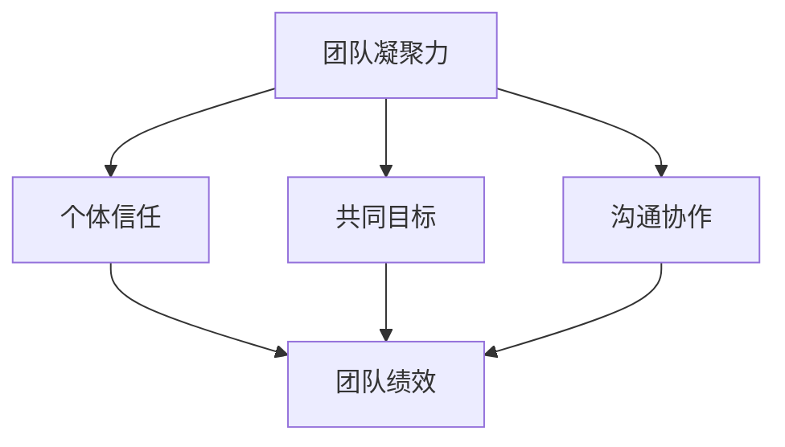

                 

为了完成《团队凝聚力建设：从个体到整体的蜕变》这篇文章，我们将遵循以下步骤来构建内容：

### 1. 文章结构规划

**文章结构：**
- 标题、关键词和摘要
- 引言
- 团队凝聚力的概念与重要性
- 团队凝聚力理论
- 团队凝聚力的影响因素
- 提升团队凝聚力的策略
- 团队沟通与协作技巧
- 团队凝聚力建设案例分析
- 团队凝聚力评估与测量
- 附录
- 总结

### 2. 撰写摘要与关键词

**摘要：**
本文首先介绍了团队凝聚力的概念和重要性，探讨了团队凝聚力理论及其影响因素。接着，文章提出了提升团队凝聚力的策略，分析了团队沟通与协作技巧，并通过案例研究展示了团队凝聚力建设的实践。最后，文章探讨了团队凝聚力的评估方法，为读者提供了团队凝聚力建设的有用工具和实践指南。

**关键词：**
团队凝聚力，个体到整体，团队建设，沟通，协作，案例分析，评估方法

### 3. 引言部分

**引言：**
在快速变化和竞争激烈的IT行业中，团队凝聚力成为组织成功的关键因素。本文旨在探讨团队凝聚力建设的重要性，分析其理论背景和影响因素，并提出实用的策略和方法，帮助团队实现从个体到整体的蜕变。

### 4. 团队凝聚力的概念与重要性

**核心概念与联系：**
我们将使用Mermaid流程图来展示团队凝聚力相关的基本概念和原理。以下是一个简化的Mermaid流程图示例：



**核心算法原理讲解：**
我们将使用伪代码来详细阐述团队凝聚力核心算法原理。以下是一个简化的伪代码示例：

```python
# 伪代码：团队凝聚力提升算法
def enhance_team_cohesion(team_members):
    for member in team_members:
        build_trust(member)
        align_common_goals(member)
        improve_communication(member)
    measure_team_performance()
```

**数学模型与公式：**
团队凝聚力可以用以下数学模型来描述：

$$
Cohesion = f(Trust, Common\ Goals, Communication)
$$

**详细讲解与举例说明：**
- 信任：团队成员之间相互信任的程度。
- 共同目标：团队成员共同追求的目标。
- 沟通：团队成员之间的沟通效率。

### 5. 团队凝聚力的影响因素

**影响因素分析：**
- 领导风格：影响团队成员的信任和参与度。
- 成员特征：包括个性、技能和经验，影响团队的整体表现。
- 团队环境：包括组织文化、工作条件和资源，影响团队的合作氛围。

### 6. 提升团队凝聚力的策略

**策略概述：**
- 增强信任：通过团队建设活动和共享信息来建立信任。
- 明确共同目标：确保所有团队成员都明确共同目标，并共同努力。
- 改善沟通：通过定期的团队会议和有效的沟通工具来提高沟通效率。

### 7. 团队沟通与协作技巧

**技巧应用：**
- 有效沟通：确保信息传递清晰、准确和及时。
- 协作工具：使用协作工具（如Slack、Trello等）来提高团队协作效率。
- 冲突管理：通过积极沟通和协商来解决团队内部冲突。

### 8. 团队凝聚力建设案例分析

**案例分析：**
- 成功案例：分析成功团队的凝聚力建设经验。
- 失败案例：探讨失败团队的凝聚力问题及改进建议。

### 9. 团队凝聚力评估与测量

**评估方法：**
- 评估工具：介绍常用的团队凝聚力评估工具。
- 评估实施：说明如何实施团队凝聚力评估。
- 评估分析：解释评估结果如何进行分析和应用。

### 10. 附录

**附录内容：**
- 团队凝聚力建设工具推荐。
- 相关研究论文推荐。
- 团队凝聚力建设流程图。

### 11. 总结

**总结：**
本文总结了团队凝聚力建设的重要性、理论、实践方法和评估方法。通过本文的探讨，读者应能够更好地理解团队凝聚力，并在实际工作中运用这些策略来提升团队表现。

### 12. 文章格式与作者信息

**文章格式：**
- 使用Markdown格式编写文章。
- 文章末尾添加作者信息。

**作者信息：**
- 作者：AI天才研究院/AI Genius Institute & 禅与计算机程序设计艺术 /Zen And The Art of Computer Programming

通过以上步骤，我们将逐步完善文章内容，确保文章逻辑清晰、结构紧凑、内容丰富，符合字数要求。接下来，我们将开始具体撰写每个部分的详细内容。在撰写过程中，我们将不断调整和完善，确保文章的完整性和专业性。

