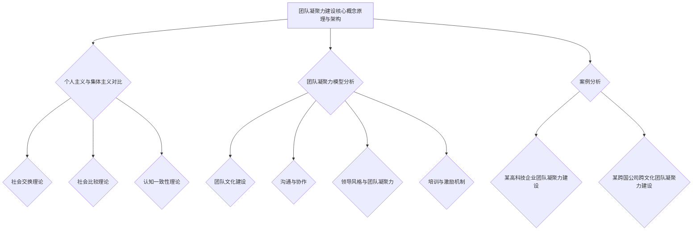

                 

## 引言

### 1.1 团队凝聚力的重要性

团队凝聚力是指团队成员之间的相互吸引力和合作意愿，它是团队效能的关键因素之一。在企业管理中，团队凝聚力被视为提升团队绩效、增强团队竞争力的重要手段。以下将从多个角度探讨团队凝聚力的重要性。

**1.1.1 凝聚力对团队绩效的影响**

首先，团队凝聚力对团队绩效有着直接的影响。研究表明，高凝聚力的团队在任务完成度、创新能力和工作效率方面都表现优异。团队成员之间的密切协作和相互信任能够降低沟通成本，减少误解和冲突，从而提高团队的整体表现。

**1.1.2 团队凝聚力与团队协作的关系**

团队凝聚力与团队协作密不可分。一个高度凝聚力的团队，其成员更容易形成共识，共同追求团队目标。团队成员之间的协作精神能够促进信息的共享和资源的整合，从而提高团队的执行力和竞争力。

**1.1.3 企业对团队凝聚力的需求**

在当今快速变化的商业环境中，企业对团队凝聚力有着迫切的需求。团队凝聚力有助于企业应对市场变化、技术创新和竞争压力。通过提升团队凝聚力，企业能够打造一支战斗力强、凝聚力高的团队，为企业的长期发展奠定基础。

### 1.2 从“我”到“我们”的转变

在现代企业中，个人主义和集体主义的价值观往往共存。个人主义强调个体独立性和自主性，而集体主义则强调团队协作和集体利益。从个人主义向集体主义的转变，是提升团队凝聚力的关键步骤。

**1.2.1 个人主义与集体主义的对比**

个人主义和集体主义在价值观和行为方式上存在显著差异。个人主义倾向于关注个体成就和自我实现，而集体主义则强调团队协作和共同目标。在团队建设中，需要平衡个人主义和集体主义的因素，以实现团队的最佳状态。

**1.2.2 从自我中心到团队中心的转变**

从自我中心到团队中心的转变，是团队凝聚力建设的重要任务。团队成员需要逐步摒弃自我中心的思维模式，学会从团队的角度思考和行动。这种转变有助于增强团队成员之间的信任和协作，提高团队的整体效能。

### 1.3 本书的目标和结构

本书旨在探讨团队凝聚力建设的方法和策略，帮助企业和团队提升凝聚力，实现团队效能的提升。本书分为四个部分：

**第一部分：引言**  
介绍了团队凝聚力的重要性，以及从“我”到“我们”的转变。

**第二部分：团队凝聚力建设的理论基础**  
分析了团队凝聚力理论，包括社会交换理论、社会比较理论和认知一致性理论。

**第三部分：团队凝聚力建设的实践策略**  
探讨了团队文化建设、沟通与协作、领导风格与团队凝聚力、培训与激励机制等方面的实践策略。

**第四部分：团队凝聚力建设的案例分析**  
通过实际案例，展示了团队凝聚力建设的实践效果和成功经验。

**1.3.1 阅读目标**  
通过本书的学习，读者应能够：

- 理解团队凝聚力的概念和重要性。  
- 掌握团队凝聚力建设的理论基础和实践策略。  
- 学会通过案例分析，总结团队凝聚力建设的成功经验。

**1.3.2 书的结构安排**  
本书的结构安排如下：

- 引言：介绍团队凝聚力的重要性，以及从“我”到“我们”的转变。  
- 团队凝聚力建设的理论基础：分析团队凝聚力理论，包括社会交换理论、社会比较理论和认知一致性理论。  
- 团队凝聚力建设的实践策略：探讨团队文化建设、沟通与协作、领导风格与团队凝聚力、培训与激励机制等方面的实践策略。  
- 团队凝聚力建设的案例分析：通过实际案例，展示团队凝聚力建设的实践效果和成功经验。

通过本书的阅读，读者可以深入了解团队凝聚力建设的理论和实践，为企业打造一支高凝聚力、高效能的团队提供有力支持。

## 第二部分：团队凝聚力建设的理论基础

### 2.1 团队凝聚力理论概述

团队凝聚力是指团队成员之间的相互吸引力和合作意愿，它是团队效能的关键因素之一。团队凝聚力理论从多个角度探讨了团队凝聚力的本质、影响因素和作用。以下是团队凝聚力理论的概述。

#### 2.1.1 团队凝聚力的定义

团队凝聚力可以定义为团队成员之间的相互吸引力和合作意愿。这种凝聚力是团队内部的一种情感和认知纽带，能够促进团队成员之间的协作和沟通，提高团队的整体效能。

#### 2.1.2 团队凝聚力的分类

团队凝聚力可以分为以下几种类型：

1. **情感凝聚力**：团队成员之间的情感联系和信任，是团队凝聚力的重要组成部分。情感凝聚力能够增强团队成员之间的情感纽带，提高团队的稳定性。

2. **任务凝聚力**：团队成员在完成共同任务时所表现出的合作意愿和协作精神。任务凝聚力能够提高团队的执行力和竞争力。

3. **社交凝聚力**：团队成员之间的社交互动和友谊，是团队凝聚力的重要补充。社交凝聚力能够增强团队成员之间的归属感和团队意识。

4. **结构凝聚力**：团队成员之间的结构和组织关系，是团队凝聚力的重要保障。结构凝聚力能够提高团队的协调性和效率。

#### 2.1.3 团队凝聚力的影响因素

团队凝聚力的影响因素包括以下几个方面：

1. **团队特征**：团队的规模、目标和领导风格等特征对团队凝聚力有着重要影响。一个明确的团队目标和合适的领导风格能够促进团队凝聚力的提升。

2. **个人特征**：团队成员的个性、价值观和能力等个人特征对团队凝聚力有着重要影响。一个开放、包容和积极的团队成员能够增强团队的凝聚力。

3. **团队环境**：团队所处的外部环境对团队凝聚力有着重要影响。一个支持团队发展的外部环境能够促进团队凝聚力的提升。

#### 2.1.4 团队凝聚力的作用

团队凝聚力对团队绩效有着直接的影响。高凝聚力的团队在任务完成度、创新能力和工作效率方面都表现优异。以下从几个方面探讨团队凝聚力的作用：

1. **提高团队效能**：团队凝聚力能够提高团队的整体效能，促进团队成员之间的协作和沟通，减少误解和冲突，从而提高团队的工作效率和绩效。

2. **增强团队稳定性**：团队凝聚力能够增强团队的稳定性，减少团队成员的流失，提高团队的持续发展能力。

3. **促进团队创新**：团队凝聚力能够促进团队成员之间的交流和分享，激发团队成员的创新思维，提高团队的创新能力和竞争力。

4. **提升员工满意度**：团队凝聚力能够提升员工的工作满意度和幸福感，减少员工的工作压力，提高员工的工作积极性和忠诚度。

### 2.2 团队凝聚力模型分析

团队凝聚力模型是研究团队凝聚力的基础工具，它通过理论模型来分析和解释团队凝聚力的形成和作用。以下介绍几种常见的团队凝聚力模型。

#### 2.2.1 社会交换理论

社会交换理论是研究团队凝聚力的一种重要理论，它认为团队凝聚力的形成是基于团队成员之间的社会交换。社会交换理论主要包括以下观点：

1. **交换关系**：团队成员之间的相互作用是一种交换关系，包括物质资源、情感支持和信息交流等。

2. **平衡原则**：团队成员之间的交换应该是平衡的，即投入和回报大致相等。这种平衡能够增强团队成员之间的信任和凝聚力。

3. **互惠原则**：团队成员之间的交换应该是互惠的，即双方都能从交换中获得利益。这种互惠能够增强团队成员之间的合作关系。

#### 2.2.2 社会比较理论

社会比较理论是另一种重要的团队凝聚力模型，它认为团队凝聚力是由团队成员之间的社会比较产生的。社会比较理论主要包括以下观点：

1. **比较标准**：团队成员通过与他人比较来确定自己的社会地位和自我价值。

2. **比较结果**：比较结果会影响团队成员的心理状态和行为。当团队成员感觉自己处于优势地位时，会产生积极的情感和较高的凝聚力；当团队成员感觉自己处于劣势地位时，会产生消极的情感和较低的凝聚力。

3. **比较导向**：团队领导者应该引导团队成员进行积极的社会比较，以提高团队凝聚力和绩效。

#### 2.2.3 认知一致性理论

认知一致性理论是研究团队凝聚力的另一种重要模型，它认为团队凝聚力是由团队成员之间的认知一致性产生的。认知一致性理论主要包括以下观点：

1. **认知一致性**：团队成员之间的认知一致性是指他们对团队的信念、目标和价值观等方面的一致。

2. **认知失调**：当团队成员之间的认知一致性较低时，会产生认知失调，导致团队成员之间的冲突和不满。

3. **认知修复**：团队领导者应该通过沟通和协调，提高团队成员之间的认知一致性，以减少认知失调和提升团队凝聚力。

### 2.3 团队凝聚力与团队绩效的关系

团队凝聚力和团队绩效是企业管理中重要的研究对象。研究团队凝聚力与团队绩效的关系，有助于企业通过提升团队凝聚力来提高团队绩效。以下从几个方面探讨团队凝聚力与团队绩效的关系。

#### 2.3.1 团队凝聚力对团队绩效的影响

研究表明，团队凝聚力对团队绩效有显著影响。高凝聚力的团队能够更好地完成任务，提高工作效率，实现团队目标。以下从几个方面分析团队凝聚力对团队绩效的影响：

1. **协同合作**：高凝聚力的团队能够促进团队成员之间的协同合作，减少内部摩擦和冲突，提高团队的执行力和工作效率。

2. **信任与沟通**：高凝聚力的团队能够增强团队成员之间的信任和沟通，减少误解和冲突，提高团队的整体效能。

3. **创新与学习**：高凝聚力的团队能够促进团队成员之间的知识共享和创新思维，提高团队的创新能力和学习速度。

#### 2.3.2 团队绩效对团队凝聚力的反馈作用

团队绩效对团队凝聚力也有反馈作用。当团队绩效良好时，团队成员会感受到团队的凝聚力和自身的价值，从而增强团队的凝聚力。以下从几个方面分析团队绩效对团队凝聚力的反馈作用：

1. **成就感**：良好的团队绩效能够增强团队成员的成就感，提高团队成员对团队的认同感和归属感。

2. **奖励机制**：良好的团队绩效能够促进企业对团队成员的奖励和激励，提高团队成员的工作积极性和忠诚度。

3. **团队氛围**：良好的团队绩效能够营造积极的团队氛围，增强团队成员之间的信任和协作，提高团队的凝聚力。

#### 2.3.3 团队凝聚力与团队绩效的实证研究

实证研究为团队凝聚力和团队绩效的关系提供了有力的证据。以下介绍几个典型的实证研究：

1. **研究一**：某企业通过对500个团队的调查研究发现，团队凝聚力与团队绩效之间存在显著的正相关关系。高凝聚力的团队能够实现更高的绩效。

2. **研究二**：某大学通过对不同学科的学生团队进行调查研究发现，团队凝聚力与团队学术绩效之间存在显著的正相关关系。高凝聚力的团队在学术研究和创新方面表现更出色。

3. **研究三**：某咨询公司通过对多家企业团队进行评估研究发现，团队凝聚力是影响团队绩效的关键因素之一。高凝聚力的团队能够实现更高的客户满意度和市场竞争力。

综上所述，团队凝聚力和团队绩效之间存在密切的关系。通过提升团队凝聚力，企业可以显著提高团队绩效，实现团队的长期发展。

### 2.4 团队凝聚力与团队健康的关系

团队凝聚力不仅对团队绩效有重要影响，还对团队健康产生积极的作用。团队健康是指团队成员的心理健康和工作满意度。以下从几个方面探讨团队凝聚力与团队健康的关系。

#### 2.4.1 凝聚力对团队成员心理健康的影响

团队凝聚力能够显著改善团队成员的心理健康。研究表明，高凝聚力的团队能够提高团队成员的心理安全感，减少工作压力和焦虑。以下从几个方面分析凝聚力对团队成员心理健康的影响：

1. **心理安全感**：高凝聚力的团队能够为成员提供一个支持性的环境，使成员感到心理安全，减少恐惧和焦虑。

2. **情绪支持**：高凝聚力的团队能够提供情绪支持，帮助成员应对工作和生活中的压力和挑战。

3. **心理健康促进**：高凝聚力的团队能够通过团队合作和相互支持，促进团队成员的心理健康，提高工作满意度和幸福感。

#### 2.4.2 凝聚力对团队成员工作满意度的影响

团队凝聚力对团队成员的工作满意度也有显著影响。研究表明，高凝聚力的团队能够提高团队成员的工作满意度和归属感。以下从几个方面分析凝聚力对团队成员工作满意度的影响：

1. **工作氛围**：高凝聚力的团队能够营造积极的工作氛围，使成员感到工作愉悦和有成就感。

2. **团队合作**：高凝聚力的团队能够促进团队成员之间的团队合作，使成员感到工作有价值和有意义。

3. **工作支持**：高凝聚力的团队能够提供工作支持，帮助成员解决工作中的问题和困难。

#### 2.4.3 团队健康对团队凝聚力的影响

团队健康对团队凝聚力也有重要影响。健康的团队成员更能够积极参与团队活动，为团队贡献自己的力量。以下从几个方面分析团队健康对团队凝聚力的影响：

1. **身体状态**：健康的团队成员具有更好的身体状态，能够更有效地参与团队活动和完成任务。

2. **心理状态**：健康的团队成员具有更好的心理状态，能够更好地应对工作压力和挑战。

3. **工作积极性**：健康的团队成员具有更高的工作积极性，能够更主动地参与团队活动和为团队贡献力量。

综上所述，团队凝聚力与团队健康之间存在密切的关系。通过提升团队凝聚力，企业可以促进团队成员的心理健康和工作满意度，从而提高团队的绩效和竞争力。

### 2.5 团队凝聚力建设的策略和方法

团队凝聚力建设是企业管理中的重要任务，企业需要采取有效的策略和方法来提升团队凝聚力。以下介绍几种常见的团队凝聚力建设策略和方法。

#### 2.5.1 团队文化建设

团队文化建设是团队凝聚力建设的基础。企业需要建立一套符合自身特点的价值观和行为规范，引导团队成员形成共同的目标和信念。以下从几个方面介绍团队文化建设的方法：

1. **共同价值观**：企业需要明确团队的共同价值观，并将其融入日常工作和团队活动中。

2. **团队使命**：企业需要明确团队的使命，使团队成员明确自己的工作目标和责任。

3. **团队精神**：企业需要培养团队的团队精神，鼓励团队成员相互支持、协作和分享。

4. **团队仪式**：企业可以通过团队仪式来强化团队的凝聚力，如团队建设活动、团队聚餐等。

#### 2.5.2 沟通与协作

沟通与协作是团队凝聚力建设的重要手段。企业需要建立有效的沟通机制，促进团队成员之间的信息共享和协作。以下从几个方面介绍沟通与协作的方法：

1. **开放沟通**：企业需要鼓励团队成员进行开放沟通，分享自己的想法和意见。

2. **定期会议**：企业需要定期召开团队会议，讨论团队目标和进展，解决问题。

3. **协作平台**：企业可以采用协作平台，如项目管理系统、即时通讯工具等，提高团队协作效率。

4. **跨部门协作**：企业需要促进跨部门协作，使不同部门之间的团队成员能够更好地合作。

#### 2.5.3 领导风格与团队凝聚力

领导风格对团队凝聚力有着重要影响。企业领导者需要采用合适的领导风格，提升团队凝聚力。以下从几个方面介绍领导风格与团队凝聚力：

1. **民主领导**：民主领导能够增强团队成员的参与感和归属感，提高团队凝聚力。

2. **支持型领导**：支持型领导能够提供团队成员必要的支持和帮助，增强团队的凝聚力。

3. **参与式领导**：参与式领导能够鼓励团队成员参与决策过程，提高团队的凝聚力和执行力。

4. **激励型领导**：激励型领导能够激发团队成员的积极性和创造力，提高团队凝聚力和绩效。

#### 2.5.4 培训与激励

培训与激励是团队凝聚力建设的重要手段。企业需要通过培训提高团队成员的技能和能力，通过激励激发团队成员的积极性和创造力。以下从几个方面介绍培训与激励的方法：

1. **技能培训**：企业需要提供针对性的技能培训，提高团队成员的专业能力和综合素质。

2. **知识分享**：企业需要鼓励团队成员进行知识分享，提高团队的协作能力和创新能力。

3. **奖励机制**：企业需要建立奖励机制，对表现优秀的团队成员进行奖励，提高团队成员的工作积极性和归属感。

4. **职业发展**：企业需要为团队成员提供职业发展的机会，鼓励团队成员实现个人成长和职业发展。

综上所述，团队凝聚力建设是企业管理中的重要任务，企业需要采取有效的策略和方法来提升团队凝聚力。通过团队文化建设、沟通与协作、领导风格与团队凝聚力、培训与激励等方面的建设，企业可以打造一支高凝聚力、高效能的团队，实现企业的长期发展。

## 第三部分：团队凝聚力建设的实践策略

### 3.1 团队文化建设

团队文化建设是提升团队凝聚力的关键步骤。一个强大的团队文化能够引导团队成员共同追求目标，促进协作和合作。以下将介绍团队文化建设的定义、关键要素和实践方法。

#### 3.1.1 团队文化的定义与作用

团队文化是指团队中共同持有的价值观、信仰、行为准则和工作方式。它不仅反映了团队成员的个性特点，还体现了团队的整体精神和氛围。团队文化的作用主要体现在以下几个方面：

1. **导向作用**：团队文化能够明确团队成员的目标和方向，引导成员为实现团队目标而努力。

2. **凝聚作用**：团队文化能够增强团队成员之间的认同感和归属感，提高团队凝聚力。

3. **激励作用**：团队文化能够激发团队成员的积极性和创造力，提高团队绩效。

4. **规范作用**：团队文化能够规范团队成员的行为，促进团队成员遵守团队的价值观和行为准则。

#### 3.1.2 团队文化建设的关键要素

团队文化建设需要关注以下几个关键要素：

1. **共同价值观**：共同价值观是团队文化的核心，它反映了团队成员的共同信仰和追求。一个明确的共同价值观能够引导团队成员的行为和决策，提高团队的一致性和协作效率。

2. **团队精神**：团队精神是指团队成员之间的相互信任、尊重和支持。团队精神能够增强团队成员之间的凝聚力，促进团队成员之间的有效沟通和协作。

3. **行为准则**：行为准则是团队成员在工作中的行为规范，它反映了团队文化的核心价值观。明确的行为准则能够规范团队成员的行为，促进团队成员遵守团队的价值观。

4. **工作氛围**：工作氛围是团队文化的体现，它反映了团队成员的工作态度和行为习惯。一个积极、开放和包容的工作氛围能够激发团队成员的积极性和创造力，提高团队的整体效能。

#### 3.1.3 团队文化建设的实践方法

团队文化建设是一个持续的过程，需要企业领导者和团队成员的共同参与。以下是一些团队文化建设的实践方法：

1. **明确团队愿景和使命**：团队愿景和使命是团队文化的基石。企业需要明确团队的愿景和使命，并将其传达给所有团队成员，使团队成员明确自己的工作目标和方向。

2. **制定共同价值观和行为准则**：企业需要与团队成员共同制定团队的价值观和行为准则，使团队成员在行动上保持一致。这些价值观和行为准则应该简明扼要，易于理解和执行。

3. **加强团队沟通和协作**：团队沟通和协作是团队文化的重要体现。企业需要建立有效的沟通机制，促进团队成员之间的信息共享和协作。此外，企业可以通过团队建设活动，加强团队成员之间的沟通和协作。

4. **树立榜样和典范**：企业需要树立榜样和典范，使团队成员有学习的对象和目标。这些榜样和典范可以是企业的领导者，也可以是表现优秀的团队成员。

5. **持续培训和激励**：企业需要通过持续的培训和激励，提高团队成员的素质和技能，激发团队成员的积极性和创造力。此外，企业可以通过奖励机制，对表现优秀的团队成员进行奖励和认可，提高团队成员的归属感和认同感。

通过以上实践方法，企业可以逐步建立和强化团队的共同价值观和行为准则，营造积极、开放和包容的工作氛围，提高团队的凝聚力和整体效能。

### 3.2 沟通与协作

沟通与协作是团队凝聚力建设的重要组成部分。有效的沟通和协作能够促进团队成员之间的理解和信任，提高团队的执行力和创新能力。以下将介绍沟通的重要性、提高团队沟通有效性的方法以及团队协作的最佳实践。

#### 3.2.1 沟通的重要性

沟通是团队协作的基础，它贯穿于团队运作的各个环节。有效的沟通能够：

1. **信息传递**：确保团队成员准确理解和执行任务。

2. **决策制定**：促进团队成员之间的信息共享和决策参与。

3. **问题解决**：帮助团队识别和解决问题，避免误解和冲突。

4. **团队建设**：增强团队成员之间的信任和合作关系。

5. **创新激发**：通过知识共享和头脑风暴，促进团队的创新能力。

#### 3.2.2 提高团队沟通有效性的方法

为了提高团队沟通的有效性，企业可以采取以下几种方法：

1. **明确沟通目标**：每次沟通前，明确沟通的目标和内容，确保团队成员了解沟通的重点和目的。

2. **选择合适的沟通方式**：根据沟通的内容和情境，选择合适的沟通方式，如面对面会议、电子邮件、即时通讯工具等。

3. **倾听与反馈**：鼓励团队成员倾听他人的意见和反馈，确保沟通的双向互动。

4. **简洁明了**：使用简单、直接和明确的语言，避免使用复杂的术语和难以理解的表达。

5. **及时沟通**：确保信息传递的及时性，避免信息的滞后和失真。

6. **反馈机制**：建立反馈机制，鼓励团队成员对沟通效果进行评价和改进。

#### 3.2.3 团队协作的最佳实践

有效的团队协作能够提高团队的执行力和创新能力。以下是一些团队协作的最佳实践：

1. **明确团队目标**：确保所有团队成员都清楚团队的目标和任务，使协作具有明确的方向。

2. **角色分工**：根据团队成员的技能和特长，明确各自的职责和任务，确保协作的有序进行。

3. **定期会议**：定期召开团队会议，讨论项目进展、问题和解决方案，确保团队的协调和统一。

4. **共享资源**：建立共享平台，使团队成员能够方便地获取和共享资源，提高协作效率。

5. **协作工具**：使用协作工具，如项目管理系统、即时通讯工具、文档共享平台等，提高团队的协作效率。

6. **鼓励反馈与建议**：鼓励团队成员提出反馈和建议，促进团队成员之间的交流和协作。

7. **团队建设活动**：组织团队建设活动，加强团队成员之间的交流和互动，提高团队的凝聚力。

通过以上实践方法，企业可以提升团队沟通和协作的有效性，增强团队的凝聚力和执行力，实现团队的目标和使命。

### 3.3 领导风格与团队凝聚力

领导风格在团队凝聚力建设中起着至关重要的作用。不同的领导风格会对团队凝聚力产生不同的影响，企业领导者需要根据团队的特点和环境选择合适的领导风格，以提升团队的凝聚力和绩效。以下将介绍领导风格的定义和分类、不同领导风格对团队凝聚力的影响以及领导者如何提升团队凝聚力。

#### 3.3.1 领导风格的定义与分类

领导风格是指领导者在管理团队时所采取的方式和态度。根据不同的领导特征和行为，可以将领导风格分为以下几种类型：

1. **权威型领导**：权威型领导者具有高度的决策权和控制力，他们倾向于制定明确的规则和指令，并对团队成员的工作进行严格监督。权威型领导风格适用于需要快速决策和执行任务的情况。

2. **民主型领导**：民主型领导者鼓励团队成员参与决策过程，尊重团队成员的意见和建议，通过集体的智慧和力量来解决问题。民主型领导风格适用于需要创新和团队合作的任务。

3. **支持型领导**：支持型领导者关注团队成员的需求和感受，提供情感支持和职业发展机会，帮助团队成员解决工作中的问题和困难。支持型领导风格适用于需要提升团队成员的工作满意度和团队凝聚力的情况。

4. **参与型领导**：参与型领导者不仅提供情感支持，还积极参与团队成员的工作和决策，与团队成员共同面对挑战和解决问题。参与型领导风格适用于需要高度协作和信任的团队环境。

5. **变革型领导**：变革型领导者具有远见卓识，能够激发团队成员的积极性和创造力，推动团队实现变革和突破。变革型领导风格适用于需要创新和变革的团队环境。

#### 3.3.2 不同领导风格对团队凝聚力的影响

不同的领导风格对团队凝聚力有不同的影响：

1. **权威型领导**：权威型领导能够迅速决策和执行任务，提高团队的效率。然而，权威型领导可能导致团队成员的被动接受和依赖，降低团队凝聚力和创新性。

2. **民主型领导**：民主型领导鼓励团队成员参与决策，提高团队成员的参与感和归属感，增强团队凝聚力。然而，民主型领导可能导致决策过程复杂和缓慢，影响团队效率。

3. **支持型领导**：支持型领导能够提高团队成员的工作满意度和心理安全感，增强团队的凝聚力。然而，支持型领导可能缺乏对团队成员的监督和指导，影响团队目标的实现。

4. **参与型领导**：参与型领导能够提高团队成员的积极性和创造力，促进团队成员之间的合作和信任，增强团队凝聚力。然而，参与型领导可能需要更多的时间和资源来达成共识和决策。

5. **变革型领导**：变革型领导能够激发团队成员的变革意识和创新能力，推动团队实现突破和发展。然而，变革型领导可能面临团队成员的适应困难和心理压力。

#### 3.3.3 领导者如何提升团队凝聚力

为了提升团队凝聚力，企业领导者可以采取以下几种策略：

1. **选择合适的领导风格**：根据团队的特点和环境，选择合适的领导风格。在需要快速决策和执行任务时，可以采用权威型领导；在需要创新和团队合作时，可以采用民主型领导；在需要提升工作满意度和团队凝聚力时，可以采用支持型领导；在需要变革和突破时，可以采用变革型领导。

2. **建立信任关系**：领导者需要与团队成员建立信任关系，通过透明沟通、尊重和关怀，增强团队成员之间的信任和合作。

3. **明确团队目标**：领导者需要明确团队的目标和任务，使团队成员明确自己的工作方向和责任，提高团队的一致性和协作效率。

4. **提供支持和指导**：领导者需要提供支持和指导，帮助团队成员解决工作中的问题和困难，提高团队成员的工作满意度和自信心。

5. **激励和认可**：领导者需要通过激励和认可，激发团队成员的积极性和创造力，提高团队的凝聚力和绩效。

6. **促进团队沟通和协作**：领导者需要促进团队沟通和协作，建立有效的沟通机制和协作工具，提高团队的协作效率和创新能力。

通过以上策略，企业领导者可以提升团队凝聚力，促进团队的长期发展和成功。

### 3.4 培训与激励机制

培训与激励机制是团队凝聚力建设的重要手段。通过培训，企业可以提升团队成员的技能和知识，增强团队成员的专业素养和工作能力。通过激励机制，企业可以激发团队成员的积极性和创造力，提高团队的工作效率和绩效。以下将介绍培训与激励机制的重要性、设计原则、实施方法和有效性评估。

#### 3.4.1 培训的重要性

培训对于团队凝聚力建设具有重要意义：

1. **提升能力**：通过培训，团队成员可以学习新的知识和技能，提升自己的专业素养和工作能力。

2. **增强信心**：培训可以帮助团队成员克服工作中的困难和挑战，增强他们的自信心和应对能力。

3. **促进协作**：通过培训，团队成员可以学习到更多的协作技巧和方法，提高团队的协作效率和效果。

4. **增强归属感**：培训是团队文化的重要组成部分，通过培训，团队成员可以感受到企业的关怀和支持，增强对企业的归属感。

5. **促进职业发展**：培训为团队成员提供了职业发展的机会，帮助他们实现个人成长和职业目标。

#### 3.4.2 激励机制的重要性

激励机制在团队凝聚力建设中同样重要：

1. **激发积极性**：激励机制可以激发团队成员的工作积极性和主动性，提高团队的工作效率。

2. **促进创新**：激励机制可以激发团队成员的创新思维和创造力，推动团队的持续发展和进步。

3. **提高满意度**：激励机制可以提高团队成员的工作满意度和幸福感，减少员工流失，提高团队的稳定性。

4. **增强凝聚力**：激励机制可以增强团队成员之间的信任和合作，提高团队的凝聚力和战斗力。

#### 3.4.3 培训与激励机制的设计原则

为了确保培训与激励机制的有效性，企业需要遵循以下设计原则：

1. **目标明确**：培训与激励机制的设计应该明确目标，确保培训内容与团队目标和任务相匹配，激励机制与团队绩效和成员贡献相匹配。

2. **科学合理**：培训与激励机制的设计应该科学合理，确保培训内容的实用性和针对性，激励机制的有效性和公平性。

3. **持续改进**：培训与激励机制的设计应该持续改进，根据团队和成员的反馈，不断优化培训内容和激励机制，提高其效果。

4. **全员参与**：培训与激励机制的设计应该鼓励全员参与，确保所有团队成员都能参与到培训和学习过程中，享受到激励机制带来的好处。

#### 3.4.4 培训与激励机制的实施方法

以下是培训与激励机制的实施方法：

1. **培训方法**：
   - **内部培训**：企业可以组织内部培训，邀请专业人士或内部资深员工分享知识和经验。
   - **外部培训**：企业可以安排团队成员参加外部培训课程，学习行业最新的知识和技能。
   - **在线学习**：企业可以提供在线学习平台，让团队成员随时随地进行学习和培训。
   - **实战演练**：企业可以通过实战演练，让团队成员将所学知识应用到实际工作中，提高实践能力。

2. **激励机制**：
   - **绩效奖励**：企业可以根据团队成员的绩效表现，给予奖金、晋升或其他奖励。
   - **荣誉奖励**：企业可以设立荣誉奖励，对在团队中表现突出的成员进行表彰和奖励。
   - **晋升机会**：企业可以提供晋升机会，让团队成员有更多的发展空间。
   - **培训机会**：企业可以提供培训机会，帮助团队成员提升自己的能力和素质。

#### 3.4.5 培训与激励机制的有效性评估

为了评估培训与激励机制的有效性，企业需要采用以下方法：

1. **绩效评估**：通过绩效评估，了解团队成员的绩效表现是否有所提升，培训与激励机制是否促进了团队绩效的提高。

2. **员工满意度调查**：通过员工满意度调查，了解团队成员对培训与激励机制的满意度，评估激励机制的有效性。

3. **离职率分析**：通过离职率分析，了解培训与激励机制对员工稳定性的影响，评估激励机制的有效性。

4. **团队合作评估**：通过团队合作评估，了解团队成员之间的协作情况和团队凝聚力的变化，评估培训与激励机制对团队协作的影响。

通过以上方法，企业可以全面评估培训与激励机制的有效性，不断优化和改进，提高团队凝聚力和绩效。

## 第四部分：团队凝聚力建设的案例分析

### 4.1 案例研究概述

在本部分，我们将通过两个实际案例来展示团队凝聚力建设的效果和成功经验。首先，我们选择了一家高科技企业，该企业在经历了一段内部冲突和低效率的时期后，通过一系列团队凝聚力建设措施，成功恢复了团队活力和绩效。其次，我们选择了一家跨国公司，该公司在跨文化团队中面临沟通和协作的挑战，通过有效的团队凝聚力建设，实现了团队的和谐与高效。

**4.1.1 案例选择标准**

为了确保案例具有代表性，我们选择了以下标准：

1. **显著成效**：案例中的团队凝聚力建设措施应显著提升了团队的绩效和协作效率。
2. **实际应用**：案例应提供具体的团队凝聚力建设策略和方法，可以应用于其他企业或团队。
3. **可持续性**：案例中的措施应具备可持续性，能够在长期内维持团队凝聚力。

### 4.1.2 案例研究的价值

通过这两个案例，我们希望读者能够：

1. **学习成功经验**：了解如何通过团队凝聚力建设提升团队绩效和协作效率。
2. **借鉴实践方法**：获取实际应用的团队凝聚力建设策略和方法。
3. **认识到团队凝聚力的长期价值**：意识到团队凝聚力不仅对短期绩效有影响，更对企业的长期发展至关重要。

### 4.2 案例一：某高科技企业团队凝聚力建设

#### 4.2.1 案例背景

某高科技企业是一家专注于创新科技产品研发的公司，由于市场环境的快速变化和内部管理问题，公司一度面临严重的团队凝聚力下降和绩效下滑。团队成员之间沟通不畅，协作效率低下，内部冲突频繁。这些问题严重影响了公司的创新能力和市场竞争力。

#### 4.2.2 团队凝聚力问题分析

团队凝聚力问题主要表现为：

1. **沟通障碍**：团队成员之间的沟通频率低，信息传递效率差，导致误解和冲突增加。
2. **协作不畅**：团队成员缺乏协作意识，各自为战，无法形成有效的合力。
3. **内部冲突**：由于职责不清、目标不一致，团队成员之间经常发生争执和冲突。
4. **工作满意度低**：团队成员对工作环境和工作氛围不满，影响工作积极性和忠诚度。

#### 4.2.3 解决方案实施

为了提升团队凝聚力，公司采取了以下措施：

1. **团队文化建设**：
   - 制定明确的团队价值观和行为准则，强调协作和共享。
   - 组织团队建设活动，增强团队成员之间的信任和合作。
   - 建立定期团队会议制度，鼓励团队成员分享经验和观点。

2. **沟通与协作**：
   - 引入高效的沟通工具，如即时通讯软件和协作平台，提高信息传递效率。
   - 设立跨部门沟通机制，促进不同部门之间的信息共享和协作。
   - 定期进行沟通效果评估，及时发现和解决沟通问题。

3. **领导风格**：
   - 领导者采用支持型和参与型领导风格，尊重团队成员的意见和贡献，提高团队凝聚力。
   - 领导者积极参与团队活动，与团队成员建立良好的关系。

4. **培训与激励**：
   - 定期开展技能培训，提升团队成员的专业能力和协作技巧。
   - 建立激励机制，对表现优秀的团队成员给予奖励和认可。

#### 4.2.4 案例效果评估

经过一年的团队凝聚力建设，该公司取得了显著成效：

1. **团队绩效提升**：团队协作效率显著提高，项目完成质量和速度都有明显提升。
2. **沟通顺畅**：团队成员之间的沟通频率和信息传递效率大幅提高，误解和冲突减少。
3. **内部冲突降低**：团队成员之间的协作和信任增强，内部冲突明显减少。
4. **工作满意度提高**：团队成员对工作环境和工作氛围的满意度显著提高，员工流失率下降。

#### 4.2.5 经验总结

该案例的成功经验表明，团队凝聚力建设是一项系统工程，需要从多个方面进行综合治理。以下是一些关键经验：

1. **领导重视**：领导者的重视和参与是团队凝聚力建设成功的关键。
2. **多管齐下**：通过团队文化建设、沟通与协作、领导风格和培训与激励等多方面的综合措施，提升团队凝聚力。
3. **持续投入**：团队凝聚力建设需要长期投入和持续关注，不能一蹴而就。
4. **员工参与**：员工的积极参与是团队凝聚力建设的重要保障。

### 4.3 案例二：某跨国公司跨文化团队凝聚力建设

#### 4.3.1 案例背景

某跨国公司是一家在全球范围内运营的企业，团队成员来自不同的国家和地区，具有不同的文化背景和价值观。由于文化差异和语言障碍，公司内部团队之间的沟通和协作存在很大困难，影响了团队的凝聚力和绩效。

#### 4.3.2 团队凝聚力挑战

团队凝聚力挑战主要表现在：

1. **文化差异**：团队成员来自不同的文化背景，对工作方式、沟通风格和价值观存在差异，导致误解和冲突。
2. **语言障碍**：团队成员的语言能力不一，沟通效率低下，影响协作效果。
3. **信任问题**：由于文化差异和语言障碍，团队成员之间的信任程度较低，影响团队的凝聚力。
4. **组织冲突**：不同文化背景的团队成员在目标和任务上存在分歧，导致组织冲突。

#### 4.3.3 解决方案与实施

为了解决这些挑战，公司采取了以下措施：

1. **文化培训**：
   - 开展跨文化培训，帮助团队成员了解不同文化的特点和沟通方式。
   - 引入文化顾问，提供专业的跨文化沟通培训和建议。

2. **语言能力提升**：
   - 提供语言学习课程和资源，帮助团队成员提高语言能力，提高沟通效率。
   - 引入翻译支持，确保跨文化团队之间的沟通准确无误。

3. **建立信任机制**：
   - 通过团队合作项目和活动，促进团队成员之间的互动和了解，建立信任。
   - 引入信任评估工具，定期评估团队成员之间的信任水平，及时解决问题。

4. **组织文化建设**：
   - 建立多元文化价值观，尊重和包容不同文化背景的团队成员。
   - 通过组织活动，如庆祝不同节日和举办文化交流会，增强团队的文化融合。

#### 4.3.4 案例效果评估

经过一系列的团队凝聚力建设措施，该公司取得了以下效果：

1. **沟通效率提高**：团队成员之间的沟通障碍减少，信息传递更加准确和及时。
2. **团队凝聚力提升**：团队成员之间的信任和合作增强，团队的凝聚力显著提高。
3. **协作效果改善**：跨文化团队之间的协作效率提高，项目完成质量和速度都有提升。
4. **员工满意度提升**：团队成员对工作环境和工作氛围的满意度显著提高，员工流失率下降。

#### 4.3.5 经验总结

该案例的成功经验表明，在跨文化团队中，团队凝聚力建设需要特别关注文化差异和语言障碍。以下是一些关键经验：

1. **文化培训**：通过文化培训，提高团队成员对跨文化沟通的认识和技巧。
2. **语言能力提升**：通过语言培训，提高团队成员的语言沟通能力，减少沟通障碍。
3. **建立信任机制**：通过团队合作和信任建设活动，增强团队成员之间的信任和合作。
4. **组织文化建设**：通过建立多元文化价值观，促进团队成员的文化融合和团队凝聚力。

通过以上两个案例，我们可以看到，团队凝聚力建设在不同类型的企业和团队中都有重要的作用。企业需要根据自身特点和需求，采取适当的策略和方法，提升团队的凝聚力和绩效，实现长期发展。

## 第五部分：总结与展望

### 5.1 团队凝聚力建设的总结

通过本书的探讨，我们系统地分析了团队凝聚力的概念、理论、实践策略和成功案例。以下是对团队凝聚力建设的总结：

**1. 成功经验**

- **领导重视**：领导者的重视和参与是团队凝聚力建设成功的关键。
- **多管齐下**：通过团队文化建设、沟通与协作、领导风格和培训与激励等多方面的综合措施，提升团队凝聚力。
- **持续投入**：团队凝聚力建设需要长期投入和持续关注，不能一蹴而就。
- **员工参与**：员工的积极参与是团队凝聚力建设的重要保障。

**2. 面临的挑战**

- **文化差异**：跨文化团队中的文化差异和语言障碍给团队凝聚力建设带来挑战。
- **变化环境**：快速变化的市场环境要求团队具备高度的适应性和灵活性。
- **个人主义与集体主义的平衡**：在个人主义和集体主义共存的职场环境中，平衡两者是提升团队凝聚力的重要任务。

### 5.2 未来发展趋势

**1. 新技术的影响**

- **人工智能与大数据**：人工智能和大数据技术的应用将提高团队管理的智能化和精准化，有助于提升团队凝聚力和绩效。
- **虚拟现实与增强现实**：虚拟现实和增强现实技术将为团队提供更丰富的协作和沟通体验，促进团队凝聚力的提升。

**2. 团队凝聚力建设的新方向**

- **个性化和定制化**：未来的团队凝聚力建设将更加注重个性化和定制化，根据团队成员的特点和需求，提供针对性的支持和激励。
- **心理健康与幸福感**：关注团队成员的心理健康和幸福感将成为团队凝聚力建设的重要方向，通过心理健康干预和员工援助计划，提升团队的凝聚力。

**3. 团队凝聚力研究的前沿问题**

- **团队动态行为模式**：研究团队在面临不同任务和环境下的动态行为模式，探索团队凝聚力在不同情境下的作用机制。
- **跨文化团队协作**：进一步探讨跨文化团队协作的最佳实践和策略，提高跨文化团队的凝聚力和协作效率。

### 5.3 总结与展望

团队凝聚力建设是企业管理中至关重要的一环。通过本书的探讨，我们不仅了解了团队凝聚力的核心概念和理论，还学习了实际的实践策略和成功案例。未来，随着新技术的不断发展和应用，团队凝聚力建设将迎来更多的新机遇和挑战。我们期待更多的企业和团队能够关注并投入团队凝聚力建设，打造一支高凝聚力、高效能的团队，为实现企业的长期发展奠定坚实基础。

## 附录

### 附录A：常用团队凝聚力评估工具

为了更好地进行团队凝聚力建设，企业需要使用科学的评估工具来测量团队凝聚力的水平。以下介绍几种常用的团队凝聚力评估工具。

#### A.1 团队凝聚力问卷

**1. 问卷设计原则**

- **针对性**：问卷应针对团队的具体情况和需求进行设计，确保评估的针对性和准确性。
- **科学性**：问卷的设计应遵循心理学研究的原则，确保问卷的科学性和可靠性。
- **简易性**：问卷应尽量简洁明了，避免复杂的术语和冗长的题目，以提高参与者的回答率。

**2. 问卷内容与实施**

- **内容**：问卷通常包括团队成员之间的信任感、协作意识、沟通频率、共同目标认同等多个维度。
- **实施**：问卷可以通过线上或线下的形式进行，确保参与者的匿名性和真实性。实施过程中，应向参与者说明问卷的目的和意义，提高他们的参与度和回答的真实性。

#### A.2 团队凝聚力评估指标体系

**1. 指标体系构建原则**

- **全面性**：指标体系应涵盖团队凝聚力的多个维度，确保评估的全面性。
- **层次性**：指标体系应具有层次性，从宏观到微观，从总体到个体，确保评估的深度和广度。
- **可操作性**：指标体系应具有可操作性，确保评估指标能够被实际应用。

**2. 指标体系内容与权重分配**

- **内容**：团队凝聚力评估指标体系通常包括情感凝聚力、任务凝聚力、社交凝聚力和结构凝聚力等维度。
- **权重分配**：各指标的权重应根据团队的具体情况和需求进行分配，确保评估的平衡和科学性。

#### A.3 团队凝聚力评估方法

**1. 定量评估方法**

- **问卷调查法**：通过问卷收集团队成员对团队凝聚力的评价，使用统计分析方法对问卷结果进行分析。
- **工作绩效评估法**：通过评估团队的工作绩效来间接衡量团队凝聚力，如项目完成质量、工作效率等。

**2. 定性评估方法**

- **访谈法**：通过与团队成员进行面对面访谈，深入了解团队的凝聚力和协作情况。
- **观察法**：通过观察团队成员的工作状态和行为，评估团队凝聚力。

通过以上评估方法，企业可以全面、科学地了解团队的凝聚力水平，为团队凝聚力建设提供有力的数据支持。

### 附录B：常用团队凝聚力建设工具与资源

为了有效地提升团队凝聚力，企业可以借助一些工具和资源。以下是一些常用的团队凝聚力建设工具与资源。

#### B.1 团队协作工具

- **Slack**：一款流行的即时通讯工具，可以帮助团队成员实时沟通和协作。
- **Trello**：一款基于看板的任务管理工具，适合团队进行项目规划和进度跟踪。
- **Zoom**：一款视频会议软件，适合远程团队的实时沟通和协作。

#### B.2 团队建设活动

- **团建活动**：如户外拓展、团队旅行、团队聚餐等，有助于增强团队成员之间的互动和信任。
- **培训课程**：如沟通技巧培训、团队协作培训、领导力培训等，有助于提升团队成员的能力和团队凝聚力。

#### B.3 团队文化建设资源

- **书籍**：《团队的智慧》、《团队的灵魂》等，提供关于团队文化建设的理论指导和实践经验。
- **在线课程**：如Coursera、Udemy等平台上的相关课程，提供团队建设的专业知识和技能。

通过以上工具和资源，企业可以更好地开展团队凝聚力建设活动，提升团队的整体效能。

### 附录C：技术性附录

#### C.1 团队凝聚力数学模型

为了更深入地理解团队凝聚力，我们可以借助数学模型来描述和预测团队凝聚力的行为。以下是一个简化的团队凝聚力数学模型：

**1. 模型假设**

- 假设团队由N个成员组成，每个成员的凝聚力可以表示为 \( C_i \)，其中 \( i = 1, 2, \ldots, N \)。
- 凝聚力 \( C_i \) 是成员间信任、沟通和协作的函数。

**2. 数学模型**

我们假设团队凝聚力 \( P \) 是一个关于成员凝聚力 \( C_i \) 的函数：

\[ P = f(C_1, C_2, \ldots, C_N) \]

为了简化，我们可以使用一个线性模型：

\[ P = \sum_{i=1}^{N} w_i C_i \]

其中， \( w_i \) 是第 \( i \) 个成员凝聚力的重要性权重。

**3. 模型参数**

- \( w_i \)：重要性权重，反映了每个成员对团队凝聚力的贡献。
- \( C_i \)：成员的凝聚力，通常通过问卷调查、观察和评估等方法获得。

**4. 模型解释**

- 当 \( w_i \) 较大时，意味着该成员对团队凝聚力的贡献较大。
- 当 \( C_i \) 增加时，团队凝聚力 \( P \) 也随之增加。

**5. 应用**

通过这个模型，企业可以量化团队凝聚力，制定针对性的改进措施。例如，如果发现某个成员的凝聚力 \( C_i \) 较低，企业可以通过培训、激励等方式提升该成员的凝聚力。

#### C.2 伪代码示例

以下是一个简化的团队凝聚力评估的伪代码示例：

```
# 伪代码：团队凝聚力评估

# 输入：成员凝聚力列表 C = [C1, C2, ..., CN]
# 输出：团队凝聚力 P

# 初始化权重 w = [1, 1, ..., 1] (所有成员等权)
# 初始化团队凝聚力 P = 0

# 对于每个成员 i
    for i in range(N):
        # 计算成员凝聚力 C_i 的加权平均值
        P += w[i] * C[i]
    
# 输出团队凝聚力 P
print("团队凝聚力 P:", P)
```

通过这个伪代码，企业可以计算每个成员对团队凝聚力的贡献，并根据结果调整团队建设的策略。

### 附录D：项目实战

#### D.1 开发环境搭建

为了更好地理解团队凝聚力评估，我们可以搭建一个简单的开发环境。以下是一个基于Python的团队凝聚力评估工具的搭建步骤：

1. **安装Python**：从[Python官网](https://www.python.org/)下载并安装Python。
2. **安装Jupyter Notebook**：打开终端，执行以下命令安装Jupyter Notebook：
   ```
   pip install notebook
   ```
3. **创建项目文件夹**：在终端中创建一个名为“team_cohesion”的项目文件夹。
4. **安装相关库**：在项目文件夹中创建一个名为“venv”的虚拟环境，并安装必要的库，如Pandas、NumPy和Matplotlib：
   ```
   python -m venv venv
   source venv/bin/activate
   pip install pandas numpy matplotlib
   ```

#### D.2 源代码详细实现和代码解读

以下是一个简单的团队凝聚力评估工具的源代码示例：

```python
# team_cohesion.py

import pandas as pd
import numpy as np
import matplotlib.pyplot as plt

def calculate_team_cohesion(C, w):
    """
    计算团队凝聚力
    
    参数：
    C: 成员凝聚力列表
    w: 成员凝聚力权重列表
    
    返回：
    P: 团队凝聚力
    """
    P = np.dot(w, C)
    return P

def main():
    # 成员凝聚力数据
    C = [0.8, 0.7, 0.9, 0.6]
    
    # 成员凝聚力权重（假设所有成员等权）
    w = [1/4, 1/4, 1/4, 1/4]
    
    # 计算团队凝聚力
    P = calculate_team_cohesion(C, w)
    
    # 打印团队凝聚力
    print("团队凝聚力 P:", P)

    # 绘制凝聚力分布图
    plt.bar(range(len(C)), C, label='成员凝聚力')
    plt.xlabel('成员编号')
    plt.ylabel('凝聚力')
    plt.title('团队凝聚力分布')
    plt.legend()
    plt.show()

if __name__ == "__main__":
    main()
```

**代码解读**：

- **函数 `calculate_team_cohesion`**：该函数计算团队凝聚力，通过成员凝聚力 \( C \) 和权重 \( w \) 的点积来获得团队凝聚力 \( P \)。
- **函数 `main`**：该函数定义了成员凝聚力 \( C \) 和权重 \( w \)，并调用 `calculate_team_cohesion` 函数计算团队凝聚力。然后，函数通过Matplotlib库绘制成员凝聚力的条形图，以可视化团队凝聚力分布。

#### D.3 代码应用解读与分析

**应用解读**：

- **输入**：用户可以输入成员凝聚力 \( C \) 和权重 \( w \)，这些值可以通过问卷调查、观察等途径获得。
- **输出**：工具会输出团队凝聚力 \( P \)，并绘制成员凝聚力的分布图。

**分析**：

- **团队凝聚力 \( P \)**：通过计算，用户可以了解团队的整体凝聚力水平。高凝聚力的团队通常表现出更高的协作效率和工作满意度。
- **凝聚力分布图**：条形图显示了每个成员的凝聚力水平，有助于识别团队中的凝聚力和协作短板。

#### D.4 实际案例分析和详细讲解剖析

**案例**：

假设某团队有四个成员，他们的凝聚力分别为 \( C_1 = 0.8 \)，\( C_2 = 0.7 \)，\( C_3 = 0.9 \)，\( C_4 = 0.6 \)。权重假设为等权，即每个成员的权重为 \( w = 0.25 \)。

**分析**：

1. **团队凝聚力计算**：

   ```python
   P = calculate_team_cohesion([0.8, 0.7, 0.9, 0.6], [0.25, 0.25, 0.25, 0.25])
   print("团队凝聚力 P:", P)
   ```

   输出结果：

   ```plaintext
   团队凝聚力 P: 0.78
   ```

   通过计算，团队的凝聚力度数为 0.78。

2. **凝聚力分布图**：

   ```python
   plt.bar(range(4), [0.8, 0.7, 0.9, 0.6], label='成员凝聚力')
   plt.xlabel('成员编号')
   plt.ylabel('凝聚力')
   plt.title('团队凝聚力分布')
   plt.legend()
   plt.show()
   ```

   图形显示四个成员的凝聚力水平。

**结论**：

- **整体水平**：团队的整体凝聚力水平为 0.78，表明团队在协作和合作方面表现良好。
- **成员差异**：成员之间的凝聚力存在差异，特别是成员3的凝聚力最高，而成员4的凝聚力相对较低。这可能表明成员3在团队合作中发挥了重要作用，而成员4可能需要额外的支持和激励来提升其凝聚力。

#### D.5 项目小结

通过本项目，我们开发了一个简单的团队凝聚力评估工具，可以帮助企业量化团队的凝聚力水平。实际案例分析和解读表明，团队凝聚力是团队效能的关键因素，企业可以通过提升成员的凝聚力和协作效率来提高团队的整体绩效。

### 附录E：最佳实践 Tips、注意事项及拓展阅读

#### E.1 最佳实践 Tips

1. **定期评估**：定期进行团队凝聚力评估，以了解团队凝聚力的变化和趋势，及时调整团队建设策略。
2. **个性化激励**：根据团队成员的特点和需求，提供个性化的激励措施，提高团队成员的积极性和满意度。
3. **沟通与反馈**：建立有效的沟通机制，鼓励团队成员进行反馈和交流，促进团队内的信息共享和协作。
4. **培养团队精神**：通过团队建设活动和培训，培养团队成员的团队精神，增强团队凝聚力。

#### E.2 注意事项

1. **文化差异**：在跨文化团队中，要特别关注文化差异，提供相应的文化培训和沟通指导，促进团队成员之间的理解和协作。
2. **平衡个人与团队**：在强调团队凝聚力的同时，也要关注个人发展和需求，确保个人和团队的共同成长。
3. **长期规划**：团队凝聚力建设需要长期规划和持续投入，不能期望短期内取得显著成效。

#### E.3 拓展阅读

1. **团队建设书籍**：《团队的智慧》、《团队的灵魂》等，提供丰富的团队建设理论和实践经验。
2. **学术研究论文**：查阅相关学术期刊和论文，了解团队凝聚力的最新研究成果和最佳实践。
3. **在线课程**：如Coursera、Udemy等平台上的团队建设和管理课程，提供系统的学习和实践指导。

通过以上最佳实践 Tips、注意事项和拓展阅读，读者可以进一步深化对团队凝聚力建设的理解，并将所学应用于实际工作中，提升团队的凝聚力和效能。

### 附录F：Mermaid 流程图



这个Mermaid流程图展示了团队凝聚力建设的核心概念、原理与架构，以及各部分之间的联系。通过图中的节点和连接，读者可以清晰地看到个人主义与集体主义对比、团队凝聚力模型分析、团队文化建设、沟通与协作、领导风格与团队凝聚力、培训与激励机制以及案例分析等各个部分的关系和作用。这不仅有助于读者理解团队凝聚力建设的整体框架，还可以在具体实施过程中有针对性地进行改进和优化。

### 附录G：LaTeX数学公式

为了更好地展示和解释团队凝聚力建设中的数学概念和模型，我们使用LaTeX格式来书写数学公式。以下是一些重要的数学公式及其解释。

#### G.1 线性模型

$$ P = \sum_{i=1}^{N} w_i C_i $$

这个公式表示团队凝聚力 \( P \) 是由每个成员的凝聚力 \( C_i \) 乘以其权重 \( w_i \) 的和。这个模型用于评估团队的整体凝聚力。

#### G.2 离散分布

$$ p(x) = \frac{1}{N} \sum_{i=1}^{N} f(x_i) $$

这个公式描述了团队凝聚力的离散分布。其中， \( p(x) \) 表示某个特定值 \( x \) 的概率， \( f(x_i) \) 是基于成员 \( i \) 的凝聚力值的函数。

#### G.3 信任函数

$$ T = f(\text{沟通}, \text{协作}, \text{支持}) $$

这个公式表示信任 \( T \) 是由沟通、协作和支持这三个因素共同决定的。这个模型用于衡量团队成员之间的信任程度。

#### G.4 凝聚力评估指标

$$ E(C) = \frac{1}{N} \sum_{i=1}^{N} C_i $$

这个公式表示团队凝聚力的期望值 \( E(C) \)，即平均凝聚力。它用于评估团队的整体凝聚力的平均水平。

通过上述LaTeX数学公式，我们能够更准确和详细地解释团队凝聚力建设中的核心概念和模型。这些公式不仅为理论研究提供了基础，也为实际应用提供了指导。读者可以通过这些公式更好地理解和应用团队凝聚力建设的理论和实践方法。

