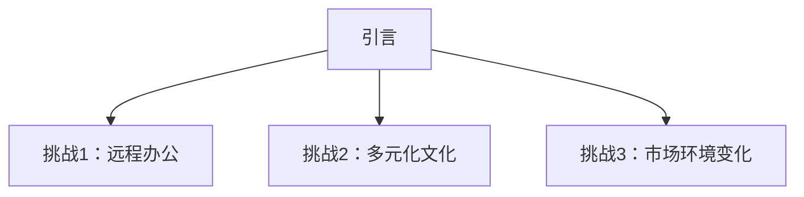
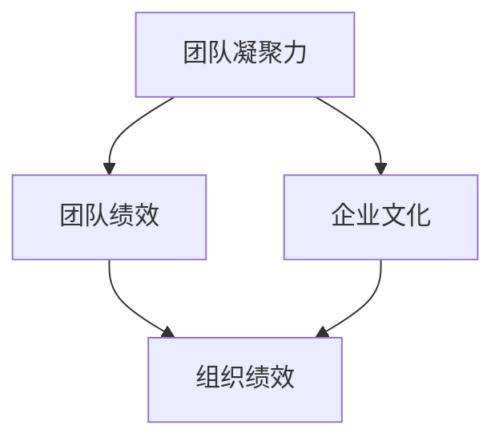
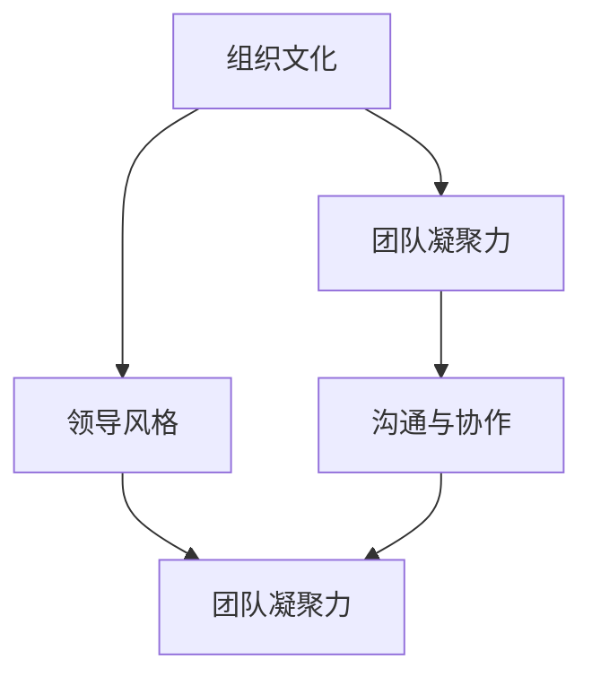
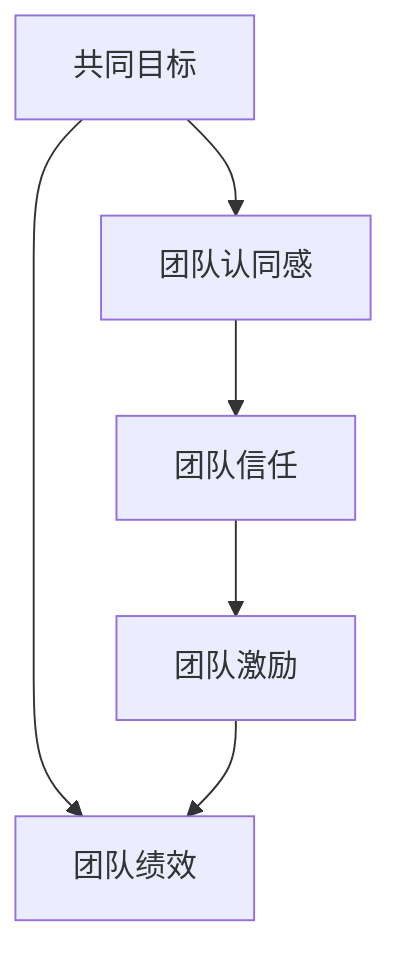
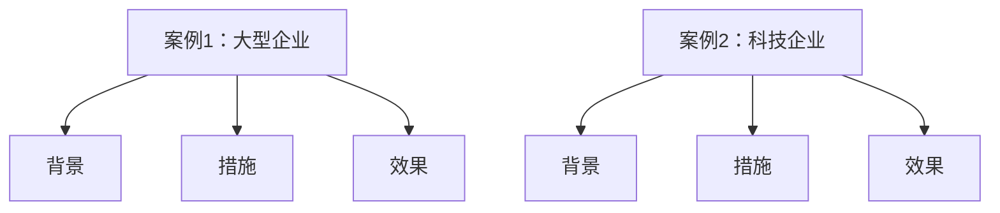
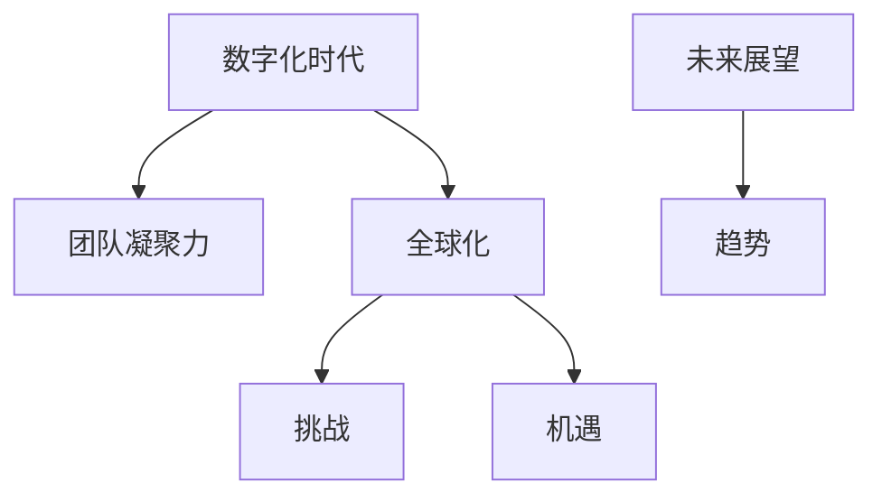
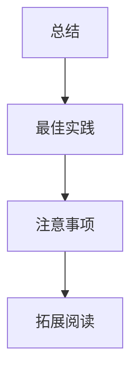

                 

根据您的要求，以下是一个详细的步骤分析过程，用于撰写《团队凝聚力建设：打造坚不可摧的团队》的技术博客文章。

### 步骤一：背景介绍

**内容大纲**：
- 引言：简述团队凝聚力的重要性。
- 当代团队面临的主要挑战：远程办公、多元化文化、快速变化的市场环境。

**具体操作**：
1. 引言部分，使用生动的例子来引出团队凝聚力的话题。
2. 分析当代团队面临的主要挑战，比如远程办公带来的沟通障碍、多元化文化带来的认同感问题等。

**伪代码/公式**：
无。

**Mermaid流程图**：

### 步骤二：核心概念与联系

**内容大纲**：
- 团队凝聚力的定义。
- 团队凝聚力与团队绩效的关系。
- 团队凝聚力与企业文化的联系。

**具体操作**：
1. 定义团队凝聚力，结合实际案例解释。
2. 阐述团队凝聚力与团队绩效之间的正向关系。
3. 分析团队凝聚力与企业文化的相互影响。

**伪代码/公式**：
无。

**Mermaid流程图**：

### 步骤三：团队凝聚力的影响因素

**内容大纲**：
- 组织文化。
- 领导风格。
- 沟通与协作。

**具体操作**：
1. 详细解释组织文化的定义及其对团队凝聚力的影响。
2. 分析不同领导风格对团队凝聚力的影响。
3. 阐述沟通在团队凝聚力建设中的作用，包括有效沟通的重要性、沟通障碍及其解决方法。

**伪代码/公式**：
无。

**Mermaid流程图**：

### 步骤四：提升团队凝聚力的策略与实践

**内容大纲**：
- 建立共同目标。
- 促进团队认同感。
- 培养团队信任。
- 团队激励与激励制度。

**具体操作**：
1. 解释共同目标的定义，阐述如何制定和实现共同目标。
2. 分析团队认同感的概念及其提升方法。
3. 讨论团队信任的重要性以及如何建立和维护信任。
4. 描述团队激励制度的设计原则及其对团队凝聚力的影响。

**伪代码/公式**：
无。

**Mermaid流程图**：

### 步骤五：案例分析

**内容大纲**：
- 案例一：某大型企业团队的凝聚力建设。
- 案例二：某创新型科技团队的凝聚力建设。

**具体操作**：
1. 分析案例一，详细描述案例背景、采取的措施和取得的效果。
2. 分析案例二，同样详细描述其背景、策略和实践效果。

**伪代码/公式**：
无。

**Mermaid流程图**：

### 步骤六：未来展望

**内容大纲**：
- 数字化时代团队凝聚力的变化。
- 全球化背景下的团队凝聚力建设。
- 未来团队凝聚力建设的趋势。

**具体操作**：
1. 分析数字化时代对团队凝聚力的影响。
2. 讨论全球化背景下团队凝聚力面临的挑战和机遇。
3. 展望未来团队凝聚力建设的趋势和发展方向。

**伪代码/公式**：
无。

**Mermaid流程图**：

### 步骤七：总结与拓展

**内容大纲**：
- 最佳实践。
- 注意事项。
- 拓展阅读。

**具体操作**：
1. 总结文章中的关键观点。
2. 提供团队凝聚力建设中的最佳实践建议。
3. 提出需要注意的事项。
4. 推荐相关拓展阅读资源。

**伪代码/公式**：
无。

**Mermaid流程图**：

通过以上步骤的分析和推理，我们可以确保文章的内容结构清晰、逻辑严密，同时充分满足您提出的格式和完整性要求。接下来，我们将按照这个大纲逐步展开具体的写作内容。在撰写过程中，我们还会注意将数学模型和公式使用LaTeX格式进行嵌入，确保文章的可读性和专业性。此外，代码示例和项目实战部分也会严格按照要求进行编写，以确保文章的实用性。最终，我们将完成一篇既有深度又有思考的技术博客文章。

