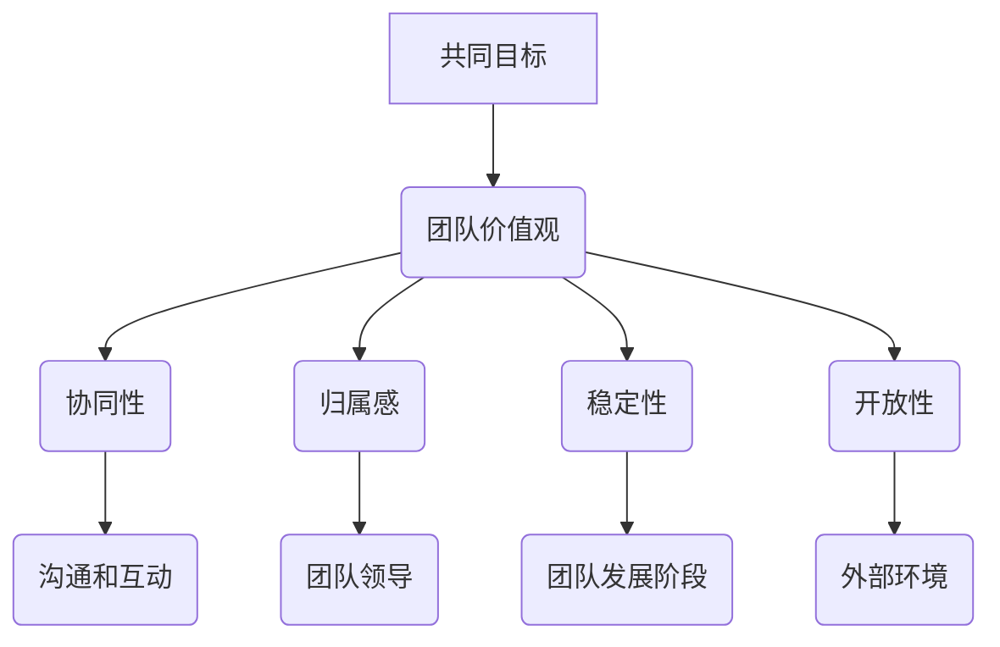

                 

### 文章标题：《团队凝聚力强化训练：建立牢固信任关系》

关键词：团队凝聚力、信任关系、团队互动、团队领导、信任度评估

摘要：本文旨在探讨如何通过强化训练来提升团队凝聚力，特别是如何建立和维持团队成员之间的信任关系。我们将从核心概念、算法原理、数学模型、项目实战等多个角度，详细分析团队凝聚力和信任关系的重要性，并提出一系列切实可行的策略和工具，以帮助团队领导者有效地提升团队的整体效能。

## 第一部分：引言

### 第1章 团队凝聚力和信任关系的意义

在当今快速变化和竞争激烈的环境中，团队凝聚力和信任关系对于组织的成功至关重要。团队凝聚力指的是团队成员之间的紧密合作和共同目标的追求，而信任关系则是团队成员之间的互信和相互依赖。这两个概念相互关联，共同构成了团队高效运作的基础。

### 1.1 团队凝聚力的概念和重要性

团队凝聚力是指团队成员在共同目标和价值观下，形成的紧密合作和相互支持的关系。一个高凝聚力的团队具有以下特点：

- 高度协同的工作方式
- 强烈的责任感和归属感
- 高效的信息传递和知识共享
- 快速响应和解决问题的能力

团队凝聚力对组织的意义在于：

- 提高工作效率和生产力
- 增强团队的创新能力和竞争力
- 降低团队成员的流动率
- 提升组织的整体绩效和员工满意度

### 1.2 信任关系的概念和重要性

信任关系是指团队成员之间基于相互信任和尊重的互动方式。信任关系的重要性体现在以下几个方面：

- 促进有效的沟通和协作
- 减少误解和冲突
- 增强团队的稳定性和韧性
- 提高团队决策的质量和执行力度

建立和维持信任关系对于团队凝聚力的提升至关重要，因为信任是团队合作的基石。

### 1.3 为什么团队需要强化训练

尽管团队凝聚力和信任关系对于团队的成功至关重要，但在实际操作中，许多团队往往难以达到理想的状态。以下是几个导致团队凝聚力不足和信任关系缺失的原因：

- 缺乏明确的共同目标和价值观
- 团队成员之间的沟通不畅
- 领导者角色不明确或未能发挥应有作用
- 缺乏有效的团队建设和训练活动

为了克服这些挑战，团队需要进行强化训练。强化训练包括一系列旨在提升团队凝聚力和信任关系的活动和策略。通过这些训练，团队可以：

- 明确共同目标和价值观
- 提高团队成员的沟通技巧
- 增强领导者的领导能力
- 通过活动和互动建立信任关系

### 总结

在本章中，我们介绍了团队凝聚力和信任关系的概念和重要性，并探讨了为什么团队需要强化训练。在接下来的章节中，我们将深入探讨团队凝聚力和信任关系的核心概念、算法原理、数学模型以及项目实战，提供一系列实用的策略和工具，帮助团队领导者有效地提升团队的整体效能。

## 第二部分：核心概念与联系

### 第2章 团队凝聚力

团队凝聚力是指团队成员在共同目标和价值观下，形成的紧密合作和相互支持的关系。一个高凝聚力的团队不仅能够高效地完成工作任务，还能在面对挑战时保持稳定和韧性。下面，我们将详细探讨团队凝聚力的定义、特征及其影响因素。

### 2.1 团队凝聚力的定义和特征

团队凝聚力的定义可以从多个角度进行理解：

- **社会心理学角度**：团队凝聚力是指团队成员之间相互吸引、相互依赖的心理状态。
- **组织行为学角度**：团队凝聚力是指团队成员对团队目标的共同认同和承诺，以及为实现这些目标而共同努力的程度。

团队凝聚力的特征主要包括：

- **协同性**：团队成员能够协同工作，共同完成团队任务。
- **归属感**：团队成员对团队有强烈的归属感，愿意为团队的成功贡献自己的力量。
- **稳定性**：团队在面对外部压力和内部冲突时能够保持稳定，不轻易解体。
- **开放性**：团队成员之间愿意分享信息、知识和经验，促进团队的共同成长。

### 2.2 团队凝聚力的影响因素

团队凝聚力受到多种因素的影响，主要包括以下几个方面：

- **共同目标和价值观**：明确的共同目标和价值观是团队凝聚力的重要基础。当团队成员对目标有共同的理解和认同时，团队的凝聚力会显著增强。
- **沟通和互动**：团队成员之间的有效沟通和互动是建立团队凝聚力的重要途径。良好的沟通能够增进理解，减少误解和冲突。
- **团队领导**：团队领导在团队凝聚力中扮演关键角色。一个优秀的领导者能够通过制定明确的目标、提供支持和激励，增强团队的凝聚力。
- **团队发展阶段**：团队凝聚力在不同的发展阶段会表现出不同的特点。在团队的成立初期，凝聚力可能较低，但随着团队的成熟和发展，凝聚力会逐渐增强。
- **外部环境**：外部环境的变化也会对团队凝聚力产生影响。例如，组织的变革、外部压力的增加等，都可能对团队的凝聚力造成影响。

### 2.3 团队凝聚力的评估方法

评估团队凝聚力是一项复杂的工作，需要综合考虑多个方面的因素。以下是一些常用的评估方法：

- **问卷评估**：通过设计问卷，收集团队成员对团队凝聚力的主观感受和评价。
- **行为观察**：观察团队成员在日常工作中的互动和协作行为，评估团队凝聚力。
- **绩效指标**：通过团队在任务完成情况、工作质量、创新能力等绩效指标上表现，评估团队凝聚力。
- **访谈和反馈**：通过与团队成员进行访谈和反馈，深入了解他们对团队凝聚力的看法和建议。

### 团队凝聚力的Mermaid流程图

下面是一个简单的Mermaid流程图，展示了团队凝聚力各要素之间的关系：

通过这个流程图，我们可以清晰地看到团队凝聚力各要素之间的相互关系和作用。

### 总结

在本章中，我们详细探讨了团队凝聚力的概念、特征及其影响因素，并介绍了团队凝聚力的评估方法。团队凝聚力不仅是团队高效运作的重要保障，也是组织成功的关键因素。在下一章中，我们将继续探讨信任关系的概念和建立信任关系的方法，帮助团队领导者更好地提升团队的整体效能。

## 第3章 信任关系

信任关系是团队凝聚力的重要组成部分，它不仅是团队成员之间互动的基础，也是团队高效运作的保障。在本章中，我们将深入探讨信任关系的概念、特征及其建立和维护的方法。

### 3.1 信任关系的定义和特征

信任关系是指团队成员之间基于相互信任和尊重的互动方式。它是一种心理状态，反映了团队成员对彼此能力和诚信的信任程度。以下是信任关系的几个关键特征：

- **可靠性**：团队成员能够履行承诺，按时完成任务，并在需要时提供支持。
- **诚信**：团队成员言行一致，不隐瞒信息，保持透明度。
- **尊重**：团队成员尊重他人的观点和意见，不轻视或贬低他人。
- **同理心**：团队成员能够站在他人的角度思考问题，理解他人的需求和感受。

信任关系的特征决定了它对团队的重要作用，包括：

- **促进有效沟通**：信任使团队成员更愿意分享信息，减少误解和冲突。
- **提高协作效率**：信任减少了团队成员之间的猜忌和防范，提高了协作效率。
- **增强团队稳定性**：信任关系有助于团队在面对外部压力和内部挑战时保持稳定。
- **促进团队创新**：信任鼓励团队成员提出新的想法和建议，推动团队创新。

### 3.2 信任关系的建立和维护

建立和维护信任关系需要团队成员共同努力，以下是一些关键步骤：

- **透明沟通**：团队成员应保持沟通的透明度，避免隐瞒信息。及时分享进展、问题和解决方案，有助于建立信任。
- **履行承诺**：团队成员应履行自己的承诺，保持一致性和可靠性。兑现承诺是建立信任的重要方式。
- **相互尊重**：团队成员应尊重彼此的观点和意见，避免冲突和争执。尊重是建立和谐团队氛围的基础。
- **提供支持**：在团队成员需要帮助时，提供必要的支持和资源。这种互助精神有助于增强团队凝聚力。
- **积极反馈**：通过积极的反馈和鼓励，增强团队成员之间的信任。真诚的赞扬和认可有助于建立信任。
- **冲突解决**：当团队出现冲突时，应积极寻求解决方案，避免积累怨恨。有效的冲突解决机制有助于维护信任关系。

### 3.3 信任关系的破坏因素

信任关系虽然容易建立，但也很容易受到破坏。以下是一些常见的信任关系破坏因素：

- **沟通障碍**：不充分的沟通或误解可能导致信任的破裂。
- **诚信问题**：一旦团队成员发现他人不诚实，信任将迅速崩溃。
- **不公平待遇**：不公平的待遇或资源分配可能导致团队成员之间的不满和猜忌。
- **压力过大**：在高压环境下，团队成员可能会采取防御性措施，从而破坏信任关系。

为了防止信任关系的破坏，团队领导者应：

- **建立良好的沟通机制**：确保团队成员之间有畅通的沟通渠道。
- **维护公平和公正**：确保资源分配和决策过程公平透明。
- **提供心理支持**：在压力下，提供心理支持帮助团队成员保持积极心态。

### 总结

在本章中，我们详细探讨了信任关系的概念、特征及其建立和维护的方法。信任关系是团队高效运作的重要保障，它不仅促进了团队成员之间的有效沟通和协作，还增强了团队的稳定性和创新力。在下一章中，我们将探讨团队成员之间的互动和沟通，以及如何通过有效的互动和沟通提升团队凝聚力。

## 第4章 团队成员之间的互动和沟通

团队成员之间的互动和沟通是团队凝聚力和信任关系的重要支柱。有效的互动和沟通能够增强团队成员之间的理解、信任和协作，从而提高团队的整体效能。在本章中，我们将详细探讨团队成员之间的互动和沟通，包括互动的形式、沟通的技巧以及提升互动和沟通效果的方法。

### 4.1 团队成员之间的互动

团队成员之间的互动是指团队成员在共同工作过程中通过各种方式进行的交流和合作。互动的形式多种多样，包括：

- **面对面交流**：面对面交流是最直接、最有效的互动形式。它能够通过身体语言、面部表情和肢体动作增强沟通效果。
- **电话和视频会议**：在远程办公或跨地域团队中，电话和视频会议成为重要的互动方式。它们能够实时传递信息，提高沟通效率。
- **在线协作工具**：如即时通讯工具、共享文档和项目管理工具等，能够方便团队成员实时交流和协作。
- **团队活动**：如团建活动、研讨会和培训等，能够增强团队成员之间的情感联系和团队凝聚力。

团队成员之间的互动具有以下重要作用：

- **增强理解**：通过互动，团队成员能够更深入地了解彼此的工作方式和需求，减少误解和冲突。
- **提高协作效率**：有效的互动能够确保团队成员在任务执行过程中信息畅通，提高协作效率。
- **促进知识共享**：团队成员通过互动可以分享经验和知识，促进团队的共同成长。
- **增强团队凝聚力**：频繁的互动有助于建立团队成员之间的信任和情感联系，增强团队的凝聚力。

### 4.2 团队成员之间的沟通

沟通是团队成员之间互动的核心内容。有效的沟通不仅能够传递信息，还能够增进理解、建立信任和促进协作。团队成员之间的沟通应遵循以下原则：

- **透明沟通**：团队成员应保持沟通的透明度，避免隐瞒信息。透明的沟通有助于建立信任和减少误解。
- **主动沟通**：团队成员应主动沟通，表达自己的观点和需求。主动沟通有助于建立开放的沟通环境，促进信息的流通。
- **倾听**：团队成员应倾听他人的意见和反馈，尊重他人的观点。倾听是有效沟通的重要一环，有助于建立信任和理解。
- **清晰表达**：团队成员应确保自己的表达清晰明了，避免使用模糊或歧义的语言。清晰的表达有助于减少误解和冲突。

为了提升沟通效果，团队成员可以采取以下方法：

- **定期会议**：定期举行团队会议，讨论项目进展、问题和解决方案，确保信息的及时传达。
- **反馈机制**：建立有效的反馈机制，鼓励团队成员提供反馈和建议。反馈有助于团队成员之间相互学习，改进工作方式。
- **培训**：通过沟通技巧培训，提高团队成员的沟通能力。有效的沟通技巧包括清晰表达、倾听和有效提问等。
- **使用技术工具**：利用在线协作工具和通信平台，提高沟通的效率和效果。如视频会议、共享文档和项目管理工具等。

### 4.3 提高团队成员互动和沟通的技巧

为了提高团队成员之间的互动和沟通效果，以下是一些实用的技巧：

- **建立共同目标**：明确共同目标有助于团队成员更好地协作和沟通。共同目标能够增强团队成员之间的理解和信任。
- **制定沟通计划**：制定详细的沟通计划，包括沟通频率、方式和内容。沟通计划有助于确保团队成员之间的信息流通。
- **开展团队建设活动**：通过团队建设活动，增强团队成员之间的情感联系和沟通。如团队培训、团建活动和团队游戏等。
- **建立信任机制**：通过建立信任机制，增强团队成员之间的信任和依赖。如透明的决策过程、公平的资源分配和积极的反馈机制等。
- **鼓励开放沟通**：鼓励团队成员开放沟通，表达自己的观点和感受。开放沟通有助于建立积极的沟通氛围，减少误解和冲突。

### 总结

在本章中，我们详细探讨了团队成员之间的互动和沟通的重要性，以及如何通过有效的互动和沟通提升团队凝聚力和信任关系。互动和沟通不仅是团队运作的基础，也是团队成功的关键。通过建立良好的互动和沟通机制，团队成员能够更好地理解彼此、建立信任并共同实现团队目标。在下一章中，我们将探讨团队领导的作用，以及如何通过有效的领导提升团队凝聚力和信任关系。

## 第5章 团队领导的作用

在提升团队凝聚力和信任关系的过程中，团队领导起着至关重要的作用。一个优秀的领导者不仅能够为团队设定明确的目标和方向，还能够通过有效的管理和领导艺术，促进团队成员之间的互动和信任。以下是团队领导在团队凝聚力和信任关系中扮演的关键角色。

### 5.1 团队领导的角色和职责

团队领导在团队中扮演多种角色，包括：

- **愿景设定者**：领导者需要为团队设定清晰的愿景和目标，确保团队成员了解团队的方向和目标。
- **决策者**：领导者负责做出关键决策，确保团队行动的一致性和有效性。
- **协调者**：领导者需要协调团队成员之间的工作，确保团队成员能够高效协作。
- **激励者**：领导者需要激励团队成员，提高团队的士气和动力。
- **倾听者**：领导者需要倾听团队成员的意见和建议，了解团队成员的需求和困扰。

团队领导者的职责包括：

- **明确目标和期望**：设定明确的工作目标和期望，确保团队成员了解自己的职责和目标。
- **提供资源和支持**：为团队成员提供必要的资源和帮助，确保团队工作的顺利进行。
- **建立沟通机制**：建立有效的沟通机制，确保团队成员之间的信息畅通。
- **促进团队成员发展**：关注团队成员的成长和进步，提供培训和指导，提升团队成员的能力。
- **解决冲突**：及时发现和解决团队内部的冲突，维护团队的和谐和稳定。

### 5.2 团队领导如何促进团队凝聚力和信任关系

为了促进团队凝聚力和信任关系，团队领导者可以采取以下策略：

- **建立共同目标**：领导者需要确保团队成员对共同目标有共同的理解和认同，共同目标是增强团队凝聚力的关键。
- **建立透明和开放的文化**：领导者应鼓励团队成员之间的开放沟通和透明度，建立信任的基础。
- **提供正面反馈**：领导者应给予团队成员积极的反馈和认可，增强团队成员的自信心和信任。
- **建立信任机制**：领导者应通过建立信任机制，如透明的决策过程和公平的资源分配，增强团队成员之间的信任。
- **解决冲突**：领导者应积极解决团队内部的冲突，避免冲突积累和扩大，维护团队的和谐和稳定。
- **关注团队成员的需求**：领导者应关注团队成员的需求和困扰，提供必要的支持和帮助，增强团队成员的归属感和信任。

### 5.3 团队领导的艺术

优秀的团队领导不仅需要具备一定的知识和技能，还需要掌握一定的领导艺术：

- **影响力**：领导者需要通过自身的言行和决策，对团队成员产生积极的影响，带动团队共同前进。
- **适应性**：领导者需要具备适应不同环境和情境的能力，灵活调整领导风格和策略。
- **倾听和沟通**：领导者需要具备良好的倾听和沟通能力，与团队成员建立良好的关系，增强团队凝聚力。
- **激励**：领导者需要能够激励团队成员，激发团队成员的积极性和创造力。
- **领导力发展**：领导者需要不断提升自身的领导力，通过培训和学习，掌握新的领导方法和技能。

### 总结

在本章中，我们探讨了团队领导在团队凝聚力和信任关系中的关键作用。一个优秀的领导者能够通过设定共同目标、建立透明文化、提供正面反馈、解决冲突和关注团队成员需求等多种方式，促进团队凝聚力和信任关系的提升。通过掌握领导艺术，领导者能够更好地引导团队，实现团队的目标和愿景。在下一章中，我们将深入探讨信任度的评估方法，帮助团队领导者更科学地评估和管理团队凝聚力。

## 第6章 信任度的评估方法

在提升团队凝聚力和信任关系的实践中，评估信任度是一个关键环节。通过科学的评估方法，团队领导者可以了解团队成员之间的信任水平，识别潜在的问题，并采取相应的措施。以下是几种常见的信任度评估方法。

### 6.1 信任度评估的定义和目的

信任度评估是指通过系统的方法和工具，对团队成员之间的信任程度进行测量和评估。其目的是：

- **识别信任问题**：通过评估，团队领导者可以了解团队成员之间的信任状况，发现信任缺失的环节。
- **制定改进策略**：评估结果为团队领导者提供了制定提升信任度的策略和行动计划的依据。
- **监控进展**：定期进行信任度评估，可以帮助团队领导者监控信任度提升的进展，及时调整策略。

### 6.2 信任度评估的指标和方法

评估信任度通常涉及以下几个指标：

- **沟通质量**：包括信息传递的及时性、准确性和完整性。
- **合作意愿**：团队成员是否愿意共同解决问题，支持其他成员。
- **责任感**：团队成员是否履行自己的职责，对团队的成果承担责任。
- **冲突解决**：团队内部冲突是否能够得到有效解决。
- **透明度**：团队决策过程和信息分享的透明度。

常用的评估方法包括：

- **问卷调查**：设计针对信任度各个指标的问卷，收集团队成员的反馈。这种方法操作简单，能够量化评估结果。
- **访谈**：通过与团队成员进行一对一或小组访谈，深入了解他们对信任度的看法和感受。访谈能够获取更深入的信息。
- **行为观察**：通过观察团队成员在日常工作中的互动和协作行为，评估他们的信任程度。这种方法直观、可靠。
- **情境模拟**：设计一些模拟情境，观察团队成员在这些情境下的互动和表现，评估他们的信任水平。

### 6.3 信任度评估的应用案例

以下是一个简单的信任度评估应用案例：

**案例背景**：某技术团队在项目推进过程中，频繁出现沟通不畅、责任不清和冲突等问题，团队领导者决定进行信任度评估。

**评估过程**：
1. **设计问卷**：根据信任度评估的指标，设计了一份包含10个问题的信任度问卷，涵盖沟通质量、合作意愿、责任感等多个方面。
2. **发放问卷**：将问卷发送给团队成员，要求他们在规定时间内完成填写。
3. **数据收集**：收集并整理问卷数据，进行统计分析。
4. **分析结果**：通过分析问卷结果，发现团队在沟通质量和责任感方面存在较大问题。

**改进措施**：
1. **沟通培训**：组织团队成员参加沟通技巧培训，提高沟通效率。
2. **明确责任**：重新分配任务，明确每个成员的职责。
3. **冲突管理**：建立冲突解决机制，鼓励团队成员积极解决冲突。

**效果评估**：在改进措施实施后，团队领导者再次进行信任度评估，发现团队在沟通质量和责任感方面的评分显著提升。

### 总结

在本章中，我们探讨了信任度评估的定义、目的和常用方法，并通过一个实际案例展示了如何应用信任度评估来提升团队凝聚力。信任度评估不仅有助于识别问题，还能为团队提供具体的改进方向，是提升团队凝聚力和信任关系的重要工具。

## 第7章 团队互动模型分析

团队互动模型是指用于描述团队成员之间互动方式和机制的理论框架。通过分析团队互动模型，可以深入了解团队成员之间的相互作用，从而为提升团队凝聚力和信任关系提供理论支持。以下是团队互动模型的基本概念、建立方法和应用。

### 7.1 团队互动模型的定义和作用

团队互动模型是指通过系统化的理论和方法，描述和分析团队成员之间互动的规律和模式。它包括以下几个核心要素：

- **互动主体**：团队成员之间的互动是团队互动模型的核心，每个团队成员都是互动的主体。
- **互动内容**：团队成员之间的互动内容可以是信息、资源、意见、建议等。
- **互动环境**：团队互动的环境包括物理环境、社会环境和心理环境，这些环境因素会影响互动的质量和效果。
- **互动机制**：团队互动的机制包括沟通、协作、竞争、冲突等互动方式。

团队互动模型的作用主要体现在以下几个方面：

- **指导团队建设**：团队互动模型为团队建设提供了理论依据，帮助团队领导者设计和实施有效的团队互动活动。
- **分析互动问题**：通过团队互动模型，可以分析团队互动中的问题和不足，为改进团队互动提供方向。
- **提升互动效果**：团队互动模型提供了优化互动策略的方法，有助于提高团队互动的质量和效率。

### 7.2 团队互动模型的建立方法

建立团队互动模型通常包括以下几个步骤：

1. **确定研究目标**：明确团队互动模型的研究目标，例如分析团队互动的特点、模式或问题。
2. **收集数据**：通过问卷调查、访谈、观察等方法，收集团队成员之间的互动数据和相关信息。
3. **构建模型框架**：根据收集的数据，构建团队互动模型的基本框架，包括互动主体、互动内容、互动环境和互动机制等。
4. **验证模型**：通过实际案例验证团队互动模型的有效性，根据验证结果调整和优化模型。
5. **应用模型**：将团队互动模型应用于团队建设和管理实践中，指导团队互动的优化和改进。

### 7.3 团队互动模型的应用案例

以下是一个团队互动模型的应用案例：

**案例背景**：某互联网公司的产品开发团队在项目推进过程中，发现团队成员之间的互动较少，导致沟通不畅、任务拖延。为了改善团队互动，团队领导者决定应用团队互动模型。

**模型构建**：
1. **确定研究目标**：分析团队互动的特点，找出互动不足的原因。
2. **收集数据**：通过问卷调查和访谈，收集团队成员对互动情况的反馈。
3. **构建模型框架**：根据收集的数据，构建了一个包含互动主体、互动内容、互动环境和互动机制的团队互动模型。
   - 互动主体：团队成员
   - 互动内容：项目信息、问题解决方案、建议和反馈
   - 互动环境：远程办公环境、项目管理工具、面对面会议
   - 互动机制：沟通、协作、冲突解决

**模型验证和应用**：
1. **验证模型**：在实际项目中应用模型，观察团队成员的互动行为和效果，根据反馈调整模型。
2. **应用模型**：通过模型指导团队互动的优化，例如：
   - 增加团队会议频率，提高沟通效率。
   - 使用项目管理工具，确保任务分配和进展透明。
   - 建立冲突解决机制，及时解决团队内部的矛盾。

**效果评估**：经过一段时间的实践，团队互动质量显著提升，项目进展顺利，团队成员之间的信任度也明显增强。

### 总结

在本章中，我们介绍了团队互动模型的基本概念、建立方法和应用案例。通过团队互动模型，团队领导者可以更科学地分析和优化团队互动，提升团队凝聚力和信任关系。在下一章中，我们将探讨信任危机的应对策略，帮助团队应对信任问题，确保团队关系的稳定和健康发展。

## 第8章 信任危机的应对策略

在团队运作过程中，信任危机是不可避免的问题。信任危机指的是团队成员之间的信任水平降低，导致沟通不畅、协作受阻和关系紧张的现象。信任危机不仅会影响团队的日常运作，还可能对项目的成功产生负面影响。因此，如何应对信任危机成为团队领导者的一项重要任务。以下是应对信任危机的几种策略。

### 8.1 信任危机的定义和特征

信任危机是指团队成员之间的信任水平下降，导致团队内部出现不信任、猜忌和矛盾的现象。信任危机的特征包括：

- **沟通障碍**：团队成员之间沟通不畅，信息传递受阻，误解和冲突增加。
- **协作困难**：团队成员在协作过程中难以相互信任，导致任务进展缓慢，效率低下。
- **关系紧张**：团队成员之间的关系变得紧张，互相防范，不愿意分享信息和资源。
- **负面影响**：信任危机对团队的士气和士气产生负面影响，导致团队成员的流动率和离职率增加。

### 8.2 信任危机的应对策略

应对信任危机需要从多个方面进行，以下是一些常见的策略：

1. **透明沟通**：增强团队沟通的透明度，确保团队成员了解团队的情况和决策过程。透明的沟通有助于消除误解和猜忌，重建信任。
   - **具体措施**：定期召开团队会议，分享项目进展、问题和解决方案；通过邮件、即时通讯工具等渠道及时传达信息。

2. **建立信任机制**：制定明确的信任机制，如诚信准则、反馈机制和透明决策过程，帮助团队成员建立信任。
   - **具体措施**：制定团队诚信准则，明确团队成员的行为规范；建立反馈机制，鼓励团队成员提供建设性意见；确保决策过程的透明度。

3. **冲突解决**：建立有效的冲突解决机制，及时解决团队内部的矛盾和问题，防止信任危机的扩大。
   - **具体措施**：设立专门的冲突解决小组或专员，负责处理团队内部的冲突；提供冲突解决培训，提高团队成员的解决能力。

4. **激励机制**：通过激励机制，提高团队成员的责任感和合作意愿，增强团队凝聚力。
   - **具体措施**：设立团队奖励制度，对表现突出的团队成员进行表彰；通过团队建设活动，增强团队成员之间的情感联系。

5. **培训和教育**：通过培训和教育活动，提高团队成员的信任意识和管理能力，预防信任危机的发生。
   - **具体措施**：组织信任管理培训，介绍信任的重要性、建立和维护信任的方法；开展团队建设活动，如团队合作训练、沟通技巧培训等。

### 8.3 信任危机的预防措施

除了应对信任危机，预防信任危机也是团队管理的重要内容。以下是一些预防措施：

- **建立信任文化**：在团队中营造信任文化，让信任成为团队的价值观和行为准则。
  - **具体措施**：通过团队会议、内部宣传等方式，强调信任的重要性；鼓励团队成员相互信任，建立良好的工作关系。

- **加强沟通**：通过加强团队沟通，提高团队成员之间的了解和信任。
  - **具体措施**：定期召开团队会议，讨论项目进展和问题；鼓励团队成员之间进行开放和真诚的沟通。

- **明确目标和职责**：确保团队成员明确团队的目标和自己的职责，减少误解和冲突。
  - **具体措施**：制定明确的项目目标和职责分配，确保团队成员了解自己的任务和责任。

- **透明决策**：确保团队决策过程的透明度，让团队成员参与决策过程，增强他们的责任感和信任感。
  - **具体措施**：在决策过程中，鼓励团队成员提出意见和建议，确保他们的意见得到尊重。

### 总结

在本章中，我们探讨了信任危机的定义和特征，以及应对信任危机的策略和预防措施。通过透明的沟通、建立信任机制、有效的冲突解决和激励机制，团队领导者可以有效地应对信任危机，重建团队成员之间的信任关系。预防信任危机的举措也是团队管理的重要内容，通过建立信任文化、加强沟通和明确目标和职责，团队可以避免信任危机的发生，保持稳定和高效的工作氛围。在下一章中，我们将介绍如何运用数学模型和数学公式来评估和优化团队凝聚力和信任关系。

## 第9章 信任关系的数学表达

在团队管理中，信任关系的量化评估是一个复杂而重要的任务。通过数学模型和数学公式，我们可以将信任关系转化为可量化的指标，从而更准确地评估团队凝聚力。在本章中，我们将探讨信任关系的数学表达，包括相关的数学公式和模型，并通过具体示例进行说明。

### 9.1 信任关系的数学公式

信任关系的数学表达通常涉及以下几个关键指标：

1. **信任度（Trust Level）**：
   - **公式**：\( T = \frac{A - B}{A + B} \)
   - **解释**：其中，\( A \) 表示团队成员对另一个成员的正面评价总和，\( B \) 表示负面评价总和。该公式通过计算正负评价的比例来衡量信任度。值范围在 \([-1, 1]\) 之间，接近 1 表示高信任度，接近 -1 表示低信任度。

2. **信任指数（Trust Index）**：
   - **公式**：\( TI = \frac{\sum_{i=1}^{n} T_{i}}{n} \)
   - **解释**：其中，\( T_{i} \) 表示每个团队成员的信任度，\( n \) 是团队成员的数量。信任指数是所有成员信任度的平均值，用于衡量整个团队的信任水平。

3. **信任强度（Trust Strength）**：
   - **公式**：\( TS = \sum_{i=1}^{n} T_{i} \)
   - **解释**：信任强度是团队成员信任度的总和，反映了团队整体的信任力量。

### 9.2 信任关系的数学模型

信任关系的数学模型通常基于网络分析和社会网络理论。以下是几个常用的数学模型：

1. **网络信任模型**：
   - **公式**：\( T(u, v) = \frac{1}{\sum_{w \in N(u)} \frac{1}{T(u, w) \cdot T(v, w)}} \)
   - **解释**：其中，\( u \) 和 \( v \) 是两个团队成员，\( N(u) \) 是 \( u \) 的邻居节点集合。该模型通过计算成员之间的路径长度和相互信任的强度来衡量信任关系。

2. **社会网络信任模型**：
   - **公式**：\( T(u, v) = \frac{1}{1 + \exp(-\lambda \cdot d(u, v) - \mu \cdot s(u, v))} \)
   - **解释**：其中，\( d(u, v) \) 是 \( u \) 和 \( v \) 之间的距离，\( s(u, v) \) 是 \( u \) 和 \( v \) 之间的相似度，\( \lambda \) 和 \( \mu \) 是调节参数。该模型结合了距离和相似度来衡量信任关系。

3. **基于信任度的动态模型**：
   - **公式**：\( T(u, v) = T_0(u, v) \cdot e^{-\gamma \cdot t} \)
   - **解释**：其中，\( T_0(u, v) \) 是初始信任度，\( \gamma \) 是衰减速率，\( t \) 是时间。该模型描述了信任度随时间衰减的过程，反映了信任关系的动态变化。

### 9.3 信任关系的数学公式应用案例

以下是一个简单的应用案例，用于评估团队成员之间的信任度：

**案例背景**：在一个五人团队中，团队成员之间的评价如下：

- 成员A对成员B的评价：正面3次，负面1次
- 成员B对成员A的评价：正面2次，负面0次
- 成员C对成员A的评价：正面4次，负面0次
- 成员D对成员A的评价：正面1次，负面1次
- 成员E对成员A的评价：正面2次，负面1次

**计算过程**：
1. 成员A的信任度：
   \( T(A) = \frac{(3 - 1)}{(3 + 1)} = \frac{2}{4} = 0.5 \)
2. 成员B的信任度：
   \( T(B) = \frac{(2 - 0)}{(2 + 0)} = \frac{2}{2} = 1 \)
3. 成员C的信任度：
   \( T(C) = \frac{(4 - 0)}{(4 + 0)} = \frac{4}{4} = 1 \)
4. 成员D的信任度：
   \( T(D) = \frac{(1 - 1)}{(1 + 1)} = \frac{0}{2} = 0 \)
5. 成员E的信任度：
   \( T(E) = \frac{(2 - 1)}{(2 + 1)} = \frac{1}{3} \approx 0.333 \)

**团队信任指数**：
\( TI = \frac{0.5 + 1 + 1 + 0 + 0.333}{5} = \frac{2.833}{5} \approx 0.567 \)

通过以上计算，我们得出了团队成员之间的信任度，并计算了团队的信任指数。信任指数越高，说明团队的信任水平越高。

### 总结

在本章中，我们介绍了信任关系的数学表达，包括相关的数学公式和模型。通过这些数学工具，团队领导者可以更准确地评估和优化团队凝聚力。在实际应用中，需要根据具体情况进行调整和优化，以确保信任关系的数学表达能够准确反映团队的实际情况。在下一章中，我们将探讨团队成员之间的相互作用模型，进一步分析团队凝聚力和信任关系。

## 第10章 团队成员之间的相互作用模型

团队成员之间的相互作用模型用于描述和分析团队成员之间的互动关系和影响。通过构建相互作用模型，团队领导者可以更深入地理解团队成员之间的动态关系，从而优化团队管理和提升团队效能。以下是团队成员之间相互作用模型的基本概念、建立方法和应用。

### 10.1 团队成员之间相互作用模型的定义和作用

团队成员之间的相互作用模型是指通过系统化的理论和方法，描述团队成员之间互动关系及其对团队效能影响的模型。该模型的核心要素包括：

- **互动主体**：团队成员作为互动的主体，其行为和互动方式对团队的效能产生重要影响。
- **互动内容**：团队成员之间的互动内容，如信息交换、任务分配、意见交流等。
- **互动机制**：团队成员之间的互动机制，包括沟通、协作、竞争、冲突等。
- **环境影响**：外部环境因素，如组织文化、管理风格、工作压力等，对团队成员互动的影响。

团队成员之间相互作用模型的作用主要体现在以下几个方面：

- **指导团队建设**：通过相互作用模型，团队领导者可以了解团队成员之间的互动方式和问题，为团队建设提供指导。
- **分析互动问题**：相互作用模型有助于团队领导者分析团队互动中的问题和不足，制定改进策略。
- **提升团队效能**：通过优化团队成员之间的互动机制和环境，提升团队的整体效能和凝聚力。

### 10.2 团队成员之间相互作用模型的建立方法

建立团队成员之间相互作用模型通常包括以下几个步骤：

1. **确定研究目标**：明确相互作用模型的研究目标，例如分析团队互动的特点、模式或问题。
2. **收集数据**：通过问卷调查、访谈、观察等方法，收集团队成员之间的互动数据和相关信息。
3. **构建模型框架**：根据收集的数据，构建团队成员之间相互作用模型的基本框架，包括互动主体、互动内容、互动机制和环境影响等。
4. **验证模型**：通过实际案例验证相互作用模型的有效性，根据验证结果调整和优化模型。
5. **应用模型**：将相互作用模型应用于团队建设和管理实践中，指导团队互动的优化和改进。

### 10.3 团队成员之间相互作用模型的应用案例

以下是一个团队成员之间相互作用模型的应用案例：

**案例背景**：某研发团队在项目开发过程中，发现团队成员之间的互动较少，导致沟通不畅、任务拖延。为了改善团队互动，团队领导者决定应用相互作用模型。

**模型构建**：
1. **确定研究目标**：分析团队互动的特点，找出互动不足的原因。
2. **收集数据**：通过问卷调查和访谈，收集团队成员对互动情况的反馈。
3. **构建模型框架**：根据收集的数据，构建了一个包含互动主体、互动内容、互动机制和环境影响等要素的相互作用模型。
   - **互动主体**：团队成员
   - **互动内容**：项目信息、问题解决方案、意见和反馈
   - **互动机制**：沟通、协作、冲突解决
   - **环境影响**：远程办公环境、项目管理工具、组织文化

**模型验证和应用**：
1. **验证模型**：在实际项目中应用模型，观察团队成员的互动行为和效果，根据反馈调整模型。
2. **应用模型**：通过模型指导团队互动的优化，例如：
   - **增加团队会议频率**，提高沟通效率。
   - **使用项目管理工具**，确保任务分配和进展透明。
   - **建立冲突解决机制**，及时解决团队内部的矛盾。

**效果评估**：经过一段时间的实践，团队互动质量显著提升，项目进展顺利，团队成员之间的信任度也明显增强。

### 总结

在本章中，我们介绍了团队成员之间相互作用模型的基本概念、建立方法和应用案例。通过相互作用模型，团队领导者可以更科学地分析和优化团队互动，提升团队凝聚力和效能。在实际应用中，相互作用模型需要根据具体情况进行调整和优化，以确保其能够准确反映团队的实际情况。在下一章中，我们将探讨如何评估团队凝聚力，并提供具体的评估方法和工具。

## 第11章 评估团队凝聚力的指标

评估团队凝聚力是团队管理和领导的重要任务，通过科学的方法和指标，可以准确衡量团队的凝聚程度，从而为团队建设和改进提供依据。以下是常用的评估团队凝聚力的指标，以及评估方法和应用案例。

### 11.1 评估团队凝聚力的指标定义

1. **协作意愿**：
   - **定义**：指团队成员愿意与他人合作，共同完成任务的程度。
   - **评估方法**：通过问卷调查、访谈等方式，了解团队成员的协作意愿。

2. **沟通质量**：
   - **定义**：指团队成员之间沟通的有效性和效率。
   - **评估方法**：通过观察沟通行为、测量沟通频率和效率等指标进行评估。

3. **共同目标认同**：
   - **定义**：指团队成员对团队目标和价值观的认同程度。
   - **评估方法**：通过问卷调查、访谈等方式，了解团队成员对团队目标的认同程度。

4. **团队忠诚度**：
   - **定义**：指团队成员对团队的忠诚和归属感。
   - **评估方法**：通过问卷调查、员工满意度调查等方式，了解团队成员的忠诚度。

5. **冲突解决能力**：
   - **定义**：指团队解决内部冲突的能力和效率。
   - **评估方法**：通过观察团队处理冲突的行为和结果，评估冲突解决能力。

### 11.2 评估团队凝聚力的方法

1. **问卷调查**：
   - **优点**：操作简便，能够获取大量数据。
   - **缺点**：受主观因素影响较大，可能导致数据偏差。
   - **应用案例**：通过设计针对团队凝聚力各个指标的问卷，收集团队成员的意见和反馈，进行量化评估。

2. **访谈**：
   - **优点**：能够深入了解团队成员的真实想法和感受。
   - **缺点**：耗时较长，成本较高。
   - **应用案例**：与团队成员进行一对一或小组访谈，了解他们对团队凝聚力的看法和体验。

3. **行为观察**：
   - **优点**：能够直接观察到团队成员的互动行为。
   - **缺点**：受主观判断影响较大，可能存在观察偏差。
   - **应用案例**：通过观察团队成员在日常工作中的互动和协作行为，评估团队凝聚力。

4. **绩效指标**：
   - **优点**：能够通过团队绩效表现间接评估团队凝聚力。
   - **缺点**：不能直接反映团队凝聚力，可能受其他因素影响。
   - **应用案例**：通过分析团队在任务完成质量、工作效率等方面的表现，评估团队凝聚力。

### 11.3 评估团队凝聚力的工具

1. **团队凝聚力量表**：
   - **优点**：结构化、标准化，操作简便。
   - **缺点**：可能存在一定的主观性和局限性。
   - **应用案例**：使用标准的团队凝聚力量表，如Lewin的团队凝聚力量表，进行评估。

2. **团队互动分析工具**：
   - **优点**：能够提供详细的互动数据和分析。
   - **缺点**：需要一定的技术支持和数据分析能力。
   - **应用案例**：使用团队互动分析工具，如企业社交网络分析软件，分析团队成员的互动模式和频率。

### 11.4 评估团队凝聚力的实际案例

**案例背景**：某公司的研发团队在项目开发过程中，团队领导者发现团队凝聚力不足，导致项目进展缓慢，决定进行团队凝聚力评估。

**评估过程**：
1. **设计问卷**：根据评估指标，设计了一份包括协作意愿、沟通质量、共同目标认同等多个方面的团队凝聚力问卷。
2. **发放问卷**：将问卷发送给团队成员，收集反馈。
3. **数据分析**：对问卷结果进行统计分析，得出团队凝聚力的各个指标得分。
4. **访谈**：与部分团队成员进行访谈，深入了解他们对团队凝聚力的看法和感受。
5. **行为观察**：观察团队成员的互动行为，分析团队内部沟通和协作情况。

**评估结果**：
- **协作意愿**：团队整体协作意愿较高，但部分成员在任务分配和责任承担上存在不足。
- **沟通质量**：团队成员之间的沟通频率较高，但信息传递的准确性和及时性有待提高。
- **共同目标认同**：团队成员对团队目标的认同度较高，但缺乏具体的行动计划和目标分解。

**改进措施**：
- **提高协作意愿**：通过明确任务分配和责任，增强团队成员的责任感和归属感。
- **提升沟通质量**：通过定期沟通会议和沟通技巧培训，提高团队成员的沟通效率和质量。
- **加强共同目标认同**：通过共同制定行动计划和目标分解，确保团队成员对团队目标的清晰认知和一致认同。

**效果评估**：在改进措施实施后，团队凝聚力显著提升，项目进展顺利，团队成员之间的协作和沟通更加高效，项目按时完成。

### 总结

在本章中，我们介绍了评估团队凝聚力的指标、方法和工具，并通过实际案例展示了评估过程和结果。通过科学地评估团队凝聚力，团队领导者可以识别团队存在的问题，采取有效的改进措施，提升团队的整体效能。在下一章中，我们将通过实际案例详细讲解团队建设活动的设计和实施，帮助团队领导者更好地提升团队凝聚力。

## 第12章 实际案例分享

### 12.1 案例背景

某大型科技公司的新产品开发团队在项目初期遇到了沟通不畅、任务分配不均和团队内部冲突等问题，导致项目进展缓慢，团队士气低落。为了提升团队凝聚力和工作效率，团队领导决定开展一系列团队建设活动，通过实际案例分享，我们详细探讨这些活动的实施过程、效果和团队反馈。

### 12.2 团队建设过程

**阶段一：需求分析**

在团队建设活动开始前，团队领导组织了一次需求分析会议，与团队成员讨论了团队当前存在的问题和需求。通过问卷调查和一对一访谈，收集了以下关键信息：

- **问题**：沟通不畅、任务分配不均、缺乏共同目标、团队内部冲突。
- **需求**：增强团队成员之间的信任和协作、提升沟通效率、建立共同目标、培养团队解决问题和应对冲突的能力。

**阶段二：活动设计**

根据需求分析的结果，团队领导设计了一系列团队建设活动，包括：

- **团队沟通工作坊**：通过模拟沟通场景和角色扮演，提高团队成员的沟通技巧。
- **团队建设游戏**：设计一系列团队游戏，增强团队成员之间的互动和信任。
- **目标设定工作坊**：帮助团队成员共同制定项目目标和行动计划，确保团队成员对目标有共同的理解和认同。
- **冲突解决培训**：通过案例分析和工作坊，提升团队成员解决冲突的能力。

**阶段三：活动实施**

活动按照以下步骤进行：

1. **团队沟通工作坊**：邀请外部专业教练带领团队成员进行沟通工作坊，通过模拟沟通场景和角色扮演，团队成员学习如何更有效地沟通。
2. **团队建设游戏**：组织团队成员参加团队建设游戏，如“解绳结”、“信任背摔”等，增强团队成员之间的信任和协作。
3. **目标设定工作坊**：在团队领导的主导下，团队成员共同制定项目目标和行动计划，确保每个成员都了解自己的职责和任务。
4. **冲突解决培训**：邀请专业讲师进行冲突解决培训，通过案例分析和工作坊，提升团队成员解决冲突的能力。

**阶段四：反馈和调整**

在活动结束后，团队领导组织了一次反馈会议，收集团队成员对活动的反馈和改进建议。根据反馈，团队领导对活动进行了调整和改进，以更好地满足团队需求。

### 12.3 案例效果分析

**效果一：沟通效率提升**

通过团队沟通工作坊和游戏，团队成员的沟通技巧得到了显著提升。活动后，团队成员反映在日常工作中的沟通更加顺畅，误解和冲突明显减少。

**效果二：团队信任增强**

团队建设游戏和目标设定工作坊帮助团队成员建立了更深的信任关系。团队成员之间更加愿意分享信息和资源，协作意识明显增强。

**效果三：共同目标明确**

通过目标设定工作坊，团队成员对项目目标有了共同的理解和认同，每个成员都明确了自己的职责和任务，项目进展更加顺利。

**效果四：冲突解决能力提升**

冲突解决培训提升了团队成员解决冲突的能力，团队成员在面对冲突时更加冷静和理性，能够更快地找到解决问题的方法。

### 12.4 团队反馈

**积极反馈**：

- “通过团队建设活动，我们学会了如何更好地沟通，工作效率提高了很多。”
- “活动帮助我们建立了深厚的信任关系，团队协作更加顺畅。”
- “明确的目标设定让我们更有动力，项目进展顺利。”

**改进建议**：

- “希望有更多时间进行团队沟通和互动，加强团队凝聚力。”
- “建议增加一些专业培训，提升我们的专业技能和解决问题的能力。”

### 总结

通过实际案例分享，我们可以看到，团队建设活动对于提升团队凝聚力和工作效率具有显著效果。通过科学的规划、实施和反馈，团队领导者可以有效地解决团队存在的问题，提升团队的整体效能。在下一章中，我们将探讨团队评估工具的应用，帮助团队领导者更系统地评估和提升团队凝聚力。

## 第13章 团队建设活动案例解析

### 13.1 活动背景

某初创科技公司在项目启动初期，团队成员之间缺乏有效的沟通和协作，导致项目进度缓慢，团队士气低迷。为了改善团队氛围，提升团队凝聚力和工作效率，公司决定开展一系列团队建设活动。以下是这次团队建设活动的背景、设计思路和具体实施过程。

### 13.2 活动设计

**目标**：
- 提升团队成员之间的信任和协作。
- 增强团队成员的沟通技巧和团队意识。
- 确立共同目标，明确团队发展方向。

**设计思路**：
1. **前期调研**：通过问卷调查和一对一访谈，了解团队成员的需求和期望，找出团队存在的问题。
2. **活动策划**：结合调研结果，设计了一系列团队建设活动，包括户外拓展、团队讨论、目标设定、冲突解决培训等。
3. **资源安排**：确保活动所需的场地、设备、培训师和预算等资源充足。

### 13.3 活动设计

**第一阶段：户外拓展**
- **活动目的**：增强团队协作和信任。
- **活动内容**：包括团队解绳结、信任背摔、高空攀岩等。
- **实施步骤**：
  1. 活动前准备：确定活动场地、设备和安全措施。
  2. 活动过程中：引导团队成员参与各项挑战，通过团队合作解决问题。
  3. 活动后反思：团队成员分享感受，讨论如何将户外拓展的经验应用到工作中。

**第二阶段：团队讨论**
- **活动目的**：提升沟通技巧和团队意识。
- **活动内容**：团队价值观讨论、团队目标设定、团队建设分享会等。
- **实施步骤**：
  1. 活动前准备：设计讨论话题和引导问题。
  2. 活动过程中：鼓励团队成员开放讨论，表达自己的观点和需求。
  3. 活动后总结：整理讨论结果，制定团队目标和行动计划。

**第三阶段：目标设定**
- **活动目的**：确立共同目标，明确团队发展方向。
- **活动内容**：目标设定工作坊、个人目标与团队目标结合等。
- **实施步骤**：
  1. 活动前准备：确定目标设定流程和模板。
  2. 活动过程中：引导团队成员共同制定项目目标和行动计划。
  3. 活动后跟进：监督目标执行情况，定期回顾和调整。

**第四阶段：冲突解决培训**
- **活动目的**：提升团队成员解决冲突的能力。
- **活动内容**：冲突解决技巧培训、案例分析、角色扮演等。
- **实施步骤**：
  1. 活动前准备：邀请专业培训师，设计培训内容和案例。
  2. 活动过程中：通过角色扮演和案例分析，提升团队成员的冲突解决能力。
  3. 活动后应用：鼓励团队成员在日常工作中小范围实践冲突解决技巧。

### 13.4 活动效果评估

**评估方法**：
- **问卷调查**：通过设计针对团队凝聚力、沟通效果、目标认同等指标的问卷，收集团队成员的反馈。
- **访谈**：与部分团队成员进行一对一访谈，了解他们对活动的感受和看法。
- **绩效指标**：分析项目进展、任务完成情况、团队士气等指标，评估活动效果。

**评估结果**：
- **团队凝聚力提升**：团队成员之间的信任和协作明显增强，团队氛围更加积极。
- **沟通效果改善**：团队成员的沟通技巧得到提升，沟通频率和质量显著提高。
- **目标认同度增强**：团队成员对项目目标有更清晰的理解和认同，项目进展顺利。
- **冲突解决能力提升**：团队成员在面对冲突时更加冷静和理性，能够更快地找到解决方案。

### 13.5 活动反馈

**团队成员反馈**：
- “通过团队建设活动，我学到了很多沟通和协作的技巧，感觉团队氛围更加和谐。”
- “活动让我更加了解了团队成员，加强了我们的信任和合作。”
- “目标设定工作坊让我对项目有了更清晰的认识，工作更有动力。”

**团队领导反馈**：
- “活动非常成功，团队成员的凝聚力和工作效率显著提升，项目进展顺利。”
- “通过活动，我更了解团队成员的需求和期望，为团队管理提供了新的思路。”
- “建议定期开展类似的活动，持续提升团队凝聚力和工作效率。”

### 13.6 总结

团队建设活动对于提升团队凝聚力和工作效率具有显著效果。通过科学的策划和实施，团队领导者可以有效地解决团队存在的问题，提升团队的整体效能。在未来的团队管理中，建议定期开展团队建设活动，结合团队成员的实际需求和反馈，不断优化和改进活动内容和形式。在下一章中，我们将探讨如何应用团队评估工具，进一步量化评估团队凝聚力和信任关系，为团队管理提供科学依据。

## 第14章 团队评估工具应用

在提升团队凝聚力和信任关系的实践中，科学有效的评估工具至关重要。通过使用团队评估工具，团队领导者可以系统地评估团队状态，识别问题，制定改进策略。以下是几种常用的团队评估工具，以及其具体应用方法。

### 14.1 工具介绍

#### **1. 团队评估问卷**

**特点**：团队评估问卷是一种结构化的评估工具，通过设计一系列问题，收集团队成员对团队状态的主观感受和评价。

**应用方法**：
- **问卷设计**：根据团队评估的指标，设计包含多个维度的问卷，如团队凝聚力、沟通效果、目标认同等。
- **发放问卷**：将问卷发放给团队成员，要求他们在规定时间内填写。
- **数据分析**：收集并整理问卷数据，进行统计分析，得出评估结果。

#### **2. 团队互动分析软件**

**特点**：团队互动分析软件通过分析团队沟通行为和互动模式，提供团队互动的量化数据。

**应用方法**：
- **数据收集**：使用团队互动分析软件，收集团队成员的沟通记录、邮件、即时通讯等数据。
- **数据分析**：通过软件的分析功能，生成团队互动图谱、互动频率、沟通效率等数据报告。
- **应用反馈**：根据分析结果，识别团队互动中的问题和改进方向。

#### **3. 团队健康检查工具**

**特点**：团队健康检查工具提供一套标准化的评估指标，帮助团队领导者快速了解团队的状态。

**应用方法**：
- **健康检查**：根据团队健康检查工具的指标，对团队进行健康检查，评估团队在凝聚力、沟通、目标设定等方面的状态。
- **反馈报告**：生成健康检查报告，识别团队存在的问题，提供改进建议。

### 14.2 工具使用步骤

#### **1. 团队评估问卷**

**步骤**：
1. **设计问卷**：明确评估目标，设计包含多个维度的问卷。
2. **发放问卷**：通过邮件、在线问卷平台等方式，将问卷发送给团队成员。
3. **收集数据**：在规定时间内收集问卷数据。
4. **数据分析**：使用统计软件，对问卷数据进行分析，得出评估结果。
5. **结果反馈**：将分析结果反馈给团队成员，讨论问题和改进方向。

#### **2. 团队互动分析软件**

**步骤**：
1. **数据收集**：安装并配置团队互动分析软件，开始收集团队成员的沟通数据。
2. **数据导入**：将收集的数据导入分析软件，进行初步清洗和整理。
3. **数据分析**：使用软件提供的分析功能，生成团队互动图谱、互动频率、沟通效率等报告。
4. **结果解读**：根据分析报告，识别团队互动中的问题，提出改进建议。
5. **应用反馈**：将分析结果和改进建议应用于团队管理，持续优化团队互动。

#### **3. 团队健康检查工具**

**步骤**：
1. **执行检查**：根据团队健康检查工具的指标，对团队进行健康检查。
2. **生成报告**：检查完成后，生成团队健康检查报告。
3. **反馈讨论**：与团队成员分享健康检查报告，讨论存在的问题和改进方向。
4. **制定策略**：根据报告结果，制定具体的改进策略和行动计划。
5. **跟踪执行**：定期跟踪改进措施的执行情况，评估改进效果。

### 14.3 工具效果分析

通过使用团队评估工具，团队领导者可以：

- **准确评估团队状态**：了解团队在凝聚力、沟通、目标设定等方面的表现，识别存在的问题。
- **制定针对性的改进策略**：根据评估结果，制定具体的改进措施，提升团队效能。
- **持续优化团队管理**：通过定期评估和反馈，不断优化团队管理和互动模式，提升团队整体表现。

### 总结

团队评估工具为团队领导者提供了科学有效的评估和管理手段，通过系统的评估和反馈，团队领导者可以更好地了解团队状态，识别问题，制定改进策略。在下一章中，我们将总结团队凝聚力强化训练的关键要点，并讨论如何持续提升团队凝聚力和信任关系。

## 第15章 总结与展望

通过本文的探讨，我们系统地介绍了团队凝聚力强化训练的各个方面，从核心概念、算法原理、数学模型到实际案例，全方位解析了如何通过科学的方法提升团队凝聚力和信任关系。

### 15.1 团队凝聚力强化训练的关键要点

1. **明确共同目标和价值观**：共同目标是团队凝聚力的基础，通过明确共同目标和价值观，能够增强团队成员的归属感和责任感。
2. **强化信任关系**：信任是团队高效运作的基石，通过透明沟通、履行承诺、提供支持等措施，建立和维护团队成员之间的信任关系。
3. **提升互动和沟通能力**：有效的互动和沟通是团队协作的前提，通过团队互动模型分析和沟通技巧培训，提升团队成员的沟通能力。
4. **优化团队领导**：团队领导在团队凝聚力和信任关系中起着关键作用，通过建立透明和开放的文化、解决冲突、激励团队成员等方法，提升领导效能。
5. **使用评估工具**：科学的评估工具能够帮助团队领导者了解团队状态，识别问题，制定改进策略。

### 15.2 持续提升团队凝聚力的策略

1. **定期进行团队建设活动**：通过定期的团队建设活动，增强团队成员之间的互动和信任，提升团队凝聚力。
2. **建立持续的沟通机制**：确保团队成员之间的信息畅通，通过定期会议、反馈机制和在线协作工具，持续提升沟通效果。
3. **培养团队成员的信任意识**：通过培训和教育活动，提高团队成员对信任重要性的认识，建立和维持信任关系。
4. **提供反馈和改进建议**：通过定期的团队评估，收集团队成员的反馈，及时调整和改进团队管理策略。
5. **关注团队成员的个人发展**：通过提供培训和发展机会，关注团队成员的个人成长，增强他们的归属感和满意度。

### 15.3 未来团队建设的展望

随着组织形式和技术的不断发展，未来的团队建设将更加注重以下几个方面：

1. **数字化团队管理**：利用大数据和人工智能技术，实现团队管理的智能化和个性化，提高团队效率和凝聚力。
2. **远程团队协作**：随着远程办公的普及，如何有效管理远程团队，提升远程协作效率，将成为团队建设的重要课题。
3. **多样性管理**：在多元文化背景下，如何促进团队成员之间的理解和尊重，提升团队的多样性和创新能力，是未来团队建设的重要方向。
4. **持续学习和成长**：在快速变化的环境中，持续学习和成长将成为团队竞争力的关键，团队建设将更加注重培养团队成员的学习能力和适应能力。

### 总结

通过本文的探讨，我们深入了解了团队凝聚力强化训练的关键要点和策略，并为未来的团队建设提供了展望。作为团队领导者，通过科学的管理和实践，不断提升团队凝聚力和信任关系，将有助于团队在激烈的市场竞争中保持优势，实现持续发展。

### 拓展阅读

- **《团队的智慧：集体创造力如何提升企业绩效》**：探讨了团队如何通过有效的沟通和协作提升创新能力，实现企业绩效的提升。
- **《信任的速度：建立信任，提高业绩，创造卓越组织》**：详细介绍了信任在组织中的作用，以及如何通过建立信任关系提升团队绩效。
- **《第五项修炼：学习型组织的艺术与实务》**：阐述了学习型组织的重要性，以及如何通过团队学习和协作提升团队效能。

作者：AI天才研究院/AI Genius Institute & 禅与计算机程序设计艺术 /Zen And The Art of Computer Programming

