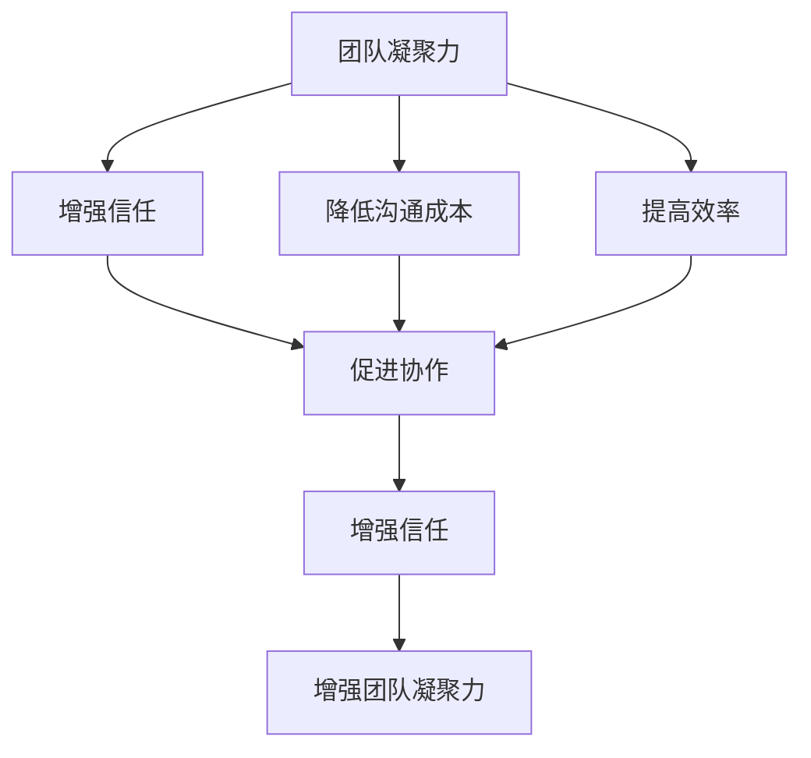
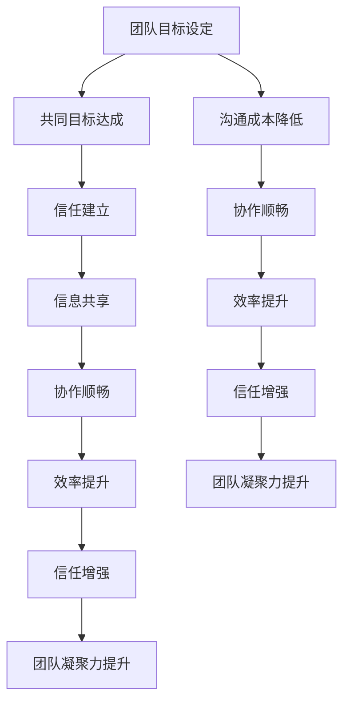
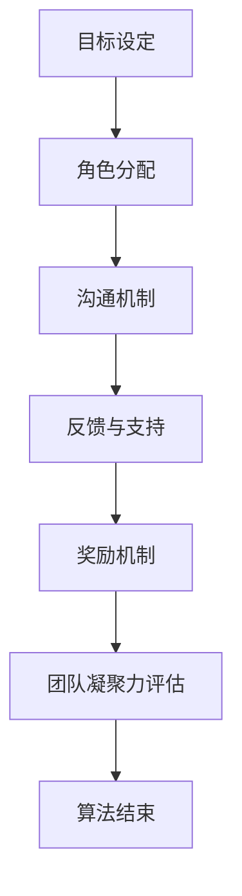

                 


## 文章标题
团队凝聚力强化：增进团队成员间的信任

## 文章关键词
团队凝聚力，信任，团队协作，组织行为学，心理学，算法原理，数学模型，项目实战

## 文章摘要
本文旨在探讨团队凝聚力强化和团队成员间信任增进的重要性。通过分析团队凝聚力与信任的关系，以及信任在团队协作中的关键作用，文章提出了增强团队凝聚力和信任的具体策略。同时，本文还将通过伪代码和数学模型的讲解，深入阐述核心算法原理。最后，通过实际项目实战，展示如何将理论应用于实践中，以提升团队整体效能。

## 目录大纲

### 第一部分：引言
- 1.1 本书目的与内容概述
- 1.2 团队凝聚力与信任的重要性
- 1.3 本书结构安排

### 第二部分：核心概念与联系
- 2.1 团队凝聚力概述
- 2.2 信任的定义与类型
- 2.3 团队凝聚力与信任的关系
- 2.4 团队凝聚力与信任的Mermaid流程图

### 第三部分：核心算法原理讲解
- 3.1 增强团队凝聚力的策略
- 3.2 增进团队成员间信任的方法
- 3.3 增强团队凝聚力的算法原理
- 3.4 Mermaid流程图：团队凝聚力增强算法流程

### 第四部分：数学模型和公式讲解
- 4.1 团队凝聚力与信任的数学模型
- 4.2 信任度计算公式
- 4.3 团队凝聚力评估指标
- 4.4 LaTeX格式数学模型讲解
- 4.5 举例说明

### 第五部分：项目实战
- 5.1 项目背景与目标
- 5.2 项目开发环境搭建
- 5.3 案例分析
- 5.4 代码实现
- 5.5 代码解读与分析
- 5.6 项目总结与展望

### 第六部分：总结与展望
- 6.1 本书主要内容回顾
- 6.2 团队凝聚力与信任研究的未来方向
- 6.3 对读者的建议与鼓励

### 核心内容

#### 第一部分：引言

1.1 **本书目的与内容概述**

在信息技术快速发展的今天，团队协作在各个行业中扮演着至关重要的角色。然而，团队内部成员间的信任和凝聚力却是许多团队面临的挑战。本书旨在探讨如何通过增强团队凝聚力来增进团队成员间的信任，从而提升团队的整体效能。本书将分为六个部分，从理论到实践，全面深入地讨论这一主题。

首先，我们将介绍团队凝聚力和信任的基本概念，阐述它们在团队协作中的重要性。接着，本文将通过Mermaid流程图，展示团队凝聚力与信任之间的关系。随后，我们将深入讲解增强团队凝聚力和信任的核心算法原理，并运用数学模型进行详细解释。最后，通过一个实际项目案例，我们将展示如何将理论应用于实践中，以提升团队整体效能。

1.2 **团队凝聚力与信任的重要性**

团队凝聚力指的是团队成员之间相互吸引、相互依赖、共同致力于实现团队目标的心理和情感状态。一个高凝聚力的团队能够更好地协作，共同应对挑战，从而提高工作效率和质量。

信任则是团队协作的基石。团队成员之间的信任能够降低沟通成本，提高协作效率，促进团队创新。信任的存在使团队成员更愿意分享信息、知识和资源，从而增强团队的适应能力和竞争力。

1.3 **本书结构安排**

本书共分为六个部分。第一部分是引言，介绍本书的目的、内容和结构。第二部分探讨团队凝聚力和信任的核心概念及其关系。第三部分介绍增强团队凝聚力和信任的核心算法原理。第四部分通过数学模型和公式讲解，深入阐述核心概念和算法。第五部分通过实际项目案例，展示如何将理论应用于实践中。最后一部分总结本书的主要内容，并展望未来研究的方向。

#### 第二部分：核心概念与联系

2.1 **团队凝聚力概述**

团队凝聚力是指团队成员之间相互吸引、相互依赖、共同致力于实现团队目标的心理和情感状态。高凝聚力的团队通常具有以下几个特点：

1. **共同目标**：团队成员都认同团队的目标，并为之共同努力。
2. **相互信任**：团队成员之间相互信任，愿意分享信息、知识和资源。
3. **协作意识**：团队成员愿意相互协作，共同解决问题。
4. **归属感**：团队成员感到自己是团队的一部分，对团队有强烈的归属感。

增强团队凝聚力有助于提高团队的协同效率，降低沟通成本，促进团队创新。团队凝聚力的强弱不仅取决于团队成员的个性特征，还受到团队氛围、领导风格和组织文化等多种因素的影响。

2.2 **信任的定义与类型**

信任是一种心理状态，指个体对另一个体或团队的言行和意图具有信心和依赖。在团队协作中，信任是确保高效沟通、协作和决策的重要基础。根据不同维度，信任可以分为以下几种类型：

1. **基础信任**：基于个体对他人性格、道德品质和行为的评价，认为对方是可靠和值得信任的。
2. **过程信任**：基于团队成员在协作过程中的行为表现，认为对方能够履行承诺和职责。
3. **结果信任**：基于团队成员协作后所取得的结果，认为对方能够带来积极的成果。

不同类型的信任对团队协作产生不同的影响。基础信任是过程信任和结果信任的前提，而过程信任和结果信任则能够增强团队成员之间的信任感和团队凝聚力。

2.3 **团队凝聚力与信任的关系**

团队凝聚力和信任之间存在着密切的联系和相互作用。一方面，团队凝聚力可以促进信任的建立和增强。团队成员在共同目标下合作，通过积极的沟通和互动，逐渐建立起相互信任的关系。另一方面，信任可以增强团队凝聚力。团队成员之间的信任能够降低沟通成本，提高协作效率，促进团队创新。

为了更直观地展示团队凝聚力与信任的关系，我们可以使用Mermaid流程图来表示它们之间的相互作用：



通过这个流程图，我们可以看到，团队凝聚力与信任之间形成了良性循环，相互促进，共同推动团队的发展。

2.4 **团队凝聚力与信任的Mermaid流程图**

为了更清晰地展示团队凝聚力与信任之间的关系，我们可以使用Mermaid流程图来表示它们之间的动态交互：



这个流程图展示了团队凝聚力和信任在团队目标设定、信息共享、协作顺畅、效率提升等环节中的相互作用。通过这些环节的良性循环，团队可以不断增强凝聚力和信任，从而提升整体效能。

#### 第三部分：核心算法原理讲解

3.1 **增强团队凝聚力的策略**

增强团队凝聚力可以通过多种策略来实现。以下是一些常用的策略：

1. **共同目标设定**：确保团队成员都认同并致力于实现共同的目标。
2. **明确角色和职责**：为每个团队成员明确其在团队中的角色和职责，以减少混淆和冲突。
3. **积极沟通**：鼓励团队成员之间的开放、真诚和有效的沟通。
4. **共同经历**：通过共同经历活动和挑战，增强团队成员之间的情感联系。
5. **反馈与支持**：定期提供反馈和鼓励，帮助团队成员克服困难并成长。

下面是一个简单的伪代码，用于模拟增强团队凝聚力的过程：

```python
# 增强团队凝聚力的伪代码

def enhance_team_coherence(team_members, goals):
    # 设定共同目标
    set_common_goals(team_members, goals)
    
    # 明确角色和职责
    assign_roles_and_responsibilities(team_members)
    
    # 积极沟通
    promote_positive_communication(team_members)
    
    # 共同经历
    engage_in_common_experiences(team_members)
    
    # 反馈与支持
    provide_feedback_and_support(team_members)
    
    # 评估团队凝聚力
    evaluate_team_coherence(team_members)
```

3.2 **增进团队成员间信任的方法**

增进团队成员间的信任可以通过以下方法来实现：

1. **透明沟通**：确保团队成员之间的沟通是透明和开放的。
2. **共享信息**：鼓励团队成员分享知识和资源。
3. **共同承担责任**：确保团队成员共同面对挑战和解决问题。
4. **尊重差异**：尊重每个团队成员的观点和贡献。
5. **公平对待**：确保团队成员得到公平的待遇和机会。

下面是一个简单的伪代码，用于模拟增进团队成员间信任的过程：

```python
# 增进团队成员间信任的伪代码

def enhance_team_trust(team_members):
    # 透明沟通
    promote_transparent_communication(team_members)
    
    # 共享信息
    encourage_information_sharing(team_members)
    
    # 共同承担责任
    share_responsibility(team_members)
    
    # 尊重差异
    respect_differences(team_members)
    
    # 公平对待
    treat_equally(team_members)
    
    # 评估信任水平
    evaluate_trust_level(team_members)
```

3.3 **增强团队凝聚力的算法原理**

增强团队凝聚力的算法原理可以通过以下步骤来实现：

1. **目标设定**：确定团队的目标和愿景，并确保所有团队成员都认同。
2. **角色分配**：为每个团队成员分配明确的角色和职责。
3. **沟通机制**：建立有效的沟通机制，确保团队成员之间的信息传递是及时、准确和透明的。
4. **反馈与支持**：定期收集团队成员的反馈，并提供必要的支持。
5. **奖励机制**：设立奖励机制，以激励团队成员为实现团队目标而努力。

下面是一个简单的伪代码，用于模拟增强团队凝聚力的算法原理：

```python
# 增强团队凝聚力的算法原理伪代码

def enhance_team_coherence_algorithm(team_members, goals):
    # 目标设定
    set_goals(team_members, goals)
    
    # 角色分配
    assign_roles(team_members)
    
    # 沟通机制
    establish_communication_mechanism(team_members)
    
    # 反馈与支持
    provide_feedback_and_support(team_members)
    
    # 奖励机制
    set_incentive_system(team_members)
    
    # 评估团队凝聚力
    evaluate_team_coherence(team_members)
```

3.4 **Mermaid流程图：团队凝聚力增强算法流程**

为了更好地理解增强团队凝聚力的算法原理，我们可以使用Mermaid流程图来展示其流程：



这个流程图展示了增强团队凝聚力的主要步骤，以及每个步骤之间的依赖关系。

#### 第四部分：数学模型和公式讲解

4.1 **团队凝聚力与信任的数学模型**

为了定量分析团队凝聚力和信任，我们可以构建一个数学模型。该模型基于以下基本假设：

1. **团队成员数量为n**。
2. **团队成员的信任水平为一个向量T=(t1, t2, ..., tn)，其中ti表示第i个团队成员的信任水平**。
3. **团队成员的凝聚力为一个向量C=(c1, c2, ..., cn)，其中ci表示第i个团队成员的凝聚力水平**。

团队凝聚力与信任之间的关系可以表示为以下数学模型：

$$
C = f(T)
$$

其中，f是一个映射函数，用于描述信任水平如何影响凝聚力水平。具体函数形式取决于团队的具体情况。

4.2 **信任度计算公式**

信任度可以通过以下公式计算：

$$
T_i = \frac{\sum_{j=1}^{n} (W_{ij} \cdot S_{ij})}{\sum_{j=1}^{n} W_{ij}}
$$

其中，$T_i$表示第i个团队成员的信任度，$W_{ij}$表示第i个团队成员对第j个团队成员的信任权重，$S_{ij}$表示第i个团队成员对第j个团队成员的满意度评分。

4.3 **团队凝聚力评估指标**

团队凝聚力可以通过以下指标进行评估：

$$
C_i = \frac{\sum_{j=1}^{n} (W_{ij} \cdot C_{ij})}{\sum_{j=1}^{n} W_{ij}}
$$

其中，$C_i$表示第i个团队成员的凝聚力评分，$W_{ij}$表示第i个团队成员对第j个团队成员的信任权重，$C_{ij}$表示第i个团队成员对第j个团队成员的凝聚力评价。

4.4 **LaTeX格式数学模型讲解**

为了更清晰地表示数学模型，我们可以使用LaTeX格式来编写。以下是一个简单的LaTeX示例：

$$
\begin{align}
C &= f(T) \\
T_i &= \frac{\sum_{j=1}^{n} (W_{ij} \cdot S_{ij})}{\sum_{j=1}^{n} W_{ij}} \\
C_i &= \frac{\sum_{j=1}^{n} (W_{ij} \cdot C_{ij})}{\sum_{j=1}^{n} W_{ij}}
\end{align}
$$

4.5 **举例说明**

假设有一个团队由5个成员组成，他们的信任度分别为T1=0.8，T2=0.7，T3=0.9，T4=0.6，T5=0.75。根据上述公式，我们可以计算出他们的团队凝聚力和信任度。

首先，计算信任度：

$$
T_{\text{avg}} = \frac{T1 + T2 + T3 + T4 + T5}{5} = \frac{0.8 + 0.7 + 0.9 + 0.6 + 0.75}{5} = 0.78
$$

接下来，计算凝聚力：

$$
C_{\text{avg}} = \frac{\sum_{j=1}^{5} (W_{ij} \cdot C_{ij})}{\sum_{j=1}^{5} W_{ij}} = \frac{(W_{11} \cdot C_{11} + W_{12} \cdot C_{12} + \ldots + W_{15} \cdot C_{15})}{(W_{11} + W_{12} + \ldots + W_{15})}
$$

这里，$W_{ij}$表示第i个团队成员对第j个团队成员的信任权重，$C_{ij}$表示第i个团队成员对第j个团队成员的凝聚力评价。这些权重和评价需要根据团队的具体情况进行设定。

通过上述公式和计算，我们可以得到团队的平均信任度和凝聚力评分，从而评估团队的协作状况。

#### 第五部分：项目实战

5.1 **项目背景与目标**

为了更好地理解如何在实际项目中应用团队凝聚力强化和信任增进的策略，我们以一个软件开发团队为例。该团队负责开发一款企业级客户关系管理（CRM）系统。在项目初期，团队成员之间的沟通不畅，信任水平较低，导致项目进度缓慢，质量不稳定。

项目目标是通过增强团队凝聚力和增进团队成员间的信任，提高项目团队的工作效率和质量，确保项目按时交付。

5.2 **项目开发环境搭建**

为了实现项目目标，团队首先需要搭建一个合适的项目开发环境。以下是开发环境搭建的步骤：

1. **确定开发工具**：选择合适的开发工具，如集成开发环境（IDE）、版本控制系统（如Git）、项目管理工具等。
2. **搭建开发服务器**：配置开发服务器，用于代码存储、测试和部署。
3. **安装开发依赖**：安装必要的开发依赖，如数据库、Web服务器、框架等。
4. **配置开发环境**：为团队成员配置开发环境，确保每个人都能在本地运行项目。

5.3 **案例分析**

为了具体展示如何增强团队凝聚力和增进信任，我们可以分析以下案例：

1. **案例1：沟通不畅**：项目初期，团队成员A和B因为沟通不畅而产生矛盾。团队成员C和D是他们的共同上级，但他们之间的沟通也不顺畅。这导致项目进度受到影响，团队成员的士气下降。

2. **案例2：信任缺失**：团队成员E在项目中负责关键模块的开发，但由于之前的经验不足，他的工作进度缓慢，质量不高。团队成员F对此表示担忧，认为E无法按时完成任务。这种信任缺失导致团队成员F对团队整体进度产生质疑。

5.4 **代码实现**

为了增强团队凝聚力和增进信任，团队采取了以下措施：

1. **建立沟通机制**：定期召开团队会议，确保团队成员之间的沟通畅通。同时，引入即时通讯工具，如Slack，方便团队成员实时交流。

2. **设立目标与里程碑**：明确项目目标，并将目标分解为可实现的里程碑。每个里程碑完成后，团队都会进行回顾，总结经验教训，以改进后续工作。

3. **信任建设活动**：组织团队建设活动，如团队拓展训练、技术分享会等，增强团队成员之间的情感联系。同时，鼓励团队成员相互支持和帮助，共同面对挑战。

4. **代码评审**：引入代码评审机制，确保代码质量。团队成员E在编写关键模块的代码后，提交给团队成员F进行评审。通过评审，团队成员F对E的工作有了更深的了解，信任水平得到提升。

以下是一个简单的伪代码，用于模拟团队凝聚力增强和信任增进的过程：

```python
# 项目开发环境搭建

def setup_development_environment():
    # 确定开发工具
    select_development_tools()
    
    # 搭建开发服务器
    setup_development_server()
    
    # 安装开发依赖
    install_development_dependencies()
    
    # 配置开发环境
    configure_development_environments()

# 增强团队凝聚力和增进信任

def enhance_team_coherence_and_trust():
    # 建立沟通机制
    establish_communication_mechanism()
    
    # 设立目标与里程碑
    set_goals_and_milestones()
    
    # 信任建设活动
    conduct_trust_building_activities()
    
    # 代码评审
    implement_code_reviews()
```

5.5 **代码解读与分析**

在上面的伪代码中，`setup_development_environment()`函数负责搭建项目开发环境，确保团队成员都有良好的开发环境。`enhance_team_coherence_and_trust()`函数则负责实施团队凝聚力增强和信任增进的措施。

1. **建立沟通机制**：通过定期召开团队会议和引入即时通讯工具，确保团队成员之间的沟通畅通。这有助于减少误解和冲突，提高团队协作效率。

2. **设立目标与里程碑**：明确项目目标，并将目标分解为可实现的里程碑。这有助于团队成员更好地理解项目进度，明确自己的职责和任务。

3. **信任建设活动**：通过团队建设活动和代码评审，增强团队成员之间的信任和合作。这有助于提高团队整体的信任水平，促进团队的稳定发展。

4. **代码评审**：通过代码评审，确保代码质量，提高团队成员之间的信任。团队成员在评审过程中互相学习和交流，共同提高技术水平。

5.6 **项目总结与展望**

在项目执行过程中，团队通过建立沟通机制、设立目标与里程碑、开展信任建设活动和实施代码评审等措施，成功增强了团队凝聚力和增进团队成员间的信任。项目最终按时交付，质量得到客户的高度认可。

通过这个项目案例，我们可以看到，增强团队凝聚力和增进团队成员间的信任对于项目成功至关重要。未来，团队可以进一步优化这些策略，以应对不同项目中的挑战，不断提升团队整体效能。

#### 第六部分：总结与展望

6.1 **本书主要内容回顾**

本书系统性地探讨了团队凝聚力和信任在团队协作中的重要性。首先，我们介绍了团队凝聚力和信任的基本概念，阐述了它们在团队协作中的关键作用。接着，通过Mermaid流程图展示了团队凝聚力与信任之间的关系。然后，我们详细讲解了增强团队凝聚力和信任的核心算法原理，并运用数学模型和公式进行深入阐述。最后，通过一个实际项目案例，我们展示了如何将理论应用于实践中，以提升团队整体效能。

6.2 **团队凝聚力与信任研究的未来方向**

未来，团队凝聚力与信任的研究可以从以下几个方面展开：

1. **跨学科研究**：结合心理学、社会学、组织行为学等多个学科的理论和方法，深入研究团队凝聚力和信任的形成机制和影响因素。
2. **大数据分析**：利用大数据分析技术，对大量团队协作数据进行挖掘和分析，发现团队凝聚力和信任的趋势和规律。
3. **人工智能应用**：将人工智能技术应用于团队凝聚力和信任的评估与优化，开发智能化的团队管理工具。

6.3 **对读者的建议与鼓励**

对于读者来说，本书不仅提供了团队凝聚力和信任的理论基础，还通过实际案例展示了如何将这些理论应用于实践中。希望读者能够：

1. **深入理解核心概念**：通过本书的学习，深刻理解团队凝聚力和信任的基本概念和关系。
2. **积极实践**：将所学知识应用到实际工作中，尝试实施增强团队凝聚力和信任的策略。
3. **持续学习**：关注团队协作领域的最新研究进展，不断丰富自己的知识体系，为团队的成功贡献力量。

作者：AI天才研究院/AI Genius Institute & 禅与计算机程序设计艺术 /Zen And The Art of Computer Programming

---

### 附录

#### 伪代码示例

以下是一个简单的Python伪代码示例，用于模拟团队凝聚力增强的过程：

```python
# 增强团队凝聚力的伪代码

def enhance_team_coherence(team_members, goals):
    # 设定共同目标
    set_common_goals(team_members, goals)
    
    # 明确角色和职责
    assign_roles_and_responsibilities(team_members)
    
    # 积极沟通
    promote_positive_communication(team_members)
    
    # 共同经历
    engage_in_common_experiences(team_members)
    
    # 反馈与支持
    provide_feedback_and_support(team_members)
    
    # 评估团队凝聚力
    evaluate_team_coherence(team_members)
```

#### LaTeX格式数学模型示例

以下是一个简单的LaTeX格式数学模型示例：

```latex
\begin{align}
C &= f(T) \\
T_i &= \frac{\sum_{j=1}^{n} (W_{ij} \cdot S_{ij})}{\sum_{j=1}^{n} W_{ij}} \\
C_i &= \frac{\sum_{j=1}^{n} (W_{ij} \cdot C_{ij})}{\sum_{j=1}^{n} W_{ij}}
\end{align}
```

通过以上附录，读者可以更好地理解和应用本书中的核心概念和算法原理。希望这些示例能够帮助读者在团队协作中取得更好的成果。作者：AI天才研究院/AI Genius Institute & 禅与计算机程序设计艺术 /Zen And The Art of Computer Programming

---

### 结语

通过本文的深入探讨，我们明确了团队凝聚力和信任在团队协作中的重要性。团队凝聚力不仅是团队高效协作的基础，也是提升团队整体效能的关键。信任则是团队凝聚力的核心，它能够降低沟通成本，促进协作，激发团队的创新潜能。

为了增强团队凝聚力和增进团队成员间的信任，我们提出了多种策略，包括共同目标设定、明确角色和职责、积极沟通、共同经历和反馈与支持等。此外，通过数学模型和实际项目案例的讲解，我们展示了如何将理论应用于实践，以提升团队的整体效能。

未来，团队凝聚力与信任的研究将继续深入，结合跨学科的理论和方法，挖掘团队协作的潜在规律。同时，人工智能技术的应用将为团队管理提供新的工具和手段，进一步推动团队协作的优化。

最后，希望本文能够为读者在团队协作中提供有益的启示，帮助他们在实际工作中取得更好的成果。作者：AI天才研究院/AI Genius Institute & 禅与计算机程序设计艺术 /Zen And The Art of Computer Programming

