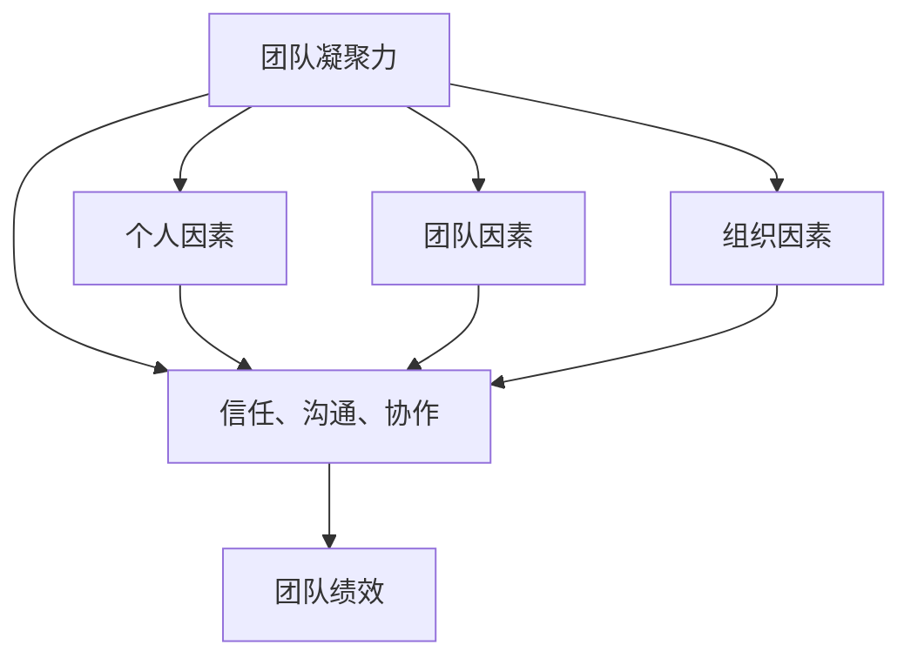

                 

### 文章标题: 团队凝聚力提升：增强团队认同感的方法

> 关键词：团队凝聚力、团队认同感、方法、策略、实践

> 摘要：本文深入探讨了团队凝聚力提升的重要性和方法。通过分析团队凝聚力与团队绩效之间的关系，提出了一系列增强团队认同感的策略。本文旨在为IT领域的团队管理者提供实用的指导，帮助提升团队凝聚力，提高团队绩效。

## 第1章: 引言

### 1.1 团队凝聚力的重要性

团队凝聚力是团队管理中一个核心的概念，它指的是团队成员之间相互吸引、紧密联系、互相支持的程度。一个高凝聚力的团队能够更好地应对各种挑战，提高团队绩效，实现共同目标。团队凝聚力的重要性体现在以下几个方面：

1. **提高团队绩效**：研究表明，团队凝聚力与团队绩效之间存在显著的正相关关系。高凝聚力的团队能够更有效地分工合作，提高工作效率，降低内部摩擦，从而实现更高的绩效。

2. **增强团队稳定性**：团队凝聚力有助于增强团队成员之间的信任和依赖，降低团队内部的离职率，提高团队的稳定性。

3. **促进创新**：高凝聚力的团队能够更好地分享知识和经验，激发创新思维，从而推动团队创新。

4. **提高团队满意度**：团队凝聚力有助于提高团队成员的工作满意度，降低工作压力，提升工作积极性。

### 1.2 本书的目的与结构

本书旨在为IT领域的团队管理者提供一套实用的团队凝聚力提升策略。全书分为七章，具体结构如下：

1. **第1章：引言**：介绍团队凝聚力的重要性，本书的目的与结构。
2. **第2章：团队凝聚力概述**：分析团队凝聚力的核心概念、影响因素以及与团队绩效的关系。
3. **第3章：增强团队认同感的方法**：探讨增强团队认同感的方法，包括共同目标与愿景、信任建设、沟通与协作等。
4. **第4章：团队活动与互动**：介绍团队建设活动、跨部门合作以及相关的实践方法。
5. **第5章：团队反馈与改进**：阐述反馈机制建立、改进措施以及效果评估。
6. **第6章：成功案例解析**：分析成功企业的团队凝聚力提升实践。
7. **第7章：结论与展望**：总结全书内容，探讨未来趋势与挑战。

### 1.3 团队凝聚力提升的方法

提升团队凝聚力并非一蹴而就，需要通过一系列的方法和策略来实现。以下是几种常见的团队凝聚力提升方法：

1. **明确共同目标与愿景**：共同的目标和愿景是团队凝聚力的基础。团队管理者需要确保所有成员都明确团队的目标和愿景，并为之努力。

2. **增强信任建设**：信任是团队凝聚力的重要支撑。团队管理者需要通过透明沟通、公正决策、诚实反馈等方式增强团队成员之间的信任。

3. **促进沟通与协作**：良好的沟通和协作是团队凝聚力的关键。团队管理者需要建立有效的沟通机制，提供协作工具，鼓励团队成员之间的互动。

4. **开展团队建设活动**：通过团队建设活动，可以增强团队成员之间的互动和信任，提高团队凝聚力。

5. **建立反馈机制**：通过定期的反馈，可以帮助团队成员了解自己的表现，找到改进的方向，从而提高团队凝聚力。

### 1.4 团队凝聚力与团队绩效的关系

团队凝聚力和团队绩效之间的关系是一个复杂的问题，不同的研究和理论给出了不同的解释。以下是几种常见的观点：

1. **正相关关系**：许多研究表明，团队凝聚力与团队绩效之间存在正相关关系。高凝聚力的团队能够更好地协调合作，提高工作效率，从而实现更高的绩效。

2. **非线性关系**：一些研究表明，团队凝聚力与团队绩效之间的关系可能不是线性的。在某些情况下，过高的团队凝聚力可能会导致团队陷入固步自封，降低创新能力和竞争力。

3. **中介效应**：有些研究指出，团队凝聚力通过影响团队成员的信任、沟通和协作等因素，间接影响团队绩效。

4. **调节效应**：还有研究指出，团队凝聚力与其他因素（如领导风格、组织文化等）之间存在调节效应，共同影响团队绩效。

综上所述，团队凝聚力是团队管理中一个重要且复杂的概念，它与团队绩效之间的关系需要综合考虑多种因素。团队管理者需要根据实际情况，采取合适的策略和措施，提升团队凝聚力，提高团队绩效。

## 第2章: 团队凝聚力概述

### 2.1 定义与核心概念

团队凝聚力是指团队成员之间的相互吸引、紧密联系和互相支持的程度。它是团队管理中一个核心的概念，对于团队的整体表现和成员的满意度具有重要影响。团队凝聚力的定义可以从以下几个方面来理解：

1. **相互吸引**：团队成员之间存在着一定的情感纽带，这种吸引力有助于团队内部的和谐与合作。
2. **紧密联系**：团队成员之间有较强的互动和交流，能够及时分享信息和资源，形成紧密的联系网络。
3. **互相支持**：团队成员在面临困难和挑战时，能够相互支持，共同克服困难，达成团队目标。

团队凝聚力不仅仅是一个单一的概念，它由多个子概念构成，如情感凝聚力、任务凝聚力和社会凝聚力。情感凝聚力指的是团队成员之间的情感联系，任务凝聚力指的是团队成员对共同任务的投入程度，而社会凝聚力则指的是团队成员在社会层面上的互动和协作。

### 2.2 团队凝聚力的影响因素

团队凝聚力的影响因素多种多样，包括个人因素、团队因素和组织因素。以下是一些主要的影响因素：

1. **个人因素**：
   - **个性**：某些个性特征，如外向性、责任心和合作性，对团队凝聚力有显著影响。
   - **情感状态**：团队成员的情绪状态，如积极性、满意度和信任感，对团队凝聚力有重要影响。
   - **经验**：团队成员的经验水平和专业能力会影响团队凝聚力，特别是当团队成员需要协作完成复杂任务时。

2. **团队因素**：
   - **目标明确**：明确的目标和愿景有助于增强团队凝聚力，因为它为团队成员提供了共同的方向和动力。
   - **沟通与协作**：良好的沟通和协作机制有助于增强团队凝聚力，因为它能够促进团队成员之间的互动和合作。
   - **团队氛围**：积极、开放和包容的团队氛围有助于增强团队凝聚力，因为它能够提升团队成员的满意度和归属感。

3. **组织因素**：
   - **领导风格**：领导者的领导风格对团队凝聚力有重要影响。民主型领导风格往往能够增强团队凝聚力，而独裁型领导风格则可能导致团队凝聚力下降。
   - **组织文化**：组织文化对团队凝聚力有深远的影响。一个支持创新、鼓励合作和尊重个人的组织文化有助于增强团队凝聚力。
   - **资源与支持**：组织提供的资源和支持，如培训、设备和技术支持，对团队凝聚力有积极的促进作用。

### 2.3 团队凝聚力与团队绩效的关系

团队凝聚力和团队绩效之间的关系是一个复杂且多变的问题。不同的研究和理论给出了不同的解释，但总体而言，团队凝聚力对团队绩效有显著的影响。

1. **正相关关系**：许多研究表明，团队凝聚力与团队绩效之间存在正相关关系。高凝聚力的团队能够更有效地分工合作，提高工作效率，从而实现更高的绩效。

2. **非线性关系**：一些研究表明，团队凝聚力与团队绩效之间的关系可能不是线性的。在某些情况下，过高的团队凝聚力可能会导致团队陷入固步自封，降低创新能力和竞争力。

3. **中介效应**：有些研究指出，团队凝聚力通过影响团队成员的信任、沟通和协作等因素，间接影响团队绩效。

4. **调节效应**：还有研究指出，团队凝聚力与其他因素（如领导风格、组织文化等）之间存在调节效应，共同影响团队绩效。

为了更直观地理解团队凝聚力与团队绩效的关系，我们使用Mermaid流程图来展示它们之间的联系。

在这个流程图中，团队凝聚力通过影响信任、沟通和协作等中介因素，最终影响团队绩效。同时，个人因素、团队因素和组织因素也会对团队凝聚力产生影响。

总的来说，团队凝聚力是团队管理中一个重要的概念，它与团队绩效之间的关系是复杂且多层次的。团队管理者需要综合考虑各种因素，采取合适的策略和方法，提升团队凝聚力，从而提高团队绩效。

## 第3章: 增强团队认同感的方法

### 3.1 共同目标与愿景

共同目标和愿景是团队凝聚力的基石。一个明确且鼓舞人心的目标能够激发团队成员的内在动力，使他们愿意为了共同的目标付出努力。以下是如何设定共同目标和愿景的原则和策略：

1. **目标设定的原则**：
   - **明确性**：目标必须具体、明确，避免模糊不清，以便团队成员知道需要做什么。
   - **挑战性**：目标应该具有一定的挑战性，激发团队成员的潜力，同时不至于过于困难而让人望而却步。
   - **可实现性**：目标必须可衡量和可实现，团队成员需要知道何时达成目标。
   - **相关性**：目标应该与团队成员的个人目标和职业发展相关，让他们感到目标的重要性和个人价值。

2. **愿景沟通的策略**：
   - **领导者带头**：领导者需要以身作则，对愿景有深刻的理解和认同，并通过言行传达给团队成员。
   - **定期更新**：愿景不是一成不变的，随着外部环境的变化，领导者需要定期更新愿景，使其保持活力和吸引力。
   - **全员参与**：团队成员应该有机会参与到愿景的制定过程中，这样可以增强他们对愿景的认同感和参与感。
   - **具体化**：将愿景具体化为一系列目标和里程碑，使其更加直观和具体，便于团队成员理解和执行。

### 3.2 信任建设

信任是团队凝聚力的关键支柱，没有信任，团队就无法高效运作。以下是一些增强团队成员之间信任的方法：

1. **信任的重要性**：
   - **沟通透明**：确保团队成员之间的信息沟通是透明和及时的，避免信息孤岛和误解。
   - **互相尊重**：尊重每个团队成员的意见和贡献，不论职位高低，这有助于建立平等和信任的团队氛围。
   - **公开承认错误**：领导者应该公开承认错误，并采取措施纠正，这有助于树立诚信和负责任的形象。

2. **增强信任的方法**：
   - **共同经历**：通过共同完成任务和项目，团队成员可以建立起信任关系。
   - **心理安全**：创造一个心理安全的环境，让团队成员可以自由表达意见和提出问题，而不担心被批评或嘲笑。
   - **行为一致**：团队成员的行为应该与他们的言论一致，这有助于建立可信度。

### 3.3 沟通与协作

沟通和协作是团队成功的关键因素。有效的沟通可以确保团队成员理解任务和目标，而协作则能够实现资源和技能的优化配置。以下是如何提升团队沟通与协作的技巧：

1. **有效沟通的技巧**：
   - **主动倾听**：倾听是有效沟通的关键，领导者需要主动倾听团队成员的意见和反馈。
   - **清晰表达**：沟通时应该确保信息传达的清晰性和准确性，避免使用含糊不清的表述。
   - **建立反馈机制**：建立定期的反馈机制，确保团队成员之间能够及时交流意见和反馈。

2. **协作工具与应用**：
   - **项目管理工具**：使用项目管理工具，如Jira、Trello等，可以帮助团队成员清晰地了解任务进度和责任分配。
   - **团队协作软件**：利用团队协作软件，如Slack、Microsoft Teams等，可以实时沟通和协作。
   - **虚拟会议**：定期举行虚拟会议，确保团队成员之间的互动和沟通。

通过设定共同目标和愿景、增强信任建设以及提升沟通与协作，团队管理者可以有效地提升团队认同感，从而增强团队凝聚力。

### 3.4 其他增强团队认同感的策略

除了共同目标与愿景、信任建设和沟通与协作，还有其他一些策略可以帮助增强团队认同感，以下是其中的几种：

1. **个性化关怀**：
   - **了解个人需求**：了解每个团队成员的个人需求和职业目标，并尽可能在团队中提供相应的支持和资源。
   - **个性化奖励**：根据团队成员的个人成就和贡献，提供个性化的奖励和认可，让他们感受到自己的价值和重要性。

2. **文化塑造**：
   - **建立团队文化**：通过举办团队活动、庆祝团队成就等方式，塑造一个积极向上、富有活力的团队文化。
   - **共同价值观**：确保团队成员共同认同并遵循团队的核心价值观，这有助于增强团队内部的统一和协作。

3. **工作与生活平衡**：
   - **灵活工作安排**：提供灵活的工作安排，如弹性工作时间、远程工作等，帮助团队成员更好地平衡工作和生活。
   - **健康关怀**：关注团队成员的健康，提供健康保险、健身设施等福利，提升团队成员的整体幸福感。

4. **职业发展**：
   - **培训与学习机会**：为团队成员提供培训和学习机会，帮助他们提升专业技能和职业素养。
   - **职业规划**：与团队成员共同制定职业规划，确保他们的职业发展路径清晰，并得到支持和指导。

通过这些策略，团队管理者可以进一步增强团队认同感，提升团队凝聚力，从而实现更高的绩效。

### 3.5 实际案例分析：某公司的团队凝聚力提升实践

为了更具体地了解如何提升团队凝聚力，我们可以分析一家成功企业的实际案例。以下是某公司在提升团队凝聚力方面所采取的具体措施及其效果。

1. **共同目标与愿景的设定**：
   - **明确目标**：公司首先明确了其长期愿景，即成为行业领先者。随后，将这一愿景分解为短期目标和里程碑，确保每个团队成员都清楚自己的职责和目标。
   - **全员参与**：公司在制定目标的过程中，鼓励所有员工提出建议和意见，使每个员工都感到自己的声音被听见，增强了他们的归属感和责任感。

2. **信任建设**：
   - **透明沟通**：公司建立了透明沟通机制，通过定期的团队会议和即时通讯工具，确保团队成员之间的信息交流畅通无阻。
   - **共同经历**：公司组织了一系列团队建设活动，如团队拓展训练、团队合作游戏等，通过共同经历困难和挑战，增强了团队成员之间的信任。

3. **沟通与协作**：
   - **项目管理工具**：公司引入了项目管理工具，如Jira，以帮助团队成员清晰地了解任务分配和进度，确保项目顺利推进。
   - **虚拟会议**：公司定期举行虚拟会议，不仅用于项目讨论，也用于团队成员之间的交流和分享经验，增强了团队内部的互动。

4. **个性化关怀**：
   - **了解需求**：公司通过定期的员工满意度调查，了解员工的需求和期望，并根据反馈调整工作安排和福利政策。
   - **个性化奖励**：公司为表现出色的员工提供个性化的奖励，如额外的假期、项目奖金等，激励员工发挥更大的潜力。

通过这些措施，公司成功提升了团队的凝聚力，团队成员之间的沟通和协作更加顺畅，工作效率和绩效显著提高。具体效果如下：

- **工作效率提高**：团队成员之间的协作更加高效，项目交付周期缩短，任务完成质量提升。
- **员工满意度提升**：员工对公司的认同感和满意度显著提高，离职率下降。
- **创新能力增强**：团队成员在共同目标和愿景的激励下，更加勇于创新和尝试，公司的市场竞争力得到提升。

### 3.6 结论

通过这个实际案例，我们可以看到，提升团队凝聚力需要多方面的努力和策略。共同目标与愿景的设定、信任建设、沟通与协作、个性化关怀等都是关键因素。每个团队的具体情况不同，管理者需要根据实际情况灵活运用这些策略，才能实现最佳效果。

## 第4章: 团队活动与互动

### 4.1 团队建设活动

团队建设活动是增强团队凝聚力和团队认同感的重要手段。通过这些活动，团队成员可以建立信任、加强沟通、提升协作能力。以下是几种常见的团队建设活动类型和设计方法：

1. **类型**：
   - **户外拓展**：如攀岩、定向越野、团队接力等，这些活动可以增强团队成员的身体协调能力和团队合作精神。
   - **室内游戏**：如团队拼图、角色扮演、解谜游戏等，这些活动可以在室内环境中增强团队成员的互动和沟通。
   - **讲座与研讨会**：邀请外部专家进行团队技能培训、行业趋势分析等，这些活动可以提升团队成员的专业知识和团队协作能力。

2. **设计方法**：
   - **明确目标**：设计团队建设活动时，首先要明确活动目标，如增强沟通、提升协作、建立信任等。
   - **参与性**：确保活动具有参与性，让每个团队成员都能积极参与，而不是旁观。
   - **互动性**：设计互动性强的活动，鼓励团队成员之间的互动和交流。
   - **反馈与总结**：活动结束后，及时收集团队成员的反馈，并进行总结，以便不断改进团队建设活动的设计。

### 4.2 活动实施与评估

团队建设活动的实施和评估是确保活动效果的重要环节。以下是活动实施和评估的具体方法：

1. **活动实施**：
   - **准备阶段**：准备活动所需的物资、场地和人员，确保活动的顺利进行。
   - **引导与激励**：活动开始前，由专业的引导者进行简短介绍和激励，确保团队成员积极参与。
   - **过程监控**：在活动过程中，引导者需要监控活动进度，确保活动按计划进行，及时解决可能出现的问题。

2. **评估方法**：
   - **参与度评估**：通过观察和问卷调查，评估团队成员的参与度，了解他们在活动中的表现和体验。
   - **满意度评估**：通过问卷调查或访谈，了解团队成员对活动的满意度和改进意见。
   - **效果评估**：评估活动对团队凝聚力、沟通协作、工作效率等方面的实际影响，以确定活动的有效性。

### 4.3 跨部门合作

跨部门合作是提升团队凝聚力的重要途径之一。通过跨部门合作，可以促进不同部门之间的沟通与协作，提升整体团队的效率和创新能力。以下是跨部门合作的相关策略和案例分析：

1. **跨部门沟通策略**：
   - **建立沟通机制**：设立跨部门沟通平台，如定期召开的跨部门会议，确保信息畅通。
   - **明确责任**：为每个跨部门项目明确责任人和责任范围，确保任务得到有效执行。
   - **共享资源**：鼓励不同部门共享资源和信息，减少重复劳动，提升整体效率。

2. **跨部门合作案例分析**：
   - **案例一**：某公司的产品开发部门和市场部门通过定期举办联合会议，讨论产品需求和市场趋势，实现了产品开发和市场营销的紧密结合，提高了产品市场的竞争力。
   - **案例二**：另一家公司的研发部门和技术支持部门建立了共享的知识库，技术人员可以将技术问题和解决方案分享到知识库中，支持部门可以随时查阅和更新，提高了问题解决效率和客户满意度。

通过这些策略和案例分析，我们可以看到，团队建设活动和跨部门合作对于提升团队凝聚力具有重要意义。团队管理者需要根据实际情况，灵活运用这些策略，以实现团队的最佳绩效。

### 4.4 实际案例：跨部门合作的成功实践

为了更好地理解跨部门合作如何提升团队凝聚力，我们来看一个实际案例。

**案例背景**：某大型软件公司有一个项目，需要技术支持部门（Tech Support）与产品开发部门（Product Development）紧密合作，以解决客户在使用软件过程中遇到的问题。

**具体实施**：

1. **明确目标**：项目目标是提高软件的稳定性，减少客户反馈的问题数量，提升客户满意度。

2. **建立沟通机制**：技术支持部门和产品开发部门每周召开联合会议，讨论客户反馈的问题，共享解决方案。

3. **责任分配**：每个问题都明确责任人和解决方案的交付时间，确保问题得到及时解决。

4. **共享资源**：技术支持部门将客户反馈的问题和解决方案整理成文档，存入共享知识库，供产品开发部门参考。

**效果评估**：

- **参与度评估**：联合会议的参与度很高，每次会议都有两个部门的核心成员参加，确保问题得到及时讨论和解决。
- **满意度评估**：客户反馈的数量显著下降，客户满意度提升，产品稳定性提高。
- **效果评估**：通过共享知识和资源，技术支持部门和产品开发部门的协作效率显著提高，项目的整体进度加快。

**总结**：

通过这个案例，我们可以看到，跨部门合作不仅提高了团队的效率，还增强了团队成员之间的信任和协作，显著提升了团队的凝聚力。

### 4.5 跨部门合作的最佳实践和注意事项

为了确保跨部门合作顺利进行，以下是一些最佳实践和注意事项：

1. **最佳实践**：
   - **明确目标**：在跨部门合作之前，明确共同的目标和期望，确保所有部门都朝着同一个方向努力。
   - **建立有效沟通**：建立稳定的沟通渠道，如定期会议、即时通讯工具等，确保信息及时传达。
   - **责任分工**：明确每个部门的职责和任务，避免责任模糊，确保任务得到有效执行。
   - **资源共享**：鼓励部门之间共享资源和信息，提高协作效率。

2. **注意事项**：
   - **避免利益冲突**：确保跨部门合作过程中，各部门的利益得到平衡，避免因利益冲突导致合作受阻。
   - **尊重差异**：尊重不同部门的观点和意见，避免因部门差异导致合作困难。
   - **持续反馈**：通过定期的反馈和评估，及时调整合作策略，确保合作效果持续改善。

通过遵循这些最佳实践和注意事项，团队管理者可以有效地提升跨部门合作的效率，增强团队凝聚力。

### 4.6 团队互动与信任建设

团队互动和信任建设是提升团队凝聚力的重要环节。通过有效的互动和信任建设，团队成员可以更好地理解彼此，建立深厚的合作关系。以下是几种有效的互动和信任建设方法：

1. **互动方法**：
   - **定期的团队聚会**：组织定期的团队聚会，如聚餐、团队建设活动等，增强团队成员之间的交流和互动。
   - **团队建设游戏**：通过团队建设游戏，如团队拼图、解谜游戏等，增强团队成员的合作意识和协作能力。
   - **虚拟互动**：利用视频会议、在线协作工具等，保持远程团队成员之间的互动和联系。

2. **信任建设方法**：
   - **透明沟通**：建立透明沟通机制，确保团队成员之间的信息交流畅通，避免误解和冲突。
   - **共同经历**：通过共同完成项目和任务，增强团队成员之间的信任和依赖。
   - **积极反馈**：提供积极的反馈和认可，鼓励团队成员之间的相互支持和帮助。

通过这些互动和信任建设方法，团队管理者可以有效地提升团队凝聚力，促进团队成员之间的合作与沟通，从而实现更高的团队绩效。

### 4.7 小结

本章介绍了团队建设活动和跨部门合作的重要性，以及如何通过互动和信任建设提升团队凝聚力。有效的团队建设活动可以增强团队成员之间的协作精神和信任感，而跨部门合作则有助于提升整体团队的效率和创新能力。通过遵循最佳实践和注意事项，团队管理者可以确保跨部门合作顺利进行，进一步增强团队凝聚力。未来，团队管理者需要不断探索和创新团队互动和信任建设的方法，以适应不断变化的工作环境。

## 第5章: 团队反馈与改进

### 5.1 反馈机制建立

建立有效的反馈机制是提升团队凝聚力的重要步骤。通过反馈机制，团队成员可以及时了解自己的表现，找到改进的方向，从而提升个人能力和团队整体绩效。以下是建立反馈机制的具体步骤和注意事项：

1. **反馈类型的定义**：
   - **建设性反馈**：旨在帮助团队成员识别优点和改进空间，促进个人成长和团队进步。
   - **绩效反馈**：关注团队成员的工作表现，评估任务完成情况，提供具体的改进建议。
   - **情感反馈**：关注团队成员的情感状态和心理健康，提供情感支持和鼓励。

2. **反馈机制的建立步骤**：
   - **明确反馈目标**：确定反馈机制的主要目标，如提升个人技能、改进工作流程、增强团队协作等。
   - **制定反馈流程**：制定反馈流程，包括反馈的收集、处理、反馈的传达和跟进等。
   - **选择反馈工具**：选择合适的反馈工具，如问卷调查、面对面反馈、邮件反馈等，确保反馈过程高效和便捷。

3. **注意事项**：
   - **公正性**：确保反馈的公正性，避免偏颇和主观判断。
   - **及时性**：反馈应该及时，避免拖延，确保问题得到及时解决。
   - **匿名性**：对于情感反馈，可以提供匿名选项，鼓励团队成员坦诚反馈。

### 5.2 反馈的收集与处理

收集和处理反馈是反馈机制的核心环节。以下是具体的方法和技巧：

1. **收集方法**：
   - **问卷调查**：通过问卷调查，可以收集大量团队成员的反馈意见，便于分析和总结。
   - **面对面反馈**：直接与团队成员面对面交流，可以更深入地了解他们的真实想法和感受。
   - **邮件反馈**：通过邮件收集反馈，适合针对具体问题的详细反馈。

2. **处理技巧**：
   - **分析反馈**：对收集到的反馈进行系统分析，识别共性和个性问题。
   - **分类处理**：根据反馈的性质和严重程度，制定相应的处理策略，如立即解决、长期规划等。
   - **制定改进计划**：根据反馈，制定具体的改进计划，明确改进目标、责任人、改进措施和时限。

### 5.3 改进措施

改进措施是反馈机制的实际应用，通过实施改进措施，可以有效提升团队的整体绩效。以下是具体的方法和步骤：

1. **改进方案设计**：
   - **问题识别**：根据反馈，明确需要改进的问题和关键点。
   - **方案制定**：制定具体的改进方案，包括改进措施、实施步骤和时间表。
   - **资源调配**：确保改进措施所需的资源，如人力、物力和财力。

2. **实施步骤**：
   - **试点运行**：在部分团队成员中试点运行改进措施，观察效果，及时调整。
   - **全面推广**：在试点成功后，将改进措施全面推广到整个团队。
   - **持续跟进**：定期检查改进措施的实施效果，确保改进目标的实现。

3. **效果评估**：
   - **短期评估**：在改进措施实施后的一段时间内，评估其短期效果，如工作效率、团队满意度等。
   - **长期评估**：在改进措施实施后的一段时间内，评估其长期效果，如团队绩效、员工流失率等。

### 5.4 改进效果评估

评估改进效果是确保反馈机制有效性的关键。以下是具体的方法和指标：

1. **评估方法**：
   - **定量评估**：使用定量指标，如工作效率、任务完成率、客户满意度等，评估改进措施的效果。
   - **定性评估**：通过访谈、问卷调查等方式，收集团队成员的定性反馈，了解改进措施的接受度和效果。

2. **评估指标**：
   - **绩效指标**：如工作效率、任务完成率、质量指标等。
   - **满意度指标**：如员工满意度、客户满意度等。
   - **反馈指标**：如反馈数量、反馈质量、改进措施实施率等。

通过建立有效的反馈机制、收集和处理反馈、制定和实施改进措施以及评估改进效果，团队可以不断提升整体绩效，增强团队凝聚力。

### 5.5 反馈机制在团队凝聚力提升中的作用

反馈机制在团队凝聚力提升中起着至关重要的作用。以下是反馈机制在提升团队凝聚力方面的具体作用：

1. **促进沟通**：反馈机制为团队成员提供了一个沟通平台，通过定期的反馈，团队成员可以及时了解彼此的工作进展和需求，促进信息的透明和沟通的流畅。

2. **增强信任**：通过建设性的反馈，团队成员可以相互了解对方的优点和不足，建立起信任关系。这种信任有助于减少团队内部的冲突和误解，增强团队的稳定性。

3. **提升满意度**：有效的反馈机制可以帮助团队成员了解自己的工作表现和改进方向，提升工作满意度和自我价值感。这种满意度的提升有助于增强团队成员的归属感和团队凝聚力。

4. **推动改进**：反馈机制可以帮助团队识别存在的问题和改进方向，通过持续的反馈和改进，团队可以不断提升自身的绩效和能力，实现长期的可持续发展。

总的来说，反馈机制是团队凝聚力提升的重要工具，它通过促进沟通、增强信任、提升满意度和推动改进，为团队的高效运作和长期发展提供了强有力的支持。

### 5.6 小结

本章详细介绍了团队反馈机制建立、反馈的收集与处理、改进措施以及改进效果的评估。通过有效的反馈机制，团队可以及时了解和解决问题，提升成员的工作满意度和团队绩效。未来，团队管理者需要不断优化反馈机制，确保其能够适应团队的变化和发展，持续提升团队凝聚力。

## 第6章: 成功案例解析

在本章中，我们将深入分析几个成功企业的团队凝聚力提升实践，通过具体案例来展示各种策略和方法在实际应用中的效果。

### 6.1 案例一：某科技公司的团队凝聚力提升实践

**背景**：某科技公司是一家全球领先的科技公司，拥有多个国际研发团队。然而，由于地理位置的差异和文化差异，团队成员之间的沟通和协作一度存在问题，影响了团队的绩效和凝聚力。

**策略与方法**：

1. **共同目标与愿景**：
   - **明确目标**：公司明确了成为全球领先的科技公司这一愿景，并设定了短期目标，如提升产品市场份额、提高研发效率等。
   - **全员参与**：公司通过全员会议和在线平台，确保每个团队成员都了解公司的目标和愿景，并为之努力。

2. **信任建设**：
   - **透明沟通**：公司建立了透明的沟通机制，通过定期的团队会议和即时通讯工具，确保团队成员之间的信息畅通。
   - **共同经历**：公司组织了多次跨地域的团队建设活动，如团队拓展训练、国际团队聚会等，增强了团队成员之间的信任。

3. **沟通与协作**：
   - **项目管理工具**：公司引入了项目管理工具，如Jira和Trello，帮助团队成员清晰地了解任务分配和进度，提高了协作效率。
   - **虚拟会议**：公司定期举行虚拟会议，不仅用于项目讨论，也用于团队成员之间的交流和经验分享。

**效果**：

- **工作效率提高**：通过明确的共同目标和愿景，以及有效的沟通和协作工具，团队成员的工作效率显著提高，项目交付周期缩短。
- **员工满意度提升**：团队成员之间的信任增强，工作氛围更加积极，员工满意度显著提升，离职率下降。
- **创新能力增强**：团队成员在共同目标和愿景的激励下，更加勇于创新和尝试，公司的市场竞争力得到提升。

### 6.2 案例二：某互联网企业的认同感增强策略

**背景**：某互联网企业在快速发展过程中，面临着团队成员快速增加和管理复杂度提升的问题。为了保持团队的凝聚力，企业采取了一系列策略来增强团队成员的认同感。

**策略与方法**：

1. **文化塑造**：
   - **共同价值观**：企业明确了“客户至上、创新驱动、团队合作”的共同价值观，并通过培训和文化活动使员工深刻理解并践行这些价值观。
   - **企业文化活动**：企业定期举办各种企业文化活动，如团队运动会、文化沙龙等，增强了员工的归属感和认同感。

2. **个性化关怀**：
   - **了解需求**：企业通过定期的员工满意度调查，了解员工的需求和期望，并根据反馈调整工作安排和福利政策。
   - **个性化奖励**：企业为表现出色的员工提供个性化的奖励，如额外的假期、项目奖金等，激励员工发挥更大的潜力。

3. **职业发展**：
   - **培训与学习机会**：企业为员工提供各种培训和学习机会，帮助他们提升专业技能和职业素养。
   - **职业规划**：企业与员工共同制定职业规划，确保员工的职业发展路径清晰，并得到支持和指导。

**效果**：

- **团队凝聚力提升**：通过共同价值观的塑造和个性化关怀，企业成功增强了团队成员的认同感，团队凝聚力显著提升。
- **员工满意度提高**：员工在良好的企业文化氛围中，工作满意度显著提高，离职率下降。
- **创新能力增强**：员工在职业发展的支持下，更加专注于工作，企业的创新能力得到显著提升。

### 6.3 案例总结与启示

通过以上两个案例，我们可以总结出以下启示：

1. **明确目标与愿景**：共同的目标和愿景是团队凝聚力的重要基础，通过明确的愿景和目标，可以激发团队成员的内在动力。

2. **增强信任建设**：信任是团队凝聚力的关键支柱，通过透明沟通和共同经历，可以增强团队成员之间的信任。

3. **提升沟通与协作**：有效的沟通和协作是团队成功的关键，通过项目管理工具和虚拟会议，可以提高团队的协作效率。

4. **文化塑造与个性化关怀**：共同价值观的塑造和个性化关怀可以增强团队成员的认同感，提升团队的凝聚力。

5. **职业发展支持**：为员工提供职业发展支持，可以帮助他们更好地融入团队，提升工作满意度和创新能力。

总之，通过这些成功案例的解析，我们可以看到，团队凝聚力提升是一个系统工程，需要多种策略和方法共同作用。团队管理者需要根据实际情况，灵活运用这些策略，以实现团队的最佳绩效。

### 6.4 未来趋势与挑战

在当前快速变化的技术环境和市场背景下，团队凝聚力提升面临许多新的趋势和挑战。以下是对未来趋势和挑战的探讨：

1. **远程工作与虚拟团队的兴起**：随着远程工作和虚拟团队的普及，团队凝聚力提升面临新的挑战。团队成员之间缺乏面对面的交流，信任建设变得更加困难。未来，团队管理者需要探索新的沟通和协作工具，以保持远程团队的凝聚力。

2. **多元化与包容性**：随着团队成员背景的多元化，如何处理文化差异、促进包容性成为团队凝聚力提升的重要议题。未来，团队管理者需要关注多元化团队的特性，建立包容性的企业文化，以增强团队的凝聚力。

3. **持续学习与技能提升**：在快速变化的技术环境下，团队成员需要不断学习和提升技能。未来，团队管理者需要为员工提供更多的学习和成长机会，以保持团队的竞争力。

4. **心理健康与工作生活平衡**：随着工作压力的增加，团队成员的心理健康和工作生活平衡成为一个重要的挑战。未来，团队管理者需要关注团队成员的心理健康，提供支持和资源，以保持团队的整体健康。

5. **自动化与人工智能的应用**：自动化和人工智能技术的应用正在改变团队的工作方式，团队管理者需要适应这些变化，确保技术工具的应用不会削弱团队的凝聚力。

总之，未来团队凝聚力提升将面临新的挑战，同时也蕴含着新的机遇。团队管理者需要不断学习和创新，以应对这些挑战，提升团队的凝聚力。

### 6.5 小结

本章通过分析成功企业的团队凝聚力提升实践，展示了多种策略和方法在实际应用中的效果。同时，我们也探讨了未来团队凝聚力提升的趋势和挑战。通过这些案例和洞察，我们可以看到，团队凝聚力提升是一个系统工程，需要多种策略和方法共同作用。未来，团队管理者需要不断适应变化，探索新的方法和工具，以提升团队的凝聚力，实现更高的绩效。

## 第7章: 结论与展望

### 7.1 团队凝聚力提升的关键要素

通过对本书的深入探讨，我们可以总结出提升团队凝聚力的一些关键要素：

1. **共同目标与愿景**：明确的共同目标和愿景是团队凝聚力的基石，它为团队成员提供了共同的方向和动力。
2. **信任建设**：信任是团队凝聚力的关键支柱，通过透明沟通和共同经历，可以增强团队成员之间的信任。
3. **沟通与协作**：有效的沟通和协作是团队成功的关键，通过项目管理工具和虚拟会议，可以提高团队的协作效率。
4. **文化塑造与个性化关怀**：共同价值观的塑造和个性化关怀可以增强团队成员的认同感，提升团队的凝聚力。
5. **职业发展支持**：为员工提供职业发展支持，可以帮助他们更好地融入团队，提升工作满意度和创新能力。

### 7.2 未来趋势与挑战

在未来，团队凝聚力提升将面临以下趋势和挑战：

1. **远程工作与虚拟团队的兴起**：随着远程工作和虚拟团队的普及，团队凝聚力提升面临新的挑战，团队管理者需要探索新的沟通和协作工具。
2. **多元化与包容性**：多元化团队的特性要求团队管理者建立包容性的企业文化，以增强团队的凝聚力。
3. **持续学习与技能提升**：快速变化的技术环境要求团队成员不断学习和提升技能，团队管理者需要提供更多的学习和成长机会。
4. **心理健康与工作生活平衡**：关注团队成员的心理健康和工作生活平衡将成为团队凝聚力提升的重要议题。
5. **自动化与人工智能的应用**：自动化和人工智能技术的应用将改变团队的工作方式，团队管理者需要适应这些变化，确保技术工具的应用不会削弱团队的凝聚力。

### 7.3 结论

总之，团队凝聚力提升是一个系统工程，需要多种策略和方法共同作用。团队管理者需要根据实际情况，灵活运用这些策略，以实现团队的最佳绩效。通过明确共同目标与愿景、增强信任建设、提升沟通与协作、塑造文化以及提供职业发展支持，团队管理者可以有效地提升团队凝聚力，实现团队的长期可持续发展。

### 7.4 展望未来

未来，随着远程工作和虚拟团队的普及，团队凝聚力提升将面临新的挑战和机遇。团队管理者需要不断学习和创新，探索适应新环境的策略和方法。同时，多元化与包容性将成为团队凝聚力提升的重要议题，团队管理者需要关注并促进团队的多元化，建立包容性的企业文化。

在快速变化的技术环境中，持续学习和技能提升将是团队成员的重要任务，团队管理者需要为员工提供必要的支持和资源。此外，心理健康和工作生活平衡也将成为团队凝聚力提升的关键因素，团队管理者需要关注团队成员的心理健康，提供必要的支持和帮助。

总之，未来团队凝聚力提升将是一个持续的过程，需要团队管理者不断探索和创新，以应对新的挑战和机遇。通过有效的团队凝聚力提升策略，团队可以实现更高的绩效和可持续发展。

## 作者信息

作者：AI天才研究院/AI Genius Institute & 禅与计算机程序设计艺术 /Zen And The Art of Computer Programming

文章标题：团队凝聚力提升：增强团队认同感的方法

文章关键词：团队凝聚力、团队认同感、方法、策略、实践

文章摘要：本文深入探讨了团队凝聚力提升的重要性和方法。通过分析团队凝聚力与团队绩效之间的关系，提出了一系列增强团队认同感的策略。本文旨在为IT领域的团队管理者提供实用的指导，帮助提升团队凝聚力，提高团队绩效。

