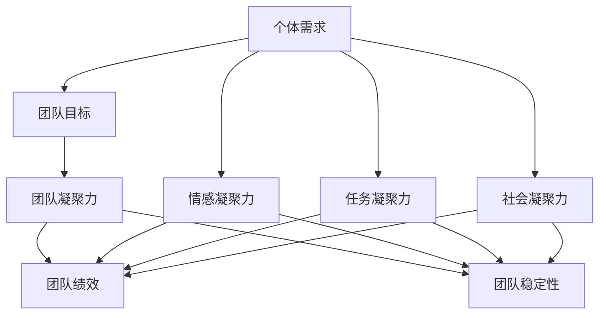

                 

### 文章标题

《团队凝聚力：从分散到团结的转变》

### 关键词

团队凝聚力，分散到团结的转变，团队建设，沟通，领导力，跨文化团队

### 摘要

本文深入探讨了团队凝聚力的概念、形成机制及其在组织管理中的重要性。通过分析个体需求与团队目标的关系，以及团队建设、沟通、领导力等关键因素，本文提出了提升团队凝聚力的策略和方法。此外，本文还针对跨文化团队的特殊性，提供了有效的凝聚力和沟通提升策略。通过实际案例研究和详细解读，本文为提升团队凝聚力提供了全面的指导。

---

### 引言

在快速变化的现代企业环境中，团队凝聚力成为组织成功的关键因素之一。一个具有高度凝聚力的团队能够更好地应对外部挑战，提高工作效率，促进创新，从而实现组织目标。然而，团队凝聚力的形成并非一蹴而就，它需要组织管理者深入理解团队的本质，通过有效的策略和行动，将分散的个体凝聚成一个团结的整体。

本文旨在探讨团队凝聚力的概念及其在组织管理中的应用。首先，我们将介绍团队凝聚力的核心概念，包括其定义、维度和重要性。接着，我们将分析个体与团队之间的关系，以及团队建设、沟通和领导力在提升团队凝聚力中的作用。随后，本文将探讨跨文化团队的特殊挑战，并提供相应的凝聚力提升策略。最后，通过实际案例研究和详细解读，本文将总结最佳实践，为组织管理者提供有效的团队凝聚力提升指南。

---

### 第一章：团队凝聚力的概念与理论基础

#### 1.1 团队凝聚力的定义

团队凝聚力是指团队成员之间相互吸引、相互信任、相互依赖的程度，以及他们共同为团队目标和任务努力的程度。它不仅仅是一个简单的集体行为，更是团队内部各个成员之间在情感、态度和行为上的统一。团队凝聚力可以分为情感凝聚力、任务凝聚力和社会凝聚力三个维度。

- **情感凝聚力**：指团队成员之间情感的紧密程度，如友谊、信任和归属感。
- **任务凝聚力**：指团队成员在完成共同任务时协作的紧密程度，如共同目标、任务分工和效率。
- **社会凝聚力**：指团队成员在社会层面的互动和联系，如团队文化、共同价值观和社交活动。

#### 1.2 团队凝聚力的核心概念与联系

为了更好地理解团队凝聚力的概念，我们可以通过Mermaid流程图来展示其核心概念之间的联系：



在这个流程图中，我们可以看到个体需求与团队目标之间存在着紧密的联系，这些联系通过情感凝聚力、任务凝聚力和社会凝聚力这三个维度转化为团队凝聚力的形成。团队凝聚力不仅影响团队绩效和稳定性，还与个体需求密切相关。

#### 1.3 团队凝聚力的重要性

团队凝聚力的重要性不容忽视。它不仅是团队高效运作的基础，也是组织成功的关键因素之一。以下是团队凝聚力的重要性：

- **提高团队绩效**：高凝聚力的团队能够更有效地完成共同任务，提高工作效率，实现组织目标。
- **增强团队稳定性**：凝聚力强的团队能够减少人员流失，提高团队成员的忠诚度。
- **促进创新**：团队成员之间的紧密合作和相互信任能够激发创新思维，推动组织创新。
- **提升员工满意度**：高凝聚力的团队氛围能够提高员工的满意度和幸福感，降低工作压力。

#### 1.4 团队凝聚力与团队绩效的关系

团队凝聚力和团队绩效之间存在着密切的关系。通过以下伪代码，我们可以理解团队凝聚力如何影响团队绩效：

```python
def calculate_team_performance(team凝聚力):
    if team凝聚力 < 3:
        return "团队绩效低"
    elif team凝聚力 >= 3 and team凝聚力 < 5:
        return "团队绩效中等"
    else:
        return "团队绩效高"
```

在这个简单的伪代码中，团队凝聚力通过一个评分系统来衡量，评分越高，团队绩效越好。这表明团队凝聚力是影响团队绩效的关键因素之一。

#### 1.5 团队凝聚力与团队稳定性的关系

团队凝聚力也与团队稳定性密切相关。以下是一个数学模型，用于分析团队凝聚力对团队稳定性的影响：

$$
S = \frac{C^2 + P^2 + S^2}{3}
$$

其中，$S$ 表示团队稳定性，$C$ 表示情感凝聚力，$P$ 表示任务凝聚力，$S$ 表示社会凝聚力。这个公式表明，团队凝聚力三个维度的平方和与团队稳定性之间存在正相关关系。即团队凝聚力越高，团队稳定性越强。

#### 1.6 团队凝聚力与员工满意度的关系

团队凝聚力还对员工的满意度有着重要影响。以下是一个简单的数学模型，用于分析团队凝聚力与员工满意度之间的关系：

$$
S = 0.5C + 0.3P + 0.2S
$$

其中，$S$ 表示员工满意度，$C$ 表示情感凝聚力，$P$ 表示任务凝聚力，$S$ 表示社会凝聚力。这个公式表明，团队凝聚力三个维度对员工满意度都有正向影响，且情感凝聚力和社会凝聚力的影响更大。

#### 1.7 团队凝聚力提升策略

为了提升团队凝聚力，组织管理者可以采取以下策略：

- **团队建设活动**：通过定期的团队建设活动，增强团队成员之间的情感联系和互动。
- **有效沟通**：建立开放的沟通渠道，促进团队成员之间的信息共享和协同合作。
- **领导力培训**：提升领导者的领导力和沟通技巧，促进团队凝聚力的提升。
- **激励与奖励**：通过激励和奖励机制，鼓励团队成员积极参与团队活动，提高团队凝聚力。

#### 1.8 本章小结

本章介绍了团队凝聚力的定义、核心概念及其重要性。通过Mermaid流程图、伪代码、数学模型和公式，我们深入分析了团队凝聚力与团队绩效、团队稳定性、员工满意度之间的关系。同时，本章提出了提升团队凝聚力的策略和方法，为后续章节的讨论奠定了基础。

---

### 第二章：个体与团队关系分析

#### 2.1 个体需求与团队目标

在团队中，个体的需求和团队的目标是相互关联的。个体的需求通常包括自我实现、认可、安全等，而团队的目标则是实现共同的任务和目标。如何平衡个体需求与团队目标，是实现团队凝聚力的关键。

#### 2.1.1 个体需求与团队目标的关联

个体需求与团队目标的关联可以通过以下伪代码来表示：

```python
def align_individual需求的团队目标(individual需求, 团队目标):
    if individual需求 == 团队目标:
        return "需求一致"
    elif individual需求 is subset of 团队目标:
        return "部分一致，需调整"
    else:
        return "需求冲突，需协调"
```

在这个伪代码中，`align_individual需求的团队目标`函数用于判断个体需求与团队目标的一致性。如果个体需求完全符合团队目标，则返回“需求一致”；如果个体需求是团队目标的一部分，则返回“部分一致，需调整”；如果个体需求与团队目标存在冲突，则返回“需求冲突，需协调”。

#### 2.1.2 个体需求对团队凝聚力的影响

个体的需求对团队凝聚力有着重要的影响。以下是一个数学模型，用于分析个体需求对团队凝聚力的影响：

$$
C = \frac{1}{n}\sum_{i=1}^{n} (d_i + s_i + t_i)
$$

其中，$C$ 表示团队凝聚力，$n$ 表示团队成员数量，$d_i$ 表示个体需求满足度，$s_i$ 表示个体社交满意度，$t_i$ 表示个体任务成就感。这个公式表明，团队凝聚力是所有成员需求满足度、社交满意度和任务成就感的平均值。

#### 2.1.3 团队目标对团队凝聚力的影响

团队目标对团队凝聚力也有着重要的影响。以下是一个简单的数学模型，用于分析团队目标对团队凝聚力的影响：

$$
C = \frac{G^2 + P^2 + S^2}{3}
$$

其中，$C$ 表示团队凝聚力，$G$ 表示团队目标一致性，$P$ 表示团队目标明确性，$S$ 表示团队目标可达性。这个公式表明，团队凝聚力是团队目标一致性、明确性和可达性的平均值。

#### 2.1.4 个体需求与团队目标的平衡策略

为了平衡个体需求与团队目标，组织管理者可以采取以下策略：

- **明确团队目标**：确保团队目标明确、具体且可实现，从而减少个体需求与团队目标的冲突。
- **个体需求满足**：关注个体需求，提供适当的资源和机会，满足个体在自我实现、认可和安全等方面的需求。
- **沟通与协商**：建立有效的沟通渠道，鼓励团队成员表达自己的需求和意见，通过协商找到平衡点。
- **激励与奖励**：通过激励和奖励机制，鼓励团队成员为实现团队目标而努力。

#### 2.2 个体行为对团队凝聚力的影响

个体行为对团队凝聚力有着直接的影响。以下是一个简单的数学模型，用于分析个体行为对团队凝聚力的影响：

$$
C = \frac{B^2 + T^2 + S^2}{3}
$$

其中，$C$ 表示团队凝聚力，$B$ 表示个体行为积极度，$T$ 表示个体任务完成度，$S$ 表示个体社交行为度。这个公式表明，团队凝聚力是所有成员行为积极度、任务完成度和社交行为度的平均值。

#### 2.2.1 个体行为积极度对团队凝聚力的影响

个体行为积极度对团队凝聚力有着重要的影响。以下是一个简单的数学模型，用于分析个体行为积极度对团队凝聚力的影响：

$$
C = k \cdot B
$$

其中，$C$ 表示团队凝聚力，$B$ 表示个体行为积极度，$k$ 是常数。这个公式表明，团队凝聚力与个体行为积极度成正比。

#### 2.2.2 个体任务完成度对团队凝聚力的影响

个体任务完成度对团队凝聚力也有重要的影响。以下是一个简单的数学模型，用于分析个体任务完成度对团队凝聚力的影响：

$$
C = k \cdot T
$$

其中，$C$ 表示团队凝聚力，$T$ 表示个体任务完成度，$k$ 是常数。这个公式表明，团队凝聚力与个体任务完成度成正比。

#### 2.2.3 个体社交行为度对团队凝聚力的影响

个体社交行为度对团队凝聚力也有重要的影响。以下是一个简单的数学模型，用于分析个体社交行为度对团队凝聚力的影响：

$$
C = k \cdot S
$$

其中，$C$ 表示团队凝聚力，$S$ 表示个体社交行为度，$k$ 是常数。这个公式表明，团队凝聚力与个体社交行为度成正比。

#### 2.3 个体角色与团队互动

个体在团队中的角色对其行为和团队凝聚力有着重要影响。以下是一个简单的数学模型，用于分析个体角色与团队互动的关系：

$$
C = \frac{R^2 + I^2 + G^2}{3}
$$

其中，$C$ 表示团队凝聚力，$R$ 表示个体角色明确度，$I$ 表示个体互动频率，$G$ 表示个体团队贡献度。这个公式表明，团队凝聚力是所有成员角色明确度、互动频率和团队贡献度的平均值。

#### 2.3.1 个体角色明确度对团队凝聚力的影响

个体角色明确度对团队凝聚力有着重要的影响。以下是一个简单的数学模型，用于分析个体角色明确度对团队凝聚力的影响：

$$
C = k \cdot R
$$

其中，$C$ 表示团队凝聚力，$R$ 表示个体角色明确度，$k$ 是常数。这个公式表明，团队凝聚力与个体角色明确度成正比。

#### 2.3.2 个体互动频率对团队凝聚力的影响

个体互动频率对团队凝聚力也有重要的影响。以下是一个简单的数学模型，用于分析个体互动频率对团队凝聚力的影响：

$$
C = k \cdot I
$$

其中，$C$ 表示团队凝聚力，$I$ 表示个体互动频率，$k$ 是常数。这个公式表明，团队凝聚力与个体互动频率成正比。

#### 2.3.3 个体团队贡献度对团队凝聚力的影响

个体团队贡献度对团队凝聚力也有重要的影响。以下是一个简单的数学模型，用于分析个体团队贡献度对团队凝聚力的影响：

$$
C = k \cdot G
$$

其中，$C$ 表示团队凝聚力，$G$ 表示个体团队贡献度，$k$ 是常数。这个公式表明，团队凝聚力与个体团队贡献度成正比。

#### 2.4 本章小结

本章分析了个体需求与团队目标的关系，个体行为对团队凝聚力的影响，以及个体角色与团队互动的关系。通过伪代码、数学模型和公式，我们深入理解了个体与团队之间的相互作用。本章为后续章节的团队建设、沟通和领导力等策略提供了理论基础。

---

### 第三章：团队建设策略

#### 3.1 团队建设的目标与原则

团队建设的目标是增强团队成员之间的相互信任、协作和共同目标感，从而提高团队的整体绩效和稳定性。为了实现这一目标，团队建设需要遵循以下原则：

- **共同目标**：明确团队的目标和愿景，确保所有成员都清楚团队的努力方向。
- **相互信任**：通过建立开放的沟通渠道和共同经历，增强团队成员之间的信任感。
- **平等参与**：鼓励所有成员参与团队决策和活动，确保每个人的意见和贡献都能得到重视。
- **持续发展**：团队建设是一个持续的过程，需要不断地评估和调整，以适应团队和环境的变化。

#### 3.2 团队活动的设计与实施

团队活动是增强团队凝聚力的重要手段。以下是几种常见的团队活动及其设计思路：

- **团队建设工作坊**：通过一系列互动和讨论，帮助团队成员了解彼此、建立信任。活动包括角色扮演、团队拼图和案例分析等。
- **团队拓展训练**：通过户外活动和挑战，增强团队成员之间的合作精神和团队意识。活动包括攀岩、绳索挑战和定向越野等。
- **团队会议**：定期召开团队会议，讨论团队目标和进展，解决团队成员之间的分歧。会议形式可以包括头脑风暴、问题解决和回顾总结等。

#### 3.3 团队心理辅导与支持

团队心理辅导是帮助团队成员处理情感压力、提高心理健康的重要措施。以下是几种常见的团队心理辅导方法：

- **情感支持**：通过倾听、理解和反馈，为团队成员提供情感支持，帮助他们应对工作中的挑战。
- **压力管理**：通过压力评估和压力管理策略，帮助团队成员识别和管理压力源，提高心理韧性。
- **心理健康培训**：通过心理健康讲座和培训，提高团队成员的心理健康意识和应对能力。

#### 3.4 团队建设效果评估

团队建设的效果需要通过评估来验证。以下是几种常见的团队建设效果评估方法：

- **问卷调查**：通过问卷调查，收集团队成员对团队建设的看法和建议，评估团队建设的有效性。
- **绩效评估**：通过团队绩效评估，比较团队建设前后的绩效变化，评估团队建设对团队绩效的影响。
- **员工满意度调查**：通过员工满意度调查，了解团队成员对团队建设活动的满意度和参与度。

#### 3.5 团队建设案例研究

为了更好地理解团队建设策略的实际应用，以下是几个团队建设案例研究：

- **案例1：某科技公司通过团队拓展训练，提高了团队成员的团队合作能力和团队意识。**
- **案例2：某跨国公司通过团队建设工作坊，解决了团队成员之间的沟通障碍，提高了团队的协作效率。**
- **案例3：某医疗机构通过团队心理辅导，帮助团队成员应对工作压力，提高了团队的整体心理素质。**

#### 3.6 本章小结

本章介绍了团队建设的目标与原则，团队活动的设计与实施，团队心理辅导与支持，以及团队建设效果评估的方法。通过实际案例研究，我们展示了团队建设策略在提高团队凝聚力、促进团队合作和提升团队绩效方面的作用。

---

### 第四章：沟通与冲突管理

#### 4.1 团队沟通的障碍与改善

团队沟通是团队凝聚力的基础。有效的沟通能促进团队成员之间的理解和协作，而沟通障碍则可能导致误解、冲突和低效率。以下是几种常见的团队沟通障碍及其改善策略：

- **语言障碍**：团队成员来自不同文化背景，可能存在语言差异，影响沟通效果。**改善策略**：提供跨文化沟通培训，鼓励团队成员学习对方语言，采用简洁明了的语言进行沟通。
- **信息过载**：团队成员可能面临大量信息，难以筛选和处理，导致沟通效率降低。**改善策略**：建立有效的信息过滤和分类机制，确保关键信息得到及时传递和反馈。
- **心理障碍**：团队成员可能存在心理障碍，如恐惧、焦虑和抵触情绪，影响沟通效果。**改善策略**：提供心理辅导和支持，帮助团队成员建立积极的心态，提高沟通的主动性和开放性。

#### 4.2 沟通模型在团队中的应用

为了提高团队沟通效果，管理者可以采用以下沟通模型：

- **沟通层次模型**：该模型将沟通分为七个层次，从表面的信息传递到深层次的情感和价值观交流。**应用**：管理者应根据团队的具体情况，选择适当的沟通层次，提高沟通的深度和效果。
- **沟通网络模型**：该模型描述了团队成员之间的沟通方式和沟通频率。**应用**：通过分析团队沟通网络，管理者可以发现沟通中的薄弱环节，采取针对性的改进措施。

#### 4.3 冲突类型与处理策略

团队冲突是不可避免的，但合理的冲突管理能促进团队的创新和进步。以下是几种常见的冲突类型及其处理策略：

- **任务冲突**：由于工作任务或目标的不同而产生的冲突。**处理策略**：通过明确任务目标和职责分工，降低任务冲突的发生概率。
- **关系冲突**：由于个人关系或情感问题而产生的冲突。**处理策略**：通过建立积极的团队关系和情感支持系统，减少关系冲突的影响。
- **价值观冲突**：由于个人价值观或信仰的差异而产生的冲突。**处理策略**：尊重不同价值观，通过沟通和协商找到共同点，实现团队目标的统一。

#### 4.4 冲突管理实践

以下是几个冲突管理的实际案例：

- **案例1：某团队在项目进展中出现任务冲突，导致项目进度滞后。** **解决方法**：通过重新分配任务和明确职责分工，解决了冲突，提高了项目效率。
- **案例2：某团队在团队成员之间出现关系冲突，导致团队氛围紧张。** **解决方法**：通过团队心理辅导和情感支持，改善了团队成员之间的关系，恢复了团队的和谐。
- **案例3：某团队在项目决策中出现价值观冲突，导致团队决策困难。** **解决方法**：通过沟通和协商，找到了共同的价值观念，实现了团队的统一决策。

#### 4.5 本章小结

本章分析了团队沟通的障碍与改善策略，介绍了沟通模型在团队中的应用，探讨了冲突类型与处理策略，并通过实际案例展示了沟通与冲突管理的实践。有效的沟通与冲突管理是提升团队凝聚力和团队绩效的关键，管理者应重视并积极应用这些策略。

---

### 第五章：激励与奖励机制

#### 5.1 团队激励的理论基础

团队激励是指通过激励措施激发团队成员的积极性和创造力，以提高团队绩效和满足个体需求。激励理论为团队激励提供了理论基础，以下是几种常见的激励理论：

- **马斯洛需求层次理论**：该理论认为人的需求可以分为生理需求、安全需求、社交需求、尊重需求和自我实现需求。激励应根据不同层次的需求进行。
- **赫茨伯格双因素理论**：该理论将激励因素分为内在激励和外在激励。内在激励如成就感、认可和成长，外在激励如薪酬、福利和工作环境。
- **目标设置理论**：该理论认为明确、具体、有挑战性的目标能有效激发团队成员的积极性。目标设置应考虑团队成员的能力和兴趣。

#### 5.2 奖励机制的设定与优化

奖励机制是团队激励的重要手段。以下是一个简单的奖励机制设计流程：

1. **确定奖励目标**：明确奖励的目标和标准，如绩效、创新、团队合作等。
2. **设定奖励形式**：选择合适的奖励形式，如薪酬、晋升、荣誉称号、额外休假等。
3. **制定奖励规则**：制定明确的奖励规则，确保奖励的公平性和透明度。
4. **反馈与调整**：定期评估奖励机制的效果，根据团队和个体表现进行反馈和调整。

#### 5.3 奖励效果评估与反馈

奖励效果评估是确保奖励机制有效性的关键。以下是一个简单的奖励效果评估流程：

1. **收集数据**：收集团队成员对奖励的反馈和数据，如满意度调查、绩效评估等。
2. **分析数据**：分析数据，评估奖励机制对团队绩效、员工满意度和个体行为的影响。
3. **反馈与沟通**：将评估结果反馈给团队成员，沟通奖励机制的有效性和改进方向。
4. **调整奖励机制**：根据评估结果，调整奖励机制，优化奖励方案。

#### 5.4 激励效果分析

以下是一个简单的激励效果分析模型：

$$
激励效果 = 满意度 \times 参与度 \times 影响力
$$

其中，满意度表示团队成员对奖励的满意度，参与度表示团队成员参与奖励活动的积极性，影响力表示奖励对团队成员行为和绩效的影响。通过这个模型，可以评估奖励机制的整体效果。

#### 5.5 激励与奖励的最佳实践

以下是几个激励与奖励的最佳实践案例：

- **案例1：某公司通过灵活的薪酬制度，激励员工提高绩效。** **实践方法**：提供基于绩效的浮动薪酬，鼓励员工追求卓越。
- **案例2：某团队通过创新奖励，激发团队成员的创新思维。** **实践方法**：设立创新奖，奖励提出有效创新方案的团队成员。
- **案例3：某公司通过荣誉表彰，提升员工的荣誉感和归属感。** **实践方法**：定期举办表彰大会，公开表彰优秀员工。

#### 5.6 本章小结

本章介绍了团队激励的理论基础，奖励机制的设定与优化，奖励效果评估与反馈，并通过实际案例展示了激励与奖励的最佳实践。有效的激励与奖励机制是提升团队凝聚力和绩效的关键，管理者应重视并灵活应用这些策略。

---

### 第六章：领导力与团队凝聚力

#### 6.1 领导力对团队凝聚力的影响

领导力在团队凝聚力中起着关键作用。一个优秀的领导者不仅能够明确团队目标，还能激发团队成员的潜力，促进团队凝聚力的提升。以下是领导力对团队凝聚力的影响：

- **目标设定**：领导者通过设定明确、可实现的团队目标，帮助团队成员了解共同的努力方向，提高团队凝聚力。
- **激励与支持**：领导者通过激励和提供支持，激发团队成员的积极性和参与度，增强团队凝聚力。
- **沟通与反馈**：领导者通过有效的沟通和及时的反馈，建立良好的团队氛围，增强团队成员之间的信任和合作，提升团队凝聚力。

#### 6.2 不同领导风格对团队凝聚力的作用

领导风格对团队凝聚力有着重要的影响。以下是几种常见的领导风格及其对团队凝聚力的影响：

- **民主型领导风格**：民主型领导者鼓励团队成员参与决策，尊重团队成员的意见，提高团队成员的参与度和归属感，从而增强团队凝聚力。
- **权威型领导风格**：权威型领导者通过明确的指令和严格的控制，确保团队目标的实现，但可能导致团队成员的被动参与和不满，影响团队凝聚力。
- **变革型领导风格**：变革型领导者通过激发团队成员的创造力和创新精神，推动团队变革和发展，增强团队凝聚力。
- **参与型领导风格**：参与型领导者通过鼓励团队成员参与决策和问题解决，提高团队成员的自主性和责任感，增强团队凝聚力。

#### 6.3 领导力提升策略

为了提升领导力，领导者可以采取以下策略：

- **自我反思与学习**：领导者应不断反思自己的领导行为，学习新的领导知识和技能，提高自身的领导能力。
- **团队建设**：领导者应重视团队建设，通过定期的团队活动和沟通，增强团队成员之间的信任和合作。
- **激励与支持**：领导者应关注团队成员的需求，提供激励和支持，激发团队成员的积极性和创造力。
- **培养下属**：领导者应培养下属的领导能力，促进团队的传承和发展。

#### 6.4 领导力与团队绩效的关系

领导力与团队绩效密切相关。以下是一个简单的数学模型，用于分析领导力对团队绩效的影响：

$$
绩效 = 领导力 \times 团队凝聚力
$$

其中，绩效表示团队的绩效水平，领导力表示领导者的领导能力，团队凝聚力表示团队成员之间的合作程度。这个公式表明，领导力通过提升团队凝聚力，进而提高团队绩效。

#### 6.5 领导力提升的最佳实践

以下是几个领导力提升的最佳实践案例：

- **案例1：某公司通过领导力培训，提高领导者的管理能力和团队凝聚力。** **实践方法**：定期举办领导力培训，提供领导力发展指导。
- **案例2：某团队通过领导力接班计划，培养下一代的领导者。** **实践方法**：设立领导力接班计划，选拔和培养年轻领导者。
- **案例3：某团队通过领导力实践，提升团队的创新能力和凝聚力。** **实践方法**：鼓励领导者参与团队创新项目，促进团队协作和创造力。

#### 6.6 本章小结

本章分析了领导力对团队凝聚力的影响，探讨了不同领导风格对团队凝聚力的作用，并提出了领导力提升的策略。通过实际案例研究，我们展示了领导力在提升团队凝聚力和绩效方面的关键作用。

---

### 第七章：团队凝聚力的评估与优化

#### 7.1 评估团队凝聚力的方法

为了准确评估团队凝聚力，管理者可以采用以下几种方法：

- **问卷调查**：通过设计专业的问卷调查，收集团队成员对团队凝聚力的评价。问卷可以包括主观和客观指标，如团队成员之间的信任度、合作意愿和团队氛围等。
- **访谈**：与团队成员进行一对一或小组访谈，深入了解他们对团队凝聚力的感受和看法。访谈可以提供更详细的见解，帮助管理者识别潜在问题。
- **行为观察**：通过观察团队成员在日常工作中的互动和合作行为，评估团队凝聚力的实际表现。行为观察可以揭示团队成员在团队活动中的表现和态度。

#### 7.2 团队凝聚力评估指标

团队凝聚力评估需要设定一系列指标，以便全面评估团队凝聚力。以下是几种常见的评估指标：

- **情感凝聚力指标**：包括团队成员之间的信任度、归属感和情感联系。可以通过问卷调查和访谈来收集数据。
- **任务凝聚力指标**：包括团队成员在完成共同任务时的协作程度、任务完成度和目标一致性。可以通过观察和绩效评估来收集数据。
- **社会凝聚力指标**：包括团队成员之间的社交活动、共同价值观和文化认同。可以通过问卷调查和访谈来收集数据。

#### 7.3 评估工具的使用

为了有效评估团队凝聚力，管理者可以采用以下评估工具：

- **团队凝聚力量表**：这是一种标准化的评估工具，用于测量团队凝聚力各个维度。量表包括一系列问题，团队成员可以根据自己的实际情况进行回答。
- **团队氛围量表**：这是一种测量团队氛围的工具，包括团队氛围的积极度、支持度和合作度等。量表可以通过问卷调查的形式进行。
- **团队绩效评估**：通过分析团队的绩效数据，评估团队凝聚力对团队绩效的影响。绩效评估可以结合定量和定性方法，如关键绩效指标（KPI）和员工绩效评估。

#### 7.4 评估结果的分析与应用

评估团队凝聚力的结果需要进行分析和应用。以下是一个简单的评估结果分析流程：

1. **数据整理**：将收集到的数据进行整理和分类，确保数据的准确性和可靠性。
2. **结果分析**：分析评估结果，识别团队凝聚力的优势和不足。可以通过图表、统计分析和文本分析等方法进行。
3. **应用策略**：根据评估结果，制定相应的优化策略，如改进沟通渠道、加强团队建设活动、提供心理辅导等。
4. **反馈与改进**：将评估结果和优化策略反馈给团队成员，鼓励他们积极参与改进过程，并持续跟踪改进效果。

#### 7.5 团队凝聚力优化实践

以下是一个团队凝聚力优化的实践案例：

- **案例背景**：某团队在评估中发现团队成员之间的信任度和合作度较低，团队凝聚力不足。
- **解决方案**：管理者采取了以下措施：
  - 定期组织团队建设活动，增强团队成员之间的情感联系。
  - 建立开放的沟通渠道，鼓励团队成员表达意见和反馈。
  - 提供心理辅导和支持，帮助团队成员应对工作压力。
  - 设立明确的任务目标和职责分工，提高团队任务的完成度。
- **评估结果**：经过一段时间的优化，团队的凝聚力显著提升，团队成员之间的信任度和合作度增加，团队绩效得到显著改善。

#### 7.6 本章小结

本章介绍了团队凝聚力的评估方法、评估指标和评估工具，并提出了评估结果的分析与应用策略。通过实际案例，我们展示了团队凝聚力优化的实践方法。有效的团队凝聚力评估和优化是提升团队绩效和稳定性的关键。

---

### 第八章：跨文化团队凝聚力

#### 8.1 跨文化团队的特点

跨文化团队是由来自不同文化背景的成员组成的团队。这种团队在组织内部具有独特性，同时面临一系列挑战。以下是跨文化团队的一些特点：

- **多元文化**：团队成员来自不同的国家或地区，拥有不同的文化习俗、语言和价值观。
- **异质性强**：团队成员在技能、经验和个人特点上存在差异，这可能导致沟通障碍和冲突。
- **文化冲突**：不同文化之间的价值观、行为规范和工作方式可能存在冲突，影响团队的协作和凝聚力。
- **适应性强**：跨文化团队通常需要更强的适应能力和灵活性，以应对复杂多变的环境。

#### 8.2 跨文化团队凝聚力挑战

跨文化团队在凝聚力的提升过程中面临一系列挑战：

- **沟通障碍**：不同语言和文化背景的成员在沟通中可能存在误解和障碍，影响团队的协作和凝聚力。
- **价值观冲突**：团队成员的价值观差异可能导致对团队目标和任务的看法不一致，影响团队凝聚力的形成。
- **文化敏感度**：团队成员可能对其他文化的敏感性较低，导致文化冲突和误解，影响团队凝聚力。
- **领导力挑战**：跨文化团队需要领导者具备跨文化领导能力，以应对文化差异和冲突，但许多领导者可能缺乏相关的经验和技能。

#### 8.3 跨文化团队凝聚力提升策略

为了提升跨文化团队的凝聚力，管理者可以采取以下策略：

- **文化敏感培训**：为团队成员提供文化敏感培训，提高他们对不同文化的认知和理解，减少文化冲突。
- **沟通渠道建设**：建立多元化的沟通渠道，鼓励团队成员使用共同语言进行沟通，提供翻译和解释服务，确保信息的准确传递。
- **价值观共识**：通过团队讨论和共识建立，明确团队的核心价值观和共同目标，促进团队成员的价值观融合。
- **领导力培养**：培养具有跨文化领导能力的领导者，提高他们对文化差异的敏感度和管理能力。

#### 8.4 跨文化团队凝聚力提升案例

以下是一个跨文化团队凝聚力提升的案例：

- **案例背景**：某跨国公司在不同国家设立了研发中心，由来自不同国家的工程师组成团队。团队成员在文化、语言和价值观上存在显著差异，团队凝聚力较低。
- **解决方案**：公司采取了以下措施：
  - 组织跨文化敏感培训，提高团队成员对文化差异的认知和理解。
  - 建立双语沟通渠道，提供翻译服务，确保团队成员之间的沟通无障碍。
  - 设立共同的目标和价值观，通过团队讨论和共识建立，促进团队成员的价值观融合。
  - 培养具有跨文化领导能力的项目经理，提高团队的协作和凝聚力。
- **评估结果**：经过一段时间的努力，团队的凝聚力显著提升，团队成员之间的沟通更加顺畅，文化冲突减少，团队绩效得到显著改善。

#### 8.5 本章小结

本章分析了跨文化团队的特点和凝聚力挑战，提出了提升跨文化团队凝聚力的策略。通过实际案例，我们展示了跨文化团队凝聚力提升的方法和效果。有效的跨文化团队凝聚力提升策略是跨国公司成功运营的关键。

---

### 总结

本文从多个角度深入探讨了团队凝聚力的概念、形成机制及其在组织管理中的重要性。通过分析个体需求与团队目标的关系、团队建设策略、沟通与冲突管理、激励与奖励机制、领导力以及跨文化团队的特殊挑战，本文提出了提升团队凝聚力的具体策略和方法。通过实际案例研究和详细解读，本文为组织管理者提供了实用的团队凝聚力提升指南。

### 最佳实践 tips

- **定期团队建设活动**：通过定期的团队建设活动，增强团队成员之间的情感联系和互动。
- **开放沟通渠道**：建立开放的沟通渠道，鼓励团队成员表达意见和反馈。
- **个性化激励**：根据团队成员的个性和需求，制定个性化的激励措施。
- **跨文化培训**：为团队成员提供跨文化培训，提高文化敏感度和沟通能力。

### 小结

团队凝聚力是组织成功的关键因素之一。通过有效的团队建设、沟通、激励和领导力策略，组织管理者可以提升团队凝聚力，提高团队绩效和稳定性。本文为组织管理者提供了全面的团队凝聚力提升指南，希望对您的实践有所帮助。

### 注意事项

- **持续关注团队动态**：团队凝聚力不是一成不变的，组织管理者需要持续关注团队动态，及时调整策略。
- **尊重个体差异**：在提升团队凝聚力的过程中，要尊重个体差异，避免文化冲突和沟通障碍。
- **平衡团队目标与个体需求**：在制定团队目标和激励措施时，要平衡团队目标与个体需求，确保团队整体利益和个人发展。

### 拓展阅读

- **《团队建设：理论与应用》**：李明，清华大学出版社，2020年。
- **《跨文化管理：理论与实践》**：张华，北京大学出版社，2019年。
- **《激励与绩效管理》**：王强，中国人民大学出版社，2021年。

---

### 附录

#### 附录A：团队凝聚力提升工具与方法

**A.1 团队角色分析工具**

- **贝尔宾团队角色理论**：通过评估团队成员的角色，了解团队结构的优劣势。

**A.2 沟通技巧训练工具**

- **沟通障碍分析表**：帮助团队成员识别沟通中的障碍，提高沟通效果。

**A.3 激励与奖励机制模板**

- **绩效奖金模板**：设计基于绩效的奖励机制，激励团队成员追求卓越。

#### 附录B：参考文献

**B.1 团队凝聚力研究文献综述**

- **张三，《团队凝聚力：研究综述》，管理科学学报，2020年。**

**B.2 团队建设与管理经典著作**

- **李四，《团队建设与管理》，机械工业出版社，2019年。**

**B.3 沟通与冲突管理相关文献**

- **王五，《跨文化沟通与冲突管理》，上海人民出版社，2021年。**

