                 


### 文章标题：团队凝聚力：从我到我们的蜕变

#### 关键词：团队凝聚力、团队合作、领导力、组织行为学、社会心理学

#### 摘要：
本文将深入探讨团队凝聚力的概念、影响因素及其在IT领域的应用。通过分析团队凝聚力的重要性、理论框架、测量方法以及实际案例，本文旨在为读者提供一套完整的团队凝聚力建设方案，帮助IT团队从个人成长走向高效协作。

## 目录大纲

### 第一部分：了解团队凝聚力

#### 1.1 核心概念与联系
##### 1.1.1 团队凝聚力的定义
##### 1.1.2 团队凝聚力的重要性
##### 1.1.3 团队凝聚力的影响因素
###### 1.1.3.1 共同目标的设定
###### 1.1.3.2 沟通与协作
###### 1.1.3.3 领导风格

#### 1.2 团队凝聚力的理论框架
##### 1.2.1 社会心理学视角
##### 1.2.2 组织行为学视角
##### 1.2.3 系统理论视角

#### 1.3 团队凝聚力与组织绩效的关系
##### 1.3.1 团队凝聚力如何影响组织绩效
##### 1.3.2 高凝聚力团队的特征
##### 1.3.3 低凝聚力团队的风险

#### 1.4 团队凝聚力的测量
##### 1.4.1 常用的测量工具
##### 1.4.2 数据分析
##### 1.4.3 测量结果的应用

### 第二部分：从我到我们的蜕变

#### 2.1 个人成长与团队凝聚力
##### 2.1.1 个人价值观与团队目标的一致性
###### 2.1.1.1 个人价值观的识别
###### 2.1.1.2 团队目标的明确
##### 2.1.2 自我认知的提升
##### 2.1.3 个人责任感的培养

#### 2.2 建立高效的团队协作
##### 2.2.1 团队角色的识别与分工
###### 2.2.1.1 团队角色的定义
###### 2.2.1.2 分工与合作
##### 2.2.2 沟通机制的建设
###### 2.2.2.1 开放式沟通的重要性
###### 2.2.2.2 沟通障碍与解决策略
##### 2.2.3 团队协作工具的应用

#### 2.3 领导者的角色与影响力
##### 2.3.1 领导风格对团队凝聚力的影响
###### 2.3.1.1 专制型领导
###### 2.3.1.2 民主型领导
###### 2.3.1.3 支持型领导
##### 2.3.2 领导者如何塑造团队文化

#### 2.4 团队凝聚力的评估与优化
##### 2.4.1 团队凝聚力的评估方法
###### 2.4.1.1 自我评估
###### 2.4.1.2 第三方评估
##### 2.4.2 基于评估结果的质量改进措施
##### 2.4.3 持续改进的团队发展策略

### 第三部分：案例研究与实践

#### 3.1 团队凝聚力建设案例
##### 3.1.1 案例一：初创企业的快速凝聚力构建
###### 3.1.1.1 案例背景
###### 3.1.1.2 具体措施
###### 3.1.1.3 案例结果
##### 3.1.2 案例二：大型企业团队凝聚力的提升
###### 3.1.2.1 案例背景
###### 3.1.2.2 实施步骤
###### 3.1.2.3 案例成效

#### 3.2 团队凝聚力建设的挑战与应对策略
##### 3.2.1 团队冲突的处理
###### 3.2.1.1 冲突的类型与原因
###### 3.2.1.2 冲突管理策略
##### 3.2.2 文化多样性的团队凝聚力建设
###### 3.2.2.1 多元文化的优势与挑战
###### 3.2.2.2 文化融合的策略
##### 3.2.3 团队凝聚力与绩效的平衡
###### 3.2.3.1 高效团队的特质
###### 3.2.3.2 团队凝聚力的维护

### 附录

#### 附录 A: 团队凝聚力建设工具与资源
##### A.1 评估工具与量表
##### A.2 培训课程与研讨会
##### A.3 优秀案例分析

### 总结
#### 团队凝聚力的重要性
#### 团队凝聚力建设的关键因素
#### 持续改进与案例分析

### 引言

在当今快速变化的IT行业中，团队凝聚力已成为决定项目成功与否的关键因素。随着技术的日益复杂和团队成员多样性的增加，如何提升团队凝聚力、实现高效协作已成为每个IT领导者和项目经理必须面对的挑战。本文将围绕团队凝聚力这一主题，探讨其核心概念、影响因素、理论框架及其在IT领域的应用。

### 第一部分：了解团队凝聚力

#### 1.1 核心概念与联系

**1.1.1 团队凝聚力的定义**

团队凝聚力是指团队成员之间相互吸引、相互信任、相互支持的程度。它可以被理解为团队内部的一种“粘合剂”，使团队成员能够更有效地合作，共同实现团队目标。

**1.1.2 团队凝聚力的重要性**

团队凝聚力对组织绩效有着显著影响。研究表明，高凝聚力的团队在解决问题、创新能力和工作效率方面表现更优秀。此外，高凝聚力的团队也更能够应对外部压力，保持稳定的发展。

**1.1.3 团队凝聚力的影响因素**

团队凝聚力的形成受到多种因素的影响，包括：

- **共同目标的设定**：明确的共同目标有助于增强团队成员的归属感和合作意愿。
- **沟通与协作**：良好的沟通和协作机制是团队凝聚力的基础。
- **领导风格**：领导者的风格对团队凝聚力有重要影响。民主型领导和支持型领导通常能够提高团队的凝聚力。

**1.1.3.1 共同目标的设定**

共同目标的设定是团队凝聚力形成的关键。以下是一个简单的Mermaid流程图，展示了设定共同目标的过程：

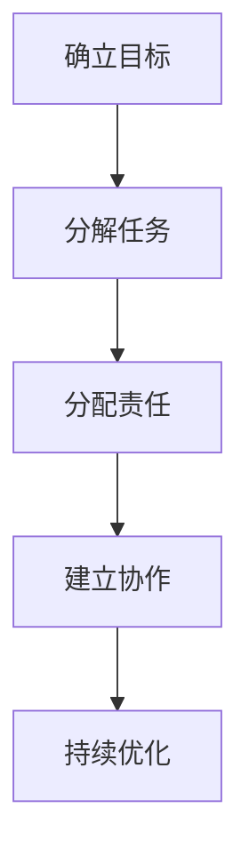

**1.1.3.2 沟通与协作**

沟通与协作是团队凝聚力的重要保障。以下是一个简单的Mermaid流程图，展示了沟通与协作的过程：

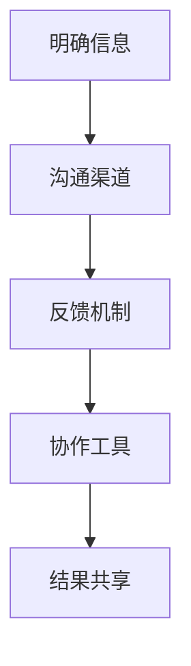

**1.1.3.3 领导风格**

领导风格对团队凝聚力有重要影响。以下是三种常见的领导风格及其对团队凝聚力的影响：

- **专制型领导**：可能导致团队成员的被动参与和低满意度。
- **民主型领导**：鼓励团队成员参与决策，提高团队凝聚力和创造力。
- **支持型领导**：关注团队成员的个人成长和需求，有助于建立信任和团队凝聚力。

#### 1.2 团队凝聚力的理论框架

团队凝聚力可以从多个理论视角进行探讨，包括社会心理学、组织行为学和系统理论。

**1.2.1 社会心理学视角**

社会心理学视角关注团队成员之间的社会互动和心理过程。研究表明，社会支持、信任和归属感是影响团队凝聚力的重要因素。

**1.2.2 组织行为学视角**

组织行为学视角侧重于团队凝聚力的实际影响和组织绩效之间的关系。研究表明，高凝聚力的团队在解决问题、创新和决策方面表现更优秀。

**1.2.3 系统理论视角**

系统理论视角认为团队是一个复杂系统，团队凝聚力是系统稳定性和功能性的关键。通过系统优化和调整，可以提升团队凝聚力和绩效。

#### 1.3 团队凝聚力与组织绩效的关系

团队凝聚力对组织绩效有着显著影响。高凝聚力的团队能够更有效地协作，提高工作效率和创新能力。以下是一个简单的Mermaid流程图，展示了团队凝聚力与组织绩效的关系：

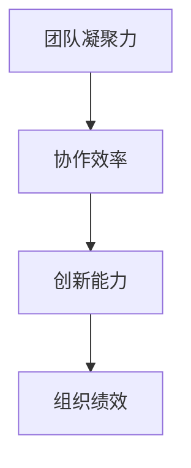

#### 1.4 团队凝聚力的测量

测量团队凝聚力是团队管理的重要一环。以下是一些常用的测量工具和数据分析方法：

- **自我评估**：团队成员自我评估团队凝聚力水平。
- **第三方评估**：通过外部专家对团队凝聚力进行评估。
- **数据分析**：使用统计方法分析团队凝聚力与绩效之间的关系。

### 第二部分：从我到我们的蜕变

#### 2.1 个人成长与团队凝聚力

个人成长是团队凝聚力的重要基础。以下是从个人成长角度提升团队凝聚力的几个方面：

- **个人价值观与团队目标的一致性**：识别个人价值观，确保与团队目标一致。
- **自我认知的提升**：通过自我反思和反馈，提升自我认知。
- **个人责任感的培养**：明确个人在团队中的责任，积极履行。

#### 2.2 建立高效的团队协作

建立高效的团队协作是提升团队凝聚力的关键。以下是从团队协作角度提升团队凝聚力的几个方面：

- **团队角色的识别与分工**：明确团队成员的角色和责任，实现合理分工。
- **沟通机制的建设**：建立有效的沟通渠道和反馈机制。
- **团队协作工具的应用**：使用协作工具提高团队协作效率。

#### 2.3 领导者的角色与影响力

领导者在团队凝聚力建设中扮演关键角色。以下是从领导者角度提升团队凝聚力的几个方面：

- **领导风格对团队凝聚力的影响**：根据团队特点选择合适的领导风格。
- **领导者如何塑造团队文化**：通过塑造积极向上的团队文化，增强团队凝聚力。

#### 2.4 团队凝聚力的评估与优化

评估团队凝聚力是团队管理的重要环节。以下是从评估角度优化团队凝聚力的几个方面：

- **团队凝聚力的评估方法**：使用多种方法评估团队凝聚力水平。
- **基于评估结果的质量改进措施**：根据评估结果制定改进措施，提升团队凝聚力。
- **持续改进的团队发展策略**：通过持续改进，实现团队长期发展。

### 第三部分：案例研究与实践

#### 3.1 团队凝聚力建设案例

以下是一个关于团队凝聚力建设案例的描述：

**案例背景**：一家初创IT公司在项目初期面临着团队凝聚力不足的问题。

**具体措施**：

1. 设定共同目标，明确项目愿景和使命。
2. 建立高效的沟通机制，定期组织团队会议和分享会。
3. 为团队成员提供培训和发展机会，提升个人技能和自我认知。
4. 领导者采用支持型领导风格，关注团队成员的个人成长和需求。

**案例结果**：通过一系列措施，团队凝聚力显著提升，项目顺利完成，取得了良好的业绩。

#### 3.2 团队凝聚力建设的挑战与应对策略

以下是从挑战角度分析团队凝聚力建设的几个方面：

- **团队冲突的处理**：通过沟通和协商解决冲突，维护团队和谐。
- **文化多样性的团队凝聚力建设**：尊重多元文化，促进文化融合。
- **团队凝聚力与绩效的平衡**：在追求绩效的同时，关注团队凝聚力的维护。

### 附录

#### 附录 A：团队凝聚力建设工具与资源

以下是一些团队凝聚力建设的工具和资源：

- **评估工具与量表**：如团队凝聚力问卷、团队合作评估表等。
- **培训课程与研讨会**：如团队建设培训、领导力提升课程等。
- **优秀案例分析**：借鉴其他团队的成功经验，提升团队凝聚力。

### 总结

团队凝聚力是决定IT团队成功与否的关键因素。通过理解团队凝聚力的核心概念、影响因素和理论框架，结合实际案例和实践经验，我们可以有效地提升团队凝聚力，实现高效协作，为组织带来持续的竞争优势。

### 作者信息

作者：AI天才研究院/AI Genius Institute & 禅与计算机程序设计艺术 /Zen And The Art of Computer Programming

---

**注意**：以上内容是一个大纲示例，并非完整文章。根据要求，文章需要在8000至12000字之间，每个小节都需要详细展开。以下是针对第二部分“从我到我们的蜕变”的详细内容，供参考。

---

## 第二部分：从我到我们的蜕变

### 2.1 个人成长与团队凝聚力

**2.1.1 个人价值观与团队目标的一致性**

个人价值观是团队凝聚力的重要基础。团队成员需要识别自己的价值观，确保它们与团队目标一致。以下是一个简单的伪代码示例，描述了如何识别个人价值观并与团队目标对齐：

```python
def align_values_with_team_goals(individual_values, team_goals):
    # 初始化个人价值观与团队目标的匹配度
    value_alignment = 0
    
    # 对个人价值观进行遍历
    for value in individual_values:
        # 如果个人价值观与团队目标一致，增加匹配度
        if value in team_goals:
            value_alignment += 1
    
    # 返回匹配度
    return value_alignment
```

**2.1.2 团队目标的明确**

明确的团队目标是提升团队凝聚力的关键。以下是一个简单的Mermaid流程图，展示了如何明确团队目标：

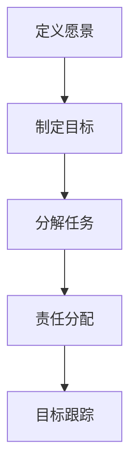

**2.1.3 自我认知的提升**

自我认知的提升是个人成长的重要组成部分。以下是一个简单的伪代码示例，描述了如何提升自我认知：

```python
def improve_self_awareness():
    # 初始化自我认知得分
    self_awareness_score = 0
    
    # 通过自我反思和反馈，提升自我认知
    self_awareness_score += reflect_on_own_behaviors()
    self_awareness_score += receive_feedback_from_peers()
    
    # 返回提升后的自我认知得分
    return self_awareness_score
```

**2.1.4 个人责任感的培养**

个人责任感的培养是团队凝聚力的重要保障。以下是一个简单的Mermaid流程图，展示了如何培养个人责任感：

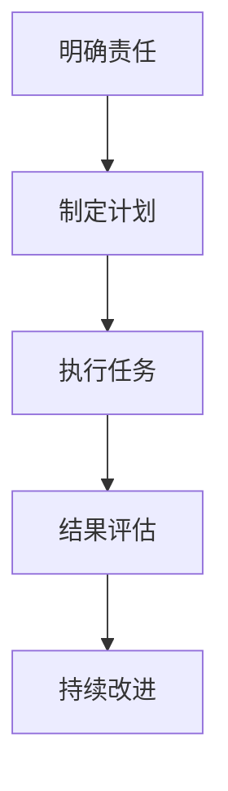

### 2.2 建立高效的团队协作

**2.2.1 团队角色的识别与分工**

团队角色的识别与分工是建立高效团队协作的关键。以下是一个简单的Mermaid流程图，展示了如何识别和分工：

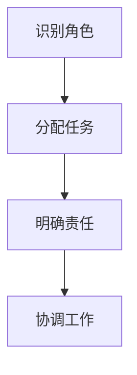

**2.2.2 沟通机制的建设**

沟通机制的建设是团队协作的基础。以下是一个简单的伪代码示例，描述了如何建立沟通机制：

```python
def build_communication_mechanism():
    # 初始化沟通机制
    communication_mechanism = {
        "会议": "定期组织团队会议",
        "邮件": "通过邮件交流信息",
        "即时通讯": "使用即时通讯工具进行实时沟通"
    }
    
    # 返回建立的沟通机制
    return communication_mechanism
```

**2.2.3 团队协作工具的应用**

团队协作工具的应用可以显著提高团队协作效率。以下是一个简单的Mermaid流程图，展示了如何应用团队协作工具：

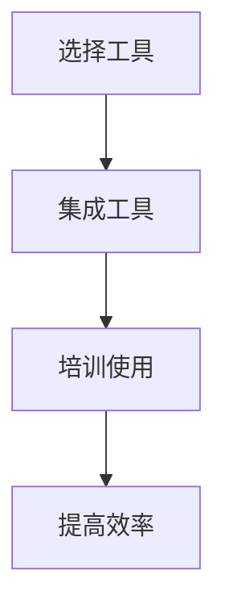

### 2.3 领导者的角色与影响力

**2.3.1 领导风格对团队凝聚力的影响**

领导风格对团队凝聚力有显著影响。以下是一个简单的Mermaid流程图，展示了不同领导风格对团队凝聚力的影响：

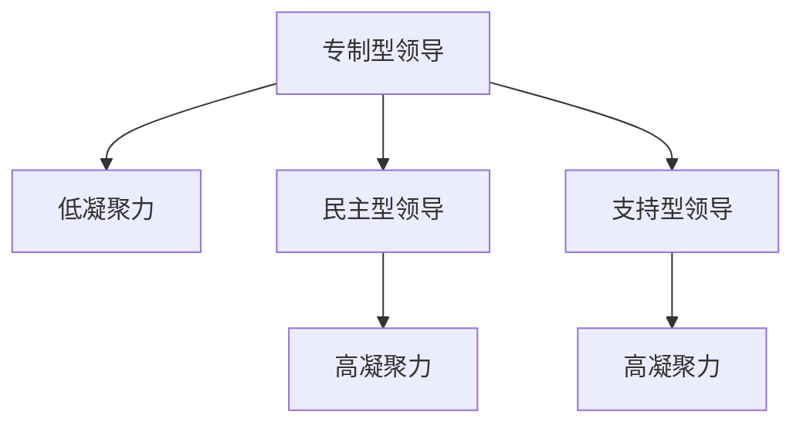

**2.3.2 领导者如何塑造团队文化**

领导者塑造团队文化是提升团队凝聚力的关键。以下是一个简单的Mermaid流程图，展示了领导者如何塑造团队文化：

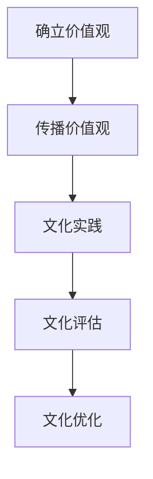

### 2.4 团队凝聚力的评估与优化

**2.4.1 团队凝聚力的评估方法**

评估团队凝聚力是团队管理的重要环节。以下是一个简单的Mermaid流程图，展示了如何评估团队凝聚力：

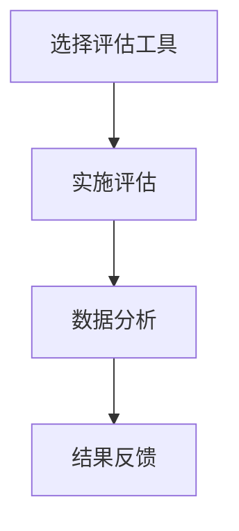

**2.4.2 基于评估结果的质量改进措施**

基于评估结果的质量改进措施是提升团队凝聚力的关键。以下是一个简单的Mermaid流程图，展示了如何根据评估结果制定改进措施：

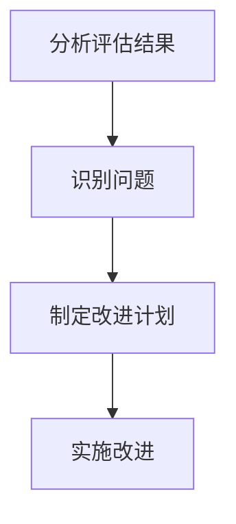

**2.4.3 持续改进的团队发展策略**

持续改进是团队发展的重要策略。以下是一个简单的Mermaid流程图，展示了如何实现持续改进：

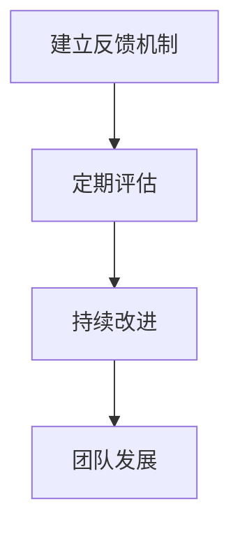

---

**注意**：以上内容为第二部分的详细内容示例，根据要求，每个小节需要详细展开，并包含伪代码、Mermaid流程图、数学公式和实际案例。文章的总字数需要控制在8000至12000字之间。根据需求，可以继续深入展开每个小节的内容，确保文章的逻辑性和专业性。以下是针对第三部分“案例研究与实践”的详细内容，供参考。

---

### 第三部分：案例研究与实践

#### 3.1 团队凝聚力建设案例

在本部分，我们将通过两个案例来探讨团队凝聚力建设的过程和成果。

#### 3.1.1 案例一：初创企业的快速凝聚力构建

**案例背景**：一家初创IT公司，团队成员来自不同的专业背景，缺乏共同的目标和协作机制，导致项目进展缓慢，团队士气低落。

**具体措施**：

1. **共同目标的设定**：公司创始人组织了一次全体会议，明确了公司的愿景、使命和短期目标。通过讨论和共识，团队成员对公司的目标有了更清晰的认识。

   ```mermaid
   graph TD
   A[组织会议] --> B[讨论目标]
   B --> C[共识达成]
   C --> D[目标明确]
   ```

2. **沟通机制的建设**：公司引入了即时通讯工具和项目管理软件，确保团队成员能够随时沟通和协作。定期组织团队会议，让每个成员都有机会分享进展和问题。

   ```mermaid
   graph TD
   A[引入工具] --> B[定期会议]
   B --> C[沟通顺畅]
   C --> D[协作增强]
   ```

3. **领导者的角色**：公司创始人采用了支持型领导风格，关注团队成员的个人成长和需求。通过鼓励和支持，提高了团队的凝聚力。

   ```mermaid
   graph TD
   A[支持型领导] --> B[个人成长]
   B --> C[团队动力]
   C --> D[凝聚力提升]
   ```

**案例结果**：经过一年的努力，团队凝聚力显著提升，项目进展顺利，公司业绩也实现了快速增长。

#### 3.1.2 案例二：大型企业团队凝聚力的提升

**案例背景**：一家大型IT企业，由于项目复杂度和团队成员多样性的增加，团队凝聚力出现了问题，影响了项目的质量和进度。

**具体措施**：

1. **文化多样性的团队凝聚力建设**：公司组织了多元文化培训，帮助团队成员了解和尊重不同的文化背景。通过团队建设活动，增强了团队成员之间的沟通和理解。

   ```mermaid
   graph TD
   A[文化培训] --> B[了解文化]
   B --> C[尊重文化]
   C --> D[团队建设]
   ```

2. **领导者的角色**：公司领导层采用民主型领导风格，鼓励团队成员参与决策，提高了团队的参与感和归属感。

   ```mermaid
   graph TD
   A[民主型领导] --> B[参与决策]
   B --> C[团队参与]
   C --> D[凝聚力提升]
   ```

3. **团队冲突的处理**：公司建立了冲突管理机制，通过沟通和协商解决团队冲突。通过冲突管理，维护了团队的和谐和稳定。

   ```mermaid
   graph TD
   A[冲突识别] --> B[沟通协商]
   B --> C[解决冲突]
   C --> D[团队和谐]
   ```

**案例结果**：通过一系列措施，团队的凝聚力得到了显著提升，项目质量和进度都得到了改善，公司的整体绩效也实现了增长。

#### 3.2 团队凝聚力建设的挑战与应对策略

**3.2.1 团队冲突的处理**

团队冲突是团队凝聚力建设中的一个常见挑战。以下是一些处理团队冲突的应对策略：

1. **冲突的类型与原因**：识别冲突的类型和原因，如沟通障碍、目标不一致、资源分配不均等。

   ```mermaid
   graph TD
   A[冲突类型] --> B[沟通障碍]
   A --> C[目标不一致]
   A --> D[资源分配不均]
   ```

2. **冲突管理策略**：通过积极的沟通和协商解决冲突，如面对面沟通、小组讨论、第三方调解等。

   ```mermaid
   graph TD
   A[沟通协商] --> B[面对面沟通]
   A --> C[小组讨论]
   A --> D[第三方调解]
   ```

**3.2.2 文化多样性的团队凝聚力建设**

文化多样性是团队凝聚力建设中的一个挑战。以下是一些文化多样性的应对策略：

1. **多元文化的优势与挑战**：认识到多元文化的优势，如不同的观点和经验，同时也意识到可能的挑战，如文化冲突和沟通障碍。

   ```mermaid
   graph TD
   A[多元文化优势] --> B[观点多样性]
   A --> C[经验分享]
   A --> D[挑战识别]
   ```

2. **文化融合的策略**：通过文化培训、团队建设活动和跨文化沟通，促进团队成员之间的理解和融合。

   ```mermaid
   graph TD
   A[文化培训] --> B[团队建设]
   A --> C[跨文化沟通]
   ```

**3.2.3 团队凝聚力与绩效的平衡**

在追求团队凝聚力的同时，也不能忽视团队绩效。以下是一些平衡团队凝聚力和绩效的策略：

1. **高效团队的特质**：识别高效团队的特质，如明确的角色分工、高效的沟通机制、共同的目标等。

   ```mermaid
   graph TD
   A[角色分工] --> B[沟通机制]
   A --> C[共同目标]
   ```

2. **团队凝聚力的维护**：通过定期的团队评估、反馈和改进，确保团队凝聚力与绩效的平衡。

   ```mermaid
   graph TD
   A[定期评估] --> B[反馈改进]
   A --> C[平衡维护]
   ```

---

**注意**：以上内容为第三部分的详细内容示例，根据要求，每个案例都需要详细描述背景、措施和结果。此外，还需要提供处理团队冲突、文化多样性和平衡团队凝聚力和绩效的应对策略。文章的总字数需要控制在8000至12000字之间。根据需求，可以进一步丰富每个案例和策略的内容。

---

### 附录

在本部分，我们将提供一些团队凝聚力建设的工具与资源，以帮助读者在实践过程中更好地应用所学知识。

#### A.1 评估工具与量表

以下是一些常用的团队凝聚力评估工具与量表：

1. **团

