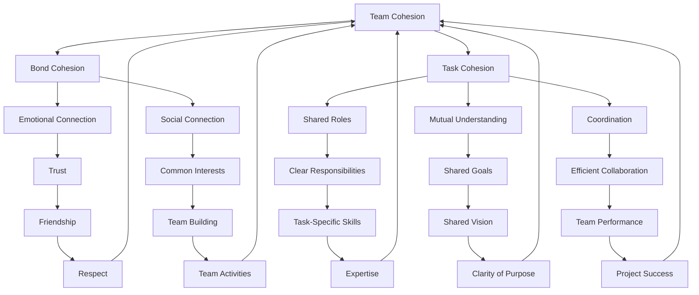

                 

### Introduction

**Team Cohesion: Building Shared Vision and Goals**

In the realm of IT and software development, team cohesion stands as a cornerstone for successful project outcomes. A cohesive team operates with a collective understanding, aligned goals, and effective communication, which significantly enhances productivity and innovation. At the heart of this cohesion lies the establishment of a shared vision and clear goals. This article will delve into the intricacies of team cohesion, elucidating how a unified vision and well-defined goals can transform a group of individuals into a high-performing team.

**Keywords:**
- Team cohesion
- Shared vision
- Goals
- IT projects
- Leadership
- Communication
- Collaboration

**Abstract:**
This article provides a comprehensive guide on building team cohesion through shared vision and goals. We will explore the importance of team cohesion in the context of IT projects, define key concepts, and discuss the theoretical foundations. We will then delve into practical strategies for fostering a cohesive team environment, including effective communication, leadership, and collaboration techniques. Case studies will be presented to illustrate successful applications of these strategies. The article concludes with insights on overcoming common challenges and emphasizes the continuous improvement process essential for sustaining team cohesion.

### Importance of Team Cohesion in IT Projects

In the realm of Information Technology (IT), team cohesion is not merely a soft skill but a fundamental driver of project success. A cohesive team functions like a well-oiled machine, where each member understands their role and collaborates effectively towards a common goal. The importance of team cohesion in IT projects can be understood through several key factors:

**1. Enhanced Productivity:**
Cohesive teams are more efficient and productive. When team members have a clear understanding of each other's roles and responsibilities, they can work seamlessly, reducing the time spent on unnecessary communications and redundant tasks. This synergy leads to faster development cycles and quicker project delivery.

**2. Better Decision-Making:**
Team cohesion fosters an environment where members feel comfortable sharing ideas and opinions. This openness leads to better decision-making, as diverse perspectives are considered. In the IT sector, where complex problems require innovative solutions, this collective intelligence is invaluable.

**3. Reduced Conflict:**
Conflict is inevitable in any team, but cohesive teams are better equipped to handle disagreements. When there is a shared vision and common goals, conflicts can be addressed more constructively. Members are more likely to find common ground and work towards resolving issues, rather than allowing conflicts to escalate.

**4. Improved Employee Engagement:**
A cohesive team environment enhances employee engagement. When team members feel valued and understood, they are more motivated to contribute their best work. This high level of engagement leads to increased job satisfaction and retention rates.

**5. Innovation and Creativity:**
Cohesive teams are breeding grounds for innovation and creativity. With a shared vision, team members are encouraged to think outside the box and explore new ideas. This collaborative environment spurs creativity, which is crucial in the fast-paced and ever-evolving world of IT.

**6. Client Satisfaction:**
In IT projects, client satisfaction is paramount. A cohesive team can better understand and anticipate client needs, leading to higher-quality deliverables and improved client relationships. This not only ensures project success but also fosters long-term client loyalty.

In conclusion, team cohesion is essential for the success of IT projects. It not only boosts productivity and innovation but also fosters a positive work environment, reducing conflicts and enhancing employee engagement. By focusing on building a cohesive team, organizations can achieve their project goals more efficiently and effectively.

### Core Concepts and Theoretical Models of Team Cohesion

To truly understand team cohesion, it is essential to delve into the core concepts and theoretical models that underpin this construct. Team cohesion can be defined as the degree to which members of a team are emotionally, psychologically, and physically connected to each other, and their collective commitment to achieving a common goal. This connection fosters collaboration, trust, and mutual support, ultimately leading to higher team performance. Let's explore some of the key concepts and theoretical models that help us grasp the essence of team cohesion.

#### Defining Team Cohesion

At its core, team cohesion comprises two primary aspects: bond cohesion and task cohesion. Bond cohesion refers to the emotional and social connections among team members, often characterized by friendship, mutual respect, and shared interests. Task cohesion, on the other hand, focuses on the team's ability to work together effectively towards achieving their goals, emphasizing shared roles, mutual understanding, and coordinated efforts.

**Bond Cohesion:**
- **Emotional Connection:** Bond cohesion is built on the emotional bonds that form among team members. These connections can be established through open communication, trust-building activities, and team-building exercises.
- **Friendship and Respect:** When team members feel respected and valued, they are more likely to form friendships and develop strong interpersonal relationships.
- **Shared Interests:** Common interests and hobbies can also strengthen bond cohesion, fostering a sense of camaraderie and unity.

**Task Cohesion:**
- **Shared Roles and Responsibilities:** Task cohesion is facilitated by clear roles and responsibilities, ensuring that each team member understands their contribution to the team's objectives.
- **Mutual Understanding:** When team members have a deep understanding of each other's roles and expertise, they can work more efficiently and collaboratively.
- **Coordination and Synchronization:** Task cohesion requires coordination and synchronization of efforts, where team members work together in a seamless and complementary manner.

#### Theoretical Models of Team Cohesion

Several theoretical models have been proposed to explain the dynamics of team cohesion. These models provide frameworks for understanding how team cohesion develops and how it can be enhanced. Here are a few notable models:

**1. Tuckman's Forming, Storming, Norming, and Performing Model:**
Tuckman's model describes the stages that teams typically go through as they develop and mature. The forming stage is characterized by initial meetings and the formation of the team. The storming stage involves conflict and disagreement as team members assert their own ideas and preferences. The norming stage is marked by the establishment of norms and shared values, leading to increased cohesion. The performing stage is the most cohesive phase, where the team operates smoothly and efficiently towards achieving their goals.

**2. Chester Barnard's Cooperative Systems Theory:**
Barnard's theory emphasizes the role of communication and mutual understanding in team cohesion. He argues that effective communication is crucial for establishing a sense of unity and purpose within a team. His model suggests that leaders should focus on building relationships, fostering trust, and ensuring that communication channels are open and effective.

**3. Pfeffer and Salancik's Interdependence Theory:**
Pfeffer and Salancik propose that team cohesion arises from the interdependence of team members. They argue that the more interdependent the tasks within a team, the stronger the cohesion will be. This interdependence can be achieved through clear role definitions, shared goals, and mutual reliance on each other's contributions.

**4. Bass and Avolio's Transformational Leadership Theory:**
Transformational leadership is associated with high levels of team cohesion. Transformational leaders inspire and motivate their teams by setting clear visions and goals, fostering trust and collaboration, and providing support and encouragement. This leadership style promotes a shared sense of purpose and commitment among team members.

#### Core Concepts and Relationships

To better understand team cohesion, it is helpful to visualize the core concepts and their relationships using a Mermaid flowchart:

This Mermaid flowchart illustrates the interconnectedness of the core concepts of team cohesion, showing how emotional and social bonds (bond cohesion) and task-related factors (task cohesion) contribute to overall team cohesion. The relationships between these concepts highlight the importance of trust, mutual understanding, and shared goals in fostering a cohesive team environment.

In conclusion, team cohesion is a multifaceted concept that encompasses both emotional and task-related dimensions. By understanding the core concepts and theoretical models, we can better appreciate the importance of fostering a cohesive team environment in the context of IT projects. The next section will delve into the specifics of shared vision and goals, exploring how these elements play a crucial role in building team cohesion.

### Understanding Shared Vision and Goals

Shared vision and goals are the backbone of a cohesive team, providing a sense of direction and purpose that unites team members towards a common objective. To fully grasp the significance of shared vision and goals, it is essential to delve into their definitions, distinctions, and the importance of mutual understanding within the team.

#### Vision and Goals

**Vision:**
A vision is an overarching picture of what the team aspires to achieve in the long term. It outlines the desired future state and provides a clear direction for the team's efforts. A well-defined vision captures the essence of the team's purpose and inspires members to work towards a meaningful goal. Vision statements often encapsulate the team's core values, aspirations, and long-term objectives.

**Goals:**
Goals, on the other hand, are specific, actionable objectives that the team aims to achieve within a defined timeframe. Unlike visions, which are broad and aspirational, goals are concrete and measurable. They provide a roadmap for the team, breaking down the vision into achievable milestones. Goals are essential for guiding daily tasks and ensuring that the team stays on track towards the desired outcome.

**Vision vs. Goals:**
While vision and goals are interconnected, they serve distinct roles within a team. Vision sets the overarching direction, inspiring and motivating team members to strive for something greater. Goals, however, are the specific steps that the team takes to realize the vision. Vision provides the "why" behind the team's efforts, while goals outline the "how" and "what" needs to be accomplished.

**Importance of Mutual Understanding:**
Mutual understanding is crucial for aligning team members around a shared vision and set of goals. When team members have a clear understanding of the vision and goals, they can work more effectively and collaboratively. Here are a few key reasons why mutual understanding is vital:

1. **Clear Direction:**
   Mutual understanding ensures that all team members are aligned and working towards the same objectives. This clarity of direction prevents confusion and misalignment, allowing the team to focus their efforts on achieving the goals.

2. **Effective Collaboration:**
   When team members understand each other's roles and contributions, they can collaborate more effectively. This shared understanding fosters better coordination and synchronization of efforts, leading to more efficient and productive work.

3. **Motivation and Engagement:**
   A shared vision and goals can inspire and motivate team members. When team members understand the broader purpose of their work and how it aligns with the team's vision, they are more likely to feel engaged and motivated to contribute their best efforts.

4. **Conflict Resolution:**
   Misunderstandings and miscommunications can lead to conflicts within a team. When team members have a shared understanding of the vision and goals, they are better equipped to address and resolve conflicts constructively. This mutual understanding reduces the likelihood of misunderstandings and fosters a more harmonious team environment.

5. **Performance and Success:**
   A cohesive team with a mutual understanding of the vision and goals is more likely to achieve high performance and success. The shared vision provides a sense of purpose and direction, while mutual understanding ensures that the team can navigate challenges and obstacles effectively.

In conclusion, shared vision and goals are foundational to building a cohesive team. By fostering mutual understanding, team members can align their efforts, collaborate effectively, and achieve their objectives. The next section will delve into the practical strategies for creating and communicating a shared vision and setting achievable goals, highlighting the role of leadership in this process.

### Establishing a Strong Foundation for Team Cohesion

To build a cohesive team, it is crucial to establish a strong foundation that supports clear communication, fostered trust, and encouraged collaboration. These elements serve as the bedrock upon which a high-performing team can be constructed. Let's explore some key strategies for each of these foundational components.

#### Communicate Clearly

Effective communication is the lifeblood of a cohesive team. It ensures that all members are on the same page, understand their roles and responsibilities, and can collaborate efficiently. Here are some strategies for enhancing communication within a team:

1. **Regular Meetings:**
   Schedule regular team meetings to discuss progress, address challenges, and share updates. These meetings provide a platform for open dialogue and ensure that everyone stays informed about the team's objectives and timelines.

2. **Active Listening:**
   Encourage active listening during team interactions. Active listening involves fully concentrating, understanding, responding, and remembering what is being said. This practice fosters a culture of respect and understanding within the team.

3. **Clear Role Definitions:**
   Clearly define each team member's roles and responsibilities. This clarity helps prevent misunderstandings and ensures that everyone understands their contribution to the team's goals.

4. **Feedback Loops:**
   Implement feedback loops where team members can provide constructive feedback on each other's work. This practice encourages continuous improvement and helps maintain a high standard of performance.

#### Foster Trust

Trust is the cornerstone of a cohesive team. When team members trust each other, they are more likely to collaborate effectively and support one another. Here are some strategies for fostering trust within a team:

1. **Transparency:**
   Cultivate a culture of transparency by sharing information, decisions, and progress openly with the team. This openness helps build trust and ensures that everyone is aware of the team's direction and challenges.

2. **Open Communication:**
   Encourage open communication where team members feel comfortable sharing their ideas, concerns, and suggestions. This practice fosters a sense of inclusion and trust, as all members feel valued and heard.

3. **Integrity:**
   Promote integrity by demonstrating honesty and ethical behavior in all team interactions. When team members can rely on each other's integrity, they are more likely to trust and respect one another.

4. **Mutual Support:**
   Encourage mutual support by providing help and assistance to team members when needed. This support can include offering guidance, sharing resources, and collaborating on tasks. When team members feel supported, they are more likely to trust and rely on each other.

#### Encourage Collaboration

Collaboration is the glue that holds a cohesive team together. When team members collaborate effectively, they can leverage each other's strengths and overcome challenges more efficiently. Here are some strategies for encouraging collaboration within a team:

1. **Team-Building Activities:**
   Organize team-building activities that encourage collaboration and foster a sense of camaraderie. These activities can range from group exercises and games to social events that allow team members to connect on a personal level.

2. **Cross-Functional Teams:**
   Create cross-functional teams that bring together members with diverse skills and perspectives. This diversity fosters creative problem-solving and enables teams to tackle complex challenges more effectively.

3. **Collaborative Tools:**
   Utilize collaborative tools and platforms that facilitate communication and collaboration. These tools can include project management software, instant messaging apps, and shared document repositories. By providing the right tools, teams can work together more seamlessly.

4. **Shared Goals:**
   Align team members around shared goals that require collaboration. When everyone understands how their individual contributions fit into the larger picture, they are more motivated to work together towards achieving these goals.

In conclusion, establishing a strong foundation for team cohesion requires clear communication, fostered trust, and encouraged collaboration. By implementing these strategies, teams can build a strong foundation that supports their long-term success and helps them achieve their objectives more effectively.

### Creating a Shared Vision

Creating a shared vision is a critical step in building a cohesive team. A compelling vision serves as a guiding light, inspiring team members and aligning their efforts towards a common goal. In this section, we will explore the visioning process, the key components of a vision statement, and effective strategies for communicating the vision to the team.

#### Visioning Process

The visioning process involves several key steps that help the team articulate and internalize their collective aspirations. Here's a step-by-step guide to the visioning process:

1. **Assemble the Team:**
   Begin by assembling a diverse group of team members who represent various perspectives and expertise. This diversity ensures that the vision reflects the collective wisdom and input of the team.

2. **Understand Current State:**
   Start by assessing the team's current situation, including its strengths, weaknesses, opportunities, and threats. This analysis provides a baseline against which the vision can be measured.

3. **Gather Input:**
   Conduct brainstorming sessions and engage in open discussions to gather input from team members. Encourage everyone to share their thoughts, ideas, and aspirations. This inclusive approach helps build buy-in and ensures that the vision is representative of the team's collective vision.

4. **Define Core Values:**
   Identify and define the core values that the team believes are essential for achieving their vision. These values serve as guiding principles that inform decision-making and behavior within the team.

5. **Develop a Vision Statement:**
   Based on the input and core values, formulate a concise and inspiring vision statement. This statement should capture the essence of the team's aspirations and serve as a rallying cry for the entire team.

6. **Align with Organizational Goals:**
   Ensure that the team's vision aligns with the broader goals and objectives of the organization. This alignment ensures that the team's efforts contribute to the overall success of the organization.

7. **Review and Refine:**
   Review the vision statement with the team, seeking feedback and making necessary revisions. The vision should be a reflection of the team's collective aspirations and should inspire and motivate them to work towards achieving it.

#### Key Components of a Vision Statement

A well-crafted vision statement should be clear, inspiring, and actionable. Here are the key components that make up an effective vision statement:

1. **Clarity:**
   The vision statement should be concise and easy to understand. It should leave no room for ambiguity, ensuring that all team members have a clear understanding of what the vision entails.

2. **Inspiration:**
   An effective vision statement should be inspiring, capturing the team's aspirations and motivating them to work towards achieving it. It should evoke a sense of excitement and purpose among team members.

3. **Actionability:**
   The vision statement should be actionable, outlining the steps and actions that the team needs to take to achieve their aspirations. It should provide a clear roadmap for the team's efforts.

4. **Alignment:**
   The vision statement should align with the broader goals and objectives of the organization. This alignment ensures that the team's efforts contribute to the overall success of the organization.

5. **Inclusivity:**
   The vision statement should be inclusive, reflecting the collective aspirations of the team. It should resonate with all members and ensure that everyone feels involved and invested in the vision.

#### Effective Communication of the Vision

Once the vision statement is developed, it is crucial to communicate it effectively to the team. Here are some strategies for doing so:

1. **Personalize the Vision:**
   Tailor the communication of the vision to the individual members of the team. Explain how the vision aligns with their personal goals and aspirations, making it more relatable and engaging.

2. **Use Visual Aids:**
   Utilize visual aids, such as posters, slides, and infographics, to help communicate the vision. Visuals can be a powerful tool for conveying complex ideas in a clear and engaging manner.

3. **Storytelling:**
   Use storytelling techniques to convey the vision. Share stories of successful teams or individuals who have achieved similar visions, illustrating the potential and impact of the team's efforts.

4. **Reinforce the Vision:**
   Continuously reinforce the vision through regular reminders and updates. This reinforcement helps keep the vision top-of-mind and ensures that it remains a guiding force for the team's actions.

5. **Incorporate the Vision into Daily Work:**
   Integrate the vision into the team's daily work and decision-making processes. When team members see the vision reflected in their everyday tasks, they are more likely to internalize and embrace it.

In conclusion, creating a shared vision is a vital step in building a cohesive team. By following the visioning process, defining key components of the vision statement, and effectively communicating the vision to the team, leaders can inspire and align their team members towards a common goal. The next section will delve into the intricacies of setting and achieving goals, providing practical strategies for ensuring that the team stays on track and achieves its objectives.

### Setting and Achieving Goals

Setting and achieving goals is a fundamental aspect of building a cohesive team. Clear, achievable goals provide direction, motivation, and a sense of purpose for team members. In this section, we will explore the key principles of goal-setting, the SMART criteria for defining effective goals, and the step-by-step process for setting and achieving goals within a team.

#### Key Principles of Goal-Setting

1. **Specificity:**
   Goals should be specific rather than vague. A specific goal provides clarity and a clear target for the team to aim for. For example, "increase website traffic" is not specific enough, whereas "increase website traffic by 20% within three months" is a specific and measurable goal.

2. **Measurability:**
   Goals should be measurable so that progress can be tracked and evaluated. This allows the team to assess whether they are on track to achieve their objectives. For instance, if the goal is to increase sales, measurable metrics might include the number of new customers acquired or the total revenue generated.

3. **Achievability:**
   Goals should be challenging yet achievable. Setting overly ambitious or impossible goals can lead to frustration and demotivation. It's important to balance ambition with realism, ensuring that the goals are attainable given the team's resources, skills, and constraints.

4. **Relevance:**
   Goals should be relevant to the team's overall vision and objectives. They should align with the broader goals of the organization and contribute to the team's mission. This alignment ensures that the team's efforts are focused and purposeful.

5. **Time-bound:**
   Goals should have a specific timeline or deadline. This provides a sense of urgency and helps keep the team focused on their objectives. For example, "complete the new software feature by the end of the quarter" sets a clear timeline for achieving the goal.

#### SMART Goals

SMART is an acronym that stands for Specific, Measurable, Achievable, Relevant, and Time-bound. These criteria are used to evaluate the effectiveness of goals. Let's break down each component of SMART goals:

1. **Specific:**
   - Example: "Improve the website's loading speed by 30% within two months."

2. **Measurable:**
   - Example: "Achieve a minimum of 1000 new user registrations per month."

3. **Achievable:**
   - Example: "Develop and launch a mobile app version of our product within six months, given our current resources and expertise."

4. **Relevant:**
   - Example: "Increase customer satisfaction scores from 75% to 85% by the end of the year, aligning with our goal to improve customer experience."

5. **Time-bound:**
   - Example: "Complete the design and development of the new feature by the end of July."

#### Step-by-Step Process for Setting and Achieving Goals

1. **Identify the Goals:**
   Begin by identifying the goals that align with the team's vision and objectives. This involves brainstorming and discussing with team members to ensure that everyone is on the same page.

2. **Break Down the Goals:**
   Break down the overarching goals into smaller, manageable tasks. This process makes the goals more achievable and allows for better tracking of progress.

3. **Assign Responsibilities:**
   Assign specific responsibilities to team members based on their skills and expertise. Clear role definitions ensure that everyone knows their tasks and contributes effectively to achieving the goals.

4. **Set Milestones:**
   Set milestones to mark significant checkpoints along the way. These milestones provide a sense of accomplishment and help keep the team motivated.

5. **Create a Timeline:**
   Develop a timeline that outlines the start and end dates for each task and milestone. This timeline helps keep the team focused and ensures that they stay on track.

6. **Monitor Progress:**
   Regularly monitor progress towards the goals. This involves tracking metrics, reviewing timelines, and assessing whether the team is on track or if adjustments are needed.

7. **Adjust and Adapt:**
   If necessary, adjust the goals or timeline based on progress and new information. Flexibility is key to ensuring that the team can adapt to changes and continue making progress.

8. **Celebrate Achievements:**
   Celebrate the achievements of the team when goals are met. This recognition helps reinforce the team's efforts and motivation.

By following these steps and adhering to the SMART criteria, teams can effectively set and achieve their goals. Clear, achievable goals provide a sense of direction and purpose, fostering a cohesive and motivated team environment. The next section will delve into the role of leadership in fostering team cohesion and achieving goals.

### The Role of Leadership in Team Cohesion

Leadership is a pivotal factor in shaping the cohesion and success of a team. Effective leadership not only sets the tone for the team's dynamics but also fosters an environment where shared vision and goals can flourish. Let's explore the role of leadership in team cohesion, the different leadership styles that can influence team cohesion, and the strategies for cultivating a team spirit.

#### The Role of Leadership in Team Cohesion

1. **Setting Direction and Vision:**
   Leaders are responsible for defining the team's vision and goals. By providing a clear direction, leaders ensure that all team members are aligned and working towards a common purpose. This shared vision is the foundation of team cohesion.

2. **Building Trust and Communication:**
   Leaders play a crucial role in building trust within the team. By fostering open communication and active listening, leaders create an environment where team members feel comfortable sharing their thoughts and concerns. Trust is essential for team cohesion and collaboration.

3. **Fostering Collaboration:**
   Effective leaders encourage collaboration among team members. They facilitate teamwork by promoting a sense of unity and shared purpose. Leaders can do this by creating opportunities for team members to work together and by recognizing and valifying collaborative efforts.

4. **Managing Conflict:**
   Conflict is inevitable in any team, but effective leaders are equipped to manage and resolve conflicts constructively. They do this by addressing conflicts directly, ensuring that all perspectives are heard, and finding mutually agreeable solutions. By managing conflict well, leaders maintain team cohesion and prevent discord from undermining the team's performance.

5. **Supporting and Empowering Team Members:**
   Leaders support their team members by providing resources, guidance, and encouragement. They empower team members by delegating responsibilities and trusting them to make decisions. When team members feel supported and empowered, they are more likely to contribute their best efforts, fostering a cohesive team.

#### Different Leadership Styles and Their Impact on Team Cohesion

1. **Autocratic Leadership:**
   Autocratic leaders make decisions independently and expect strict adherence to their directives. While this style can ensure quick decision-making and clear direction, it can stifle creativity and collaboration, potentially undermining team cohesion.

2. **Democratic Leadership:**
   Democratic leaders involve team members in decision-making processes and value their input. This style fosters a sense of ownership and participation, promoting collaboration and team cohesion. However, it can sometimes lead to decision paralysis if not managed effectively.

3. **Laissez-Faire Leadership:**
   Laissez-faire leaders delegate decision-making and responsibilities to their team members, giving them autonomy. This style can enhance creativity and individual initiative but may result in lack of direction and coordination if not balanced with sufficient oversight.

4. **Transformational Leadership:**
   Transformational leaders inspire and motivate their team members through visionary leadership and personal empowerment. They create a shared vision and inspire team members to go beyond their comfort zones to achieve collective goals. This style is highly effective in fostering team cohesion and driving high performance.

5. **Servant Leadership:**
   Servant leaders prioritize the needs and development of their team members. They act as servants to their team, supporting their growth and well-being. This style fosters a collaborative and supportive team environment, promoting cohesion and high morale.

#### Strategies for Cultivating Team Spirit

1. **Recognize and Reward Contributions:**
   Recognizing and rewarding team members for their contributions and achievements is a powerful way to foster a sense of camaraderie and ownership. This can include verbal praise, public recognition, or tangible rewards such as bonuses or gifts.

2. **Build Team Culture:**
   Cultivating a positive team culture that values collaboration, respect, and mutual support is essential for team cohesion. This culture should be reflected in the team's interactions, decision-making processes, and overall work environment.

3. **Encourage Open Communication:**
   Open communication channels are crucial for team cohesion. Leaders should encourage team members to share their thoughts, ideas, and concerns openly. This fosters a sense of inclusion and trust, promoting a cohesive team dynamic.

4. **Facilitate Team-Building Activities:**
   Regular team-building activities can help build stronger relationships among team members and enhance team cohesion. These activities can include social events, group exercises, and collaborative projects.

5. **Provide Opportunities for Growth:**
   Offering opportunities for personal and professional growth can motivate team members and strengthen their commitment to the team. This can include training programs, mentorship, and career development opportunities.

In conclusion, leadership plays a critical role in fostering team cohesion. Effective leaders set a clear vision, build trust, encourage collaboration, and support their team members. By employing different leadership styles and implementing strategies to cultivate team spirit, leaders can create a cohesive and high-performing team. The next section will delve into the importance of effective communication and collaboration in achieving team cohesion.

### Effective Communication and Collaboration

Effective communication and collaboration are the cornerstones of team cohesion. They enable team members to work together efficiently, share ideas freely, and solve problems collectively. In this section, we will explore the importance of effective communication skills, collaboration tools, and team dynamics in fostering a cohesive team environment.

#### Effective Communication Skills

1. **Active Listening:**
   Active listening is a critical communication skill that involves fully concentrating, understanding, responding, and remembering what is being said. It requires paying attention to both verbal and non-verbal cues, ensuring that the speaker feels heard and understood. Active listening fosters trust and respect within the team, which is essential for effective collaboration.

2. **Clear and Concise Communication:**
   Clear and concise communication ensures that messages are understood accurately and efficiently. Avoid using jargon or complex language that can confuse or mislead team members. When communicating, be clear about the purpose, goals, and expectations, and use simple language to convey complex ideas.

3. **Non-Verbal Communication:**
   Non-verbal communication, including body language, facial expressions, and gestures, can significantly impact the effectiveness of communication. Pay attention to your non-verbal cues to ensure they align with your verbal messages. For instance, maintaining eye contact and using open body language can convey confidence and openness.

4. **Feedback and Clarification:**
   Encourage feedback and clarification during communication to ensure that messages are understood correctly. Ask questions and seek clarification when needed, and provide feedback to ensure that your message is understood as intended.

#### Collaboration Tools

1. **Project Management Software:**
   Project management tools such as Trello, Asana, or Jira can help teams track progress, assign tasks, and manage timelines. These tools provide a centralized platform for communication and collaboration, ensuring that all team members are on the same page.

2. **Instant Messaging and Video Conferencing:**
   Instant messaging platforms like Slack or Microsoft Teams facilitate real-time communication and quick decision-making. Video conferencing tools like Zoom or Microsoft Teams enable face-to-face interactions, which can be especially valuable for building trust and understanding among team members.

3. **Document Sharing and Collaboration Platforms:**
   Platforms like Google Drive or Dropbox allow teams to share and collaborate on documents in real-time. These tools enable version control, commenting, and simultaneous editing, making it easier to collaborate on projects.

4. **Virtual Whiteboards and Brainstorming Tools:**
   Tools like Miro or Mural enable virtual brainstorming and collaborative problem-solving. These platforms allow teams to create and share visual ideas, fostering creativity and innovation.

#### Team Dynamics

1. **Building Relationships:**
   Strong relationships among team members are essential for effective collaboration. Encourage team-building activities that foster camaraderie and trust, such as team lunches, social events, or off-site retreats.

2. **Diversity and Inclusion:**
   Embrace diversity and create an inclusive environment where team members feel valued and respected. Diversity of thought, background, and experience can enhance creativity and innovation, leading to better outcomes.

3. **Clear Roles and Responsibilities:**
   Clearly define each team member's roles and responsibilities to avoid confusion and duplication of efforts. This ensures that everyone understands their contributions to the team's goals and can collaborate effectively.

4. **Conflict Resolution:**
   Conflict is inevitable in any team, but effective conflict resolution is crucial for maintaining team cohesion. Encourage open communication and provide training on conflict resolution strategies to help team members address and resolve conflicts constructively.

5. **Continuous Improvement:**
   Foster a culture of continuous improvement by encouraging feedback and reflection. Regularly assess the team's communication and collaboration practices, identifying areas for improvement and implementing changes to enhance team cohesion.

In conclusion, effective communication and collaboration are vital for building a cohesive team. By developing strong communication skills, leveraging collaboration tools, and fostering positive team dynamics, teams can work together efficiently and effectively towards achieving their shared vision and goals. The next section will delve into common challenges that can hinder team cohesion and explore strategies for overcoming them.

### Overcoming Common Challenges in Team Cohesion

While building a cohesive team can be rewarding, it's not without its challenges. Common obstacles such as low employee engagement, lack of trust, and conflicts can hinder team cohesion and impede progress. In this section, we will discuss these challenges and provide strategies for addressing and overcoming them.

#### Low Employee Engagement

**Problem:**
Low employee engagement can manifest as disinterest, lack of motivation, and a general sense of indifference towards the team's goals. This can lead to decreased productivity, missed deadlines, and a lack of innovation.

**Solution:**
1. **Identify the Root Causes:**
   Conduct surveys or hold one-on-one meetings to understand the reasons behind low engagement. Common causes may include a lack of clarity in goals, feeling undervalued, or a lack of autonomy.

2. **Communicate Clearly:**
   Ensure that team members understand their roles, the importance of their contributions, and how their work aligns with the broader vision. Clear communication helps employees see the purpose and value of their work.

3. **Recognize and Reward Efforts:**
   Recognize and reward employees for their contributions and achievements. This can include verbal praise, public acknowledgment, or tangible rewards like bonuses or extra time off. Recognition helps boost morale and motivates employees to engage more actively.

4. **Provide Opportunities for Growth:**
   Offer professional development opportunities, such as training sessions, workshops, or conferences. When employees see that their growth and development are valued, they are more likely to become more engaged.

#### Lack of Trust

**Problem:**
Lack of trust among team members can lead to communication breakdowns, conflicts, and a lack of collaboration. This can undermine team cohesion and hinder progress.

**Solution:**
1. **Foster Open Communication:**
   Encourage open and honest communication within the team. Create a safe space where team members feel comfortable sharing their thoughts, concerns, and ideas without fear of judgment or retribution.

2. **Demonstrate Integrity:**
   Leaders must demonstrate integrity and ethical behavior to build trust. Consistently acting in the best interests of the team and the organization helps establish trust and credibility.

3. **Build Relationships:**
   Invest time in building relationships with team members through team-building activities, social events, and regular one-on-ones. Strong relationships enhance trust and mutual understanding.

4. **Resolve Conflicts Promptly:**
   Address conflicts promptly and constructively. Provide training on conflict resolution strategies and encourage team members to seek resolution through dialogue rather than avoidance.

#### Conflicts and Disagreements

**Problem:**
Conflicts and disagreements are inevitable in any team, but unaddressed conflicts can escalate and damage team cohesion. They can lead to a toxic work environment, decreased morale, and reduced productivity.

**Solution:**
1. **Encourage Dialogue:**
   Create a culture where conflicts are addressed openly and constructively. Encourage team members to voice their concerns and disagreements, and provide a safe space for them to do so.

2. **Listen Actively:**
   When conflicts arise, leaders should actively listen to all parties involved. This means hearing their perspectives, concerns, and underlying issues. Active listening helps to build understanding and can lead to more effective problem-solving.

3. **Facilitate Mediation:**
   If conflicts cannot be resolved through open dialogue, consider using a mediator to help facilitate a resolution. A neutral third party can help guide the conversation and find a mutually agreeable solution.

4. **Implement Conflict Resolution Strategies:**
   Train team members on conflict resolution strategies and encourage their use. Strategies such as seeking compromise, focusing on common goals, and finding creative solutions can help address conflicts and maintain team cohesion.

In conclusion, overcoming common challenges in team cohesion requires proactive and thoughtful strategies. By addressing low employee engagement, fostering trust, and resolving conflicts constructively, leaders can build a cohesive team that is motivated, collaborative, and focused on achieving their shared vision and goals.

### Developing Resilience and Continuous Improvement

In the dynamic and often challenging environment of IT projects, teams must cultivate resilience to navigate obstacles and maintain cohesion. Building resilience involves fostering adaptability, psychological safety, and a commitment to continuous improvement. These elements not only enhance team cohesion but also ensure that the team can effectively respond to changing circumstances and sustain high performance over the long term.

#### Building Adaptability

1. **Embrace Change:**
   The IT industry is marked by rapid technological advancements and shifting priorities. Teams must be open to change and adaptable to new situations. Leaders should encourage a mindset that views change as an opportunity rather than a threat.

2. **Flexibility in Role Allocation:**
   As projects evolve, team members may need to take on different roles or tasks. Leaders should foster a flexible team structure that allows for dynamic role allocation based on the current project needs. This adaptability helps the team respond quickly to changes in scope or priorities.

3. **Continuous Skill Development:**
   Encourage team members to develop new skills and stay updated with industry trends. By investing in their professional growth, teams can adapt to new technologies and methodologies, ensuring they remain competitive and agile.

#### Promoting Psychological Safety

1. **Safe Communication Channels:**
   Create a culture where team members feel safe to express their ideas, concerns, and mistakes without fear of judgment or retribution. Safe communication channels help build trust and encourage open dialogue.

2. **Encourage Feedback:**
   Foster a culture of constructive feedback where team members are encouraged to share their perspectives and insights. Feedback should be focused on improving outcomes rather than critiquing individuals.

3. **Supportive Leadership:**
   Leaders play a crucial role in promoting psychological safety. By demonstrating empathy, actively listening, and valuing input from all team members, leaders can create an environment where everyone feels respected and supported.

#### Continuous Improvement

1. **Regular Reflection and Review:**
   Schedule regular team meetings to reflect on project progress and performance. Use these sessions to discuss what is working well, what needs improvement, and any challenges encountered. This reflective practice helps the team identify areas for growth and development.

2. **Iterative Development:**
   Adopt an iterative approach to project development, where feedback is incorporated at each stage. This approach allows for continuous refinement and improvement, ensuring that the final product meets the needs and expectations of stakeholders.

3. **Learning from Failures:**
   View failures as learning opportunities rather than as setbacks. Encourage team members to analyze failures, identify lessons learned, and apply these insights to future projects. This mindset fosters a culture of resilience and continuous improvement.

In conclusion, developing resilience and fostering continuous improvement are essential for maintaining team cohesion in the face of challenges. By embracing adaptability, promoting psychological safety, and committing to continuous improvement, teams can navigate obstacles effectively and sustain high performance over time. These practices not only enhance team cohesion but also drive innovation and success in the dynamic world of IT.

### Case Studies: Successful Strategies for Building Team Cohesion

To illustrate the practical application of the strategies discussed, let's examine several real-world case studies where teams successfully built cohesion through shared vision and goal-setting. These examples provide valuable insights into the challenges faced, the strategies employed, and the outcomes achieved.

#### Case Study 1: TechStart

**Challenge:**
TechStart, a fast-growing tech startup, found that as their team expanded, communication and collaboration began to break down. The rapid pace of development and frequent changes in project scope created a high-stress environment, leading to misunderstandings and decreased morale.

**Strategy:**
1. **Clear Vision and Communication:**
   The leadership team developed a clear vision for the company, which was communicated to all employees through regular all-hands meetings and team updates. They also implemented a company-wide communication platform to ensure that information flowed seamlessly across departments.

2. **Team-Building Activities:**
   TechStart organized regular team-building events, including retreats, social gatherings, and workshops. These activities fostered camaraderie and helped build trust among team members.

3. **Goal-Setting and Accountability:**
   Each team member set individual and team goals aligned with the company's vision. Regular check-ins and progress meetings ensured accountability and allowed for timely adjustments.

**Outcome:**
By establishing clear communication channels and fostering a collaborative culture, TechStart saw a significant improvement in team cohesion and overall productivity. The company achieved its project milestones ahead of schedule and experienced a boost in employee satisfaction and retention.

#### Case Study 2: GreenTech Innovations

**Challenge:**
GreenTech Innovations, an environmental technology company, faced challenges with team cohesion due to differences in cultural backgrounds and work styles among its diverse team members. This diversity, while an asset, also created communication barriers and cultural misunderstandings.

**Strategy:**
1. **Cultural Awareness and Inclusion:**
   GreenTech Innovations implemented diversity and inclusion training to help team members understand and appreciate different cultures and perspectives. This training encouraged open-mindedness and fostered an inclusive work environment.

2. **Shared Vision and Goals:**
   The leadership team created a shared vision for the company centered on sustainability and innovation. This vision was communicated and reinforced through internal campaigns and team meetings, ensuring all employees were aligned.

3. **Cross-Functional Collaboration:**
   To leverage the diverse skills and perspectives within the team, GreenTech Innovations encouraged cross-functional projects. This approach allowed team members to work together and learn from each other's expertise.

**Outcome:**
By promoting cultural awareness and fostering cross-functional collaboration, GreenTech Innovations successfully built a cohesive team that was highly motivated and innovative. The company achieved significant breakthroughs in sustainable technology and saw an increase in employee engagement and satisfaction.

#### Case Study 3: CodeBridge Software Solutions

**Challenge:**
CodeBridge Software Solutions, a software development firm, struggled with high turnover rates and a lack of team cohesion. The rapid pace of project delivery and intense workloads led to burnout and disengagement among team members.

**Strategy:**
1. **Work-Life Balance:**
   CodeBridge introduced flexible work arrangements, including remote work options and flexible hours, to promote work-life balance. This approach helped reduce stress and increased employee satisfaction.

2. **Goal-Setting and Recognition:**
   The company implemented a goal-setting process that allowed team members to define their personal and team objectives. Regular recognition and rewards for achievements were also introduced to motivate and engage employees.

3. **Continuous Learning and Development:**
   CodeBridge invested in continuous learning and development programs, offering training sessions, workshops, and certification opportunities. This commitment to employee growth fostered a sense of ownership and dedication to the team's success.

**Outcome:**
By prioritizing work-life balance, recognizing employee contributions, and investing in continuous learning, CodeBridge Software Solutions successfully improved team cohesion and employee retention. The company saw a decrease in turnover rates and an increase in overall productivity and innovation.

In conclusion, these case studies demonstrate that building team cohesion through shared vision and goal-setting is achievable with the right strategies and a commitment to creating a positive team environment. By addressing challenges proactively and fostering open communication, cultural awareness, and continuous improvement, teams can overcome obstacles and achieve their objectives more effectively.

### Practical Applications and Conclusion

In conclusion, building team cohesion through shared vision and goals is essential for the success of any IT project. This article has outlined a comprehensive approach to fostering team cohesion, starting with the importance of clear communication, trust, and collaboration. We have explored the core concepts and theoretical models of team cohesion, the distinction between vision and goals, and the strategies for establishing a strong foundation. Furthermore, we have delved into the roles of effective leadership and practical communication and collaboration tools, while also addressing common challenges and offering strategies for overcoming them.

**Practical Applications:**

1. **Develop a Clear Vision and Communicate It:**
   Start by creating a clear vision for your team and regularly communicate it through all-hands meetings, emails, and team-building activities. Ensure that the vision is aligned with the organizational goals and is inspiring to all members.

2. **Set SMART Goals:**
   Use the SMART criteria to define specific, measurable, achievable, relevant, and time-bound goals. Break down these goals into smaller, actionable steps and assign responsibilities to team members. Regularly review progress and adjust goals as needed.

3. **Foster Trust and Psychological Safety:**
   Build trust through transparent communication, active listening, and recognizing the value of every team member's contributions. Encourage open dialogue and create a safe space for team members to express their ideas and concerns.

4. **Encourage Collaboration:**
   Promote a collaborative environment by organizing team-building activities, leveraging collaboration tools, and encouraging cross-functional projects. This will help team members understand each other's strengths and work more effectively together.

5. **Lead by Example:**
   As a leader, demonstrate the behaviors and attitudes you expect from your team. Be a role model for clear communication, collaboration, and a positive team culture.

6. **Address Challenges Proactively:**
   Identify and address common challenges such as low employee engagement, lack of trust, and conflicts. Use feedback and data to understand the root causes and implement strategies to resolve these issues.

By applying these practical applications, you can build a cohesive team that is motivated, collaborative, and focused on achieving its shared vision and goals. Remember, fostering team cohesion is an ongoing process that requires continuous effort and commitment from all team members and leaders.

**Final Thoughts:**

Team cohesion is not a one-time effort but a continuous journey. It requires consistent communication, trust-building, and a commitment to collaboration. As a leader or team member, it's crucial to recognize the importance of team cohesion and actively work towards enhancing it. By fostering a cohesive team environment, you can unlock the full potential of your team and drive success in your projects and organization.

In closing, I would like to thank you for reading this article. I hope it has provided you with valuable insights and actionable strategies for building team cohesion. If you have any further questions or feedback, please feel free to reach out. Building a cohesive team is a journey worth embarking on, and together, we can make it a success.

**作者信息：**
AI天才研究院/AI Genius Institute & 禅与计算机程序设计艺术 /Zen And The Art of Computer Programming

