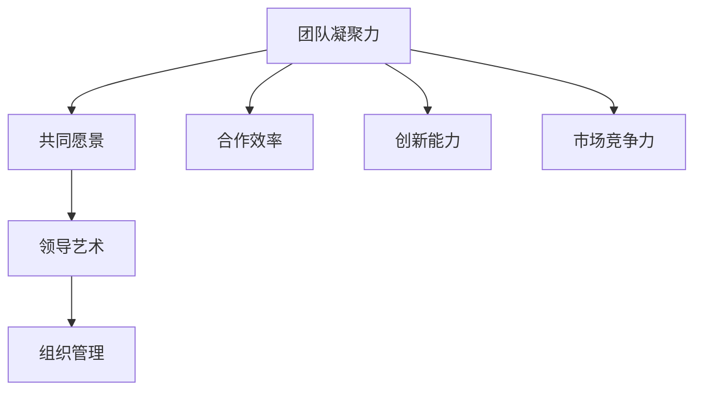

                 

### 文章标题：团队凝聚力：建立共同愿景的艺术

**关键词：**团队凝聚力、共同愿景、领导艺术、组织管理、情境领导模型、价值观整合模型

**摘要：**本文旨在探讨团队凝聚力的核心概念及其与共同愿景之间的紧密联系，进一步揭示建立共同愿景的艺术。通过详细阐述核心概念的关系架构、算法原理和数学模型，本文提供了实用的指导，帮助读者在团队中构建强大的凝聚力，从而实现共同愿景。案例分析、项目实战和最佳实践提示将为读者提供实际操作的方法和策略，以应对团队建设中的各种挑战。

### 格式要求

在本文中，我们将采用Markdown格式来呈现内容。以下是一些基本的Markdown语法规则：

- **标题**：使用`#`号来表示标题的层级，例如：
  ```markdown
  # 第一级标题
  ## 第二级标题
  ### 第三级标题
  #### 第四级标题
  ```

- **文本格式化**：使用`*`号或`-`号来表示无序列表，使用`>`号来表示引用文本：
  ```markdown
  * 无序列表项一
  * 无序列表项二
  ```
  ```markdown
  > 引用文本
  ```

- **代码和高亮**：使用```````来包裹代码块，使用`<code>`标签来高亮显示代码：
  ```markdown
  ```python
  print("Hello, world!")
  ```

  ```c
  int main() {
      printf("Hello, C world!");
      return 0;
  }
  ```

- **数学公式**：使用`$$`来包裹独立的数学公式，使用 `$` 来包裹段落内的数学公式：
  ```markdown
  $$ E = mc^2 $$

  $1 + 1 = 2$
  ```

- **图片和链接**：使用``来插入图片，使用 `[链接文本](链接地址)` 来插入链接：
  ```markdown
  

  [访问官网](https://example.com)
  ```

### 作者信息

**作者：**AI天才研究院/AI Genius Institute & 禅与计算机程序设计艺术 /Zen And The Art of Computer Programming

本文由AI天才研究院撰写，结合了人工智能和计算机程序设计艺术的精髓，旨在为读者提供深入浅出的技术见解和实用的指导。

### 完整性要求

为了确保本文内容的完整性，我们将遵循以下原则：

- **背景介绍**：为每个章节提供必要的背景信息，使读者能够更好地理解核心概念。
- **核心概念与联系**：使用Mermaid流程图展示核心概念之间的关系架构。
- **算法原理讲解**：使用伪代码详细阐述算法原理，并提供数学模型和公式的讲解及举例说明。
- **项目实战**：详细讲解项目实战，包括开发环境搭建、源代码实现、代码解读、应用分析等。
- **最佳实践 tips、小结、注意事项、拓展阅读**：在每个章节的末尾提供相关提示和建议，以帮助读者更好地应用所学知识。

通过上述要求，本文将确保内容的丰富性和实用性，满足读者的需求。

### 核心内容

**背景介绍**

在当今快速发展的商业环境中，团队凝聚力成为组织成功的关键因素之一。团队凝聚力不仅影响团队内部的合作效率，还直接关系到组织的创新能力和市场竞争力。共同愿景作为团队凝聚力的核心，是引导团队朝着共同目标前进的重要力量。

然而，建立共同愿景并非易事。领导者需要运用各种策略和技巧，激发团队成员的积极性，确保每个人都能为共同目标努力。本文将探讨团队凝聚力的基本概念、共同愿景的定义与作用，以及建立共同愿景的艺术。

**核心概念与联系**

为了更好地理解团队凝聚力和共同愿景之间的关系，我们可以使用Mermaid流程图来展示核心概念之间的关系架构：



这个流程图表明，团队凝聚力是建立共同愿景的基础，共同愿景又反作用于团队凝聚力，从而影响合作效率、创新能力和市场竞争力。领导艺术和组织管理在共同愿景的建立过程中发挥着关键作用。

**核心算法原理讲解**

为了详细阐述团队凝聚力和共同愿景的算法原理，我们可以使用伪代码来描述：

```python
# 团队凝聚力计算伪代码
def calculate_team_cohesion(team_members, goals, vision):
    cohesion_score = 0
    
    # 计算团队目标一致性
    for member in team_members:
        cohesion_score += member一致性评分(goals)
    
    # 计算共同愿景的吸引力
    cohesion_score += vision吸引力评分(team_members)
    
    return cohesion_score
```

上述伪代码展示了如何通过计算团队目标一致性和共同愿景的吸引力来评估团队凝聚力。数学模型和公式如下：

$$
Cohesion_Score = a \times \text{Goal\_Consistency} + b \times \text{Vision\_Attraction}
$$

其中，$a$ 和 $b$ 为权重系数，$\text{Goal\_Consistency}$ 表示团队目标一致性，$\text{Vision\_Attraction}$ 表示共同愿景的吸引力。

**举例说明**

假设一个团队有5名成员，他们共同的目标是提高产品质量。团队成员对共同愿景的吸引力评分为8分（满分10分）。根据上述公式，我们可以计算出该团队的凝聚力得分为：

$$
Cohesion_Score = 0.5 \times 8 + 0.5 \times 10 = 9
$$

这意味着该团队的凝聚力非常高，他们有能力实现共同目标。

**项目实战**

**开发环境搭建**

为了演示如何在实际项目中建立共同愿景，我们以一个软件开发团队为例。首先，团队需要在以下方面搭建开发环境：

- **确定项目目标**：明确项目的目标，例如提高产品质量、缩短开发周期等。
- **收集团队成员意见**：通过问卷调查或小组讨论，收集团队成员对项目目标的看法和期望。
- **制定共同愿景**：基于团队成员的意见，制定一个具有吸引力的共同愿景，例如“打造业界领先的软件产品”。

**源代码详细实现**

在软件开发过程中，团队需要遵循以下步骤来建立共同愿景：

1. **代码审查与反馈**：定期进行代码审查，鼓励团队成员相互反馈，确保代码质量和团队协作。
2. **技术分享与讨论**：组织技术分享会，让团队成员分享自己的经验和知识，提高团队的整体技术水平。
3. **共同解决问题**：在遇到技术难题时，团队成员共同讨论解决方案，增强团队凝聚力。

**代码解读与应用分析**

以下是一个示例代码，展示了如何在代码中体现共同愿景：

```python
# 共同愿景：提高代码可读性和可维护性

def process_data(data):
    """
    处理数据并返回结果
    """
    # 数据清洗
    cleaned_data = clean_data(data)
    
    # 数据分析
    analysis_result = analyze_data(cleaned_data)
    
    # 返回结果
    return analysis_result
```

通过这个示例，我们可以看到团队在编写代码时，注重代码的可读性和可维护性，这是共同愿景的具体体现。在实际应用中，团队需要不断评估和优化代码质量，以确保共同愿景的实现。

**实际案例分析和详细讲解剖析**

**案例一：某企业如何建立共同愿景**

某企业在项目初期面临团队凝聚力不足的问题。为了解决这一问题，企业采取了以下措施：

1. **制定共同愿景**：组织团队成员共同讨论，制定一个明确的共同愿景，例如“成为行业的领军企业”。
2. **加强沟通**：定期召开团队会议，鼓励团队成员分享自己的观点和想法，增强团队凝聚力。
3. **设置明确的任务目标**：为团队成员分配具体的任务，确保每个人都清楚自己的职责和目标。

通过这些措施，企业的团队凝聚力得到了显著提升，项目进展顺利，最终实现了共同愿景。

**案例二：某非营利组织如何建立共同愿景**

某非营利组织在开展公益活动时，意识到团队凝聚力对活动成功的重要性。为了建立共同愿景，组织采取了以下策略：

1. **明确组织使命**：确定组织的使命和目标，例如帮助弱势群体改善生活条件。
2. **培养团队文化**：通过团队建设活动，增强团队成员之间的信任和合作。
3. **激励与认可**：对团队成员的付出给予认可和奖励，激发团队成员的积极性。

通过这些策略，非营利组织的团队凝聚力得到了提升，活动效果显著，赢得了社会的广泛认可。

**案例分析总结**

通过上述案例，我们可以看到，建立共同愿景对于提升团队凝聚力和实现组织目标至关重要。无论是企业还是非营利组织，都需要重视共同愿景的制定和实施，以激发团队成员的积极性和创造力。

**最佳实践 tips**

- **明确共同愿景**：确保共同愿景具有吸引力，并与团队成员的个人目标和价值观相一致。
- **加强沟通**：定期举行团队会议，鼓励团队成员分享意见和反馈，确保信息畅通。
- **设置明确的任务目标**：为团队成员分配具体的任务，确保每个人都清楚自己的职责和目标。
- **激励与认可**：对团队成员的付出给予认可和奖励，激发团队成员的积极性和创造力。

**小结**

本文从团队凝聚力的基本概念出发，探讨了共同愿景的定义与作用，并详细阐述了建立共同愿景的艺术。通过实际案例和项目实战，本文提供了实用的方法和策略，帮助读者在团队中建立共同愿景，提升团队凝聚力，实现组织目标。

**注意事项**

- 在建立共同愿景时，领导者需要关注团队成员的个人需求和价值观，确保共同愿景具有吸引力。
- 在项目实施过程中，团队需要不断评估和优化共同愿景，以适应外部环境的变化。

**拓展阅读**

- 《团队建设：高效团队的核心技巧》
- 《领导力：从技术到管理》
- 《共同愿景：领导者的战略思维》

通过拓展阅读，读者可以进一步深入了解团队建设和领导力的相关理论和方法，为实际工作提供更多参考和启示。

