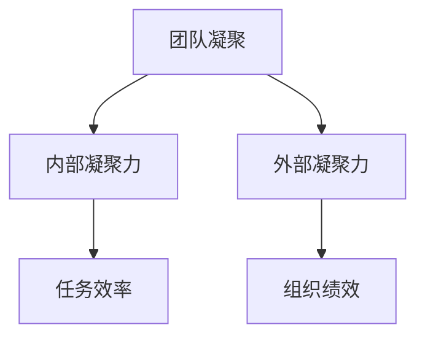
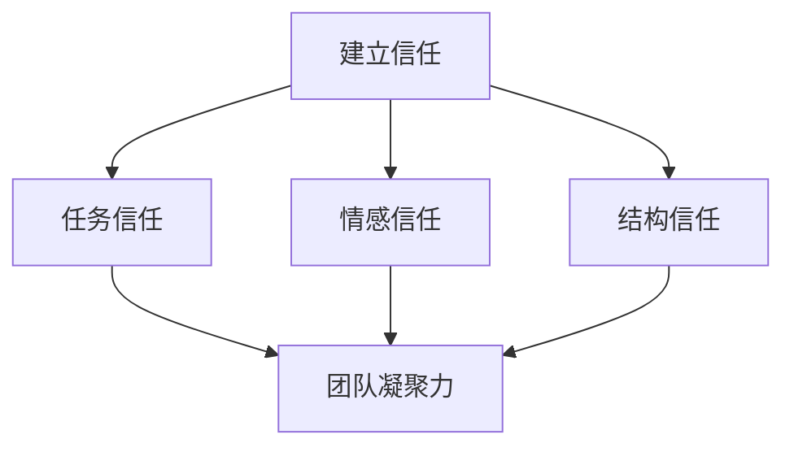
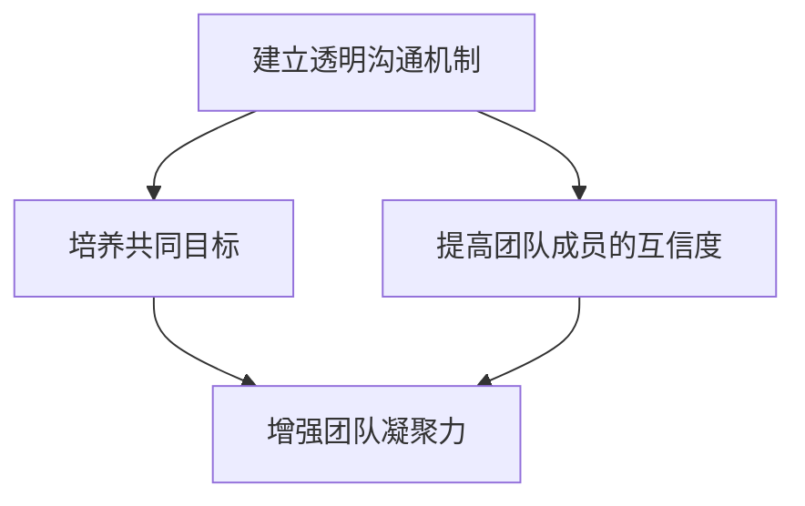

                 

为了撰写一篇符合要求的《团队凝聚：建立信任的关键步骤》的技术博客文章，我们将按照以下步骤进行思考和分析：

### 1. 背景介绍

在当今快速发展的IT行业，团队凝聚力对于组织绩效的影响愈发显著。一个高效的团队不仅能够提高项目完成的效率，还能在复杂的项目环境中保持稳定性和创新性。而建立信任是团队凝聚力的基石。本文将探讨团队凝聚的基础理论，建立信任的原理和关键步骤，以及实践策略和评估改进方法。

### 2. 核心概念与联系

#### 2.1 团队凝聚的定义

团队凝聚是指团队成员之间的相互吸引力和共同目标的感觉，这种力量能够促进团队合作，提高团队效能。

#### 2.2 建立信任的定义

信任是指团队成员对彼此能力和诚意的信任程度，它能够减少沟通障碍，提高决策效率。

#### 2.3 团队凝聚与信任的关系

团队凝聚和信任是相互促进的。信任能够增强团队凝聚力，而强大的凝聚力又能够促进信任的建立。

### 3. 建立信任的关键步骤

#### 3.1 建立透明沟通机制

透明沟通机制是指团队内部信息交流的公开、透明和及时性。

#### 3.2 培养共同目标

共同目标是团队成员共同追求的目标，它能够增强团队凝聚力，提高团队效率。

#### 3.3 提高团队成员的互信度

互信度的提高需要团队成员之间的相互理解、尊重和信任。

### 4. 建立信任的实践策略

#### 4.1 沟通策略

沟通策略包括有效的沟通技巧、沟通障碍的解决方法等。

#### 4.2 目标设定策略

目标设定策略包括目标设定的原则、技巧等。

#### 4.3 提高互信度策略

提高互信度策略包括提高团队成员之间的互信方法和实践。

### 5. 案例分析

通过成功和失败案例的分析，可以更好地理解如何建立信任和团队凝聚力。

### 6. 建立信任的评估与改进

#### 6.1 评估方法

评估方法包括定性和定量的评估方法。

#### 6.2 改进策略

改进策略包括根据评估结果调整团队策略，以提高信任度。

#### 6.3 持续信任建设

持续信任建设包括持续培训和沟通，以保持团队凝聚力和信任。

### 7. 附录

附录部分将提供建立信任的工具和资源，以及常见问题的解答。

通过以上步骤，我们将确保文章内容丰富、逻辑清晰，并且能够提供实用的技术语言和解决方案。现在，我们将开始撰写具体的文章内容。

---

# 文章标题：团队凝聚：建立信任的关键步骤

关键词：团队凝聚力、建立信任、沟通、目标设定、互信度、案例分析

摘要：本文探讨了团队凝聚的基础理论，阐述了建立信任的原理和关键步骤，提供了实践策略和评估改进方法，旨在帮助读者了解并掌握如何建立高效的团队凝聚力。

---

## 第一部分：团队凝聚的基础理论

### 1.1 核心概念与联系

#### 1.1.1 团队凝聚的定义

团队凝聚是指团队成员之间的相互吸引力和共同目标的感觉，这种力量能够促进团队合作，提高团队效能。团队凝聚包括内部凝聚力和外部凝聚力，前者关注团队成员之间的紧密程度，后者关注团队与外部环境的互动。

#### 1.1.2 团队凝聚与组织绩效的关系

团队凝聚对组织绩效有着直接和间接的影响。直接影响体现在团队完成任务的速度和质量上，而间接影响则体现在团队成员的满意度和留存率上。研究表明，高凝聚力的团队往往能够取得更好的绩效。

#### 1.1.3 团队凝聚的 Mermaid 流程图

### 1.2 建立信任的原理

#### 1.2.1 信任的定义

信任是指团队成员对彼此能力和诚意的信任程度，它能够减少沟通障碍，提高决策效率。

#### 1.2.2 信任的类型

信任可以分为任务信任、情感信任和结构信任。任务信任是指团队成员对彼此完成任务的能力的信任；情感信任是指团队成员之间的相互理解和尊重；结构信任是指团队成员对团队结构和规则的信任。

#### 1.2.3 信任与团队凝聚的关系

信任是团队凝聚的基石。信任能够增强团队凝聚力，提高团队效率。高信任度的团队往往能够更好地应对外部挑战，实现组织目标。

#### 1.2.4 建立信任的 Mermaid 流程图

### 1.3 建立信任的关键步骤

#### 1.3.1 建立透明沟通机制

透明沟通机制是指团队内部信息交流的公开、透明和及时性。通过建立透明的沟通机制，团队成员可以更好地了解彼此的工作进展和需求，从而减少误解和冲突。

#### 1.3.2 培养共同目标

共同目标是团队成员共同追求的目标，它能够增强团队凝聚力，提高团队效率。共同目标可以是短期项目目标，也可以是长期发展战略。

#### 1.3.3 提高团队成员的互信度

互信度的提高需要团队成员之间的相互理解、尊重和信任。可以通过定期的团队建设活动、共同完成任务和分享成功经验等方式来提高团队成员的互信度。

#### 1.3.4 建立信任的 Mermaid 流程图

---

在接下来的部分中，我们将详细探讨建立信任的实践策略，通过沟通、目标设定和互信度提高等方面的具体措施，帮助读者理解和应用这些策略。

