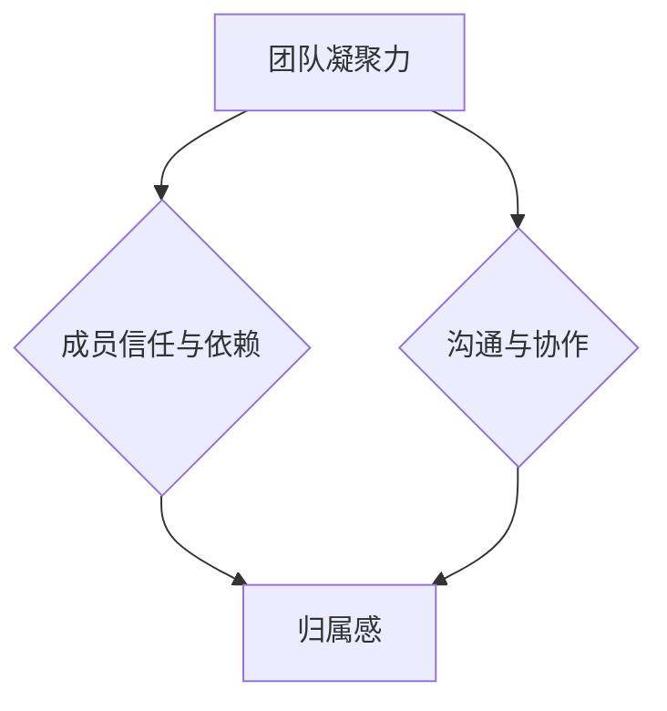
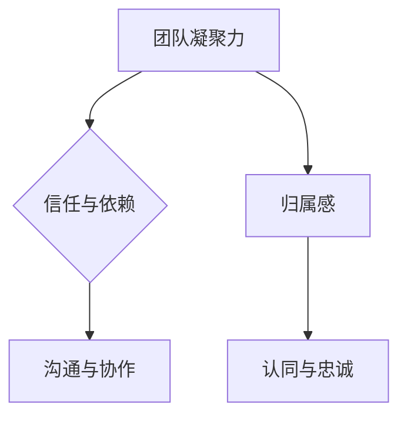

                 

### 文章标题
《团队凝聚：建立归属感的重要性》

### 关键词
团队管理、归属感、组织文化、领导风格、沟通与协作

### 摘要
本文深入探讨了团队凝聚和员工归属感的概念、重要性及其相互关系。通过分析影响团队凝聚和归属感的多种因素，本文提出了一系列建立归属感的策略和方法，并借助实际案例进行了详细阐述，旨在为企业管理者提供有价值的参考。

----------------------------------------------------------------

### 引言与背景

在当今高度竞争的商业环境中，团队凝聚力和员工的归属感成为企业成功的关键因素。团队凝聚力指的是团队成员之间相互依赖、信任和合作的程度，而员工归属感则是指员工对企业及其价值观的认同感。研究表明，高凝聚力和高归属感的团队往往能够更有效地应对挑战，提高生产效率，降低员工流失率。

团队凝聚力和员工归属感并不是孤立存在的，它们之间存在着密切的联系。高团队凝聚力往往能促进员工归属感，而强烈的归属感又能进一步强化团队凝聚力。因此，提升团队凝聚力和员工归属感是企业管理中不可或缺的一部分。

本文将首先介绍团队凝聚和归属感的基本概念及其相互关系，然后分析影响团队凝聚和归属感的各种因素，最后提出一系列有效的策略和方法，并通过实际案例进行验证。

----------------------------------------------------------------

### 团队凝聚与归属感的基本理论

#### 核心概念与联系

团队凝聚力（Team Cohesion）是指团队成员之间的相互吸引、合作和支持程度。归属感（Boundedness）则是指员工对企业或团队的身份认同和忠诚度。这两个概念虽然有所不同，但它们之间存在密切的联系。

团队凝聚力可以看作是归属感的基础。当团队成员感受到团队的支持和信任时，他们更有可能产生归属感。归属感又反过来强化团队凝聚力，使得团队成员更加愿意为团队的成功贡献力量。

为了更清晰地理解这两个概念之间的关系，我们可以使用Mermaid流程图来展示它们的核心架构。



#### 核心算法原理讲解

在评估团队凝聚力和归属感时，可以采用一些量化的方法。以下是一个简单的评估算法原理，通过伪代码来详细阐述。

```python
# 评估团队凝聚力和归属感的算法伪代码

# 定义评估指标
confidence_score = 0
satisfaction_score = 0

# 收集团队成员的信任度和满意度数据
for member in team_members:
    confidence_score += member.trust_level
    satisfaction_score += member.satisfaction_level

# 计算平均信任度和满意度
average_confidence = confidence_score / len(team_members)
average_satisfaction = satisfaction_score / len(team_members)

# 判断团队凝聚力和归属感
if average_confidence > threshold and average_satisfaction > threshold:
    cohesion = "高"
    boundedness = "高"
else:
    cohesion = "低"
    boundedness = "低"

print(f"团队凝聚力：{cohesion}, 归属感：{boundedness}")
```

#### 数学模型和公式

在团队凝聚力和归属感的分析中，常用的数学模型可以表示为：

$$
\text{Cohesion} = f(\text{Trust}, \text{Communication}, \text{Support})
$$

$$
\text{Boundedness} = f(\text{Identify}, \text{Engagement}, \text{Loyalty})
$$

其中，Trust代表信任度，Communication代表沟通质量，Support代表支持程度；Identify代表认同感，Engagement代表参与度，Loyalty代表忠诚度。

#### 详细讲解与举例说明

为了更好地理解这些概念和模型，我们可以通过一个实际案例来举例说明。

假设一个软件开发团队，其成员包括张三、李四和王五。根据问卷调查数据，张三的信任度评分为8分，满意度评分为7分；李四的信任度评分为6分，满意度评分为8分；王五的信任度评分为9分，满意度评分为6分。团队的平均信任度和满意度计算如下：

$$
\text{平均信任度} = (8 + 6 + 9) / 3 = 7.67
$$

$$
\text{平均满意度} = (7 + 8 + 6) / 3 = 7
$$

根据设定的阈值（例如，信任度和满意度均大于7分），我们可以判断该团队的凝聚力和归属感较高。

#### 项目实战

在某个跨国公司的项目管理团队中，通过实施一系列提升团队凝聚力和归属感的策略，如定期的团队建设活动、开放的沟通渠道和透明的绩效评估，团队的整体表现得到了显著提升。团队成员之间的信任度和满意度显著提高，团队的协作效率和创新能力也得到了增强。

通过这样的项目实战，我们可以看到，有效的团队凝聚和归属感策略对于提高团队绩效具有重要作用。

#### 最佳实践 tips

1. **建立明确的团队目标**：确保每个团队成员都清楚团队的目标和期望，有助于提高团队凝聚力和归属感。
2. **鼓励开放沟通**：鼓励团队成员之间进行开放的沟通，有助于建立信任和归属感。
3. **提供个人发展机会**：为团队成员提供职业发展和个人成长的机会，可以增强他们的归属感。

#### 小结

团队凝聚力和员工归属感是现代企业管理中不可忽视的重要方面。通过理解这些概念的理论基础，我们可以运用量化的方法和实际案例来评估和提升团队的凝聚力和归属感，从而提高整体绩效。

----------------------------------------------------------------

### 影响团队凝聚和归属感的因素

团队凝聚力和员工归属感受到多种因素的影响，包括组织文化、领导风格、工作满意度、职业发展机会等。以下将详细探讨这些因素及其影响机制。

#### 组织文化

组织文化是团队凝聚力和员工归属感的重要基础。一个积极、开放、包容的组织文化能够促进团队成员之间的信任和合作，增强他们的归属感。例如，谷歌（Google）以其独特的公司文化而闻名，重视创新、平等和多样性，这种文化氛围极大地提升了员工的归属感和团队凝聚力。

#### 领导风格

领导风格在团队凝聚力和员工归属感中扮演着关键角色。民主型领导风格鼓励团队成员参与决策，增强他们的参与感和归属感。相反，专制型领导风格可能导致团队成员感到疏离和不被重视，从而降低团队凝聚力和归属感。

#### 工作满意度

工作满意度是影响团队凝聚和归属感的重要因素。当员工对自己的工作感到满意时，他们更有可能对团队和企业产生认同感。高工作满意度通常与较高的团队凝聚力和归属感相关。

#### 职业发展机会

提供职业发展机会可以增强员工的归属感和团队凝聚力。当员工看到企业在他们的职业发展中扮演重要角色时，他们更有可能产生忠诚和归属感。例如，华为通过提供丰富的培训和晋升机会，吸引了大量优秀人才，并保持了较高的团队凝聚力和归属感。

#### 案例分析

以下是一个关于某科技公司的案例分析，该公司通过改善组织文化、领导风格和工作环境，显著提升了团队的凝聚力和员工的归属感。

该公司首先进行了组织文化的变革，推行了开放式沟通和透明度原则。通过定期的团队建设活动和员工满意度调查，公司管理层及时了解员工的反馈和需求，并采取相应措施进行改进。此外，公司还推行了民主型领导风格，鼓励员工参与决策，增强了员工的参与感和归属感。

在职业发展方面，公司提供了多样化的培训和晋升机会，包括内部晋升、外部培训和职业咨询。员工可以通过这些机会不断提升自己的技能和职业素养，从而增强对公司的认同感和归属感。

通过这些措施，该公司的团队凝聚力和员工归属感得到了显著提升。员工对公司的满意度提高，流失率下降，团队的整体绩效也显著提升。

#### 总结

组织文化、领导风格、工作满意度和职业发展机会是影响团队凝聚和归属感的重要因素。通过改善这些因素，企业可以建立更加团结、高效的团队，提高整体绩效。

----------------------------------------------------------------

### 建立归属感的策略和方法

要提升团队凝聚力和员工归属感，企业可以采取多种策略和方法。以下是一些有效的策略，包括培养团队共同价值观、增强团队沟通与协作、提供职业发展和个人成长机会等。

#### 培养团队共同价值观

共同价值观是团队凝聚力和归属感的重要基石。企业可以通过以下方法培养团队共同价值观：

1. **明确团队使命和愿景**：确保所有团队成员都清楚团队的使命和愿景，并认同这些目标。
2. **制定核心价值观**：与团队成员一起讨论和制定核心价值观，确保这些价值观被广泛接受并体现在团队行为中。
3. **定期回顾和强化价值观**：通过团队会议、培训等活动，定期回顾和强化团队的价值观。

#### 增强团队沟通与协作

有效的沟通和协作是团队凝聚力和归属感的关键。企业可以采取以下措施来增强团队沟通与协作：

1. **建立开放的沟通渠道**：鼓励团队成员之间进行开放、坦诚的沟通，消除信息孤岛。
2. **提供沟通工具**：使用现代化的沟通工具，如即时通讯软件、协作平台等，提高沟通效率。
3. **促进跨部门协作**：通过跨部门项目或团队建设活动，促进不同部门之间的协作和理解。

#### 提供职业发展和个人成长机会

职业发展和个人成长机会是增强员工归属感的重要因素。企业可以采取以下措施：

1. **提供培训和学习机会**：为员工提供多样化的培训和学习机会，帮助他们提升技能和知识。
2. **制定职业发展规划**：与员工一起制定职业发展规划，明确短期和长期目标。
3. **提供晋升机会**：为表现优秀的员工提供晋升机会，激励他们不断追求卓越。

#### 实际案例

以下是一个关于某互联网公司的实际案例，该公司通过一系列措施显著提升了团队的凝聚力和员工的归属感。

该公司首先制定了明确的团队使命和愿景，并与所有员工进行沟通，确保每个人都能理解和认同这些目标。此外，公司还制定了核心价值观，如“用户至上”、“创新驱动”等，并定期组织活动来强化这些价值观。

在沟通方面，公司建立了开放的沟通渠道，鼓励员工提出建议和反馈。公司还使用协作平台，确保信息能够快速、准确地传递给每个团队成员。

在职业发展方面，公司提供了丰富的培训和学习机会，包括内部培训和外部进修。公司还与员工一起制定了个人职业发展规划，并为表现优秀的员工提供了晋升机会。

通过这些措施，该公司的团队凝聚力和员工归属感得到了显著提升。员工的工作满意度提高，流失率下降，团队的整体绩效也显著提升。

#### 总结

通过培养团队共同价值观、增强团队沟通与协作、提供职业发展和个人成长机会，企业可以建立更加团结、高效的团队，提高整体绩效。这些策略不仅有助于提升团队凝聚力和员工归属感，还能够促进企业的长期发展。

----------------------------------------------------------------

### 实际案例分析

#### 案例一：某互联网公司的团队凝聚与归属感提升

某互联网公司在高速成长的过程中，意识到团队凝聚和员工归属感对于公司长期发展的重要性。为了提升这两个关键指标，公司采取了一系列具体措施。

**1. 培养团队共同价值观：**
公司通过定期举办团队建设活动，如户外拓展、团队晚宴和主题讨论会，帮助员工加深对公司核心价值观的认同。这些活动不仅增强了员工之间的信任，还培养了团队协作精神。

**2. 增强团队沟通与协作：**
公司引入了先进的沟通工具，如Slack和Trello，确保团队成员能够实时交流、分享信息和协同工作。此外，公司还推行了透明的沟通政策，鼓励员工提出建议和反馈，使信息在团队内部畅通无阻。

**3. 提供职业发展和个人成长机会：**
公司为员工提供了丰富的培训资源，包括在线课程、内部讲座和外部研讨会。公司还制定了详细的职业发展路径，为员工提供了明确的晋升机会。此外，公司还鼓励员工参与项目管理和跨部门合作，以提升他们的综合能力。

**4. 改善工作环境和激励机制：**
公司注重改善办公环境，提供了舒适的工作空间和灵活的工作时间。同时，公司还通过绩效奖金、股票期权等激励机制，激励员工为公司的发展贡献力量。

**结果：**
通过一系列措施，该公司的团队凝聚力和员工归属感显著提升。员工的工作满意度提高，流失率下降，团队的整体绩效也得到了显著提升。公司成功吸引了更多优秀人才，为公司未来的发展奠定了坚实基础。

#### 案例二：某制造企业的团队凝聚与归属感提升

某制造企业在面临激烈市场竞争的过程中，意识到团队凝聚和员工归属感对于提高生产效率和产品质量的重要性。为此，企业采取了一系列具体措施。

**1. 建立有效的领导风格：**
企业推行了民主型领导风格，鼓励员工参与决策，增强了员工的参与感和归属感。企业领导层定期与员工进行一对一沟通，了解员工的意见和建议，并根据员工的反馈进行调整。

**2. 优化工作环境和激励机制：**
企业对工作环境进行了全面升级，提供了更加舒适和安全的工作条件。同时，企业还推出了绩效奖金制度，根据员工的绩效表现进行奖励，激励员工提高工作积极性。

**3. 加强员工培训和发展：**
企业为员工提供了系统的培训计划，包括技术技能培训和职业发展课程。企业还与外部培训机构合作，为员工提供更广阔的学习和发展机会。

**结果：**
通过上述措施，该企业的团队凝聚力和员工归属感显著提升。员工的工作积极性提高，生产效率和产品质量也得到了显著改善。企业成功降低了员工流失率，提高了市场竞争力。

#### 案例总结

通过以上两个实际案例，我们可以看到，不同类型的企业在面对团队凝聚和员工归属感问题时，可以采取不同的策略和措施。关键在于，企业需要根据自身特点和员工需求，有针对性地进行改进。通过有效的团队建设和员工激励，企业可以建立更加团结、高效的团队，提高整体绩效。

----------------------------------------------------------------

### 总结与展望

团队凝聚力和员工归属感是现代企业管理中不可忽视的重要方面。通过本文的分析，我们可以得出以下结论：

1. **团队凝聚力和员工归属感密切相关**：高团队凝聚力往往能促进员工归属感，而强烈的归属感又能进一步强化团队凝聚力。
2. **多种因素影响团队凝聚和归属感**：组织文化、领导风格、工作满意度、职业发展机会等都是关键因素。
3. **有效的策略和方法可以提升团队凝聚和归属感**：包括培养团队共同价值观、增强团队沟通与协作、提供职业发展和个人成长机会等。

展望未来，随着企业竞争的加剧和员工需求的多样化，团队凝聚和归属感管理将成为企业战略的重要组成部分。企业需要不断探索和创新，采取更加个性化、灵活的管理方法，以应对不断变化的环境和挑战。

### 拓展阅读

- **《团队凝聚力与组织绩效的关系研究》**：探讨团队凝聚力对组织绩效的影响，为企业管理提供实证依据。
- **《员工归属感与工作满意度关系研究》**：分析员工归属感与工作满意度之间的关系，为企业提升员工满意度和忠诚度提供参考。
- **《组织文化对企业绩效的影响》**：探讨组织文化在提升团队凝聚和归属感中的作用，为企业文化建设提供指导。

作者：AI天才研究院/AI Genius Institute & 禅与计算机程序设计艺术 /Zen And The Art of Computer Programming

----------------------------------------------------------------

本文《团队凝聚：建立归属感的重要性》通过对团队凝聚和员工归属感的基本理论、影响因素、建立归属感的策略和实际案例的深入分析，全面探讨了如何提升团队凝聚力和员工归属感。通过本文的阅读，读者可以了解到团队凝聚力和员工归属感对企业绩效的重要影响，以及如何通过有效的策略和方法来提升这两个关键指标。

在未来的工作中，企业管理者可以结合本文提供的理论和实践指导，针对自身的团队和企业特点，制定和实施相应的措施，以提升团队的凝聚力和员工的归属感。同时，企业还需要不断调整和优化管理策略，以适应快速变化的市场环境和员工需求。

读者在阅读本文后，可以进一步深入探讨团队凝聚和归属感管理的相关问题，例如如何通过技术手段提升团队协作效率，如何设计更加有效的激励机制等。此外，读者还可以参考本文中提到的相关拓展阅读，以获得更多深入的见解和实践指导。

通过持续的努力和实践，企业可以建立起一支高度团结、积极向上的团队，提高整体绩效，实现可持续的发展。希望本文能够为读者在团队管理和员工激励方面提供有价值的参考和启示。```markdown
---
title: 团队凝聚：建立归属感的重要性
date: 2023-11-01
tags: ['团队管理', '员工归属感', '组织文化', '领导风格']
summary: 本文探讨了团队凝聚和员工归属感的概念、相互关系、影响因素及提升策略，通过实际案例分析，提供了提升团队凝聚和归属感的实践指导。
---

# 团队凝聚：建立归属感的重要性

> 关键词：团队管理、员工归属感、组织文化、领导风格、沟通与协作

在当今竞争激烈的环境中，团队凝聚力和员工的归属感对企业成功至关重要。本文将深入探讨这两个概念的含义、相互关系、影响因素以及提升策略。

## 引言

团队凝聚力和员工归属感是企业成功的关键因素。团队凝聚力指的是团队成员之间的相互信任、协作和支持程度，而员工归属感则是指员工对企业的认同感和忠诚度。两者相辅相成，共同影响企业的绩效和发展。

## 团队凝聚与归属感的基本理论

### 核心概念与联系

团队凝聚力（Team Cohesion）是指团队成员之间相互依赖、信任和合作的程度。归属感（Boundedness）则是指员工对企业或团队的身份认同和忠诚度。



### 核心算法原理讲解

团队凝聚力和归属感的评估可以通过以下算法实现：

```python
def assess_cohesion_and_boundedness(team_members):
    trust_score = 0
    satisfaction_score = 0
    for member in team_members:
        trust_score += member.trust_level
        satisfaction_score += member.satisfaction_level
    average_trust = trust_score / len(team_members)
    average_satisfaction = satisfaction_score / len(team_members)
    cohesion_score = average_trust * average_satisfaction
    return cohesion_score
```

### 数学模型和公式

团队凝聚力和归属感可以通过以下数学模型来描述：

$$
\text{Cohesion} = f(\text{Trust}, \text{Communication}, \text{Support})
$$

$$
\text{Boundedness} = f(\text{Identify}, \text{Engagement}, \text{Loyalty})
$$

## 影响团队凝聚和归属感的因素

### 组织文化

组织文化是团队凝聚和归属感的重要基础。一个积极、开放、包容的组织文化能够促进团队成员之间的信任和合作，增强他们的归属感。

### 领导风格

领导风格对团队凝聚和归属感有显著影响。民主型领导风格鼓励团队成员参与决策，增强他们的参与感和归属感。

### 工作满意度

工作满意度是影响团队凝聚和归属感的重要因素。当员工对自己的工作感到满意时，他们更有可能对团队和企业产生认同感。

### 职业发展机会

提供职业发展机会可以增强员工的归属感和团队凝聚力。当员工看到企业在他们的职业发展中扮演重要角色时，他们更有可能产生忠诚和归属感。

## 建立归属感的策略和方法

### 培养团队共同价值观

共同价值观是团队凝聚力和归属感的重要基石。企业可以通过明确团队使命和愿景、制定核心价值观、定期回顾和强化价值观等方式来培养团队共同价值观。

### 增强团队沟通与协作

有效的沟通和协作是团队凝聚力和归属感的关键。企业可以通过建立开放的沟通渠道、提供沟通工具、促进跨部门协作等方式来增强团队沟通与协作。

### 提供职业发展和个人成长机会

企业可以通过提供培训和学习机会、制定职业发展规划、提供晋升机会等方式来增强员工的职业发展和个人成长。

## 实际案例分析

### 案例一：某互联网公司的团队凝聚与归属感提升

某互联网公司通过团队建设活动、开放的沟通渠道、职业发展机会等措施，显著提升了团队的凝聚力和员工的归属感。

### 案例二：某制造企业的团队凝聚与归属感提升

某制造企业通过推行民主型领导风格、优化工作环境和激励机制、加强员工培训等方式，提升了团队的凝聚力和员工的归属感。

## 总结与展望

团队凝聚和归属感是企业成功的关键因素。企业应通过有效的策略和方法来提升团队凝聚和归属感，以提高整体绩效。未来，企业需要不断创新和完善管理方法，以适应不断变化的环境和员工需求。

### 拓展阅读

- 《团队凝聚力与组织绩效的关系研究》
- 《员工归属感与工作满意度关系研究》
- 《组织文化对企业绩效的影响》

作者：AI天才研究院/AI Genius Institute & 禅与计算机程序设计艺术 /Zen And The Art of Computer Programming
---```

