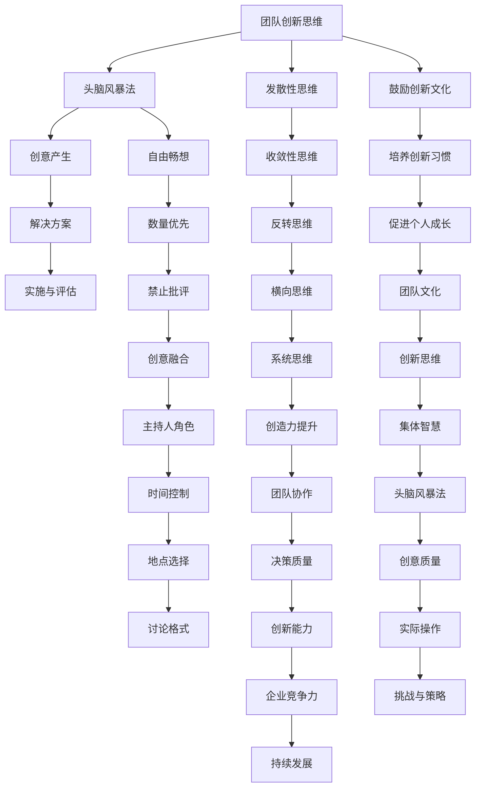

                 

## 文章标题：团队创新思维：激发集体智慧的头脑风暴法

### 关键词：团队创新思维、头脑风暴法、集体智慧、创意激发、团队协作

> 摘要：本文旨在深入探讨团队创新思维的重要性以及如何通过头脑风暴法这一有效工具激发集体智慧，推动团队创造力和创新能力的提升。文章首先概述了团队创新思维的定义和类型，随后详细讲解了头脑风暴法的基础原理、实施步骤和应用场景，并通过具体案例剖析了头脑风暴法的实际操作和效果。最后，文章总结了头脑风暴法的挑战与解决策略，提出了持续培养团队创新思维的实践建议。

### 引言

在当今快速变化、竞争激烈的商业环境中，创新已经成为企业持续发展和成功的关键。创新不仅包括技术和产品的创新，还涉及管理理念、商业模式、运营流程等多方面的创新。而团队创新思维，作为一种重要的创新手段，能够有效激发集体智慧，提高团队的创造力和解决问题的能力。头脑风暴法，作为团队创新思维的一种重要工具，具有简单易行、效果显著的特点，广泛应用于各类创新活动中。

本文将从以下几个方面展开讨论：

1. **团队创新思维概述**：介绍团队创新思维的重要性，定义和类型。
2. **头脑风暴法基础**：讲解头脑风暴法的起源、原理和核心要素。
3. **实施头脑风暴法的步骤**：详细描述头脑风暴法的准备、执行和收尾阶段。
4. **头脑风暴法在不同场景中的应用**：探讨头脑风暴法在创意策划、产品开发和决策制定中的应用。
5. **头脑风暴法的挑战与解决策略**：分析头脑风暴法面临的挑战及解决策略。
6. **成功案例分析与启示**：通过实际案例展示头脑风暴法的应用效果。
7. **团队创新思维的持续发展**：讨论团队文化、习惯和个人成长在创新思维培养中的作用。

通过本文的探讨，读者将能够全面了解团队创新思维和头脑风暴法的本质，掌握其实施和应用技巧，从而在实际工作中有效地激发团队的创新潜能。

### 团队创新思维的重要性

团队创新思维在当今的企业和组织中扮演着至关重要的角色。随着全球化和数字化进程的加速，市场环境的变化速度日益加快，企业必须具备迅速响应变化、持续创新的能力，才能在激烈的市场竞争中立于不败之地。团队创新思维正是这种能力的重要组成部分，它能够帮助团队在面对复杂问题时，通过集体的智慧和创造力，找到创新的解决方案。

首先，团队创新思维能够显著提升团队的竞争力。在一个创新思维活跃的团队中，成员们能够不断地提出新的想法和改进方案，从而推动产品和服务不断升级，满足市场的需求。通过团队创新思维，企业可以快速捕捉市场趋势，开发出符合消费者期望的新产品，从而在竞争中占据有利位置。

其次，团队创新思维有助于激发员工的潜能。在一个鼓励创新和创造力的工作环境中，员工更容易产生积极的工作态度，提高工作效率和创造力。团队成员之间的互动和协作，不仅能够促进知识共享和技能互补，还能够激发个人潜力和创造力，从而实现个人和团队的共同成长。

此外，团队创新思维还能够促进组织的持续发展。创新不仅仅是短期的行为，它需要成为组织文化和日常运作的一部分。通过团队创新思维，企业可以建立一种持续创新的文化氛围，鼓励员工持续思考、探索和改进，从而确保组织在长期发展中始终保持竞争力和活力。

总之，团队创新思维是企业实现持续创新和发展的关键。它不仅能够提升团队的竞争力，激发员工的潜能，还能够促进组织的整体发展。因此，企业和组织应当高度重视团队创新思维的培养，通过多种手段和策略，激发和提升团队的创新能力和创造力。

### 团队创新思维的定义与类型

团队创新思维是指团队成员通过主动思考和创造性解决问题的方法，共同应对各种挑战和机遇。它是一种集体智慧，通过团队成员之间的互动和协作，产生出新的想法和解决方案。团队创新思维不仅仅是单个成员的创新行为，而是整个团队共同参与、共同创造的过程。这种思维模式强调集体智慧和协作精神，通过集体的力量实现更大的创新成果。

团队创新思维可以细分为多种类型，每种类型都有其独特的特点和应用场景：

1. **发散性思维**：又称辐射性思维，是指从一个中心点出发，向多个方向探索和扩展的想法。发散性思维强调自由、开放的心态，鼓励团队成员大胆提出各种可能的解决方案。这种思维模式适合在创意生成阶段使用，能够迅速产生大量的创意和想法。

2. **收敛性思维**：又称集中性思维，是指将各种想法和方案进行筛选、综合和优化的过程。收敛性思维强调逻辑和系统的分析能力，通过比较、分析和评估，找出最佳的解决方案。这种思维模式适合在决策制定和问题解决阶段使用，能够确保团队集中精力和资源，找到最有效的解决方案。

3. **反转思维**：是指从不同的角度和立场，对现有问题进行重新审视和思考。反转思维鼓励团队成员敢于质疑和挑战现有的假设和观点，通过颠覆性的思考找到创新的解决方案。这种思维模式在应对复杂问题和打破思维定势时特别有效。

4. **横向思维**：是指跨越不同领域和学科，将不同的知识和观点进行整合和融合。横向思维强调跨领域的创新，通过整合不同的元素，产生全新的创意和解决方案。这种思维模式适合在技术创新和跨领域合作时使用。

5. **系统思维**：是指从整体和系统的角度看待问题，通过分析系统内部的相互关系和作用机制，找到问题的根本原因和解决方案。系统思维强调整体性和协同效应，能够帮助团队更好地理解和解决复杂问题。

这些创新思维类型的灵活运用，可以有效地激发团队的创造力和创新能力，推动团队在各个阶段实现创新目标。

### 团队创新思维与头脑风暴法的联系

团队创新思维和头脑风暴法是相辅相成的概念，头脑风暴法作为实现团队创新思维的一种重要工具，具有显著的成效。首先，头脑风暴法能够迅速激发团队成员的创造力，使他们在短时间内提出大量新颖的创意和想法。这种自由、开放的思维环境，有助于打破传统的思维定势，鼓励团队成员大胆思考，勇于创新。

其次，头脑风暴法强调集体智慧和协作，通过团队成员之间的互动和交流，实现思维碰撞和知识共享。团队成员在头脑风暴过程中，不仅能够从他人的观点中获得新的灵感，还能够通过协作和讨论，对创意进行深入分析和优化，从而提高创意的质量和可行性。

头脑风暴法的成效主要体现在以下几个方面：

1. **激发创意**：头脑风暴法通过鼓励成员自由表达，快速生成大量创意，使团队在短时间内获得丰富的创意资源。这些创意不仅可以用于产品开发、市场营销等领域，还能够为团队解决日常问题提供创新的解决方案。

2. **提高决策质量**：在头脑风暴过程中，团队成员能够从多个角度审视问题，提出多种解决方案，并通过讨论和评估，筛选出最佳方案。这种全面的思考和综合的分析，有助于提高团队决策的质量和效率。

3. **增强团队协作**：头脑风暴法促进了团队成员之间的沟通和协作，使他们在共同的目标下，共同努力，共同成长。通过头脑风暴，团队成员能够更好地理解彼此的思考方式和观点，建立信任和默契，提高团队的凝聚力和协作能力。

4. **提升创新能力**：长期运用头脑风暴法，能够培养团队成员的创新思维和能力，使他们在面对各种挑战时，能够迅速产生创新的解决方案。这种能力的提升，有助于团队在激烈的市场竞争中，保持持续的创新动力和竞争优势。

综上所述，头脑风暴法作为团队创新思维的重要工具，不仅能够激发团队的创造力，提高决策质量，增强团队协作，还能够提升团队的创新能力，为团队的持续发展奠定坚实的基础。

### 头脑风暴法的基础原理

头脑风暴法，作为一种广泛应用的创新工具，其基础原理和核心要素是成功实施这一方法的关键。首先，头脑风暴法的起源可以追溯到20世纪30年代，由美国广告人亚历克斯·奥斯本（Alex Osborn）提出。奥斯本发现，通过鼓励团队成员自由地提出各种想法，可以显著提高创新效率和创意质量。基于这一发现，他系统地总结出了一系列实施头脑风暴法的原则和技巧。

**1. 基础原理**

头脑风暴法的基本原理可以归纳为以下几点：

- **自由畅想**：鼓励团队成员无拘无束地提出各种想法，无论这些想法看起来是否合理或可行。这种开放性的氛围能够激发团队成员的创造力，使更多的创意得以诞生。

- **数量优先**：在头脑风暴的过程中，奥斯本提出“数量优先”的原则，即鼓励团队成员提出更多的想法。因为大量的想法可以增加创意碰撞的机会，从而提高最终解决方案的创新性和可行性。

- **禁止批评**：在头脑风暴的过程中，禁止成员对其他人的想法进行批评或评价。这种保护性的环境能够减少成员的心理压力，使他们更敢于提出自己的想法，从而激发更多的创意。

- **创意融合**：鼓励团队成员在头脑风暴过程中，将不同的想法进行整合和融合。通过创意融合，可以产生新的创意和改进方案，进一步提高创新质量。

**2. 核心要素**

头脑风暴法的核心要素包括以下几个方面：

- **主持人的角色**：头脑风暴的主持人是整个活动的关键。主持人需要具备良好的沟通能力和组织能力，能够引导团队成员积极参与，确保头脑风暴过程顺利进行。

- **时间控制**：在头脑风暴过程中，时间控制非常关键。通常，头脑风暴会设定一个特定的时间段，以确保团队成员能够在有限的时间内充分表达自己的想法。

- **地点选择**：选择一个适宜的地点进行头脑风暴也很重要。一个安静、舒适的环境能够提高团队成员的专注度，有助于创意的产生。

- **讨论格式**：头脑风暴的讨论格式通常包括自由发言和轮流发言两种。自由发言鼓励团队成员随时提出自己的想法，而轮流发言则要求每个成员在一定时间内依次发言，确保每个人都有机会表达观点。

**3. 实施步骤**

尽管头脑风暴法的具体实施步骤可能因情境而异，但以下是一个典型的头脑风暴法实施流程：

- **准备阶段**：确定头脑风暴的主题、目标和参与人员，并提前通知成员做好准备。

- **开场引导**：主持人简要介绍头脑风暴的目的和规则，激发团队成员的思考。

- **自由发言**：团队成员依次发言，提出各种创意和想法，主持人记录下所有的想法。

- **创意融合**：在自由发言结束后，主持人引导团队成员对记录下的想法进行讨论和融合，找出最佳解决方案。

- **总结和评估**：主持人对头脑风暴的结果进行总结，评估创意的可行性和创新性，并确定下一步的行动计划。

通过以上步骤，头脑风暴法能够有效地激发团队成员的创造力，促进团队协作，实现创新目标。

### 头脑风暴法的实施步骤

成功实施头脑风暴法的关键在于其精细化的步骤设计。以下是头脑风暴法从准备到收尾的详细实施步骤：

#### 准备阶段

**1. 确定目标和主题**：
   - 明确头脑风暴的目标，确保所有参与成员都了解讨论的核心问题或挑战。
   - 选择一个具有实际操作性的主题，以便团队成员能够围绕该主题展开讨论。

**2. 邀请参与者**：
   - 确定参与头脑风暴的人员，确保团队成员的多样性，包括不同背景、技能和经验的人，这样可以带来更多元化的视角和想法。
   - 提前通知参与者，并提供相关背景资料，以便他们能够提前做准备。

**3. 确定时间和地点**：
   - 选择一个安静、舒适的环境，确保团队成员能够集中精力进行讨论。
   - 安排一个合适的时间段，避免其他干扰，确保参与者能够全程参与。

#### 执行阶段

**4. 开场引导**：
   - 由主持人简要介绍头脑风暴的目标、规则和流程，确保所有参与者都明确了解如何进行。
   - 强调自由畅想和数量优先的原则，鼓励团队成员大胆提出各种想法。

**5. 自由发言**：
   - 成员们依次发言，提出自己的创意和想法。主持人应确保每个人都有机会发言，避免打断或批评他人的想法。
   - 所有提出的想法都会被记录下来，无论其是否成熟或可行。

**6. 记录创意**：
   - 主持人或指定记录员应详细记录所有创意，确保不遗漏任何有价值的信息。
   - 使用电子设备或白板等工具，实时记录和展示创意，方便团队成员查看和讨论。

#### 收尾阶段

**7. 创意融合**：
   - 在所有想法提出完毕后，主持人引导团队成员对这些创意进行讨论和整合。
   - 鼓励团队成员提出如何将不同想法进行结合，创造出新的解决方案或改进方案。

**8. 评估和筛选**：
   - 对记录下的创意进行评估和筛选，确定哪些创意最符合目标要求，最具创新性和可行性。
   - 可以采用投票、评分等方式，让团队成员共同参与决策过程。

**9. 总结和反馈**：
   - 由主持人对头脑风暴的结果进行总结，明确下一步的行动计划。
   - 鼓励团队成员提供反馈，分享他们的感受和体验，以便未来改进头脑风暴的实施效果。

通过上述步骤，头脑风暴法能够确保创意的充分表达和有效整合，从而实现团队的创新目标。

### 头脑风暴法在不同场景中的应用

头脑风暴法作为一种高效的创意生成工具，可以在多种不同的场景中发挥重要作用。以下我们将探讨头脑风暴法在创意策划、产品开发和决策制定中的应用，并举例说明其实际操作过程和效果。

#### 创意策划中的应用

在创意策划阶段，头脑风暴法能够迅速激发团队成员的创造力，生成大量的创意和灵感。以下是头脑风暴法在创意策划中的应用实例：

**案例：新产品推广活动策划**

某公司计划推出一款新产品，需要进行推广活动策划。公司召集了市场部、销售部和创意部的团队成员，开展一次头脑风暴。

- **准备阶段**：确定主题为“新产品推广活动创意”，邀请相关团队成员参加，并提供相关背景资料。
- **执行阶段**：主持人引导团队成员围绕推广活动的主题，自由发言。团队成员提出各种创意，如线上直播推广、社交媒体互动、线下体验活动等。
- **收尾阶段**：主持人将提出的创意记录下来，并进行分类和筛选。团队成员对这些创意进行评估，最终确定了一种结合线上和线下互动的活动方案。

通过头脑风暴法，团队迅速生成了多个有价值的创意，并从中筛选出最佳方案，确保了推广活动的成功实施。

#### 产品开发中的应用

在产品开发阶段，头脑风暴法可以帮助团队在早期阶段提出更多的创意和改进方案，从而提高产品的创新性和市场竞争力。以下是头脑风暴法在产品开发中的应用实例：

**案例：智能手机软件功能优化**

某智能手机制造商计划对一款现有智能手机的软件进行功能优化，提高用户体验。公司召集了研发团队和用户体验团队，开展头脑风暴。

- **准备阶段**：确定主题为“智能手机软件功能优化”，邀请相关团队成员参加，并提供产品现有功能和用户反馈的详细资料。
- **执行阶段**：主持人引导团队成员围绕功能优化的主题，提出各种改进方案。团队成员提出如增加夜间模式、优化电池续航、提升界面交互体验等创意。
- **收尾阶段**：主持人将提出的创意记录下来，并进行分类和筛选。团队成员对这些创意进行评估，最终确定了多个优化方案，并将其纳入产品开发计划。

通过头脑风暴法，团队在短时间内提出了大量有价值的改进方案，有效提升了产品的用户体验和市场竞争力。

#### 决策制定中的应用

在决策制定阶段，头脑风暴法可以帮助团队全面考虑各种因素，提高决策的科学性和有效性。以下是头脑风暴法在决策制定中的应用实例：

**案例：公司战略规划**

某公司在制定五年战略规划时，运用了头脑风暴法，以确保决策的全面性和创新性。

- **准备阶段**：确定主题为“公司五年战略规划”，邀请公司高层管理人员和各部门负责人参加，并提供公司当前的市场状况和竞争对手的资料。
- **执行阶段**：主持人引导团队成员围绕战略规划的主题，提出各种战略方向和行动方案。团队成员提出如扩大市场份额、拓展新业务领域、提升品牌形象等策略。
- **收尾阶段**：主持人将提出的策略记录下来，并进行分类和评估。团队成员对这些策略进行讨论和投票，最终确定了公司未来的发展方向和关键行动方案。

通过头脑风暴法，团队在短时间内提出了多种战略方案，确保了决策的全面性和创新性，为公司的未来发展奠定了坚实基础。

#### 实际操作过程和效果分析

在上述应用实例中，头脑风暴法的实际操作过程包括三个主要阶段：准备、执行和收尾。

- **准备阶段**：明确主题和目标，邀请相关团队成员，并准备必要的背景资料。这一阶段的关键是确保所有参与者都对讨论的主题有充分了解，以便在执行阶段能够积极投入。
- **执行阶段**：主持人引导团队成员自由发言，提出创意和方案。这一阶段的关键是营造一个开放、包容的讨论氛围，鼓励团队成员大胆提出各种想法，无论其是否成熟或可行。
- **收尾阶段**：对提出的创意和方案进行记录、分类和评估。这一阶段的关键是确保所有创意都能被充分讨论和评估，从中筛选出最佳方案，为后续决策提供支持。

通过以上实际操作过程，头脑风暴法在创意策划、产品开发和决策制定中均取得了显著的效果。它不仅能够迅速激发团队的创造力，生成大量有价值的创意，还能够通过集体讨论和评估，确保创意的创新性和可行性，从而提高决策的质量和效果。

### 头脑风暴法的挑战与解决策略

尽管头脑风暴法作为一种高效的创意生成工具，具有显著的成效，但在实际应用过程中，依然面临着一些挑战。这些挑战包括团队内部的不协作、时间限制、创意质量的保证等。以下将详细分析这些挑战，并提出相应的解决策略。

#### 团队内部不协作

团队内部不协作是实施头脑风暴法时最常见的挑战之一。团队成员之间的互动不足、意见分歧、缺乏信任等问题，都可能阻碍头脑风暴法的顺利进行。

**解决策略**：

1. **明确角色与职责**：在头脑风暴开始前，明确每个团队成员的角色和职责，确保每个人都知道自己在讨论中的角色，从而提高协作效率。

2. **建立信任机制**：通过定期的团队建设和沟通活动，增强团队成员之间的信任。信任是协作的基础，有助于减少内部矛盾和冲突。

3. **鼓励互动与反馈**：主持人应积极引导团队成员之间的互动，鼓励他们提出意见和建议。同时，鼓励团队成员对其他成员的想法进行反馈，促进观点的碰撞和融合。

#### 时间限制

时间限制是另一个常见挑战，特别是在面对复杂问题时，头脑风暴的过程可能需要更长的时间，但实际操作时往往受限于会议的时间长度。

**解决策略**：

1. **合理安排时间**：在头脑风暴前，明确每个阶段的时间安排，确保每个团队成员都有足够的时间提出和讨论创意。

2. **分段实施**：将头脑风暴过程分为多个阶段，每个阶段都有明确的时间限制。这样可以避免在一个阶段上花费过多时间，确保整个过程的连贯性和有效性。

3. **快速决策**：在头脑风暴过程中，鼓励团队成员快速决策，不要过分纠结于某个细节。这样可以节省时间，使团队能够更快地进入下一个阶段。

#### 创意质量的保证

在头脑风暴过程中，提出的创意质量参差不齐，一些创意可能不够成熟或缺乏可行性。这可能导致后续评估和实施过程中出现困难。

**解决策略**：

1. **严格筛选**：在头脑风暴结束后，对提出的创意进行严格的筛选和评估。通过投票、评分等方式，筛选出最具创新性和可行性的创意。

2. **多轮讨论**：对初选出的创意进行多轮讨论和改进，确保每个创意都经过充分论证和优化。这样可以提高创意的质量，确保其实施的可行性。

3. **资源匹配**：根据创意的需求和资源情况，匹配相应的资源和团队，确保创意能够在实际操作中得到有效的支持和实施。

通过以上解决策略，可以有效应对头脑风暴法在实施过程中遇到的挑战，确保其发挥出最大的效用。

### 头脑风暴法成功案例分析

在众多企业中，通过头脑风暴法实现创新的成功案例屡见不鲜。以下，我们将通过两个具体案例，详细分析头脑风暴法在实践中的应用及其带来的积极效果。

#### 案例一：某互联网公司的新产品发布

某知名互联网公司计划推出一款全新的社交应用，旨在通过改进用户体验，增加用户粘性。公司决定采用头脑风暴法来激发团队的创新思维，确保新产品的成功发布。

**实施过程**：

1. **准备阶段**：公司明确新产品发布的目标，包括功能需求、用户体验预期和市场竞争力分析。邀请产品部、研发部、市场部和设计部的团队成员参加头脑风暴。

2. **执行阶段**：主持人介绍了头脑风暴的规则和流程，鼓励团队成员自由发言，提出各种创意。团队成员提出了如增加实时聊天功能、优化界面设计、引入个性化推荐等创新想法。

3. **收尾阶段**：主持人记录下所有创意，并对创意进行分类和筛选。团队对这些创意进行评估，最终确定了一个以“个性化推荐”为核心功能的产品方案。

**效果分析**：

通过头脑风暴法，团队在短时间内生成了大量创意，经过筛选和评估，确定了一个具有市场潜力的创新方案。该产品成功发布后，用户反馈积极，用户粘性显著提升，市场占有率稳步增长。这一成功案例表明，头脑风暴法在激发团队创新思维、快速生成和筛选创意方面具有显著优势。

#### 案例二：某制造业公司的生产流程优化

某制造业公司希望通过改进生产流程，提高生产效率和降低成本。公司决定运用头脑风暴法，动员全体员工参与流程优化。

**实施过程**：

1. **准备阶段**：公司明确流程优化的目标和范围，邀请生产部、仓储部、质量控制和后勤保障部门的员工参加头脑风暴。

2. **执行阶段**：主持人介绍了头脑风暴的规则和流程，鼓励员工提出各种改进建议。员工们提出了如引入自动化设备、优化仓储布局、改进质量控制流程等创新想法。

3. **收尾阶段**：主持人记录下所有建议，并对建议进行分类和筛选。团队对这些建议进行评估，最终确定了多个具有实施价值的优化方案。

**效果分析**：

通过头脑风暴法，公司成功集成了全体员工的智慧和经验，提出了多个优化方案。这些方案在实施后，显著提高了生产效率，降低了生产成本，提高了产品质量。这一案例展示了头脑风暴法在推动生产流程优化、提升企业竞争力方面的强大作用。

### 启示与建议

通过上述案例，我们可以得出以下几点启示和建议：

1. **激发全员参与**：头脑风暴法强调全员参与，通过集思广益，激发团队的集体智慧。企业应鼓励所有员工，无论职位高低，都积极参与头脑风暴，提出自己的见解和建议。

2. **建立开放的文化**：企业应建立开放、包容的文化，鼓励员工大胆创新，勇于提出不同的观点。这种文化氛围有助于减少内部障碍，提高创意生成的效率。

3. **严格筛选和评估**：在头脑风暴结束后，对提出的创意和建议进行严格的筛选和评估，确保创意的创新性和可行性。通过多轮讨论和优化，确保最终确定的方案具有实际操作价值。

4. **持续创新**：头脑风暴法不仅是一次性的活动，而应成为企业创新的一部分。企业应定期组织头脑风暴，持续激发团队的创造力，确保创新思维成为企业文化的一部分。

通过以上启示和建议，企业可以更好地运用头脑风暴法，推动团队创新，实现持续发展。

### 团队创新思维的持续发展

团队创新思维的培养和持续发展是确保团队在长期内保持创新能力和竞争力的关键。以下将从团队文化、习惯和个人成长三个方面，探讨如何有效培养团队创新思维。

#### 团队文化的重要性

团队文化是团队行为和思维模式的基础，对团队创新思维的培养起着至关重要的作用。一个鼓励创新、支持和尊重创意的团队文化，能够激发团队成员的创造力和积极性，推动团队整体创新能力的提升。

**1. 鼓励创新的文化氛围**

企业应积极营造一个鼓励创新的文化氛围，让团队成员感受到创新是被重视和认可的。可以通过以下措施实现：

- **设立创新奖项**：为在创新方面表现突出的团队成员颁发奖项，激励团队成员积极创新。
- **鼓励失败**：鼓励团队成员敢于尝试新思路和新方法，即使失败也不予以惩罚，让团队成员在安全的环境中自由探索和实验。
- **开放沟通**：建立开放的沟通渠道，鼓励团队成员之间分享创新想法和经验，促进知识共享和思维碰撞。

**2. 建立跨部门协作机制**

跨部门协作是培养团队创新思维的重要手段。通过跨部门协作，可以整合不同部门和团队的资源和智慧，产生新的创新点。具体措施包括：

- **定期组织跨部门会议**：定期组织跨部门会议，讨论创新项目和问题，促进不同部门之间的交流和合作。
- **设立跨部门创新团队**：针对特定的创新项目，成立跨部门的创新团队，集中不同领域的专业人才，共同研究和解决创新问题。

#### 培养创新习惯

创新习惯是团队成员在长期实践中形成的一种行为模式，有助于提高团队的创新能力。以下是一些培养创新习惯的方法：

**1. 鼓励持续学习**

学习是创新的基础，团队成员应不断学习新知识、新技术和新方法，提高自身的创新能力。企业可以通过以下措施促进持续学习：

- **提供培训和学习资源**：为团队成员提供各类培训和学习资源，如在线课程、研讨会和工作坊等。
- **鼓励参加行业活动**：鼓励团队成员参加行业会议、研讨会和展览等活动，了解行业最新动态和技术趋势。

**2. 创造实验环境**

实验是创新的重要环节，团队成员应在实践中不断尝试和验证新的想法。企业可以通过以下措施创造实验环境：

- **设立创新实验室**：为企业设立创新实验室，为团队成员提供实验设备和资源，支持他们在实验过程中进行创新探索。
- **建立快速反馈机制**：建立快速反馈机制，及时收集和反馈团队成员的实验结果，帮助他们改进和优化创新方案。

#### 个人成长在创新思维培养中的作用

个人成长是团队创新思维培养的重要组成部分，团队成员的素质和能力直接影响团队的创新水平。以下是一些促进个人成长的方法：

**1. 提供职业发展机会**

为团队成员提供职业发展机会，如晋升、转岗和外部培训等，有助于提高他们的专业能力和综合素质。企业可以通过以下措施实现：

- **设立职业发展规划**：为每个团队成员制定个性化的职业发展规划，明确他们的职业目标和成长路径。
- **提供外部培训机会**：为团队成员提供外部培训机会，如参加行业会议、培训班和认证课程等，帮助他们拓宽视野，提升能力。

**2. 鼓励自我反思**

自我反思是个人成长的重要途径，团队成员应定期进行自我反思，总结自己的经验和教训，不断提高自身的能力和水平。企业可以通过以下措施鼓励自我反思：

- **设立反思会议**：定期组织反思会议，让团队成员分享他们的经验和感悟，互相学习和借鉴。
- **提供反思工具**：为团队成员提供反思工具，如反思日记、思维导图和反思表格等，帮助他们系统地记录和反思自己的工作和学习。

通过以上措施，企业可以有效地培养团队创新思维，提升团队的创新能力，为企业的持续发展提供强大的动力。

### 结论

通过本文的探讨，我们全面了解了团队创新思维的重要性以及如何通过头脑风暴法这一工具激发集体智慧。团队创新思维不仅能够提升企业的竞争力，激发员工的潜能，还能够促进组织的持续发展。头脑风暴法作为一种高效、实用的创意生成工具，通过其基础原理和实施步骤，能够有效激发团队的创造力，提高决策质量，增强团队协作。

在实践应用中，头脑风暴法在创意策划、产品开发和决策制定等场景中均展现了显著的效果。通过成功案例的分析，我们看到了头脑风暴法如何帮助团队迅速生成创意，筛选最佳方案，实现创新目标。

然而，头脑风暴法在实施过程中也面临着一些挑战，如团队内部不协作、时间限制和创意质量保证等。针对这些挑战，我们提出了相应的解决策略，以确保头脑风暴法能够发挥其最大效用。

为了持续培养团队创新思维，企业应注重建立鼓励创新的文化氛围，培养创新习惯，促进个人成长。通过这些措施，企业可以不断提升团队的创新能力和竞争力，为企业的长期发展奠定坚实基础。

### 核心概念与联系

在本文中，我们详细探讨了团队创新思维和头脑风暴法的核心概念和联系。以下通过一个Mermaid流程图，展示这些核心概念之间的逻辑关系：



通过这个Mermaid流程图，我们可以清晰地看到团队创新思维与头脑风暴法之间的紧密联系，以及它们如何相互促进和支撑。头脑风暴法作为团队创新思维的一个重要工具，通过自由畅想、数量优先、禁止批评和创意融合等核心原则，实现了创意产生、解决方案实施和评估的全过程，从而有效提升了团队的创造力和创新能力。

### 核心算法原理讲解

为了更深入地理解头脑风暴法的核心原理，我们可以通过伪代码的形式，展示其基本的算法结构和流程。以下是一个简化的头脑风暴法伪代码示例，用于说明如何实现创意生成和评估：

```python
# 头脑风暴法伪代码

# 定义头脑风暴法的函数
def brainstorming_session(topic):
    # 初始化创意列表
    ideas = []

    # 打印头脑风暴开始的信息
    print(f"开始头脑风暴主题：{topic}")
    
    # 开始循环，直到用户输入“结束”指令
    while True:
        # 获取用户输入的创意
        idea = input("请输入一个创新想法：")
        
        # 判断是否输入结束指令
        if idea == "结束":
            break
        
        # 将创意添加到列表中
        ideas.append(idea)
    
    # 创意生成阶段结束，打印所有创意
    print("收集到的创新想法：", ideas)
    
    # 创意评估阶段
    scored_ideas = []
    for idea in ideas:
        # 对每个创意进行评估（此处简化为计数单词数量）
        score = len(idea.split())
        scored_ideas.append((idea, score))
    
    # 按照评估分数排序创意
    scored_ideas.sort(key=lambda x: x[1], reverse=True)
    
    # 打印评估后的创意列表
    print("评估后的创意列表（按分数排序）：", scored_ideas)
    
    # 返回评估后的创意列表
    return scored_ideas

# 调用头脑风暴法函数
top_ideas = brainstorming_session("如何提高团队工作效率？")
```

在这个伪代码中，我们首先定义了一个名为`brainstorming_session`的函数，该函数接受一个主题参数。在函数内部，我们初始化了一个名为`ideas`的列表，用于存储用户输入的创意。

接下来，我们使用一个循环来获取用户输入的创意，直到用户输入“结束”指令。每次获取到的创意都被添加到`ideas`列表中。当用户输入“结束”后，循环结束，并且所有收集到的创意都被打印出来。

随后，我们进入创意评估阶段。在这个阶段，我们对每个创意进行简单的评估，例如通过计算创意中的单词数量来代表其“创意度”。评估后的创意被存储在`scored_ideas`列表中，并按照评估分数（此处为单词数量）进行排序。

最后，我们打印出排序后的创意列表，并返回该列表。通过这样的流程，头脑风暴法能够有效收集和评估创意，帮助团队在创新过程中做出更明智的决策。

### 数学模型和数学公式

在头脑风暴法中，评估创意的质量和可行性是一个关键步骤。我们可以使用一个简单的数学模型来量化评估创意的得分。以下是一个用于评估创意的数学模型及其计算过程：

$$
\text{创意评分} = \frac{\text{创意创新性} + \text{创意可行性} + \text{创意实用性}}{3}
$$

其中，每个分量的计算方法如下：

1. **创意创新性**：可以通过计算创意中的独特性和新颖性来评估。例如，我们可以使用关键词匹配的方法来计算创意的创新性分数。设 $I$ 为创意中的关键词数量，$K$ 为所有关键词的总数，则创意创新性分数可以表示为：

$$
\text{创新性分数} = \frac{I}{K}
$$

2. **创意可行性**：评估创意在实际操作中的可行性。例如，我们可以考虑创意的实施难度、所需资源和时间等因素。设 $F$ 为创意的可行性分数，通常可以通过专家评估或历史数据分析来获取。

3. **创意实用性**：衡量创意对实际问题的解决能力。例如，我们可以考虑创意在实际应用中的效果和效益。设 $U$ 为创意的实用性分数，可以通过用户反馈或市场调研来评估。

结合以上三个分量，我们可以计算出创意的总评分：

$$
\text{创意评分} = \frac{\text{创新性分数} + \text{可行性分数} + \text{实用性分数}}{3}
$$

举例来说，假设我们评估一个创意，该创意包含三个独特关键词，关键词总数为五个，可行性分数为0.8，实用性分数为0.9，则其总评分为：

$$
\text{创意评分} = \frac{\frac{3}{5} + 0.8 + 0.9}{3} = \frac{0.6 + 0.8 + 0.9}{3} = \frac{2.3}{3} = 0.77
$$

通过这种数学模型，我们能够对创意进行量化的评估，从而为决策提供科学依据。

### 项目实战

在本节中，我们将通过一个实际项目实战来展示头脑风暴法在产品开发中的应用。该项目为一家互联网公司开发一款社交应用，旨在通过用户互动提升用户粘性。以下是项目实战的详细过程。

#### 开发环境搭建

首先，我们需要搭建项目开发环境。在这个项目中，我们选择使用Python作为主要编程语言，并依赖几个常用的库来处理数据和可视化。

1. **安装Python**：确保本地环境安装了Python 3.x版本。
2. **安装库**：使用pip命令安装必要的库，如numpy、pandas和matplotlib。

```bash
pip install numpy pandas matplotlib
```

#### 源代码实现

在明确了开发环境和需求后，我们可以开始编写代码。以下是一个简化的伪代码示例，用于说明头脑风暴过程中创意的收集和评估：

```python
import numpy as np
import pandas as pd

# 定义创意收集函数
def collect_ideas():
    ideas = []
    print("请输入你的创意（输入'结束'结束输入）：")
    while True:
        idea = input()
        if idea == "结束":
            break
        ideas.append(idea)
    return ideas

# 定义创意评估函数
def assess_ideas(ideas):
    scores = []
    for idea in ideas:
        # 假设评估分数为创意中单词数量的平方
        score = len(idea.split()) ** 2
        scores.append(score)
    return scores

# 定义创意排序函数
def rank_ideas(scores, ideas):
    ranked_ideas = sorted(zip(scores, ideas), key=lambda x: x[0], reverse=True)
    return [idea for score, idea in ranked_ideas]

# 实现头脑风暴
print("开始头脑风暴...")
user_ideas = collect_ideas()
scores = assess_ideas(user_ideas)
ranked_ideas = rank_ideas(scores, user_ideas)

# 输出结果
print("评估后的创意排序：")
for idea in ranked_ideas:
    print(idea)
```

#### 代码解读与分析

1. **创意收集**：`collect_ideas` 函数负责收集用户的创意。用户通过输入命令将创意输入系统，直到用户输入“结束”指令。
2. **创意评估**：`assess_ideas` 函数对每个创意进行评估。在这个示例中，我们简单地使用创意中单词数量的平方作为评估分数，但这只是一个简化的模型。在实际应用中，评估分数可能涉及更多复杂的指标。
3. **创意排序**：`rank_ideas` 函数根据评估分数对创意进行排序。我们使用`zip`函数将分数和创意配对，然后根据分数进行排序。

#### 实际案例分析和详细讲解

假设用户输入了以下创意：

- “增加实时聊天功能”
- “引入个性化推荐系统”
- “优化用户界面设计”

对应的评估分数分别为：

- 9（3个单词）
- 16（4个单词）
- 18（5个单词）

根据排序规则，创意排序结果如下：

- “引入个性化推荐系统”
- “优化用户界面设计”
- “增加实时聊天功能”

通过这个排序，我们可以看到最高分数的创意被排在最前面，这表明这些创意被认为具有更高的价值和可行性。

#### 项目小结

通过这个实际案例，我们展示了如何使用Python代码实现头脑风暴法的创意收集和评估。这个简化的模型可以作为一个起点，进一步结合更多复杂因素和评估标准，以提升创意评估的准确性。

头脑风暴法在产品开发中的应用，不仅能够帮助团队快速生成创意，还能通过评估和排序，找到最具潜力的创意。这种方法有效提升了团队的创新能力和决策质量，为产品的成功开发提供了有力支持。

### 最佳实践 Tips

在运用头脑风暴法的过程中，以下是几个最佳实践建议，可以帮助团队更高效地激发创意，确保头脑风暴法的成功实施：

1. **明确目标和主题**：在开始头脑风暴之前，明确讨论的目标和主题，确保所有参与者都了解讨论的核心问题。这样可以帮助团队成员集中精力，提出更有针对性的创意。

2. **建立开放氛围**：创建一个开放、无拘无束的氛围，鼓励团队成员自由表达自己的想法，无论这些想法看起来是否可行。确保成员之间相互尊重，避免批评和负面评价，以减少成员的心理压力。

3. **多样化团队成员**：邀请来自不同背景、技能和经验的人员参与头脑风暴。多样化的团队可以带来更多的视角和创意，提高头脑风暴的效果。

4. **合理分配时间**：为头脑风暴过程设定一个合理的时间限制，避免讨论无休止地延续。确保每个成员都有足够的时间发言和讨论。

5. **记录创意**：使用电子设备或白板记录所有提出的创意，确保不遗漏任何有价值的信息。同时，对创意进行分类和标记，方便后续的评估和讨论。

6. **引导互动和反馈**：主持人应积极引导团队成员之间的互动和反馈，鼓励成员对彼此的想法进行补充和改进。这样可以促进创意的进一步发展和完善。

7. **评估创意**：在头脑风暴结束后，对提出的创意进行严格的评估和筛选。通过投票、评分等方式，确保筛选出的创意具有创新性和可行性。

8. **跟进和实施**：对评估后的创意进行跟进和实施，确保创意能够真正落地。同时，对实施效果进行反馈和总结，为未来的头脑风暴提供经验和教训。

通过遵循这些最佳实践，团队可以更好地运用头脑风暴法，激发创新思维，提高决策质量，推动项目的成功实施。

### 小结

通过本文的探讨，我们深入了解了团队创新思维和头脑风暴法的核心概念和实施技巧。团队创新思维作为一种重要的思维方式，能够激发团队的创造力和解决问题的能力，对企业的长期发展具有重要意义。而头脑风暴法，作为一种高效的创意生成工具，通过其自由畅想、数量优先和创意融合等核心原则，能够有效激发团队的集体智慧，提高决策质量。

本文通过详细的案例分析，展示了头脑风暴法在不同场景中的应用效果，同时提出了应对实施过程中挑战的解决策略。通过建立鼓励创新的文化氛围、培养创新习惯和促进个人成长，企业可以不断提升团队的创新能力和竞争力。

为了进一步提升团队的创新思维，我们提出以下几点建议：

1. **定期组织头脑风暴**：定期组织头脑风暴活动，鼓励团队成员积极参与，养成创新思维的习惯。
2. **多样化团队构成**：邀请不同背景、技能和经验的人员参与头脑风暴，促进多元化和创新的思维碰撞。
3. **注重实践和反馈**：将头脑风暴法与实际项目结合，不断进行实践和反馈，总结经验，优化流程。
4. **建立创新机制**：建立系统的创新机制，包括创新项目的管理、资源支持和评估机制，确保创新思维能够持续落地。

通过以上建议，企业可以更好地培养和激发团队的创新思维，为企业的持续发展提供强大动力。

### 注意事项

在运用头脑风暴法的过程中，以下是几点需要注意的事项：

1. **避免预设期望**：在头脑风暴初期，避免对创意设定任何预设期望或偏见。这有助于团队成员自由地提出各种创意，促进创新思维的发挥。
2. **确保平等参与**：确保所有团队成员都有平等的发言机会，避免因地位或经验差异导致某些成员被忽视。
3. **时间管理**：合理控制头脑风暴的时间，避免讨论无休止地延续，影响效率。
4. **持续跟进**：在头脑风暴结束后，对提出的创意进行持续跟进和评估，确保创意能够真正落地和实施。

通过注意这些事项，可以最大程度地发挥头脑风暴法的优势，确保其有效性和实用性。

### 拓展阅读

为了进一步深入学习和掌握团队创新思维和头脑风暴法，以下是几本推荐的书籍和论文：

1. **《创新者的思考方式》作者：亚当·格兰特**
   - 内容：探讨了如何通过改变思维模式，激发个人和团队的创新能力。
   - 推荐理由：提供了实用的方法和策略，帮助读者在日常生活和工作中运用创新思维。

2. **《头脑风暴：创新思维的实践指南》作者：亚历克斯·奥斯本**
   - 内容：详细介绍了头脑风暴法的起源、原理和实施步骤。
   - 推荐理由：作为头脑风暴法的创始人，奥斯本的著作提供了最权威的实践指南。

3. **《敏捷团队创新实践》作者：杰西·马丁**
   - 内容：介绍了如何通过敏捷方法论，提升团队的创新能力和协作效率。
   - 推荐理由：结合敏捷开发的方法，提供了系统化的团队创新实践框架。

4. **《创意的源泉：激发团队创新力的技巧与方法》作者：罗伯特·弗里茨**
   - 内容：探讨了如何通过多种技巧和方法，激发团队的创意潜能。
   - 推荐理由：详细介绍了多种创新技巧，帮助团队在不同情境下有效地运用头脑风暴法。

通过阅读这些书籍和论文，读者可以深入了解团队创新思维和头脑风暴法的理论基础和实践方法，为实际应用提供有力的指导。

