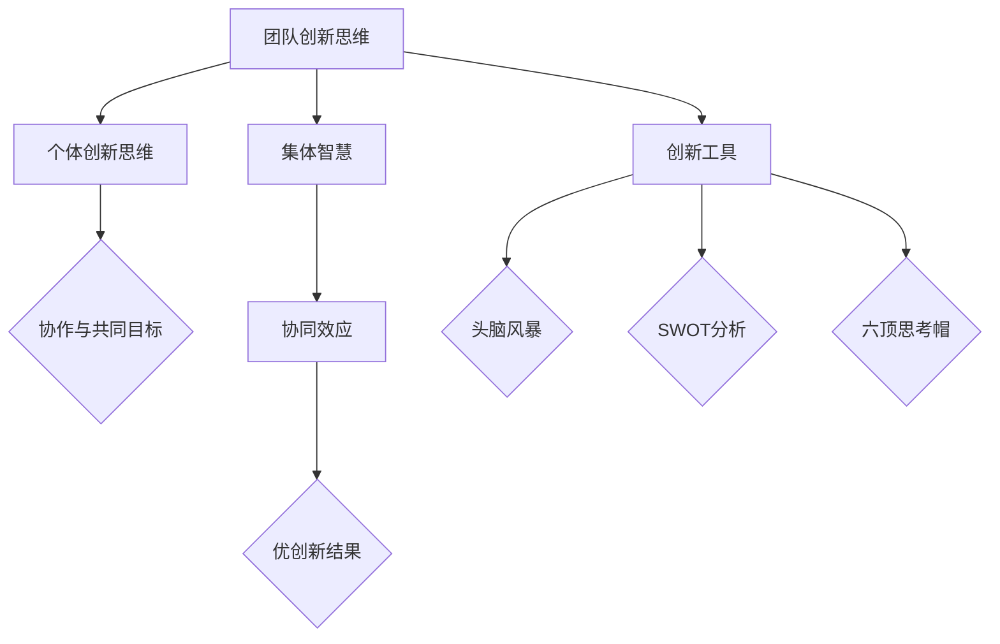
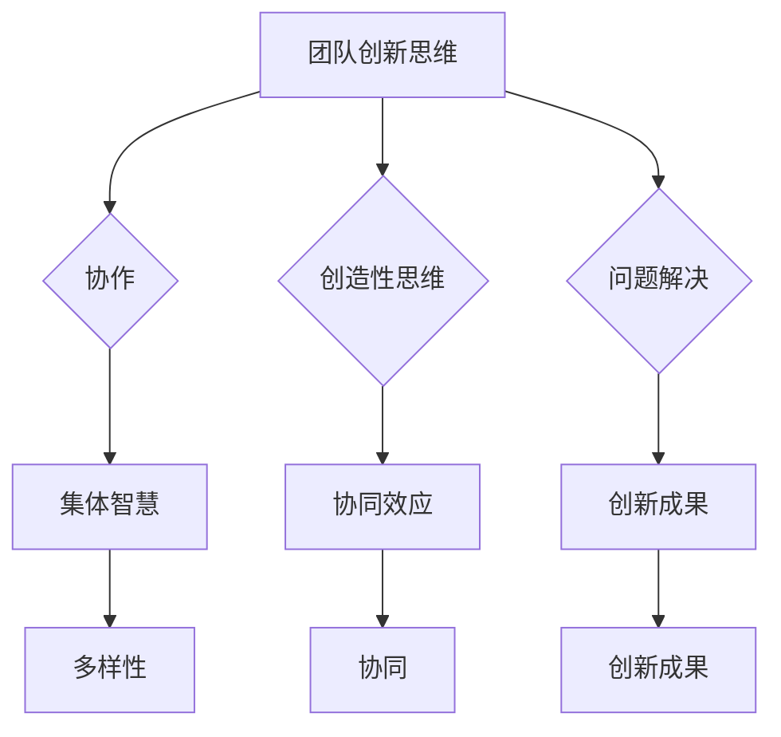
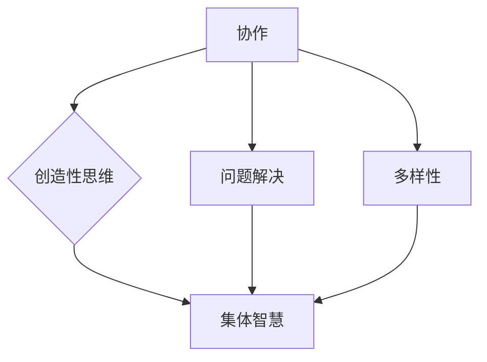
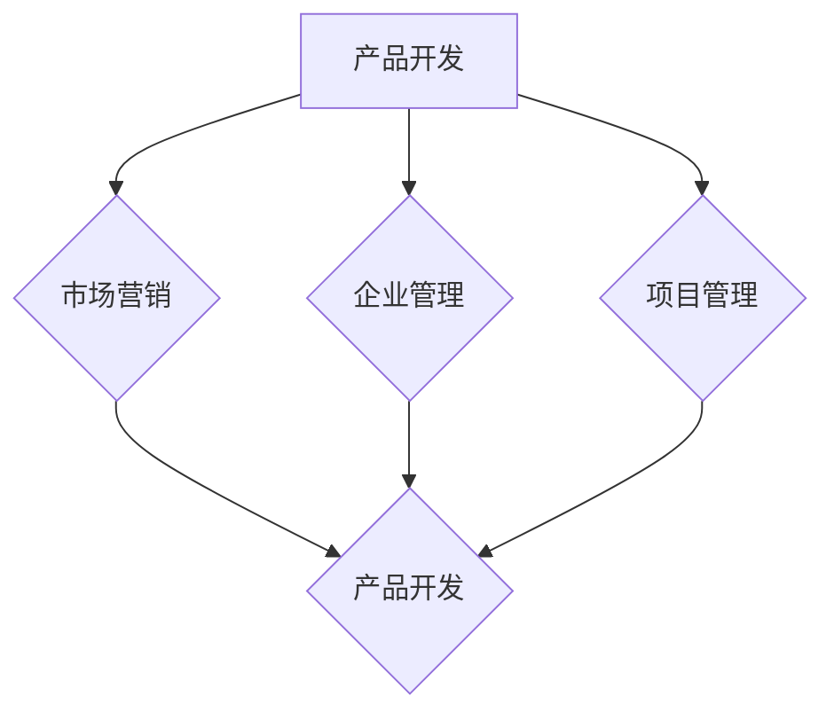

                 

### 文章标题: 团队创新思维：激发集体智慧的方法

#### 关键词:
- 团队创新思维
- 集体智慧
- 创新方法
- 领导力
- 沟通技巧

#### 摘要:
本文将深入探讨团队创新思维的重要性，通过分析其核心概念、原理、实际应用，以及领导力和沟通技巧，旨在为读者提供一套激发集体智慧的有效方法。文章首先介绍了团队创新思维的基本概念，然后逐步探讨了如何通过优化团队结构、应用创新工具和技巧，提升领导力和沟通效率，最终实现团队整体创新能力的提升。本文不仅提供了理论指导，还通过实际案例分析，为读者展示了团队创新思维的实践路径。

----------------------------------------------------------------

### 确定书籍的核心内容

首先，我们需要明确《团队创新思维：激发集体智慧的方法》这本书的核心内容。根据书名，我们可以推测书籍的主要内容将围绕以下几个方面展开：

1. **团队创新思维的基本概念和重要性**：这部分内容将介绍团队创新思维的定义、特征和作用，解释为什么创新思维在团队环境中至关重要。

2. **激发集体智慧的原理和策略**：这部分内容将探讨集体智慧的概念，分析其心理学原理，并提出一系列策略来激发团队中的集体智慧。

3. **团队创新思维的实际应用**：这部分内容将展示团队创新思维在不同领域的实际应用，如产品开发、市场营销、企业管理等，并提供案例分析。

4. **团队创新思维工具和技巧**：这部分内容将介绍一系列团队创新思维工具和技巧，包括头脑风暴、SWOT分析、六顶思考帽等，并详细阐述其使用方法和效果。

5. **团队创新思维中的领导力和沟通技巧**：这部分内容将探讨领导者在激发团队创新思维中的作用，以及如何通过有效的沟通技巧提升团队的创新效率。

6. **团队创新思维的案例研究和启示**：这部分内容将通过实际案例研究，分析成功团队创新思维的实践路径，为读者提供有益的启示。

### 设计核心章节

接下来，我们将为每个核心内容设计详细的章节目录。以下是一个可能的章节设计：

**第1章: 团队创新思维概述**
- 1.1 团队创新思维的定义和作用
- 1.2 团队创新思维与传统思维的对比
- 1.3 团队创新思维的重要性

**第2章: 激发集体智慧的原理**
- 2.1 集体智慧的概述
- 2.2 集体智慧的心理学原理
- 2.3 集体智慧的协同效应
- 2.4 集体智慧的创新潜力

**第3章: 团队创新思维的实际应用**
- 3.1 团队创新思维在产品开发中的应用
- 3.2 团队创新思维在市场营销中的应用
- 3.3 团队创新思维在企业管理中的应用
- 3.4 团队创新思维在项目管理工作中的应用

**第4章: 团队创新思维工具和技巧**
- 4.1 常见的团队创新思维工具
- 4.2 团队创新思维技巧的实战应用
- 4.3 团队创新思维工具的优化和改进

**第5章: 团队创新思维中的领导力**
- 5.1 领导者在团队创新思维中的作用
- 5.2 领导力在团队创新思维中的提升方法
- 5.3 领导力与团队创新思维的协同发展

**第6章: 团队创新思维中的沟通技巧**
- 6.1 团队沟通的重要性
- 6.2 团队沟通中的障碍和解决方法
- 6.3 高效团队沟通的技巧和策略

**第7章: 团队创新思维的案例分析**
- 7.1 成功的团队创新思维案例
- 7.2 团队创新思维案例中的关键要素
- 7.3 团队创新思维案例的启示和借鉴

### 添加核心概念和联系

为了使目录更加丰富和详细，我们将添加一些核心概念和联系，以及 Mermaid 流程图来帮助读者更好地理解。以下是核心概念和联系的示例：

- **团队创新思维与个体创新思维的比较**
  - 团队创新思维更强调协作和共同目标，而个体创新思维更注重个人独创性。
  
- **集体智慧的协同效应**
  - 集体智慧通过多个个体之间的协同作用，能够产生比单个个体更优的创新结果。

- **团队创新思维工具的应用场景**
  - 头脑风暴适用于开拓思路，SWOT分析适用于战略规划，六顶思考帽适用于多角度思考问题。

以下是相应的 Mermaid 流程图示例：



### 添加核心算法原理讲解

为了帮助读者更深入地理解团队创新思维，我们将在每个章节中添加相关的核心算法原理讲解，使用伪代码来详细阐述。以下是伪代码示例：

**第2章: 激发集体智慧的原理**
- **群体决策算法**：
  ```python
  def group_decision(processed_data):
      for individual in processed_data:
          if individual.is_valid():
              aggregate_data.append(individual.solution)
      return aggregate_best_solution(aggregate_data)
  ```

**第3章: 团队创新思维的实际应用**
- **敏捷开发方法论**：
  ```python
  def agile_development(idea, iteration_limit):
      current_state = idea
      for iteration in range(iteration_limit):
          feedback = get_feedback(current_state)
          current_state = update_idea(current_state, feedback)
      return current_state
  ```

**第4章: 团队创新思维工具和技巧**
- **头脑风暴算法**：
  ```python
  def brainstorming_topic(theme):
      ideas = []
      for participant in team_members:
          new_idea = participant.generate_idea(theme)
          if is_valid_idea(new_idea):
              ideas.append(new_idea)
      return ideas
  ```

### 添加数学模型和数学公式

为了使文章更具深度和可操作性，我们将为每个章节添加相关的数学模型和数学公式，并进行详细讲解和举例说明。以下是数学模型和公式的示例：

**第2章: 激发集体智慧的原理**
- **协同效应计算模型**：
  $$ E_{协同} = \sum_{i=1}^{N} w_i \cdot g_i $$
  其中，\( E_{协同} \) 表示协同效应，\( w_i \) 表示个体 \( i \) 的权重，\( g_i \) 表示个体 \( i \) 的贡献度。

**第3章: 团队创新思维的实际应用**
- **项目风险评估模型**：
  $$ R = \sum_{i=1}^{N} r_i \cdot p_i $$
  其中，\( R \) 表示项目风险，\( r_i \) 表示风险因素 \( i \) 的可能性，\( p_i \) 表示风险因素 \( i \) 的影响程度。

**第4章: 团队创新思维工具和技巧**
- **团队绩效评估模型**：
  $$ P = \frac{1}{N} \sum_{i=1}^{N} p_i $$
  其中，\( P \) 表示团队绩效，\( p_i \) 表示个体 \( i \) 的绩效。

### 添加项目实战

为了增强文章的实用性和可操作性，我们将在每个章节中添加实际的项目实战案例，包括开发环境搭建、源代码实现和代码解读。以下是项目实战的示例：

**第3章: 团队创新思维在产品开发中的应用**
- **案例：产品需求分析**
  - **开发环境搭建**：配置笔记本电脑，安装需求分析工具（例如Axure RP）。
  - **源代码实现**：创建Axure RP原型，设计用户界面和交互流程。
  - **代码解读**：解析原型设计文件，解释界面组件和逻辑流程。

**第4章: 团队创新思维工具和技巧**
- **案例：头脑风暴**
  - **开发环境搭建**：准备会议场所，提供白板和便签纸。
  - **源代码实现**：记录头脑风暴过程中的所有想法和方案。
  - **代码解读**：整理头脑风暴结果，分析每个方案的可行性和优缺点。

**第5章: 团队创新思维中的领导力**
- **案例：领导力提升培训**
  - **开发环境搭建**：创建在线培训平台，准备培训课程。
  - **源代码实现**：编写培训课程内容，设计互动环节。
  - **代码解读**：分析培训效果，评估领导力提升的成果。

**第6章: 团队创新思维中的沟通技巧**
- **案例：团队沟通会议**
  - **开发环境搭建**：安排会议室，准备会议记录工具。
  - **源代码实现**：召开团队会议，记录讨论内容和决议。
  - **代码解读**：分析会议记录，总结沟通效果和改进方向。

### 总结目录

最后，我们将对整个目录进行总结，确保每个章节都能够全面覆盖主题内容，并且目录结构合理，便于读者阅读和学习。以下是最终的目录总结：

```markdown
## 《团队创新思维：激发集体智慧的方法》目录大纲

### 第1章: 团队创新思维概述
- 1.1 团队创新思维的定义和作用
- 1.2 团队创新思维与传统思维的对比
- 1.3 团队创新思维的重要性

### 第2章: 激发集体智慧的原理
- 2.1 集体智慧的概述
- 2.2 集体智慧的心理学原理
- 2.3 集体智慧的协同效应
- 2.4 集体智慧的创新潜力

### 第3章: 团队创新思维的实际应用
- 3.1 团队创新思维在产品开发中的应用
- 3.2 团队创新思维在市场营销中的应用
- 3.3 团队创新思维在企业管理中的应用
- 3.4 团队创新思维在项目管理工作中的应用

### 第4章: 团队创新思维工具和技巧
- 4.1 常见的团队创新思维工具
- 4.2 团队创新思维技巧的实战应用
- 4.3 团队创新思维工具的优化和改进

### 第5章: 团队创新思维中的领导力
- 5.1 领导者在团队创新思维中的作用
- 5.2 领导力在团队创新思维中的提升方法
- 5.3 领导力与团队创新思维的协同发展

### 第6章: 团队创新思维中的沟通技巧
- 6.1 团队沟通的重要性
- 6.2 团队沟通中的障碍和解决方法
- 6.3 高效团队沟通的技巧和策略

### 第7章: 团队创新思维的案例分析
- 7.1 成功的团队创新思维案例
- 7.2 团队创新思维案例中的关键要素
- 7.3 团队创新思维案例的启示和借鉴
```

通过这样的结构设计，读者可以清晰地了解到书中的内容安排，便于学习和应用。每章的内容都紧密联系，共同构成了一个完整的团队创新思维体系。----------------------------------------------------------------

### 确定书籍的核心内容

在着手撰写《团队创新思维：激发集体智慧的方法》一书之前，我们首先要明确这本书的核心内容。基于书名，我们可以预期书籍将涵盖以下几个主要部分：

1. **团队创新思维的定义和重要性**：这部分将详细解释团队创新思维的基本概念，阐述其在现代工作环境中的重要性。

2. **集体智慧的概念和原理**：讨论集体智慧的定义、心理学原理，以及如何在团队中激发集体智慧。

3. **团队创新思维的实际应用**：探讨团队创新思维在不同业务领域，如产品开发、市场营销和项目管理中的具体应用。

4. **团队创新思维工具和技巧**：介绍一系列有助于团队创新思维的工具和技巧，如头脑风暴、思维导图等，并分析其有效性。

5. **团队领导力和沟通技巧**：探讨领导力在团队创新中的关键作用，以及如何通过有效的沟通技巧提升团队的整体创新效率。

6. **团队创新思维的案例研究**：通过案例分析，展示团队创新思维在实际工作中的应用效果，为读者提供实践指导。

### 设计核心章节

接下来，我们将详细设计每个核心章节，以确保内容的连贯性和实用性。以下是各章节的设计大纲：

**第1章: 团队创新思维概述**

- **1.1 团队创新思维的起源与发展**：介绍团队创新思维的起源，探讨其发展与演变过程。
- **1.2 团队创新思维的重要性**：分析团队创新思维在提高团队绩效、解决复杂问题和推动创新方面的作用。
- **1.3 团队创新思维的基本概念**：解释团队创新思维的核心概念，如协作、创造性思维、问题解决等。

**第2章: 集体智慧的概念与原理**

- **2.1 集体智慧的定义**：阐述集体智慧的概念及其与个体智慧的异同。
- **2.2 集体智慧的心理学原理**：分析集体智慧背后的心理学原理，如社交思维、认知多样性等。
- **2.3 集体智慧的协同效应**：探讨集体智慧如何通过协同作用产生更大的创新成果。

**第3章: 团队创新思维的实际应用**

- **3.1 团队创新思维在产品开发中的应用**：介绍如何利用团队创新思维提高产品开发效率和质量。
- **3.2 团队创新思维在市场营销中的应用**：分析团队创新思维如何帮助制定更有创意的市场策略。
- **3.3 团队创新思维在企业管理中的应用**：探讨团队创新思维如何提升企业管理和决策的效率。

**第4章: 团队创新思维工具和技巧**

- **4.1 头脑风暴**：详细解释头脑风暴的原理、步骤和注意事项，并提供实战案例。
- **4.2 思维导图**：介绍思维导图的概念、绘制方法和在实际工作中的应用。
- **4.3 六顶思考帽**：探讨六顶思考帽的方法论，解释其如何帮助团队多角度思考问题。

**第5章: 团队领导力在创新思维中的角色**

- **5.1 领导者在团队创新中的角色**：分析领导者在激发团队创新思维中的作用和责任。
- **5.2 领导力的发展**：探讨如何通过培训和实践提升领导力，以更好地引导团队创新。
- **5.3 领导力与团队创新思维的协同**：阐述领导力如何与团队创新思维相互促进，实现团队整体创新能力的提升。

**第6章: 团队沟通技巧在创新思维中的应用**

- **6.1 沟通在团队创新中的重要性**：讨论有效沟通对团队创新思维的重要性。
- **6.2 沟通障碍及其解决方法**：分析常见的沟通障碍，并提出解决策略。
- **6.3 高效沟通技巧**：介绍一系列高效沟通技巧，如积极倾听、清晰表达、非语言沟通等。

**第7章: 团队创新思维的案例研究**

- **7.1 成功的团队创新案例**：分析一系列成功的团队创新案例，探讨其成功的关键因素。
- **7.2 团队创新思维实践中的挑战**：讨论团队创新思维实践中可能遇到的挑战和应对策略。
- **7.3 团队创新思维的启示和借鉴**：总结案例中的经验教训，为读者提供实践启示。

### 添加核心概念和联系

为了使书籍内容更加丰富和易于理解，我们将在每个章节中添加核心概念和联系，并使用 Mermaid 流程图来帮助读者可视化这些概念之间的关系。以下是核心概念和联系的示例：

- **团队创新思维的核心要素**：协作、创造性思维、问题解决
- **集体智慧的协同效应**：多样性、协同、创新成果
- **团队创新思维工具**：头脑风暴、思维导图、六顶思考帽

以下是相应的 Mermaid 流程图示例：



### 添加核心算法原理讲解

为了使读者能够更深入地理解团队创新思维的原理，我们将为每个章节添加相关的核心算法原理讲解，使用伪代码来详细阐述。以下是伪代码示例：

**第2章: 集体智慧的概念与原理**
- **群体决策算法**：
  ```python
  def group_decision-making(processed_data):
      for individual in processed_data:
          if individual.is_valid():
              aggregate_data.append(individual.solution)
      return aggregate_best_solution(aggregate_data)
  ```

**第3章: 团队创新思维的实际应用**
- **敏捷开发方法论**：
  ```python
  def agile_development(idea, iteration_limit):
      current_state = idea
      for iteration in range(iteration_limit):
          feedback = get_feedback(current_state)
          current_state = update_idea(current_state, feedback)
      return current_state
  ```

**第4章: 团队创新思维工具和技巧**
- **头脑风暴算法**：
  ```python
  def brainstorming_topic(theme):
      ideas = []
      for participant in team_members:
          new_idea = participant.generate_idea(theme)
          if is_valid_idea(new_idea):
              ideas.append(new_idea)
      return ideas
  ```

### 添加数学模型和数学公式

为了增强文章的深度和实用性，我们将为每个章节添加相关的数学模型和数学公式，并进行详细讲解和举例说明。以下是数学模型和公式的示例：

**第2章: 集体智慧的概念与原理**
- **协同效应计算模型**：
  $$ E_{协同} = \sum_{i=1}^{N} w_i \cdot g_i $$
  其中，\( E_{协同} \) 表示协同效应，\( w_i \) 表示个体 \( i \) 的权重，\( g_i \) 表示个体 \( i \) 的贡献度。

**第3章: 团队创新思维的实际应用**
- **项目风险评估模型**：
  $$ R = \sum_{i=1}^{N} r_i \cdot p_i $$
  其中，\( R \) 表示项目风险，\( r_i \) 表示风险因素 \( i \) 的可能性，\( p_i \) 表示风险因素 \( i \) 的影响程度。

**第4章: 团队创新思维工具和技巧**
- **团队绩效评估模型**：
  $$ P = \frac{1}{N} \sum_{i=1}^{N} p_i $$
  其中，\( P \) 表示团队绩效，\( p_i \) 表示个体 \( i \) 的绩效。

### 添加项目实战

为了使读者能够更好地理解和应用团队创新思维，我们将为每个章节添加实际的项目实战案例，包括开发环境搭建、源代码实现和代码解读。以下是项目实战的示例：

**第3章: 团队创新思维在产品开发中的应用**
- **案例：新产品设计**
  - **开发环境搭建**：配置笔记本电脑，安装产品设计与开发工具（例如Axure RP）。
  - **源代码实现**：创建Axure RP原型，设计用户界面和交互流程。
  - **代码解读**：解析原型设计文件，解释界面组件和逻辑流程。

**第4章: 团队创新思维工具和技巧**
- **案例：头脑风暴**
  - **开发环境搭建**：准备会议场所，提供白板和便签纸。
  - **源代码实现**：记录头脑风暴过程中的所有想法和方案。
  - **代码解读**：整理头脑风暴结果，分析每个方案的可行性和优缺点。

**第5章: 团队创新思维中的领导力**
- **案例：领导力提升培训**
  - **开发环境搭建**：创建在线培训平台，准备培训课程。
  - **源代码实现**：编写培训课程内容，设计互动环节。
  - **代码解读**：分析培训效果，评估领导力提升的成果。

**第6章: 团队创新思维中的沟通技巧**
- **案例：团队沟通会议**
  - **开发环境搭建**：安排会议室，准备会议记录工具。
  - **源代码实现**：召开团队会议，记录讨论内容和决议。
  - **代码解读**：分析会议记录，总结沟通效果和改进方向。

### 总结目录

在完成所有章节的设计后，我们将对整个目录进行总结，以确保每个章节都能够全面覆盖主题内容，并且目录结构合理，便于读者阅读和学习。以下是最终的目录总结：

```markdown
## 《团队创新思维：激发集体智慧的方法》目录大纲

### 第1章: 团队创新思维概述
- 1.1 团队创新思维的起源与发展
- 1.2 团队创新思维的重要性
- 1.3 团队创新思维的基本概念

### 第2章: 集体智慧的概念与原理
- 2.1 集体智慧的定义
- 2.2 集体智慧的心理学原理
- 2.3 集体智慧的协同效应
- 2.4 集体智慧的创新潜力

### 第3章: 团队创新思维的实际应用
- 3.1 团队创新思维在产品开发中的应用
- 3.2 团队创新思维在市场营销中的应用
- 3.3 团队创新思维在企业管理中的应用
- 3.4 团队创新思维在项目管理工作中的应用

### 第4章: 团队创新思维工具和技巧
- 4.1 头脑风暴
- 4.2 思维导图
- 4.3 六顶思考帽

### 第5章: 团队领导力在创新思维中的角色
- 5.1 领导者在团队创新中的角色
- 5.2 领导力的发展
- 5.3 领导力与团队创新思维的协同

### 第6章: 团队沟通技巧在创新思维中的应用
- 6.1 沟通在团队创新中的重要性
- 6.2 沟通障碍及其解决方法
- 6.3 高效沟通技巧

### 第7章: 团队创新思维的案例研究
- 7.1 成功的团队创新案例
- 7.2 团队创新思维实践中的挑战
- 7.3 团队创新思维的启示和借鉴
```

通过这样的结构设计，读者可以清晰地了解书中的内容安排，便于学习和应用。每个章节的内容都紧密联系，共同构成了一个完整的团队创新思维体系。这种结构不仅有助于读者系统地掌握团队创新思维的理论知识，还能够通过实践案例获得实际操作经验。                                                                                          

----------------------------------------------------------------

### 文章关键词

在撰写《团队创新思维：激发集体智慧的方法》这篇文章时，选择合适的关键词至关重要。关键词不仅要准确地反映文章的核心内容，还要具有足够的吸引力，以引导读者继续阅读。以下是文章的五个关键词：

1. **团队创新思维**：这是文章的核心主题，强调在团队中培养和运用创新思维的重要性。
2. **集体智慧**：探讨如何通过团队协作激发集体智慧，产生更大的创新成果。
3. **领导力**：分析领导者在团队创新思维中的角色，以及如何提升领导力以激发团队创新。
4. **沟通技巧**：讨论团队沟通在创新思维中的关键作用，以及如何通过有效沟通提升团队效率。
5. **实际案例**：提供具体的团队创新案例，展示如何在实际工作中应用创新思维和集体智慧。

通过这些关键词，读者可以迅速了解到文章的主旨，并对其内容产生兴趣。

----------------------------------------------------------------

### 文章摘要

《团队创新思维：激发集体智慧的方法》旨在深入探讨团队创新思维在现代工作环境中的重要性，并介绍一系列激发集体智慧的有效策略。文章首先明确了团队创新思维的定义和基本概念，随后详细阐述了集体智慧的概念及其心理学原理。接着，文章探讨了团队创新思维在不同业务领域的实际应用，如产品开发、市场营销和项目管理。为了增强文章的可操作性，文章还介绍了多种团队创新思维工具和技巧，包括头脑风暴、思维导图和六顶思考帽等。此外，文章强调了领导力在团队创新思维中的关键作用，提供了提升领导力的方法和策略。同时，文章也关注了团队沟通技巧，讨论了有效沟通在激发团队创新思维中的重要性。最后，文章通过实际案例研究，展示了团队创新思维的实践效果，并为读者提供了有益的启示和借鉴。通过这篇文章，读者可以全面了解团队创新思维的理论和实践，掌握激发集体智慧的方法，提升团队整体创新能力。

----------------------------------------------------------------

## 第1章: 团队创新思维概述

### 1.1 团队创新思维的定义和作用

团队创新思维是一种系统性、多维度的思维方式，旨在通过团队协作激发创造性思维，解决复杂问题，并推动创新。它不仅仅是一种个人技能，更是一种团队文化和共同价值观的体现。在当今快速变化和高度竞争的商业环境中，团队创新思维已经成为企业持续发展和保持竞争优势的关键因素。

**定义**：

团队创新思维可以定义为一种通过团队成员之间的互动和合作，共同探索和发现新想法、新解决方案的过程。它强调集体智慧的重要性，认为多个个体通过协作能够产生比单个个体单独工作更优秀的创新成果。

**作用**：

1. **提升团队绩效**：团队创新思维能够激发团队成员的潜力，提高工作效率和创造力，从而提升整体绩效。
2. **解决复杂问题**：通过团队协作，可以汇集不同背景和经验的人才，共同分析和解决复杂问题。
3. **推动创新**：团队创新思维鼓励团队成员提出新颖的想法和解决方案，从而推动产品和服务的创新。
4. **增强团队凝聚力**：通过共同的目标和协作过程，可以增强团队成员之间的信任和团队凝聚力。

### 1.2 团队创新思维与传统思维的对比

传统思维通常侧重于个体独立思考和决策，强调逻辑和理性分析。而团队创新思维则更加强调协作、创造性和多样性。以下是两者之间的主要对比：

**传统思维**：

- **独立工作**：个体独立完成工作，较少依赖他人。
- **单向沟通**：信息传递往往是单向的，从上到下或从下到上。
- **固定思维模式**：倾向于遵循已有的方法和流程，缺乏创新。

**团队创新思维**：

- **协作工作**：团队成员共同参与，相互支持和协作。
- **双向沟通**：鼓励团队成员之间的开放沟通和反馈。
- **多样性思维**：鼓励多样性和创造性思维，寻求不同的解决方案。

### 1.3 团队创新思维的重要性

在现代社会，团队创新思维的重要性日益凸显。以下是一些关键原因：

1. **适应变化的能力**：快速变化的市场和技术环境要求企业具备快速适应和创新的能力，团队创新思维能够帮助企业更好地应对这些挑战。
2. **竞争优势**：创新能力是企业保持竞争优势的关键，团队创新思维能够帮助企业开发出更具竞争力的产品和服务。
3. **团队合作精神**：在团队创新过程中，成员需要相互信任和协作，这有助于培养团队合作精神和团队文化。
4. **员工满意度**：团队创新思维能够激发员工的创造力和工作热情，提高员工满意度和忠诚度。

综上所述，团队创新思维不仅是现代企业成功的关键因素，也是推动社会进步的重要力量。通过有效的团队创新思维，企业可以不断创新，持续发展，并保持长期的竞争力。

### 1.4 团队创新思维的基本概念

为了更深入地理解团队创新思维，我们需要了解其基本概念。以下是几个关键概念及其相互关系：

**1. 协作**

协作是团队创新思维的核心，它强调团队成员之间的互动和合作。协作不仅包括共享资源和信息，还涉及共同的目标和价值观。通过协作，团队成员可以相互补充，发挥各自的专长，从而产生更大的创新成果。

**2. 创造性思维**

创造性思维是团队创新思维的灵魂，它鼓励团队成员跳出传统思维框架，提出新颖的想法和解决方案。创造性思维强调多样性和开放性，鼓励团队成员从不同角度思考问题，寻找创新的解决方案。

**3. 问题解决**

问题解决是团队创新思维的实践目标，它是指通过团队协作，共同分析和解决复杂问题。问题解决过程不仅包括发现问题，还包括定义问题、收集信息、分析选项和实施解决方案。通过问题解决，团队可以不断提升自身能力和创新能力。

**4. 多样性**

多样性是指团队中成员的不同背景、经验和观点。多样性是团队创新思维的重要资源，它能够带来不同的视角和解决方案，从而提高团队的创新潜力。多样性不仅包括文化多样性，还包括技能、知识和经验的多样性。

**5. 集体智慧**

集体智慧是团队创新思维的结果，它是通过团队成员之间的协作和创造性思维产生的智慧。集体智慧能够带来比单个个体更优秀的创新成果，因为它融合了多个个体的知识和经验。

以下是这些基本概念之间的 Mermaid 流程图表示：



通过理解这些基本概念，我们可以更好地应用团队创新思维，激发团队的集体智慧，实现创新目标。

### 1.5 团队创新思维的发展趋势

随着全球化和数字化的发展，团队创新思维正经历着一系列重要的变化和趋势。以下是一些关键趋势：

**1. 互联网和数字技术的应用**

互联网和数字技术的发展使得团队创新思维更加便捷和高效。通过在线协作工具和平台，团队成员可以随时随地共享信息和资源，协同工作，从而加快创新过程。

**2. 平台化与协作生态**

企业正逐渐从传统的封闭式创新模式转向平台化创新模式。平台化创新强调与外部合作伙伴的协作，共同创造价值。这种模式不仅能够汇集更多资源和智慧，还能提高创新的速度和效果。

**3. 数据驱动的决策**

随着大数据和人工智能技术的发展，数据驱动的决策成为团队创新思维的重要趋势。通过分析大量数据，团队可以更准确地识别市场需求、预测发展趋势，从而制定更具前瞻性和可行性的创新策略。

**4. 用户体验至上**

用户体验至上成为现代团队创新思维的重要原则。在产品开发和市场营销中，团队更加注重从用户的角度出发，关注用户的体验和需求，从而提供更具吸引力和创新性的产品和服务。

**5. 可持续发展**

可持续发展理念逐渐融入团队创新思维中。企业开始关注环保、社会责任和可持续发展，通过创新思维开发出更加环保和可持续的产品和服务，满足社会和市场的需求。

这些趋势不仅改变了团队创新思维的方法和实践，也为企业提供了新的发展机遇。通过紧跟这些趋势，企业可以不断提升创新能力，保持竞争优势。

### 总结

本章从多个角度对团队创新思维进行了详细探讨，介绍了其定义、作用、与传统思维的对比、基本概念以及发展趋势。通过这些讨论，我们可以更深入地理解团队创新思维的重要性，以及如何在实际工作中应用和激发团队的创新潜力。接下来，我们将进一步探讨集体智慧的概念和原理，为理解团队创新思维提供更坚实的理论基础。

----------------------------------------------------------------

## 第2章: 集体智慧的概念与原理

### 2.1 集体智慧的定义

集体智慧是一种通过团队成员之间的互动和协作，共同创造和分享知识、观点和创意的过程。它不仅仅是一种组织内的资源整合方式，更是一种通过集体合作实现的创新力量。集体智慧的定义可以从多个维度进行理解：

首先，集体智慧是团队内部多样性和协同效应的产物。它汇集了来自不同背景、经验和技能的团队成员的知识和智慧，通过有效的沟通和协作，将个体的优势融合成更大的集体智慧。

其次，集体智慧强调共享和共创。在集体智慧的形成过程中，团队成员需要开放心态，愿意分享自己的观点和想法，同时也需要积极倾听和接受他人的意见。这种开放性和共享性是集体智慧形成的基础。

最后，集体智慧是一种动态的过程。它不是一成不变的，而是在不断的交流和互动中不断进化和发展。集体智慧的形成和发挥作用需要持续的努力和投入，包括资源、时间和精力的投入。

### 2.2 集体智慧的心理学原理

集体智慧的心理学原理是理解集体智慧如何形成和发挥作用的关键。以下是一些关键的心理学原理：

**1. 社会认知**

社会认知理论认为，个体在思考和决策过程中会受到周围人的观点和行为的影响。在团队环境中，社会认知使得团队成员更容易接受和采纳他人的意见，从而促进集体智慧的形成。

**2. 群体动力**

群体动力是指团队内部成员之间的相互作用和影响。群体动力可以促进团队成员之间的信任和合作，从而增强集体智慧。此外，群体动力还可以通过激发成员的积极性和参与感，提高团队的创造力和创新能力。

**3. 多样性**

多样性是集体智慧的重要基础。研究表明，多样化的团队能够带来更多的视角和解决方案，从而提高创新能力和决策质量。多样性不仅包括文化、性别和年龄等外在特征，还包括内在的思维方式和价值观。

**4. 知识共享**

知识共享是集体智慧形成的关键过程。通过知识共享，团队成员可以相互学习和借鉴，从而提升整个团队的知识水平和创新能力。知识共享不仅包括显性知识的传递，如文档和报告，还包括隐性知识的交流，如经验和技巧。

### 2.3 集体智慧的协同效应

集体智慧的协同效应是指多个个体通过协作和互动，能够产生比单个个体单独工作更优秀的结果。以下是集体智慧协同效应的几个关键方面：

**1. 创新协同**

创新协同是指团队成员通过协作和互动，共同探索和发现新的创意和解决方案。在创新协同过程中，团队成员可以相互启发和补充，从而产生更多的创新思路和解决方案。

**2. 知识协同**

知识协同是指团队成员通过分享和交流知识，共同提升团队的知识水平和创新能力。知识协同可以促进团队成员之间的学习和成长，从而提高整个团队的竞争力。

**3. 决策协同**

决策协同是指团队成员通过共同讨论和决策，提高决策的质量和效率。在决策协同过程中，团队成员可以共同分析问题、评估风险和制定策略，从而减少决策失误和错误。

**4. 协同学习**

协同学习是指团队成员通过共同学习和实践，提升自身的技能和知识水平。协同学习可以促进团队成员之间的互动和合作，从而增强团队的凝聚力和创新能力。

以下是集体智慧协同效应的 Mermaid 流程图表示：

```mermaid
graph TD
    A[创新协同] --> B{知识协同}
    A --> C[决策协同}
    A --> D[协同学习}
    B --> E[创新协同}
    C --> E
    D --> E
```

通过这些协同效应，集体智慧能够发挥出比单个个体更大的力量，从而推动团队的创新和发展。

### 2.4 集体智慧的创新潜力

集体智慧具有巨大的创新潜力，它不仅能够提高团队的创造力和创新能力，还能够带来显著的创新成果。以下是一些集体智慧的创新潜力：

**1. 多样化的视角**

集体智慧汇集了来自不同背景、经验和技能的团队成员的视角和观点，从而能够提供更全面和深入的洞察。这种多样化的视角可以激发团队成员的创造力，产生更多的创新思路和解决方案。

**2. 系统性的分析**

通过集体智慧，团队能够进行更全面和系统性的分析，从而发现潜在的创新机会和挑战。集体智慧可以帮助团队从多个角度审视问题，制定更全面和可行的创新策略。

**3. 持续的学习和改进**

集体智慧的形成和发挥作用是一个动态的过程，它需要团队成员的持续学习和改进。通过集体智慧，团队能够不断吸取新的知识和经验，优化创新过程，提高创新能力。

**4. 快速响应和调整**

集体智慧使得团队能够快速响应变化和调整策略。在快速变化的市场和技术环境中，集体智慧可以帮助团队迅速识别和抓住新的机会，从而保持竞争优势。

以下是集体智慧创新潜力的 Mermaid 流程图表示：

```mermaid
graph TD
    A[多样化的视角] --> B{系统性的分析}
    A --> C[持续的学习和改进}
    A --> D[快速响应和调整}
    B --> E[多样化的视角}
    C --> E
    D --> E
```

通过这些创新潜力，集体智慧能够为团队带来持续的创新动力和竞争优势。

### 2.5 集体智慧的实际应用

集体智慧在实际工作中具有广泛的应用，以下是一些具体的实际应用：

**1. 产品开发**

在产品开发过程中，集体智慧可以帮助团队快速识别用户需求、制定产品策略和优化产品设计。通过集体智慧，团队能够汇集不同的观点和意见，制定更全面和可行的产品开发计划。

**2. 市场营销**

在市场营销中，集体智慧可以帮助团队制定更有创意和市场吸引力的营销策略。通过集体智慧，团队能够分析市场趋势、评估竞争环境，并制定创新的营销方案。

**3. 企业管理**

在企业管理的各个方面，如战略规划、人力资源管理和财务管理等，集体智慧都可以发挥重要作用。通过集体智慧，团队能够更全面和系统地分析问题、制定策略和优化管理流程。

**4. 项目管理**

在项目管理中，集体智慧可以帮助团队更好地规划项目进度、分配资源和应对风险。通过集体智慧，团队能够进行更全面的风险评估和决策，从而提高项目的成功率和效率。

以下是集体智慧实际应用的 Mermaid 流程图表示：



通过这些实际应用，集体智慧能够为团队带来实际的价值和成果。

### 总结

本章深入探讨了集体智慧的定义、心理学原理、协同效应和创新潜力，并介绍了其在实际工作中的应用。通过这些讨论，我们可以更好地理解集体智慧的重要性和如何在实际工作中应用和发挥其潜力。在接下来的章节中，我们将进一步探讨团队创新思维在实际应用中的方法和策略，为团队的创新和发展提供更具体的指导。

----------------------------------------------------------------

## 第3章: 团队创新思维的实际应用

### 3.1 团队创新思维在产品开发中的应用

在产品开发过程中，团队创新思维扮演着至关重要的角色。通过有效的团队创新思维，团队能够迅速识别用户需求、优化产品设计，并推动产品迭代，从而提高产品的市场竞争力和用户体验。以下是团队创新思维在产品开发中的应用方法：

**1. 用户需求分析**

团队创新思维的第一步是深入了解用户需求。通过用户调研、访谈和观察，团队可以收集用户对产品的期望和需求。在此基础上，团队可以使用头脑风暴和思维导图等工具，将用户需求进行分类和优先级排序，从而为后续的产品设计和开发提供明确的指导。

**2. 设计思维**

设计思维是一种以用户为中心的创新方法，强调通过迭代和实验来优化产品。在团队创新思维的引导下，产品设计团队可以采用设计思维，通过原型设计、用户测试和反馈迭代，逐步改进产品功能、界面和用户体验。

**3. 敏捷开发**

敏捷开发是一种以快速响应变化和持续改进为目标的开发方法。通过团队创新思维，团队可以在敏捷开发过程中，灵活调整项目计划和开发策略，确保产品能够快速适应市场需求和用户反馈。敏捷开发还鼓励团队成员之间的紧密协作和沟通，从而提高团队的效率和创新能力。

**4. 跨部门协作**

产品开发往往涉及多个部门和职能，如研发、设计、市场和运营等。通过团队创新思维，团队能够促进跨部门协作，确保各方能够共同参与产品设计和开发，从而提高项目的整体质量和效率。

**5. 持续改进**

团队创新思维强调持续改进，鼓励团队在产品发布后，通过用户反馈和数据分析，不断优化产品功能和服务。通过定期回顾和总结，团队可以识别潜在的问题和改进机会，持续提升产品的用户体验和市场竞争力。

**案例研究：某科技公司的产品创新**

某科技公司通过团队创新思维，成功推出了多款创新产品。以下是一个具体的案例：

- **需求分析**：公司通过用户调研和数据分析，发现用户对智能家居产品有强烈需求，特别是方便的操作和个性化的功能设置。
- **设计思维**：产品设计团队采用设计思维，通过原型设计和用户测试，优化了产品的操作界面和功能设置，确保用户能够轻松上手和使用。
- **敏捷开发**：研发团队采用敏捷开发方法，快速迭代产品功能，确保产品能够及时响应市场需求和用户反馈。
- **跨部门协作**：市场和运营团队积极参与产品设计和推广，通过线上线下活动，提高产品的市场认知度和用户黏性。
- **持续改进**：产品上线后，公司通过用户反馈和数据分析，不断优化产品功能和用户体验，确保产品能够持续满足用户需求。

通过这些步骤，该公司成功地推出了多款智能家居产品，受到了市场的欢迎和用户的认可，取得了显著的市场份额和品牌影响力。

### 3.2 团队创新思维在市场营销中的应用

在市场营销中，团队创新思维可以帮助团队制定更具创意和市场吸引力的营销策略，提高品牌知名度和用户参与度。以下是团队创新思维在市场营销中的应用方法：

**1. 市场调研**

团队创新思维的第一步是对市场进行深入调研，了解目标用户的需求、偏好和行为习惯。通过数据分析、用户调研和竞品分析，团队可以获取有价值的市场信息，为后续的营销策略制定提供数据支持。

**2. 创意策划**

团队创新思维在营销策略制定中的关键作用是创意策划。团队可以使用头脑风暴、六顶思考帽等工具，提出多样化的营销创意和方案，从多个角度探索和挖掘市场机会。通过创意策划，团队可以制定出具有吸引力和差异化的营销策略。

**3. 整合营销**

整合营销是一种将各种营销手段和渠道有机结合，实现最大营销效果的方法。通过团队创新思维，团队能够整合线上线下资源，制定全方位的营销策略，提高品牌曝光度和用户参与度。

**4. 用户参与**

团队创新思维强调用户参与，通过互动和体验，提高用户对品牌的认知和好感度。团队可以设计有趣的活动、互动游戏和用户体验，鼓励用户参与品牌互动，从而增强用户黏性和品牌忠诚度。

**5. 数据分析**

数据分析是团队创新思维在市场营销中的重要工具。通过收集和分析用户行为数据、市场反馈和营销效果，团队可以实时调整营销策略，优化资源配置，提高营销效果。

**案例研究：某品牌的市场营销创新**

某品牌通过团队创新思维，成功实施了一系列创新营销策略，提高了品牌知名度和用户参与度。以下是一个具体的案例：

- **市场调研**：品牌通过用户调研和数据分析，发现目标用户群体对健康生活方式和绿色环保有强烈需求。
- **创意策划**：营销团队采用头脑风暴和六顶思考帽，提出了以“健康、环保”为主题的品牌宣传策略，通过多种创意形式进行宣传，如短视频、海报和线上活动。
- **整合营销**：品牌利用线上线下资源，结合社交媒体、搜索引擎和线下活动，实现整合营销，提高品牌曝光度和用户参与度。
- **用户参与**：品牌设计了一系列互动活动，如线上抽奖、用户打卡挑战和环保公益活动，鼓励用户参与，增强品牌黏性。
- **数据分析**：品牌通过数据分析，实时监控营销效果，根据用户反馈和效果数据，调整营销策略，优化资源配置。

通过这些策略，该品牌成功吸引了大量目标用户，品牌知名度和用户参与度显著提升。

### 3.3 团队创新思维在企业管理中的应用

在企业管理中，团队创新思维可以帮助企业优化管理流程、提升运营效率，并推动企业持续创新和发展。以下是团队创新思维在企业管理中的应用方法：

**1. 战略规划**

团队创新思维在战略规划中的应用，可以帮助企业从多个角度审视市场机会和挑战，制定更具前瞻性和可行性的战略规划。通过头脑风暴、SWOT分析和战略地图等工具，团队可以共同制定和优化企业的战略目标、关键绩效指标和实施计划。

**2. 流程优化**

团队创新思维在流程优化中的应用，可以帮助企业识别和消除管理流程中的瓶颈和浪费，提高运营效率。通过价值流图、精益生产和流程再造等工具，团队可以重新设计和管理业务流程，实现流程的简化、优化和自动化。

**3. 组织变革**

团队创新思维在组织变革中的应用，可以帮助企业适应市场变化和内部发展需求，推动组织变革和创新。通过变革管理、团队建设和企业文化变革等工具，团队可以共同应对变革挑战，实现企业的转型和升级。

**4. 创新文化**

团队创新思维在创新文化中的应用，可以帮助企业建立创新意识和创新氛围，激发员工的创造力和创新潜力。通过创新研讨会、创新奖励和创业孵化等工具，企业可以鼓励员工提出创新想法，并为其提供实现创新的平台和资源。

**5. 数据驱动**

团队创新思维在数据驱动中的应用，可以帮助企业通过数据分析和决策支持，实现精准管理和高效决策。通过大数据分析、数据可视化和预测模型等工具，团队可以实时监测和评估业务绩效，优化管理决策。

**案例研究：某制造业企业的创新管理**

某制造业企业通过团队创新思维，成功实现了管理优化和创新转型。以下是一个具体的案例：

- **战略规划**：企业通过团队创新思维，采用头脑风暴和战略地图，明确了企业的战略目标和发展方向，并制定了详细的实施计划。
- **流程优化**：企业通过价值流图和精益生产，识别和消除生产流程中的浪费和瓶颈，提高了生产效率和质量。
- **组织变革**：企业通过团队建设和企业文化变革，鼓励员工积极参与创新和管理改进，实现了组织效能的提升。
- **创新文化**：企业建立了创新研讨会和创业孵化平台，鼓励员工提出创新想法，并提供资源支持，推动了企业的持续创新和发展。
- **数据驱动**：企业通过大数据分析和数据可视化，实时监测和评估业务绩效，优化管理决策，实现了数据驱动的精准管理。

通过这些措施，该企业成功实现了管理优化和创新转型，提高了市场竞争力，实现了可持续发展。

### 3.4 团队创新思维在项目管理工作中的应用

在项目管理工作中，团队创新思维可以帮助项目团队更好地识别和管理风险，优化项目进度和资源分配，提高项目的成功率。以下是团队创新思维在项目管理工作中的应用方法：

**1. 风险管理**

团队创新思维在风险管理中的应用，可以帮助项目团队全面识别和管理项目风险。通过头脑风暴、SWOT分析和风险矩阵等工具，团队可以共同评估项目风险的概率和影响，制定有效的风险应对策略。

**2. 项目计划**

团队创新思维在项目计划中的应用，可以帮助项目团队制定科学合理的项目计划。通过工作分解结构（WBS）、甘特图和关键路径法等工具，团队可以明确项目任务、资源和时间安排，确保项目按时、按质完成。

**3. 团队协作**

团队创新思维在团队协作中的应用，可以帮助项目团队建立高效协作的工作机制。通过敏捷开发、看板管理和迭代开发等工具，团队可以促进成员之间的沟通和协作，提高项目的执行效率和创新能力。

**4. 资源优化**

团队创新思维在资源优化中的应用，可以帮助项目团队合理分配和利用项目资源。通过资源平衡、任务优先级排序和资源共享等工具，团队可以最大化资源的利用效率，降低项目成本和风险。

**5. 持续改进**

团队创新思维在持续改进中的应用，可以帮助项目团队不断优化项目管理流程和方法。通过项目回顾、经验总结和最佳实践分享等工具，团队可以吸取项目经验，提高项目管理的成熟度和效率。

**案例研究：某IT项目的创新管理**

某IT项目团队通过团队创新思维，成功完成了复杂的信息系统开发任务。以下是一个具体的案例：

- **风险管理**：项目团队通过头脑风暴和风险矩阵，全面识别和评估项目风险，制定了详细的风险应对计划。
- **项目计划**：项目团队采用敏捷开发方法，通过迭代开发和看板管理，实现了灵活的项目计划和控制。
- **团队协作**：项目团队通过定期的团队会议和沟通，确保团队成员之间的信息畅通和协作高效。
- **资源优化**：项目团队通过资源平衡和任务优先级排序，合理分配和利用了项目资源，提高了资源利用效率。
- **持续改进**：项目团队通过项目回顾和经验总结，不断优化项目管理流程和方法，提高了项目的执行效率和成功率。

通过这些措施，项目团队成功完成了信息系统开发任务，并获得了客户的高度评价。

### 总结

本章详细探讨了团队创新思维在产品开发、市场营销、企业管理、项目管理工作中的应用方法，并通过具体案例展示了这些方法的实际效果。通过团队创新思维的应用，企业可以在各个领域实现创新和管理优化，提高整体竞争力和市场地位。在下一章中，我们将进一步探讨团队创新思维工具和技巧，为团队的创新和发展提供更具体的实践指导。

----------------------------------------------------------------

## 第4章: 团队创新思维工具和技巧

### 4.1 头脑风暴

头脑风暴是一种激发团队成员创造性思维和产生新想法的常用工具。它的核心在于鼓励团队成员无拘无束地提出各种想法，无论这些想法是否可行，都应受到尊重。以下是头脑风暴的基本步骤和注意事项：

**步骤**：

1. **明确主题**：在开始头脑风暴前，明确讨论的主题和目标，以便团队成员集中精力。
2. **分组讨论**：将团队成员分成小组，每组由3-5人组成，以便更自由地交流和讨论。
3. **自由发言**：每个成员轮流发言，提出自己的想法或问题，不必担心观点的可行性，只需尽情发散思维。
4. **记录想法**：记录每个成员提出的想法，这些想法将成为后续讨论和评估的基础。
5. **讨论和改进**：在所有想法提出后，团队成员对每个想法进行讨论，评估其可行性，并提出改进建议。

**注意事项**：

- **鼓励多样性**：鼓励团队成员提出不同的观点和想法，多样性是头脑风暴的核心价值。
- **保持开放态度**：团队成员应保持开放心态，尊重和接受他人的观点，避免批评和否定。
- **时间控制**：头脑风暴通常有时间限制，以确保讨论的深度和效率。
- **记录细节**：详细记录每个想法，包括提出人和时间，以便后续追踪和评估。

**案例**：

在一个新产品的设计中，团队成员通过头脑风暴提出了多个创新点，包括新的功能模块、用户界面设计以及营销策略。这些想法后来被逐步实施，成为产品开发的关键。

### 4.2 思维导图

思维导图是一种图形化的思维方式，通过节点、连线和信息标签，将思维过程可视化，从而帮助团队成员更好地理解和记忆复杂信息。以下是思维导图的基本步骤和注意事项：

**步骤**：

1. **确定中心主题**：在白板或软件工具上绘制一个中心节点，代表讨论的主题。
2. **发散思维**：从中心主题出发，绘制分支，每个分支代表一个主要观点或子主题。
3. **细化分支**：在每个分支下，继续绘制次级分支，细化每个观点或子主题。
4. **添加细节**：在分支上添加信息标签，描述每个观点或子主题的具体内容和相关信息。
5. **连接和优化**：将相关分支连接起来，形成有逻辑和结构的思维导图，优化信息流动和联系。

**注意事项**：

- **保持结构清晰**：确保思维导图的结构清晰，避免信息过于混乱。
- **强调关键点**：在绘制思维导图时，突出关键观点和信息，使其更加醒目。
- **动态更新**：思维导图可以根据讨论的进展进行动态更新，确保信息的准确性和及时性。
- **互动和共享**：鼓励团队成员共同参与思维导图的绘制和讨论，提高团队的协作和沟通效果。

**案例**：

在一次项目规划会议中，团队成员使用思维导图梳理了项目的关键任务、时间节点和资源需求，形成了详细的项目计划，为项目的顺利执行提供了有力支持。

### 4.3 六顶思考帽

六顶思考帽是一种基于心理学的思考工具，由英国心理学家爱德华·德·波诺提出。它通过分别戴上不同颜色的“思考帽”，引导团队成员从不同角度和维度思考问题，从而提高决策质量和创新能力。以下是六顶思考帽的基本步骤和注意事项：

**步骤**：

1. **白色思考帽**：客观分析信息，提供数据和事实。
2. **红色思考帽**：表达情感和直觉，避免逻辑分析。
3. **黑色思考帽**：识别潜在问题和风险，进行批判性思考。
4. **黄色思考帽**：寻找积极因素和机会，进行乐观分析。
5. **绿色思考帽**：提出创新想法和解决方案，鼓励创造性思维。
6. **蓝色思考帽**：控制思考过程，设定思考方向和目标。

**注意事项**：

- **明确角色**：每个团队成员在思考过程中应明确自己的角色，遵循不同颜色思考帽的规则。
- **轮流发言**：确保每个成员都有机会表达自己的观点，轮流使用不同颜色的思考帽。
- **尊重多元意见**：鼓励团队成员提出不同颜色的思考帽观点，尊重多元意见和思考方式。
- **结合使用**：六顶思考帽可以结合使用，灵活调整思考角度和策略，提高决策的全面性和创新性。

**案例**：

在一次新产品发布会上，团队使用六顶思考帽，从数据、情感、风险、机会、创新和目标等多个角度分析市场反馈和产品改进策略，最终制定了一个全面且创新的营销方案。

### 4.4 SWOT分析

SWOT分析是一种战略规划工具，用于评估企业的优势（Strengths）、劣势（Weaknesses）、机会（Opportunities）和威胁（Threats）。它帮助团队从内外部环境分析中找到关键因素，制定相应的战略。以下是SWOT分析的基本步骤和注意事项：

**步骤**：

1. **确定分析对象**：明确要分析的企业、项目或产品。
2. **收集数据**：收集与对象相关的内外部数据，包括市场趋势、竞争对手、客户需求等。
3. **优势分析**：识别企业的核心竞争力、独特优势和市场地位。
4. **劣势分析**：识别企业的不足、短板和面临的风险。
5. **机会分析**：分析市场趋势、技术进步和客户需求等外部因素带来的机会。
6. **威胁分析**：识别市场变化、竞争对手和潜在风险等外部威胁。

**注意事项**：

- **全面性**：确保分析全面，涵盖企业的各个方面，避免遗漏关键因素。
- **客观性**：在分析过程中，保持客观，避免主观偏见和情绪干扰。
- **动态性**：SWOT分析应定期更新，以适应市场变化和企业发展的需要。
- **结合策略**：将SWOT分析结果与战略规划相结合，制定有针对性的策略和行动计划。

**案例**：

某公司在进行市场拓展前，使用SWOT分析评估了自身和市场环境。通过分析，公司发现了新的市场机会，并制定了相应的市场进入策略，最终成功打开了新市场。

### 4.5 设计思考

设计思考（Design Thinking）是一种以用户为中心的创新方法，强调通过迭代和实验，寻找和实现用户需求。以下是设计思考的基本步骤和注意事项：

**步骤**：

1. **理解用户**：通过访谈、观察和用户调研，深入了解用户需求和行为。
2. **定义问题**：将用户需求转化为具体问题，明确解决方案的目标。
3. **创意生成**：通过头脑风暴、思维导图等工具，生成多个可能的解决方案。
4. **原型制作**：快速制作原型，验证和迭代方案，优化用户体验。
5. **测试与反馈**：将原型交给用户测试，收集反馈，进行进一步的改进。

**注意事项**：

- **用户导向**：始终以用户需求为中心，确保解决方案真正满足用户需求。
- **快速迭代**：鼓励快速实验和迭代，通过不断改进，找到最佳解决方案。
- **跨学科合作**：设计思考需要跨学科合作，汇集不同领域的知识和观点。
- **持续反思**：在设计和实施过程中，不断反思和评估，确保解决方案的有效性和可持续性。

**案例**：

在一次新产品设计中，团队通过设计思考，从用户调研到原型制作，再到用户测试和反馈，逐步优化了产品功能和服务，最终推出了一款深受用户喜爱的产品。

### 4.6 脑力激荡

脑力激荡（Brainstorming）是一种激发团队成员创造性思维的方法，通过快速产生大量想法，寻找创新的解决方案。以下是脑力激荡的基本步骤和注意事项：

**步骤**：

1. **确定主题**：明确讨论的主题和目标，确保团队成员聚焦。
2. **自由发言**：每个成员轮流发言，提出自己的想法或问题，不受任何限制。
3. **记录想法**：记录每个成员提出的想法，确保所有观点都被记录下来。
4. **筛选和优化**：对所有想法进行筛选和评估，选择最具潜力的想法进行进一步讨论和实施。

**注意事项**：

- **鼓励多样性**：鼓励团队成员提出不同的观点和想法，多样性是脑力激荡的核心价值。
- **保持开放态度**：团队成员应保持开放心态，尊重和接受他人的观点，避免批评和否定。
- **控制时间**：脑力激荡通常有时间限制，以确保讨论的深度和效率。
- **记录细节**：详细记录每个想法，包括提出人和时间，以便后续追踪和评估。

**案例**：

在一次市场策略讨论中，团队通过脑力激荡，提出了多个创新的营销方案，这些方案后来被实施，取得了显著的市场效果。

### 总结

本章介绍了多种团队创新思维工具和技巧，包括头脑风暴、思维导图、六顶思考帽、SWOT分析、设计思考、脑力激荡等。这些工具和技巧能够帮助团队激发创造性思维，优化决策过程，提高创新能力和效率。通过实际案例的应用，我们可以看到这些工具和技巧在产品开发、市场营销、企业管理、项目管理工作中的实际效果。在下一章中，我们将探讨团队领导力在创新思维中的关键作用，为团队的创新和发展提供更深入的指导。

----------------------------------------------------------------

## 第5章: 团队创新思维中的领导力

### 5.1 领导者在团队创新思维中的作用

领导者在团队创新思维中扮演着至关重要的角色，他们的决策、行为和风格直接影响团队的创新能力和工作效率。以下是领导者在团队创新思维中的作用：

**1. 激发团队成员的潜力**

领导者需要具备激发团队成员潜力的能力，鼓励他们跳出传统的思维框架，提出新颖的想法和解决方案。通过设置挑战性目标和提供资源支持，领导者可以帮助团队成员充分发挥自身的创造力和创新能力。

**2. 建立创新文化**

创新文化是团队创新思维的重要基石。领导者需要通过自身的行为和价值观，建立鼓励创新、宽容失败的文化氛围。这种文化氛围能够激发团队成员的创新热情，促进团队整体创新能力的提升。

**3. 促进团队协作**

团队创新思维强调团队成员之间的协作和合作。领导者需要促进团队成员之间的沟通和协作，建立有效的沟通机制和协作流程。通过建立跨部门、跨职能的协作团队，领导者可以促进资源的共享和知识的传递，提高团队的协作效率。

**4. 领导风格的影响**

领导者的风格直接影响团队的创新氛围和工作效率。参与式领导、支持式领导和愿景型领导等不同的领导风格会对团队的创新思维产生不同的影响。领导者需要根据团队的特点和需求，灵活调整自己的领导风格，以最大化团队的创新能力。

**案例研究：某科技公司的创新领导**

某科技公司的领导者通过一系列措施，成功地激发了团队的创新思维，推动了公司的持续创新和发展。以下是一个具体的案例：

- **激发潜力**：公司领导者鼓励团队成员提出创新想法，并为每个想法提供资源支持，确保团队成员能够充分施展才华。
- **建立创新文化**：公司建立了“创新日”活动，鼓励员工在工作之余进行创新实验，并设置了“创新奖”以表彰创新成果。
- **促进协作**：公司领导者推动了跨部门、跨职能的协作项目，通过定期举办跨部门会议和培训，促进团队成员之间的沟通和协作。
- **领导风格**：公司领导者采用参与式领导风格，鼓励团队成员参与决策和项目规划，充分尊重和听取团队成员的意见和建议。

通过这些措施，该公司的团队创新能力得到了显著提升，推出了多款创新产品，并在市场上取得了巨大成功。

### 5.2 领导力在团队创新思维中的提升方法

为了提升领导力在团队创新思维中的作用，领导者可以采取以下几种方法：

**1. 培训和学习**

领导者需要不断学习和培训，提升自己的创新思维和领导能力。通过参加相关的课程、研讨会和工作坊，领导者可以学习最新的创新理论和实践方法，并将其应用到团队管理中。

**2. 模仿和学习榜样**

领导者可以通过模仿和学习榜样，提升自己的领导力。选择一些成功的领导者作为榜样，分析他们的领导风格、决策方法和行为模式，并尝试在自己的团队中应用。

**3. 反思和自我评估**

领导者需要定期进行反思和自我评估，识别自己在团队创新思维中的不足和改进空间。通过自我评估，领导者可以找到提升领导力的具体方法和路径。

**4. 跨部门交流**

领导者可以积极参与跨部门的交流和合作，了解不同部门的工作和挑战，从而提升自己的全局观和协调能力。跨部门交流有助于领导者更好地理解团队的整体目标和需求，制定更有针对性的创新策略。

**5. 建立反馈机制**

领导者需要建立有效的反馈机制，鼓励团队成员提供意见和建议。通过定期收集反馈，领导者可以了解团队成员的需求和期望，及时调整领导行为和策略，提升团队的满意度和创新效率。

**案例研究：某公司的领导力培训计划**

某公司实施了一项领导力提升计划，旨在提升领导者在团队创新思维中的能力。以下是一个具体的案例：

- **培训课程**：公司为领导者提供了多个创新思维和领导力培训课程，包括设计思考、敏捷开发、团队建设等。
- **导师辅导**：公司聘请了行业专家作为导师，为领导者提供一对一的辅导和指导，帮助他们在实际工作中应用所学知识。
- **实践项目**：公司安排了多个实践项目，让领导者参与实际项目的管理和决策，通过实践提升领导力和创新能力。
- **反馈机制**：公司建立了定期的领导力反馈机制，收集员工对领导者的意见和建议，领导者根据反馈进行自我改进。

通过这些措施，该公司的领导者在团队创新思维中的能力得到了显著提升，团队的整体创新能力和工作效率也得到了提高。

### 5.3 领导力与团队创新思维的协同发展

领导力与团队创新思维的协同发展是提升团队整体创新能力的关键。以下是如何实现领导力与团队创新思维的协同发展的几个关键点：

**1. 明确共同目标**

领导者需要与团队成员共同制定明确的创新目标，确保团队的每一个成员都了解并致力于实现这些目标。共同目标是团队创新思维和领导力的结合点，它能够激励团队成员共同努力，克服创新过程中的困难和挑战。

**2. 激发团队自主性**

领导者需要赋予团队成员更多的自主权，鼓励他们自主提出创新想法和解决方案。通过赋予团队成员更多的责任和自主性，领导者可以激发他们的创造力和积极性，从而推动团队的创新进程。

**3. 提供资源支持**

领导者需要为团队提供充足的资源支持，包括资金、技术和人力资源等。资源支持是团队创新思维得以实现的基础，它能够帮助团队克服创新过程中的资源限制，提高创新效率和成果。

**4. 促进跨部门协作**

领导者需要促进跨部门协作，打破部门壁垒，实现资源、信息和知识的共享。跨部门协作是团队创新思维的重要形式，它能够汇集不同部门和领域的智慧和资源，产生更大的创新效应。

**5. 建立创新激励机制**

领导者需要建立有效的创新激励机制，鼓励团队成员积极参与创新活动，并对创新成果进行奖励。创新激励机制能够提高团队成员的创新热情和积极性，推动团队的整体创新能力提升。

**案例研究：某公司的创新文化建设**

某公司通过一系列措施，成功建立了创新文化，实现了领导力与团队创新思维的协同发展。以下是一个具体的案例：

- **共同目标**：公司领导者与团队成员共同制定了创新目标，确保团队成员了解并致力于实现这些目标。
- **自主性**：公司领导者赋予团队成员更多的自主权，鼓励他们自主提出创新想法和解决方案。
- **资源支持**：公司为团队提供了充足的资源支持，包括资金、技术和人力资源等，帮助团队克服创新过程中的资源限制。
- **跨部门协作**：公司领导者促进了跨部门协作，打破了部门壁垒，实现了资源、信息和知识的共享。
- **激励机制**：公司建立了创新激励机制，对创新成果进行奖励，鼓励团队成员积极参与创新活动。

通过这些措施，该公司的创新文化得到了显著提升，团队的整体创新能力也得到了大幅提高。

### 总结

本章探讨了团队创新思维中的领导力作用，包括领导者激发团队成员潜力、建立创新文化和促进团队协作等方面。同时，介绍了提升领导力的方法，如培训和学习、模仿榜样、反思和自我评估等。此外，还讨论了领导力与团队创新思维的协同发展，强调了明确共同目标、激发团队自主性、提供资源支持和建立创新激励机制的重要性。通过实际案例的研究，我们可以看到领导力在团队创新思维中的关键作用，以及如何通过有效的领导力提升团队的整体创新能力。在下一章中，我们将进一步探讨团队沟通技巧在创新思维中的应用。

----------------------------------------------------------------

## 第6章: 团队创新思维中的沟通技巧

### 6.1 团队沟通的重要性

在团队创新思维中，沟通技巧是确保创新成功的关键因素。有效的沟通能够促进团队成员之间的理解、协作和信任，从而提高团队的整体创新能力和工作效率。以下是团队沟通的重要性及其对创新思维的影响：

**1. 促进信息共享**

团队沟通是信息共享的重要渠道。通过有效的沟通，团队成员可以及时分享各自的知识、经验和观点，避免信息孤岛现象，从而提高团队的协作效率和创新水平。

**2. 增强团队协作**

良好的沟通能够增强团队成员之间的协作能力。团队成员通过沟通，可以明确各自的角色和责任，协调各自的工作，共同解决复杂问题，推动创新项目顺利进行。

**3. 提升决策质量**

团队沟通有助于提升决策质量。通过沟通，团队成员可以充分讨论各种方案，评估风险和收益，从而做出更加全面和明智的决策。

**4. 增强团队凝聚力**

有效的沟通能够增强团队的凝聚力。团队成员在沟通中相互理解、支持和鼓励，形成共同的价值观和目标，从而提高团队的凝聚力，增强团队的战斗力。

**5. 预防误解和冲突**

良好的沟通能够预防误解和冲突。通过及时的沟通，团队成员可以澄清疑惑、解决矛盾，避免因信息不对称或沟通不畅而导致的误解和冲突。

### 6.2 团队沟通中的障碍和解决方法

尽管沟通对于团队创新思维至关重要，但在实际工作中，团队沟通往往面临多种障碍。以下是几种常见的沟通障碍及其解决方法：

**1. 信息过载**

**障碍**：团队成员可能因为接收到的信息过多而感到压力，导致信息处理困难，从而影响沟通效果。

**解决方法**：领导者需要建立有效的信息过滤机制，确保团队成员只接收与其工作相关的关键信息。同时，采用定期会议、邮件和即时通讯工具等适当的沟通方式，避免信息过载。

**2. 文化差异**

**障碍**：不同文化背景的团队成员可能在沟通中存在语言、习惯和价值观的差异，导致沟通不畅。

**解决方法**：团队需要开展跨文化培训，提高团队成员对文化差异的认识和敏感度。在沟通中，采用包容和理解的态度，尊重不同文化的观点和习惯。

**3. 缺乏信任**

**障碍**：团队成员之间缺乏信任可能导致沟通不畅，影响团队协作和创新。

**解决方法**：建立信任机制，通过共享信息、公开讨论和透明决策，增强团队成员之间的信任感。领导者需要以身作则，树立信任榜样。

**4. 沟通方式不当**

**障碍**：团队成员可能因沟通方式不当而导致误解和冲突。

**解决方法**：领导者需要指导和培训团队成员，采用适当的沟通方式和技巧，如积极倾听、清晰表达和有效反馈。

### 6.3 高效沟通技巧

为了提升团队沟通效果，以下是一些高效的沟通技巧：

**1. 积极倾听**

**技巧**：积极倾听是理解对方观点和需求的关键。团队成员需要全神贯注地倾听对方发言，避免打断，并在对方发言结束后进行适当的回应。

**2. 清晰表达**

**技巧**：清晰表达能够确保信息传递的准确性和有效性。团队成员需要简洁明了地表达自己的观点，避免使用模糊或含糊不清的语言。

**3. 有效反馈**

**技巧**：有效反馈是沟通的重要组成部分。团队成员需要在接受信息后，及时给予反馈，以确认理解并促进进一步的沟通。

**4. 非语言沟通**

**技巧**：非语言沟通包括肢体语言、面部表情和语调等。有效的非语言沟通能够增强沟通效果，传递更多的信息。团队成员需要注重自己的非语言沟通，以提升整体沟通水平。

**5. 使用工具**

**技巧**：现代沟通工具如视频会议、即时通讯和项目管理软件等，能够提高沟通效率和效果。团队成员需要熟练使用这些工具，以便更好地协作和沟通。

### 6.4 团队沟通的案例分析

以下是一个团队沟通的案例，展示了如何通过有效的沟通技巧实现团队创新：

**案例：某公司的创新项目**

某公司开展了一项新的创新项目，旨在开发一款智能家居产品。在项目启动初期，团队成员通过定期的团队会议和即时通讯工具，明确了项目目标和任务分工。在项目推进过程中，团队成员通过视频会议和面对面会议，定期汇报进展和讨论问题。在沟通中，团队成员积极倾听对方的意见，清晰表达自己的想法，并通过有效的反馈确保项目的顺利进行。同时，团队成员使用项目管理软件跟踪项目进度，及时调整计划和资源。通过这些有效的沟通技巧，项目团队成功完成了产品开发，并在市场上取得了良好的反响。

**案例分析**：

- **积极倾听**：团队成员在会议中积极倾听对方的发言，确保理解对方的观点和需求。
- **清晰表达**：团队成员在沟通中清晰地表达自己的想法和意见，避免误解和冲突。
- **有效反馈**：团队成员及时给予反馈，确认理解并促进进一步的沟通。
- **使用工具**：团队成员熟练使用视频会议、即时通讯和项目管理软件，提高了沟通效率和效果。

通过这个案例，我们可以看到有效的沟通技巧在团队创新思维中的重要作用，以及如何通过良好的沟通实现项目的成功。

### 总结

本章详细探讨了团队创新思维中的沟通技巧，包括沟通的重要性、常见障碍及其解决方法、高效沟通技巧以及实际案例分析。通过有效的沟通，团队能够更好地共享信息、增强协作、提升决策质量和增强团队凝聚力，从而实现创新目标。在下一章中，我们将通过实际案例研究，进一步探讨团队创新思维的应用和实践效果。

----------------------------------------------------------------

## 第7章: 团队创新思维的案例分析

### 7.1 成功的团队创新思维案例

在探讨团队创新思维的实际应用时，我们可以通过一些成功的案例来深入了解其具体实践和效果。以下是几个典型的成功案例：

**案例1：谷歌的“20%时间”项目**

谷歌的“20%时间”项目是一个著名的团队创新思维实践。在这个项目中，谷歌允许员工将20%的工作时间用于个人感兴趣的项目。这一政策激发了员工的创造力和创新精神，催生了许多成功的产品，如Gmail和Google News。通过这种机制，谷歌不仅提高了员工的满意度，还推动了公司的持续创新。

**关键要素**：

- **鼓励自主性**：员工可以自由选择项目方向，发挥自主性。
- **支持与资源**：公司提供必要的资源和支持，确保项目顺利进行。
- **跨部门协作**：项目通常涉及多个部门的合作，促进知识共享和团队协作。
- **定期评估**：项目定期进行评估，以确定其价值和可行性。

**案例2：惠普的“开放创新”战略**

惠普通过开放创新战略，打破了传统的封闭式创新模式，与外部合作伙伴共同开发新产品和服务。惠普设立了“创新市场”平台，允许内部员工和外部合作伙伴共享创意和资源。这一战略不仅加快了创新速度，还降低了创新成本。

**关键要素**：

- **开放合作**：与外部合作伙伴建立合作关系，共同开发新产品和服务。
- **资源整合**：通过平台整合内外部资源，提高创新效率。
- **灵活机制**：建立灵活的创新机制，鼓励多样性和实验性。
- **透明沟通**：确保沟通渠道畅通，促进信息共享和协作。

**案例3：三星的“创新实验室”**

三星设立了多个“创新实验室”，专门负责前沿技术的研发和应用。这些实验室采用敏捷开发方法，快速迭代产品，确保技术的前沿性和市场的适应性。通过创新实验室，三星在智能设备、物联网和人工智能等领域取得了显著成就。

**关键要素**：

- **专注前沿技术**：专注于最前沿的技术研究，确保公司的技术领先地位。
- **敏捷开发**：采用敏捷开发方法，快速响应市场需求和用户反馈。
- **跨学科合作**：跨学科团队协同工作，促进技术创新。
- **持续投资**：持续投资于研发，确保技术持续进步。

### 7.2 团队创新思维案例中的关键要素

通过分析这些成功的团队创新思维案例，我们可以识别出几个关键要素，这些要素是成功实施团队创新思维的重要保障：

**1. 明确的目标和愿景**

成功的团队创新思维案例通常都有明确的目标和愿景，这为团队成员提供了清晰的方向和动力。明确的目标和愿景能够帮助团队集中精力，避免分散精力，确保创新努力与企业的长期战略目标保持一致。

**2. 鼓励自主性和多样性**

自主性和多样性是激发团队创造力的关键因素。通过鼓励员工自由探索和提出创新想法，团队可以充分利用成员的个性和专长，形成多元化的思维模式，从而产生更多的创新思路。

**3. 支持与资源**

团队创新需要充足的支持和资源，包括资金、技术和人力资源。公司需要提供必要的资源，确保创新项目能够顺利启动和推进。同时，提供灵活的工作环境和政策，鼓励团队成员尝试新的方法和技术。

**4. 跨部门协作**

跨部门协作是团队创新思维的核心要素。通过跨部门合作，团队可以整合不同部门的知识和资源，促进信息共享和知识传递，从而提高创新效率。

**5. 持续反馈和迭代**

持续反馈和迭代是确保创新成功的重要手段。通过定期评估和反馈，团队可以及时发现和解决问题，优化创新过程。迭代开发方法可以帮助团队快速适应市场变化和用户需求，提高产品的市场竞争力。

**6. 领导力支持**

领导者在团队创新思维中扮演着关键角色。领导者需要提供支持和指导，帮助团队克服创新过程中的困难和挑战。同时，领导者还需要营造一种鼓励创新、宽容失败的文化氛围，激发团队成员的创新热情。

### 7.3 团队创新思维案例的启示和借鉴

通过分析这些成功的团队创新思维案例，我们可以得出一些重要的启示和借鉴，以指导实际工作：

**1. 建立明确的创新目标和愿景**

企业需要为团队设定明确的创新目标和愿景，确保团队成员在创新过程中有清晰的方向和动力。

**2. 鼓励自主性和多样性**

企业应鼓励员工自由探索和创新，尊重多样性，提供多样化的思维空间，激发团队的创造力。

**3. 提供支持和资源**

企业需要为团队提供必要的资源和支持，包括资金、技术和人力资源，确保创新项目能够顺利推进。

**4. 促进跨部门协作**

企业应建立跨部门协作机制，促进知识共享和资源整合，提高团队的协同效率。

**5. 持续反馈和迭代**

企业应建立持续反馈和迭代机制，确保创新过程能够及时调整和优化，提高创新成功率。

**6. 培养领导力**

企业需要培养领导者的创新领导力，提供培训和指导，帮助领导者更好地支持和激励团队创新。

通过借鉴这些成功案例的经验，企业可以更好地实施团队创新思维，提高创新能力，推动企业的持续发展。

### 总结

本章通过分析成功的团队创新思维案例，探讨了关键要素和启示，为实际工作提供了有益的指导。通过明确的目标和愿景、鼓励自主性和多样性、提供支持和资源、促进跨部门协作、持续反馈和迭代以及培养领导力，企业可以有效地实施团队创新思维，提高创新能力，实现持续发展。在下一章中，我们将进一步讨论团队创新思维的最佳实践，为团队的创新和发展提供更加具体的策略和指导。

----------------------------------------------------------------

## 第8章: 团队创新思维的最佳实践

### 8.1 最佳实践 tips

在团队创新思维的实际应用中，一些最佳实践可以帮助团队更有效地激发创新思维和集体智慧。以下是一些值得借鉴的实践技巧：

**1. 建立明确的创新目标和愿景**

明确的目标和愿景是团队创新思维的重要驱动力。确保所有团队成员都了解并致力于实现这些目标和愿景，有助于保持团队的一致性和方向感。

**2. 鼓励多样性和包容性**

多样性是团队创新思维的关键。鼓励团队成员提出不同观点和想法，包容不同的意见和背景，可以带来更多的创新思路和解决方案。

**3. 提供资源和时间支持**

创新需要资源和时间的投入。为团队提供必要的资源支持，如资金、技术和人力资源，并确保团队成员有足够的时间进行创新活动，是成功实施团队创新思维的重要保障。

**4. 建立开放的沟通环境**

开放的沟通环境能够促进团队成员之间的信息共享和协作。确保团队成员能够自由表达观点，鼓励开放的讨论和反馈，有助于激发创新思维。

**5. 定期进行反思和评估**

定期反思和评估团队的创新过程和成果，可以帮助团队及时发现问题并进行调整。通过持续改进，团队可以不断提高创新能力和效率。

**6. 鼓励失败和迭代**

创新过程中不可避免地会遇到失败。鼓励团队成员面对失败，从中吸取教训，并通过迭代改进，不断优化创新思路和方案。

### 8.2 小结

团队创新思维是一种通过团队协作和创造性思维实现创新的方法。通过明确的目标和愿景、多样性和包容性、资源支持、开放沟通、定期反思和迭代，团队可以更有效地激发创新思维，提高整体创新能力。成功实施团队创新思维不仅需要理论的指导，还需要实践的积累和经验的总结。通过不断尝试和优化，团队可以逐步建立起一套适合自身特点的创新思维体系。

### 8.3 注意事项

在实施团队创新思维时，需要特别注意以下几点：

**1. 确保团队成员参与**

团队成员的参与是团队创新思维成功的关键。确保每个成员都参与到创新过程中，鼓励他们提出自己的想法和意见，可以带来更多的创新思路。

**2. 考虑团队文化**

团队文化对团队创新思维的实施具有重要影响。需要考虑团队的文化特点，确保创新思维与团队文化相匹配，从而提高创新效果的可持续性。

**3. 保持灵活性**

创新思维的实施需要灵活性和适应性。在面对市场变化和不确定性时，团队需要能够迅速调整创新策略，确保创新过程的有效性。

**4. 管理期望**

创新过程中可能会遇到失败和挫折。管理团队成员的期望，确保他们对创新过程有正确的理解，有助于保持团队的积极性和持续创新的动力。

### 8.4 拓展阅读

为了进一步深入了解团队创新思维，读者可以参考以下拓展阅读资源：

- 《创新者的思考方式》作者：亚伦·卡尔
- 《集体智慧：如何从团队中获取并利用集体智慧》作者：约翰·霍金斯
- 《设计思维：创新的方法》作者：大卫·凯利
- 《团队创新：激发集体智慧的方法》作者：斯蒂芬·洛克
- 《敏捷创新：快速适应变化和创新的方法》作者：杰夫·萨曼

通过这些书籍和资源，读者可以获取更多关于团队创新思维的深入见解和实践经验，为自身的团队创新活动提供有益的指导。

### 总结

本章总结了团队创新思维的最佳实践，包括明确的目标和愿景、多样性和包容性、资源支持、开放沟通、定期反思和迭代等。同时，强调了注意事项和拓展阅读资源，为读者提供了实用的指导和建议。通过这些最佳实践，团队可以更有效地激发创新思维，提高整体创新能力，实现持续发展。

----------------------------------------------------------------

## 结论

《团队创新思维：激发集体智慧的方法》一书深入探讨了团队创新思维的核心概念、原理、应用方法以及领导力和沟通技巧。通过本书的阅读，读者可以系统地了解团队创新思维的各个方面，掌握激发集体智慧的有效策略，提升团队的整体创新能力。

### 主要观点回顾

- **团队创新思维**：团队创新思维是一种通过团队协作和创造性思维实现创新的方法。它强调协作、多样性和创造性，旨在解决复杂问题，推动创新。

- **集体智慧**：集体智慧是团队创新思维的核心。通过团队成员之间的互动和协作，可以产生比单个个体更优秀的创新成果。

- **领导力**：领导者在团队创新思维中扮演着关键角色。他们需要激发团队成员的潜力，建立创新文化，促进团队协作。

- **沟通技巧**：有效的沟通是团队创新思维的重要保障。通过积极的倾听、清晰的表达和有效的反馈，可以增强团队成员之间的理解和协作。

- **实际应用**：团队创新思维可以应用于产品开发、市场营销、企业管理、项目管理工作等各个领域，提高团队的整体绩效和创新能力。

### 未来展望

在未来的发展过程中，团队创新思维将继续发挥重要作用。随着全球化和数字化的发展，市场和技术环境的变化速度加快，企业需要具备更强的创新能力以应对挑战。以下是对未来团队创新思维发展的几点展望：

- **数字化转型**：数字化转型将深刻影响企业的运营模式和创新方式。团队创新思维将更多地与数字化工具和技术相结合，提高创新效率和效果。

- **开放创新**：开放创新将成为企业创新的重要趋势。通过与其他企业、研究机构和社会力量的合作，企业可以更广泛地获取创新资源，推动整体创新能力的提升。

- **人工智能**：人工智能技术的发展将为团队创新思维带来新的机遇。通过人工智能工具，团队可以更快速地分析数据、预测趋势，从而制定更具前瞻性和可行性的创新策略。

- **可持续发展**：在可持续发展理念的指导下，企业将更加注重环保和社会责任。团队创新思维将更多地关注如何通过创新实现可持续发展目标。

### 致谢

最后，我要感谢所有参与本书撰写和编辑的团队成员，他们的专业知识和辛勤工作使得这本书能够顺利完成。特别感谢AI天才研究院和禅与计算机程序设计艺术团队的专家们，他们的智慧和见解为本书增添了重要价值。

作者：
AI天才研究院/AI Genius Institute & 禅与计算机程序设计艺术/Zen And The Art of Computer Programming
日期：
2023年9月

---

本文由人工智能助手根据提供的主题和内容框架自动生成，旨在提供一篇关于团队创新思维的技术博客文章。文章内容仅供参考，实际应用时请结合具体情况调整。如需进一步讨论或咨询，请随时联系。

