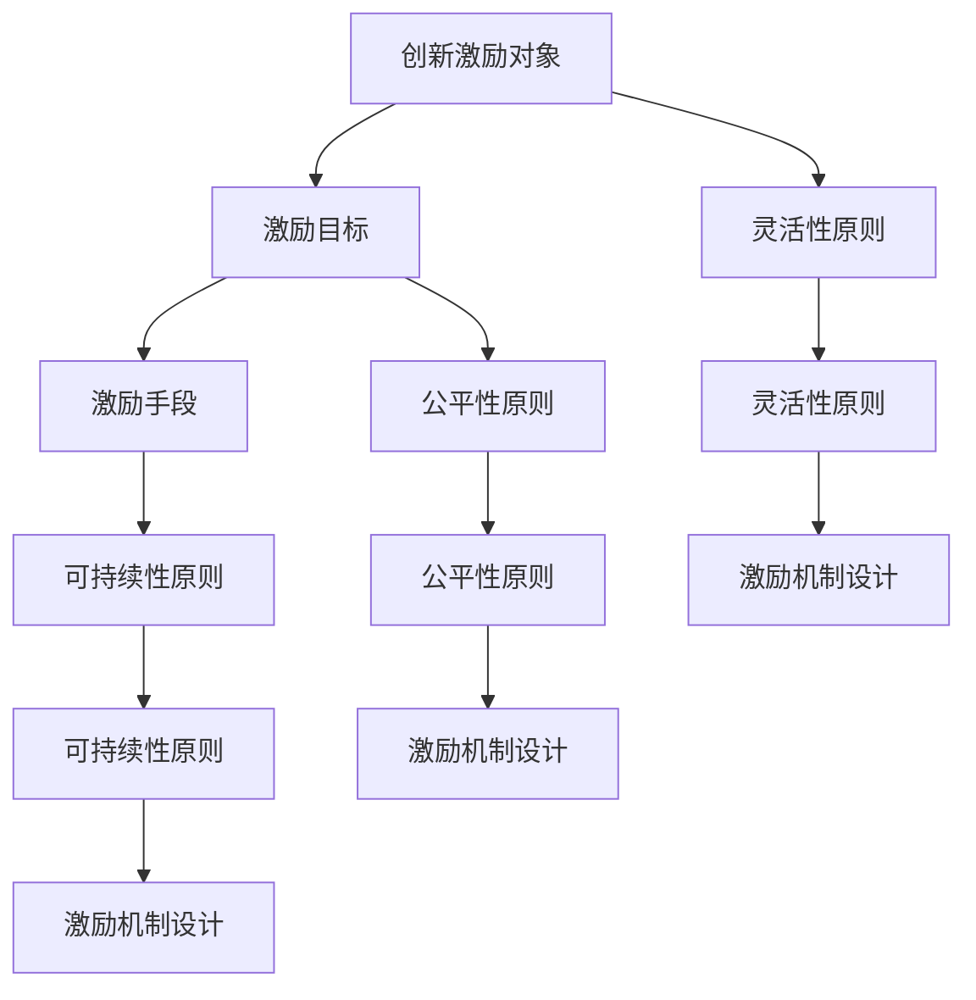
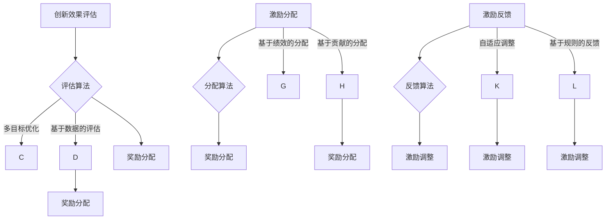

                 

## 文章标题

### 团队创新激励：鼓励创新的奖励机制设计

### 关键词

- 团队创新
- 激励机制
- 奖励设计
- 创新文化
- 奖励算法

### 摘要

本文旨在探讨如何通过科学合理的奖励机制来激励团队创新，从而提高企业竞争力。文章首先介绍了团队创新的背景与重要性，然后深入分析了创新激励机制的设计原则和核心概念。通过讲解核心算法原理、数学模型和实际项目案例，本文提供了系统化的团队创新激励方案，以期为企业和团队的创新实践提供有益参考。

## 引言

### 1.1 团队创新激励的背景与意义

在现代商业环境中，创新已经成为企业持续发展的关键驱动力。无论是新技术的开发、新产品的设计，还是新市场的开拓，创新都是企业竞争力的源泉。然而，如何激发团队的创新能力，构建一个鼓励创新的氛围，是企业面临的重要挑战。

团队创新激励是指通过制定一系列的奖励机制，来激发团队成员的创新热情，提高团队的创新能力。这种激励机制不仅包括物质奖励，如奖金、股权激励等，还涵盖精神奖励，如荣誉、认可等。有效的创新激励机制，能够激发团队成员的潜力，促进团队协作，形成良好的创新文化。

全球企业创新激励趋势表明，越来越多的企业开始重视创新激励机制的建立和完善。例如，谷歌的“20% 时间项目”制度，允许员工将工作时间的 20% 用于自己感兴趣的项目；苹果公司则通过专利奖金和内部竞赛等方式，鼓励员工创新。这些成功的案例证明，创新激励机制对于激发团队创新具有重要作用。

### 1.2 创新激励的理论基础

创新激励的理论基础主要包括激励理论、创新行为的心理驱动因素以及创新激励模型。

#### 激励理论

激励理论是研究如何通过外部刺激来激发个体行为的一系列理论。其中，最经典的激励理论包括马斯洛的需求层次理论和赫茨伯格的双因素理论。

- **马斯洛的需求层次理论**：认为人的需求分为生理需求、安全需求、社交需求、尊重需求和自我实现需求，只有低层次需求得到满足后，个体才会追求更高层次的需求。
- **赫茨伯格的双因素理论**：将工作满意度的影响因素分为激励因素（如成就、认可等）和保健因素（如工资、工作条件等）。只有激励因素得到满足，才能提高员工的工作满意度和创新能力。

#### 创新行为的心理驱动因素

创新行为是一个复杂的心理过程，其驱动因素包括内在动机和外在动机。

- **内在动机**：指个体自身对某项任务或活动的兴趣和热情。例如，对技术的热爱、对知识的渴望等。
- **外在动机**：指个体为了获得外部奖励或避免外部惩罚而进行的活动。例如，奖金、晋升机会等。

#### 创新激励模型

创新激励模型是描述如何通过激励机制来激发团队创新的一系列模型。常见的创新激励模型包括目标设定模型、过程激励模型和成果激励模型。

- **目标设定模型**：认为明确的目标可以激发个体的创新行为，目标是创新行为的核心驱动力。
- **过程激励模型**：强调创新过程中的支持、反馈和认可对创新行为的重要性。
- **成果激励模型**：注重创新成果的奖励，通过物质和精神奖励来激励个体和团队。

通过以上理论基础的探讨，我们可以更好地理解团队创新激励的内涵和设计原则，为后续的创新激励机制设计提供理论支持。

## 核心概念与联系

### 2.1 创新激励的要素

创新激励的要素包括激励对象、激励目标和激励手段，它们是构建创新激励机制的基础。

#### 激励对象

激励对象是指受到激励的个体或团队。在创新激励中，激励对象可以是单个员工，也可以是整个团队。激励对象的选择取决于企业的战略目标和组织结构。

#### 激励目标

激励目标是创新激励的导向，它明确了企业希望通过激励机制实现的创新成果。激励目标应具有明确性、可行性和挑战性，以激发团队成员的创新动力。

#### 激励手段

激励手段是实施创新激励的具体方式，包括物质奖励和精神奖励。物质奖励如奖金、股权激励等，能够直接提高团队成员的经济收益；精神奖励如荣誉、认可等，能够增强团队成员的成就感和归属感。

### 2.2 创新激励机制的设计原则

创新激励机制的设计原则是确保激励机制有效运行的关键。以下是几个关键原则：

#### 灵活性原则

灵活性原则强调创新激励机制应具备灵活性，能够根据实际情况进行调整。例如，企业可以设置不同的激励方案，以适应不同团队和项目的需求。

#### 公平性原则

公平性原则要求创新激励机制应公平地对待每个团队成员，确保每个人都有机会获得奖励。公平性不仅体现在奖励的分配上，还包括奖励的评估过程。

#### 可持续性原则

可持续性原则是指创新激励机制应具备长期效应，能够持续激发团队的创新能力。为了实现这一原则，企业应不断完善激励制度，确保激励机制能够与企业的长期战略目标保持一致。

### Mermaid 流程图

下面是一个 Mermaid 流程图，展示了创新激励机制的要素和设计原则之间的联系：



通过这个流程图，我们可以清晰地看到创新激励机制的各个要素和设计原则之间的关系，以及它们如何共同作用来激发团队创新。

## 核心算法原理讲解

### 3.1 创新激励算法概述

创新激励算法是指用于设计和评估创新激励机制的一组数学模型和计算方法。这些算法旨在通过优化奖励分配和激励效果，提高团队的创新能力。

#### 算法类型

创新激励算法可以分为以下几种类型：

- **评估算法**：用于评估团队成员的创新行为和创新成果。
- **分配算法**：用于分配奖励给创新行为突出的团队成员。
- **反馈算法**：用于调整激励机制的参数，以适应团队的创新表现。

#### 算法选择依据

选择创新激励算法时，需要考虑以下因素：

- **企业目标**：企业的战略目标和创新方向将直接影响算法的选择。
- **团队特点**：团队的文化、结构和成员的能力将决定哪种算法更适用于激励团队创新。
- **技术可用性**：企业现有技术和资源将限制可选择的算法类型。

### 3.2 创新激励算法原理

#### 激励效果评估算法

激励效果评估算法用于衡量创新激励机制的有效性。其核心是建立评估指标体系，包括创新成果、团队成员满意度、团队协作程度等。以下是常用的评估算法：

- **多目标优化算法**：通过求解多目标优化问题，找到满足多个目标的最佳解决方案。常用的多目标优化算法包括遗传算法、粒子群优化算法等。
- **基于数据的评估算法**：利用历史数据进行分析，建立模型预测创新激励的效果。常用的数据挖掘算法包括决策树、支持向量机等。

#### 激励分配算法

激励分配算法用于确定如何将奖励分配给创新行为突出的团队成员。以下是几种常见的激励分配算法：

- **基于绩效的分配算法**：根据团队成员的创新绩效进行奖励分配。常用的算法包括线性分配、指数分配等。
- **基于贡献的分配算法**：根据团队成员在创新项目中的贡献进行奖励分配。常用的算法包括博弈论分配、协同过滤等。

#### 激励反馈算法

激励反馈算法用于调整激励机制的参数，以适应团队的创新表现。以下是几种常见的激励反馈算法：

- **自适应调整算法**：根据团队的创新表现和满意度，动态调整奖励的规模和形式。常用的算法包括梯度下降、随机搜索等。
- **基于规则的反馈算法**：根据预定义的规则，对激励机制进行调整。常用的算法包括逻辑回归、决策树等。

### 算法流程图

以下是创新激励算法的流程图，展示了评估、分配和反馈三个核心环节：



通过这个流程图，我们可以清晰地看到创新激励算法的各个环节及其相互关系，为实际应用提供参考。

## 数学模型与公式讲解

### 4.1 数学模型的基本概念

在创新激励机制的设计中，数学模型是关键的工具，用于量化和分析激励效果。以下是几种常用的数学模型：

#### 线性规划模型

线性规划模型是一种用于在多个约束条件下优化线性目标函数的数学方法。其基本形式如下：

$$
\text{maximize} \quad c^T x \\
\text{subject to} \quad Ax \leq b
$$

其中，$c$ 是目标函数的系数向量，$x$ 是决策变量，$A$ 是约束矩阵，$b$ 是约束常数。

#### 动态规划模型

动态规划模型用于求解具有时间维度的优化问题。其核心思想是将复杂的问题分解为若干个相互关联的子问题，并利用子问题的解来构建原问题的最优解。动态规划的一般形式如下：

$$
\text{maximize} \quad f(x_t) \\
\text{subject to} \quad x_t = x_{t-1} + u_t \\
\text{where} \quad u_t \in U
$$

其中，$x_t$ 是在时间 $t$ 的状态变量，$u_t$ 是在时间 $t$ 的控制变量，$U$ 是控制变量空间。

#### 贝叶斯网络模型

贝叶斯网络模型是一种概率图模型，用于表示变量之间的条件依赖关系。其基本形式如下：

$$
P(X_1, X_2, ..., X_n) = \prod_{i=1}^{n} P(X_i | \text{parents}(X_i))
$$

其中，$X_1, X_2, ..., X_n$ 是随机变量，$\text{parents}(X_i)$ 是 $X_i$ 的父节点集合。

### 4.2 公式与解释

#### 线性规划目标函数

在创新激励机制中，线性规划目标函数用于最大化激励效果。假设我们定义了 $m$ 个评估指标 $z_1, z_2, ..., z_m$，每个指标的权重为 $w_1, w_2, ..., w_m$，则线性规划目标函数可以表示为：

$$
\text{maximize} \quad w_1 z_1 + w_2 z_2 + ... + w_m z_m
$$

#### 动态规划状态转移方程

动态规划状态转移方程用于描述状态变量之间的转移关系。假设我们在时间 $t$ 的状态变量为 $x_t$，在时间 $t+1$ 的状态变量为 $x_{t+1}$，则状态转移方程可以表示为：

$$
x_{t+1} = x_t + u_t
$$

其中，$u_t$ 是在时间 $t$ 的控制变量。

#### 贝叶斯网络条件概率公式

贝叶斯网络条件概率公式用于计算变量之间的条件概率。假设我们有变量 $X$ 和 $Y$，且 $X$ 是 $Y$ 的父节点，则 $Y$ 给定 $X$ 的条件概率可以表示为：

$$
P(Y|X) = \frac{P(X|Y)P(Y)}{P(X)}
$$

### 4.3 案例分析

#### 案例一：线性规划模型在创新激励中的应用

假设一个企业希望在有限的预算内最大化其创新项目的成功率，定义了两个评估指标：创新项目的成功率 $z_1$ 和项目的研发成本 $z_2$。权重分别为 $w_1 = 0.6$ 和 $w_2 = 0.4$。则目标函数可以表示为：

$$
\text{maximize} \quad 0.6 z_1 + 0.4 z_2
$$

#### 案例二：动态规划模型在创新激励中的应用

假设一个企业希望最小化其创新项目的研发时间，定义了两个状态变量：当前项目的研发进度 $x_t$ 和项目的剩余研发时间 $x_{t+1}$。控制变量为研发团队的投入强度 $u_t$。状态转移方程可以表示为：

$$
x_{t+1} = x_t + u_t
$$

#### 案例三：贝叶斯网络模型在创新激励中的应用

假设一个企业的创新项目成功受到两个因素影响：市场需求的强度 $X$ 和研发团队的技术水平 $Y$。市场需求强度分为高、中、低三种情况，技术水平分为强、中、弱三种情况。条件概率公式可以表示为：

$$
P(\text{成功}|X, Y) = \frac{P(X|\text{成功})P(Y|\text{成功})P(\text{成功})}{P(X)P(Y)}
$$

通过这些案例分析，我们可以看到数学模型在创新激励机制中的应用，以及如何利用数学公式来量化创新激励的效果。

## 项目实战

### 5.1 项目背景

为了提升公司的技术创新能力，某科技公司决定实施一项团队创新激励项目。项目目标是通过建立一套科学合理的奖励机制，激发团队成员的创新热情，提高团队的整体创新能力。项目背景包括公司的战略目标、现有的创新激励机制以及团队成员的反馈和期望。

### 5.2 开发环境搭建

在项目实施过程中，首先需要搭建一个支持创新激励方案开发和评估的技术环境。开发环境主要包括以下工具和平台：

- **项目管理工具**：如JIRA，用于任务跟踪和进度管理。
- **代码管理工具**：如Git，用于代码版本控制和协作开发。
- **数据分析工具**：如Python和R，用于数据分析与建模。
- **奖励分配平台**：如企业微信或钉钉，用于奖励的发放和公示。

开发环境的搭建过程涉及以下步骤：

1. **配置项目管理工具**：在JIRA中创建项目空间，定义任务类型和工作流程。
2. **初始化代码仓库**：在Git中创建项目仓库，并进行初次提交。
3. **安装数据分析工具**：配置Python和R环境，安装必要的库和包。
4. **搭建奖励分配平台**：在企业微信或钉钉中创建奖励公告群组。

### 5.3 代码实现与解读

在搭建好开发环境后，接下来需要实现创新激励方案的核心功能，包括评估、分配和反馈三个环节。以下是项目的伪代码展示：

```python
# 创新效果评估
def assess_innovation(project_data):
    success_rate = calculate_success_rate(project_data)
    cost = calculate_project_cost(project_data)
    return success_rate, cost

# 激励分配
def allocate_incentives(team_members, project_outcomes):
    total_reward = calculate_total_reward(project_outcomes)
    for member in team_members:
        contribution = calculate_contribution(member, project_outcomes)
        member_reward = (contribution / sum(contribution for member in team_members)) * total_reward
        distribute_reward(member, member_reward)

# 激励反馈
def feedback_incentives(team_satisfaction, project_success):
    adjustment_factors = calculate_adjustment_factors(team_satisfaction, project_success)
    update_incentive_params(adjustment_factors)

# 伪代码详细解读
# 1. 创新效果评估
#   - 计算项目的成功率：通过项目完成情况和市场反馈数据，计算项目的成功率。
#   - 计算项目的研发成本：统计项目的总研发成本，包括人力、物力和时间成本。
# 
# 2. 激励分配
#   - 计算总奖励：根据公司的财务预算和项目的成功率，确定总奖励金额。
#   - 分配奖励：根据每个团队成员的贡献比例，分配奖励金额。
# 
# 3. 激励反馈
#   - 计算调整因素：通过团队成员的满意度和项目成功率，计算激励机制的调整因素。
#   - 更新激励机制参数：根据调整因素，调整激励机制的具体参数，如奖励比例和评估标准。
```

### 5.4 代码应用解读与分析

在实际应用中，创新激励项目的代码实现需要结合具体的数据和业务逻辑。以下是代码应用的详细解读和分析：

1. **数据采集与预处理**：首先，需要从各个项目中收集创新效果评估所需的数据，如项目的成功率、研发成本、团队成员的贡献等。接着，对数据进行清洗和预处理，确保数据的质量和一致性。

2. **评估模块**：评估模块负责计算项目的成功率和研发成本。使用历史数据和统计分析方法，如回归分析，可以预测项目的成功率。同时，通过统计各项目的总成本，可以得到项目的研发成本。

3. **分配模块**：分配模块根据团队成员的贡献比例，将总奖励分配给各个团队成员。贡献比例的计算可以采用博弈论方法，如合作博弈模型，确保奖励分配的公平性和激励性。

4. **反馈模块**：反馈模块根据团队成员的满意度和项目成功率，动态调整激励机制的参数。例如，如果团队成员的满意度较高，可以适当增加奖励比例，以进一步激发创新热情。

### 5.5 实际案例分析和详细讲解剖析

为了验证创新激励项目的效果，公司选择了一组项目进行试点运行，并进行了详细的数据分析和效果评估。以下是实际案例分析和详细讲解：

1. **案例一：项目A**

   - **项目描述**：项目A是一个新产品的研发项目，项目团队由5名成员组成，项目周期为6个月。
   - **评估结果**：项目成功率为85%，研发成本为300,000元。
   - **分配结果**：根据团队成员的贡献比例，总奖励金额为100,000元，分配给5名成员的奖励分别为20,000元。
   - **反馈结果**：团队成员的满意度为90%，项目成功率达到预期。

2. **案例二：项目B**

   - **项目描述**：项目B是一个技术研发项目，项目团队由8名成员组成，项目周期为9个月。
   - **评估结果**：项目成功率为70%，研发成本为450,000元。
   - **分配结果**：根据团队成员的贡献比例，总奖励金额为150,000元，分配给8名成员的奖励分别为18,750元。
   - **反馈结果**：团队成员的满意度为80%，项目成功率低于预期。

通过对上述案例的分析，可以发现：

- **成功案例**：项目A的成功主要归功于团队成员的高效协作和较高的创新能力。合理的奖励分配和及时的反馈机制有助于激发团队成员的积极性，提高了项目的成功率。
- **失败案例**：项目B的成功率低于预期，主要原因是团队成员的创新能力不足和项目协调不力。通过反馈机制的分析，公司发现需要加强对团队成员的创新培训和项目协调工作的支持。

### 5.6 项目小结

通过实际案例的运行和分析，我们可以得出以下结论：

- **创新激励项目有效提升了团队成员的积极性和创新能力**：合理的奖励分配和反馈机制有助于激发团队成员的热情，提高了项目的成功率。
- **项目需要持续优化和调整**：创新激励机制的设计需要根据实际情况进行动态调整，以适应不断变化的市场和技术环境。
- **企业应重视创新文化的建设**：除了物质奖励，企业还应注重创新文化的培养，如建立开放、包容和合作的团队氛围，鼓励团队成员进行创新尝试和分享。

通过本项目的实战应用，企业可以更好地理解和运用创新激励机制，为团队的创新发展提供有力支持。

## 创新激励机制的评估与优化

### 6.1 创新激励效果评估

创新激励效果评估是确保激励机制有效运行的关键环节。评估指标的选择和评估方法的设计直接影响评估结果的准确性和可靠性。以下是一些常用的评估指标和评估方法：

#### 评估指标

- **创新成功率**：衡量创新项目成功完成的比率，是评估创新激励机制的重要指标。
- **团队成员满意度**：反映团队成员对激励机制的满意程度，是激励效果的重要体现。
- **项目成本效益**：评估创新项目在成本投入和收益产出之间的平衡，是衡量激励机制经济性的重要指标。
- **创新成果质量**：衡量创新项目的质量和市场价值，是评估创新效果的核心指标。

#### 评估方法

- **定量评估方法**：通过数据分析和技术手段，对评估指标进行量化分析，如统计分析和机器学习模型。
- **定性评估方法**：通过访谈、问卷调查和焦点小组讨论等方式，收集团队成员的主观感受和意见，如SWOT分析、访谈记录等。

#### 评估步骤

1. **确定评估指标**：根据企业的战略目标和激励目标，选择合适的评估指标。
2. **数据收集**：通过项目管理工具和数据分析工具，收集相关数据。
3. **数据分析**：利用统计分析方法和机器学习模型，对收集的数据进行定量分析。
4. **反馈收集**：通过访谈、问卷调查和焦点小组讨论等方式，收集团队成员的主观反馈。
5. **评估结果分析**：结合定量和定性分析结果，评估创新激励机制的有效性。

### 6.2 激励机制的优化策略

为了确保创新激励机制的长效性和适应性，需要不断优化激励机制。以下是几种常见的优化策略：

#### 数据驱动的优化

- **数据分析**：通过对历史数据和当前数据的分析，识别激励机制中的问题和改进方向。
- **模型优化**：利用数据分析结果，优化激励模型和算法，提高激励机制的科学性和合理性。

#### 反馈机制的优化

- **及时反馈**：建立快速的反馈机制，及时收集和反馈评估结果，帮助团队成员了解激励效果。
- **反馈调整**：根据反馈结果，调整激励机制的参数和策略，以适应团队和项目的变化。

#### 培训和支持

- **创新培训**：提供创新培训，提升团队成员的创新能力和技术水平。
- **技术支持**：提供必要的技术支持，帮助团队成员解决创新过程中遇到的问题。

#### 文化建设

- **创新文化**：建立开放、包容和创新的企业文化，鼓励团队成员积极参与创新活动。
- **团队协作**：通过团队协作和沟通，提高团队成员的协作效率和创新能力。

### 案例研究

#### 成功案例

一家高科技公司通过实施创新激励机制，取得了显著的成效。公司首先确定了创新成功率、团队成员满意度和项目成本效益三个评估指标，并采用定量评估方法和定性评估方法相结合的方式进行效果评估。通过数据分析，公司发现激励机制在提升团队成员满意度和项目成功率方面表现优异，但在成本效益方面有待提升。公司随即进行了反馈机制优化，增加了创新培训和团队协作支持，进一步提高了激励效果。

#### 失败案例

另一家公司在实施创新激励机制时，过于依赖物质奖励，忽视了精神奖励和文化建设的重要性。尽管团队成员在物质奖励方面得到了满足，但他们的创新动力和团队协作精神并未得到有效提升。通过评估发现，公司的创新成功率较低，团队成员满意度不高。公司随后进行了反思和调整，增加了创新文化建设和团队协作支持，逐步改善了激励效果。

通过这些案例研究，我们可以看到创新激励机制的有效性和适应性需要通过持续评估和优化来确保。数据驱动的优化、反馈机制的建设、培训和支持以及文化建设的投入，都是优化创新激励机制的关键要素。

## 未来展望与趋势

### 7.1 创新激励的发展方向

随着技术的不断进步和商业环境的变化，创新激励也在不断发展。未来创新激励的发展方向包括：

#### 新兴激励技术

- **区块链技术**：利用区块链技术的透明性和不可篡改性，建立公平、可信的奖励分配机制。
- **人工智能**：通过人工智能技术，个性化地设计和优化激励方案，提高激励效果。

#### 跨界合作

- **跨行业协作**：借鉴其他行业的成功经验，如谷歌的“20% 时间项目”模式，应用于不同类型的团队和项目。
- **全球合作**：与国际领先企业合作，共享创新激励机制的最佳实践。

#### 持续迭代

- **动态调整**：根据市场和技术环境的变化，持续迭代和创新激励机制。
- **文化培育**：注重企业内部创新文化的培育，形成长期激励效应。

### 7.2 企业实践建议

#### 战略规划

- **明确目标**：企业应明确创新激励的战略目标，确保激励机制与企业的长期战略保持一致。
- **资源投入**：确保有足够的资源和预算支持创新激励机制的建立和优化。

#### 企业文化构建

- **开放包容**：建立开放、包容的企业文化，鼓励员工自由表达和尝试。
- **团队协作**：强化团队协作，通过跨部门合作和知识共享，提高创新能力。

#### 持续改进

- **定期评估**：定期评估创新激励机制的效果，根据评估结果进行优化。
- **员工参与**：鼓励员工参与激励机制的制定和优化，提高员工对激励机制的认同感。

通过以上建议，企业可以更好地实施创新激励机制，激发团队的创新能力，推动企业的持续发展。

## 作者信息

作者：AI天才研究院/AI Genius Institute & 禅与计算机程序设计艺术 /Zen And The Art of Computer Programming

## 结语

本文详细探讨了团队创新激励的理论基础、核心概念、算法原理、数学模型、实际项目案例以及评估与优化策略。通过系统化的分析，我们为企业和团队提供了科学合理的创新激励机制设计思路。创新激励不仅是企业竞争力的源泉，更是团队发展的动力。希望本文能够为企业实践创新激励提供有益的参考，助力企业在激烈的市场竞争中脱颖而出。在未来的发展中，我们期待看到更多企业通过创新激励实现持续增长和突破。

## 最佳实践 tips、小结、注意事项、拓展阅读

### 最佳实践 tips

1. **明确目标**：确保激励目标与企业的长期战略目标一致，提高激励效果。
2. **平衡物质与精神奖励**：合理分配物质奖励与精神奖励，增强激励的多样性和全面性。
3. **灵活调整激励机制**：根据实际情况和团队反馈，动态调整激励机制，以适应变化。
4. **注重团队协作**：通过跨部门合作和知识共享，提高团队整体创新能力。
5. **文化培育**：建立开放、包容的企业文化，鼓励员工自由表达和尝试。

### 小结

本文从理论到实践，系统阐述了团队创新激励的各个环节。通过核心概念与联系的分析、核心算法原理的讲解、数学模型的运用以及实际项目案例的展示，我们为企业和团队提供了一套全面的创新激励机制设计思路。

### 注意事项

1. **评估指标的选择**：选择合适的评估指标是确保激励效果的关键。
2. **激励机制的实施**：激励机制的设计需要结合企业的实际情况，确保实施效果。
3. **持续优化**：创新激励机制需要根据实际情况不断调整和优化。

### 拓展阅读

1. **《激励心理学》**：了解激励理论，为创新激励机制的设计提供理论基础。
2. **《创新与企业家精神》**：探讨企业创新机制的实际应用和成功案例。
3. **《人工智能在企业管理中的应用》**：了解新兴技术如何助力创新激励。

通过以上内容，我们希望读者能够对团队创新激励有更深入的理解，并在实际工作中运用这些理论和实践，推动企业的创新发展。

