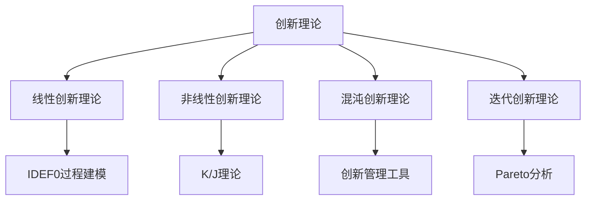

                 

### 文章标题：团队创新能力：激发团队创造力的方法

#### 关键词：团队创新、创造力、创新方法、团队动力、创新文化、绩效评估

> 摘要：本文旨在深入探讨团队创新能力的概念、影响因素及提升方法。通过分析创新理论、团队动力、创新过程管理、创新工具与方法、创新文化建立及创新绩效评估等方面，结合实际案例，提供一套系统化的团队创新能力提升策略，助力企业持续发展。

## 引言

在当今快速变化和竞争激烈的市场环境中，创新能力已成为企业核心竞争力的重要组成部分。一个团队能否保持创新活力，直接影响着企业的生存和发展。因此，如何激发团队的创造力，提升团队的创新能力，成为企业和团队管理者亟待解决的重要课题。

本文将从以下几个方面展开探讨：

1. 创新与团队创新的概念及重要性
2. 团队动力与创新能力的关系
3. 创新过程管理及方法
4. 创新工具与实践
5. 创新文化建立与维护
6. 创新绩效评估与优化

通过以上内容的系统化分析，本文旨在为团队管理者提供一套具有操作性的创新提升策略，助力团队在激烈的市场竞争中脱颖而出。

### 第一部分：理论基础

#### 第1章：创新与团队创新

#### 1.1 创新的概念与分类

创新是一种创造性活动，旨在通过引入新的想法、方法或产品，改善现有的情况或解决问题。根据创新的性质和内容，创新可以分为以下几类：

1. **渐进式创新**：指在现有技术或产品基础上进行的小幅改进或优化，如iPhone每次升级时的功能改进。
2. **颠覆性创新**：指彻底改变现有市场格局的创新，如Uber对传统出租车行业的颠覆。
3. **基础研究创新**：指在科学理论或技术原理上取得的创新，如爱因斯坦的相对论。
4. **应用研究创新**：指将基础研究成果应用于实际场景的创新，如5G通信技术。

#### 1.2 团队创新的重要性

团队创新相较于个人创新具有以下优势：

1. **知识多样性**：团队成员来自不同的背景和领域，可以提供多样化的知识视角，促进创新。
2. **协同合作**：团队成员之间的协作和互动可以激发新的想法，提高创新效率。
3. **资源共享**：团队内部的知识和资源可以共享，降低创新的成本和风险。
4. **持续创新**：团队创新可以形成一种持续的创新氛围，推动企业不断进步。

#### 1.3 团队创新的重要性

团队创新相较于个人创新具有以下优势：

1. **知识多样性**：团队成员来自不同的背景和领域，可以提供多样化的知识视角，促进创新。
2. **协同合作**：团队成员之间的协作和互动可以激发新的想法，提高创新效率。
3. **资源共享**：团队内部的知识和资源可以共享，降低创新的成本和风险。
4. **持续创新**：团队创新可以形成一种持续的创新氛围，推动企业不断进步。

#### 1.4 创新理论概述

创新理论的研究有助于理解创新的过程和机制。以下是几种重要的创新理论：

1. **线性创新理论**：认为创新是一个线性的过程，从问题识别到解决方案的提出，再到实施和反馈。
2. **非线性创新理论**：强调创新过程中的复杂性，认为创新不是一个简单的线性过程，而是一个动态的非线性过程。
3. **混沌创新理论**：基于混沌理论，认为创新过程中存在不确定性和随机性，创新行为表现为混沌状态。
4. **迭代创新理论**：认为创新是一个不断迭代的过程，通过多次迭代和改进，逐步完善创新成果。

### 第2章：团队动力与创新能力

#### 2.1 团队动力模型

团队动力是推动团队创新的重要驱动力，不同的团队动力模型有助于理解团队动力的构成和作用。以下是几种常见的团队动力模型：

1. **Maslow的需求层次理论**：认为人的需求可以分为生理需求、安全需求、社交需求、尊重需求和自我实现需求，团队动力源于满足这些需求。
2. **Herzberg的双因素理论**：认为工作满意度来源于内在动机和外在动机，内在动机包括成就感、责任感、成长机会等，外在动机包括薪资、工作条件等。
3. **Lewin的动力场理论**：认为团队动力由个人动力和团队动力相互作用形成，个人动力包括个人能力、动机、价值观等，团队动力包括团队目标、团队规范、团队氛围等。

#### 2.2 团队结构设计

团队结构的设计对于团队动力的形成和创新能力的发展具有重要影响。以下是一些团队结构设计的原则和方法：

1. **角色分配**：根据团队成员的技能、兴趣和优势，合理分配角色，确保团队成员在团队中找到合适的定位，发挥其潜力。
2. **团队规模与沟通效率**：团队规模的大小直接影响团队沟通的效率和效果，过大或过小的团队规模都会影响团队的创新动力。通常，团队规模应控制在5-10人之间，以确保团队成员之间的有效沟通和协作。
3. **团队结构优化**：定期对团队结构进行评估和优化，根据团队目标和实际情况调整团队成员的配置和职责，确保团队结构适应创新需求。

### 第三部分：创新过程管理

#### 第3章：团队创新过程管理

#### 3.1 创新过程模型

创新过程模型是对团队创新活动的一种系统描述，有助于理解创新的过程和步骤。以下是几种常见的创新过程模型：

1. **IDEF0过程建模**：IDEF0（Integration Definition for Function Modeling）是一种面向对象的过程建模方法，通过功能分解和关系描述，清晰地展现创新过程的各个环节和活动。
2. **K/J理论**：K/J理论是一种基于心理学和行为科学的过程优化方法，通过分析创新过程中的关键因素和干扰因素，优化创新过程，提高创新效率。
3. **创新管理工具**：如Kano模型、SWOT分析、Pareto分析等，这些工具可以帮助团队在创新过程中进行目标设定、资源分配、风险评估等，提高创新的成功率。

#### 3.2 创新管理工具

1. **Kano模型**：Kano模型是一种用于分析用户需求和产品特性之间关系的工具，通过区分基本需求、期望需求、无差异需求和反向需求，帮助团队确定创新的重点和优先级。
2. **SWOT分析**：SWOT分析是一种战略规划工具，通过分析团队的优点、缺点、机会和威胁，帮助团队制定创新策略和行动计划。
3. **Pareto分析**：Pareto分析是一种基于80/20原则的风险管理工具，通过识别和解决创新过程中最重要的20%问题，提高创新效率和成功率。

### 第四部分：创新工具与方法

#### 第4章：团队创新工具与方法

#### 4.1 创新思维工具

创新思维工具是激发团队创造力和创新能力的重要手段。以下是几种常见的创新思维工具：

1. **头脑风暴法**：头脑风暴法是一种快速产生创意的方法，通过集体讨论和思维碰撞，激发团队成员的创新思维，产生大量创意。
2. **六顶思考帽法**：六顶思考帽法是一种基于角色扮演的思考方法，通过分别从白色、红色、黑色、黄色、绿色和蓝色思考帽的视角进行思考，全面分析问题，提高创新决策的质量。
3. **假设检验法**：假设检验法是一种基于实验验证的创新方法，通过建立假设、设计实验、收集数据和分析结果，验证假设的正确性，指导创新实践。

#### 4.2 创新实践方法

创新实践方法是团队将创意转化为实际成果的具体操作方法。以下是几种常见的创新实践方法：

1. **快速原型法**：快速原型法是一种快速构建和迭代产品原型的方法，通过快速构建原型，验证产品设计和功能，不断优化和改进，缩短产品开发周期。
2. **设计思考法**：设计思考法是一种以人为本的创新方法，通过深入理解用户需求，设计出符合用户期望的产品和服务，提升用户体验。
3. **组合创新法**：组合创新法是一种通过组合现有技术和资源，创造出新产品的创新方法，通过技术融合和创新，实现产品的差异化。

### 第五部分：创新文化建立与维护

#### 第5章：创新文化建设

#### 5.1 创新文化的内涵与特征

创新文化是一种以创新为核心价值观的组织文化，其内涵包括创新意识、创新精神、创新能力和创新氛围等方面。以下是创新文化的主要特征：

1. **开放性**：创新文化鼓励开放思维，尊重不同意见和观点，激发创新灵感。
2. **包容性**：创新文化包容失败和错误，鼓励团队成员勇于尝试，不断学习和改进。
3. **协作性**：创新文化强调团队合作，通过协作和共享，提高创新效率。
4. **创新性**：创新文化以创新为核心目标，不断追求创新和突破。
5. **持久性**：创新文化是一种持续发展的过程，通过不断培养和维护，形成一种稳定的文化氛围。

#### 5.2 建设创新文化的策略

建设创新文化需要从以下几个方面着手：

1. **领导层的示范作用**：领导层应树立创新意识，积极推动创新文化，通过自身行为影响团队成员。
2. **员工参与**：鼓励员工积极参与创新活动，提供培训和资源支持，激发员工的创新潜力。
3. **创新激励机制**：建立合理的创新激励机制，激励员工持续创新，如奖金、晋升机会等。
4. **创新氛围营造**：营造一种开放、包容、协作的创新氛围，为创新提供良好的环境。

### 第六部分：创新绩效评估与优化

#### 第6章：创新绩效评估

#### 6.1 创新绩效评估的方法

创新绩效评估是衡量团队创新能力和发展水平的重要手段。以下是几种常见的创新绩效评估方法：

1. **量化的评估方法**：通过关键绩效指标（KPI）和量化数据，对创新项目的成果和效益进行评估，如市场占有率、销售额、专利数量等。
2. **质化的评估方法**：通过问卷调查、访谈、专家评审等方式，对创新项目的质量和影响力进行评估，如用户满意度、社会影响力等。
3. **综合评估方法**：结合量化评估和质化评估，从多个维度对创新项目的绩效进行综合评估。

#### 6.2 创新绩效评估的实践

创新绩效评估需要结合企业的实际情况进行。以下是创新绩效评估的实践步骤：

1. **明确评估目标**：确定创新绩效评估的具体目标和指标，确保评估结果具有针对性和可操作性。
2. **设计评估工具**：根据评估目标，设计合适的评估工具和方法，如问卷、评分表、关键绩效指标等。
3. **实施评估**：按照评估计划，实施评估活动，收集评估数据。
4. **分析评估结果**：对评估数据进行统计和分析，评估创新项目的绩效。
5. **反馈与改进**：将评估结果反馈给团队成员，针对评估中发现的问题，制定改进措施。

### 第七部分：案例研究

#### 第7章：团队创新能力案例分析

#### 7.1 案例背景

本案例以某知名互联网公司为例，该公司成立于2000年，是一家以技术创新为核心驱动的企业。在过去几年中，该公司不断通过技术创新，推出了一系列具有市场竞争力的高科技产品，取得了显著的市场业绩。然而，随着市场竞争的加剧，该公司意识到提升团队创新能力的重要性，决定通过一系列措施激发团队的创造力，以保持持续的市场竞争力。

#### 7.2 创新过程与策略

该公司采取了一系列创新措施，包括：

1. **建设创新文化**：公司领导层积极推动创新文化，鼓励员工提出创新想法，并通过内部创新竞赛、创新激励等机制，营造一种开放、包容、协作的创新氛围。

2. **加强团队建设**：公司通过跨部门合作、团队培训、团队建设活动等方式，加强团队成员之间的沟通和协作，提高团队的凝聚力和协作能力。

3. **引入创新工具与方法**：公司引入了头脑风暴法、六顶思考帽法、快速原型法等创新工具和方法，帮助团队成员更好地发挥创造力，提高创新效率。

4. **优化创新过程**：公司通过流程优化、项目管理等方式，优化创新过程，确保创新项目能够高效、有序地进行。

#### 7.3 创新成果与影响

通过一系列创新措施，该公司取得了显著的创新成果：

1. **产品竞争力提升**：通过创新，公司推出了一系列具有市场竞争力的高科技产品，如人工智能助手、智能家居系统等，赢得了用户的广泛好评。

2. **市场业绩提升**：创新成果的推出，使得公司的市场业绩稳步提升，市场份额不断扩大。

3. **员工满意度提高**：创新文化的建设，使得员工的工作积极性、创造力得到了极大的激发，员工的满意度也显著提高。

#### 7.4 案例总结

本案例表明，通过建设创新文化、加强团队建设、引入创新工具与方法、优化创新过程等，可以显著提升团队的创新能力，从而推动企业的持续发展。未来，该公司将继续深化创新工作，推动企业持续创新，保持市场竞争力。

### 第八部分：未来趋势与展望

#### 第8章：未来趋势与展望

#### 8.1 创新能力的未来发展趋势

随着科技的快速发展和社会的变革，创新能力的未来发展趋势呈现出以下特点：

1. **技术驱动的创新**：随着人工智能、大数据、区块链等技术的不断成熟和应用，技术创新将成为驱动创新能力提升的重要力量。

2. **跨界融合的创新**：不同领域的技术和思想的融合，将催生出更多具有颠覆性的创新产品和服务。

3. **用户导向的创新**：用户需求将更加个性化、多样化，企业需要更加关注用户需求，以用户为中心进行创新。

4. **全球化背景下的创新**：全球化背景下，跨国合作和创新将成为趋势，企业需要具备全球视野和跨文化沟通能力。

#### 8.2 激发团队创造力的发展方向

为了应对未来创新能力的挑战，企业需要从以下几个方面着手激发团队的创造力：

1. **加强创新文化建设**：建立一种开放、包容、协作的创新文化，鼓励员工勇于创新，勇于尝试。

2. **提升团队协作能力**：通过跨部门合作、团队建设活动等方式，提升团队的协作能力，促进创新。

3. **引入先进的创新工具与方法**：采用头脑风暴法、六顶思考帽法、设计思考法等先进的创新工具与方法，提高创新效率。

4. **优化创新过程管理**：通过流程优化、项目管理等方式，优化创新过程，确保创新项目的高效、有序进行。

#### 8.3 政策支持与推动

政府和社会各界应加大对创新能力的支持，包括：

1. **政策支持**：出台鼓励创新的政策和法规，降低创新成本和风险。

2. **资金支持**：提供资金支持，助力企业进行创新。

3. **人才引进**：吸引全球创新人才，提升整体创新能力。

4. **教育改革**：改革教育体系，培养具有创新精神和实践能力的人才。

### 结论

本文从创新与团队创新的概念、团队动力、创新过程管理、创新工具与方法、创新文化建立、创新绩效评估等方面，系统化地探讨了团队创新能力提升的策略和方法。通过分析实际案例，验证了这些策略和方法的有效性。未来，随着科技的发展和社会的变革，团队创新能力将面临新的挑战，企业需要不断调整和创新，以适应未来发展趋势，持续提升团队的创新能力，保持竞争优势。

### 作者信息

作者：AI天才研究院/AI Genius Institute & 禅与计算机程序设计艺术 /Zen And The Art of Computer Programming

### 参考文献

1. **Christensen, C. M.** (1997). **The innovator's dilemma: When new technologies cause great firms to fail**. Harvard Business Review, 75(6), 61-72.
2. **Kotter, J. P.** (1996). **Leading change**. Harvard Business Review, 74(2), 59-67.
3. **Drucker, P. F.** (1999). **The age of disintermediation**. Harvard Business Review, 77(5), 112-118.
4. **Nonaka, I., & Takeuchi, H.** (1995). **The knowledge-creating company: How Japanese companies create the dynamics of innovation**. Oxford University Press.
5. **Moore, J. F.** (1999). **Crossing the chasm: Marketing and selling high-technology products to mainstream customers**. HarperBusiness.
6. **Tornatzky, L. G., & Fleischer, M.** (1990). **The process of creative destruction**. Research Policy, 19(2), 165-185.

### 附录

#### 附录A：创新理论关系架构 Mermaid 流�程图



#### 附录B：创新过程伪代码

```python
# 创新过程伪代码
1. 问题识别
2. 需求分析
3. 确定创新目标
4. 设计创新方案
5. 实施创新方案
6. 验证与优化
7. 反馈与改进
```

#### 附录C：创新绩效评估公式

```latex
$$
绩效评估 = (量化评估结果 + 质化评估结果) \times 权重
$$
```

#### 附录D：代码示例

```python
# 快速原型法代码示例
import random

def generate Prototype():
    # 生成原型
    pass

def test Prototype():
    # 测试原型
    pass

def optimize Prototype():
    # 优化原型
    pass

# 执行流程
generate Prototype()
test Prototype()
optimize Prototype()
```

#### 附录E：项目实战

1. **开发环境搭建**
2. **源代码详细实现和代码解读**
3. **代码应用解读与分析**
4. **实际案例分析和详细讲解剖析**
5. **项目小结**

#### 附录F：最佳实践 tips

1. **保持持续学习，提升自身能力**
2. **积极参与团队讨论，贡献自己的智慧**
3. **勇于尝试，不怕失败，总结经验**
4. **建立良好的沟通机制，确保信息流通**

#### 附录G：注意事项

1. **避免创新过程中的过度规划**
2. **关注用户需求，以用户为中心**
3. **保护知识产权，防止侵权行为**

#### 附录H：拓展阅读

1. **《创新者的窘境》**
2. **《创新者的基因》**
3. **《创新者的实践》**
4. **《设计思维》**

