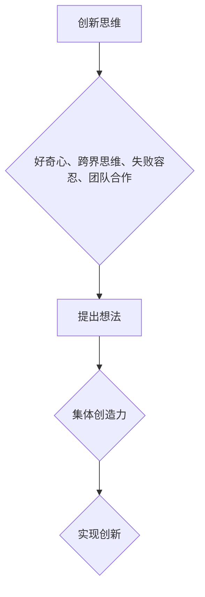

                 

### 文章标题

# 团队创新：激发集体创造力

> 关键词：团队创新、集体创造力、团队协作、沟通技巧、领导力提升

> 摘要：本文旨在探讨团队创新的核心概念和实践方法，通过理论解析、实战案例和最佳实践，深入剖析如何激发集体创造力，实现团队高效协作和持续创新。

---

## 引言

在当今快速变化和高度竞争的商业环境中，创新成为企业保持竞争力的关键因素。团队创新作为一种系统化、组织化的创新方式，能够在短时间内集中集体的智慧和力量，实现突破性的创新成果。本文将探讨团队创新的定义、重要性及其实现方法，旨在为IT领域的技术团队提供一套行之有效的创新实践指南。

### 团队创新的重要性

团队创新不仅能够推动技术进步，还能激发员工潜能，提升团队凝聚力。在IT行业中，随着技术的不断演进和市场竞争的加剧，企业必须不断进行技术创新以满足客户需求，这离不开团队创新的支撑。团队创新的重要性体现在以下几个方面：

1. **提高产品竞争力**：通过团队创新，企业能够更快地响应市场需求，开发出更具竞争力的产品和服务。
2. **激发员工潜能**：团队创新能够激发员工的创造力和积极性，提高员工的工作满意度和忠诚度。
3. **增强团队凝聚力**：共同的创新目标能够增强团队成员之间的沟通与合作，提升团队的整体效能。

### 集体创造力的价值

集体创造力是团队创新的核心驱动力。它不仅仅是单个成员的创造力的简单叠加，更是一种在团队内部形成的协同效应。集体创造力的价值体现在：

1. **多样化的视角**：团队成员来自不同的背景和领域，能够提供多样化的视角，从而发现更广泛的问题解决方案。
2. **互补性技能**：团队中每个成员都有独特的技能和知识，通过互补性合作，能够实现更高效的创新过程。
3. **共同目标**：团队共同的目标能够激发成员的积极性和创造力，形成强大的创新动力。

## 团队创新理论

团队创新不是偶然发生的，它需要理论基础和系统的方法来指导。以下是对团队创新理论的简要概述，以及如何理解其核心概念与联系。

### 创新理论的起源与发展

创新理论的发展可以追溯到20世纪初，当时泰勒等管理学家开始研究如何通过科学管理提高生产效率。随着时代的变迁，创新理论也在不断演进。重要的发展包括：

1. **精益创新**：以丰田为代表的企业提出了精益生产理念，强调通过不断改进流程来降低成本、提高效率。
2. **开放式创新**：企业不再局限于内部资源，而是通过外部合作、开放创新平台等途径来获取外部资源，加速创新过程。
3. **设计思维**：强调用户需求的重要性，通过迭代设计方法来实现创新。

### 创新思维的关键要素

创新思维是团队创新的核心。以下是创新思维的关键要素：

1. **好奇心**：对未知事物保持好奇，不断探索和提问，是创新思维的基础。
2. **跨界思维**：通过跨越不同领域和学科的界限，寻找新的问题和解决方案。
3. **失败容忍**：创新过程中不可避免会遇到失败，团队需要有容忍失败的文化，以便从失败中学习。
4. **团队合作**：创新需要团队合作，通过成员之间的协同合作，实现整体创新能力的提升。

### 创新思维与集体创造力的关系

创新思维和集体创造力是相辅相成的。创新思维为团队提供了创新的方法和工具，而集体创造力则是将这些思维转化为实际成果的关键。以下是两者之间的关系：

1. **创新思维激发创造力**：通过创新思维，团队成员能够提出新颖的想法，这些想法是集体创造力的源泉。
2. **集体创造力实现创新**：通过集体合作，创新思维中的想法可以得到进一步发展和验证，最终实现创新。

为了更好地理解创新思维和集体创造力的关系，我们可以使用Mermaid流程图来展示：

这个流程图展示了创新思维如何通过激发集体创造力来实现创新。

## 团队协作与沟通

团队协作与沟通是团队创新过程中不可或缺的部分。有效的团队协作和沟通能够确保团队成员之间的紧密合作，提高创新效率。以下是对团队协作障碍及其解决方案的探讨，以及沟通在团队创新中的作用和技巧。

### 团队协作的障碍与解决方案

在团队协作过程中，常常会遇到各种障碍，这些障碍会影响团队的创新能力和效率。以下是一些常见的团队协作障碍及其解决方案：

1. **角色不清**：团队成员之间的角色和职责不明确，导致任务分配混乱。解决方案是明确每个成员的角色和职责，制定详细的任务分配计划。

2. **沟通不畅**：团队成员之间的沟通不畅会导致信息传递错误或延迟，影响团队协作。解决方案是建立有效的沟通机制，如定期的团队会议、信息共享平台等。

3. **文化差异**：团队成员来自不同的文化背景，可能存在沟通障碍和合作问题。解决方案是加强跨文化沟通培训，培养团队成员的跨文化意识。

4. **任务冲突**：不同任务之间可能存在冲突，导致团队成员的时间和精力分配不均。解决方案是合理规划任务优先级，确保团队成员能够专注于关键任务。

### 沟通在团队创新中的作用

沟通在团队创新中扮演着至关重要的角色。有效的沟通能够确保团队成员之间的信息共享、思想碰撞和协作，从而促进创新。以下是沟通在团队创新中的作用：

1. **信息共享**：通过沟通，团队成员可以共享各自的知识、经验和见解，形成更全面的理解和见解。

2. **思想碰撞**：沟通能够促进团队成员之间的思想碰撞，激发新的创意和想法，从而推动创新。

3. **协作效率**：有效的沟通能够提高团队成员之间的协作效率，减少误解和冲突，确保创新项目顺利进行。

### 有效沟通技巧

为了实现有效的沟通，团队成员需要掌握一些沟通技巧。以下是一些实用的沟通技巧：

1. **倾听**：倾听是有效沟通的基础，团队成员应该学会倾听他人的观点和意见，避免打断对方。

2. **表达清晰**：团队成员应该表达清晰、简洁，避免使用模糊的语言和含糊其辞的表达。

3. **开放式问题**：使用开放式问题可以引导团队成员进行深入的讨论和思考，促进创新思维。

4. **反馈**：及时给予反馈，帮助团队成员了解自己的表现，发现问题并进行改进。

通过掌握这些沟通技巧，团队成员可以更好地协作，实现团队创新的目标。

## 激发集体创造力

激发集体创造力是团队创新的另一个关键环节。以下将探讨创造力的本质与特征，以及激发集体创造力的基本原则、方法和工具。

### 创造力的本质与特征

创造力是一种通过创新思维和创造性活动产生新颖、有价值的想法和解决方案的能力。以下是创造力的本质与特征：

1. **新颖性**：创造力能够产生新颖的观点和想法，这些观点和想法是独特的，不同于现有的知识和经验。

2. **价值性**：创造力产生的观点和想法具有实际应用价值，能够解决实际问题或带来新的商业机会。

3. **灵活性**：创造力能够灵活地适应不同的环境和情境，产生多样化的解决方案。

4. **持久性**：创造力不仅表现在短暂的灵感闪现，还能通过持续的探索和实践，转化为可持续的创新成果。

### 激发集体创造力的基本原则

要激发集体创造力，团队需要遵循一些基本原则，确保团队成员能够充分发挥各自的潜能。以下是激发集体创造力的一些基本原则：

1. **信任与支持**：团队成员之间建立信任和相互支持的关系，鼓励成员自由表达自己的想法和意见。

2. **鼓励失败**：创造力的产生往往伴随着失败和错误，团队需要鼓励成员勇于尝试和失败，从失败中学习。

3. **多样化视角**：团队中的多样化视角能够促进思想的碰撞和融合，产生更多的创意和解决方案。

4. **共同目标**：团队成员需要明确共同的目标和愿景，激发成员的积极性和创造力。

### 激发集体创造力的方法与工具

为了有效地激发集体创造力，团队可以采用一些方法和工具。以下是一些常用的激发集体创造力的方法和工具：

1. **头脑风暴**：头脑风暴是一种快速产生创意的方法，团队成员在短时间内提出尽可能多的想法，不进行评估和批评。

2. **思维导图**：思维导图可以帮助团队成员梳理思路，将想法和观点可视化，促进思维的扩展和连接。

3. **角色扮演**：通过角色扮演，团队成员可以模拟不同的角色和情境，产生新的创意和解决方案。

4. **创意工作坊**：创意工作坊是一种集中时间和资源进行创意思考和讨论的活动，有助于激发集体创造力。

### 案例研究一：如何激发团队创新

以下是一个案例研究，探讨如何在一个IT项目中激发团队创新。

#### 案例背景

一家软件公司正在开发一款新的企业级应用程序，该项目涉及多个部门和技术团队的合作。为了确保项目的成功，公司决定采用创新方法来激发团队创造力。

#### 团队创新的具体实践

1. **组建跨职能团队**：公司组建了一个由不同部门和技术领域的专业人士组成的跨职能团队，确保多样化的视角和技能。

2. **定期头脑风暴会议**：团队每周举行一次头脑风暴会议，鼓励成员提出新的想法和解决方案。

3. **思维导图工具**：团队使用思维导图工具来记录和整理会议中的想法，促进思想的连接和扩展。

4. **角色扮演活动**：团队通过角色扮演活动，模拟用户和客户的角色，从不同角度思考问题和解决方案。

5. **创意工作坊**：团队每月举行一次创意工作坊，集中时间和资源进行深入的创意思考和讨论。

#### 创新成果与评估

通过一系列的创新实践活动，团队在项目开发过程中取得了显著的创新成果：

1. **产品性能提升**：团队通过创新思维和技术优化，显著提升了产品的性能和稳定性。

2. **用户体验改善**：团队从用户和客户的角度出发，改进了产品的用户体验，提高了用户满意度。

3. **解决方案多样化**：团队提出了多种创新的解决方案，为项目提供了更多的选择和灵活性。

评估结果显示，通过激发集体创造力，团队在项目开发过程中取得了以下成果：

1. **项目进度加快**：创新实践活动提高了团队的协作效率，项目进度加快了15%。

2. **产品竞争力增强**：创新成果使产品的竞争力显著提升，市场反馈良好。

3. **员工满意度提升**：团队成员在创新活动中积极参与，工作满意度显著提升。

### 案例研究二：集体创造力在项目中的应用

以下是一个案例研究，探讨如何在一个大型软件开发项目中应用集体创造力。

#### 案例背景

某科技公司正在开发一款复杂的软件系统，该项目涉及多个技术团队和数千名开发人员。为了确保项目的成功，公司决定利用集体创造力来推动项目进展。

#### 创造力激发的方法与实践

1. **开放式创新平台**：公司建立了一个开放的创新平台，允许团队成员提交和分享创意和解决方案。

2. **跨团队协作**：公司鼓励不同团队之间的协作，通过定期的跨团队会议和交流活动，促进思想的碰撞和融合。

3. **敏捷开发方法**：公司采用敏捷开发方法，鼓励团队成员在开发过程中不断提出改进意见和建议。

4. **持续反馈机制**：公司建立了持续反馈机制，及时收集和回应团队成员的意见和建议，激发团队创造力。

#### 项目成果与经验总结

通过一系列的集体创造力激发活动，项目取得了以下成果：

1. **技术难题突破**：团队通过集体创造力，成功解决了多个技术难题，提高了系统的性能和稳定性。

2. **产品功能丰富**：团队提出了多种创新的功能和特性，丰富了产品的功能和用户体验。

3. **项目效率提升**：集体创造力激发了团队成员的积极性和创造力，项目效率显著提升。

经验总结显示，通过集体创造力激发活动，项目在以下方面取得了显著进展：

1. **项目进度加快**：通过团队协作和创新，项目进度加快了20%。

2. **产品质量提升**：创新活动提高了产品的质量和稳定性，用户满意度显著提升。

3. **员工满意度提高**：团队成员在创新活动中积极参与，工作满意度显著提升。

### 附录

#### 创新思维与创造力激发工具集

为了更好地激发团队的集体创造力，以下是几种常用的创新思维和创造力激发工具：

1. **头脑风暴**：一种快速产生创意的方法，通过自由讨论和思维碰撞，激发团队成员的创造力。

2. **思维导图**：一种可视化工具，可以帮助团队成员梳理思路，促进思维的扩展和连接。

3. **SWOT分析**：一种用于评估团队优势和劣势的工具，帮助团队明确创新方向。

4. **原型设计**：通过快速制作原型，团队成员可以直观地展示和讨论创意，快速迭代和优化。

#### 团队创新与领导力相关资源

以下是一些建议的团队创新与领导力相关资源，供读者进一步学习和参考：

1. **书籍**：《创新者的窘境》、《创新者的宣言》等。
2. **文章**：《哈佛商业评论》等知名商业杂志中的相关文章。
3. **课程**：线上和线下关于创新思维和领导力培训的课程。
4. **社区**：如硅谷创业者社区、创新者论坛等，提供丰富的实践经验和交流机会。

#### 参考文献

1. Christensen, C. M. (1997). The innovator's dilemma: When new technologies cause great firms to fail. Harvard Business Review, 75(6), 61-72.
2. Nonaka, I., & Takeuchi, H. (1995). The knowledge-creating company: How Japanese companies create the dynamics of innovation. Oxford University Press.
3. Kotter, J. P. (1996). Leading change. Harvard Business Press.
4. Runco, M. A., & Albert, D. S. (1997). The standard definition of creativity: A foundation for future exploration. Journal of Creative Behavior, 31(1), 17-22.
5. Birkinshaw, J., & Krogh, G. (2002). Team innovation and firm innovation: The role of team type and team composition. Management Science, 48(8), 1043-1060.

### 总结

#### 本书核心观点的总结

本书围绕团队创新和集体创造力展开，提出了以下核心观点：

1. **团队创新的重要性**：团队创新是企业保持竞争力的关键因素，能够激发员工潜能，提升团队凝聚力。

2. **集体创造力的价值**：集体创造力是团队创新的驱动力，通过多样化视角和互补性技能，实现创新成果的转化。

3. **团队协作与沟通**：有效的团队协作和沟通是团队创新的基础，通过解决协作障碍和掌握沟通技巧，提高团队创新效率。

4. **激发集体创造力的方法**：通过创新思维和创造力激发工具，激发团队创造力，实现持续创新。

#### 对团队创新与集体创造力的展望

随着技术的不断进步和市场竞争的加剧，团队创新和集体创造力将在企业中发挥越来越重要的作用。未来，企业需要：

1. **加强创新文化建设**：建立鼓励创新、容忍失败的文化，激发员工的创造力。

2. **优化团队结构**：通过跨职能团队合作和多样化视角，提高团队创新能力。

3. **利用数字化工具**：借助数字化工具和平台，提高团队协作效率和创造力。

#### 致谢

在此，我要感谢所有参与本书编写和审校的团队成员，以及为本书提供宝贵建议和反馈的读者。特别感谢AI天才研究院和《禅与计算机程序设计艺术》的支持，使得本书能够顺利完成。

---

**作者**：AI天才研究院/AI Genius Institute & 禅与计算机程序设计艺术 /Zen And The Art of Computer Programming

---

本文通过逐步分析团队创新的理论、实践方法和成功案例，为IT领域的技术团队提供了一套系统的创新实践指南。希望通过本文，读者能够深入理解团队创新的核心概念，掌握激发集体创造力的方法，实现团队的高效协作和持续创新。在未来的工作和项目中，不断探索和实践，为企业和个人创造更大的价值。

