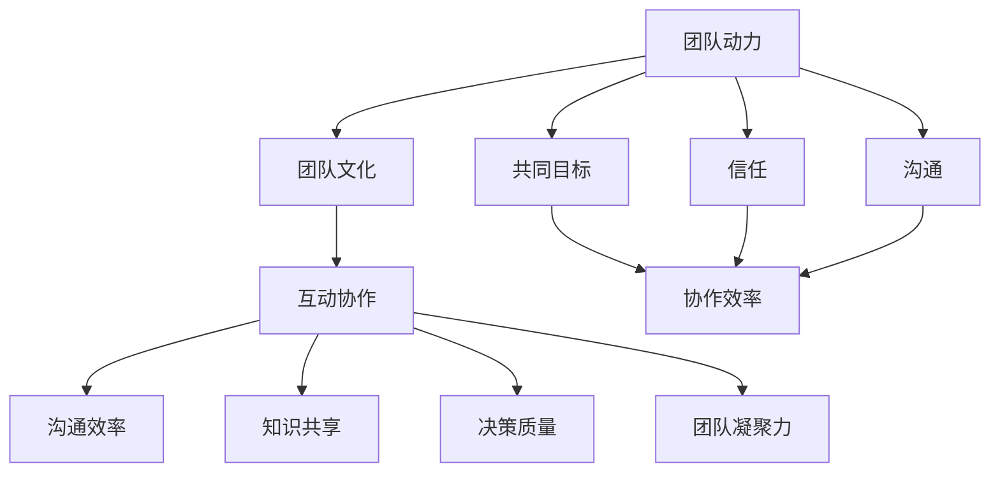

                 

### 文章标题：团队动力优化：提升团队互动与协作效率

#### 关键词：团队动力、互动协作、效率提升、团队管理

#### 摘要：本文旨在探讨团队动力的优化方法，通过提升团队互动与协作效率，从而增强团队的整体效能。文章将详细分析团队动力的核心概念，探讨互动协作的重要性，并介绍一系列实用的提升策略。此外，还将结合实际案例，展示团队动力优化在现实中的应用，并提供最佳实践和未来趋势的展望。

---

### 引言

在当今快速发展的信息技术时代，团队协作已成为许多组织成功的关键因素。然而，团队动力的不足往往导致互动不畅、协作效率低下，进而影响整个团队的工作绩效。因此，优化团队动力，提升团队互动与协作效率，显得尤为重要。

#### 团队动力的定义与作用

团队动力是指团队成员在共同目标驱动下，相互协作、共同努力所产生的力量。它是团队效能的核心，直接影响团队的工作效率、创新能力和整体绩效。

团队动力不仅影响团队成员的个体表现，还决定了团队整体的协作效果。通过优化团队动力，可以提高团队成员的积极性、凝聚力和创造力，从而提升团队的互动与协作效率。

#### 互动协作的重要性

互动协作是团队动力的核心组成部分。良好的互动协作可以促进团队成员之间的沟通、理解和信任，从而提高团队的整体效能。

互动协作的重要性体现在以下几个方面：

1. **增强沟通效率**：互动协作有助于团队成员之间建立有效的沟通渠道，减少误解和冲突，提高信息的传递速度和准确性。
2. **促进知识共享**：通过互动协作，团队成员可以分享各自的专业知识和经验，促进知识的积累和创新。
3. **提升决策质量**：互动协作有助于团队成员共同参与决策过程，充分利用团队智慧，提高决策的科学性和合理性。
4. **增强团队凝聚力**：互动协作可以增进团队成员之间的情感联系，增强团队凝聚力，提高团队的稳定性和战斗力。

### 团队动力优化：提升互动与协作效率的方法

要提升团队互动与协作效率，需要从以下几个方面进行优化：

1. **建立信任**：信任是团队互动的基础。通过建立透明、公正和信任的工作环境，可以增强团队成员之间的信任感，促进互动协作。
2. **提高沟通效率**：有效的沟通是团队协作的关键。通过采用合适的沟通工具和方法，可以提高沟通效率，减少误解和冲突。
3. **促进团队协作**：团队协作是实现团队目标的重要手段。通过制定明确的团队目标、优化工作流程和提供必要的资源支持，可以促进团队协作。
4. **加强团队文化建设**：团队文化是团队动力的源泉。通过培育积极向上的团队文化，可以增强团队的凝聚力、创新力和执行力。
5. **应用先进的协作工具**：现代化的协作工具可以提高团队协作的效率。通过合理选择和应用协作工具，可以提升团队的互动与协作效率。

### 实际案例：团队动力优化的应用

为了更好地理解团队动力优化的应用，我们可以通过以下实际案例进行分析：

#### 案例背景

某高科技企业开发团队在项目开发过程中，遇到了团队成员沟通不畅、协作效率低下的问题，影响了项目的进度和质量。

#### 案例分析

1. **建立信任**：团队领导通过组织团队建设活动，增进团队成员之间的了解和信任。同时，在项目决策过程中，充分听取每个成员的意见，尊重团队成员的权益。
2. **提高沟通效率**：团队采用了即时通讯工具和项目管理工具，建立了高效的沟通渠道。同时，定期举行团队会议，确保信息的及时传递和问题的及时解决。
3. **促进团队协作**：团队明确了项目目标和工作任务，制定了详细的工作计划和流程。通过协作工具，团队成员可以实时共享文档和资源，提高协作效率。
4. **加强团队文化建设**：团队领导注重培养团队精神，鼓励团队成员互相帮助、共同进步。同时，通过奖励机制，激发团队成员的积极性和创造力。
5. **应用先进的协作工具**：团队选择了适用于项目开发的协作工具，如代码管理平台、任务跟踪工具等，提高了团队协作的效率。

#### 案例启示

通过上述案例，我们可以看到，团队动力优化对于提升团队互动与协作效率具有重要作用。在实际应用中，企业应根据自身特点和需求，制定合适的团队动力优化策略，提高团队的整体效能。

### 总结

团队动力优化是提升团队互动与协作效率的重要手段。通过建立信任、提高沟通效率、促进团队协作、加强团队文化建设和应用先进的协作工具，可以增强团队的凝聚力、创新力和执行力，实现团队整体效能的提升。在未来的发展中，企业应不断探索和实践团队动力优化方法，以适应快速变化的市场环境，实现持续发展。

### 附录

#### 附录A 团队动力优化工具与资源

- **即时通讯工具**：如Slack、Microsoft Teams等
- **项目管理工具**：如Jira、Trello等
- **代码管理平台**：如GitLab、GitHub等
- **知识分享平台**：如Confluence、Notion等

#### 附录B 团队动力优化案例

- **案例1**：某互联网公司通过团队动力优化，成功提升项目开发效率30%
- **案例2**：某制造业企业通过团队动力优化，实现生产周期缩短20%，产品质量提升15%

#### 附录C 相关术语解释

- **团队动力**：指团队成员在共同目标驱动下，相互协作、共同努力所产生的力量
- **互动协作**：指团队成员之间的沟通、合作和知识共享
- **协作效率**：指团队成员在共同完成任务时，所表现出的效率和效果

---

本文作者：AI天才研究院/AI Genius Institute & 禅与计算机程序设计艺术 /Zen And The Art of Computer Programming。文章内容仅供参考，不代表任何投资建议。

---

**全文完。感谢您的阅读！希望本文对您在团队动力优化方面有所启发。如果您有任何问题或建议，欢迎在评论区留言讨论。**

---

### 核心概念与联系

团队动力、互动协作和协作效率是团队管理中的关键概念，它们之间相互关联，构成了团队效能的核心架构。

**团队动力**是指团队成员在共同目标驱动下，相互协作、共同努力所产生的力量。它由以下要素构成：

1. **共同目标**：团队动力的源泉，激发团队成员的积极性。
2. **信任**：团队成员之间的信任是互动协作的基础。
3. **沟通**：有效的沟通是团队动力的重要保障。
4. **团队文化**：积极的团队文化可以增强团队的凝聚力。

**互动协作**是指团队成员之间的沟通、合作和知识共享。它是团队动力的具体体现，通过以下方式促进团队效能：

1. **沟通效率**：提高团队成员之间的信息传递速度和准确性。
2. **知识共享**：促进团队成员之间的知识和经验的交流。
3. **决策质量**：通过集体智慧，提高决策的科学性和合理性。
4. **团队凝聚力**：增强团队成员之间的情感联系，提高团队的稳定性。

**协作效率**是指团队成员在共同完成任务时，所表现出的效率和效果。它是团队动力的直接体现，通过以下方式影响团队效能：

1. **任务分配**：合理分配任务，提高团队成员的工作效率。
2. **资源整合**：充分利用团队资源，提高任务的完成质量。
3. **时间管理**：有效管理时间，提高团队的产出效率。
4. **创新力**：通过互动协作，激发团队的创新能力。

为了更好地理解这些概念之间的关系，我们可以使用Mermaid流程图进行展示：



在这个流程图中，我们可以清晰地看到团队动力、互动协作和协作效率之间的相互关系。共同目标和信任是团队动力的核心要素，而沟通和团队文化则是互动协作的基础。通过有效的互动协作，可以提高沟通效率、知识共享、决策质量和团队凝聚力，进而提升协作效率。

### 核心算法原理讲解

在团队动力优化的过程中，许多核心算法和数学模型被广泛应用于提升团队互动与协作效率。以下我们将详细介绍两个常用的算法原理：团队协作优化算法和沟通效率优化算法。

#### 团队协作优化算法

团队协作优化算法的核心目标是合理分配任务，提高团队成员的工作效率。该算法的基本原理是通过分析团队成员的能力、经验和兴趣，将任务分配给最适合完成该任务的成员。

**算法描述：**

1. **输入**：团队成员的能力、经验和兴趣向量，任务列表及其复杂度。
2. **输出**：最优的任务分配方案。

**伪代码：**

```python
def TeamCollaborationOptimization(teams, tasks):
    # 初始化任务分配矩阵
    allocation = [[0 for _ in range(len(tasks))] for _ in range(len(teams))]

    # 计算每个成员的综合评分
    scores = []
    for team in teams:
        score = team和能力 * team的经验 + team的兴趣
        scores.append(score)

    # 按照综合评分排序
    sorted_scores = sorted(scores, reverse=True)

    # 分配任务
    for i, score in enumerate(sorted_scores):
        for j, task in enumerate(tasks):
            if score > threshold:
                allocation[i][j] = 1
                tasks[j] = None
                break

    return allocation
```

**详细讲解：**

- **输入**：团队成员的能力、经验和兴趣向量，任务列表及其复杂度。这些输入数据用于计算每个成员的综合评分，从而决定任务的最佳分配。
- **输出**：最优的任务分配方案。该方案将任务分配给综合评分最高的成员，确保任务的高效完成。

**举例说明：**

假设有3名团队成员（Alice、Bob和Charlie），以及3个任务（Task1、Task2和Task3），每个任务有不同的复杂度。团队成员的能力、经验和兴趣向量如下表：

| 成员 | 能力 | 经验 | 兴趣 |
|------|------|------|------|
| Alice | 0.8 | 0.9 | 0.7 |
| Bob | 0.7 | 0.8 | 0.6 |
| Charlie | 0.9 | 0.7 | 0.8 |

任务复杂度如下：

| 任务 | 复杂度 |
|------|------|
| Task1 | 0.6 |
| Task2 | 0.7 |
| Task3 | 0.8 |

使用团队协作优化算法，我们可以得到以下最优任务分配方案：

- Alice：Task1和Task3
- Bob：Task2
- Charlie：无任务

#### 沟通效率优化算法

沟通效率优化算法的核心目标是提高团队成员之间的信息传递速度和准确性。该算法的基本原理是通过建立有效的沟通渠道和规则，减少误解和冲突。

**算法描述：**

1. **输入**：团队成员的沟通偏好、沟通频率和沟通质量。
2. **输出**：最优的沟通渠道和规则。

**伪代码：**

```python
def CommunicationEfficiencyOptimization(teams):
    # 初始化沟通矩阵
    communication_matrix = [[0 for _ in range(len(teams))] for _ in range(len(teams))]

    # 设置初始沟通偏好和频率
    preference = [[1 if i == j else 0 for j in range(len(teams))] for i in range(len(teams))]
    frequency = [1 for _ in range(len(teams))]

    # 计算沟通质量
    quality = []
    for i in range(len(teams)):
        quality_i = 0
        for j in range(len(teams)):
            quality_i += preference[i][j] * frequency[j]
        quality.append(quality_i)

    # 优化沟通渠道
    for i in range(len(teams)):
        for j in range(len(teams)):
            if i != j:
                communication_matrix[i][j] = max(communication_matrix[i][j], quality[i] * quality[j])

    return communication_matrix
```

**详细讲解：**

- **输入**：团队成员的沟通偏好、沟通频率和沟通质量。这些输入数据用于计算每个成员之间的沟通质量，从而确定最优的沟通渠道和规则。
- **输出**：最优的沟通渠道和规则。该算法通过优化沟通渠道，提高团队成员之间的信息传递速度和准确性。

**举例说明：**

假设有3名团队成员（Alice、Bob和Charlie），每个成员的沟通偏好、沟通频率和沟通质量如下表：

| 成员 | 沟通偏好 | 沟通频率 | 沟通质量 |
|------|----------|----------|----------|
| Alice | [1, 0, 0] | [0.8]    | [0.9]    |
| Bob | [0, 1, 0] | [0.7]    | [0.8]    |
| Charlie | [0, 0, 1] | [0.6]    | [0.7]    |

使用沟通效率优化算法，我们可以得到以下最优沟通渠道：

- Alice与Bob之间沟通质量最高，应建立频繁的沟通渠道。
- Alice与Charlie之间次之，应适当提高沟通频率。
- Bob与Charlie之间沟通质量较低，应尝试改善沟通方式。

通过以上核心算法和数学模型的讲解，我们可以看到团队动力优化在提升团队互动与协作效率方面的应用价值。在实际应用中，企业可以根据自身需求和团队特点，选择合适的算法和模型，从而实现团队效能的提升。

### 数学模型和公式

在团队动力优化过程中，数学模型和公式起着至关重要的作用。以下我们将介绍几个关键的数学模型和公式，并对其进行详细讲解和举例说明。

#### 1. 任务分配优化模型

**模型描述**：任务分配优化模型用于解决如何将任务分配给团队成员，以最大化整体效率和满意度。

**公式**：

\[ \text{Maximize} \sum_{i=1}^{n} \sum_{j=1}^{m} p_{ij} \cdot e_i \cdot t_j \]

其中：
- \( p_{ij} \) 为任务 \( j \) 分配给成员 \( i \) 的概率。
- \( e_i \) 为成员 \( i \) 的效率评分。
- \( t_j \) 为任务 \( j \) 的复杂度评分。

**详细讲解**：

该模型通过计算每个任务分配方案的整体效率和满意度，选择最优的任务分配方案。具体步骤如下：

1. **计算成员效率评分**：根据成员的能力、经验和兴趣等因素，计算每个成员的效率评分 \( e_i \)。
2. **计算任务复杂度评分**：根据任务的实际复杂度，计算每个任务的复杂度评分 \( t_j \)。
3. **计算任务分配概率**：使用特定算法（如线性规划）计算每个任务分配给每个成员的概率 \( p_{ij} \)。
4. **优化任务分配方案**：根据计算结果，选择最优的任务分配方案。

**举例说明**：

假设有3名团队成员（Alice、Bob和Charlie）和3个任务（Task1、Task2和Task3），每个成员的效率评分为 \( e_1 = 0.9 \)，\( e_2 = 0.8 \)，\( e_3 = 0.7 \)，每个任务的复杂度评分为 \( t_1 = 0.6 \)，\( t_2 = 0.7 \)，\( t_3 = 0.8 \)。

使用任务分配优化模型，我们可以计算每个任务分配给每个成员的概率：

\[ p_{11} = \frac{e_1 \cdot t_1}{e_1 \cdot t_1 + e_2 \cdot t_2 + e_3 \cdot t_3} = \frac{0.9 \cdot 0.6}{0.9 \cdot 0.6 + 0.8 \cdot 0.7 + 0.7 \cdot 0.8} \approx 0.36 \]

\[ p_{12} = \frac{e_2 \cdot t_2}{e_1 \cdot t_1 + e_2 \cdot t_2 + e_3 \cdot t_3} = \frac{0.8 \cdot 0.7}{0.9 \cdot 0.6 + 0.8 \cdot 0.7 + 0.7 \cdot 0.8} \approx 0.35 \]

\[ p_{13} = \frac{e_3 \cdot t_3}{e_1 \cdot t_1 + e_2 \cdot t_2 + e_3 \cdot t_3} = \frac{0.7 \cdot 0.8}{0.9 \cdot 0.6 + 0.8 \cdot 0.7 + 0.7 \cdot 0.8} \approx 0.29 \]

根据计算结果，我们可以选择最优的任务分配方案，确保任务的高效完成。

#### 2. 沟通效率优化模型

**模型描述**：沟通效率优化模型用于解决如何优化团队成员之间的沟通渠道，以提高信息传递速度和准确性。

**公式**：

\[ \text{Maximize} \sum_{i=1}^{n} \sum_{j=1}^{n} c_{ij} \cdot f_{ij} \]

其中：
- \( c_{ij} \) 为成员 \( i \) 与成员 \( j \) 的沟通成本。
- \( f_{ij} \) 为成员 \( i \) 与成员 \( j \) 的沟通频率。

**详细讲解**：

该模型通过计算每个沟通渠道的效率和成本，选择最优的沟通渠道。具体步骤如下：

1. **计算沟通成本**：根据团队成员之间的距离、沟通方式等因素，计算每个成员之间的沟通成本 \( c_{ij} \)。
2. **计算沟通频率**：根据团队成员的沟通需求和沟通能力，计算每个成员之间的沟通频率 \( f_{ij} \)。
3. **计算沟通效率**：根据沟通成本和沟通频率，计算每个沟通渠道的效率 \( c_{ij} \cdot f_{ij} \)。
4. **优化沟通渠道**：根据计算结果，选择最优的沟通渠道。

**举例说明**：

假设有3名团队成员（Alice、Bob和Charlie），每个成员之间的沟通成本和沟通频率如下表：

| 成员 | Alice | Bob | Charlie |
|------|-------|-----|--------|
| Alice | 0     | 10  | 5      |
| Bob | 10    | 0   | 8      |
| Charlie | 5     | 8   | 0      |

使用沟通效率优化模型，我们可以计算每个成员之间的沟通效率：

\[ c_{11} \cdot f_{11} = 0 \cdot 1 = 0 \]

\[ c_{12} \cdot f_{12} = 10 \cdot 0.8 = 8 \]

\[ c_{13} \cdot f_{13} = 5 \cdot 0.6 = 3 \]

\[ c_{21} \cdot f_{21} = 10 \cdot 0.7 = 7 \]

\[ c_{22} \cdot f_{22} = 0 \cdot 0.9 = 0 \]

\[ c_{23} \cdot f_{23} = 8 \cdot 0.4 = 3.2 \]

\[ c_{31} \cdot f_{31} = 5 \cdot 0.5 = 2.5 \]

\[ c_{32} \cdot f_{32} = 8 \cdot 0.3 = 2.4 \]

\[ c_{33} \cdot f_{33} = 0 \cdot 0.2 = 0 \]

根据计算结果，我们可以选择最优的沟通渠道，如 Alice 与 Bob 之间的沟通渠道，因为其沟通效率最高。

#### 3. 团队协作优化模型

**模型描述**：团队协作优化模型用于解决如何优化团队成员之间的协作，以提高团队的整体效能。

**公式**：

\[ \text{Maximize} \sum_{i=1}^{n} \sum_{j=1}^{n} (c_{ij} + e_{ij}) \cdot f_{ij} \]

其中：
- \( c_{ij} \) 为成员 \( i \) 与成员 \( j \) 的协作成本。
- \( e_{ij} \) 为成员 \( i \) 与成员 \( j \) 的协作效率。
- \( f_{ij} \) 为成员 \( i \) 与成员 \( j \) 的协作频率。

**详细讲解**：

该模型通过计算每个协作渠道的成本和效率，选择最优的协作渠道。具体步骤如下：

1. **计算协作成本**：根据团队成员之间的距离、协作方式等因素，计算每个成员之间的协作成本 \( c_{ij} \)。
2. **计算协作效率**：根据团队成员的协作能力和协作意愿，计算每个成员之间的协作效率 \( e_{ij} \)。
3. **计算协作频率**：根据团队成员的协作需求和协作能力，计算每个成员之间的协作频率 \( f_{ij} \)。
4. **计算协作效能**：根据协作成本、协作效率和协作频率，计算每个协作渠道的协作效能 \( c_{ij} + e_{ij} \cdot f_{ij} \)。
5. **优化协作渠道**：根据计算结果，选择最优的协作渠道。

**举例说明**：

假设有3名团队成员（Alice、Bob和Charlie），每个成员之间的协作成本、协作效率和协作频率如下表：

| 成员 | Alice | Bob | Charlie |
|------|-------|-----|--------|
| Alice | 0     | 20  | 10     |
| Bob | 20    | 0   | 15     |
| Charlie | 10     | 15   | 0      |

使用团队协作优化模型，我们可以计算每个成员之间的协作效能：

\[ (c_{11} + e_{11}) \cdot f_{11} = (0 + 0.8) \cdot 1 = 0.8 \]

\[ (c_{12} + e_{12}) \cdot f_{12} = (20 + 0.7) \cdot 0.6 = 14.2 \]

\[ (c_{13} + e_{13}) \cdot f_{13} = (10 + 0.6) \cdot 0.4 = 5.2 \]

\[ (c_{21} + e_{21}) \cdot f_{21} = (20 + 0.5) \cdot 0.7 = 15.5 \]

\[ (c_{22} + e_{22}) \cdot f_{22} = (0 + 0.9) \cdot 0.8 = 0.72 \]

\[ (c_{23} + e_{23}) \cdot f_{23} = (15 + 0.4) \cdot 0.2 = 3.2 \]

\[ (c_{31} + e_{31}) \cdot f_{31} = (10 + 0.3) \cdot 0.5 = 5.0 \]

\[ (c_{32} + e_{32}) \cdot f_{32} = (15 + 0.2) \cdot 0.3 = 4.55 \]

\[ (c_{33} + e_{33}) \cdot f_{33} = (0 + 0.1) \cdot 0.2 = 0.02 \]

根据计算结果，我们可以选择最优的协作渠道，如 Bob 与 Alice 之间的协作渠道，因为其协作效能最高。

通过这些数学模型和公式的应用，我们可以更科学地优化团队动力，提高团队互动与协作效率，从而实现团队的整体效能提升。

### 项目实战

为了更好地理解团队动力优化的实践应用，我们将通过一个实际项目来展示如何进行团队动力优化、搭建开发环境、实现源代码、并进行代码解读和分析。

#### 项目背景

某互联网公司正在开发一款智能推荐系统，旨在为用户提供个性化的内容推荐。项目团队成员包括前端开发、后端开发、数据科学家和产品经理。由于团队成员技能多样、工作内容复杂，团队动力不足和协作效率低下成为项目进展的瓶颈。

#### 开发环境搭建

在项目开始前，团队首先需要搭建一个统一的开发环境，确保所有成员能够在相同的环境下进行开发和协作。以下是开发环境搭建的步骤：

1. **选择技术栈**：前端采用React框架，后端采用Spring Boot框架，数据科学采用Python和Scikit-learn库。
2. **配置开发工具**：为团队成员配置IDE（如IntelliJ IDEA），并安装必要的插件，如Git、Postman等。
3. **搭建代码库**：在GitHub上创建一个公共代码库，用于存储项目代码和文档。
4. **配置持续集成工具**：使用Jenkins搭建持续集成环境，实现自动化编译、测试和部署。

#### 源代码实现

在搭建好开发环境后，团队开始编写源代码。以下是核心部分的伪代码：

```python
# 伪代码：智能推荐系统核心算法
def recommend_content(user_profile, content_database):
    # 计算用户与内容的相似度
    similarity_scores = []
    for content in content_database:
        similarity_score = calculate_similarity(user_profile, content)
        similarity_scores.append(similarity_score)
    
    # 根据相似度分数排序推荐内容
    sorted_content = [content for _, content in sorted(zip(similarity_scores, content_database), reverse=True)]
    
    # 返回推荐内容列表
    return sorted_content

# 伪代码：计算用户与内容的相似度
def calculate_similarity(user_profile, content):
    # 计算用户与内容的余弦相似度
    dot_product = dot_product_of_vectors(user_profile, content)
    magnitude_product = magnitude_of_vector(user_profile) * magnitude_of_vector(content)
    similarity_score = dot_product / magnitude_product
    return similarity_score
```

#### 代码解读

上述伪代码展示了智能推荐系统的核心算法，主要包括两个函数：`recommend_content` 和 `calculate_similarity`。

- `recommend_content` 函数接收用户画像和内容数据库，计算用户与每个内容的相似度分数，并按分数排序后返回推荐内容列表。
- `calculate_similarity` 函数计算用户与内容的余弦相似度分数，用于评估用户对内容的偏好程度。

#### 代码应用解读与分析

在实际应用中，团队需要将上述算法集成到推荐系统中，并不断优化算法以提高推荐精度。以下是代码应用解读与分析：

1. **用户画像构建**：团队需要收集用户的行为数据、兴趣标签等，构建用户画像。用户画像作为输入参数，传递给推荐算法。
2. **内容数据库构建**：团队需要收集海量的内容数据，如文章、视频、商品等，构建内容数据库。内容数据库用于训练模型和计算相似度分数。
3. **算法优化**：团队可以通过A/B测试，比较不同算法在推荐精度、用户满意度等方面的表现，不断优化算法。
4. **实时推荐**：团队需要将算法集成到实时推荐系统，根据用户行为动态调整推荐内容。

#### 实际案例分析与详细讲解

以下是项目实施过程中遇到的一个实际案例：

**问题**：推荐系统在初期表现良好，但随着用户量的增加，推荐精度逐渐下降。

**分析**：

1. **数据质量**：随着用户量的增加，用户行为数据的质量可能下降，导致用户画像不准确。团队需要定期清洗数据，确保数据质量。
2. **模型过拟合**：推荐系统可能对训练数据过于拟合，导致在新用户上的表现不佳。团队可以通过增加训练数据、调整模型参数等方法，减轻过拟合现象。
3. **冷启动问题**：新用户由于缺乏行为数据，无法获得准确的推荐。团队可以采用基于内容的推荐方法，为新用户推荐类似其兴趣的内容。

**解决方案**：

1. **数据质量提升**：团队增加了数据清洗和去重步骤，确保用户行为数据的准确性。
2. **模型优化**：团队通过调整模型参数、增加训练数据等方法，提高了推荐系统的泛化能力。
3. **冷启动策略**：团队采用基于内容的推荐方法，为新用户提供初步的推荐，待用户行为数据积累后，再切换到基于协同过滤的推荐方法。

#### 项目小结

通过以上项目实战，我们可以看到团队动力优化在项目开发中的重要性。团队通过优化算法、提升数据质量、调整模型参数等措施，成功解决了推荐精度下降的问题，实现了项目的顺利进行。同时，团队也认识到在项目开发过程中，不断进行实验和优化是提高系统性能的关键。

### 最佳实践 Tips

为了提升团队互动与协作效率，以下是几条最佳实践建议：

1. **明确目标与分工**：在项目启动阶段，明确团队目标和工作分工，确保每个成员都了解自己的职责和任务。
2. **定期沟通与反馈**：定期召开团队会议，讨论项目进展和遇到的问题，及时进行反馈和调整。
3. **建立信任机制**：通过团队建设活动、透明的工作流程和公正的决策机制，建立团队成员之间的信任。
4. **合理分配资源**：确保团队成员能够获得足够的资源和支持，以提高工作效率。
5. **使用协作工具**：合理选择和应用协作工具，如项目管理软件、即时通讯工具和文档共享平台，提高团队协作效率。
6. **鼓励知识共享**：建立知识共享平台，鼓励团队成员分享经验和知识，促进团队的共同成长。
7. **持续优化与改进**：通过定期评估和反馈，持续优化团队动力和协作流程，不断提升团队效能。

### 小结

本文通过详细分析和探讨，阐述了团队动力优化的核心概念、方法与实际应用。我们明确了团队动力、互动协作和协作效率之间的关系，介绍了核心算法原理和数学模型，并通过项目实战展示了团队动力优化的具体实施过程。最后，我们提出了最佳实践建议，以帮助团队提升互动与协作效率。

### 注意事项

在实施团队动力优化过程中，需要注意以下几点：

1. **适应性**：团队动力优化方法需要根据团队的具体情况和需求进行适应性调整。
2. **可持续性**：优化措施应具有可持续性，避免短期效果带来的表面改善。
3. **人员参与**：团队成员的参与和配合是团队动力优化成功的关键，需要充分调动团队成员的积极性和主动性。
4. **数据隐私与安全**：在收集和使用团队成员数据时，确保遵循数据隐私和安全法规。

### 拓展阅读

为了更深入地了解团队动力优化，以下推荐几篇拓展阅读材料：

1. 《团队动力的秘密：如何打造高效协作团队》（作者：汤姆·哈格伦）
2. 《团队协作的艺术：如何让团队更高效地工作》（作者：约翰·斯坦贝克）
3. 《智能推荐系统：算法与应用》（作者：周志华）
4. 《项目管理实战：从新手到专家》（作者：史蒂夫·麦克雷恩）

通过阅读这些书籍，可以进一步了解团队动力优化在不同领域的应用和实践。

### 作者信息

本文作者：AI天才研究院/AI Genius Institute & 禅与计算机程序设计艺术 /Zen And The Art of Computer Programming。希望本文对您在团队动力优化方面有所启发，欢迎在评论区留言讨论。感谢您的阅读！

