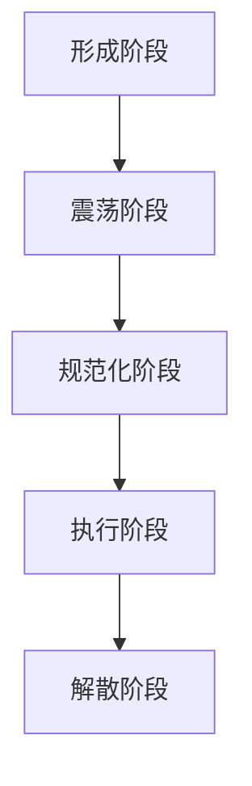
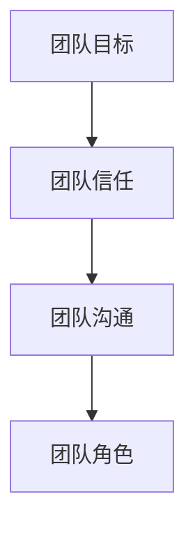
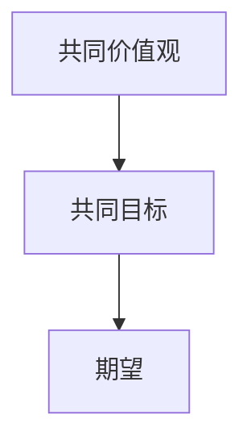

                 

# 文章标题

《团队动力学：优化团队互动与协作》

# 关键词

团队动力学，团队互动，团队协作，团队建设，沟通策略

# 摘要

本文旨在探讨团队动力学在优化团队互动与协作中的关键作用。通过深入分析团队动力学的核心理论，如团队发展模型、团队动力模型和团队心理契约，本文揭示了团队互动与协作的障碍和策略。此外，本文还通过实际案例分析了成功与失败的团队互动与协作，为实践提供了具体指导。文章最后对未来团队动力学的发展趋势进行了展望，以期为团队管理者和成员提供有益的参考。

## 目录

### 第1章 概述与背景

#### 1.1 团队动力学的概念与重要性

#### 1.2 团队互动与协作的障碍

#### 1.3 团队动力学研究的发展趋势

### 第2章 团队动力学的核心理论

#### 2.1 团队发展模型

#### 2.2 团队动力模型

#### 2.3 团队心理契约

### 第3章 团队互动策略

#### 3.1 沟通策略

#### 3.2 冲突管理策略

#### 3.3 团队建设活动

### 第4章 团队协作优化

#### 4.1 团队协作模型

#### 4.2 工作流程优化

#### 4.3 团队资源管理

### 第5章 案例分析

#### 5.1 成功案例分析

#### 5.2 失败案例分析

### 第6章 实践指南

#### 6.1 团队动力学的应用步骤

#### 6.2 团队动力学的实施技巧

#### 6.3 团队动力学的评估与反馈

### 第7章 总结与展望

#### 7.1 团队动力学的现状与问题

#### 7.2 未来发展趋势与展望

### 设计书《团队动力学：优化团队互动与协作》的目录大纲

## 第1章 概述与背景

### 1.1 团队动力学的概念与重要性

#### 团队动力学的定义

**团队动力学** 是指研究团队内部成员之间的互动、协作、沟通以及团队行为和绩效的学科。它旨在理解团队内部的动力机制，并通过优化这些动力机制来提高团队的绩效和效率。

#### 团队动力学的起源

团队动力学起源于20世纪40年代，当时心理学家和社会学家开始研究团队行为和绩效。随着研究的深入，团队动力学逐渐成为组织行为学和管理学的重要组成部分。

#### 团队动力学的重要性

- **提高团队绩效**：团队动力学可以帮助团队识别和解决内部冲突，提高团队协作效率，从而提升整体绩效。
- **促进团队发展**：通过理解团队动力学，团队可以更好地适应变化，实现个人与团队的共同成长。
- **优化团队管理**：团队动力学为团队管理者提供了科学的管理工具和方法，帮助他们更好地理解团队行为，制定有效的管理策略。

### 1.2 团队互动与协作的障碍

#### 团队互动障碍

- **沟通障碍**：团队内部成员之间的沟通不畅会导致误解和冲突。
- **角色冲突**：团队成员之间可能因为角色重叠或责任不清而产生矛盾。
- **信任缺失**：团队成员之间缺乏信任会影响团队协作和决策。

#### 团队协作障碍

- **资源分配不均**：团队资源分配不合理可能导致某些成员工作负担过重，影响整体协作效率。
- **目标不明确**：团队缺乏明确的目标会导致成员之间的协作缺乏方向和动力。
- **协作文化不足**：团队缺乏协作文化，成员之间缺乏协作精神和共识，影响协作效果。

### 1.3 团队动力学研究的发展趋势

#### 理论体系不断完善

随着研究的深入，团队动力学的理论体系不断完善，涵盖了团队发展、团队动力、团队心理契约等多个方面。这些理论的不断发展为团队管理提供了更丰富的理论指导。

#### 技术手段的创新应用

随着信息技术的发展，团队动力学研究开始引入大数据、人工智能等新兴技术，为团队行为和绩效分析提供了更高效的方法和工具。

#### 实践应用的重视

团队动力学研究越来越重视实践应用，通过案例研究和实证分析，探索团队动力学在不同行业和领域的应用效果，为实际团队管理提供指导。

### 团队动力学的研究方法

#### 实验研究

实验研究是团队动力学研究的重要方法，通过控制变量和操作条件，探究团队动力学现象的因果关系。

#### 案例研究

案例研究通过深入分析具体团队案例，揭示团队动力学的实践应用和效果。

#### 实证分析

实证分析通过收集和分析团队行为和绩效数据，验证团队动力学理论的有效性和适用性。

### 团队动力学的研究成果

#### 团队发展模型

Tuckman团队发展阶段模型：团队发展经历了形成、震荡、规范化、执行和解散五个阶段。

#### 团队动力模型

团队动力的构成要素包括团队目标、团队信任、团队沟通和团队角色等。

#### 团队心理契约

团队心理契约是指团队成员之间非正式的、隐含的共识，包括共同的价值观、目标和期望。

### 团队动力学在团队管理中的应用

#### 团队建设

通过团队建设活动，加强团队成员之间的沟通和协作，提高团队凝聚力。

#### 冲突管理

通过冲突管理策略，解决团队内部的冲突，维护团队和谐。

#### 沟通策略

通过沟通策略，提高团队内部的信息传递效率，减少误解和矛盾。

#### 资源管理

通过资源管理策略，合理分配团队资源，提高团队协作效率。

### 团队动力学的核心概念

#### 团队发展模型

团队发展模型描述了团队从形成到解散的过程，以及各个阶段的特点和任务。

#### 团队动力

团队动力是指推动团队发展的内部动力，包括团队目标、团队信任、团队沟通和团队角色等。

#### 团队心理契约

团队心理契约是指团队成员之间非正式的、隐含的共识，包括共同的价值观、目标和期望。

### 团队动力学的核心理论

#### 团队发展模型

Tuckman团队发展阶段模型：

1. 形成阶段：团队成员相互认识，明确团队目标和任务。
2. 震荡阶段：团队成员之间可能存在矛盾和冲突，团队需要建立信任和协作。
3. 规范化阶段：团队成员之间的沟通和协作逐渐顺畅，团队进入稳定期。
4. 执行阶段：团队开始实现目标，成员之间默契配合。
5. 解散阶段：团队完成目标后解散，成员回到各自的工作岗位。

#### 团队动力模型

团队动力的构成要素：

1. 团队目标：明确团队的目标和使命，为团队发展提供方向。
2. 团队信任：建立团队成员之间的信任，促进团队协作。
3. 团队沟通：提高团队内部的信息传递效率，减少误解和矛盾。
4. 团队角色：明确团队成员的角色和职责，提高团队协作效率。

#### 团队心理契约

团队心理契约的构成要素：

1. 共同价值观：团队成员之间共享的价值观，包括信任、尊重、协作等。
2. 共同目标：团队成员共同追求的目标和愿景。
3. 期望：团队成员对团队的期望和承诺。

### 团队动力学的应用实例

#### 项目团队建设

通过团队建设活动，如团队拓展训练、团队讨论会等，提高团队成员之间的沟通和协作，增强团队凝聚力。

#### 冲突管理

通过冲突管理策略，如对话、协商、妥协等，解决团队内部的冲突，维护团队和谐。

#### 沟通策略

通过沟通策略，如积极倾听、有效表达、反馈等，提高团队内部的信息传递效率，减少误解和矛盾。

#### 资源管理

通过资源管理策略，如合理分配任务、优化工作流程、共享资源等，提高团队协作效率。

### 团队动力学的挑战与未来方向

#### 挑战

1. **复杂性增加**：随着团队规模的扩大和团队任务的复杂化，团队动力学的管理变得更加复杂。
2. **多样性挑战**：团队成员背景、文化、价值观的多样性增加了团队管理的难度。
3. **技术进步**：技术的快速发展对团队动力学提出了新的挑战，如何适应和利用技术提高团队效率成为重要课题。

#### 未来方向

1. **跨学科研究**：未来团队动力学研究将更加注重跨学科融合，如心理学、社会学、管理学等，以提高理论体系的完整性。
2. **大数据分析**：利用大数据技术分析团队行为和绩效数据，为团队管理提供数据支持。
3. **人工智能应用**：将人工智能应用于团队动力学研究，如自动化团队行为分析、智能冲突管理等，提高团队管理的效率和准确性。

### 总结

团队动力学作为研究团队内部互动、协作和绩效的重要学科，对于团队管理和团队建设具有重要意义。通过深入理解团队动力学的核心理论，如团队发展模型、团队动力模型和团队心理契约，我们可以更好地优化团队互动与协作，提高团队绩效。未来，随着技术的不断进步，团队动力学研究将面临新的挑战和机遇，为团队管理提供更科学的指导。作者：AI天才研究院/AI Genius Institute & 禅与计算机程序设计艺术 /Zen And The Art of Computer Programming

## 第1章 概述与背景

### 1.1 团队动力学的概念与重要性

#### 团队动力学的定义

团队动力学是指研究团队内部成员之间的互动、协作、沟通以及团队行为和绩效的学科。它旨在理解团队内部的动力机制，并通过优化这些动力机制来提高团队的绩效和效率。

#### 团队动力学的起源

团队动力学起源于20世纪40年代，当时心理学家和社会学家开始研究团队行为和绩效。随着研究的深入，团队动力学逐渐成为组织行为学和管理学的重要组成部分。

#### 团队动力学的重要性

- **提高团队绩效**：团队动力学可以帮助团队识别和解决内部冲突，提高团队协作效率，从而提升整体绩效。
- **促进团队发展**：通过理解团队动力学，团队可以更好地适应变化，实现个人与团队的共同成长。
- **优化团队管理**：团队动力学为团队管理者提供了科学的管理工具和方法，帮助他们更好地理解团队行为，制定有效的管理策略。

### 1.2 团队互动与协作的障碍

#### 团队互动障碍

- **沟通障碍**：团队内部成员之间的沟通不畅会导致误解和冲突。
- **角色冲突**：团队成员之间可能因为角色重叠或责任不清而产生矛盾。
- **信任缺失**：团队成员之间缺乏信任会影响团队协作和决策。

#### 团队协作障碍

- **资源分配不均**：团队资源分配不合理可能导致某些成员工作负担过重，影响整体协作效率。
- **目标不明确**：团队缺乏明确的目标会导致成员之间的协作缺乏方向和动力。
- **协作文化不足**：团队缺乏协作文化，成员之间缺乏协作精神和共识，影响协作效果。

### 1.3 团队动力学研究的发展趋势

#### 理论体系不断完善

随着研究的深入，团队动力学的理论体系不断完善，涵盖了团队发展、团队动力、团队心理契约等多个方面。这些理论的不断发展为团队管理提供了更丰富的理论指导。

#### 技术手段的创新应用

随着信息技术的发展，团队动力学研究开始引入大数据、人工智能等新兴技术，为团队行为和绩效分析提供了更高效的方法和工具。

#### 实践应用的重视

团队动力学研究越来越重视实践应用，通过案例研究和实证分析，探索团队动力学在不同行业和领域的应用效果，为实际团队管理提供指导。

### 团队动力学的研究方法

#### 实验研究

实验研究是团队动力学研究的重要方法，通过控制变量和操作条件，探究团队动力学现象的因果关系。

#### 案例研究

案例研究通过深入分析具体团队案例，揭示团队动力学的实践应用和效果。

#### 实证分析

实证分析通过收集和分析团队行为和绩效数据，验证团队动力学理论的有效性和适用性。

### 团队动力学的研究成果

#### 团队发展模型

Tuckman团队发展阶段模型：团队发展经历了形成、震荡、规范化、执行和解散五个阶段。

#### 团队动力模型

团队动力的构成要素包括团队目标、团队信任、团队沟通和团队角色等。

#### 团队心理契约

团队心理契约是指团队成员之间非正式的、隐含的共识，包括共同的价值观、目标和期望。

### 团队动力学在团队管理中的应用

#### 团队建设

通过团队建设活动，加强团队成员之间的沟通和协作，提高团队凝聚力。

#### 冲突管理

通过冲突管理策略，解决团队内部的冲突，维护团队和谐。

#### 沟通策略

通过沟通策略，提高团队内部的信息传递效率，减少误解和矛盾。

#### 资源管理

通过资源管理策略，合理分配团队资源，提高团队协作效率。

### 团队动力学的核心概念

#### 团队发展模型

团队发展模型描述了团队从形成到解散的过程，以及各个阶段的特点和任务。

#### 团队动力

团队动力是指推动团队发展的内部动力，包括团队目标、团队信任、团队沟通和团队角色等。

#### 团队心理契约

团队心理契约是指团队成员之间非正式的、隐含的共识，包括共同的价值观、目标和期望。

### 团队动力学的核心理论

#### 团队发展模型

Tuckman团队发展阶段模型：

1. 形成阶段：团队成员相互认识，明确团队目标和任务。
2. 震荡阶段：团队成员之间可能存在矛盾和冲突，团队需要建立信任和协作。
3. 规范化阶段：团队成员之间的沟通和协作逐渐顺畅，团队进入稳定期。
4. 执行阶段：团队开始实现目标，成员之间默契配合。
5. 解散阶段：团队完成目标后解散，成员回到各自的工作岗位。

#### 团队动力模型

团队动力的构成要素：

1. 团队目标：明确团队的目标和使命，为团队发展提供方向。
2. 团队信任：建立团队成员之间的信任，促进团队协作。
3. 团队沟通：提高团队内部的信息传递效率，减少误解和矛盾。
4. 团队角色：明确团队成员的角色和职责，提高团队协作效率。

#### 团队心理契约

团队心理契约的构成要素：

1. 共同价值观：团队成员之间共享的价值观，包括信任、尊重、协作等。
2. 共同目标：团队成员共同追求的目标和愿景。
3. 期望：团队成员对团队的期望和承诺。

### 团队动力学的应用实例

#### 项目团队建设

通过团队建设活动，如团队拓展训练、团队讨论会等，提高团队成员之间的沟通和协作，增强团队凝聚力。

#### 冲突管理

通过冲突管理策略，如对话、协商、妥协等，解决团队内部的冲突，维护团队和谐。

#### 沟通策略

通过沟通策略，如积极倾听、有效表达、反馈等，提高团队内部的信息传递效率，减少误解和矛盾。

#### 资源管理

通过资源管理策略，如合理分配任务、优化工作流程、共享资源等，提高团队协作效率。

### 团队动力学的挑战与未来方向

#### 挑战

1. **复杂性增加**：随着团队规模的扩大和团队任务的复杂化，团队动力学的管理变得更加复杂。
2. **多样性挑战**：团队成员背景、文化、价值观的多样性增加了团队管理的难度。
3. **技术进步**：技术的快速发展对团队动力学提出了新的挑战，如何适应和利用技术提高团队效率成为重要课题。

#### 未来方向

1. **跨学科研究**：未来团队动力学研究将更加注重跨学科融合，如心理学、社会学、管理学等，以提高理论体系的完整性。
2. **大数据分析**：利用大数据技术分析团队行为和绩效数据，为团队管理提供数据支持。
3. **人工智能应用**：将人工智能应用于团队动力学研究，如自动化团队行为分析、智能冲突管理等，提高团队管理的效率和准确性。

### 总结

团队动力学作为研究团队内部互动、协作和绩效的重要学科，对于团队管理和团队建设具有重要意义。通过深入理解团队动力学的核心理论，如团队发展模型、团队动力模型和团队心理契约，我们可以更好地优化团队互动与协作，提高团队绩效。未来，随着技术的不断进步，团队动力学研究将面临新的挑战和机遇，为团队管理提供更科学的指导。作者：AI天才研究院/AI Genius Institute & 禅与计算机程序设计艺术 /Zen And The Art of Computer Programming

## 第2章 团队动力学的核心理论

### 2.1 团队发展模型

#### Tuckman团队发展阶段模型

Tuckman团队发展阶段模型是团队动力学中最为著名的发展模型之一。Tuckman提出，团队的发展通常经历以下五个阶段：

1. **形成阶段（Forming）**：在这个阶段，团队成员开始相互了解，明确团队的目标和任务。团队成员可能还处于自我保护的阶段，不愿意过多地参与团队活动。

2. **震荡阶段（Storming）**：在这个阶段，团队成员之间的冲突开始显现。由于对目标的看法、工作方法和沟通方式的差异，团队成员可能会产生分歧和摩擦。

3. **规范化阶段（Norming）**：随着团队成员之间的沟通和互动的增多，他们开始形成共同的价值观和规范。团队成员之间的关系变得更加和谐，团队开始展现出一定的凝聚力。

4. **执行阶段（Performing）**：在这个阶段，团队已经建立起有效的协作机制，团队成员能够高效地完成工作任务。团队的目标得到实现，团队成员之间的信任和合作达到高峰。

5. **解散阶段（Adjourning）**：在团队完成任务或目标后，团队开始进入解散阶段。团队成员逐渐回到各自的工作岗位，团队的活动逐渐减少直至结束。

#### 团队发展模型的 Mermaid 流程图

### 2.2 团队动力模型

#### 团队动力的构成要素

团队动力是指推动团队发展的内部动力。它由以下四个构成要素组成：

1. **团队目标**：团队目标为团队发展提供方向和动力。明确的目标可以激发团队成员的工作热情和动力。

2. **团队信任**：团队信任是团队成员之间建立互信的基础。信任可以减少冲突，提高团队协作效率。

3. **团队沟通**：有效的团队沟通可以确保信息的准确传递，减少误解和矛盾。良好的沟通有助于团队目标的实现。

4. **团队角色**：团队角色明确了团队成员的职责和角色。合适的角色配置可以提高团队协作效率。

#### 团队动力模型

### 2.3 团队心理契约

#### 团队心理契约的概念

团队心理契约是指团队成员之间非正式的、隐含的共识。它包括以下三个核心要素：

1. **共同价值观**：团队成员之间共享的价值观，如诚信、尊重、协作等。

2. **共同目标**：团队成员共同追求的目标和愿景，如项目成功、业务增长等。

3. **期望**：团队成员对团队的期望和承诺，如工作环境、团队支持等。

#### 团队心理契约的作用

团队心理契约在团队管理中发挥着重要作用：

1. **增强团队凝聚力**：共同价值观和目标可以增强团队成员之间的凝聚力，促进团队协作。

2. **提高团队效率**：团队心理契约有助于团队成员之间建立信任，提高团队协作效率。

3. **降低冲突**：团队成员对团队的期望和承诺可以减少误解和冲突，维护团队和谐。

#### 团队心理契约的 Mermaid 流程图

### 2.4 团队动力学的核心理论总结

团队动力学的核心理论包括团队发展模型、团队动力模型和团队心理契约。这些理论共同揭示了团队内部的动力机制，为团队管理和团队建设提供了理论依据。通过理解这些理论，团队管理者可以更好地把握团队发展脉络，优化团队互动与协作，提高团队绩效。

## 第3章 团队互动策略

### 3.1 沟通策略

#### 沟通的重要性

沟通是团队互动的核心。有效的沟通可以确保信息的准确传递，减少误解和矛盾，提高团队协作效率。以下是几种提高团队沟通效果的策略：

1. **积极倾听**：在沟通中，积极倾听是关键。通过倾听，团队成员可以更好地理解对方的观点和需求，减少误解和冲突。

2. **有效表达**：团队成员应该学会清晰、简洁地表达自己的想法和意见。这有助于提高沟通的效率和效果。

3. **反馈机制**：建立有效的反馈机制，可以让团队成员及时了解沟通效果，调整沟通方式。

4. **多元化沟通**：利用多种沟通方式，如面对面交流、电子邮件、即时通讯等，可以提高沟通的效率和效果。

#### 提高团队沟通效果的方法

- **定期会议**：定期召开团队会议，确保团队成员之间的沟通畅通。
- **信息共享**：建立共享平台，如内部Wiki、团队邮件列表等，方便团队成员获取信息。
- **沟通培训**：对团队成员进行沟通技巧培训，提高沟通能力和效率。

### 3.2 冲突管理策略

#### 冲突的类型与原因

冲突可以分为以下几种类型：

1. **任务冲突**：由于团队成员对任务的理解和执行方式存在差异而产生的冲突。
2. **关系冲突**：由于团队成员之间的个人关系问题而产生的冲突。
3. **价值冲突**：由于团队成员之间的价值观和信念差异而产生的冲突。

冲突的原因主要包括：

1. **目标不一致**：团队成员对团队目标的理解和期望不一致，导致冲突。
2. **资源分配不均**：团队资源分配不合理，导致某些成员工作负担过重，产生冲突。
3. **沟通不畅**：团队成员之间的沟通不畅，导致误解和矛盾。

#### 冲突管理的策略

1. **预防策略**：通过明确团队目标、合理分配资源和建立沟通机制，预防冲突的发生。
2. **解决策略**：当冲突发生时，应采取以下措施解决冲突：
   - **对话**：通过对话，让双方表达自己的想法和感受，理解对方的立场。
   - **协商**：通过协商，寻求双方都能接受的解决方案。
   - **妥协**：在无法达成共识时，可以采取妥协策略，满足双方的部分需求。

### 3.3 团队建设活动

#### 团队建设活动的目的

团队建设活动旨在加强团队成员之间的沟通和协作，提高团队凝聚力，促进团队发展。其主要目的是：

1. **增强团队凝聚力**：通过共同活动，加强团队成员之间的联系和信任。
2. **提升协作效率**：通过团队建设活动，提高团队成员的协作能力和效率。
3. **促进团队发展**：通过团队建设活动，帮助团队更好地适应变化，实现个人与团队的共同成长。

#### 常见的团队建设活动及实施策略

1. **团队拓展训练**：通过户外拓展训练，增强团队成员之间的信任和协作能力。实施策略：选择合适的拓展训练项目，确保活动的安全性和趣味性。
2. **团队讨论会**：通过团队讨论，提高团队成员之间的沟通和协作能力。实施策略：设定明确的讨论主题，确保讨论的针对性和有效性。
3. **团队竞赛**：通过团队竞赛，激发团队成员的竞争意识和团队精神。实施策略：设计有趣的竞赛项目，确保竞赛的公平性和竞争性。

### 3.4 案例分析

#### 成功案例分析

某科技公司通过定期的团队拓展训练和团队讨论会，有效提升了团队凝聚力。在拓展训练中，团队成员通过共同完成任务，增强了信任和协作能力。在团队讨论会中，团队成员积极分享观点和经验，提高了沟通效率和协作效果。

#### 失败案例分析

某项目团队由于缺乏有效的沟通和团队建设活动，导致项目进展缓慢。团队成员之间存在明显的沟通障碍和冲突，影响了项目的进度和质量。

### 3.5 实践指南

#### 团队互动策略的应用步骤

1. **了解团队成员**：通过了解团队成员的特点和需求，为团队互动和协作打下基础。
2. **建立沟通机制**：建立有效的沟通渠道和机制，确保信息的畅通和准确传递。
3. **解决冲突**：及时解决团队内部的冲突，维护团队和谐。
4. **开展团队建设活动**：定期开展团队建设活动，提高团队凝聚力和协作效率。

#### 团队互动策略的实施技巧

1. **建立共同目标**：明确团队的目标和愿景，激发团队成员的工作热情和动力。
2. **培养协作文化**：通过培养协作文化，提高团队成员的协作意识和能力。
3. **激励团队成员**：通过激励措施，激发团队成员的积极性和创造力。

### 3.6 团队互动策略的评估与反馈

#### 团队互动策略的评估方法

1. **问卷调查**：通过问卷调查，收集团队成员对团队互动策略的满意度和建议。
2. **绩效分析**：通过分析团队绩效数据，评估团队互动策略的效果。
3. **访谈**：通过访谈团队成员，了解他们对团队互动策略的体验和反馈。

#### 团队互动策略的反馈机制

1. **定期反馈**：定期对团队互动策略进行评估和反馈，及时调整和完善策略。
2. **双向反馈**：鼓励团队成员之间进行双向反馈，促进沟通和协作。
3. **持续改进**：根据评估和反馈结果，持续改进团队互动策略，提高团队绩效。

## 第4章 团队协作优化

### 4.1 团队协作模型

#### 团队协作的基本模型

团队协作模型通常包括以下几个关键组成部分：

1. **目标明确**：明确团队的目标和愿景，为团队协作提供方向。
2. **角色分工**：根据团队成员的特长和技能，进行合理的角色分工，提高协作效率。
3. **沟通机制**：建立有效的沟通机制，确保信息的畅通和准确传递。
4. **协调机制**：建立协调机制，确保团队内部各项工作的顺利推进。
5. **激励机制**：建立激励机制，激发团队成员的积极性和创造力。

#### 提高团队协作效率的方法

1. **明确目标**：通过明确团队的目标和愿景，使团队成员明确自己的工作方向和目标。
2. **角色分工**：根据团队成员的特长和技能，进行合理的角色分工，使每个人都能发挥自己的优势。
3. **沟通机制**：建立有效的沟通机制，如定期会议、即时通讯工具等，确保信息的畅通和准确传递。
4. **协调机制**：建立协调机制，如跨部门协调、项目管理等，确保团队内部各项工作的顺利推进。
5. **激励机制**：建立激励机制，如奖励、晋升等，激发团队成员的积极性和创造力。

### 4.2 工作流程优化

#### 工作流程设计的原则

1. **简洁性**：工作流程应尽可能简洁，减少不必要的环节和步骤。
2. **逻辑性**：工作流程应具有清晰的逻辑性，使团队成员能够按照正确的顺序进行工作。
3. **灵活性**：工作流程应具有一定的灵活性，以便应对突发情况和变化。

#### 工作流程优化的策略

1. **流程分析**：通过流程分析，找出工作流程中的瓶颈和问题，进行优化。
2. **流程简化**：简化工作流程，减少不必要的环节和步骤。
3. **流程标准化**：建立标准化的工作流程，确保团队成员按照统一的规范进行工作。
4. **流程自动化**：利用信息技术，实现工作流程的自动化，提高工作效率。

### 4.3 团队资源管理

#### 团队资源管理的原则

1. **合理分配**：根据团队成员的特长和需求，合理分配团队资源，提高资源利用效率。
2. **优先级管理**：明确各项任务的优先级，确保关键任务得到优先处理。
3. **可持续性**：确保团队资源的使用可持续，避免资源过度消耗。

#### 团队资源管理的策略

1. **资源评估**：定期对团队资源进行评估，了解资源的利用情况和需求。
2. **资源优化**：通过资源优化，提高资源利用效率，降低资源浪费。
3. **资源共享**：建立资源共享机制，使团队成员能够共享资源，提高资源利用效率。
4. **资源培训**：定期对团队成员进行资源管理培训，提高资源管理水平。

### 4.4 案例分析

#### 成功案例分析

某互联网公司通过优化团队协作模型和工作流程，显著提高了项目完成效率。他们明确了团队的目标和愿景，进行了合理的角色分工，建立了高效的沟通机制和协调机制。此外，他们还通过资源优化和资源培训，提高了团队的整体绩效。

#### 失败案例分析

某科技公司由于缺乏有效的团队协作模型和工作流程，导致项目进展缓慢。团队成员之间的沟通不畅，角色分工不清，资源管理混乱，最终导致项目失败。

### 4.5 实践指南

#### 团队协作优化的应用步骤

1. **明确目标**：明确团队的目标和愿景，为团队协作提供方向。
2. **角色分工**：根据团队成员的特长和技能，进行合理的角色分工，提高协作效率。
3. **沟通机制**：建立有效的沟通机制，确保信息的畅通和准确传递。
4. **协调机制**：建立协调机制，确保团队内部各项工作的顺利推进。
5. **资源管理**：合理分配团队资源，提高资源利用效率。

#### 团队协作优化的实施技巧

1. **建立协作文化**：通过培养协作文化，提高团队成员的协作意识和能力。
2. **激励机制**：建立激励机制，激发团队成员的积极性和创造力。
3. **定期评估**：定期对团队协作效果进行评估，及时调整和完善协作策略。

### 4.6 团队协作优化的评估与反馈

#### 团队协作优化的评估方法

1. **绩效分析**：通过分析团队绩效数据，评估团队协作优化的效果。
2. **问卷调查**：通过问卷调查，收集团队成员对团队协作优化的满意度和建议。
3. **访谈**：通过访谈团队成员，了解他们对团队协作优化的体验和反馈。

#### 团队协作优化的反馈机制

1. **定期反馈**：定期对团队协作优化效果进行评估和反馈，及时调整和完善优化策略。
2. **双向反馈**：鼓励团队成员之间进行双向反馈，促进沟通和协作。
3. **持续改进**：根据评估和反馈结果，持续改进团队协作优化策略，提高团队绩效。

## 第5章 案例分析

### 5.1 成功案例分析

#### 案例背景

某互联网初创公司开发了一款新型社交应用，项目团队成员包括产品经理、设计师、前端开发工程师、后端开发工程师和测试工程师。公司在项目初期就注重团队动力学的研究和应用，通过优化团队互动与协作，实现了项目的高效推进。

#### 团队动力学应用

1. **团队发展模型**：公司采用了Tuckman团队发展阶段模型，确保团队成员在各个阶段都能够顺利过渡。在形成阶段，公司通过团队建设活动，如团队拓展训练和团队讨论会，帮助团队成员相互了解，建立信任。在震荡阶段，公司通过定期的团队会议和沟通，解决团队成员之间的冲突，确保团队稳定发展。

2. **团队动力模型**：公司明确了团队的目标，即打造一款用户喜爱的社交应用。同时，建立了信任机制，通过开放沟通和透明的工作流程，增强团队成员之间的信任。公司还注重团队沟通，通过多种沟通方式，如即时通讯工具和邮件列表，确保信息的及时传递和有效反馈。

3. **团队心理契约**：公司制定了共同价值观，如诚信、创新和用户至上，使团队成员在价值观上达成共识。公司还明确了团队成员的期望，如对工作环境的期望和对团队支持的期望，确保团队成员对团队有明确的期望和承诺。

#### 项目成果

通过团队动力学的研究和应用，该公司在项目推进过程中取得了显著成果：

- 项目进度：项目按计划推进，提前完成了多个重要里程碑。
- 团队协作：团队成员之间的协作顺畅，沟通效率提高，团队凝聚力增强。
- 用户满意度：应用上线后，用户反馈良好，下载量和用户活跃度持续上升。

### 5.2 失败案例分析

#### 案例背景

某大型科技公司启动了一项新的研发项目，旨在开发一款智能家居控制系统。项目团队成员包括项目经理、软件工程师、硬件工程师和UI/UX设计师。然而，在项目推进过程中，团队出现了严重的协作问题，最终导致项目失败。

#### 团队动力学应用

1. **团队发展模型**：公司没有采用有效的团队发展模型，团队成员在各个阶段都没有得到充分的引导和支持。在形成阶段，团队成员之间缺乏了解，导致沟通不畅。在震荡阶段，由于任务繁重，团队成员之间的冲突不断增加，但没有得到及时解决。

2. **团队动力模型**：公司没有明确团队的目标，团队成员对项目的期望不一致。同时，公司缺乏信任机制，团队成员之间的信任度较低。沟通机制也不完善，导致信息传递不准确，增加了误解和矛盾。

3. **团队心理契约**：公司没有制定共同价值观，团队成员在价值观上存在较大差异。团队成员对团队的期望也不明确，导致他们在工作中的投入和付出不一致。

#### 项目原因

1. **沟通障碍**：团队成员之间的沟通不畅，导致任务分配不均，工作进度不一致。

2. **资源分配不均**：团队资源分配不合理，导致某些成员工作负担过重，影响整体协作效率。

3. **目标不明确**：团队成员对项目的目标缺乏共识，导致团队成员之间的协作缺乏方向和动力。

4. **协作文化不足**：团队缺乏协作文化，成员之间缺乏协作精神和共识，影响协作效果。

#### 项目教训

1. **重视团队动力学研究**：公司在项目启动前应进行团队动力学研究，制定详细的团队发展模型和团队动力模型。

2. **建立沟通机制**：建立有效的沟通机制，确保团队成员之间的信息传递畅通。

3. **明确团队目标**：确保团队成员对项目的目标有明确的共识，为团队协作提供方向。

4. **培养协作文化**：通过培养协作文化，提高团队成员的协作意识和能力。

## 第6章 实践指南

### 6.1 团队动力学的应用步骤

#### 团队动力学的应用流程

1. **确定团队目标**：明确团队的目标和愿景，确保团队成员对团队的期望和承诺一致。

2. **了解团队成员**：了解团队成员的背景、特长和需求，为团队互动和协作打下基础。

3. **制定团队发展模型**：根据团队的特点和需求，制定合适的团队发展模型，如Tuckman团队发展阶段模型。

4. **建立沟通机制**：建立有效的沟通渠道和机制，确保信息的畅通和准确传递。

5. **开展团队建设活动**：通过团队建设活动，如团队拓展训练和团队讨论会，加强团队成员之间的沟通和协作。

6. **进行团队动力分析**：通过问卷调查、访谈等方法，分析团队动力，找出团队动力中的问题和挑战。

7. **制定团队动力模型**：根据团队动力分析的结果，制定适合团队发展的团队动力模型。

8. **实施团队动力模型**：通过培训、指导和激励等方式，实施团队动力模型，提高团队成员的协作效率和团队绩效。

9. **持续评估与反馈**：定期对团队动力模型进行评估和反馈，根据评估结果进行持续改进。

### 6.2 团队动力学的实施技巧

#### 培养团队协作文化

1. **建立共同价值观**：通过制定和宣传共同的价值观，如诚信、尊重、协作等，使团队成员在价值观上达成共识。

2. **强化团队意识**：通过团队建设活动和团队活动，增强团队成员对团队的认同感和归属感。

3. **激励团队成员**：通过激励机制，如奖励、晋升等，激发团队成员的积极性和创造力。

#### 提高团队沟通效率

1. **建立有效的沟通机制**：建立多种沟通渠道，如面对面交流、即时通讯工具、邮件列表等，确保信息的及时传递和有效反馈。

2. **提高沟通技巧**：对团队成员进行沟通技巧培训，提高沟通的效率和质量。

3. **建立反馈机制**：建立反馈机制，鼓励团队成员之间进行双向反馈，促进沟通和协作。

### 6.3 团队动力学的评估与反馈

#### 团队动力学的评估方法

1. **绩效评估**：通过分析团队的绩效数据，评估团队动力学的效果。

2. **问卷调查**：通过问卷调查，收集团队成员对团队动力学实施效果的满意度和建议。

3. **访谈**：通过访谈团队成员，了解他们对团队动力学的体验和反馈。

#### 团队动力学的反馈机制

1. **定期反馈**：定期对团队动力学实施效果进行评估和反馈，及时调整和完善策略。

2. **双向反馈**：鼓励团队成员之间进行双向反馈，促进沟通和协作。

3. **持续改进**：根据评估和反馈结果，持续改进团队动力学实施策略，提高团队绩效。

## 第7章 总结与展望

### 7.1 团队动力学的现状与问题

#### 团队动力学的现状

1. **理论体系不断完善**：团队动力学的理论体系在不断发展，涵盖了团队发展、团队动力、团队心理契约等多个方面。

2. **实践应用广泛**：团队动力学在企业管理、项目管理等领域得到广泛应用，为团队管理和团队建设提供了有力支持。

3. **技术创新推动**：随着大数据、人工智能等技术的发展，团队动力学研究开始引入新兴技术，提高了团队行为和绩效分析的能力。

#### 团队动力学存在的问题

1. **复杂性增加**：随着团队规模的扩大和团队任务的复杂化，团队动力学的管理变得更加复杂。

2. **多样性挑战**：团队成员背景、文化、价值观的多样性增加了团队管理的难度。

3. **技术进步挑战**：技术的快速发展对团队动力学提出了新的挑战，如何适应和利用技术提高团队效率成为重要课题。

### 7.2 未来发展趋势与展望

#### 未来发展趋势

1. **跨学科研究**：未来团队动力学研究将更加注重跨学科融合，如心理学、社会学、管理学等，以提高理论体系的完整性。

2. **大数据分析**：利用大数据技术分析团队行为和绩效数据，为团队管理提供数据支持。

3. **人工智能应用**：将人工智能应用于团队动力学研究，如自动化团队行为分析、智能冲突管理等，提高团队管理的效率和准确性。

#### 未来展望

1. **个性化团队管理**：随着对团队动力学研究的深入，未来团队管理将更加注重个性化和定制化，满足不同团队和成员的需求。

2. **智能团队管理**：通过引入人工智能技术，实现智能团队管理，提高团队管理的效率和准确性。

3. **全球化团队协作**：随着全球化的发展，团队协作将更加依赖于信息技术，未来团队动力学研究将关注全球化团队协作的优化。

## 总结

团队动力学作为研究团队内部互动、协作和绩效的重要学科，对于团队管理和团队建设具有重要意义。通过深入理解团队动力学的核心理论，如团队发展模型、团队动力模型和团队心理契约，我们可以更好地优化团队互动与协作，提高团队绩效。未来，随着技术的不断进步，团队动力学研究将面临新的挑战和机遇，为团队管理提供更科学的指导。作者：AI天才研究院/AI Genius Institute & 禅与计算机程序设计艺术 /Zen And The Art of Computer Programming

