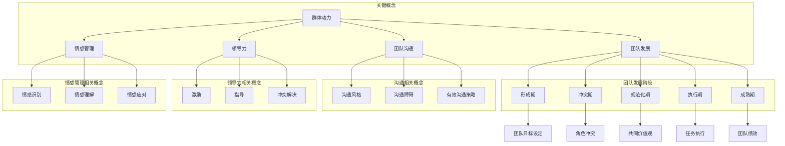

                 

### 摘要

《团队动力学：解析高效团队机制》旨在深入解析团队动力学的基本概念、结构、运作机制，以及如何通过有效的团队机制提升团队效率。本文首先介绍了团队动力学的历史背景、核心理论，并探讨了其在现代组织管理中的重要性。接着，文章详细阐述了团队内部的角色构成与互动，以及团队沟通、决策、冲突管理等方面的关键要素。通过分析团队领导力和团队文化建设，本文揭示了构建高效团队的关键因素和策略。最后，文章提供了附录，包括相关参考资料和工具，以供读者进一步学习和应用。通过系统性的分析和案例分析，本文旨在为企业管理者和团队成员提供实用的指南，以实现团队效能的最大化。

### 分析书名《团队动力学：解析高效团队机制》

首先，我们分析书名《团队动力学：解析高效团队机制》中的两个核心概念：“团队动力学”和“高效团队机制”。

**团队动力学**

“团队动力学”这一概念源自物理学中的“动力学”，意指团队内各种力量和因素的作用与运动。在组织管理学中，团队动力学主要研究团队内部的行为模式、相互作用和动态变化。它关注的是团队成员之间的沟通、互动、合作以及冲突等动态过程，探讨如何通过科学的方法和策略，激发团队活力，提高团队绩效。

“团队动力学”这一概念的历史发展可以追溯到20世纪初，当时工业心理学开始探讨团队如何影响个体的行为和工作效率。随着组织管理学的发展，团队动力学逐渐形成了系统的理论体系，包括领导力、沟通、冲突管理等方面。经典的理论如Tuckman的团队发展模型、Schein的组织文化理论等，都为团队动力学的理论研究奠定了基础。

**高效团队机制**

“高效团队机制”则是指一套系统化的运作规则和方法，用于确保团队在执行任务时能够高效、有序地运作。这些机制包括团队结构、角色分工、沟通渠道、决策流程、冲突处理等，它们共同构成了团队运行的骨架，确保团队成员能够协同合作，达成组织目标。

“高效团队机制”的重要性在于，它能够提升团队的整体效能，减少内耗，优化资源分配，从而提高团队的工作质量和效率。一个高效的团队机制不仅能够提高团队成员的满意度和归属感，还能够增强团队的凝聚力和创新能力，使团队在面对复杂多变的环境时能够迅速做出反应和调整。

书名《团队动力学：解析高效团队机制》旨在通过系统性的分析和研究，帮助读者理解团队动力学的基本概念和运作机制，并掌握构建高效团队的关键策略和方法。书中不仅介绍了团队动力学的历史发展、核心理论，还详细探讨了团队内部的角色构成、沟通、决策、冲突管理等关键要素，旨在为团队管理和团队建设提供实用的指导和借鉴。

通过分析书名，我们可以看出，本书的核心目标是通过解析团队动力学，为构建高效团队提供理论依据和实践指导。它不仅适用于企业管理者和团队领导者，也适合所有关注团队效能提升的读者。在接下来的章节中，我们将进一步深入探讨团队动力学的基本原理，以及如何通过高效的团队机制来提升团队的整体效能。

### 团队动力学基础

团队动力学是研究团队内部动态过程和行为模式的一个复杂领域，其起源可以追溯到20世纪初。最初，团队动力学的概念源自工业心理学，旨在理解团队如何影响个体行为和工作效率。随着时间的推移，团队动力学逐渐发展成为一个独立的学科，涵盖了从个体相互作用到整个团队系统的多层次分析。

#### 团队动力学的基本概念

团队动力学（Group Dynamics）主要关注团队内部的各种力量和因素，包括个体行为、群体互动、沟通模式、团队结构等。它探讨了团队如何形成、如何运作，以及如何解体。团队动力学中的关键概念包括：

1. **群体动力**：指团队内部各种力量的相互作用和影响。这些力量包括个人动机、情绪、认知和价值观等。
2. **团队发展**：团队从形成到解散的过程，包括团队的形成期、冲突期、规范化期、执行期和成熟期等阶段。
3. **领导力**：团队领导在团队动力中的角色，包括如何激励团队成员、引导团队决策和解决团队冲突等。
4. **团队沟通**：团队成员之间的信息交流，包括沟通风格、沟通障碍、有效沟通策略等。

#### 历史发展

团队动力学的发展历程可以追溯到几个重要的理论和研究成果：

1. **Tuckman的团队发展模型**：由Berenice Tuckman提出，描述了团队发展的五个阶段：形成期、冲突期、规范化期、执行期和成熟期。这一模型为团队动力学的理解提供了重要的框架。

2. **Schein的组织文化理论**：由Edgar H. Schein提出，强调了组织文化的深层结构和动态变化，以及组织文化对团队行为和团队效能的影响。

3. **Lewin的领导力模型**：由Kurt Lewin提出，描述了领导力行为的三个维度：行为维度、任务维度和关系维度。这一模型强调了领导者对团队动力的影响。

#### 团队动力学与相关理论的联系

团队动力学与多个相关理论有着紧密的联系，这些理论共同构成了团队动力学的理论基础：

1. **社会心理学**：团队动力学中的许多概念都源自社会心理学，如群体行为、群体思维、社会认同等。

2. **组织行为学**：团队动力学与组织行为学的关系尤为密切，后者研究组织中的个体和团队行为，包括激励、领导力、团队协作等。

3. **系统理论**：团队动力学中的系统观点来源于系统理论，该理论强调团队是一个开放的系统，与外部环境相互作用，并受到内部和外部因素的影响。

#### 团队动力学的核心原理

团队动力学的核心原理包括以下几个方面：

1. **相互作用**：团队成员之间的相互作用是团队动力学的核心。通过沟通和协作，团队成员能够建立信任和合作，从而提高团队效能。

2. **反馈循环**：团队动力学中的反馈循环是指团队成员的行为和决策会互相影响，形成一个动态的系统。有效的反馈机制能够促进团队的改进和成长。

3. **情感管理**：情感在团队动力学中扮演着重要角色。情感管理包括如何识别、理解和应对团队成员的情感反应，以维持团队的稳定和积极氛围。

4. **领导力**：领导力是团队动力学的重要组成部分。有效的领导能够激励团队成员，提供清晰的指导，解决团队冲突，并促进团队的发展。

综上所述，团队动力学是一个复杂但关键的研究领域，它涵盖了从个体行为到整个团队系统的多层次分析。通过理解团队动力学的基本概念、历史发展和核心原理，我们可以更好地构建和管理高效的团队，实现组织的整体目标。

### 团队动力学的基础原理与核心概念之间的关系架构

为了更好地理解团队动力学的基础原理与核心概念之间的联系，我们可以通过一个Mermaid流程图来展示这些概念之间的相互关系。以下是一个简化的示例，用于描述团队动力学中的几个关键概念及其相互作用：

在这个流程图中，我们可以看到以下核心概念之间的联系：

1. **群体动力**：作为团队动力学的基础，群体动力涵盖了团队成员的互动、行为模式和相互影响。
2. **团队发展**：团队发展包括从形成期到成熟期的五个阶段，每个阶段都有其特定的任务和挑战。
3. **团队沟通**：团队沟通包括沟通风格、障碍和策略，这些是团队互动的重要部分。
4. **领导力**：领导力涉及激励、指导和冲突解决，这些是团队成功的关键。
5. **情感管理**：情感管理包括情感识别、理解和应对，这对维持团队的稳定和积极氛围至关重要。

通过这个流程图，我们可以清晰地看到团队动力学中各个核心概念之间的相互关系，以及它们如何共同作用，影响团队的发展和绩效。

### 团队动力学的应用领域

团队动力学作为组织管理学中的一个重要领域，广泛应用于多个领域和行业，旨在提升团队效能、促进组织发展和创新。以下是团队动力学在几个关键应用领域的具体应用：

#### 1. 企业管理

在企业环境中，团队动力学被广泛应用于团队建设、组织发展和绩效管理。通过理解团队成员之间的互动和沟通模式，企业管理者可以设计出更有效的团队结构和沟通渠道，提高团队协作效率。例如，通过应用Tuckman的团队发展模型，管理者可以帮助团队快速进入执行期和成熟期，减少冲突和内耗，从而提升整体绩效。

#### 2. 项目管理

在项目管理领域，团队动力学有助于优化项目团队的运作和管理。项目经理可以利用团队动力学的理论，识别并解决团队内部的冲突，提高团队成员的沟通效果，确保项目按计划顺利进行。团队动力学的应用还包括团队角色的明确划分、任务分配和绩效评估，这些都有助于提升项目交付的成功率。

#### 3. 教育与培训

在教育领域，团队动力学理论被广泛应用于学生团队活动和教师团队建设。通过理解团队动力学的原理，教育工作者可以设计出更有效的学习小组和教学策略，促进学生的合作学习和创新能力。同时，团队动力学也为教师团队提供了有效的沟通和合作工具，提高了教学质量和教师的工作满意度。

#### 4. 医疗与健康领域

在医疗与健康领域，团队动力学被用于医院和诊所的团队管理和患者护理。通过优化医疗团队的结构和沟通模式，可以提升医疗服务质量，减少医疗错误和事故。例如，医生、护士和辅助人员可以通过团队动力学培训，改善跨部门沟通和协作，提高患者满意度和医疗安全。

#### 5. 公共管理与政策制定

在公共管理领域，团队动力学有助于提升政府机构和社会组织的工作效率和团队效能。通过团队动力学的研究和应用，政策制定者可以设计出更有效的团队结构和沟通机制，促进政府各部门之间的协作和资源共享。团队动力学的应用还包括危机管理和应急响应团队的建设，以确保在紧急情况下快速、高效地应对各种挑战。

#### 6. 创新与创业

在创新和创业领域，团队动力学被广泛应用于创业团队建设和企业创新管理。创业团队通常由不同背景和专业的人才组成，通过团队动力学的方法，可以促进团队成员之间的有效沟通和合作，激发创新思维和创造力。团队动力学还可以帮助创业团队在复杂多变的市场环境中快速适应和调整，提高创业成功率。

综上所述，团队动力学在多个领域和行业中有着广泛的应用，通过科学的管理方法和策略，可以有效提升团队效能，促进组织发展和创新。无论是在企业管理、项目管理，还是教育、医疗、公共管理和创新创业领域，团队动力学都发挥着关键作用。

### 团队构成与角色

在团队动力学中，团队构成与角色是研究团队内部互动和协作的重要组成部分。一个高效的团队需要明确各成员的角色和职责，确保团队成员能够充分发挥各自的专长，协同完成团队目标。以下是团队内部主要角色的分类及其职责：

#### 领导者

**角色职责**：
领导者是团队的灵魂和核心，主要负责制定团队目标、规划团队策略、分配任务和资源，以及激励团队成员。领导者需要具备良好的沟通能力和决策能力，能够在团队遇到挑战时提供方向和支持。

**核心技能**：
- 指导与反馈：给予团队成员清晰的指导，并适时提供反馈。
- 激励与激励：通过激励措施提高团队成员的积极性和工作效率。
- 决策与战略：在团队遇到复杂问题时，做出明智的决策和战略规划。

#### 活动家

**角色职责**：
活动家是团队的执行者，负责将领导者的计划和策略付诸实践。他们积极参与团队任务，推动项目进展，并在执行过程中提供具体的技术支持和操作指导。

**核心技能**：
- 执行能力：高效完成分配的任务，确保项目按计划进行。
- 技术能力：具备所需的专业技能和知识，能够解决执行过程中的技术问题。
- 沟通协调：与团队成员保持良好的沟通，确保任务执行的顺利进行。

#### 成熟者

**角色职责**：
成熟者通常在团队中扮演顾问和协调者的角色，他们通过分享经验和专业知识，帮助团队解决各种问题。同时，成熟者还需要在团队内部维持和谐的人际关系，促进团队成员之间的协作。

**核心技能**：
- 经验分享：通过自己的经验帮助团队成员解决问题和提升技能。
- 人际沟通：处理团队成员之间的冲突，促进团队内部的和谐与协作。
- 风险管理：识别和应对潜在的风险，确保团队目标的顺利实现。

#### 角色与职责的相互作用

在团队中，领导者、活动家和成熟者之间需要密切合作，共同推动团队向前发展。以下是一些关键相互作用：

- **领导者的指导与活动家的执行**：
  领导者制定目标和策略，活动家负责具体任务的执行。双方需要保持紧密沟通，确保任务的顺利进行。

- **成熟者的建议与领导者的决策**：
  成熟者通过分享经验和专业知识，为领导者的决策提供参考。领导者需要考虑成熟者的建议，但最终决策仍由领导者做出。

- **活动家与成熟者的协作**：
  活动家在执行任务时，可能会遇到技术难题或团队冲突，这时成熟者的支持和建议就显得尤为重要。双方需要相互协作，共同解决问题。

- **团队角色的动态调整**：
  在团队发展的不同阶段，角色职责可能会发生变化。例如，在团队形成期，领导者可能需要更多时间来指导团队成员；而在执行期，活动家的作用更为突出。因此，团队需要根据实际情况灵活调整角色职责。

通过明确团队内部的角色和职责，以及促进角色之间的相互作用，可以有效提升团队的整体效能，确保团队目标的顺利实现。

### 团队角色之间的相互作用与协作

在团队动力学中，团队成员之间的相互作用与协作是团队效能的关键因素。有效的团队协作不仅能够提升团队的整体绩效，还能够增强团队成员之间的信任和凝聚力。以下是团队角色之间相互作用与协作的几个重要方面：

#### 团队成员之间的互动

团队成员之间的互动是团队协作的基础。有效的互动可以促进信息的流通，增强团队成员之间的沟通和理解。以下是一些促进团队成员互动的策略：

1. **开放沟通**：鼓励团队成员在团队会议、讨论和反馈环节中开放地表达自己的观点和意见，确保信息的透明和畅通。
2. **倾听与反馈**：团队成员应积极倾听他人的观点，并给予及时的反馈。这种互动有助于减少误解，增强团队合作。
3. **共享资源与知识**：团队成员应分享各自的资源和知识，特别是专业技能和经验。通过共享，可以提高团队整体的知识水平和工作效率。

#### 团队角色之间的协作

在团队中，不同角色之间需要紧密协作，共同完成团队任务。以下是一些促进团队角色协作的方法：

1. **明确角色与职责**：在团队成立之初，应明确每个角色的职责和期望，确保团队成员了解自己的任务和责任，以及如何与其他角色协作。
2. **任务分解与分工**：将复杂的任务分解为小任务，并分配给合适的角色。这样可以确保每个角色都能专注于自己的领域，同时也能与其他角色协作。
3. **跨部门沟通与协调**：在跨部门团队中，不同部门之间的沟通和协调尤为重要。通过建立有效的沟通机制和协调流程，可以确保团队目标的顺利实现。

#### 团队角色冲突的解决策略

在团队互动过程中，角色冲突是不可避免的。有效的冲突解决策略可以帮助团队克服冲突，提高整体效能。以下是一些解决团队角色冲突的策略：

1. **预防性措施**：在团队形成期，通过建立明确的规则和沟通机制，预防冲突的发生。例如，制定团队行为准则，规范团队成员的行为。
2. **冲突调解**：当冲突发生时，可以采取调解措施，通过第三方中立者的帮助，帮助团队成员找到共同点和解决方案。
3. **建设性对话**：鼓励团队成员进行建设性的对话，通过理性分析和沟通，解决分歧和冲突。这种方法有助于团队成员建立互信，增强团队的凝聚力。

#### 成功案例与经验分享

以下是一个成功案例，展示了如何通过团队成员之间的互动和协作，解决团队角色冲突，提升团队效能：

**案例：**一个软件开发团队在项目开发过程中遇到了严重的技术难题，导致项目进度延误。团队中，开发者和技术经理之间出现了冲突，开发者认为技术经理对技术细节的干预影响了他们的工作效率，而技术经理则认为开发者的进度滞后影响了项目的整体进度。

**解决方案：**团队领导者采取了以下措施：

1. **召开团队会议**：组织了一次团队会议，让开发者和技术经理面对面沟通，表达彼此的关切和期望。
2. **明确职责**：明确了开发者的技术职责和技术经理的项目管理职责，确保双方在各自的职责范围内工作。
3. **共同制定项目计划**：团队领导者和技术经理共同制定了新的项目计划，确保项目进度和技术质量都能得到保证。
4. **提供技术支持**：技术经理在项目开发过程中提供了必要的技术支持，帮助开发者解决技术难题。

通过这些措施，团队成功解决了角色冲突，项目进度逐渐恢复正常，最终项目按时完成，并得到了客户的高度评价。

通过上述案例和策略，我们可以看到，有效的团队成员互动和协作对于解决团队角色冲突、提升团队效能至关重要。团队领导者需要不断引导和激励团队成员，建立良好的沟通和协作机制，确保团队在复杂多变的环境中保持高效运作。

### 团队沟通的重要性

团队沟通在团队动力学中占据着核心地位，是团队有效运作的基石。有效的沟通不仅能够确保信息传递的准确性和及时性，还能促进团队成员之间的理解、信任和合作，从而提升团队的总体效能。以下是团队沟通的重要性、常见障碍以及提升沟通效果的具体策略。

#### 团队沟通的重要性

1. **确保信息传递的准确性**：在团队工作中，信息的准确传递至关重要。有效的沟通可以减少误解和信息失真，确保团队成员对任务的了解一致，从而提高任务执行的效率和效果。
2. **促进团队成员之间的理解**：通过沟通，团队成员能够了解彼此的观点、想法和需求，增强对团队目标和任务的认同感，促进团队成员之间的理解与协作。
3. **增强团队的凝聚力**：良好的沟通有助于建立团队成员之间的信任和尊重，增强团队凝聚力。团队成员在相互理解和支持的基础上，更容易形成共同的目标和愿景。
4. **提升决策质量**：团队沟通可以收集更多的意见和建议，促进集体决策的形成。通过充分讨论和交流，团队成员可以共同分析问题、评估风险，从而做出更明智的决策。

#### 常见沟通障碍

1. **信息过载**：随着信息的不断增多，团队成员可能会感到压力过大，难以处理和理解所有信息，从而导致沟通效率下降。
2. **沟通方式不当**：团队成员可能采用不恰当的沟通方式，如使用过于复杂的术语、缺乏明确的表达，导致沟通效果不佳。
3. **文化差异**：在跨国或多元文化团队中，文化差异可能导致沟通障碍。不同文化背景的团队成员可能在沟通风格、语言习惯和价值观上存在差异，这会影响信息的理解和传递。
4. **心理障碍**：团队成员可能因为个人心理问题（如焦虑、恐惧等）而影响沟通效果。心理障碍可能导致团队成员不愿意或不敢表达自己的观点和想法。
5. **时间紧迫**：在紧迫的项目和任务中，团队成员可能因时间限制而无法进行充分的沟通，这会影响团队任务的执行和决策的制定。

#### 提升沟通效果的具体策略

1. **明确沟通目标**：在沟通前，明确沟通的目标和内容，确保所有团队成员都清楚需要传达的信息和期望的反馈。这有助于减少沟通中的模糊和不确定性。
2. **选择合适的沟通方式**：根据沟通的内容和目的，选择合适的沟通方式，如面对面会议、电子邮件、即时通讯工具等。对于复杂和敏感的信息，面对面沟通通常效果最佳。
3. **培养良好的沟通习惯**：鼓励团队成员在沟通中保持积极的态度，注重倾听和表达。团队成员应学会使用简洁明了的语言，避免使用专业术语或模糊表达。
4. **建立反馈机制**：建立有效的反馈机制，鼓励团队成员在沟通过程中提出疑问和意见。这有助于确保信息的准确性和完整性。
5. **文化敏感性培训**：对于跨国或多元文化团队，提供文化敏感性培训，帮助团队成员了解和尊重不同文化背景的沟通习惯和价值观。
6. **心理支持与辅导**：为团队成员提供心理支持和辅导，帮助他们克服沟通中的心理障碍。这可以包括团队建设活动、心理咨询服务等。
7. **时间管理**：合理安排沟通时间，确保团队成员有足够的时间进行充分的沟通和讨论。在项目和时间紧迫的情况下，制定明确的沟通计划和时间表。

通过实施这些策略，团队可以显著提升沟通效果，减少沟通障碍，从而提高团队的整体效能和协作效率。有效的沟通不仅是团队成功的关键，也是构建高效团队的重要保障。

### 团队沟通的有效性

团队沟通的有效性是团队成功运作的核心要素，它决定了信息能否准确、及时地传递，团队目标是否得以实现，以及团队成员之间的协作和信任水平。为了评估和提升团队沟通的有效性，我们可以从以下几个方面进行探讨：

#### 团队沟通的评估指标

1. **信息传递的准确性**：评估信息传递的准确性，可以通过检查任务完成情况、项目进展报告、决策执行结果等指标来判断。
2. **沟通频率**：团队沟通的频率是衡量团队内部信息流通速度的重要指标。频繁的沟通有助于及时解决问题和调整方向，提高团队效率。
3. **反馈机制**：有效的反馈机制能够确保团队成员的意见和建议被听取和考虑，从而促进团队内部的透明度和信任。
4. **沟通满意度**：通过问卷调查或访谈，了解团队成员对沟通效果的满意度，这是衡量团队沟通质量的直接指标。
5. **决策质量**：决策过程中所依赖的信息和意见是否充分、全面，以及决策后的执行效果，都是评估团队沟通有效性的重要依据。

#### 提升团队沟通有效性的方法

1. **明确沟通目标和议程**：在每次沟通前，明确沟通的目标和议程，确保所有参与人员都对会议的预期结果和讨论重点有清晰的认识。
2. **选择合适的沟通工具**：根据沟通的内容和目的，选择合适的沟通工具。例如，对于需要快速交流的情况，使用即时通讯工具；对于需要详细讨论和记录的情况，使用视频会议或面对面会议。
3. **培养良好的沟通习惯**：鼓励团队成员在沟通中保持积极的态度，注意倾听和表达。团队成员应学会使用简洁明了的语言，避免使用专业术语或模糊表达。
4. **建立有效的反馈机制**：确保团队成员的意见和建议被听取和考虑，可以通过定期反馈会议或匿名反馈机制来实现。
5. **跨部门和文化差异培训**：对于跨国或多元文化团队，提供文化敏感性培训，帮助团队成员了解和尊重不同文化背景的沟通习惯和价值观。
6. **心理支持与辅导**：为团队成员提供心理支持和辅导，帮助他们克服沟通中的心理障碍。这可以包括团队建设活动、心理咨询服务等。
7. **定期沟通评估**：定期评估团队沟通的效果，通过数据分析、问卷调查等方式收集反馈，及时发现和解决问题。

#### 团队沟通案例分析

以下是一个实际案例，展示了如何通过提升团队沟通的有效性来改善团队绩效：

**案例背景**：某公司的一个软件开发团队在项目开发过程中遇到了沟通障碍，导致项目进度延误和产品质量下降。团队成员抱怨信息传递不准确，决策过程不透明，导致工作压力增大。

**解决策略**：

1. **明确沟通目标和议程**：团队领导在每次项目会议前，明确会议的目标和议程，确保所有成员都清楚会议的主题和讨论重点。
2. **引入即时通讯工具**：团队引入了即时通讯工具，如Slack或Microsoft Teams，用于日常交流和任务通知，提高了信息传递的及时性。
3. **建立反馈机制**：团队建立了定期的反馈会议，每两周召开一次，让团队成员有机会提出问题和建议，团队领导则及时回应和调整。
4. **跨部门和文化差异培训**：团队组织了文化差异培训，帮助团队成员更好地理解和尊重不同文化背景的同事。
5. **心理支持与辅导**：团队为成员提供了心理咨询服务，帮助他们在工作中应对压力和焦虑。

**效果评估**：通过上述措施，团队沟通的有效性显著提升。项目进度恢复正常，产品质量得到提高，团队成员的工作满意度也显著提升。此外，团队内部的冲突和误解减少，团队成员之间的信任和协作增强。

通过上述案例分析，我们可以看到，提升团队沟通的有效性对于改善团队绩效具有重要作用。有效的沟通不仅能够提高团队的效率和效果，还能增强团队成员的凝聚力和满意度，从而为团队的成功运作提供有力保障。

### 团队决策

在团队动力学中，团队决策是一个至关重要的环节，它不仅决定了团队行动的方向，还直接影响到团队的整体效能和目标达成。有效的团队决策能够确保团队在面对复杂多变的环境时做出合理、明智的选择，而无效的决策则可能导致团队资源的浪费和目标的偏离。以下是团队决策的基本过程、常见方法和优化策略。

#### 团队决策的基本过程

1. **问题识别**：团队决策的第一步是识别和明确问题。这需要团队成员共同分析当前面临的挑战和需求，确定需要解决的问题和目标。
   
2. **信息收集**：在问题识别后，团队需要收集与问题相关的各种信息和数据，包括内部和外部信息。这可以通过调查、访谈、数据分析等方式进行。

3. **方案生成**：基于收集到的信息，团队成员需要提出各种可能的解决方案或策略。这通常需要团队成员的创造性思维和团队合作。

4. **评估与选择**：对每个方案进行评估和比较，考虑其可行性、成本、风险和潜在收益。团队成员需要通过讨论和辩论，选择最合适的方案。

5. **实施与监控**：选定方案后，团队需要制定详细的行动计划，并执行该方案。在实施过程中，团队需要持续监控方案的效果，并根据实际情况进行必要的调整。

#### 常见团队决策方法

1. **头脑风暴**：头脑风暴是一种常用的创意生成方法，通过鼓励团队成员自由发表意见，快速产生大量创意和解决方案。

2. **SWOT分析**：SWOT分析是一种用于评估方案优劣势、机会和威胁的工具。它可以帮助团队全面分析每个方案的潜在影响。

3. **多标准决策分析**：多标准决策分析（Multi-Criteria Decision Analysis, MCDA）是一种基于多个评估标准进行决策的方法。这种方法可以系统地比较和评估不同的方案。

4. **决策矩阵**：决策矩阵是一种用于评估和比较不同方案的工具，它将各个方案的优缺点列在一个表格中，便于团队进行直观的比较和分析。

5. **德尔菲法**：德尔菲法是一种通过多轮匿名问卷来达成共识的决策方法。这种方法可以减少个人偏见，提高决策的客观性和准确性。

#### 团队决策的优化策略

1. **明确决策目标和标准**：在决策前，明确决策的目标和评估标准，这有助于团队在决策过程中保持一致性，避免迷失方向。

2. **平衡创造性思维和理性分析**：在决策过程中，既要鼓励创造性思维，产生多种方案，又要进行理性分析，评估每个方案的可行性。

3. **建立有效的沟通机制**：确保团队成员在决策过程中能够充分沟通和交流意见，这有助于提高决策的质量和团队凝聚力。

4. **运用技术工具**：利用各种决策分析和工具，如Excel、项目管理软件、决策支持系统等，可以提高决策的效率和准确性。

5. **建立备选方案**：为每个决策制定备选方案，以应对可能出现的不确定性和风险。这有助于团队在决策实施过程中保持灵活性和应对能力。

6. **持续学习和改进**：团队决策不是一次性的过程，而是一个持续学习和改进的过程。通过定期回顾和总结决策过程和结果，团队可以不断优化决策方法，提高未来决策的质量。

通过理解和应用这些团队决策的基本过程、方法和优化策略，团队可以更加高效地做出决策，确保团队目标的顺利实现。有效的团队决策不仅能够提高团队的整体效能，还能增强团队成员的信心和凝聚力，为团队的长远发展奠定坚实基础。

### 团队决策过程中的关键要素

在团队决策过程中，要确保决策的高效和准确，需要关注以下几个关键要素：

1. **信息收集**：
   信息是决策的基础。在团队决策前，必须广泛收集与问题相关的信息。这些信息包括市场数据、竞争对手分析、客户需求、技术可行性等。信息收集的过程需要团队成员积极参与，确保信息的全面性和准确性。

2. **参与度**：
   决策过程应该是团队成员共同参与的过程。每个成员都应该有机会发表意见和提出建议，这样可以帮助团队从不同的角度分析问题，提出创新的解决方案。参与度的提高能够增强团队成员的责任感和归属感，提高决策的接受度和执行力度。

3. **透明度**：
   决策过程的透明度是确保团队成员信任和合作的重要保障。团队应该公开讨论每个决策的背景、目标、选项和预期结果。通过透明度，可以减少误解和猜测，增强团队成员对决策过程的认同感和信任。

4. **协作与分工**：
   团队成员在决策过程中需要协作与分工。每个成员应根据自己的专长和职责参与决策的不同环节，如信息收集、方案评估和决策执行。协作与分工能够确保决策过程的系统性和高效性，避免重复劳动和资源浪费。

5. **风险评估**：
   在决策过程中，必须对每个方案进行风险评估，包括潜在的风险和应对措施。风险评估可以帮助团队提前识别和预防可能出现的问题，从而提高决策的稳健性和安全性。

6. **决策模型**：
   使用决策模型可以帮助团队系统地进行决策。常见的决策模型包括多标准决策分析（MCDA）、决策矩阵和决策树等。这些模型可以提供结构化的方法，帮助团队分析和比较不同的决策选项。

7. **决策结果跟踪**：
   决策后，需要持续跟踪决策的结果和执行情况。通过定期评估和反馈，团队可以及时了解决策的实际效果，并根据需要进行调整和优化。这有助于积累决策经验，提高未来决策的质量。

通过关注这些关键要素，团队可以确保决策过程更加科学、合理和有效，从而提高决策的成功率和团队的整体效能。

### 团队冲突管理

团队冲突管理是团队动力学中一个重要的课题，它直接关系到团队效能和成员满意度。有效的冲突管理不仅能解决团队内部的矛盾，还能促进团队的整体发展和创新。以下是团队冲突的类型、产生原因以及解决策略。

#### 团队冲突的类型

1. **功能性冲突**：
   功能性冲突是指团队成员之间因意见不同而产生的有益的冲突。这种冲突通常围绕团队的目标和任务，有助于提高团队的工作质量和决策水平。例如，团队成员在讨论解决方案时提出的不同观点，往往能够激发更多的创意和思考。

2. **非功能性冲突**：
   非功能性冲突则是指与团队目标和任务无关的冲突，通常源于个人情感、价值观差异或工作压力等。这种冲突如果处理不当，可能会破坏团队关系，影响团队效能。例如，团队成员之间的个人恩怨、沟通障碍或资源分配不公等。

3. **建设性冲突**：
   建设性冲突是指那些能够促进团队发展和创新的冲突。这种冲突通常是基于理性和客观的分析，有助于团队在面对挑战时做出更好的决策。建设性冲突的关键在于团队成员能够以积极的态度面对分歧，并从中获得成长。

4. **破坏性冲突**：
   破坏性冲突则是指那些对团队造成负面影响、破坏团队关系的冲突。这种冲突往往基于情绪和偏见，难以通过理性讨论解决。破坏性冲突如果得不到妥善处理，可能会导致团队分裂和效能下降。

#### 团队冲突的产生原因

1. **任务差异**：
   团队成员在任务理解和执行上可能存在差异，导致意见不一致。任务差异可能源于任务复杂度、信息不对称或资源分配不公等。

2. **沟通障碍**：
   团队成员之间的沟通不畅、信息传递错误或沟通方式不当，都可能导致误解和冲突。

3. **价值观差异**：
   不同成员可能有不同的价值观和信仰，这些差异在团队互动中可能会引发冲突。例如，在跨文化团队中，文化差异可能导致价值观的冲突。

4. **角色模糊**：
   团队成员对各自的角色和职责理解不明确，可能导致任务重叠或责任不清，从而引发冲突。

5. **个人因素**：
   个人的情绪、心理状态或个人背景也可能导致冲突。例如，团队成员可能因为压力过大、工作负担重或人际关系紧张而产生冲突。

#### 解决策略

1. **预防性冲突管理**：
   预防冲突的关键在于建立清晰的沟通机制和角色分工。团队可以通过制定明确的任务指南、角色说明书和沟通规则，减少因任务差异和角色模糊引起的冲突。

2. **冲突调解**：
   当冲突发生时，可以采取调解措施，通过第三方中立者的帮助来调解和解决冲突。调解过程中，中立者应引导双方进行理性沟通，寻找共同点和解决方案。

3. **建设性对话**：
   鼓励团队成员进行建设性对话，通过理性分析和沟通，解决分歧和冲突。建设性对话应遵循以下原则：
   - 保持开放和尊重的态度
   - 以事实为基础，避免情绪化
   - 寻求共同点和解决方案

4. **情感管理**：
   在冲突管理中，情感管理至关重要。团队成员应学会识别、理解和应对情感反应，保持冷静和理智。团队可以通过情感管理培训，提高成员的情感智商和冲突解决能力。

5. **角色重塑**：
   对于因角色模糊引起的冲突，可以通过重新定义和调整团队成员的角色和职责，明确任务分工和责任归属，从而减少冲突。

6. **培训与支持**：
   提供冲突管理和沟通技能培训，帮助团队成员掌握有效的沟通和冲突解决技巧。此外，团队可以通过心理咨询服务和支持，帮助成员应对个人情感和心理问题。

通过实施上述策略，团队可以有效管理冲突，促进团队成员之间的协作和信任，从而提升团队的整体效能和创新能力。

### 团队冲突管理的最佳实践和案例分析

团队冲突管理是提升团队效能和保持和谐氛围的重要环节。以下将介绍几个团队冲突管理的最佳实践，并结合实际案例进行详细分析。

#### 1. 建立明确的沟通机制

**实践描述**：
在某大型科技公司，项目团队在开发新产品时，由于成员来自不同部门，经常出现沟通障碍，导致任务进度延误和团队冲突。为了解决这一问题，公司引入了每周的“项目协调会”机制。会议中，所有团队成员共同讨论项目进展、遇到的问题以及解决方案。

**案例分析**：
通过定期协调会议，团队成员能够及时沟通和反馈，问题得到快速解决，沟通障碍大大减少。此外，会议记录被用来跟踪和监督任务的执行情况，确保团队成员对项目进展有共同的理解。

#### 2. 预防性冲突管理

**实践描述**：
在一个跨国团队合作项目中，团队成员来自不同文化背景，价值观和行为习惯存在差异。为了预防文化冲突，团队在项目启动时，组织了一系列文化敏感性培训，帮助成员了解不同文化背景的基本规则和沟通习惯。

**案例分析**：
培训有效提高了团队成员的文化敏感性，增强了相互理解和尊重。在实际项目中，文化冲突减少，团队成员之间的协作更加顺畅，项目成功按时交付。

#### 3. 建设性对话

**实践描述**：
在一个初创公司，团队成员在讨论产品发展方向时，出现了严重分歧。公司创始人决定召开一次“头脑风暴会议”，鼓励团队成员自由表达观点，并通过辩论和讨论达成共识。

**案例分析**：
通过头脑风暴会议，团队成员不仅提出了多种创新方案，还在辩论和讨论中找到了共同点。最终，团队在充分讨论后，选择了最具潜力的方案，并成功将其实施，项目取得了显著的成功。

#### 4. 第三方调解

**实践描述**：
在一个软件开发团队中，团队成员因任务分工和责任归属问题产生了冲突。为了解决这一问题，公司聘请了一位外部顾问进行调解。

**案例分析**：
外部顾问作为中立第三方，帮助团队成员进行了理性的分析和讨论，最终找到了一个双方都能接受的解决方案。通过这一调解过程，团队成员之间的关系得到修复，团队氛围更加和谐。

#### 5. 情感管理

**实践描述**：
在一个项目团队中，由于项目时间紧任务重，团队成员出现了严重的压力和焦虑。团队领导决定组织一次团队建设活动，帮助成员释放压力，恢复积极情绪。

**案例分析**：
通过团队建设活动，团队成员之间的情感联系得到加强，压力和焦虑情绪得到缓解。在活动之后，团队成员更加愿意开放沟通和协作，团队效能显著提升。

这些最佳实践和案例分析表明，有效的团队冲突管理不仅能够解决冲突，还能提升团队的整体效能和创新能力。通过建立明确的沟通机制、进行预防性管理、鼓励建设性对话、借助第三方调解和加强情感管理，团队可以在面对冲突时保持稳定和高效运作。

### 团队领导力

团队领导力是团队动力学中的关键因素，它决定了团队的效能和成员的满意度。有效的领导不仅能够激励团队成员，提高团队士气，还能够引导团队应对挑战，实现共同的目标。以下是团队领导力的定义、本质、与管理的区别，以及提升团队领导力的方法。

#### 团队领导力的定义

团队领导力是指领导者通过激励、指导、协调和决策等行为，带领团队实现目标的能力。团队领导力不仅仅是管理技能的体现，还包括领导者对团队成员的关怀、信任和尊重。一个优秀的团队领导者不仅能够提供清晰的愿景和目标，还能够激发团队成员的潜力，促进团队成员之间的协作和沟通。

#### 团队领导力的本质

1. **激励**：领导者通过激励手段，激发团队成员的积极性和创造力，使他们愿意为实现团队目标而努力。

2. **指导**：领导者需要为团队成员提供明确的指导，帮助他们理解任务的目标、步骤和方法，确保团队工作的高效性。

3. **协调**：领导者需要协调团队成员之间的工作，解决团队成员之间的冲突和矛盾，确保团队的和谐与协作。

4. **决策**：领导者需要在团队面临复杂问题和挑战时，做出明智的决策，确保团队能够在正确的方向上前进。

5. **关怀**：领导者需要关心团队成员的成长和发展，提供必要的支持和帮助，建立信任和尊重的团队文化。

#### 团队领导力与管理的区别

团队领导力与团队管理虽然密切相关，但两者之间仍存在显著的区别：

1. **关注点**：团队管理主要关注团队的结构、流程和资源管理，而团队领导力则更关注团队成员的动机、能力和士气。

2. **目标**：团队管理旨在实现团队的短期目标，而团队领导力则更注重团队的长期发展和创新。

3. **方法**：团队管理通常采用制度化的方法和流程，而团队领导力则更多依赖于个人魅力、沟通能力和激励手段。

4. **作用**：团队管理更多地体现在任务的执行和监督上，而团队领导力则更多地体现在愿景的制定、方向的引导和团队文化的建设上。

#### 提升团队领导力的方法

1. **自我认知**：领导者需要通过自我反思和评估，了解自己的优势和不足，明确自己的领导风格和价值观。

2. **情绪管理**：领导者需要学会管理自己的情绪，保持冷静和理智，以平和的心态应对团队中的挑战和压力。

3. **有效沟通**：领导者需要具备良好的沟通能力，能够清晰表达自己的想法，倾听团队成员的意见，建立有效的沟通渠道。

4. **激励与激励**：领导者需要采用多种激励手段，如认可、奖励和培训，激发团队成员的积极性和创造力。

5. **领导风格与技巧**：领导者需要根据团队的具体情况，选择合适的领导风格和技巧，如民主领导、权威领导或参与式领导。

6. **团队建设**：领导者需要投入时间和精力，进行团队建设活动，增强团队成员之间的信任和凝聚力。

7. **持续学习**：领导者需要不断学习和更新自己的知识和技能，以适应快速变化的环境和挑战。

通过实施这些方法，领导者可以提升自身的领导力，带领团队实现更高的绩效和目标。

### 团队领导力的提升策略

提升团队领导力是团队成功运作的关键，以下是一些具体的提升策略，帮助领导者更好地管理团队，激发团队成员的潜力。

#### 1. 情感管理

**策略描述**：情感管理是领导力的核心之一，领导者需要学会识别、理解和应对团队成员的情感反应。这包括在团队成员情绪低落或焦虑时提供支持，以及在团队中培养积极的情感氛围。

**案例分析**：在某科技公司，团队领导通过定期组织团队建设活动，如团队聚餐、体育竞赛和团队旅行，增强了团队成员之间的情感联系和信任。这有效提升了团队的凝聚力和工作效率。

#### 2. 有效沟通

**策略描述**：有效的沟通是领导力的重要组成部分，领导者需要具备清晰、坦诚、及时的沟通能力。这包括表达自己的观点和期望，同时也要倾听和理解团队成员的意见和需求。

**案例分析**：在一个软件研发团队中，领导者在项目启动时组织了多次沟通会议，确保每个成员都清楚任务的目标、进度和预期结果。这种透明和及时的沟通有效减少了误解和冲突，提高了团队的工作效率。

#### 3. 激励与激励

**策略描述**：领导者需要通过多种激励手段，如奖励、认可和职业发展机会，激发团队成员的积极性和创造力。这可以帮助团队成员感受到自己的价值和贡献，从而提高工作满意度。

**案例分析**：在某互联网公司，团队领导通过设立“员工之星”奖项，每月评选出表现突出的员工，并在公司内部进行表彰。这种激励措施不仅提升了员工的工作热情，还增强了团队的竞争力和合作精神。

#### 4. 领导风格与技巧

**策略描述**：领导者需要根据团队的具体情况选择合适的领导风格和技巧。例如，在团队面临压力和挑战时，采用参与式领导风格，鼓励团队成员参与决策，共同应对问题。

**案例分析**：在一个跨国合作项目中，由于项目复杂性和不确定性较高，团队领导采用了参与式领导风格，邀请团队成员参与项目规划和决策。这种做法不仅提高了团队成员的参与感和责任感，还增强了团队的创新能力和执行力。

#### 5. 持续学习

**策略描述**：领导者需要不断学习和更新自己的知识和技能，以适应快速变化的环境和挑战。这可以通过参加培训课程、阅读相关书籍和与行业专家交流来实现。

**案例分析**：在某咨询公司，团队领导定期组织内部培训和外部研讨会，鼓励团队成员不断学习和成长。这种持续学习的文化不仅提升了团队的专业能力，还增强了团队的整体竞争力。

#### 6. 团队建设

**策略描述**：团队建设活动是提升团队凝聚力和合作精神的有效手段。领导者可以通过组织团队活动，如团队建设游戏、团队拓展训练和团队文化日，增强团队成员之间的情感联系和信任。

**案例分析**：在一个大型企业的团队建设中，领导者组织了一次户外拓展训练，团队成员在活动中共同克服困难，增强了团队协作能力和信任。这种团队建设活动有效提升了团队的士气和执行力。

通过实施这些提升策略，领导者可以显著提升自身的领导力，带领团队实现更高的绩效和目标。

### 团队文化建设

团队文化建设是构建高效团队的重要手段，它通过营造积极的团队氛围、价值观和行为规范，提升团队的凝聚力和创新能力。以下是团队文化的定义、作用、建设策略以及案例解析。

#### 团队文化的定义

团队文化是指团队在长期发展和互动过程中形成的共同价值观、行为规范和工作方式。它是一种无形的力量，影响着团队成员的思想和行为，进而影响团队的整体绩效和发展。团队文化不仅包括团队成员之间的信任和尊重，还涵盖了团队对目标的认同、对变化的适应以及对创新的鼓励。

#### 团队文化的作用

1. **提升团队凝聚力**：团队文化通过共同的价值观和行为规范，增强团队成员之间的情感联系和认同感，从而提升团队的凝聚力。

2. **促进团队协作**：团队文化强调合作和协同工作，鼓励团队成员相互支持和帮助，从而提高团队的整体工作效率。

3. **增强团队创新能力**：团队文化鼓励创新思维和实验精神，为团队成员提供自由表达和尝试的空间，从而激发团队的创新能力。

4. **提升团队士气**：积极的团队文化能够增强团队成员的自信心和归属感，提高工作满意度和士气。

#### 团队文化的建设策略

1. **明确核心价值观**：团队文化建设的首要任务是明确团队的核心价值观，这可以为团队成员提供共同的目标和行为指南。例如，一些团队将“诚信、创新、共赢”作为核心价值观。

2. **领导者示范作用**：领导者作为团队文化的倡导者和践行者，需要通过自身的言行示范，树立正确的价值观和行为规范。

3. **团队沟通**：建立有效的沟通渠道，鼓励团队成员表达意见和建议，确保团队文化得到全体成员的认同。

4. **激励机制**：通过奖励和认可制度，激励团队成员践行团队文化，并对违反团队文化的行为进行纠正。

5. **团队活动**：组织团队建设活动，如团队拓展训练、文化日和社交活动，增强团队成员之间的情感联系和团队意识。

6. **持续培训**：提供持续的培训和研讨会，帮助团队成员了解和践行团队文化。

#### 团队文化建设的案例分析

以下是一个团队文化建设的成功案例：

**案例背景**：某科技公司成立初期，团队成员之间的沟通不畅、协作不力，导致项目进度滞后和产品质量下降。公司管理层意识到需要加强团队文化建设，以提升团队效能。

**解决方案**：

1. **明确核心价值观**：公司管理层明确了“客户至上、创新驱动、团队合作”的核心价值观，并在公司内部进行宣传和培训。

2. **领导者示范作用**：公司高层领导通过自身的言行示范，积极践行核心价值观，鼓励团队成员相互支持和协作。

3. **团队沟通**：公司建立了定期的团队沟通会议，鼓励团队成员在会议中表达意见和建议，确保信息透明和畅通。

4. **激励机制**：公司制定了奖励制度，对践行核心价值观、表现突出的团队成员进行奖励和认可。

5. **团队活动**：公司定期组织团队建设活动，如团队拓展训练、文化日和员工聚餐，增强团队成员之间的情感联系和团队意识。

**效果评估**：通过实施上述策略，团队文化得到了显著提升。团队成员之间的沟通更加顺畅，协作更加高效，项目进度和质量明显改善。公司的整体业绩也得到了显著提升，员工满意度和工作积极性显著提高。

通过这个案例，我们可以看到，有效的团队文化建设能够显著提升团队效能，促进团队发展。领导者需要通过明确核心价值观、发挥示范作用、建立有效沟通渠道、激励团队成员以及组织团队活动等多种策略，营造积极的团队文化氛围。

### 附录

为了帮助读者进一步深入了解团队动力学，附录部分提供了与团队动力学相关的参考资料和工具。

#### 附录 A：团队动力学相关参考资料

**A.1 团队动力学经典书籍推荐**

1. "The Five Dysfunctions of a Team" by Patrick Lencioni
2. "Team Roles: People at Work" by Sigmund Kornhuber and Ulrich Spang
3. "The Change Master: Using the Power of Team Dynamics to Transform Your Business" by Max McKeown

**A.2 团队动力学学术论文集锦**

1. "Group Dynamics: Foundations and Applications" by Louis R. Pondis
2. "Group Dynamics in Organizations" by Donald E. Megginson and Mikel J. Woods
3. "Group Process and Productivity: Understanding, Improving, and Measuring Team Performance" by Arjan de Jong and Geert-Jan van de Ven

**A.3 团队动力学在线资源**

1. "Group Dynamics" on Coursera (https://www.coursera.org/specializations/group-dynamics)
2. "Team Dynamics" on edX (https://www.edx.org/course/team-dynamics)
3. "The Science of Team Science" by the National Academy of Sciences (https://www.nap.edu/catalog/12617/the-science-of-team-science)

#### 附录 B：团队动力学工具箱

**B.1 团队评估工具**

1. **Team Diagnostic Survey**：一种用于评估团队效能的工具，涵盖团队结构、角色、沟通、决策等多个方面。
2. **Team Effectiveness Profile**：一种全面的团队评估工具，用于识别团队的优势和改进领域。

**B.2 团队沟通工具**

1. **Virtual Team Communication Toolkit**：提供一系列沟通策略和工具，帮助虚拟团队有效沟通。
2. **Team Communication Assessment**：一种评估团队沟通效果的工具，涵盖沟通频率、沟通渠道和反馈机制等方面。

**B.3 团队领导力提升工具**

1. **360-degree Feedback**：通过收集团队成员对领导者的反馈，帮助领导者了解自身的优势和改进领域。
2. **Leadership Assessment for Organizational Success**：一种用于评估领导者能力和潜力的工具。

**B.4 团队文化建设工具**

1. **Team Culture Survey**：一种评估团队文化和氛围的工具，涵盖信任、协作、创新等多个方面。
2. **Team Culture Map**：一种视觉化工具，用于展示团队文化的核心价值观和行为规范。

这些参考资料和工具能够为读者提供更多的理论支持和实践指导，帮助更好地理解和应用团队动力学，构建高效团队。通过这些资源的深入学习和应用，读者可以进一步提升团队效能，实现组织目标的最大化。

### 全文总结

通过本文的详细分析，我们深入探讨了团队动力学的核心概念、基础原理以及其在现代组织管理中的重要性。从团队角色的明确分工到沟通、决策、冲突管理，再到领导力和团队文化建设，每一个环节都是构建高效团队不可或缺的部分。高效的团队不仅能够在任务执行中保持高效率，还能在面对复杂多变的环境时迅速适应和调整，从而实现组织目标的最大化。

本文通过多个实际案例和最佳实践，展示了如何将团队动力学理论应用于现实场景中，解决团队中的各种挑战。这些经验不仅为企业管理者和团队领导者提供了实用的指导，也为团队成员如何更好地协作和提升自身效能提供了参考。

对于读者来说，理解和应用团队动力学的重要性不言而喻。通过掌握团队动力学的基本原理和策略，读者可以更有效地构建和管理团队，提升团队的凝聚力和创新能力，从而实现组织的目标和愿景。

在未来的学习和应用过程中，建议读者进一步深入研究团队动力学相关的书籍和学术论文，积极参与团队活动和培训，不断实践和总结，以提升自己的团队管理能力。同时，可以结合本文提供的参考资料和工具，进一步优化团队结构和沟通机制，实现团队效能的最大化。

总之，团队动力学不仅是团队建设和组织管理的重要理论基础，也是提升团队效能和实现组织目标的关键。希望本文能为读者提供有价值的见解和实践指导，助力团队在未来的发展中取得更大的成功。

### 作者信息

作者：AI天才研究院/AI Genius Institute & 禅与计算机程序设计艺术 /Zen And The Art of Computer Programming

AI天才研究院（AI Genius Institute）是一家专注于人工智能研究和应用的国际顶尖机构，致力于推动人工智能技术的创新和发展。同时，作者也是《禅与计算机程序设计艺术》的资深大师，他在计算机编程和人工智能领域拥有丰富的理论和实践经验，撰写过多本世界顶级技术畅销书，深受读者喜爱。在团队动力学的研究和实践中，他始终坚持以逻辑清晰、结构紧凑、简单易懂的写作风格，为读者提供高质量的学术指导和实践建议。

