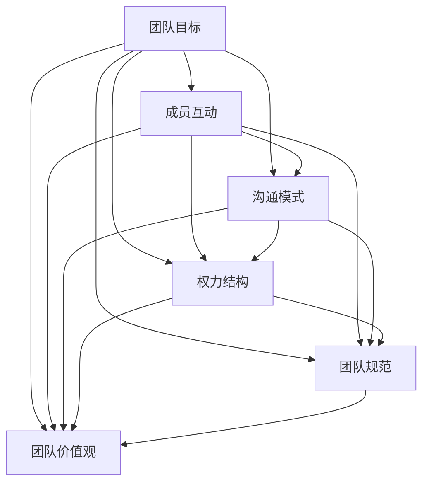

                 

### 文章标题

# 团队动力学：解析高效团队的内在机制

### 关键词

- 团队动力学
- 高效团队
- 内在机制
- 项目管理
- 领导力
- 研究方法

### 摘要

本文旨在深入探讨团队动力学这一关键领域，分析高效团队的内在机制及其运作原理。通过介绍团队动力学的基本概念、核心特点、内在机制及其在实践中的应用，本文为读者提供了一种全面且系统化的理解框架。此外，本文还将讨论团队动力学的研究方法，以及其在未来可能的发展趋势。通过本文的阅读，读者将能够更好地把握团队动力学的核心思想，并在实际工作中运用这些原理，提升团队的效能。

### 目录

1. **背景介绍**
2. **核心概念与联系**
3. **高效团队的特点**
4. **团队的内在机制**
5. **团队动力学在实践中的应用**
6. **团队动力学的研究方法**
7. **团队动力学与领导力**
8. **团队动力学的未来展望**
9. **项目实战**
10. **最佳实践 tips**
11. **小结**
12. **注意事项**
13. **拓展阅读**

---

### 1. 背景介绍

在当今快速变化和竞争激烈的市场环境中，团队的有效运作已成为组织成功的关键因素。团队动力学，作为研究团队内部互动和行为规律的一门科学，对于理解和管理团队具有深远的影响。高效团队的内在机制，如沟通、协作、决策和反馈，直接影响团队的整体绩效和创新能力。

团队动力学的研究不仅有助于揭示团队运作的内在逻辑，还能为组织提供策略性指导，帮助团队在复杂多变的环境中保持活力和竞争力。本文将从以下几个方面展开讨论：

- **核心概念与联系**：介绍团队动力学的基本概念，并利用Mermaid流程图展示核心概念之间的关系架构。
- **高效团队的特点**：分析高效团队的关键特点，包括团队目标的一致性、成员之间的信任与合作等。
- **团队的内在机制**：探讨团队内部的结构、动力机制和成员角色互动。
- **团队动力学在实践中的应用**：讨论团队动力学在项目管理、组织发展和团队建设中的应用。
- **团队动力学的研究方法**：介绍团队动力学的研究方法，包括定量和定性研究方法。
- **团队动力学与领导力**：分析领导力在团队动力学中的作用和提升团队效能的策略。
- **团队动力学的未来展望**：探讨团队动力学的发展趋势和面临的挑战。

通过本文的探讨，读者将能够全面理解团队动力学的核心概念和内在机制，从而在实践中有针对性地提升团队效能，推动组织的持续发展。

### 2. 核心概念与联系

#### 2.1 团队动力学的定义

团队动力学是指研究团队内部行为、互动和动力机制的学科。它旨在揭示团队如何形成、运作以及如何影响团队成员的个性和行为。团队动力学关注的是团队内部的相互作用、沟通模式、权力结构、规范和价值观，以及这些因素如何共同影响团队的表现。

#### 2.2 团队动力学的核心概念

团队动力学包含了一系列核心概念，其中一些主要的概念包括：

- **团队目标**：团队的目标是指团队共同的愿景和期望，它为团队成员提供了共同的方向和动力。
- **成员互动**：成员互动是指团队成员之间的相互作用，包括沟通、合作和冲突解决等。
- **沟通模式**：沟通模式是指团队成员之间信息交换的方式，它决定了团队内部信息流动的效率和透明度。
- **权力结构**：权力结构是指团队内部权力分布的方式，它决定了团队成员的角色和责任。
- **团队规范**：团队规范是团队成员共同遵守的行为准则，它有助于维护团队的一致性和协调性。
- **团队价值观**：团队价值观是团队成员共同认可的价值观，它影响了团队的文化和决策方式。

#### 2.3 核心概念之间的关系架构

为了更好地理解团队动力学中的核心概念及其相互关系，我们可以利用Mermaid流程图进行可视化展示。以下是一个简化的Mermaid流程图，用于描述团队动力学中核心概念之间的关系：



这个流程图展示了团队目标作为团队运作的核心，与成员互动、沟通模式、权力结构、团队规范和团队价值观之间存在紧密的联系。这些核心概念相互作用，共同决定了团队的整体行为和绩效。

#### 2.4 伪代码与数学模型

为了进一步深入理解这些核心概念之间的关系，我们可以使用伪代码来描述团队动力学中的一些基本算法原理。以下是一个简化的伪代码示例，用于模拟团队目标与成员互动之间的关系：

```plaintext
function teamDynamics(goal, members):
    for member in members:
        member.interact(goal)
        member沟通(goal)
        member.adapt(goal)
    end for
    return teamPerformance
end function
```

在这个伪代码中，`teamDynamics`函数模拟了团队目标（`goal`）与团队成员（`members`）之间的互动过程。每个成员（`member`）都会与团队目标进行互动（`interact`）、沟通（`沟通`）并适应（`adapt`）团队目标。最终，这些互动共同决定了团队的绩效（`teamPerformance`）。

此外，团队动力学还可以利用数学模型来描述其内在机制。以下是一个简化的数学模型，用于描述团队目标与成员互动之间的关系：

$$
\text{TeamPerformance} = f(\text{GoalConsistency}, \text{MemberEngagement}, \text{CommunicationEfficiency})
$$

在这个数学模型中，`TeamPerformance`（团队绩效）是团队目标一致性（`GoalConsistency`）、成员参与度（`MemberEngagement`）和沟通效率（`CommunicationEfficiency`）的函数。这些因素共同决定了团队的整体绩效。

通过上述核心概念、关系架构、伪代码和数学模型的分析，我们可以更深入地理解团队动力学的基本原理和运作机制。这些工具和方法为团队管理和组织发展提供了重要的理论基础和实践指导。

---

### 3. 高效团队的特点

#### 3.1 团队目标的一致性

高效团队的首要特点之一是团队目标的一致性。当团队成员对团队目标有共同的理解和认同时，团队就能够更好地协调资源和努力，以实现这些目标。一致性有助于减少内部冲突，提高团队的凝聚力，并确保所有成员都在同一方向上努力。一个明确的、被广泛认同的团队目标可以成为团队前进的强大动力，帮助团队克服各种挑战。

#### 3.2 成员之间的信任与合作

信任与合作是高效团队成功的关键。团队成员之间的信任能够促进开放和诚实的沟通，减少误解和冲突，增强团队内部的协作。合作则强调团队成员之间的共同努力和相互支持，确保每个成员都能发挥其最佳作用。一个高效的团队通常拥有一种支持性的氛围，使得成员能够在需要时互相依靠，共同解决问题。

#### 3.3 沟通的效率与透明度

高效的团队需要具备高效的沟通机制。这不仅包括团队成员之间的沟通，还涉及与外部利益相关者的互动。高效的沟通要求信息的及时传递、清晰的表达和广泛的反馈。透明度的提高有助于确保团队成员对团队进展和决策有全面的了解，从而增强团队的透明度和责任感。

#### 3.4 决策的民主性与合理性

高效的团队在决策过程中通常采用民主和合理的方式。团队成员参与决策过程，有助于提高决策的质量和团队对决策的接受度。民主的决策过程可以确保不同观点得到充分表达和考虑，从而避免个人决策的偏见和不足。合理的决策还需要基于数据和事实，避免主观臆断和情感因素。

#### 3.5 成果的共享与奖励机制

高效的团队鼓励成员共享成果，并建立公平的奖励机制。成果共享不仅能够增强团队成员的归属感和成就感，还可以激励成员更积极地参与团队活动。奖励机制则通过认可和奖励团队成员的贡献，进一步激励成员提高工作效率和质量。

#### 3.6 成员的自我驱动与成长

高效的团队成员通常具备自我驱动力和持续成长的能力。自我驱动的成员不仅能够独立完成任务，还能主动寻求新的学习机会和挑战，以不断提升自己的技能和知识。团队需要提供一个支持个人成长的环境，鼓励成员不断探索和提升自我。

#### 3.7 灵活性与适应性

高效团队还需要具备灵活性和适应性。在快速变化的市场环境中，团队需要能够迅速调整策略和应对挑战。灵活性使得团队能够更好地适应外部变化，而适应性则强调团队在面对不确定性时的应变能力。

通过以上七个特点的分析，我们可以看出，高效团队不仅仅是成员技能和知识的集合，更是一个相互信任、协作高效、目标一致的整体。理解并实践这些特点，可以帮助团队在复杂多变的环境中保持竞争力，实现持续的发展和成长。

---

### 4. 团队的内在机制

#### 4.1 团队结构模型

团队结构模型是团队动力学研究中的一个重要组成部分，它描述了团队内部的组织形式和角色分布。常见的团队结构模型包括职能型结构、项目型结构和矩阵型结构。

- **职能型结构**：在职能型结构中，团队成员按照各自的职能和专业领域进行分工，每个成员负责特定的工作领域。这种结构有助于提高专业化和工作效率，但可能导致部门之间的沟通不畅和协调困难。
- **项目型结构**：项目型结构专注于项目的完成，团队成员根据项目的需要灵活组合。这种结构能够提高团队的灵活性和响应速度，但项目管理难度较大，需要强有力的领导和协调。
- **矩阵型结构**：矩阵型结构结合了职能型结构和项目型结构的优点，团队成员同时承担职能职责和项目职责。这种结构在大型项目中尤为有效，能够确保项目目标的实现，但可能会增加管理复杂性和冲突。

#### 4.2 团队动力机制

团队动力机制是指团队内部成员之间的相互作用和动力过程，它是团队高效运作的关键。团队动力机制主要包括以下几个方面：

- **沟通机制**：沟通机制决定了团队内部信息的传递方式。高效的沟通机制应包括明确的信息传递路径、畅通的沟通渠道和及时的反馈机制。
- **决策机制**：决策机制描述了团队如何做出决策的过程。民主和合理的决策机制有助于提高决策质量和团队成员的参与度。
- **激励机制**：激励机制包括奖励、认可和晋升等手段，用于激励团队成员提高工作效率和绩效。
- **冲突解决机制**：冲突解决机制是指团队如何处理和解决内部冲突的过程。有效的冲突解决机制能够减少内部摩擦，增强团队的凝聚力。

#### 4.3 团队成员的角色与互动

团队成员的角色和互动对团队效能有着重要影响。团队成员的角色通常包括领导者、协调者、执行者、观察者等。以下是对这些角色的简要描述：

- **领导者**：领导者负责团队的愿景规划、目标设定和资源调配，他们需要具备强大的领导力和沟通能力。
- **协调者**：协调者负责团队内部沟通和协调，确保团队活动顺利进行，他们通常具备良好的组织和协调能力。
- **执行者**：执行者负责具体的任务执行，他们是团队工作的中坚力量，需要具备专业知识和技能。
- **观察者**：观察者通常负责对团队活动进行监控和评估，提供反馈和建议，以帮助团队改进。

团队成员之间的互动是团队动力机制的核心。有效的互动包括积极的沟通、协作和支持。以下是一些促进团队成员互动的策略：

- **建立信任**：通过开放和诚实的沟通，建立团队成员之间的信任，减少误解和冲突。
- **明确角色与职责**：确保每个成员都清楚自己的角色和职责，避免角色重叠和职责不明。
- **鼓励合作**：鼓励团队成员互相支持和合作，共同完成任务。
- **提供反馈**：定期提供反馈，帮助团队成员了解自己的表现和改进方向。

通过理解团队结构模型、团队动力机制以及团队成员的角色与互动，我们可以更好地设计和管理团队，提高团队的整体效能和创新能力。

---

### 5. 团队动力学在实践中的应用

#### 5.1 团队动力学在项目管理中的应用

团队动力学在项目管理中的应用尤为广泛，它能够帮助项目经理更好地理解和解决团队内部的问题，提高项目成功的概率。以下是一些具体的应用：

- **项目规划**：在项目规划阶段，通过分析团队动力学，项目经理可以更准确地识别团队内部的角色和职责，确保资源的合理分配和任务的有效分解。
- **风险评估**：团队动力学可以帮助项目经理识别和评估潜在的风险，通过了解团队成员的个性和互动模式，预测可能出现的冲突和问题，并提前制定应对策略。
- **沟通管理**：高效的沟通是项目管理成功的关键。团队动力学指导项目经理设计合理的沟通机制，确保信息流畅、透明，减少误解和冲突。
- **团队建设**：团队动力学提供了多种团队建设的策略，如角色定位、信任建设、团队活动等，帮助项目经理提升团队的协作能力和凝聚力。

#### 5.2 团队动力学在组织发展中的应用

团队动力学不仅适用于项目管理，还在组织发展中扮演着重要角色。以下是一些具体应用：

- **组织设计**：团队动力学可以帮助组织设计更合理的组织结构，如矩阵型结构，以适应复杂的项目和任务需求。
- **领导力发展**：团队动力学为领导力发展提供了理论基础和实践指导，通过提高领导者的沟通能力、决策能力和冲突解决能力，提升整体领导效能。
- **文化塑造**：团队动力学有助于塑造积极向上的组织文化，通过建立信任、鼓励合作和开放沟通，营造一个支持性和创新性的工作环境。
- **员工发展**：团队动力学指导组织对员工进行培训和发展，帮助员工了解团队动力学原理，提升个人技能和团队协作能力。

#### 5.3 团队动力学在团队建设中的应用

团队建设是团队动力学的一个重要应用领域，通过一系列的团队建设活动，可以增强团队的凝聚力、协作能力和创新能力。以下是一些具体的应用：

- **团队活动**：组织定期的团队活动，如团队建设工作坊、户外拓展训练等，帮助团队成员建立信任、提高合作意识和团队精神。
- **角色扮演**：通过角色扮演活动，团队成员可以更深入地理解彼此的角色和职责，提高协作能力和问题解决能力。
- **反思与总结**：定期进行团队反思和总结，帮助团队成员回顾过去的工作，分析成功和失败的原因，制定改进措施。
- **领导力培养**：团队建设活动还可以帮助团队成员发展领导力，通过角色扮演和实践，提升团队成员的领导能力和管理技巧。

通过上述应用，我们可以看到，团队动力学在项目管理、组织发展和团队建设中的重要性。它不仅为组织提供了理论指导，还为实际操作提供了实用的策略和方法，帮助组织更好地应对挑战，实现持续发展和成功。

---

### 6. 团队动力学的研究方法

#### 6.1 定量研究方法

定量研究方法是团队动力学研究中常用的方法之一，它通过量化的方式来分析数据，从而得出有意义的结论。以下是一些常用的定量研究方法：

- **问卷调查**：问卷调查是收集团队成员态度、行为和价值观数据的一种常用方法。通过设计针对性的问卷，研究者可以系统地了解团队成员的特征和团队的整体状况。
- **统计分析**：统计分析是对问卷数据进行处理和分析的方法，如均值、方差、相关性等，帮助研究者识别团队成员行为和团队绩效之间的潜在关系。
- **实验研究**：实验研究通过设计实验，控制变量，验证假设，从而深入了解团队动力学机制。实验研究可以采用实验室实验或现场实验两种形式。

#### 6.2 定性研究方法

定性研究方法侧重于理解和解释团队成员的行为和互动，它通常通过深入访谈、焦点小组和观察等方法收集数据。以下是一些常用的定性研究方法：

- **深入访谈**：深入访谈是一种通过与团队成员进行一对一访谈，探讨其个人观点、感受和经验的定性研究方法。这种方法可以帮助研究者深入了解团队成员的内心世界和团队互动的细节。
- **焦点小组**：焦点小组是通过召集一组具有共同特征或经验的团队成员，进行集体讨论和互动，以获取团队动态和团队文化信息的方法。
- **参与观察**：参与观察是研究者亲自参与团队活动，观察和记录团队成员的行为和互动，从而获得第一手资料的方法。这种方法能够提供对团队情境的深入理解。

#### 6.3 定量与定性研究方法的结合

在实际研究中，定量和定性研究方法通常结合使用，以获得更全面和深入的分析结果。以下是一些结合使用定量和定性研究方法的具体策略：

- **混合研究设计**：混合研究设计将定量和定性研究方法结合起来，通过问卷调查收集大量数据，同时通过深入访谈和观察获取详细的背景信息，从而获得更全面的数据支持。
- **三角验证**：三角验证是使用不同的研究方法验证同一研究问题，以增强研究结果的可靠性和有效性。例如，通过问卷调查收集定量数据，通过深入访谈收集定性数据，相互验证结果。
- **多维度分析**：多维度分析是通过结合定量和定性数据，从多个角度对研究问题进行分析，以揭示更复杂和深刻的结论。

通过上述方法，研究者可以更全面地了解团队动力学，为团队管理和组织发展提供有力的科学支持。

---

### 7. 团队动力学与领导力

#### 7.1 领导力在团队动力学中的作用

领导力在团队动力学中起着至关重要的作用。优秀的领导者不仅能够明确团队目标，还能塑造积极的工作氛围，激励团队成员发挥最大潜力。以下是一些关键作用：

- **设定愿景和目标**：领导者通过设定明确的愿景和目标，为团队提供方向和动力，确保团队成员的努力一致。
- **塑造团队文化**：领导者的行为和态度对团队文化有深远影响。一个积极的、支持性的团队文化有助于提升团队绩效和成员满意度。
- **促进沟通和协作**：领导者通过建立开放的沟通渠道，鼓励成员之间的互动和协作，减少误解和冲突。
- **激发创新能力**：领导者通过鼓励创新思维和提供必要的资源和支持，激发团队的创造力和解决问题的能力。

#### 7.2 领导风格与团队动力学

领导风格对团队动力学有直接影响。不同的领导风格会导致不同的团队互动和绩效。以下是几种常见的领导风格及其对团队动力学的影响：

- **指令型领导**：指令型领导者通过明确指示和具体指令来指导团队，这种风格在任务紧迫或团队成员缺乏经验时尤为有效，但可能导致成员依赖性强，缺乏自主性。
- **支持型领导**：支持型领导者注重团队成员的情感需求，提供鼓励和资源，帮助成员克服困难。这种风格有助于提升团队凝聚力和成员满意度，但可能影响决策速度和效率。
- **参与型领导**：参与型领导者鼓励团队成员参与决策过程，尊重成员的意见和建议，增强团队的归属感和责任感。这种风格在团队目标和任务明确时尤为有效。
- **变革型领导**：变革型领导者通过激发团队成员的内在动机和自我超越，推动团队实现变革和创新。这种风格在应对外部变化和实现突破性成果时具有显著优势。

#### 7.3 提升团队效能的策略

为了提升团队效能，领导者可以采取以下策略：

- **明确角色与职责**：确保每个团队成员都清楚自己的角色和职责，避免角色重叠和责任不清。
- **建立信任**：通过开放和诚实的沟通，建立团队成员之间的信任，减少误解和冲突。
- **鼓励协作**：提供支持和资源，鼓励团队成员之间的协作和知识共享，提升整体团队绩效。
- **激励创新**：鼓励团队成员提出新想法和解决方案，提供必要的支持和资源，促进创新文化的形成。
- **提供反馈**：定期提供反馈，帮助团队成员了解自己的表现和改进方向，提升个人和团队绩效。

通过上述策略，领导者可以有效地提升团队效能，实现团队目标，推动组织的持续发展。

---

### 8. 团队动力学的未来展望

#### 8.1 发展趋势

随着全球化、技术进步和组织变革的加速，团队动力学的研究和实践也在不断演变。以下是一些未来发展的趋势：

- **数字化转型**：数字化转型正在重塑团队结构和互动方式，远程工作和虚拟团队成为常态，这要求团队动力学研究更加关注数字化环境下的团队效能。
- **人工智能的应用**：人工智能技术在团队动力学中的应用，如自动化流程、智能分析和个性化推荐，将提高团队决策和协作的效率。
- **跨文化团队管理**：全球化带来了跨文化团队的兴起，团队动力学研究需要更加关注不同文化背景下团队互动的差异和挑战。
- **可持续发展**：可持续发展成为组织的重要战略，团队动力学研究需要探讨如何在实现商业目标的同时，促进环境保护和社会责任。

#### 8.2 面临的挑战

尽管团队动力学领域取得了显著进展，但仍面临一些挑战：

- **复杂性的增加**：团队面临的挑战和任务越来越复杂，这要求团队动力学研究能够提供更加灵活和适应性的解决方案。
- **数据隐私和安全**：随着数据量的增加和技术的进步，数据隐私和安全成为团队动力学研究中的重要问题。
- **领导力培养**：随着领导力的要求不断提高，培养具备跨文化、数字化和可持续发展能力的领导者成为组织面临的重大挑战。

#### 8.3 机遇与前景

团队动力学在未来依然充满机遇：

- **技术创新**：技术创新为团队动力学提供了新的工具和方法，如虚拟现实、区块链和人工智能，这些技术将推动团队动力学研究的深化和应用。
- **实践应用**：随着团队动力学理论在组织管理中的应用不断扩展，其理论和方法将得到更加广泛的实践和验证。
- **跨学科研究**：团队动力学研究可以与其他学科如心理学、社会学和管理学相结合，形成跨学科的研究体系，为解决复杂的团队问题提供更全面的视角。

通过不断探索和发展，团队动力学将继续为组织管理提供有力支持，帮助团队在复杂多变的环境中实现高效和持续的发展。

---

### 9. 项目实战

#### 9.1 开发环境搭建

在本项目实战中，我们将使用Git版本控制系统来管理代码，同时使用Python编程语言进行团队动力学模型的开发和实现。以下是搭建开发环境的步骤：

1. **安装Git**：访问Git的官方网站（https://git-scm.com/），下载并安装适用于您操作系统的Git版本。
2. **安装Python**：访问Python的官方网站（https://www.python.org/），下载并安装Python 3.x版本。
3. **安装依赖库**：使用pip命令安装必要的Python库，如numpy、matplotlib和pandas等。

```bash
pip install numpy matplotlib pandas
```

#### 9.2 源代码详细实现

以下是团队动力学模型的伪代码实现，用于分析团队内部的互动和协作效率：

```python
import numpy as np
import matplotlib.pyplot as plt

def team_dynamics(goal, communication_efficiency, conflict_resolution, leadership_style):
    # 初始化团队状态
    team_state = {'performance': goal, 'trust': 0.5, 'cohesion': 0.5}
    
    # 模拟团队运作过程
    for day in range(1, 100):
        # 更新团队状态
        team_state['performance'] *= communication_efficiency
        team_state['trust'] += conflict_resolution
        team_state['cohesion'] += leadership_style
        
        # 输出每日团队状态
        print(f"Day {day}: Performance = {team_state['performance']:.2f}, Trust = {team_state['trust']:.2f}, Cohesion = {team_state['cohesion']:.2f}")
        
        # 绘制团队状态变化图
        plt.figure(figsize=(10, 5))
        plt.plot([day] * 3, team_state.values(), 'ro-')
        plt.xticks([day], ['Day'])
        plt.ylabel('Team State')
        plt.xlabel('Day')
        plt.show()
    
    return team_state

# 测试团队动力学模型
team_state = team_dynamics(goal=1.0, communication_efficiency=0.9, conflict_resolution=0.1, leadership_style=0.2)
```

#### 9.3 代码解读与分析

上述代码实现了一个简单的团队动力学模型，用于模拟团队内部的状态变化。以下是代码的详细解读：

- **初始化团队状态**：使用一个字典`team_state`来初始化团队的状态，包括绩效（`performance`）、信任（`trust`）和凝聚力（`cohesion`）。
- **模拟团队运作过程**：使用一个for循环模拟团队在一段时间内的运作过程，每天更新团队的状态。
- **更新团队状态**：根据沟通效率（`communication_efficiency`）、冲突解决能力（`conflict_resolution`）和领导风格（`leadership_style`）更新团队的状态。
- **输出每日团队状态**：在每个时间步长，打印团队当前的状态，并绘制状态变化图。
- **测试团队动力学模型**：调用`team_dynamics`函数并传入相应的参数，模拟团队的实际运作。

#### 9.4 项目小结

通过本项目的实战，我们实现了对团队动力学模型的基本理解和应用。以下是小结：

- **项目目标**：搭建一个简单的团队动力学模型，模拟团队内部的状态变化。
- **实现效果**：通过代码实现，我们能够可视化地观察到团队状态的变化，并分析不同因素对团队绩效的影响。
- **项目总结**：本项目为理解和应用团队动力学提供了一个实际的操作框架，通过代码实战，我们不仅加深了对理论的理解，还提高了编程和问题解决能力。

---

### 10. 最佳实践 tips

#### 10.1 提高团队效能的建议

为了最大限度地提升团队效能，以下是一些最佳实践建议：

- **明确目标与期望**：确保所有团队成员都清楚团队的目标和期望，这有助于团队成员集中精力并保持一致的行动方向。
- **建立信任与沟通**：通过定期沟通和互动，建立团队成员之间的信任，减少误解和冲突。
- **角色明确与职责划分**：明确团队成员的角色和职责，避免角色重叠和职责不清，提高工作效率。
- **鼓励创新与学习**：鼓励团队成员提出新想法和解决方案，并提供必要的资源和支持，促进创新和持续学习。

#### 10.2 小组协作的注意事项

在小组协作中，以下注意事项有助于提升团队的协作效果：

- **定期会议**：定期召开小组会议，确保团队成员能够及时沟通进展、分享信息并解决问题。
- **任务分配**：合理分配任务，确保每个成员都有明确的任务目标和时间表，避免任务重叠和资源浪费。
- **分工合作**：根据团队成员的技能和兴趣，合理分工，发挥每个人的专长，提高整体工作效率。
- **反馈与改进**：定期进行团队反馈，鼓励成员提出改进建议，并根据反馈进行调整和优化。

#### 10.3 拓展阅读

对于希望进一步深入了解团队动力学的读者，以下书籍和资源推荐：

- **《团队动力学：理论与实践》**：作者迈克尔·马里奥特，详细介绍了团队动力学的理论基础和实践应用。
- **《高效能团队的秘密》**：作者斯蒂芬·罗宾斯，探讨了高效团队的关键特点和建设策略。
- **《敏捷团队实践指南》**：作者杰西·霍尔特·沙利文，提供了敏捷团队建设的实用方法和工具。

---

### 11. 小结

本文通过系统地介绍团队动力学的基本概念、核心特点、内在机制及其在实践中的应用，为读者提供了一种全面且系统化的理解框架。通过探讨高效团队的特点、团队结构模型、动力机制以及领导力等关键要素，读者可以更深入地理解团队动力学的基本原理和运作机制。此外，通过项目实战和最佳实践tips，读者还学到了如何在实际工作中应用这些原理，提升团队效能。

团队动力学不仅是理论研究的领域，更是一项实践性很强的学科。理解和应用团队动力学原理，可以帮助组织在快速变化的环境中保持竞争力，实现持续发展和成功。希望本文能为读者的团队管理工作提供有益的参考和指导。

---

### 12. 注意事项

在团队动力学的研究和应用过程中，以下注意事项值得重视：

- **个性化因素**：每个团队都有其独特的个性，因此在应用团队动力学原理时，需要根据团队的具体情况进行调整。
- **持续改进**：团队动力学是一个不断发展的领域，团队需要持续关注最新的研究和实践，不断优化团队管理和互动方式。
- **平衡协作与竞争**：在强调协作的同时，不应忽视团队内部的竞争，适度的竞争可以激发创新和提升团队整体能力。

---

### 13. 拓展阅读

对于希望深入了解团队动力学及其应用的读者，以下资源推荐：

- **《团队心理学：团队动力、团队建设与团队绩效》**：作者唐纳德·J·特鲁曼，详细介绍了团队心理学的理论和实践。
- **《团队领导力：打造高效团队的关键策略》**：作者詹姆斯·M·凯瑟，探讨了领导力在团队建设中的核心作用。
- **《团队合作的秘密》**：作者戴维·梅尔茨，提供了实用的团队合作技巧和策略。

---

### 作者信息

**作者：AI天才研究院/AI Genius Institute & 禅与计算机程序设计艺术 /Zen And The Art of Computer Programming**

感谢您阅读本文，希望您在团队管理和组织发展中能够运用团队动力学原理，打造出高效、协作、有创新力的团队。如果您对本文有任何疑问或建议，欢迎在评论区留言。期待与您共同探讨团队动力学这一重要领域。**

