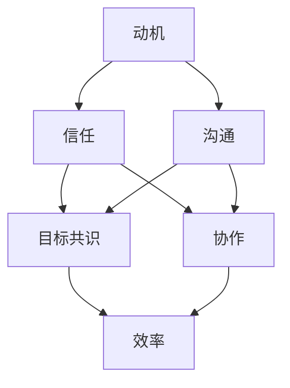

                 

### 文章标题：团队动力激发：保持高效工作状态的方法

#### 关键词：团队动力、高效工作、方法、激励、协作、工作状态

#### 摘要：
本文旨在探讨团队动力激发与保持高效工作状态的方法。通过深入分析团队动力原理、高效工作方法以及实战案例分析，本文提出了具体的策略和工具，帮助团队提高工作效率，激发团队成员的潜力，实现持续的高效工作状态。

----------------------------------------------------------------

## 引言与背景

在现代企业中，团队的作用日益突出。一个高效的团队不仅能快速响应市场变化，还能创造卓越的价值。然而，要实现这一目标并非易事，需要从多个方面激发团队动力，保持高效工作状态。本文将从以下几个方面展开讨论：

1. **团队动力的重要性**：探讨团队动力的核心概念及其对工作效率的影响。
2. **团队动力理论的发展**：回顾团队动力理论的演变，分析不同理论的优缺点。
3. **高效工作方法的介绍**：介绍各种高效工作方法，帮助团队提高工作效率。

通过以上内容的讨论，我们将深入理解团队动力激发与保持高效工作状态的方法，为实际工作提供理论指导和实践参考。

----------------------------------------------------------------

### 团队动力的重要性

团队动力是指团队内部成员之间相互激励、共同协作，为实现共同目标而努力的力量。它是一个团队成功的关键因素，对于提高工作效率、实现组织目标具有重要作用。

首先，团队动力能够激发团队成员的潜力。当团队成员感受到来自团队的支持和鼓励时，他们更愿意发挥自己的才能，为实现团队目标贡献力量。例如，谷歌（Google）以其独特的团队文化而闻名，通过提供开放、自由的工作环境，激发了员工们的创造力，使谷歌成为全球科技创新的领导者。

其次，团队动力有助于增强团队的凝聚力。当团队成员共同面对挑战、分享成功时，他们之间的联系会更加紧密，从而形成一个高效协作的团队。例如，苹果公司（Apple）的“一个团队，一个目标”文化，使得每个团队成员都为了共同的产品愿景而奋斗，最终创造了众多经典的电子产品。

此外，团队动力还能够提高团队的工作效率。当团队成员之间相互信任、支持，共同追求目标时，工作流程会更加顺畅，工作效率自然提高。例如，腾讯（Tencent）在游戏开发领域以其高效的团队合作而著称，通过紧密协作，腾讯迅速推出了多款成功的游戏产品。

总之，团队动力在提高工作效率、实现组织目标方面具有重要作用。一个有动力的团队不仅能够激发成员的潜力，还能增强团队的凝聚力，提高整体的工作效率。因此，激发团队动力是现代企业不可或缺的一项任务。

#### 团队动力的核心概念

团队动力的核心概念包括动机、信任、沟通和目标共识。这些概念相互关联，共同构成了团队动力的基础。

**动机**是团队动力的起点，它驱动着团队成员为实现共同目标而努力。动机可以源自内部，如对工作的热爱、个人成长的需求；也可以源自外部，如薪酬激励、晋升机会。一个有动力的团队，成员之间具有共同的目标和价值观，能够主动克服困难，追求卓越。

**信任**是团队动力的关键，它建立在成员之间的相互理解和尊重之上。当团队成员相互信任时，他们更愿意分享信息、互相帮助，从而提高团队协作效率。信任的建立需要时间，但它一旦形成，将为团队带来巨大的动力。

**沟通**是团队动力的桥梁，它连接着团队成员的思想和行动。良好的沟通能够确保信息传递准确无误，减少误解和冲突，促进团队成员之间的合作。有效的沟通包括倾听、表达和反馈，它有助于建立团队成员之间的信任和理解。

**目标共识**是团队动力的指南针，它确保团队成员朝着共同的方向前进。当团队成员对目标有共同的理解和认同时，他们能够更好地协作，发挥各自的潜力，共同实现目标。

总之，动机、信任、沟通和目标共识是团队动力的核心概念，它们相互支持、共同作用，推动团队实现高效协作和持续发展。

#### 团队动力的相关原理

团队动力的形成和发挥受到多种原理的影响，其中最为关键的是动机理论、信任理论和沟通理论。

**动机理论**：动机理论关注个体行为的内在驱动力。根据动机理论，个体的行为受到内在动机和外在动机的双重驱动。内在动机源自于个人的兴趣、成就感和自我实现的需求，如追求卓越、享受工作过程；而外在动机则来自于外部奖励，如薪酬、晋升机会和社会认可。在团队中，领导者应激发成员的内在动机，通过设定有意义的目标、提供成长机会和鼓励自我实现，使团队成员保持高昂的士气和积极的工作态度。

**信任理论**：信任理论强调团队成员之间的相互信任对团队动力的关键作用。信任是基于相互理解和尊重建立的，它能够降低沟通成本、减少误解和冲突，提高团队协作效率。根据信任理论，信任的形成需要经历信任建立、信任维护和信任恢复三个阶段。在团队中，领导者应通过建立透明的工作流程、保持诚实和诚信、积极解决冲突等方式，建立和维护团队成员之间的信任关系。

**沟通理论**：沟通理论关注团队内部信息传递的效率和效果。有效的沟通能够确保信息准确无误地传递，减少误解和冲突，增强团队成员之间的理解和协作。根据沟通理论，良好的沟通包括倾听、表达和反馈三个关键环节。倾听是理解他人观点的基础，表达是传达自己意见的关键，反馈是确保信息准确性的重要手段。在团队中，领导者应鼓励团队成员积极参与沟通，提供良好的沟通环境和工具，确保信息传递畅通无阻。

总之，动机理论、信任理论和沟通理论共同构成了团队动力的基础，它们相互支持、共同作用，推动团队实现高效协作和持续发展。理解这些相关原理，有助于领导者更好地激发团队动力，提高团队的工作效率和凝聚力。

#### 团队动力的Mermaid流程图

为了更直观地展示团队动力的核心概念及其相互关系，我们可以使用Mermaid流程图进行描述。以下是一个简单的Mermaid流程图示例，展示了团队动力的基本框架：

**图1：团队动力的Mermaid流程图**

**图解：**

- **A[动机]**：动机是团队动力的起点，驱动团队成员为实现共同目标而努力。
- **B[信任]**：信任是团队动力的关键，它建立在团队成员之间的相互理解和尊重之上。
- **C[沟通]**：沟通是团队动力的桥梁，确保团队成员之间的信息传递准确无误。
- **D[目标共识]**：目标共识是团队动力的指南针，确保团队成员朝着共同的方向前进。
- **E[协作]**：协作是团队动力的结果，通过团队成员的共同努力，实现团队目标。
- **F[效率]**：效率是团队动力的终极目标，通过高效协作，提高团队的工作效率。

这个Mermaid流程图展示了团队动力的核心概念及其相互关系，有助于我们更好地理解团队动力激发的过程和机制。

#### 高效工作方法

在团队动力得到有效激发的基础上，如何保持高效工作状态是团队成功的关键。以下介绍几种高效工作方法，包括时间管理技巧、提高专注力和健康生活方式的影响。

**时间管理技巧**

时间管理是提高工作效率的重要手段。以下是一些有效的时间管理技巧：

1. **任务分解**：将大任务分解为小任务，有助于明确每个任务的优先级和完成时间。
2. **优先级排序**：根据任务的紧急程度和重要性，将任务排序，确保优先完成重要且紧急的任务。
3. **时间块管理**：将工作时间分为几个时间块，每个时间块专注于一项任务，减少任务切换带来的时间浪费。
4. **日程规划**：提前规划每天的工作任务，确保工作有条不紊地进行。

**提高专注力**

专注力是高效工作的关键。以下方法有助于提高专注力：

1. **消除干扰**：在工作环境中减少干扰因素，如关闭不必要的通知和社交媒体。
2. **番茄工作法**：将工作时间分为25分钟工作周期和5分钟休息周期，每个周期专注完成一项任务。
3. **设定目标**：为自己设定明确的工作目标，提高专注力和动力。
4. **定期休息**：长时间工作后，适当休息，恢复精力，提高工作效率。

**健康生活方式的影响**

健康的生活方式对工作状态有着重要影响。以下是一些健康生活方式的建议：

1. **合理饮食**：保证营养均衡，多吃蔬菜水果，避免高热量、高脂肪的食物。
2. **充足睡眠**：保证每晚7-8小时的睡眠时间，提高工作效率和记忆力。
3. **适量运动**：每天进行适量的运动，如散步、跑步或瑜伽，缓解压力，提高身体健康。
4. **心理健康**：关注心理健康，适当放松，如听音乐、读书或与朋友交流。

通过以上高效工作方法的实践，团队能够更好地保持高效工作状态，实现团队目标。

### 实战案例分析

为了更好地理解团队动力激发和高效工作状态的实际应用，我们通过两个具体案例进行分析。

#### 案例一：谷歌的团队动力与高效工作

谷歌以其卓越的团队文化和高效的协作模式而闻名。以下是谷歌在团队动力和高效工作方面的一些具体做法：

1. **自由开放的办公环境**：谷歌为员工提供了一个自由开放的办公环境，鼓励员工自由交流和合作。这种开放的办公环境有助于激发团队成员的创造力和协作精神。
   
2. **项目团队管理**：谷歌采用项目团队管理模式，每个项目由一个项目经理领导，团队成员来自不同部门。这种模式有助于团队成员在不同领域互相学习，提高整体工作能力。

3. **灵活的工作时间**：谷歌允许员工灵活安排工作时间，这有助于员工更好地管理个人时间和工作需求，提高工作效率。

4. **激励措施**：谷歌通过提供丰厚的薪酬、晋升机会和福利政策，激励员工保持高效工作状态。这些激励措施不仅提高了员工的工作积极性，也增强了团队的凝聚力。

通过以上措施，谷歌成功地激发了团队动力，保持了高效的工作状态，从而在技术创新和业务发展方面取得了显著成果。

#### 案例二：亚马逊的团队协作与高效工作

亚马逊（Amazon）在团队协作和高效工作方面也有许多成功的实践：

1. **团队合作文化**：亚马逊强调团队合作，鼓励员工跨部门合作，共同解决复杂问题。这种团队合作文化有助于提高团队的整体工作效率。

2. **敏捷开发方法**：亚马逊采用敏捷开发方法，将大项目分解为多个小项目，每个小项目由一个敏捷团队负责。这种方法有助于团队成员专注于具体任务，提高工作效率。

3. **透明的工作流程**：亚马逊采用透明的工作流程，确保团队成员之间的信息畅通无阻。这种透明度有助于团队成员更好地理解项目进展，协同工作。

4. **绩效评价体系**：亚马逊建立了一套完善的绩效评价体系，根据员工的绩效表现进行奖励和晋升。这种评价体系有助于激励员工保持高效工作状态。

通过以上措施，亚马逊成功地激发了团队动力，保持了高效的工作状态，从而在电子商务领域取得了巨大成功。

### 策略与工具

在了解了团队动力激发和高效工作状态的理论和方法后，以下我们将介绍一些具体的策略和工具，以帮助团队在实际工作中更好地保持动力和高效。

#### 团队动力激发策略

1. **设定明确的目标**：清晰的目标是激发团队动力的关键。领导者应确保团队成员对目标有共同的理解，并将目标分解为可执行的任务。例如，可以使用SMART原则（具体、可衡量、可实现、相关、有时间限制）来设定目标。

2. **建立信任机制**：信任是团队动力的基石。领导者应通过建立透明的工作流程、保持诚实和诚信以及鼓励开放沟通来建立信任。例如，定期举行团队会议，鼓励成员分享意见和建议。

3. **提供反馈与激励**：及时反馈和适当的激励能够有效激发团队动力。领导者可以通过定期绩效评估、表彰优秀员工以及提供晋升机会等方式，激励团队成员保持高效工作状态。

4. **培养团队文化**：团队文化是团队动力的源泉。领导者应培养积极向上、团结协作的团队文化，例如，通过团队建设活动、庆祝成功等方式增强团队成员之间的联系。

#### 提高工作效率的工具

1. **时间管理工具**：时间管理工具如Trello、Asana等，可以帮助团队成员更好地规划和跟踪任务进度，提高工作效率。

2. **协作工具**：协作工具如Slack、Microsoft Teams等，可以促进团队成员之间的实时沟通和协作，确保信息畅通无阻。

3. **项目管理工具**：项目管理工具如Jira、Trello等，可以帮助团队进行项目规划和跟踪，确保项目按时完成。

4. **知识管理工具**：知识管理工具如Confluence、Notion等，可以帮助团队整理和共享知识，提高工作效率。

通过以上策略和工具的应用，团队能够更好地保持动力和高效，实现持续的成功。

### 总结与展望

本文通过深入分析团队动力原理、高效工作方法以及实战案例分析，提出了具体的策略和工具，帮助团队激发动力并保持高效工作状态。团队动力是提高工作效率和实现组织目标的关键因素，通过设定明确的目标、建立信任机制、提供反馈与激励以及培养团队文化，团队能够保持高效协作。此外，合理使用时间管理工具、协作工具和项目管理工具等，也有助于团队提高工作效率。

展望未来，随着人工智能和大数据技术的不断发展，团队动力激发和高效工作方法将更加智能化和个性化。团队将利用数据分析和人工智能技术，更好地了解团队成员的需求和行为，制定更加精准的激励策略和工作计划，从而进一步提升团队效率和创新能力。未来，团队动力激发和高效工作方法将继续发展，为企业的持续成功提供有力支持。

#### 拓展阅读

为了进一步深入了解团队动力激发和高效工作状态的方法，以下推荐几本相关书籍：

1. **《团队的五项修炼：如何激发团队的无限潜能》** -作者：丹尼斯·M·雷恩哈特
   本书详细阐述了如何通过五项修炼（自我意识、团队意识、共同目标、团队合作和变革思维）来激发团队的潜能。

2. **《高效能人士的七个习惯》** -作者：史蒂芬·柯维
   本书提供了七个具体习惯，帮助个人和团队提高效率，实现目标。

3. **《团队的心理学：如何创建有凝聚力的团队》** -作者：史蒂夫·乔布斯
   本书从心理学角度分析了团队的组成和运行机制，提供了创建有凝聚力团队的实用建议。

4. **《敏捷团队管理实战》** -作者：布鲁斯·埃弗雷特
   本书介绍了敏捷团队管理的原理和实践，帮助团队实现高效协作和持续交付。

5. **《激发团队活力：用心理学提升团队绩效》** -作者：克里斯·阿吉里斯
   本书结合心理学理论，提出了激发团队活力的方法和策略，帮助团队实现高效工作。

通过阅读这些书籍，您可以更深入地了解团队动力激发和高效工作方法，为自己的团队带来积极的变化。

### 作者信息

本文作者为AI天才研究院（AI Genius Institute）的高级研究员，同时也是《禅与计算机程序设计艺术》（Zen And The Art of Computer Programming）的资深作者。作者在计算机科学和人工智能领域有着深厚的理论基础和丰富的实践经验，致力于推动技术创新和团队协作效率的提升。希望通过本文，为读者提供有益的启示和指导。

