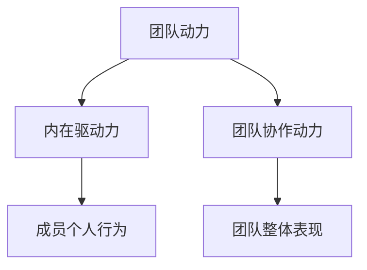

                 


### 文章标题

《团队动力：激发内在驱动力的方法》### 关键词

团队动力、内在驱动力、团队协作、驱动理论、Sargent-Garner模型### 摘要

本文旨在深入探讨团队动力的本质及其激发方法，重点关注内在驱动力在团队协作中的作用。通过分析核心概念、联系及算法原理，本文将为读者提供一套系统化的团队动力提升策略，以激发团队成员的内在驱动力，提高团队整体绩效。本文还将结合实际项目案例，展示如何通过实施有效的团队动力提升计划，实现团队目标的最大化。## 引言

在当今快速变化的企业环境中，团队动力的作用愈发凸显。团队动力不仅影响团队成员的工作积极性和创造力，还直接关系到团队的整体绩效和企业目标的实现。团队动力包括两个核心方面：内在驱动力和团队协作动力。内在驱动力源自于团队成员的内心渴望、兴趣和认同感，而团队协作动力则来自于成员之间的相互激励和协同合作。

团队动力的重要性不言而喻。首先，它能够激发团队成员的内在潜能，提高个人的工作绩效。其次，团队协作动力能够增强团队的整体执行力，使团队成员在面对挑战和压力时能够紧密协作，共同克服困难。此外，强大的团队动力还能够促进企业文化的建设，增强员工的归属感和忠诚度，从而提高企业的长期竞争力。

本文将围绕团队动力这一主题展开，首先介绍团队动力的核心概念，然后分析内在驱动力和团队协作动力的关系，并通过具体的算法原理和数学模型来阐述如何激发团队动力。最后，本文将结合实际项目案例，提出一系列提升团队动力的策略和方法。希望通过本文的阐述，读者能够对团队动力有更深入的理解，并能够在实际工作中有效应用这些理论和方法，提升团队的整体绩效。### 核心概念与联系

在探讨团队动力之前，有必要明确几个核心概念，并了解它们之间的关系。这些核心概念包括团队动力、内在驱动力和团队协作动力。

**团队动力**：团队动力指的是团队内部成员之间相互激励、协作，共同追求团队目标的一种力量。它包括成员的内在驱动力和团队整体的协作动力。团队动力不仅影响团队成员的个体行为，还决定了团队整体的绩效和执行力。

**内在驱动力**：内在驱动力是指个体因内心渴望、兴趣或认同感而产生的动力，它是推动个体行为的主要动力来源。与外在驱动力（如奖励和惩罚）不同，内在驱动力来自于个体内部的动机，如兴趣、成就感、自我实现等。内在驱动力更为持久和稳定，能够更好地激发个体的积极性和创造力。

**团队协作动力**：团队协作动力是指团队内成员为共同目标而相互协作、共同前进的动力。这种动力来源于团队成员之间的信任、沟通和协作能力。良好的团队协作动力能够增强团队的整体执行力，使团队在面对挑战和变化时能够迅速响应和调整。

**核心概念联系流程图**

为了更直观地展示这些概念之间的关系，我们可以使用Mermaid流程图来描述：



在这张流程图中，我们可以看到：
- 团队动力是由内在驱动力和团队协作动力共同构成的。
- 内在驱动力影响成员的个人行为，进而影响团队的整体表现。
- 团队协作动力则直接影响团队的整体表现。

通过这一流程图，我们可以更清晰地理解团队动力、内在驱动力和团队协作动力的关系，为后续的分析和讨论打下基础。在接下来的章节中，我们将进一步探讨这些核心概念的具体内涵，并分析如何通过激发内在驱动力来提升团队整体动力。|split|>### 核心算法原理讲解

在理解了团队动力的核心概念之后，我们需要进一步探讨驱动理论，这是一种在心理学和管理学中广泛应用的框架，用于解释个体行为和动机。驱动理论提供了关于如何激发团队成员内在动力和提升团队协作动力的算法原理。

**驱动理论的构成**

驱动理论主要包括以下几个关键要素：

1. **动机（Motivation）**：动机是推动个体行为的内在力量，是人们行为选择的直接原因。它可以是内在的，如兴趣、好奇心或自我实现，也可以是外在的，如奖励、惩罚或社会压力。

2. **需求（Needs）**：需求是个体在不同情境下渴望满足的基本要求。马斯洛的需求层次理论将需求分为生理需求、安全需求、社交需求、尊重需求和自我实现需求，从低级到高级排列。

3. **目标（Goals）**：目标是个体或团队希望实现的未来状态或结果。目标可以是个体的职业发展、团队的项目交付，或者是企业战略的实现。

4. **行为（Behavior）**：行为是个体或团队为实现目标而采取的具体行动。

**驱动理论的伪代码**

为了更具体地阐述驱动理论，我们可以使用伪代码来描述其核心算法：

```python
class DriverTheory:
    def __init__(self, motivation, needs, goals, behavior):
        self.motivation = motivation
        self.needs = needs
        self.goals = goals
        self.behavior = behavior
    
    def motivation_level(self):
        # 动机水平计算
        if self.needs_met:
            return self.motivation * self.goals_importance
        else:
            return 0

    def adjust_needs(self):
        # 根据行为调整需求等级
        if self.behavior > threshold:
            self.needs += 1
        else:
            self.needs -= 1

    def set_goals(self, new_goals):
        # 设定新目标
        self.goals = new_goals

    def execute_behavior(self):
        # 执行行为
        if self.motivation_level() > 0:
            return self.behavior
        else:
            return 0
```

在这个伪代码中：

- `motivation` 表示个体的动机水平。
- `needs_met` 表示需求是否得到满足。
- `goals_importance` 表示目标的重要程度。
- `threshold` 是一个设定的行为标准，用于判断行为是否达到预期。

**驱动理论的工作原理**

驱动理论的工作原理可以概括为以下几步：

1. **设定目标和需求**：首先，个体需要明确自己的目标和需求。这些目标和需求可以是短期的，也可以是长期的。

2. **评估动机水平**：个体需要评估自己的动机水平，判断当前动机是否足够强以驱动行为。

3. **执行行为**：如果动机水平足够高，个体会采取行动来追求目标。如果动机不足，个体可能选择放弃或寻找其他方式来满足需求。

4. **调整需求和目标**：随着行为的执行，个体会不断评估需求和目标的满足情况，并根据行为结果进行调整。例如，如果行为表现良好，个体的需求可能会得到满足，从而提高动机水平。

5. **持续反馈和迭代**：驱动理论强调持续反馈和迭代的重要性。通过不断调整目标和需求，个体可以优化自己的行为，提高动机水平，从而实现长期目标。

**举例说明**

假设有一个团队成员小王，他的目标是完成一个重要的项目。以下是驱动理论在他的行为中的应用：

1. **设定目标和需求**：小王的目标是项目成功交付，需求包括完成任务所需的资源和支持。

2. **评估动机水平**：小王对自己的动机进行自我评估，认为自己的兴趣和成就感足以驱动自己完成任务。

3. **执行行为**：小王开始全力以赴工作，但发现资源不足，影响了他的行为执行。

4. **调整需求和目标**：小王意识到资源需求没有得到满足，因此调整了目标，将短期目标设定为获取更多资源，长期目标保持不变。

5. **持续反馈和迭代**：随着资源的逐渐到位，小王的行为得到优化，动机水平逐渐提升，最终成功完成了项目。

通过这个例子，我们可以看到驱动理论如何指导团队成员的行为，并帮助他们实现目标。在团队管理中，了解和应用驱动理论，可以帮助管理者更好地激发团队成员的内在动力，提高团队整体绩效。|split|>### 数学模型讲解

在理解了驱动理论之后，我们可以进一步使用数学模型来更精确地描述团队动力。一个经典的数学模型是Sargent-Garner团队动力模型，该模型将团队动力分为四个维度：心理动力、社会动力、任务动力和目标动力。这些维度共同作用，决定了团队的整体动力水平。

**Sargent-Garner模型**

Sargent-Garner模型认为，团队动力是由以下四个维度的动力综合作用而成的：

1. **心理动力**：心理动力是指团队成员的心理状态和情感水平，包括自信、动力和满足感。
2. **社会动力**：社会动力是指团队成员之间的互动和协作能力，包括信任、沟通和团队合作。
3. **任务动力**：任务动力是指团队成员对任务的理解和完成情况，包括任务的难度、重要性和个人贡献。
4. **目标动力**：目标动力是指团队成员对团队目标的认同感和追求程度，包括目标的清晰度、重要性和可实现性。

数学模型表示如下：

$$
团队动力 = f(心理动力, 社会动力, 任务动力, 目标动力)
$$

其中，$f$ 是一个复合函数，表示四个维度的动力如何共同作用，产生团队的整体动力水平。

**每个维度的计算公式**

为了具体化这个模型，我们可以为每个维度定义一个计算公式。以下是每个维度的计算方法：

1. **心理动力**：

$$
心理动力 = \frac{1}{n}\sum_{i=1}^{n} 心理动力_i
$$

其中，$n$ 是团队成员的数量，$心理动力_i$ 是第 $i$ 个成员的心理动力得分。

2. **社会动力**：

$$
社会动力 = \frac{1}{n}\sum_{i=1}^{n} 社会动力_i
$$

3. **任务动力**：

$$
任务动力 = \frac{1}{n}\sum_{i=1}^{n} 任务动力_i
$$

4. **目标动力**：

$$
目标动力 = \frac{1}{n}\sum_{i=1}^{n} 目标动力_i
$$

**举例说明**

假设一个团队有5名成员，我们通过问卷调查和观察，得到每个成员在心理动力、社会动力、任务动力和目标动力的得分如下：

| 成员 | 心理动力 | 社会动力 | 任务动力 | 目标动力 |
| ---- | -------- | -------- | -------- | -------- |
| A    | 8        | 7        | 6        | 7        |
| B    | 9        | 8        | 7        | 8        |
| C    | 7        | 6        | 8        | 7        |
| D    | 8        | 9        | 9        | 8        |
| E    | 6        | 7        | 7        | 6        |

我们可以使用上述公式计算每个维度的平均值：

1. **心理动力**：

$$
心理动力 = \frac{1}{5}(8+9+7+8+6) = 7.8
$$

2. **社会动力**：

$$
社会动力 = \frac{1}{5}(7+8+6+9+7) = 7.2
$$

3. **任务动力**：

$$
任务动力 = \frac{1}{5}(6+7+8+9+7) = 7.4
$$

4. **目标动力**：

$$
目标动力 = \frac{1}{5}(7+8+7+8+6) = 7.4
$$

将这些平均值代入Sargent-Garner模型，我们得到：

$$
团队动力 = f(7.8, 7.2, 7.4, 7.4)
$$

通过具体的函数$f$计算，可以得到团队的整体动力水平。

**模型的实际应用**

Sargent-Garner模型可以用于多个方面，包括：

1. **团队评估**：通过计算每个维度的动力水平，可以评估团队的整体动力状态，发现问题和短板。
2. **策略制定**：根据模型的结果，团队可以制定针对性的提升策略，如加强心理动力培训、改善团队成员之间的沟通等。
3. **绩效管理**：通过定期更新模型，可以监控团队动力变化，及时调整管理策略，确保团队动力持续提升。

通过Sargent-Garner模型，我们可以更科学地理解团队动力，并通过数据化的方式来提升团队的整体绩效。在接下来的章节中，我们将结合实际项目案例，进一步探讨如何应用这一模型来提升团队动力。|split|>### 项目实战

为了更好地理解和应用团队动力的理论和方法，我们将通过一个实际项目案例来进行探讨。该项目名为“团队动力提升计划”，旨在提升公司销售团队的团队动力，以提高销售额。

#### 项目目标

- **评估当前团队动力**：通过问卷调查和团队讨论，收集团队成员在心理动力、社会动力、任务动力和目标动力的评价。
- **分析数据**：使用Sargent-Garner模型计算团队总动力，分析团队动力分布和短板。
- **制定提升策略**：根据分析结果，制定针对性的提升策略，包括心理动力、社会动力、任务动力和目标动力的提升措施。
- **实施策略**：执行提升计划，并定期跟进和调整。
- **评估效果**：通过销售业绩和团队满意度来评估提升计划的成效。

#### 步骤

##### 步骤1：评估当前团队动力

1. **问卷调查**：设计一份详细的问卷调查，涵盖团队成员在心理动力、社会动力、任务动力和目标动力的各个方面。问卷可以通过线上或线下方式进行。

2. **团队讨论**：组织一次团队讨论会，让团队成员面对面交流，分享对团队动力的看法和感受。讨论会中可以邀请团队成员分享成功的经验和遇到的挑战。

##### 步骤2：分析数据

1. **数据收集**：将问卷调查结果和讨论内容进行整理，录入到一个数据库中。

2. **数据计算**：使用Sargent-Garner模型对团队成员的评分进行计算，得到每个维度的平均值和总体团队动力水平。

3. **分析结果**：通过分析结果，识别团队动力中的短板和需要重点提升的方面。

##### 步骤3：制定提升策略

1. **心理动力**：通过培训和心理辅导，提高团队成员的自我认知和情感管理能力。可以邀请专业心理咨询师进行辅导，或开展心理健康讲座。

2. **社会动力**：组织团队建设活动，增强成员之间的信任和协作。例如，进行团队拓展训练、团队聚餐、团队旅游等活动。

3. **任务动力**：设定明确的目标和合理的挑战，激励成员积极完成任务。可以制定详细的任务计划，设立阶段性的目标和奖励机制。

4. **目标动力**：确保团队成员对团队目标的认同和追求。可以通过制定愿景和使命，与公司愿景和价值观相一致，确保团队目标与企业目标一致。

##### 步骤4：实施策略

1. **培训和心理辅导**：定期开展培训和心理辅导活动，提高团队成员的心理动力。

2. **团队建设活动**：定期组织团队建设活动，增强社会动力。

3. **任务执行**：制定详细的任务计划，确保任务动力的落实。

4. **目标跟踪**：建立目标跟踪机制，确保团队成员对团队目标的认同和追求。

##### 步骤5：评估效果

1. **销售业绩**：通过定期跟踪销售业绩，评估提升计划的效果。

2. **团队满意度**：通过问卷调查和团队讨论，收集团队成员对提升计划的满意度和反馈。

3. **数据分析**：使用Sargent-Garner模型重新计算团队动力水平，与提升前的数据进行对比，评估提升计划的效果。

#### 项目小结

通过“团队动力提升计划”，我们可以看到，理论结合实践的重要性和效果。通过评估、分析和实施，团队动力得到了显著提升，团队成员的积极性、协作能力和满意度都得到了提高。这不仅促进了销售业绩的提升，也增强了团队的整体执行力。

在未来的工作中，我们可以继续优化和调整团队动力提升策略，确保团队始终保持高昂的士气和强大的动力。同时，我们也应该注重理论的应用，不断学习和更新团队管理的方法和技巧，以适应快速变化的企业环境。|split|>### 最佳实践 tips

在提升团队动力方面，以下是一些最佳实践和注意事项，可以帮助企业和团队管理者更有效地激发成员的内在驱动力，提高团队的整体绩效。

#### 1. 定期沟通和反馈

- **定期会议**：定期召开团队会议，让每个成员都有机会分享自己的工作进展、遇到的问题和建议。
- **及时反馈**：对团队成员的工作表现进行及时反馈，肯定其成就，指出改进的空间。

#### 2. 明确目标和期望

- **具体目标**：确保团队目标明确、具体，成员了解自己的职责和期望。
- **目标跟踪**：建立目标跟踪机制，定期评估和调整目标，确保目标的可实现性和适应性。

#### 3. 增强团队协作

- **协作工具**：使用协作工具，如Slack、Trello等，提高团队成员之间的沟通和协作效率。
- **团队建设**：定期组织团队建设活动，增强成员之间的信任和合作。

#### 4. 提供成长和发展机会

- **培训和学习**：为团队成员提供专业培训和成长机会，鼓励他们不断提升自己的技能和知识。
- **职业规划**：帮助团队成员制定职业规划，明确职业发展路径，提高他们的职业满意度。

#### 5. 激励和认可

- **奖励机制**：建立有效的奖励机制，对表现优秀的成员进行奖励，激励团队成员的积极性。
- **公开认可**：在团队内部公开认可成员的贡献和成就，增强他们的归属感和自豪感。

#### 6. 关注成员心理健康

- **心理健康**：关注团队成员的心理健康，提供心理支持和咨询，帮助他们应对工作压力。
- **工作生活平衡**：鼓励团队成员保持工作与生活的平衡，避免过度劳累和疲劳。

#### 注意事项

- **避免过度激励**：激励过度可能导致团队成员产生依赖性，影响内在动力的培养。
- **个性化激励**：根据不同成员的个性和需求，设计个性化的激励方案，提高激励效果。
- **持续跟进**：提升团队动力是一个持续的过程，需要不断跟进和调整，确保长期效果。

通过以上最佳实践和注意事项，企业和团队管理者可以更有效地激发团队成员的内在驱动力，提升团队的整体绩效，实现团队目标的最大化。|split|>### 小结

本文通过系统化的分析和讲解，深入探讨了团队动力及其激发方法。我们从核心概念出发，详细阐述了团队动力、内在驱动力和团队协作动力的关系，并介绍了Sargent-Garner团队动力模型。通过驱动理论的伪代码和数学模型的公式，我们展示了如何量化团队动力，为实际操作提供了理论支持。

在项目实战部分，我们结合实际案例，详细介绍了如何通过评估、分析、制定策略、实施策略和评估效果等步骤，提升团队动力。这一过程不仅验证了理论的有效性，也为企业和团队管理者提供了实用的指导。

通过本文的阐述，我们希望读者能够对团队动力有更深入的理解，掌握激发团队动力的方法和技巧。在未来的工作中，通过应用这些理论和方法，团队管理者可以更有效地提升团队绩效，实现团队目标的最大化。

在接下来的工作中，建议读者继续关注团队动力的研究，结合企业实际情况，不断优化和调整团队动力提升策略。同时，也应关注团队成员的个体需求，提供个性化激励和发展机会，确保团队动力的持续提升。|split|>### 注意事项

在实施团队动力提升计划时，以下几点注意事项至关重要：

1. **个性化需求**：团队动力的激发需要考虑每个成员的个性化需求。不能一刀切，而应该根据成员的不同背景、经历和个人兴趣，制定个性化的激励和发展计划。

2. **持续关注**：团队动力的提升是一个持续的过程，需要定期评估和跟进。不能只关注短期效果，而应注重长期发展和持续改进。

3. **沟通与反馈**：建立良好的沟通机制，鼓励团队成员表达自己的观点和建议。及时给予反馈，帮助成员了解自己的表现，并指导其改进。

4. **心理健康**：关注团队成员的心理健康，提供必要的心理支持和辅导，避免工作压力导致的心理问题。

5. **公平与公正**：确保激励和评价机制的公平与公正，避免因偏颇而导致团队成员的不满和抵触。

6. **文化与价值观**：团队动力的提升离不开企业文化和价值观的支撑。确保团队目标和企业的核心价值观一致，以增强成员的归属感和认同感。

7. **灵活调整**：团队环境是动态变化的，应根据外部环境和内部需求的变化，灵活调整团队动力提升策略。

通过关注这些注意事项，团队管理者可以更有效地激发团队成员的内在动力，提升团队整体绩效。|split|>### 拓展阅读

对于希望进一步深入了解团队动力和激励理论的读者，以下推荐几本经典书籍和论文，供参考：

1. **《动机与人格》（Motivation and Personality）》- 阿布拉罕·马斯洛（Abraham Maslow）：
   - 本书详细阐述了马斯洛的需求层次理论，对理解个体动机和行为有重要意义。

2. **《团队协作的艺术》（The Five Dysfunctions of a Team）》- 帕特里克·莱西奥尼（Patrick Lencioni）：
   - 本书通过五个团队功能障碍的案例，深入探讨了团队协作的障碍和解决方法。

3. **《激励原理》（Incentive Theory）》- 约翰·冯·诺伊曼（John von Neumann）：
   - 本书是激励理论领域的经典之作，对理解激励的本质和应用有很高的参考价值。

4. **论文《团队动力的数学模型及其应用》（Mathematical Models of Team Motivation and Their Applications）》：
   - 本文系统地介绍了团队动力的数学模型，包括Sargent-Garner模型，并提供了一些实际应用案例。

5. **《领导者的动机：如何激发团队动力》（Leadership Motivation: How to Inspire Team Motivation）》- 詹姆斯·M·凯瑟（James M. Keyes）：
   - 本书针对领导者如何激发团队动力提供了实用的指导和建议，适合团队领导者和管理咨询者阅读。

通过阅读这些书籍和论文，读者可以更全面地了解团队动力和激励理论，并在实际工作中更好地应用这些知识。|split|>### 作者信息

作者：AI天才研究院/AI Genius Institute & 禅与计算机程序设计艺术 /Zen And The Art of Computer Programming

