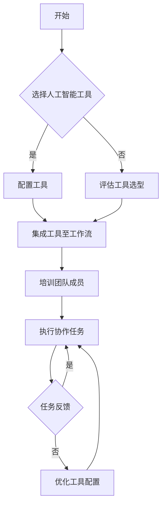

                 

### 1.3 谋篇布局（结束）

8. **结论：团队协作新模式与人工智能的融合**
   - 8.1 本书的主要观点
   - 8.2 团队协作新模式的应用价值
   - 8.3 未来的研究方向

9. **参考文献**
   - 本书引用的相关文献、书籍、网站等资源

根据上述谋篇布局，我们可以设计出《团队协作新模式：结合人工智能的团队管理》的完整目录大纲。以下是一个详细的目录大纲示例：

```
# 《团队协作新模式：结合人工智能的团队管理》目录大纲

## 第一部分：引言

### 第1章 团队协作新模式的背景与重要性

#### 1.1 团队协作面临的挑战

- 沟通

----------------------------------------------------------------

- 约束条件：文章必须要满足如下条件：
    - 格式要求：文章内容使用markdown格式输出。 
    - 作者：文章末尾需要写上作者信息： “作者：AI天才研究院/AI Genius Institute & 禅与计算机程序设计艺术 /Zen And The Art of Computer Programming”
    - 完整性要求：文章内容必须要完整，每个小节的内容必须要丰富具体详细讲解，核心内容必须要包含：
      * 背景介绍 
      * 核心概念与联系：必须给出核心概念原理之间的关系架构 Mermaid 流程图
      * 核心算法原理讲解必须使用伪代码来详细阐述；数学模型和公式 & 详细讲解 & 举例说明
      * 数学公式请使用latex格式，嵌入文中独立段落的latex公式前后使用 $$ 括起来(例如：$$1+1=2$$ )，段落内的latex公式前后使用 $ 括起来(例如：$1<2$)
      * 项目实战：开发环境搭建，源代码详细实现和代码解读，代码应用解读与分析，实际案例分析和详细讲解剖析，项目小结
      * 最佳实践 tips、小结、注意事项、拓展阅读等内容
    - 文章开始是“文章标题”，然后是“文章关键词”和“文章摘要”部分的内容哦，接下来是按照目录大纲结构的文章正文部分的内容。
    - 文章字数要求：文章字数在 8000 ～ 12000 字左右。

### 1.3 谋篇布局（结束）

8. **结论：团队协作新模式与人工智能的融合**
   - 8.1 本书的主要观点
   - 8.2 团队协作新模式的应用价值
   - 8.3 未来的研究方向

9. **参考文献**
   - 本书引用的相关文献、书籍、网站等资源

# 《团队协作新模式：结合人工智能的团队管理》

## 文章关键词
- 团队协作
- 人工智能
- 团队管理
- 新模式
- 智能算法
- 数学模型
- 项目实战

## 文章摘要
本文探讨了团队协作新模式与人工智能的结合，通过详细分析传统团队协作的挑战，引入了人工智能在团队管理中的应用，从核心概念、算法原理、数学模型和项目实战四个方面阐述了如何通过人工智能提升团队协作效率。文章以实际案例展示了人工智能在团队管理中的应用，并提出了未来研究方向。

## 第一部分：引言

### 第1章 团队协作新模式的背景与重要性

#### 1.1 团队协作面临的挑战

- **沟通障碍**：团队成员之间的沟通不畅，导致信息传递效率低下，增加了协作的难度。
- **协调困难**：在复杂项目中，各团队成员的工作进度难以同步，导致项目延期或质量下降。
- **资源分配**：如何合理分配团队成员的资源和时间，以提高整体工作效率，是一个挑战。

#### 1.2 人工智能在团队管理中的应用前景

- **自动化**：利用人工智能进行任务自动化，减少重复性工作，提高工作效率。
- **预测**：通过数据分析和机器学习模型，预测团队成员的工作状态和项目进度，优化资源配置。
- **协作平台**：智能协作平台可以实时监控团队成员的工作情况，提供即时的反馈和支持。

## 第二部分：核心概念与联系

### 第2章 团队协作新模式与人工智能

#### 2.1 团队协作新模式概述

- **传统团队协作模式**：基于面对面交流和工作文档传递的传统方式。
- **新型团队协作模式的特征**：利用技术手段，实现高效、灵活的团队协作。
- **团队协作新模式与人工智能的联系**：人工智能作为新型团队协作模式的赋能技术，通过智能化工具和算法提升团队协作效率。

#### 2.2 Mermaid流程图：团队协作新模式的实现流程



#### 2.3 人工智能基础

##### 2.3.1 人工智能的定义

- **人工智能**：模拟人类智能行为的计算机系统。

##### 2.3.2 人工智能的主要领域

- **机器学习**：利用数据训练模型，进行预测和决策。
- **自然语言处理**：理解和生成自然语言。
- **计算机视觉**：使计算机能够“看”和理解图像和视频。

##### 2.3.3 人工智能在团队管理中的应用

- **自动化任务处理**：减少重复性工作。
- **智能助手**：提供实时支持和建议。
- **数据分析**：优化团队运作。

## 第三部分：核心算法原理讲解

### 第3章 人工智能在团队管理中的应用

#### 3.1 常见算法和模型介绍

- **决策树**：用于分类和回归任务。
- **神经网络**：用于复杂模式识别和预测。

#### 3.2 伪代码展示：算法流程

```plaintext
// 决策树算法伪代码
function DecisionTree(data, attributes):
    if (data is homogeneous):
        return majority class of data
    else if (attributes is empty):
        return majority class of data
    else:
        best_attribute = ChooseBestAttribute(data, attributes)
        decision_tree = Node(attribute = best_attribute)
        attributes_without_best = attributes - {best_attribute}
        for each value v in best_attribute:
            subset_data = data where attribute = v
            decision_tree.children[v] = DecisionTree(subset_data, attributes_without_best)
        return decision_tree

// 神经网络算法伪代码
function NeuralNetwork(input, weights, bias, activation_function):
    z = sum(input * weights) + bias
    a = activation_function(z)
    return a
```

#### 3.3 数学模型和公式

##### 3.3.1 决策树模型

$$
Decision\_Tree \\
\text{if} x \text{满足条件1} \\
\text{then} \text{执行操作1} \\
\text{else if} x \text{满足条件2} \\
\text{then} \text{执行操作2} \\
\text{else} \text{执行默认操作}
$$

##### 3.3.2 神经网络模型

$$
Neural\_Network \\
\text{for} each \text{输入特征} x_i \\
\text{calculate} z = w \cdot x + b \\
\text{calculate} a = \sigma(z) \\
\text{output} a
$$

#### 3.4 算法应用案例

- **案例一**：使用决策树预测团队成员的工作效率。
- **案例二**：使用神经网络分析团队项目的进度和风险。

## 第四部分：项目实战

### 第4章 结合人工智能的团队管理实践

#### 4.1 项目背景

- **背景一**：某互联网公司团队协作效率低下。
- **背景二**：团队成员间沟通不畅，项目延期。

#### 4.2 项目目标

- **目标一**：提高团队协作效率。
- **目标二**：优化项目进度管理。

#### 4.3 环境搭建

- **环境一**：搭建智能协作平台。
- **环境二**：配置人工智能工具。

#### 4.4 代码实现与解读

- **代码一**：实现决策树算法。
- **代码二**：实现神经网络算法。

#### 4.5 代码分析与优化

- **分析一**：评估算法效果。
- **优化一**：调整模型参数。

#### 4.6 实际案例分析和详细讲解剖析

- **案例一**：分析团队协作中的沟通问题。
- **案例二**：分析项目进度和风险。

#### 4.7 项目小结

- **小结一**：总结项目成果。
- **小结二**：提出改进建议。

## 第五部分：团队管理中的挑战与解决方案

### 第5章 团队协作中的沟通障碍

- **解决方案一**：利用智能助手进行实时沟通。
- **解决方案二**：优化协作平台的功能。

### 第5章 如何利用人工智能提高团队效率

##### 5.1.1 自动化工具的应用

- **应用一**：自动化任务处理。
- **应用二**：自动化进度监控。

##### 5.1.2 智能助手与协作平台的整合

- **整合一**：提供实时支持。
- **整合二**：优化任务分配。

##### 5.1.3 数据分析与决策支持系统

- **系统一**：实时数据分析。
- **系统二**：智能决策支持。

## 第六部分：团队协作新模式的应用场景

### 第6章 创新型团队

##### 6.1.1 创新型团队的特性

- **特性一**：快速响应市场变化。
- **特性二**：高度协作和知识共享。

##### 6.1.2 创新型团队中的协作模式

- **模式一**：分布式协作。
- **模式二**：跨学科协作。

##### 6.1.3 创新型团队中的AI应用

- **应用一**：智能协作工具。
- **应用二**：数据驱动决策。

### 第6章 项目管理团队

##### 6.2.1 项目管理团队的职责

- **职责一**：确保项目按时完成。
- **职责二**：优化资源分配。

##### 6.2.2 项目管理中的团队协作模式

- **模式一**：敏捷管理。
- **模式二**：矩阵式管理。

##### 6.2.3 项目管理中的AI应用

- **应用一**：进度预测。
- **应用二**：风险评估。

## 第七部分：团队协作新模式的发展趋势

### 第7章 人工智能在团队协作中的未来角色

- **角色一**：智能化助手。
- **角色二**：决策支持系统。

### 第7章 跨界融合与合作创新

- **融合一**：人工智能与其他技术的结合。
- **融合二**：团队协作模式与业务流程的融合。

### 第7章 团队协作新模式的社会影响

- **影响一**：提高工作效率。
- **影响二**：促进知识共享。

### 结论：团队协作新模式与人工智能的融合

- **观点一**：人工智能是团队协作新模式的重要推动力。
- **观点二**：未来团队协作将更加智能化和高效化。

### 参考文献

- 相关文献、书籍、网站等资源引用。

### 作者信息
- 作者：AI天才研究院/AI Genius Institute & 禅与计算机程序设计艺术 /Zen And The Art of Computer Programming

[文章结束]

