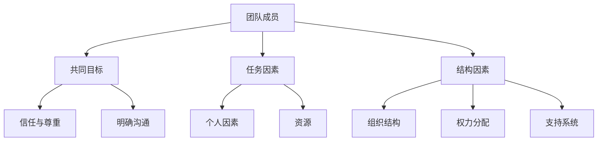
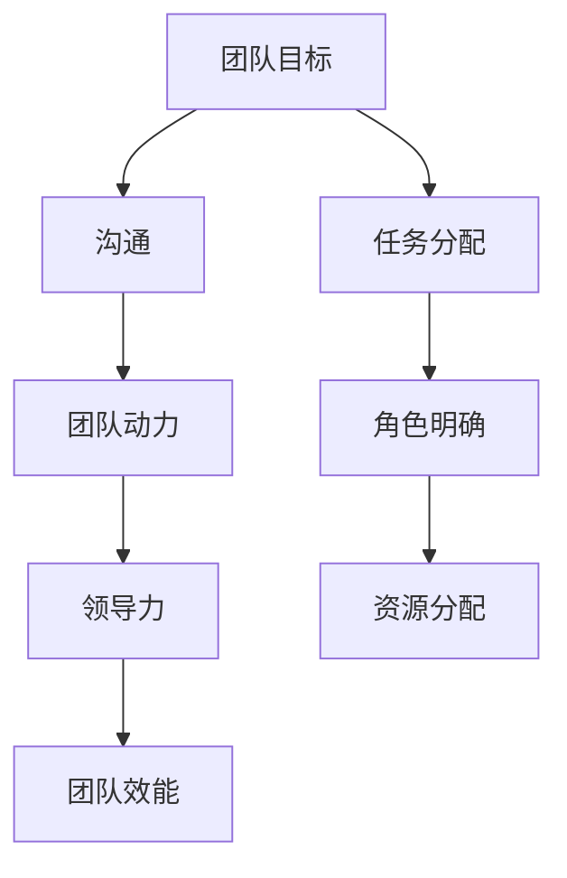

                 

### 文章标题

# 团队协作的艺术：从个体到集体的蜕变

### 关键词

- 团队协作
- 个体与集体
- 跨功能团队
- 沟通策略
- 领导艺术
- 案例分析

### 摘要

本文旨在深入探讨团队协作的艺术，从个体到集体的蜕变。首先，我们将介绍团队协作的重要性及其背景，随后解析团队合作的核心概念与联系，运用Mermaid流程图展现团队协作的模型。接着，我们详细讲解团队合作的心理机制、沟通策略、领导艺术，并通过实际案例展示成功团队协作的实践。最后，展望团队协作的未来趋势，总结全文并提出最佳实践建议。

---

### 引言

在当今快速变化和高度复杂的世界中，团队协作已成为各类组织实现成功的关键因素。从企业到非营利组织，从研发团队到市场营销团队，团队协作无处不在。有效的团队协作不仅可以提升工作效率，还能激发创新思维，增强员工满意度，最终推动组织发展。

团队协作的定义不仅包括成员之间的合作，还涉及到共同目标、信任、沟通和领导力等要素。在现代组织中，跨功能团队和远程工作的普及，使得团队协作的重要性愈发凸显。本文将围绕团队协作的艺术，从个体到集体的蜕变，探讨其核心概念、心理机制、沟通策略和领导艺术，并通过成功案例展示其实践价值。

---

### 团队协作的基础理论

团队协作的基础理论涵盖了团队协作模型、要素和原则。这些理论为理解团队协作提供了框架，有助于指导实际操作。

#### 团队协作模型

团队协作模型是描述团队成员如何互动和协作的理论结构。常见的团队协作模型包括梅奥团队协作模型和巴纳德团队协作理论。

1. **梅奥团队协作模型**：
   - **定义**：梅奥团队协作模型强调团队合作中的社会因素，如信任、沟通和协作。
   - **特点**：该模型认为团队成员之间通过互动建立信任，促进信息共享和目标一致性。

2. **巴纳德团队协作理论**：
   - **定义**：巴纳德团队协作理论关注组织结构、目标和沟通。
   - **特点**：该理论强调团队目标的重要性，并指出有效的沟通是实现团队目标的关键。

#### 团队协作的要素

团队协作的要素包括个人因素、任务因素和结构因素。

1. **个人因素**：
   - **能力**：团队成员应具备完成团队任务所需的专业技能。
   - **动机**：团队成员应具备参与团队活动的内在驱动力。
   - **态度**：团队成员应具备积极的态度和合作精神。

2. **任务因素**：
   - **目标**：团队应明确共同目标，确保团队成员朝着同一方向努力。
   - **角色**：团队成员应明确各自的角色和责任，避免职责重叠。
   - **资源**：团队应具备完成任务所需的资源，如时间、资金和设备。

3. **结构因素**：
   - **组织结构**：团队应具备合理的组织结构，如矩阵式或职能式结构。
   - **权力分配**：团队中权力应合理分配，确保决策的民主性和透明度。
   - **支持系统**：团队应拥有支持系统，如培训、指导和反馈机制。

#### 团队协作的原则

团队协作的原则包括共同目标、信任与尊重、明确沟通等。

1. **共同目标**：
   - **定义**：团队应共同明确目标，确保所有成员理解并认同。
   - **作用**：共同目标有助于增强团队凝聚力，提高工作效率。

2. **信任与尊重**：
   - **定义**：信任与尊重是指团队成员之间的互信和相互尊重。
   - **作用**：信任与尊重有助于建立良好的团队关系，减少冲突。

3. **明确沟通**：
   - **定义**：明确沟通是指团队成员之间清晰、准确的沟通。
   - **作用**：明确沟通有助于减少误解，提高团队决策质量。

### Mermaid流程图

为了更好地理解团队协作的模型和原理，我们可以使用Mermaid流程图来展示。



通过这个流程图，我们可以清晰地看到团队协作的各个要素和原则之间的联系。

---

### 团队协作的心理机制

团队协作不仅涉及技术和流程，还涉及到心理学因素。理解团队协作的心理机制有助于提高团队效能和成员满意度。

#### 团队动力

团队动力是指驱动团队成员积极参与团队活动和达成团队目标的内在力量。团队动力的来源包括以下几个方面：

1. **个人动机**：
   - **定义**：个人动机是指团队成员参与团队活动的原因。
   - **类型**：个人动机包括内在动机（如兴趣、成就感）和外在动机（如奖励、晋升）。

2. **团队目标**：
   - **定义**：团队目标是指团队希望达成的具体目标。
   - **作用**：明确的目标可以激发团队成员的积极性和归属感。

3. **团队氛围**：
   - **定义**：团队氛围是指团队成员在团队中的感受和体验。
   - **类型**：团队氛围包括积极、合作和和谐的氛围，以及消极、对抗和紧张的氛围。

#### 团队冲突

团队冲突是指团队成员之间由于观点、利益或目标不一致而产生的矛盾和对抗。团队冲突可以分为以下几种类型：

1. **任务冲突**：
   - **定义**：任务冲突是指团队成员在任务执行过程中产生的矛盾。
   - **原因**：任务冲突通常源于目标不明确、分工不清或资源有限。

2. **关系冲突**：
   - **定义**：关系冲突是指团队成员在人际交往中产生的矛盾。
   - **原因**：关系冲突通常源于沟通不畅、信任缺失或文化差异。

3. **过程冲突**：
   - **定义**：过程冲突是指团队成员在团队流程和决策过程中产生的矛盾。
   - **原因**：过程冲突通常源于决策机制不透明、信息不对称或权力分配不均。

#### 团队成熟度

团队成熟度是指团队在实现目标过程中的效率和效能。团队成熟度可以分为以下几个阶段：

1. **形成阶段**：
   - **特点**：团队成员互相认识，团队目标初步确立，但缺乏协作和信任。

2. **冲突阶段**：
   - **特点**：团队成员开始出现分歧，冲突和矛盾逐渐显现。

3. **规范阶段**：
   - **特点**：团队成员开始形成共同的目标和价值观，团队合作逐渐规范。

4. **执行阶段**：
   - **特点**：团队成员高效协作，团队能力达到顶峰，目标顺利实现。

5. **维持阶段**：
   - **特点**：团队稳定运行，成员间保持良好的合作关系，持续创新。

### 提高团队成熟度的策略

为了提高团队成熟度，可以采取以下策略：

1. **明确目标**：确保团队目标明确、具体且具有挑战性。

2. **建立信任**：通过透明沟通、共同经历和相互尊重建立信任。

3. **培养协作**：通过团队建设活动和协作工具促进团队成员之间的协作。

4. **提供反馈**：定期提供反馈，帮助团队成员了解自己的表现和改进方向。

5. **激励与奖励**：提供适当的激励和奖励机制，激发团队成员的积极性。

---

### 团队协作的沟通策略

沟通是团队协作的核心要素之一。有效的沟通策略能够减少误解，提高团队效能，增强团队凝聚力。

#### 沟通的重要性

沟通的重要性体现在以下几个方面：

1. **信息传递**：沟通是信息传递的主要渠道，确保团队成员了解任务要求和目标。

2. **决策制定**：有效的沟通有助于团队做出更明智的决策，减少错误和偏差。

3. **冲突解决**：沟通是解决团队冲突的关键，通过对话和协商找到共识。

4. **团队凝聚力**：良好的沟通能够增强团队成员之间的信任和归属感，提升团队凝聚力。

#### 有效沟通技巧

以下是一些有效沟通技巧：

1. **倾听**：
   - **定义**：倾听是指全神贯注地听取对方讲话，理解其意图和感受。
   - **技巧**：保持眼神接触、避免打断、不要急于回应。

2. **提问**：
   - **定义**：提问是获取更多信息、澄清误解和引导对话的重要手段。
   - **技巧**：开放性问题、封闭性问题和澄清性问题。

3. **反馈**：
   - **定义**：反馈是提供有关沟通效果和团队表现的信息，帮助团队成员改进。
   - **技巧**：积极反馈、建设性反馈和及时反馈。

4. **非语言沟通**：
   - **定义**：非语言沟通是通过肢体语言、面部表情和语调等传递信息。
   - **技巧**：保持自信的肢体语言、表达清晰的语调和适度的面部表情。

#### 沟通工具与技术

以下是一些常用的沟通工具和技术：

1. **会议沟通**：
   - **定义**：会议沟通是团队成员面对面讨论问题、分享信息和做出决策。
   - **技巧**：提前准备议程、确保会议高效、鼓励积极参与。

2. **电子邮件沟通**：
   - **定义**：电子邮件沟通是通过电子邮件进行信息传递和交流。
   - **技巧**：清晰简洁的邮件内容、使用适当的标题和避免复杂术语。

3. **即时通讯工具**：
   - **定义**：即时通讯工具是实时交流信息、讨论问题和协作工作的工具。
   - **技巧**：选择适合的即时通讯工具、保持在线状态、及时回应。

#### 团队协作中的沟通障碍及解决方法

团队协作中常见的沟通障碍包括：

1. **语言障碍**：
   - **解决方法**：使用通用语言、提供语言培训和支持。

2. **文化差异**：
   - **解决方法**：了解和尊重不同文化背景、提供跨文化培训。

3. **信息过载**：
   - **解决方法**：筛选关键信息、制定沟通规范、使用自动化工具。

4. **沟通不畅**：
   - **解决方法**：建立开放的沟通渠道、定期进行沟通反馈。

---

### 团队协作的领导艺术

领导艺术是团队协作成功的关键因素之一。有效的领导能够激发团队成员的潜力，提高团队效能，推动团队实现目标。

#### 领导力的重要性

领导力的重要性体现在以下几个方面：

1. **明确方向**：领导者需要明确团队的目标和愿景，为团队指明前进方向。

2. **激发潜力**：领导者需要发现和激发团队成员的潜力，促进个人和团队的成长。

3. **建立信任**：领导者需要建立信任，营造积极的工作氛围，增强团队的凝聚力。

4. **决策能力**：领导者需要具备决策能力，能够在关键时刻做出明智的决策。

#### 领导艺术

以下是领导艺术的一些关键要素：

1. **领导风格的转换**：
   - **定义**：领导风格是指领导者处理团队事务的方式。
   - **类型**：包括专制型、民主型和放任型等。
   - **转换**：领导者应根据团队阶段和任务需求灵活调整领导风格。

2. **领导力的培养**：
   - **定义**：领导力是通过学习、实践和反思不断提升的能力。
   - **方法**：包括自我提升、团队建设和反馈机制等。

3. **领导决策的艺术**：
   - **定义**：领导决策是指领导者如何做出决策的过程。
   - **原则**：包括信息收集、风险评估和决策执行等。

#### 领导者角色

领导者扮演以下几种角色：

1. **指导者角色**：
   - **定义**：指导者是提供指导和帮助，帮助团队成员解决问题。
   - **任务**：包括提供反馈、指导培训和解决冲突等。

2. **带头人角色**：
   - **定义**：带头人是引领团队前进，树立榜样。
   - **任务**：包括设定目标、制定计划和激发团队士气等。

3. **协调者角色**：
   - **定义**：协调者是协调团队内部和外部关系，确保团队顺利运作。
   - **任务**：包括资源调配、沟通协调和风险管理等。

---

### 团队协作的成功案例

为了更好地理解团队协作的艺术，我们可以通过分析一些成功团队协作的案例，了解其实践方法和经验。

#### 案例一：谷歌的团队协作模式

谷歌作为全球领先的科技公司，以其高效的团队协作模式著称。以下是谷歌团队协作的一些关键要素：

1. **开放沟通**：
   - 谷歌鼓励团队成员之间开放沟通，提供多种沟通渠道，如内部邮件、即时通讯和团队会议等。
   - 谷歌还建立了开放的内部网站，员工可以随时分享想法和建议。

2. **灵活的工作安排**：
   - 谷歌提供灵活的工作安排，包括远程工作和弹性工作时间，使团队成员能够更好地平衡工作与生活。

3. **领导力的培养**：
   - 谷歌重视领导力的培养，提供领导力培训和发展机会，帮助团队成员提升领导能力。

4. **多元化的团队**：
   - 谷歌致力于打造多元化的团队，吸引来自不同背景和专业领域的员工，促进创新和协作。

#### 案例二：亚马逊的团队协作实践

亚马逊作为全球最大的电子商务公司，其团队协作实践也值得借鉴。以下是亚马逊团队协作的一些关键要素：

1. **明确的目标和期望**：
   - 亚马逊确保每个团队成员都明确了解团队的目标和期望，确保团队成员朝着共同目标努力。

2. **快速决策**：
   - 亚马逊鼓励快速决策，通过简化的决策流程和灵活的决策机制，提高团队的响应速度。

3. **跨功能协作**：
   - 亚马逊重视跨功能协作，打破部门壁垒，促进不同部门之间的合作和共享。

4. **持续改进**：
   - 亚马逊倡导持续改进，鼓励团队成员不断反思和优化团队协作流程。

#### 案例三：其他成功团队协作案例分析

除了谷歌和亚马逊，还有许多其他组织通过成功的团队协作实现了卓越的业绩。以下是几个其他成功团队协作的案例：

1. **红帽公司**：
   - 红帽公司以其开放源代码文化著称，鼓励团队成员积极参与开源社区，促进知识共享和协作。

2. **阿斯利康公司**：
   - 阿斯利康公司重视跨学科团队协作，通过跨学科合作，加速新药研发和商业化。

3. **特斯拉公司**：
   - 特斯拉公司通过敏捷开发方法和跨功能团队，实现了快速的产品迭代和市场响应。

这些案例表明，成功的团队协作不仅需要良好的理论基础和沟通策略，还需要实际操作中的灵活应用和持续改进。

---

### 团队协作的未来趋势

随着技术的发展和全球化进程的加速，团队协作将面临新的挑战和机遇。以下是团队协作的一些未来趋势：

#### 数字化时代的团队协作

1. **远程工作和协作**：
   - 随着远程工作的普及，数字化工具将成为团队协作的重要支撑。虚拟会议、协作平台和自动化工具将帮助团队成员更高效地沟通和协作。

2. **人工智能的辅助**：
   - 人工智能技术将辅助团队协作，如智能聊天机器人、自动化任务分配和实时数据分析等，提高团队的工作效率和决策质量。

#### 跨文化团队协作

1. **文化差异的理解和尊重**：
   - 随着全球化进程的加速，跨文化团队协作将成为常态。团队成员需要更加理解和尊重不同文化的差异，促进跨文化沟通和协作。

2. **文化适应性培训**：
   - 组织应提供文化适应性培训，帮助团队成员了解和适应不同文化背景，提高跨文化协作的效率。

#### 团队协作工具的发展趋势

1. **集成化协作平台**：
   - 集成化的协作平台将成为团队协作的主流，提供多种功能，如任务管理、沟通协作、文档共享等，帮助团队更高效地协作。

2. **智能化协作工具**：
   - 智能化的协作工具，如智能会议助手、智能文档编辑器和智能项目管理工具等，将进一步提高团队的协作效率和体验。

---

### 总结与展望

团队协作是现代组织实现成功的关键因素。从个体到集体的蜕变，团队协作不仅需要理论基础和沟通策略，还需要实际操作中的灵活应用和持续改进。通过本文的探讨，我们了解了团队协作的基础理论、心理机制、沟通策略、领导艺术以及成功案例。展望未来，数字化时代和跨文化团队协作将带来新的挑战和机遇。为了更好地应对这些挑战，组织和个人都需要不断学习和适应，提高团队协作的效能。

---

### 作者信息

作者：AI天才研究院/AI Genius Institute & 禅与计算机程序设计艺术 /Zen And The Art of Computer Programming

---

### 附录

以下是本文涉及的一些伪代码、数学公式和流程图，以便读者更深入地理解团队协作的原理和方法。

#### 伪代码：领导决策过程

```python
# 领导决策过程

def lead_decision-making(process, options, risks):
    """
    领导决策过程
    :param process: 决策流程
    :param options: 可选方案
    :param risks: 风险评估
    :return: 最佳决策方案
    """
    
    # 收集信息
    information = collect_information(process, options, risks)
    
    # 风险评估
    risk_evaluation = evaluate_risks(information['risks'])
    
    # 方案评估
    options_evaluation = evaluate_options(information['options'], risk_evaluation)
    
    # 决策执行
    best_option = select_best_option(options_evaluation)
    
    # 决策反馈
    decision_feedback = provide_feedback(best_option)
    
    return best_option, decision_feedback
```

#### 数学公式：团队效能模型

$$
E = f(T, C, L)
$$

其中，$E$ 表示团队效能，$T$ 表示团队动力，$C$ 表示沟通效率，$L$ 表示领导力。

#### Mermaid流程图：团队协作模型



---

### 最佳实践 tips、小结、注意事项、拓展阅读

**最佳实践 tips**：

1. **建立明确的团队目标**：确保团队成员对目标有清晰的认识和共同的理解。
2. **培养良好的沟通习惯**：鼓励团队成员主动沟通，提供多种沟通渠道，确保信息畅通。
3. **提升领导力**：领导者应通过培训和反思不断提升自己的领导能力，促进团队发展。

**小结**：

团队协作是现代组织实现成功的关键。有效的团队协作需要理论基础和实际操作的有机结合。通过本文的探讨，我们了解了团队协作的基础理论、心理机制、沟通策略、领导艺术以及成功案例。

**注意事项**：

1. **跨文化团队协作**：注意理解和尊重不同文化背景的差异，促进跨文化沟通和协作。
2. **持续改进**：团队协作不是一成不变的，需要不断反思和优化。

**拓展阅读**：

1. 《团队协作的艺术：如何打造高效团队》
2. 《领导者的语言：如何用语言塑造团队》
3. 《数字化时代团队协作实践》

---

通过本文的深入探讨，我们希望读者能够对团队协作的艺术有更深刻的理解，并能够在实际工作中运用这些原则和方法，提升团队协作的效能。**作者：AI天才研究院/AI Genius Institute & 禅与计算机程序设计艺术 /Zen And The Art of Computer Programming**。

