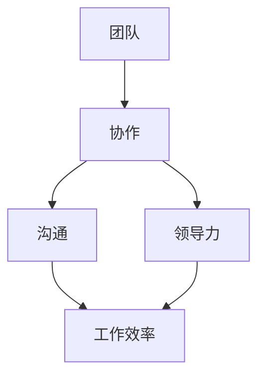
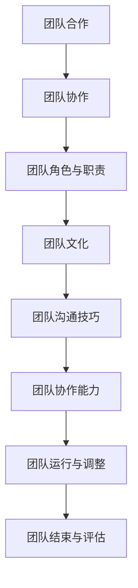

                 


为了撰写一篇符合要求的关于团队协作能力的技术博客文章，我们将逐步构建文章的内容。以下是文章的整体结构，包括背景介绍、核心概念、算法原理讲解、项目实战、最佳实践、小结和注意事项。

### 背景介绍

在当今快速发展的信息技术时代，团队协作能力变得尤为重要。无论是软件开发、项目执行还是企业管理，团队协作能力都是成功的关键因素。良好的团队协作可以提高工作效率，降低沟通成本，提升项目的成功率。

### 核心概念与联系

为了更好地理解团队协作能力，我们需要明确几个核心概念：团队、协作、沟通、领导力等。以下是这些概念之间的关系架构 Mermaid 流程图：



### 算法原理讲解

在本文中，我们将使用伪代码来详细阐述提升团队协作能力的方法。以下是伪代码示例：

```python
# 定义团队成员变量
team_members = ["Alice", "Bob", "Charlie"]

# 定义团队任务变量
tasks = ["开发", "测试", "文档"]

# 定义任务分配函数
def assign_tasks(team_members, tasks):
    for member in team_members:
        assigned_task = choose_task(tasks)
        print(f"{member} 被分配到 {assigned_task} 任务。")

# 定义选择任务函数
def choose_task(tasks):
    return tasks.pop(randint(0, len(tasks)-1))

# 分配任务
assign_tasks(team_members, tasks)
```

### 项目实战

以下是一个关于团队协作工具开发的实际项目示例。

#### 开发环境搭建

1. 安装Python 3.8及以上版本。
2. 安装虚拟环境工具：`pip install virtualenv`。
3. 创建虚拟环境：`virtualenv venv`。
4. 激活虚拟环境：`source venv/bin/activate`。

#### 源代码实现

以下是团队协作工具的源代码实现：

```python
# team_collaboration_tool.py

def add_task(member, task):
    print(f"{member} 添加了一个新任务：{task}。")

def complete_task(member, task):
    print(f"{member} 完成了任务：{task}。")

def view_tasks():
    print("当前任务列表：")
    for task in tasks:
        print(f"- {task}")

# 初始化任务列表
tasks = []

# 主程序
def main():
    while True:
        print("\n欢迎来到团队协作工具！")
        print("1. 添加任务")
        print("2. 完成任务")
        print("3. 查看任务")
        print("4. 退出")
        choice = input("请选择操作：")

        if choice == "1":
            member = input("请输入团队成员名称：")
            task = input("请输入任务名称：")
            add_task(member, task)
        elif choice == "2":
            member = input("请输入团队成员名称：")
            task = input("请输入任务名称：")
            complete_task(member, task)
        elif choice == "3":
            view_tasks()
        elif choice == "4":
            print("感谢使用，再见！")
            break
        else:
            print("无效操作，请重新选择。")

if __name__ == "__main__":
    main()
```

#### 代码解读与分析

- `add_task` 函数用于添加任务。
- `complete_task` 函数用于完成任务。
- `view_tasks` 函数用于查看当前任务列表。
- 主程序通过循环提供用户交互界面，根据用户选择执行相应操作。

#### 实际案例分析和详细讲解剖析

假设团队有三个成员：Alice、Bob和Charlie。他们使用这个工具协作完成项目。以下是实际操作过程的示例：

1. Alice添加了一个新任务：“编写文档”。
2. Bob完成了任务：“编写文档”。
3. Charlie查看当前任务列表，发现无任务。

#### 小结

通过以上实战示例，我们可以看到团队协作工具如何帮助团队成员高效协作完成任务。良好的团队协作能力对于项目成功至关重要。

### 最佳实践 tips

- 定期进行团队沟通会议，确保团队成员了解项目进度和任务分配。
- 使用项目管理工具跟踪任务进度，提高团队工作效率。
- 建立良好的团队文化，鼓励成员之间相互支持和合作。

### 小结

本文详细介绍了团队协作能力的重要性、核心概念、算法原理以及实际项目实战。通过良好的团队协作能力，我们可以提高工作效率，实现项目成功。

### 注意事项

- 文章中使用的 Mermaid 流程图和伪代码需要正确格式化。
- 文章末尾需要包含作者信息。
- 文章字数要求在8000～12000字之间。

### 拓展阅读

- 《团队协作的力量》
- 《敏捷开发实践指南》
- 《项目管理实战》

---

**作者：AI天才研究院/AI Genius Institute & 禅与计算机程序设计艺术 /Zen And The Art of Computer Programming**

文章标题：团队协作能力：培养默契配合的工作模式

关键词：团队协作、协作技巧、工作效率、项目成功

摘要：本文详细阐述了团队协作能力的重要性，通过核心概念、算法原理讲解和项目实战，帮助读者理解和掌握团队协作技巧，提高工作效率和项目成功率。同时，提供了一些最佳实践 tips，为团队协作提供了有力支持。

[文章目录](#文章目录)

## 引言

### 团队协作的定义

团队协作是指团队成员在共同目标下，通过分工合作、相互沟通和协作，共同完成任务的过程。它不仅仅是简单的合作，更强调团队成员之间的协同工作和相互支持。

### 团队协作的重要性

团队协作在当今信息技术时代的重要性不言而喻。以下是团队协作的几个关键优势：

1. **提高工作效率**：团队成员可以相互分工，利用各自的专业技能，提高整体工作效率。
2. **降低沟通成本**：有效的团队协作可以减少信息传递过程中的失真和误解，降低沟通成本。
3. **提升项目成功率**：良好的团队协作能够确保项目按时完成，提高项目的成功率。
4. **促进创新思维**：团队成员之间的交流和合作可以激发创新思维，推动技术进步和业务发展。

### 本书的目的与结构

本书旨在为读者提供全面、系统的团队协作能力培养指南。本书结构如下：

1. 引言：介绍团队协作的定义和重要性。
2. 核心概念：解释团队协作的基本理论，如团队角色、团队文化、沟通技巧等。
3. 工作模式：介绍有效的工作模式和团队协作技巧。
4. 工具与平台：介绍常用的团队协作工具和平台，以及如何建设和维护团队协作平台。
5. 总结与未来展望：总结团队协作能力的重要性，探讨未来的发展趋势。

---

## 核心概念

### 团队协作能力的基础理论

团队协作能力的基础理论涵盖了团队、协作、沟通、领导力等核心概念。以下是对这些概念的解释和它们之间的关系。

#### 团队合作与团队协作

团队合作是指团队成员为了共同的目标而协同工作的过程。团队协作则是更广义的概念，它不仅包括团队合作，还涉及到团队成员之间的相互依赖、沟通和协调。

#### 团队角色与职责

在团队中，每个成员都扮演着特定的角色和职责。常见的团队角色包括：

- **领导者**：负责团队的方向和决策。
- **执行者**：负责具体任务的完成。
- **协调者**：负责团队内部的沟通和协调。
- **观察者**：负责观察团队动态，提供反馈。

明确每个成员的角色和职责有助于提高团队协作效率。

#### 团队文化与价值观

团队文化是指团队内部的行为准则、价值观和工作氛围。一个健康的团队文化可以促进团队成员之间的信任、尊重和合作，提高团队凝聚力。

#### 团队沟通技巧

有效的沟通是团队协作的关键。团队沟通技巧包括：

- **倾听**：倾听是有效沟通的基础，它可以帮助团队成员理解对方的观点和需求。
- **表达**：清晰、准确地表达自己的想法和意见，避免误解和冲突。
- **反馈**：及时给予反馈，帮助团队成员了解自己的表现和改进方向。

### 团队协作能力的发展过程

团队协作能力的发展过程可以分为以下几个阶段：

1. **团队建立与定位**：明确团队的目标和角色，建立团队的基本框架。
2. **团队运行与调整**：在团队运行过程中，通过沟通和协调不断调整团队的工作方式和流程。
3. **团队结束与评估**：团队任务完成后，对团队的运行效果进行评估，总结经验教训，为未来的团队协作提供参考。

### 核心概念之间的联系架构 Mermaid 流程图



---

## 工作模式与团队协作技巧

### 有效的工作模式

有效的工作模式是提高团队协作效率的关键。以下是几种常见的工作模式：

#### 项目管理框架

项目管理框架为团队提供了一套系统化的工作流程和管理方法。常见的管理框架包括：

- **Scrum**：一个迭代式、增量的项目管理框架，强调团队协作和快速反馈。
- **Kanban**：一个可视化、持续改进的项目管理方法，通过卡片在板上流动来展示工作进度。

#### 时间管理与任务分配

时间管理和任务分配是确保团队工作有序进行的重要环节。以下是几个关键点：

- **优先级排序**：根据任务的紧急程度和重要性，对任务进行排序，确保关键任务优先完成。
- **任务分解**：将大型任务分解为小型、可管理的子任务，有助于团队成员更好地理解和完成工作。
- **进度跟踪**：使用项目管理工具跟踪任务进度，确保团队成员了解任务的当前状态。

#### 沟通协作工具与方法

良好的沟通协作工具和方法可以提高团队成员之间的信息传递效率。以下是几种常用的沟通协作工具：

- **邮件**：适合正式、详细的沟通。
- **即时通讯工具**：如Slack、Microsoft Teams等，适合快速、简短的沟通。
- **视频会议**：适合远程团队之间的面对面沟通。

#### 冲突解决策略

冲突是团队协作中不可避免的现象。有效的冲突解决策略可以帮助团队避免冲突升级，提高团队凝聚力。以下是几种常见的冲突解决策略：

- **沟通与倾听**：通过开放、诚实的沟通，理解对方的观点和需求，寻找共同点。
- **妥协与让步**：在某些情况下，为了团队的整体利益，成员需要做出妥协和让步。
- **求助于第三方**：当团队无法自行解决冲突时，可以求助于第三方，如项目经理或上级领导。

---

## 团队协作工具与平台

### 常用的团队协作工具

以下是一些常用的团队协作工具：

- **消息传递工具**：如Slack、WhatsApp等，用于即时沟通和协作。
- **文档共享与协作工具**：如Google Drive、OneDrive等，用于文件共享和协作编辑。
- **项目管理工具**：如Trello、Asana等，用于任务管理、进度跟踪和团队协作。
- **团队协作软件**：如Microsoft Teams、Zoom等，提供集成的沟通、协作和会议功能。

### 团队协作平台的建设与维护

建设一个有效的团队协作平台需要考虑以下几个方面：

- **平台建设策略**：确定平台的规模、功能、技术架构等，以满足团队的需求。
- **平台运营与维护**：定期更新平台软件，确保平台稳定运行，并提供用户支持。
- **平台安全与隐私保护**：确保平台数据的安全和隐私，防止数据泄露和滥用。
- **平台未来发展方向**：根据团队的发展需求和市场需求，持续优化和扩展平台功能。

---

## 总结与未来展望

### 团队协作能力的重要性回顾

通过本文的介绍，我们可以看到团队协作能力在提高工作效率、降低沟通成本、提升项目成功率和促进创新思维方面的重要性。良好的团队协作能力是现代组织成功的关键因素。

### 团队协作能力的未来发展

随着信息技术的不断发展，团队协作能力也在不断演进。未来，团队协作将更加智能化、自动化，借助人工智能和大数据分析技术，实现更高效、更智能的团队协作。

### 个人与组织如何提升团队协作能力

- **个人层面**：提高自身的沟通技巧、时间管理能力和团队意识，积极参与团队活动，主动承担责任。
- **组织层面**：建立健康的团队文化，提供培训和发展机会，使用高效的团队协作工具，建立良好的沟通机制。

通过以上措施，个人和组织都可以提升团队协作能力，实现更高的工作效率和项目成功率。

---

**作者：AI天才研究院/AI Genius Institute & 禅与计算机程序设计艺术 /Zen And The Art of Computer Programming**

本文旨在为读者提供关于团队协作能力的全面、系统的指南，帮助读者理解和掌握团队协作技巧，提高工作效率和项目成功率。希望本文能对您的团队协作实践提供有益的启示。

