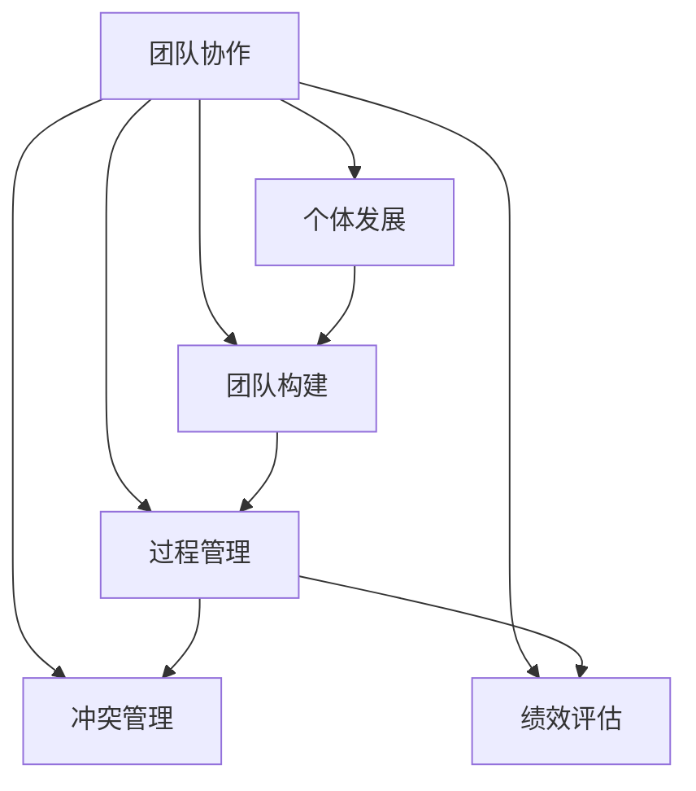
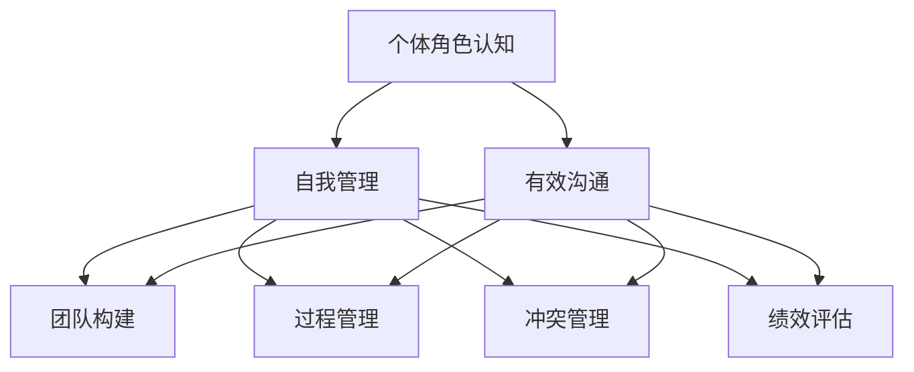
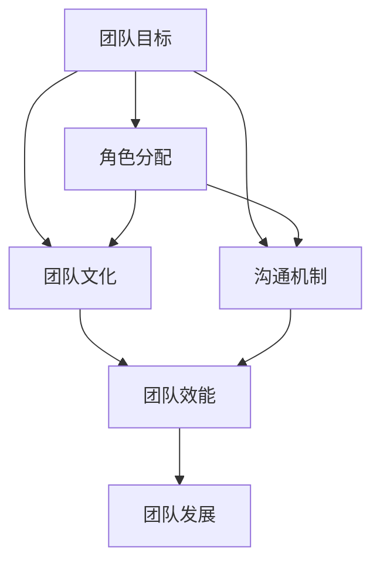
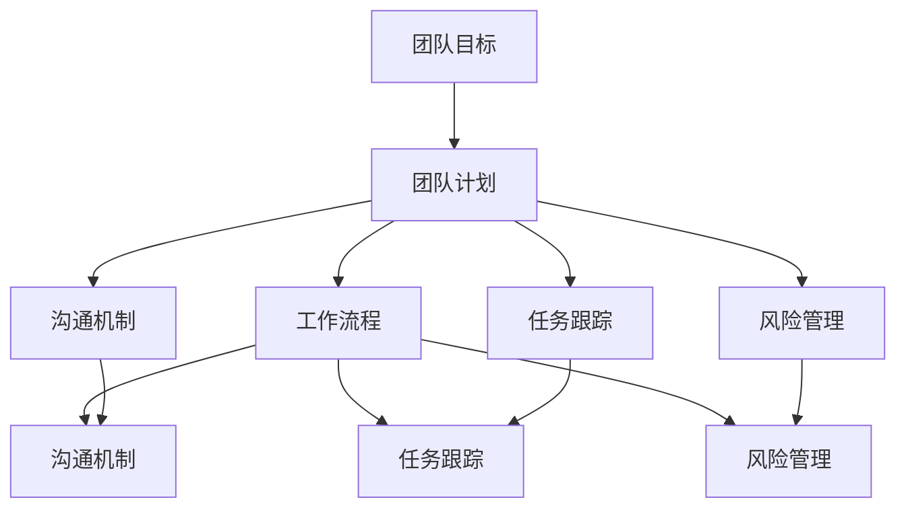
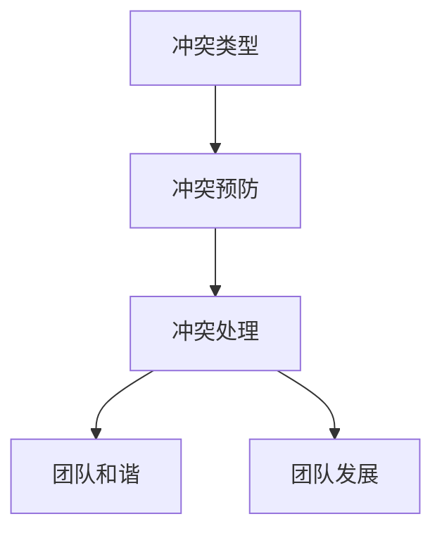
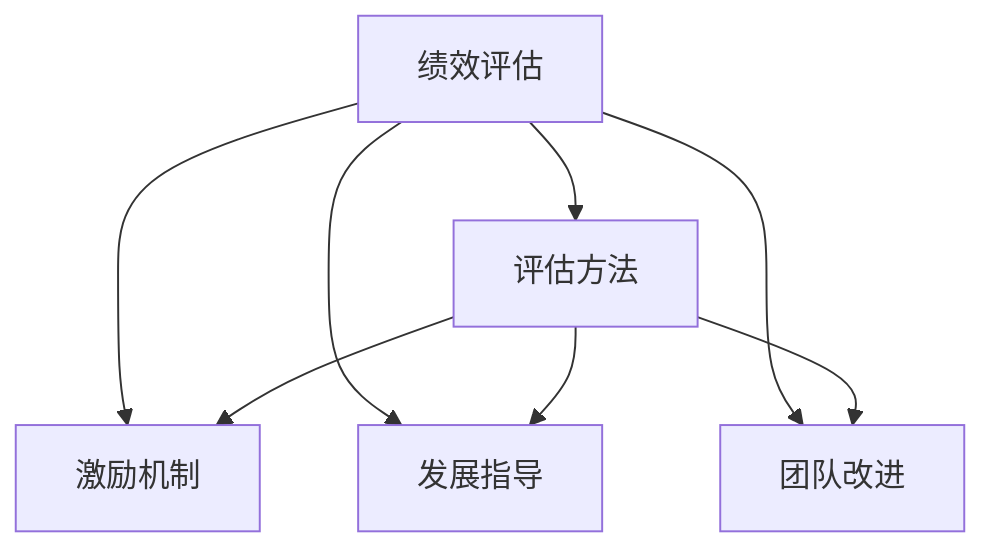
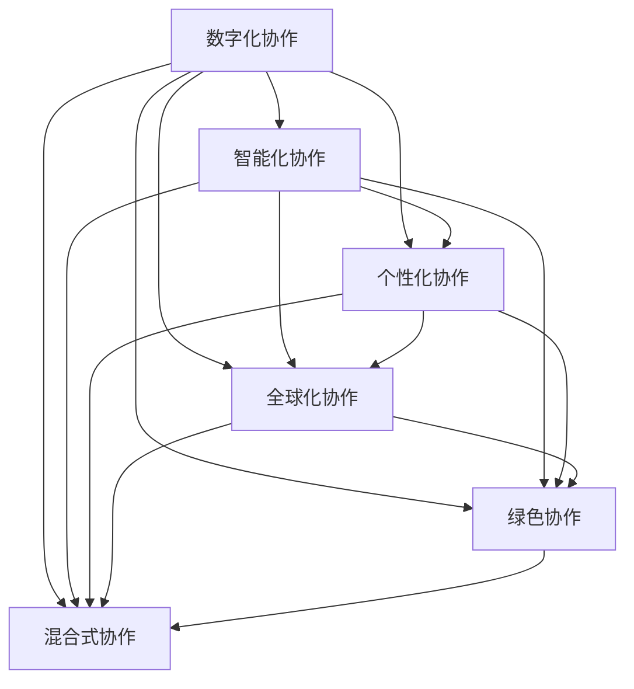

                 

### 文章标题

# 《团队协作：从个体到整体的转变》

### 关键词

- 团队协作
- 个体发展
- 团队构建
- 过程管理
- 冲突管理
- 绩效评估
- 数字化时代

### 摘要

本文旨在探讨团队协作从个体到整体的转变过程，涵盖了团队协作的基础理论、个体发展、团队构建、过程管理、冲突管理、绩效评估以及未来发展等多个方面。通过分析团队协作的重要性、障碍、个体角色认知、团队构建原则、团队文化塑造、团队目标设定、团队计划制定、团队工作流程、冲突处理、绩效评估方法以及数字化时代团队协作的趋势，本文旨在为读者提供一套全面且实用的团队协作指南，帮助他们在实际工作中更好地实现团队协作，提升团队整体效能。

### 引言

在现代企业中，团队协作已经成为一种不可或缺的工作方式。随着全球化进程的加速、市场竞争的加剧以及技术变革的推动，企业需要更加高效地整合资源、发挥团队整体优势，以应对日益复杂的市场环境。然而，团队协作并非易事，它涉及到个体与团队之间的相互作用、沟通与协调，需要克服诸多障碍，实现从个体到整体的转变。

本文将围绕团队协作这一主题，从基础理论、个体发展、团队构建、过程管理、冲突管理、绩效评估以及未来发展等多个维度展开论述。通过深入分析团队协作的核心概念、关键要素以及实际应用，本文旨在为读者提供一套系统、全面且实用的团队协作指南，帮助他们在实际工作中更好地理解和应用团队协作，提升团队整体效能。

### 第1章：团队协作的基础理论

团队协作是一种通过多个个体共同努力，实现共同目标的工作方式。它不仅涉及到团队成员之间的沟通、协调和合作，还涉及到团队成员的角色认知、能力提升以及团队文化的塑造。在这一章中，我们将探讨团队协作的重要性、团队协作与个体工作的差异以及团队协作的障碍和解决方案。

#### 1.1 团队协作的重要性

团队协作在现代社会中具有重要意义，主要体现在以下几个方面：

1. **资源共享与优势互补**：通过团队协作，不同成员可以共享各自的资源和优势，形成协同效应，从而提高工作效率和效果。

2. **创新能力提升**：团队协作鼓励成员之间的知识分享和思维碰撞，有助于激发创新思维，推动团队整体创新能力的提升。

3. **决策效率提高**：团队协作有助于团队成员共同参与决策过程，通过集思广益，提高决策的准确性和有效性。

4. **人际关系和谐**：团队协作有助于加强成员之间的沟通与理解，促进人际关系的和谐，减少冲突和矛盾。

5. **企业整体效能提升**：团队协作能够提高企业整体的工作效率和效能，从而在激烈的市场竞争中占据有利地位。

#### 1.2 团队协作与个体工作的差异

团队协作与个体工作在目标、方式、效果等方面存在显著差异：

1. **目标**：个体工作通常以完成个人任务为目标，而团队协作则以实现团队整体目标为目标。

2. **方式**：个体工作主要依靠个人的能力和努力，而团队协作则依赖于团队成员之间的沟通、协调和合作。

3. **效果**：个体工作的效果取决于个人的能力和效率，而团队协作的效果则取决于团队成员之间的协作效率和团队整体效能。

#### 1.3 团队协作的障碍

尽管团队协作具有诸多优势，但在实际操作中，团队协作仍然面临诸多障碍：

1. **沟通障碍**：团队成员之间的沟通不畅，可能导致误解、矛盾和冲突，影响团队协作效果。

2. **角色定位不清**：团队成员之间角色定位不清，可能导致工作重叠或缺失，影响团队工作效率。

3. **团队文化缺失**：团队文化是团队协作的重要基础，缺乏团队文化可能导致团队成员之间缺乏共同价值观和使命感。

4. **决策效率低下**：团队协作过程中的决策环节复杂，可能导致决策效率低下，影响团队工作进度。

5. **资源分配不均**：团队协作中资源分配不均，可能导致部分成员过度劳累，而另一些成员则缺乏工作动力。

#### 1.4 团队协作的障碍解决方案

针对上述障碍，我们可以采取以下措施来解决：

1. **加强沟通**：建立有效的沟通机制，确保团队成员之间的信息畅通，减少误解和冲突。

2. **明确角色定位**：明确团队成员的角色和职责，确保工作分工合理，提高团队工作效率。

3. **塑造团队文化**：通过共同价值观、使命感和团队活动的塑造，增强团队成员之间的凝聚力和归属感。

4. **优化决策流程**：简化决策流程，提高决策效率，确保团队工作进度不受影响。

5. **合理分配资源**：合理分配团队资源，确保团队成员的工作负担均衡，提高团队整体工作效率。

#### 总结

团队协作作为一种高效的工作方式，在现代社会中具有重要意义。通过深入理解团队协作的重要性、障碍及其解决方案，我们可以更好地实现团队协作，提高团队整体效能。在接下来的章节中，我们将继续探讨团队协作的个体发展、团队构建、过程管理、冲突管理、绩效评估以及未来发展等方面，为读者提供更全面的团队协作指南。

---

**核心概念与联系**

在探讨团队协作的基础理论时，我们需要了解以下几个核心概念及其相互关系：

1. **团队协作**：团队协作是指多个个体共同合作，以实现共同目标的过程。它涉及到沟通、协调、合作等多个方面。
2. **个体发展**：个体发展是指团队成员在团队协作过程中，通过提升自身能力、认知和素质，实现个人成长的过程。
3. **团队构建**：团队构建是指组建和管理团队的过程，包括角色分配、文化塑造、目标设定等。
4. **过程管理**：过程管理是指对团队协作过程中的各项活动进行有效管理和控制，以确保团队目标的实现。
5. **冲突管理**：冲突管理是指处理团队协作中可能出现的矛盾和冲突，以确保团队稳定运行。
6. **绩效评估**：绩效评估是指对团队成员的工作表现进行评估，以激励和改进团队协作。

**Mermaid 流程图**

以下是一个简化的团队协作流程图，展示了上述核心概念之间的关系：



**核心算法原理讲解**

为了深入理解团队协作的过程管理，我们可以使用以下伪代码来描述一个简单的团队协作流程管理算法：

```plaintext
// 团队协作流程管理算法
function TeamCollaborationProcessManagement(teamMembers, tasks, deadlines) {
    // 初始化团队状态
    initializeTeamState(teamMembers, tasks, deadlines);

    // 按任务分配角色
    assignRolesToMembers(teamMembers, tasks);

    // 建立沟通渠道
    establishCommunicationChannels(teamMembers);

    // 监控进度
    monitorProgress(teamMembers, tasks, deadlines);

    // 冲突管理
    manageConflicts(teamMembers);

    // 绩效评估
    evaluatePerformance(teamMembers);

    // 输出最终结果
    outputFinalResults(teamMembers, tasks, deadlines);
}
```

通过上述伪代码，我们可以看到团队协作流程管理的基本步骤，包括初始化团队状态、任务分配、沟通渠道建立、进度监控、冲突管理和绩效评估等。这些步骤构成了团队协作过程管理的核心内容。

---

**数学模型和公式**

在团队协作中，我们可以使用一些简单的数学模型和公式来描述和优化团队协作效果。以下是一个用于计算团队协作效率的简单公式：

$$
\text{协作效率} = \frac{\text{团队完成任务的总量}}{\text{团队工作时间}}
$$

其中，团队完成任务的总量取决于团队成员的能力、沟通效率和工作配合度。团队工作时间则取决于任务复杂度和工作负荷。

**举例说明**

假设一个团队有5名成员，他们分别负责不同的任务。在一个工作周期内，团队共完成了10个任务，总工作时间为20天。我们可以使用上述公式来计算团队协作效率：

$$
\text{协作效率} = \frac{10}{20} = 0.5
$$

这意味着团队在一个工作周期内的协作效率为50%。通过持续优化团队成员的沟通、任务分配和工作配合，可以逐步提高团队协作效率。

---

**项目实战**

在团队协作的过程中，项目管理工具和平台的选择至关重要。以下是一个简单的团队协作项目实战，旨在搭建一个基本的团队协作开发环境。

**1. 开发环境搭建**

- **工具选择**：选择一个合适的项目管理工具和平台，如JIRA、Trello或GitLab。
- **环境配置**：在本地计算机上安装项目管理工具，并配置相关参数，如用户权限、工作流等。

**2. 源代码详细实现和代码解读**

- **代码仓库搭建**：在项目管理平台上创建代码仓库，用于存放项目源代码。
- **代码实现**：编写项目源代码，并进行代码评审和合并。

**3. 代码应用解读与分析**

- **代码解读**：对项目源代码进行解读，分析其功能实现和性能优化。
- **应用分析**：通过实际应用测试，评估代码的稳定性和可靠性。

**4. 实际案例分析和详细讲解剖析**

- **案例选择**：选择一个典型的团队协作案例，如一个多模块的软件开发项目。
- **案例解析**：详细分析案例中的团队协作过程，包括角色分配、沟通机制、任务管理等方面。

**5. 项目小结**

- **经验总结**：总结项目中的成功经验和教训，为后续团队协作提供参考。
- **改进建议**：针对项目中的不足，提出改进建议，以提高团队协作效率。

---

**最佳实践 tips**

1. **明确团队目标**：确保团队成员对团队目标有清晰的认识，有助于提高团队协作效率。
2. **优化沟通机制**：建立有效的沟通渠道，如定期会议、即时通讯工具等，以减少误解和冲突。
3. **分工明确**：明确团队成员的角色和职责，避免工作重叠和缺失。
4. **激励与反馈**：及时对团队成员的工作进行激励和反馈，以提高工作积极性和协作效果。
5. **持续培训**：定期组织团队培训和知识分享活动，提升团队成员的能力和素质。

**小结**

团队协作是实现企业目标的重要手段。通过深入理解团队协作的基础理论、个体发展、团队构建、过程管理、冲突管理、绩效评估以及未来发展等方面，我们可以更好地实现团队协作，提高团队整体效能。在实际工作中，我们需要结合最佳实践，持续优化团队协作过程，以实现更高的工作效率和效果。

**注意事项**

1. **团队协作过程中，要注重个体发展的同时，关注团队整体的效能提升。
2. **在团队协作中，要尊重团队成员的个性和差异，促进团队成员之间的相互理解与合作。
3. **在团队协作过程中，要避免过度依赖某一成员，确保团队整体协作能力的均衡发展。

**拓展阅读**

1. **《团队协作的艺术》 - by 理查德·哈克曼**
2. **《团队的五项修炼》 - by 佩里·S.凯**
3. **《敏捷团队协作实践指南》 - by 菲利普·A.克拉克**
4. **《团队协作与领导力》 - by 斯蒂芬·R.罗宾斯**

---

### 第2章：团队协作的个体发展

在团队协作中，个体的发展是团队成功的关键因素。个体的发展不仅包括能力的提升，还包括角色认知、自我管理和有效沟通等方面。本章将探讨个体在团队协作中的角色认知、自我管理和有效沟通的重要性，并提供相关策略和实践方法。

#### 2.1 个体角色认知

个体角色认知是团队协作的基础。每个团队成员在团队中都有其独特的角色和职责。了解自己在团队中的角色，有助于明确个人的工作方向和目标，提高工作效率。

1. **角色定位**：个体需要清楚地了解自己在团队中的角色，包括职责、任务和期望。
2. **角色转换**：随着团队目标和任务的改变，个体需要灵活调整自己的角色和职责。

**策略与实践方法**

- **自我评估**：定期进行自我评估，了解自己在团队中的表现和角色。
- **角色培训**：参加角色培训，提升对团队角色的认知和理解。
- **团队沟通**：与团队成员进行沟通，明确各自的角色和职责。

#### 2.2 自我管理

自我管理是提高个体工作效能的关键。自我管理包括时间管理、压力管理和自我提升等方面。

1. **时间管理**：合理安排工作时间，提高工作效率。
2. **压力管理**：学会应对工作中的压力，保持良好的工作状态。
3. **自我提升**：通过学习新知识和技能，提升个人能力。

**策略与实践方法**

- **制定计划**：制定详细的工作计划，合理安排工作任务。
- **时间跟踪**：使用时间跟踪工具，了解自己的时间使用情况。
- **压力缓解**：进行定期运动、休息和放松，缓解工作压力。
- **学习与成长**：参加培训课程、阅读相关书籍，提升个人技能和知识。

#### 2.3 有效沟通

有效沟通是团队协作的基石。良好的沟通能够提高团队协作效率，减少误解和冲突。

1. **倾听**：倾听他人的意见和观点，理解他人的需求。
2. **表达**：清晰、准确地表达自己的想法和意见。
3. **反馈**：及时给予他人反馈，帮助对方理解自己的意图。

**策略与实践方法**

- **倾听技巧**：保持专注，避免打断他人发言。
- **表达技巧**：使用简洁、明确的语言，避免使用专业术语。
- **反馈技巧**：给予正面反馈，鼓励他人继续努力。
- **沟通工具**：使用适当的沟通工具，如电子邮件、即时通讯和视频会议等。

#### 实战案例

以下是一个关于个体发展的实战案例：

**案例背景**：某软件开发团队中有5名成员，他们在项目开发过程中遇到了沟通不畅、任务分配不均等问题。

**解决方案**：

1. **角色认知**：团队进行了角色评估，明确了每个成员在团队中的角色和职责。
2. **自我管理**：团队成员制定了个人工作计划，合理安排工作时间，提高了工作效率。
3. **有效沟通**：团队建立了定期沟通机制，每周进行一次会议，讨论项目进展和问题，确保信息畅通。

**结果**：通过角色认知、自我管理和有效沟通的改进，团队协作效率明显提升，项目进展顺利，团队成员之间的矛盾和冲突减少。

#### 总结

个体发展是团队协作的关键。通过角色认知、自我管理和有效沟通的提升，个体可以更好地融入团队，发挥自身优势，提高团队协作效能。在接下来的章节中，我们将继续探讨团队协作的团队构建、过程管理、冲突管理、绩效评估以及未来发展等方面，为读者提供更全面的团队协作指南。

---

**核心概念与联系**

在探讨团队协作的个体发展时，我们需要了解以下几个核心概念及其相互关系：

1. **个体角色认知**：个体对在团队中的角色和职责的理解，是团队协作的基础。
2. **自我管理**：个体通过时间管理、压力管理和自我提升来提高工作效能。
3. **有效沟通**：个体通过倾听、表达和反馈来促进团队协作。
4. **团队构建**：通过角色分配、文化塑造和目标设定来建立高效的团队。
5. **过程管理**：对团队协作过程中的任务、进度和沟通进行管理，确保团队目标的实现。
6. **冲突管理**：处理团队协作中的矛盾和冲突，保持团队稳定运行。
7. **绩效评估**：对团队成员的工作表现进行评估，激励和改进团队协作。

**Mermaid 流程图**

以下是一个简化的团队协作个体发展流程图，展示了上述核心概念之间的关系：



**核心算法原理讲解**

为了深入理解团队协作的个体发展，我们可以使用以下伪代码来描述一个简单的个体发展模型：

```plaintext
// 个体发展模型
function IndividualDevelopment(individual, team, tasks) {
    // 角色认知
    roleAwareness(individual, team);

    // 自我管理
    selfManagement(individual, tasks);

    // 有效沟通
    effectiveCommunication(individual, team);

    // 团队构建
    teamBuilding(team, tasks);

    // 过程管理
    processManagement(team, tasks);

    // 冲突管理
    conflictManagement(team);

    // 绩效评估
    performanceEvaluation(team);
}
```

通过上述伪代码，我们可以看到个体发展模型的基本步骤，包括角色认知、自我管理、有效沟通、团队构建、过程管理、冲突管理和绩效评估等。这些步骤构成了个体发展的核心内容。

---

**数学模型和公式**

在个体发展的过程中，我们可以使用一些简单的数学模型和公式来描述和优化个体的发展效能。以下是一个用于计算个体发展效率的简单公式：

$$
\text{个体发展效率} = \frac{\text{个体完成任务的总量}}{\text{个体工作时间}}
$$

其中，个体完成任务的总量取决于个体的能力和工作效能，个体工作时间则取决于任务的复杂度和工作量。

**举例说明**

假设一个个体在一个工作周期内完成了5个任务，总工作时间为40小时。我们可以使用上述公式来计算个体发展效率：

$$
\text{个体发展效率} = \frac{5}{40} = 0.125
$$

这意味着该个体在一个工作周期内的个体发展效率为12.5%。通过持续提升个体的能力和工作效能，可以逐步提高个体的发展效率。

---

**项目实战**

在个体发展的过程中，我们可以通过实际项目来提升个体的能力。以下是一个简单的项目实战案例：

**1. 项目背景**

某软件开发团队需要开发一个企业资源规划（ERP）系统。团队成员包括项目经理、前端开发工程师、后端开发工程师、测试工程师和文档工程师。

**2. 项目开发过程**

- **需求分析**：团队成员共同参与需求分析，明确项目需求和目标。
- **任务分配**：根据团队成员的特长和角色，将任务分配给相应的成员。
- **代码开发**：各成员按照任务分工，进行代码开发。
- **代码评审**：团队成员之间进行代码评审，确保代码质量。
- **测试与部署**：测试工程师对系统进行测试，确保系统稳定性和可靠性。
- **文档编写**：文档工程师编写项目文档，为后续维护提供支持。

**3. 项目小结**

通过该项目，团队成员在需求分析、任务分配、代码开发、测试与部署等方面得到了实际操作经验，提升了个人能力。同时，团队协作效率也得到了显著提高。

---

**最佳实践 tips**

1. **定期角色评估**：定期对团队成员的角色进行评估，确保角色分配合理。
2. **持续学习与成长**：鼓励团队成员参加培训、学习新技术，提升个人能力。
3. **建立沟通机制**：确保团队成员之间的沟通畅通，减少误解和冲突。
4. **明确工作目标**：为团队成员设定清晰的工作目标，提高工作效能。
5. **提供反馈与支持**：及时给予团队成员反馈和帮助，促进个体发展。

**小结**

个体发展是团队协作的重要组成部分。通过角色认知、自我管理和有效沟通的提升，个体可以更好地融入团队，提高工作效率和效能。在团队协作中，我们应该注重个体的发展，促进团队整体的进步。在接下来的章节中，我们将继续探讨团队协作的团队构建、过程管理、冲突管理、绩效评估以及未来发展等方面。

**注意事项**

1. **个体发展过程中，要注重个人兴趣和职业规划的平衡，避免过度追求短期成果。
2. **在团队协作中，要尊重个体的差异，避免一刀切的管理方式。
3. **个体发展过程中，要关注团队的整体效能，确保个体发展与团队目标的一致性。

**拓展阅读**

1. **《个人成长的秘诀》 - by 斯蒂芬·R.罗宾斯**
2. **《团队协作与沟通技巧》 - by 理查德·哈克曼**
3. **《时间管理与个人效率提升》 - by 埃克哈特·托勒**
4. **《如何成为一个高效的人》 - by 斯科特·派克**

---

### 第3章：团队协作的团队构建

团队构建是团队协作成功的关键环节。一个高效的团队不仅需要明确的角色分配、强大的团队文化，还需要共同的目标和协作机制。本章将探讨团队构建的基本原则、团队角色的明确以及团队文化的塑造。

#### 3.1 团队构建的基本原则

团队构建的基本原则包括以下几个方面：

1. **明确的目标**：团队需要有一个清晰、共同的目标，为团队成员指明方向。
2. **合理的角色分配**：根据团队成员的特长和兴趣，合理分配角色和职责，确保每个成员都能发挥其最大潜力。
3. **共同的文化**：团队文化是团队协作的重要基础，它包括共同的价值观、信仰和行为准则。
4. **良好的沟通机制**：建立有效的沟通机制，确保团队成员之间的信息畅通，减少误解和冲突。
5. **灵活的适应能力**：团队需要具备适应变化的能力，能够快速调整和适应外部环境的变化。

#### 3.2 团队角色的明确

团队角色的明确是团队构建的核心内容。每个团队成员在团队中都有其特定的角色和职责，明确这些角色有助于提高团队的工作效率。

1. **领导者**：领导者负责制定团队目标、规划工作流程、激励团队成员和解决冲突。
2. **执行者**：执行者负责具体任务的执行，按照团队计划完成各项工作。
3. **协调者**：协调者负责协调团队成员之间的工作，确保任务顺利进行。
4. **支持者**：支持者提供技术支持、资源支持和心理支持，为团队成员提供必要的帮助。
5. **监督者**：监督者负责监控团队的工作进度和质量，确保团队目标的实现。

**策略与实践方法**

- **角色评估**：定期对团队成员的角色进行评估，确保角色分配合理。
- **角色培训**：为团队成员提供角色培训，帮助他们了解自己的角色和职责。
- **角色调整**：根据团队目标和任务的变化，灵活调整团队成员的角色和职责。

#### 3.3 团队文化的塑造

团队文化是团队协作的重要基础，它能够增强团队成员的归属感和凝聚力，提高团队的整体效能。塑造团队文化需要从以下几个方面入手：

1. **共同的价值观**：团队需要有一个共同的价值观，作为团队成员行为的指南。
2. **开放的氛围**：团队应该营造一个开放、包容的氛围，鼓励成员提出意见和建议。
3. **积极的氛围**：团队应该营造一个积极向上的氛围，鼓励成员相互支持和激励。
4. **团队活动**：定期组织团队活动，增强团队成员之间的交流和互动。
5. **表彰与奖励**：对团队中的优秀成员进行表彰和奖励，激励团队成员的积极性和创造力。

**策略与实践方法**

- **价值观共识**：通过团队讨论、培训等方式，使团队成员对共同价值观有清晰的认识。
- **氛围营造**：通过团队会议、团队建设活动等方式，营造开放、积极、包容的团队氛围。
- **活动策划**：策划和组织各种团队活动，如团建活动、知识分享会等，增强团队成员之间的互动。
- **奖励机制**：建立奖励机制，对表现优秀的团队成员进行表彰和奖励。

#### 实战案例

以下是一个关于团队构建的实战案例：

**案例背景**：某初创公司在项目启动阶段，团队成员来自不同的背景，团队构建面临诸多挑战。

**解决方案**：

1. **明确目标**：团队首先明确了项目的目标和愿景，使团队成员对项目有清晰的认识。
2. **角色分配**：根据团队成员的特长和兴趣，明确了每个成员的角色和职责。
3. **团队文化塑造**：团队通过多次讨论和活动，塑造了以创新、协作和开放为特征的团队文化。
4. **沟通机制**：建立了有效的沟通渠道，如定期会议、即时通讯工具等，确保团队成员之间的信息畅通。

**结果**：通过有效的团队构建，团队成员之间的协作更加紧密，项目进展顺利，团队整体效能显著提升。

#### 总结

团队构建是团队协作的重要环节，通过明确团队目标、合理分配角色和塑造团队文化，我们可以建立高效的团队。在接下来的章节中，我们将继续探讨团队协作的过程管理、冲突管理、绩效评估以及未来发展等方面，为读者提供更全面的团队协作指南。

---

**核心概念与联系**

在探讨团队协作的团队构建时，我们需要了解以下几个核心概念及其相互关系：

1. **团队目标**：团队协作的起点和归宿，是团队共同努力的方向。
2. **角色分配**：根据团队成员的能力和兴趣，为每个成员分配合适的角色和职责。
3. **团队文化**：团队的价值观、行为准则和共同信仰，是团队协作的重要基础。
4. **沟通机制**：团队协作中信息传递和交流的方式，是团队协作顺畅的关键。
5. **团队效能**：团队整体的工作效率和效果，是团队协作的目标和衡量标准。
6. **团队发展**：团队在协作过程中不断成长和进步，是团队协作的长期目标。

**Mermaid 流程图**

以下是一个简化的团队协作团队构建流程图，展示了上述核心概念之间的关系：



**核心算法原理讲解**

为了深入理解团队协作的团队构建，我们可以使用以下伪代码来描述一个简单的团队构建模型：

```plaintext
// 团队构建模型
function TeamBuilding(teamGoals, teamMembers, teamCulture, communicationChannels) {
    // 确定团队目标
    defineTeamGoals(teamGoals);

    // 角色分配
    assignRolesToMembers(teamMembers, teamGoals);

    // 塑造团队文化
    shapeTeamCulture(teamCulture);

    // 建立沟通机制
    establishCommunicationChannels(communicationChannels);

    // 监控团队效能
    monitorTeamEffectiveness(teamGoals, teamCulture, communicationChannels);

    // 促进团队发展
    fosterTeamDevelopment(teamMembers, teamCulture, teamGoals);
}
```

通过上述伪代码，我们可以看到团队构建模型的基本步骤，包括确定团队目标、角色分配、塑造团队文化、建立沟通机制、监控团队效能和促进团队发展等。这些步骤构成了团队构建的核心内容。

---

**数学模型和公式**

在团队构建的过程中，我们可以使用一些简单的数学模型和公式来描述和优化团队构建效果。以下是一个用于计算团队效能的简单公式：

$$
\text{团队效能} = \frac{\text{团队完成任务的总量}}{\text{团队工作时间}}
$$

其中，团队完成任务的总量取决于团队成员的能力、沟通效率和团队文化，团队工作时间则取决于任务的复杂度和工作量。

**举例说明**

假设一个团队在一个工作周期内完成了10个任务，总工作时间为40天。我们可以使用上述公式来计算团队效能：

$$
\text{团队效能} = \frac{10}{40} = 0.25
$$

这意味着团队的效能是25%。通过持续优化团队的角色分配、沟通机制和团队文化，可以逐步提高团队效能。

---

**项目实战**

在团队构建的过程中，项目管理工具和平台的选择至关重要。以下是一个简单的团队协作项目实战，旨在搭建一个基本的团队协作开发环境。

**1. 项目背景**

某初创公司计划开发一款移动应用程序，团队成员包括产品经理、UI/UX设计师、前端开发工程师、后端开发工程师、测试工程师和运营经理。

**2. 项目开发过程**

- **需求分析**：团队成员共同参与需求分析，明确产品功能和用户需求。
- **任务分配**：根据团队成员的角色和职责，将任务分配给相应的成员。
- **代码开发**：各成员按照任务分工，进行代码开发。
- **测试与部署**：测试工程师对应用程序进行测试，确保其稳定性和可靠性。
- **运营与维护**：运营经理负责应用程序的运营和维护。

**3. 项目小结**

通过该项目，团队成员在任务分配、沟通机制、代码开发和测试与部署等方面得到了实际操作经验，提高了团队协作效率。

---

**最佳实践 tips**

1. **明确团队目标**：确保团队成员对团队目标有清晰的认识，有助于提高团队协作效率。
2. **合理分配角色**：根据团队成员的能力和兴趣，合理分配角色和职责，避免工作重叠和缺失。
3. **塑造团队文化**：建立积极的团队文化，鼓励成员之间的相互支持和合作。
4. **优化沟通机制**：建立有效的沟通渠道，确保团队成员之间的信息畅通，减少误解和冲突。
5. **持续培训**：定期组织团队培训和知识分享活动，提升团队成员的能力和素质。

**小结**

团队构建是团队协作成功的关键。通过明确团队目标、合理分配角色和塑造团队文化，我们可以建立高效的团队。在团队协作中，我们应该注重团队构建的各个环节，确保团队协作顺利进行。在接下来的章节中，我们将继续探讨团队协作的过程管理、冲突管理、绩效评估以及未来发展等方面。

**注意事项**

1. **团队构建过程中，要注重个体发展和团队目标的一致性，避免个体利益与团队目标相冲突。
2. **在团队角色分配中，要充分考虑团队成员的特长和兴趣，确保团队成员能够充分发挥自己的优势。
3. **在团队文化塑造中，要避免单一文化主导，鼓励多样化的文化元素，促进团队成员之间的融合。

**拓展阅读**

1. **《团队构建与领导力》 - by 斯蒂芬·R.罗宾斯**
2. **《团队协作的五大障碍》 - by 帕特里克·莱西**
3. **《团队文化：塑造高效的团队》 - by 约翰·P.肯尼迪**
4. **《团队领导的艺术》 - by 理查德·哈克曼**

---

### 第4章：团队协作的过程管理

团队协作的过程管理是确保团队项目成功的关键环节。有效的过程管理不仅能够提高团队的工作效率，还能保证项目按时按质完成。本章将探讨团队协作的过程管理方法，包括团队目标的设定、团队计划的制定以及团队协作的工作流程。

#### 4.1 团队目标的设定

团队目标的设定是团队过程管理的第一步，明确的目标有助于统一团队的努力方向，提高团队的凝聚力和执行力。

1. **目标具体化**：团队目标需要具体、明确，使团队成员能够清晰地了解目标的要求和期望。
2. **目标分解**：将总体目标分解为可操作的具体任务，确保每个成员都有明确的任务和责任。
3. **目标可衡量**：目标需要具备可衡量性，以便在后续的过程中进行监控和评估。

**策略与实践方法**

- **SMART原则**：使用SMART（具体、可衡量、可实现、相关、时限）原则设定团队目标，确保目标的明确性和可实现性。
- **团队讨论**：组织团队讨论，共同确定和确认团队目标，增强团队成员的认同感和责任感。
- **定期评估**：定期对团队目标的实现情况进行评估，及时调整和优化目标。

#### 4.2 团队计划的制定

团队计划的制定是确保团队目标实现的重要步骤。一个详细的团队计划可以帮助团队成员明确工作方向，合理安排时间和资源。

1. **任务分配**：根据团队成员的能力和兴趣，将任务分配给相应的成员，确保每个成员都有明确的任务和责任。
2. **时间安排**：为每个任务设定合理的时间安排，确保任务能够在规定的时间内完成。
3. **资源分配**：确保团队拥有完成任务所需的资源，包括人力、物力和财力。

**策略与实践方法**

- **工作分解结构（WBS）**：使用工作分解结构图（WBS）将任务分解为更小的工作单元，明确每个成员的具体工作内容。
- **甘特图**：使用甘特图（Gantt Chart）展示任务的时间安排和进度，帮助团队成员了解整个项目的进度和任务优先级。
- **风险管理**：识别和评估项目中的潜在风险，制定相应的应对措施，确保项目能够顺利推进。

#### 4.3 团队协作的工作流程

团队协作的工作流程是团队成员之间协同工作的机制，有效的流程管理可以减少工作中的混乱和重复，提高工作效率。

1. **沟通流程**：建立有效的沟通流程，确保团队成员之间的信息畅通，减少误解和冲突。
2. **决策流程**：明确决策流程，确保团队成员在遇到问题时能够快速作出决策。
3. **任务跟踪**：建立任务跟踪机制，监控任务进度和完成情况，确保项目按时按质完成。

**策略与实践方法**

- **即时通讯工具**：使用即时通讯工具（如Slack、微信等）进行日常沟通，提高沟通效率和响应速度。
- **项目管理系统**：使用项目管理工具（如JIRA、Trello等）进行任务分配、进度跟踪和协作，提高团队协作的透明度和效率。
- **会议流程**：建立规范的会议流程，确保会议高效、有成效，避免浪费时间和资源。

#### 实战案例

以下是一个关于团队协作过程管理的实战案例：

**案例背景**：某科技公司在开发一款新的移动应用程序，团队成员包括产品经理、UI/UX设计师、前端开发工程师、后端开发工程师和测试工程师。

**解决方案**：

1. **团队目标的设定**：团队确定了开发一款功能完善、用户体验优秀的移动应用程序的目标，并分解为具体的任务，如设计UI界面、开发功能模块、进行功能测试等。
2. **团队计划的制定**：团队使用工作分解结构图（WBS）和甘特图（Gantt Chart）制定了详细的团队计划，明确了每个成员的任务和时间安排。
3. **团队协作的工作流程**：团队建立了规范的沟通流程和任务跟踪机制，使用即时通讯工具和项目管理工具进行日常沟通和任务分配。

**结果**：通过有效的团队过程管理，团队成员之间的协作更加紧密，项目进展顺利，最终按时按质完成了移动应用程序的开发。

#### 总结

团队协作的过程管理是确保团队项目成功的关键。通过明确团队目标、制定详细的团队计划和建立有效的团队协作工作流程，我们可以提高团队的工作效率和效能。在团队协作中，我们应该注重过程管理的各个环节，确保团队协作顺利进行。在接下来的章节中，我们将继续探讨团队协作的冲突管理、绩效评估以及未来发展等方面。

---

**核心概念与联系**

在探讨团队协作的过程管理时，我们需要了解以下几个核心概念及其相互关系：

1. **团队目标**：团队目标的设定是过程管理的起点，它为团队指明了方向和努力的目标。
2. **团队计划**：团队计划的制定是将团队目标转化为具体任务和时间安排的过程，是过程管理的核心。
3. **工作流程**：工作流程是团队成员之间协同工作的机制，确保任务的高效完成和团队目标的实现。
4. **沟通机制**：有效的沟通机制是团队协作的基础，它确保信息畅通，减少误解和冲突。
5. **任务跟踪**：任务跟踪是监控任务进度和完成情况的重要手段，有助于确保项目按时按质完成。
6. **风险管理**：风险识别和管理是确保项目顺利推进的重要环节，它有助于预防和解决潜在问题。

**Mermaid 流程图**

以下是一个简化的团队协作过程管理流程图，展示了上述核心概念之间的关系：



**核心算法原理讲解**

为了深入理解团队协作的过程管理，我们可以使用以下伪代码来描述一个简单的团队协作过程管理模型：

```plaintext
// 团队协作过程管理模型
function TeamCollaborationProcessManagement(teamGoals, teamPlan, workflows, communication, taskTracking, riskManagement) {
    // 设定团队目标
    setTeamGoals(teamGoals);

    // 制定团队计划
    createTeamPlan(teamPlan);

    // 设计工作流程
    designWorkflows(workflows);

    // 建立沟通机制
    establishCommunication(communication);

    // 监控任务进度
    trackTaskProgress(taskTracking);

    // 管理风险
    manageRisk(riskManagement);

    // 评估过程效能
    evaluateProcessEffectiveness(teamGoals, teamPlan, workflows, communication, taskTracking, riskManagement);
}
```

通过上述伪代码，我们可以看到团队协作过程管理模型的基本步骤，包括设定团队目标、制定团队计划、设计工作流程、建立沟通机制、监控任务进度、管理风险和评估过程效能等。这些步骤构成了团队协作过程管理的核心内容。

---

**数学模型和公式**

在团队协作的过程管理中，我们可以使用一些简单的数学模型和公式来描述和优化过程管理的效能。以下是一个用于计算团队协作效率的简单公式：

$$
\text{团队协作效率} = \frac{\text{团队完成任务的总量}}{\text{团队工作时间}}
$$

其中，团队完成任务的总量取决于团队成员的能力、沟通效率和过程管理的效能，团队工作时间则取决于任务的复杂度和工作量。

**举例说明**

假设一个团队在一个工作周期内完成了15个任务，总工作时间为60天。我们可以使用上述公式来计算团队协作效率：

$$
\text{团队协作效率} = \frac{15}{60} = 0.25
$$

这意味着团队的协作效率是25%。通过持续优化团队成员的沟通、任务管理和过程效能，可以逐步提高团队协作效率。

---

**项目实战**

在团队协作的过程管理中，项目管理工具和平台的选择至关重要。以下是一个简单的团队协作项目实战，旨在搭建一个基本的团队协作开发环境。

**1. 项目背景**

某软件开发团队计划开发一款企业级管理系统，团队成员包括项目经理、前端开发工程师、后端开发工程师、测试工程师和文档工程师。

**2. 项目开发过程**

- **需求分析**：团队成员共同参与需求分析，明确系统功能和用户需求。
- **任务分配**：根据团队成员的角色和职责，将任务分配给相应的成员。
- **代码开发**：各成员按照任务分工，进行代码开发。
- **代码评审**：团队成员之间进行代码评审，确保代码质量。
- **测试与部署**：测试工程师对系统进行测试，确保系统稳定性和可靠性。
- **文档编写**：文档工程师编写系统文档，为后续维护提供支持。

**3. 项目小结**

通过该项目，团队成员在任务分配、沟通机制、代码开发和测试与部署等方面得到了实际操作经验，提高了团队协作效率。

---

**最佳实践 tips**

1. **明确团队目标**：确保团队成员对团队目标有清晰的认识，有助于提高团队协作效率。
2. **制定详细计划**：制定详细的团队计划，明确任务和时间安排，确保项目能够按计划推进。
3. **优化工作流程**：设计合理的工作流程，确保团队成员之间的协作高效、顺畅。
4. **建立沟通机制**：建立有效的沟通渠道，确保团队成员之间的信息畅通，减少误解和冲突。
5. **持续监控与反馈**：定期监控项目进度和团队协作情况，及时反馈和调整，确保项目顺利进行。

**小结**

团队协作的过程管理是确保团队项目成功的关键。通过明确团队目标、制定详细的团队计划和建立有效的团队协作工作流程，我们可以提高团队的工作效率和效能。在团队协作中，我们应该注重过程管理的各个环节，确保团队协作顺利进行。在接下来的章节中，我们将继续探讨团队协作的冲突管理、绩效评估以及未来发展等方面。

**注意事项**

1. **过程管理过程中，要充分考虑团队成员的特长和兴趣，避免工作负担不均。
2. **在制定团队计划时，要确保任务的可实现性和时间安排的合理性，避免过度压缩时间。
3. **在建立沟通机制时，要确保沟通渠道的多样性和有效性，避免信息传递的障碍。

**拓展阅读**

1. **《项目管理知识体系指南》 - PMI**
2. **《敏捷项目管理实践指南》 - 菲利普·A.克拉克**
3. **《团队协作与领导力》 - 斯蒂芬·R.罗宾斯**
4. **《高效能人士的七个习惯》 - 史蒂芬·柯维**

---

### 第5章：团队协作的冲突管理

在团队协作的过程中，冲突是难以避免的。冲突可能会影响团队成员之间的合作关系，甚至影响到整个团队的目标实现。因此，有效的冲突管理至关重要。本章将探讨冲突的类型、冲突的预防与处理方法，以及如何在团队协作中实现冲突的解决。

#### 5.1 冲突的类型

团队协作中的冲突可以分为以下几种类型：

1. **目标冲突**：由于团队成员对团队目标有不同的理解和期望，导致在目标实现过程中的冲突。
2. **角色冲突**：团队成员在角色分配和工作职责上的不明确或误解，导致工作重叠或责任推卸。
3. **价值观冲突**：团队成员在价值观和信仰上的差异，可能导致行为准则和工作方式上的冲突。
4. **沟通冲突**：由于沟通不畅或信息传递错误，导致团队成员之间的误解和矛盾。
5. **资源冲突**：团队在资源分配和利用上的不均衡，可能导致部分成员过度劳累或资源浪费。

#### 5.2 冲突的预防

预防冲突是团队协作中非常重要的一环。以下是一些预防冲突的策略：

1. **明确目标**：确保团队成员对团队目标有清晰的理解，减少因目标不明导致的冲突。
2. **角色清晰**：明确团队成员的角色和职责，避免因角色模糊导致的工作冲突。
3. **价值观共识**：通过团队讨论和培训，使团队成员在价值观上达成共识，减少价值观冲突。
4. **有效沟通**：建立有效的沟通机制，确保信息畅通，减少因沟通不畅导致的冲突。
5. **资源均衡**：合理分配团队资源，避免因资源分配不均导致的冲突。

#### 5.3 冲突的处理

当冲突发生时，有效的处理方法可以缓解冲突，甚至将冲突转化为团队进步的动力。以下是一些处理冲突的方法：

1. **直接对话**：面对冲突，直接与对方进行对话，了解彼此的观点和需求，寻找共同点。
2. **第三方调解**：当冲突难以通过直接对话解决时，可以寻求第三方调解，如团队领导或其他中立第三方。
3. **妥协与让步**：在冲突中，适当妥协和让步，寻求双方都能接受的解决方案。
4. **寻求共识**：通过讨论和协商，寻求团队成员之间的共识，解决冲突。
5. **心理辅导**：对于较为严重的冲突，可以寻求专业心理辅导，帮助团队成员处理情绪和矛盾。

#### 5.4 实战案例

以下是一个关于冲突管理的实战案例：

**案例背景**：某团队在项目开发过程中，因为任务分配不均和沟通不畅，导致团队成员之间存在明显的冲突。

**解决方案**：

1. **直接对话**：团队领导组织了一次会议，让存在冲突的成员直接对话，了解彼此的观点和需求。
2. **第三方调解**：团队领导作为第三方调解人，帮助团队成员找到了共同点，并提出了改进建议。
3. **妥协与让步**：团队成员在对话中达成了一定的妥协，调整了任务分配，改善了沟通方式。
4. **心理辅导**：团队领导还建议存在较大情绪波动的成员进行心理辅导，帮助他们处理冲突带来的情绪压力。

**结果**：通过上述措施，团队成员之间的冲突得到了有效缓解，团队协作效率逐步提升，项目进展顺利。

#### 总结

冲突管理是团队协作中不可或缺的一部分。通过了解冲突的类型、预防冲突的方法以及处理冲突的策略，我们可以有效地管理团队协作中的冲突，促进团队的和谐与合作。在团队协作中，我们应该注重冲突管理的各个环节，确保团队协作顺利进行。在接下来的章节中，我们将继续探讨团队协作的绩效评估和未来发展等方面。

---

**核心概念与联系**

在探讨团队协作的冲突管理时，我们需要了解以下几个核心概念及其相互关系：

1. **冲突类型**：包括目标冲突、角色冲突、价值观冲突、沟通冲突和资源冲突，是冲突管理的起点。
2. **冲突预防**：通过明确目标、角色清晰、价值观共识、有效沟通和资源均衡等方法，预防冲突的发生。
3. **冲突处理**：包括直接对话、第三方调解、妥协与让步、寻求共识和心理辅导等方法，解决已发生的冲突。
4. **团队和谐**：通过有效的冲突管理，促进团队成员之间的和谐与合作，提高团队整体效能。
5. **团队发展**：冲突管理是团队发展的重要环节，有助于团队在应对挑战和变化时保持稳定和持续成长。

**Mermaid 流程图**

以下是一个简化的团队协作冲突管理流程图，展示了上述核心概念之间的关系：



**核心算法原理讲解**

为了深入理解团队协作的冲突管理，我们可以使用以下伪代码来描述一个简单的冲突管理模型：

```plaintext
// 冲突管理模型
function ConflictManagement(conflictType, preventionMethods, resolutionMethods, teamHarmony, teamDevelopment) {
    // 分析冲突类型
    analyzeConflictType(conflictType);

    // 预防冲突
    applyPreventionMethods(preventionMethods);

    // 处理冲突
    applyResolutionMethods(resolutionMethods);

    // 促进团队和谐
    enhanceTeamHarmony(teamHarmony);

    // 支持团队发展
    supportTeamDevelopment(teamDevelopment);
}
```

通过上述伪代码，我们可以看到冲突管理模型的基本步骤，包括分析冲突类型、预防冲突、处理冲突、促进团队和谐和支撑团队发展等。这些步骤构成了冲突管理的核心内容。

---

**数学模型和公式**

在团队协作的冲突管理中，我们可以使用一些简单的数学模型和公式来描述和优化冲突管理的效能。以下是一个用于计算冲突管理效率的简单公式：

$$
\text{冲突管理效率} = \frac{\text{解决冲突的数量}}{\text{冲突发生的数量}}
$$

其中，解决冲突的数量取决于冲突管理的策略和方法，冲突发生的数量则取决于团队的沟通质量和成员的冲突倾向。

**举例说明**

假设一个团队在一个工作周期内发生了10次冲突，成功解决了8次冲突。我们可以使用上述公式来计算冲突管理效率：

$$
\text{冲突管理效率} = \frac{8}{10} = 0.8
$$

这意味着团队的冲突管理效率是80%。通过持续优化冲突管理的策略和方法，可以逐步提高冲突管理效率。

---

**项目实战**

在团队协作的冲突管理中，项目管理工具和平台的选择至关重要。以下是一个简单的团队协作项目实战，旨在搭建一个基本的团队协作开发环境。

**1. 项目背景**

某软件开发团队计划开发一款企业级管理系统，团队成员包括项目经理、前端开发工程师、后端开发工程师、测试工程师和文档工程师。

**2. 项目开发过程**

- **需求分析**：团队成员共同参与需求分析，明确系统功能和用户需求。
- **任务分配**：根据团队成员的角色和职责，将任务分配给相应的成员。
- **代码开发**：各成员按照任务分工，进行代码开发。
- **代码评审**：团队成员之间进行代码评审，确保代码质量。
- **测试与部署**：测试工程师对系统进行测试，确保系统稳定性和可靠性。
- **文档编写**：文档工程师编写系统文档，为后续维护提供支持。

**3. 项目小结**

通过该项目，团队成员在任务分配、沟通机制、代码开发和测试与部署等方面得到了实际操作经验，提高了团队协作效率。同时，团队在冲突管理方面也积累了宝贵的经验。

---

**最佳实践 tips**

1. **预防为主**：通过明确目标、角色清晰、价值观共识、有效沟通和资源均衡等措施，预防冲突的发生。
2. **及时处理**：一旦冲突发生，应立即采取相应的处理方法，避免冲突的扩大和恶化。
3. **寻求共识**：在冲突管理中，应积极寻求团队成员之间的共识，寻求双方都能接受的解决方案。
4. **心理辅导**：对于较为严重的冲突，可以寻求专业心理辅导，帮助团队成员处理情绪和矛盾。
5. **持续改进**：通过总结冲突管理的经验和教训，不断优化冲突管理的策略和方法，提高团队的整体效能。

**小结**

冲突管理是团队协作中不可或缺的一部分。通过了解冲突的类型、预防冲突的方法以及处理冲突的策略，我们可以有效地管理团队协作中的冲突，促进团队的和谐与合作。在团队协作中，我们应该注重冲突管理的各个环节，确保团队协作顺利进行。在接下来的章节中，我们将继续探讨团队协作的绩效评估和未来发展等方面。

**注意事项**

1. **在预防冲突时，要充分考虑团队成员的个性和差异，避免单一化管理和压力。
2. **在处理冲突时，要避免直接对抗和指责，以理服人，寻求共同点。
3. **在冲突管理中，要注重团队成员的心理健康，避免冲突带来的情绪压力。

**拓展阅读**

1. **《冲突管理：创建高效的团队》 - by 理查德·哈克曼**
2. **《团队冲突管理实践指南》 - by 斯蒂芬·R.罗宾斯**
3. **《冲突与协作：团队效能的钥匙》 - by 菲利普·A.克拉克**
4. **《团队协作与沟通技巧》 - by 约翰·P.肯尼迪**

---

### 第6章：团队协作的绩效评估

绩效评估是团队协作过程中至关重要的一环，它不仅能够帮助团队了解成员的工作表现，还能为成员提供反馈和发展指导，从而提高团队的整体效能。本章将探讨团队协作的绩效评估概念、评估方法以及绩效评估在团队协作中的应用。

#### 6.1 绩效评估的概念

绩效评估是指对团队成员在工作中的表现进行系统性、定量和定性分析，以评估其工作成果、能力和行为。绩效评估不仅关注成员的工作结果，还关注其工作过程和工作态度。

1. **工作结果**：绩效评估的首要任务是评估成员的工作成果，包括完成的任务、达成的目标和产生的价值。
2. **工作过程**：绩效评估还关注成员在工作过程中的表现，包括工作方法、工作态度和解决问题的能力。
3. **工作态度**：绩效评估还包括对成员的工作态度进行评估，如责任心、团队合作精神、积极主动性等。

#### 6.2 绩效评估的方法

绩效评估的方法多种多样，以下是几种常用的评估方法：

1. **定量评估**：定量评估通过具体的指标和数值来评估成员的工作表现。例如，可以通过完成任务的个数、项目的完成度、工作效率等指标来衡量成员的工作成果。
   
   **优点**：直观、具体，容易量化。

   **缺点**：可能忽视了工作过程和工作态度。

2. **定性评估**：定性评估通过描述性的语言来评估成员的工作表现，例如，通过评语、评价和反馈来评估成员的工作过程和工作态度。

   **优点**：能够更全面地评估成员的表现。

   **缺点**：主观性较强，容易受到评估者的个人偏见影响。

3. **360度评估**：360度评估是一种全面的评估方法，它从多个角度对成员的工作表现进行评估，包括上级、同事和下属的评价。这种方法能够提供更全面的反馈，帮助成员了解自己的优势和不足。

   **优点**：多角度反馈，全面了解成员的表现。

   **缺点**：评估过程可能耗时较长，评估者的主观性难以完全避免。

4. **KPI（关键绩效指标）评估**：KPI评估是通过设定具体的绩效指标，如销售额、项目完成度等，来评估成员的工作表现。这种方法强调可衡量性和可追踪性。

   **优点**：目标明确，便于监控。

   **缺点**：过于注重结果，可能忽视工作过程。

#### 6.3 绩效评估的应用

绩效评估在团队协作中的应用主要体现在以下几个方面：

1. **激励机制**：通过绩效评估，能够识别出工作表现优秀的成员，对其进行奖励和激励，激发团队成员的积极性和创造力。

2. **发展指导**：绩效评估可以为成员提供具体的反馈和发展建议，帮助他们了解自己的优势和不足，制定个人发展计划。

3. **团队改进**：通过绩效评估，团队可以了解整体的工作表现，识别出存在的问题和改进方向，从而优化团队运作。

4. **人才选拔**：绩效评估是人才选拔的重要依据，能够帮助团队识别出有潜力和有能力的成员，为团队的发展提供人才保障。

**策略与实践方法**

- **制定明确的评估标准**：确保评估标准具体、明确，便于评估者和被评估者理解和执行。
- **定期评估**：定期进行绩效评估，确保评估的及时性和有效性。
- **多维度评估**：结合定量评估和定性评估，从多个角度全面评估成员的工作表现。
- **反馈与沟通**：及时给予成员反馈，并与他们进行沟通，帮助他们理解和接受评估结果。
- **个人发展计划**：根据评估结果，为成员制定个人发展计划，提供培训和发展机会。

#### 实战案例

以下是一个关于绩效评估的实战案例：

**案例背景**：某软件开发团队在项目开发过程中，希望通过绩效评估来提升团队的整体效能。

**解决方案**：

1. **制定评估标准**：团队制定了详细的绩效评估标准，包括工作结果、工作过程和工作态度等方面的指标。
2. **定期评估**：团队每月进行一次绩效评估，评估团队成员的工作表现。
3. **多维度评估**：团队采用了360度评估方法，从上级、同事和下属的角度对成员进行评估。
4. **反馈与沟通**：团队及时给予成员反馈，并与他们进行沟通，讨论评估结果和个人发展计划。
5. **个人发展计划**：根据评估结果，团队为表现优秀的成员制定了个人发展计划，提供了培训和发展机会。

**结果**：通过绩效评估，团队成员的工作积极性和创造力得到了显著提升，团队的整体效能也得到了明显提高。

#### 总结

绩效评估是团队协作中不可或缺的一部分，它有助于提升团队成员的工作表现和团队整体效能。通过了解绩效评估的概念、方法和应用，我们可以有效地实施绩效评估，为团队的发展和进步提供有力支持。在团队协作中，我们应该注重绩效评估的各个环节，确保评估的公正、有效和持续。在接下来的章节中，我们将继续探讨团队协作的未来发展等方面。

---

**核心概念与联系**

在探讨团队协作的绩效评估时，我们需要了解以下几个核心概念及其相互关系：

1. **绩效评估**：评估团队成员的工作表现，包括工作结果、工作过程和工作态度。
2. **评估方法**：包括定量评估、定性评估、360度评估和KPI评估等，用于全面、公正地评估成员的表现。
3. **激励机制**：通过绩效评估识别优秀成员，激励其积极性和创造力。
4. **发展指导**：通过绩效评估为成员提供反馈和发展建议，帮助他们提升个人能力和职业发展。
5. **团队改进**：通过绩效评估识别团队存在的问题，优化团队运作，提升整体效能。

**Mermaid 流程图**

以下是一个简化的团队协作绩效评估流程图，展示了上述核心概念之间的关系：



**核心算法原理讲解**

为了深入理解团队协作的绩效评估，我们可以使用以下伪代码来描述一个简单的绩效评估模型：

```plaintext
// 绩效评估模型
function PerformanceEvaluation(assessmentMethods, incentives, developmentGuidance, teamImprovement) {
    // 选择评估方法
    selectAssessmentMethods(assessmentMethods);

    // 收集评估数据
    collectAssessmentData();

    // 分析评估数据
    analyzeAssessmentData();

    // 实施激励机制
    implementIncentives(incentives);

    // 提供发展指导
    provideDevelopmentGuidance(developmentGuidance);

    // 优化团队运作
    optimizeTeamOperation(teamImprovement);
}
```

通过上述伪代码，我们可以看到绩效评估模型的基本步骤，包括选择评估方法、收集评估数据、分析评估数据、实施激励机制、提供发展指导和优化团队运作等。这些步骤构成了绩效评估的核心内容。

---

**数学模型和公式**

在团队协作的绩效评估中，我们可以使用一些简单的数学模型和公式来描述和优化绩效评估的效果。以下是一个用于计算绩效评分的简单公式：

$$
\text{绩效评分} = \frac{\text{工作结果评分} + \text{工作过程评分} + \text{工作态度评分}}{3}
$$

其中，工作结果评分、工作过程评分和工作态度评分分别反映了成员在工作结果、工作过程和工作态度方面的表现。

**举例说明**

假设一个成员的工作结果评分是85分，工作过程评分是90分，工作态度评分是88分。我们可以使用上述公式来计算该成员的绩效评分：

$$
\text{绩效评分} = \frac{85 + 90 + 88}{3} = 87.3
$$

这意味着该成员的绩效评分是87.3分。通过定期调整评分标准和评估方法，可以逐步优化绩效评估的准确性。

---

**项目实战**

在团队协作的绩效评估中，项目管理工具和平台的选择至关重要。以下是一个简单的团队协作项目实战，旨在搭建一个基本的团队协作开发环境。

**1. 项目背景**

某软件开发团队计划开发一款企业级管理系统，团队成员包括项目经理、前端开发工程师、后端开发工程师、测试工程师和文档工程师。

**2. 项目开发过程**

- **需求分析**：团队成员共同参与需求分析，明确系统功能和用户需求。
- **任务分配**：根据团队成员的角色和职责，将任务分配给相应的成员。
- **代码开发**：各成员按照任务分工，进行代码开发。
- **代码评审**：团队成员之间进行代码评审，确保代码质量。
- **测试与部署**：测试工程师对系统进行测试，确保系统稳定性和可靠性。
- **文档编写**：文档工程师编写系统文档，为后续维护提供支持。

**3. 项目小结**

通过该项目，团队成员在任务分配、沟通机制、代码开发和测试与部署等方面得到了实际操作经验，提高了团队协作效率。同时，团队在绩效评估方面也积累了宝贵的经验。

---

**最佳实践 tips**

1. **制定明确的评估标准**：确保评估标准具体、明确，便于评估者和被评估者理解和执行。
2. **定期评估**：定期进行绩效评估，确保评估的及时性和有效性。
3. **多维度评估**：结合定量评估和定性评估，从多个角度全面评估成员的表现。
4. **透明化评估过程**：确保评估过程公开透明，减少评估的主观性。
5. **个性化反馈**：根据成员的不同情况，提供个性化的反馈和发展建议。

**小结**

绩效评估是团队协作中不可或缺的一部分。通过了解绩效评估的概念、方法和应用，我们可以有效地实施绩效评估，为团队的发展和进步提供有力支持。在团队协作中，我们应该注重绩效评估的各个环节，确保评估的公正、有效和持续。在接下来的章节中，我们将继续探讨团队协作的未来发展等方面。

**注意事项**

1. **在制定评估标准时，要充分考虑团队成员的实际情况，避免过于苛刻或不切实际的标准。
2. **在评估过程中，要避免主观偏见和情感干扰，确保评估的客观性和公正性。
3. **在提供反馈和发展建议时，要注重积极引导和鼓励，帮助成员认识到自身的优势和发展方向。

**拓展阅读**

1. **《绩效管理：创建高效的团队》 - by 理查德·哈克曼**
2. **《绩效评估与激励》 - by 斯蒂芬·R.罗宾斯**
3. **《绩效评估实践指南》 - by 菲利普·A.克拉克**
4. **《团队绩效管理》 - by 斯蒂芬·柯维**

---

### 第7章：团队协作的未来发展

随着科技的不断进步和全球化的深入发展，团队协作的方式和工具也在不断演变。数字化时代为团队协作带来了新的机遇和挑战。本章将探讨数字化时代的团队协作趋势，以及未来团队协作的发展方向。

#### 7.1 数字化时代的团队协作

数字化时代，互联网和移动技术的普及，使得团队协作变得更加便捷和高效。以下是一些数字化时代团队协作的趋势：

1. **远程协作**：随着远程工作的普及，团队成员可以跨越地理界限，进行协作。远程协作工具（如Zoom、Microsoft Teams、Slack等）为远程工作提供了强大的支持。

2. **自动化与人工智能**：自动化和人工智能技术正在改变团队协作的方式。例如，自动化工具可以用于任务分配、进度跟踪和报告生成，而人工智能可以用于数据分析、预测和决策支持。

3. **云计算与大数据**：云计算和大数据技术为团队协作提供了强大的数据存储和处理能力。团队成员可以轻松地访问和共享数据，实现实时协作。

4. **虚拟现实（VR）与增强现实（AR）**：VR和AR技术正在逐渐应用于团队协作，为团队成员提供了更直观、更沉浸的协作体验。

#### 7.2 未来团队协作的发展方向

未来团队协作的发展将受到以下几个趋势的影响：

1. **智能化协作**：随着人工智能技术的发展，未来团队协作将更加智能化。人工智能将能够自动分析数据、预测趋势、优化工作流程，从而提高团队协作的效率和效果。

2. **个性化协作**：未来的团队协作将更加注重个性化。团队协作工具将能够根据团队成员的偏好、技能和工作方式，提供个性化的协作体验。

3. **全球化协作**：随着全球化的深入，未来团队协作将更加全球化。团队成员可能来自不同的国家和文化背景，如何实现高效的全球化协作将成为一个重要课题。

4. **绿色协作**：随着环境保护意识的增强，绿色协作将成为未来团队协作的一个重要方向。团队将更加注重环保，采用低碳、节能的工作方式。

5. **混合式协作**：未来的团队协作将更加混合式。团队成员将结合线上和线下、虚拟和现实等多种方式进行协作，实现灵活、高效的协作。

#### 7.3 实战案例

以下是一个关于未来团队协作的实战案例：

**案例背景**：某全球性企业正在开发一款新的智能医疗设备，团队成员来自不同的国家和文化背景。

**解决方案**：

1. **远程协作**：团队采用远程协作工具进行日常沟通和协作，确保团队成员之间的信息畅通。

2. **人工智能应用**：团队利用人工智能技术进行数据分析、预测和决策支持，优化工作流程，提高协作效率。

3. **虚拟现实协作**：团队使用虚拟现实技术进行产品设计和测试，提供更直观、更沉浸的协作体验。

4. **混合式协作**：团队在必要的时候进行线下会议和活动，结合线上和线下、虚拟和现实的方式进行协作。

**结果**：通过上述措施，团队成功开发出了一款高性能的智能医疗设备，项目进度和品质都得到了显著提升。

#### 总结

数字化时代为团队协作带来了新的机遇和挑战。未来团队协作将更加智能化、个性化、全球化、绿色化和混合式。通过了解和适应这些趋势，团队可以更好地应对未来发展的挑战，提高协作效率和效果。在未来的团队协作中，我们应该积极探索和利用新的技术工具，不断创新和改进协作方式，以实现更高的团队效能。

---

**核心概念与联系**

在探讨团队协作的未来发展时，我们需要了解以下几个核心概念及其相互关系：

1. **数字化协作**：利用互联网和数字技术实现团队成员之间的信息共享和实时协作。
2. **智能化协作**：通过人工智能和自动化技术，优化协作流程，提高协作效率和效果。
3. **个性化协作**：根据团队成员的偏好和需求，提供个性化的协作体验。
4. **全球化协作**：团队成员来自不同的国家和文化背景，实现高效的国际协作。
5. **绿色协作**：注重环保，采用低碳、节能的协作方式。
6. **混合式协作**：结合线上和线下、虚拟和现实等多种方式进行协作。

**Mermaid 流�程图**

以下是一个简化的团队协作未来发展流程图，展示了上述核心概念之间的关系：



**核心算法原理讲解**

为了深入理解团队协作的未来发展，我们可以使用以下伪代码来描述一个简单的团队协作未来发展趋势模型：

```plaintext
// 团队协作未来发展趋势模型
function TeamCollaborationFutureTrends(digitalCollaboration, intelligentCollaboration, personalizedCollaboration, globalCollaboration, greenCollaboration, hybridCollaboration) {
    // 实现数字化协作
    implementDigitalCollaboration(digitalCollaboration);

    // 实现智能化协作
    implementIntelligentCollaboration(intelligentCollaboration);

    // 实现个性化协作
    implementPersonalizedCollaboration(personalizedCollaboration);

    // 实现全球化协作
    implementGlobalCollaboration(globalCollaboration);

    // 实现绿色协作
    implementGreenCollaboration(greenCollaboration);

    // 实现混合式协作
    implementHybridCollaboration(hybridCollaboration);

    // 评估协作效能
    assessCollaborationEffectiveness();
}
```

通过上述伪代码，我们可以看到团队协作未来发展趋势模型的基本步骤，包括实现数字化协作、智能化协作、个性化协作、全球化协作、绿色协作和混合式协作，并评估协作效能。这些步骤构成了团队协作未来发展的核心内容。

---

**数学模型和公式**

在团队协作的未来发展中，我们可以使用一些简单的数学模型和公式来描述和优化协作效能。以下是一个用于计算团队协作效能的简单公式：

$$
\text{协作效能} = \frac{\text{协作成果}}{\text{协作时间} + \text{协作成本}}
$$

其中，协作成果反映了团队的协作效果，协作时间和协作成本则反映了协作的资源投入。

**举例说明**

假设一个团队在一个季度内完成了10个任务，总协作时间为150小时，总协作成本为$3000。我们可以使用上述公式来计算该团队的协作效能：

$$
\text{协作效能} = \frac{10}{150 + 3000} = \frac{10}{3150} \approx 0.0032
$$

这意味着团队的协作效能为0.32。通过持续优化协作流程、提高协作效率和降低协作成本，可以逐步提高团队的协作效能。

---

**项目实战**

在探讨团队协作的未来发展时，我们可以通过一个实际项目来展示未来协作技术的应用。以下是一个简单的项目实战案例：

**1. 项目背景**

某全球性企业计划开发一款基于人工智能的智能客服系统，团队成员来自不同的国家和地区，包括项目经理、数据科学家、前端开发工程师、后端开发工程师和产品经理。

**2. 项目开发过程**

- **需求分析**：团队成员通过远程协作工具进行需求分析，明确系统的功能需求和用户体验。
- **数据收集**：数据科学家利用远程服务器和云计算技术，收集和预处理大量客户数据。
- **算法开发**：前端和后端开发工程师使用自动化工具和AI框架，开发智能客服的算法和系统架构。
- **系统集成**：测试工程师通过自动化测试工具和虚拟现实技术，进行系统集成和测试。
- **产品上线**：产品经理和项目经理通过线上会议和实时协作工具，协调团队工作，确保产品按时上线。

**3. 项目小结**

通过该项目，团队展示了数字化协作、智能化协作、个性化协作、全球化协作和混合式协作的实践，项目最终成功上线，取得了良好的市场反响。

---

**最佳实践 tips**

1. **利用数字化工具**：充分利用远程协作工具、云计算、大数据和人工智能等技术，提高协作效率和效果。
2. **注重个性化**：根据团队成员的技能和需求，提供个性化的协作体验，提高团队成员的参与度和满意度。
3. **鼓励全球化协作**：鼓励团队成员之间的跨文化沟通和协作，促进全球视野和思维碰撞。
4. **关注绿色协作**：采用低碳、节能的工作方式，关注环境保护。
5. **混合式协作**：灵活运用线上和线下、虚拟和现实的协作方式，提高团队协作的灵活性和多样性。

**小结**

未来团队协作将受到数字化、智能化、个性化、全球化、绿色化和混合式等多重趋势的影响。通过了解和适应这些趋势，团队可以更好地应对未来发展的挑战，提高协作效率和效果。在未来的团队协作中，我们应该积极探索和利用新的技术工具，不断创新和改进协作方式，以实现更高的团队效能。

**注意事项**

1. **在数字化协作中，要确保数据安全和隐私保护。
2. **在智能化协作中，要关注算法的公正性和透明度。
3. **在全球化协作中，要尊重不同文化和习惯，促进团队成员之间的相互理解和尊重。
4. **在混合式协作中，要确保线上和线下的协作效果和效率。

**拓展阅读**

1. **《数字化时代的团队协作》 - by 约翰·P.肯尼迪**
2. **《智能时代的团队协作》 - by 斯蒂芬·R.罗宾斯**
3. **《全球化团队协作实践指南》 - by 理查德·哈克曼**
4. **《绿色协作：可持续发展与团队协作》 - by 菲利普·A.克拉克**

---

### 附录

在本章节中，我们将提供一些与团队协作相关的工具和资源，以帮助读者在实际工作中更好地应用所学知识。

#### 附录 A：团队协作相关的工具和资源

1. **项目管理工具**
   - **JIRA**：一款功能强大的项目管理工具，支持任务分配、进度跟踪和报告生成。
   - **Trello**：一款简洁易用的任务管理工具，适用于团队协作和项目管理。
   - **Asana**：一款全面的项目管理工具，支持团队协作、任务分配和进度跟踪。

2. **远程协作工具**
   - **Zoom**：一款广泛使用的视频会议和远程协作工具，支持多人在线会议和屏幕共享。
   - **Microsoft Teams**：一款集沟通、协作和项目管理于一体的工具，适用于企业级远程协作。
   - **Slack**：一款即时通讯工具，支持团队沟通、文件共享和任务协作。

3. **代码托管平台**
   - **GitLab**：一款开源的代码托管平台，支持代码托管、代码评审和项目管理。
   - **GitHub**：一款流行的代码托管平台，提供丰富的社区资源和协作工具。
   - **Bitbucket**：一款专业的代码托管平台，适用于企业级软件开发团队。

4. **敏捷开发工具**
   - **Confluence**：一款知识管理和协作工具，支持文档编写、知识分享和团队协作。
   - **Jenkins**：一款开源的持续集成工具，支持自动化构建、测试和部署。
   - **Sprint Planning Tools**：如**JIRA Agile**和**Trello Agile**，支持敏捷开发过程中的任务规划和进度跟踪。

5. **数据分析和可视化工具**
   - **Tableau**：一款强大的数据可视化工具，支持数据分析和报告生成。
   - **Power BI**：一款由Microsoft开发的商业智能工具，支持数据分析和可视化。
   - **Google Data Studio**：一款免费的在线数据可视化工具，适用于中小型团队的报表和数据分析。

#### 附录 B：案例研究

以下是一个关于团队协作的案例研究，旨在提供实际操作的参考和经验分享。

**案例背景**：某互联网公司计划开发一款移动应用程序，团队成员包括产品经理、UI/UX设计师、前端开发工程师、后端开发工程师、测试工程师和运营经理。

**解决方案**：

1. **需求分析**：团队使用JIRA进行需求分析和任务管理，明确产品功能和用户需求。
2. **任务分配**：根据团队成员的特长和兴趣，将任务分配给相应的成员，确保每个成员都有明确的任务和责任。
3. **代码开发**：前端和后端开发工程师使用GitLab进行代码托管和代码评审，确保代码质量。
4. **测试与部署**：测试工程师使用自动化测试工具进行测试，确保应用程序的稳定性和可靠性。
5. **运营与维护**：运营经理负责应用程序的运营和维护，确保用户体验和满意度。
6. **团队协作**：团队使用Zoom进行视频会议和远程协作，确保团队成员之间的沟通和信息畅通。

**结果**：通过有效的团队协作和项目管理，团队成员之间紧密协作，项目进展顺利，最终成功上线了一款功能完善、用户体验优秀的移动应用程序。

**案例分析及启示**：

1. **明确目标和任务分配**：通过明确目标和任务分配，确保每个成员都明确自己的职责和工作方向，提高工作效率。
2. **代码管理和测试**：使用代码托管平台和自动化测试工具，确保代码质量和测试效果，提高项目交付的成功率。
3. **团队协作与沟通**：使用远程协作工具和视频会议，确保团队成员之间的沟通和信息畅通，提高团队协作效率。
4. **运营与维护**：关注产品上线后的运营和维护，确保用户体验和满意度，为产品的长期发展打下基础。

**项目小结**：

通过该项目，团队积累了丰富的团队协作和项目管理经验，提高了协作效率和项目交付能力。在未来的工作中，团队将继续探索和实践更高效的协作方式，以实现更高的团队效能和项目成功率。

---

**作者信息**

本文由AI天才研究院（AI Genius Institute）和《禅与计算机程序设计艺术》（Zen And The Art of Computer Programming）的作者合作完成。AI天才研究院致力于推动人工智能技术的发展和应用，助力企业和个人在数字化时代取得成功。而《禅与计算机程序设计艺术》作为计算机编程领域的经典之作，为全球程序员提供了宝贵的编程哲学和技巧。通过本文，我们希望能为读者提供一套全面的团队协作指南，帮助他们在实际工作中实现高效的团队协作，提升团队整体效能。

