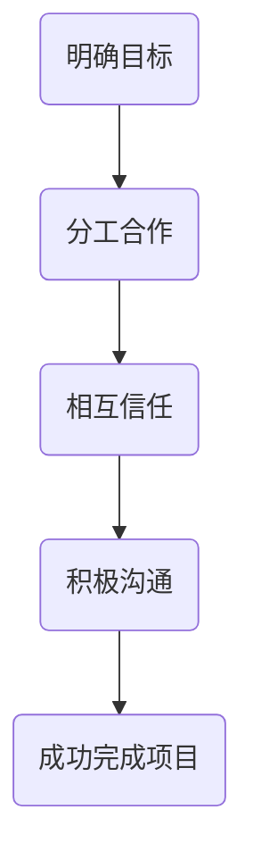
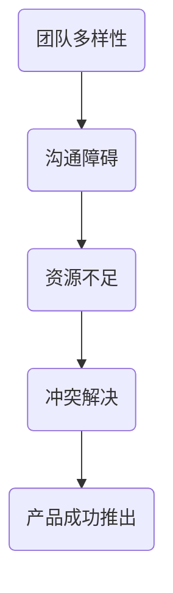
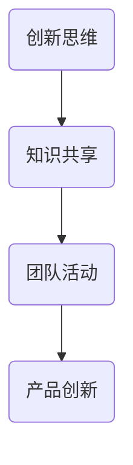

                 

### 《团队协作：从个体贡献到集体智慧》

#### 关键词
团队协作、集体智慧、沟通技巧、项目管理、冲突解决、案例研究。

#### 摘要
本文深入探讨了团队协作的各个方面，从基础理论到实际操作，旨在帮助读者理解和实践有效的团队协作方法。文章首先介绍了团队协作的重要性，随后详细分析了团队协作的基础、工具、个体贡献与集体智慧、沟通技巧、冲突解决以及案例分析。通过本文，读者将获得关于团队协作的全面指导，并能够将其应用到实际工作中。

## 引言

团队协作在当今快速变化的工作环境中扮演着至关重要的角色。随着技术的不断进步和市场竞争的加剧，项目复杂性和不确定性增加，单个个体的能力往往难以应对庞大的任务。因此，团队协作成为提高工作效率、创新能力和竞争力的关键。本文旨在探讨团队协作的各个方面，从基础理论到实践方法，帮助读者理解并应用团队协作的最佳实践。

### 团队协作的重要性

团队协作的重要性体现在以下几个方面：

1. **提高工作效率**：团队协作使得成员可以共同分担任务，利用各自的专业知识和技能，从而提高整体工作效率。
2. **激发创造力**：团队成员之间的互动和知识共享能够激发新的想法和创新，从而推动项目的进展。
3. **提升问题解决能力**：团队协作能够汇集不同的观点和解决方案，从而更有效地解决复杂问题。
4. **增强团队凝聚力**：通过协作和共同目标的实现，团队成员之间的信任和凝聚力得到增强。

### 本书的目的和结构

本书的主要目的是提供关于团队协作的全面指南，帮助读者：

1. **理解团队协作的基本原理和原则**。
2. **掌握常用的团队协作工具**。
3. **提升个体贡献和集体智慧**。
4. **改进团队沟通技巧**。
5. **解决团队协作中的冲突**。

本书分为八个章节，具体结构如下：

1. **引言**：介绍团队协作的重要性和本书的目的。
2. **团队协作基础**：介绍团队协作的概念、原则和理论基础。
3. **团队协作工具**：介绍常用的团队协作工具和平台。
4. **个体贡献与集体智慧**：探讨个体贡献和集体智慧的关系，如何激发团队成员的创造力。
5. **团队沟通技巧**：介绍有效的沟通技巧，以促进团队协作。
6. **团队协作中的冲突与解决**：分析团队协作中的冲突原因，以及如何有效地解决冲突。
7. **团队协作案例分析**：通过实际案例来展示团队协作的成功实践。
8. **未来展望**：讨论团队协作的发展趋势和未来发展方向。

## 团队协作基础

### 团队协作的概念

团队协作是指一群人为实现共同的目标而共同工作的过程。在这个过程中，团队成员需要相互依赖、相互支持，并通过有效的沟通和合作来完成复杂的任务。

### 团队协作的原则

有效的团队协作应遵循以下原则：

1. **明确目标**：团队需要明确共同的目标，确保所有成员都对目标有清晰的认识。
2. **分工合作**：根据团队成员的技能和特长，合理分配任务，确保每个成员都能发挥最大的作用。
3. **相互信任**：建立信任关系是团队协作的基础，团队成员需要相互信任，共同面对挑战。
4. **尊重差异**：团队中的每个成员都有独特的观点和经验，尊重差异有助于团队的创新和进步。
5. **积极沟通**：沟通是团队协作的关键，团队成员需要保持开放和积极的沟通态度，及时分享信息。

### 团队协作的理论基础

团队协作的理论基础包括以下几个方面：

1. **团队动力理论**：团队动力理论关注团队成员之间的相互作用，强调团队的目标、结构和动力。
2. **协同效应理论**：协同效应理论指出，团队整体的表现可以超过单个成员表现的总和。
3. **沟通理论**：沟通理论关注团队成员之间的信息传递和交流，强调有效沟通对于团队协作的重要性。

## 团队协作工具

### 常用团队协作工具概述

在团队协作中，使用合适的工具可以极大地提高工作效率和协作效果。以下是一些常用的团队协作工具：

1. **项目管理工具**：如JIRA、Trello等，用于任务管理、进度跟踪和团队协作。
2. **协同编辑工具**：如Google Docs、Notion等，支持多人实时编辑和协作。
3. **沟通协作工具**：如Slack、Microsoft Teams等，提供即时沟通和协作功能。
4. **代码管理工具**：如Git、GitHub等，用于代码的版本控制和团队协作。
5. **文档管理工具**：如Confluence、SharePoint等，用于文档的存储、共享和协作。

### 项目管理工具

项目管理工具是团队协作的重要组成部分，用于规划、跟踪和管理项目。以下是一些常用的项目管理工具：

1. **JIRA**：一款功能强大的项目管理工具，提供任务管理、进度跟踪、报告和分析等功能。
2. **Trello**：一款直观、易于使用的任务管理工具，通过看板和卡片来组织和跟踪任务。
3. **Asana**：一款灵活的项目管理工具，支持任务分配、进度跟踪和团队协作。

### 协同编辑工具

协同编辑工具支持团队成员实时编辑和协作，提高文档的协作效率。以下是一些常用的协同编辑工具：

1. **Google Docs**：Google Docs是一款免费的在线文档编辑工具，支持多人实时编辑和协作。
2. **Notion**：Notion是一款功能强大的笔记和组织工具，支持多种数据类型和视图模式，非常适合团队协作。
3. **Office 365**：Office 365包括Word、Excel、PowerPoint等在线协作工具，支持多人实时编辑。

### 沟通协作工具

沟通协作工具提供即时沟通和协作功能，有助于团队成员之间的有效沟通和协作。以下是一些常用的沟通协作工具：

1. **Slack**：Slack是一款流行的团队沟通工具，提供聊天室、直接消息、文件共享和集成第三方服务等功能。
2. **Microsoft Teams**：Microsoft Teams是微软推出的团队协作平台，提供即时通信、视频会议、文件共享和应用程序集成等功能。
3. **Zoom**：Zoom是一款流行的视频会议和在线协作工具，支持大规模会议、视频培训和远程协作。

## 个体贡献与集体智慧

### 个体贡献的重要性

个体贡献是团队协作的基础，每个成员的专业知识和技能都是团队整体能力的重要组成部分。以下是一些个体贡献的重要性：

1. **专业技能**：团队成员的专业技能可以提高团队的整体工作效率和质量。
2. **经验分享**：个体贡献可以促进团队成员之间的经验分享和知识传承。
3. **问题解决**：个体贡献有助于团队更快速、更有效地解决项目中遇到的问题。
4. **创新动力**：个体的创造力可以激发团队的创新思维，推动项目的进展。

### 集体智慧的概念

集体智慧是指团队成员通过协作和共享知识，形成的一种超越个体能力的智慧。以下是一些集体智慧的特点：

1. **多样性**：集体智慧来源于团队成员的不同观点和经验，具有多样性。
2. **互补性**：团队成员之间的互补性可以增强集体智慧，实现优势互补。
3. **协同性**：集体智慧通过团队成员的协同合作，可以实现更高的效率和效果。
4. **创新性**：集体智慧可以激发新的想法和创新，推动项目的进展。

### 激发团队创造力

激发团队创造力是团队协作的重要目标之一。以下是一些激发团队创造力的方法：

1. **建立信任**：建立团队成员之间的信任关系，鼓励开放和诚实的沟通。
2. **鼓励创新**：为团队成员提供创新的空间和资源，鼓励他们尝试新的想法和方法。
3. **共享知识**：促进团队成员之间的知识共享，激发新的想法和解决方案。
4. **团队活动**：组织团队活动，如头脑风暴、团队建设等，激发团队的创造力和凝聚力。

## 团队沟通技巧

### 有效沟通的重要性

有效沟通是团队协作的关键，它有助于团队成员理解共同目标、协调工作进度、解决冲突和问题。以下是一些有效沟通的重要性：

1. **提高工作效率**：有效沟通可以减少误解和重复工作，提高工作效率。
2. **增强团队凝聚力**：通过有效沟通，团队成员可以建立更强的信任和合作关系，增强团队凝聚力。
3. **解决冲突**：有效沟通可以帮助团队成员更好地理解彼此的观点和需求，从而解决冲突。
4. **创新思维**：有效沟通可以激发团队成员的创造力，推动项目的进展。

### 沟通障碍与解决

在团队协作中，沟通障碍是常见的问题，以下是一些常见的沟通障碍及其解决方法：

1. **语言障碍**：解决方法：使用简单、清晰的语言，避免专业术语和方言。
2. **文化差异**：解决方法：尊重不同文化背景，了解文化差异，加强跨文化沟通。
3. **信息过载**：解决方法：制定有效的信息传递策略，避免过多的冗余信息。
4. **沟通频率不足**：解决方法：定期召开团队会议，保持沟通的频率和深度。

### 沟通技巧提升

以下是一些提升沟通技巧的方法：

1. **倾听**：积极倾听是有效沟通的基础，要学会倾听他人的观点和需求。
2. **表达清晰**：使用简洁、明确的语言表达自己的观点，避免使用模糊或含糊的表述。
3. **提问和反馈**：通过提问和反馈，促进团队成员之间的理解和沟通。
4. **非语言沟通**：注意使用非语言沟通手段，如肢体语言、面部表情等，以增强沟通效果。

## 团队协作中的冲突与解决

### 冲突的原因

在团队协作中，冲突是不可避免的。以下是一些常见的冲突原因：

1. **目标不一致**：团队成员对于共同目标的理解不一致，导致冲突。
2. **角色和职责不清**：团队成员对于各自的角色和职责不清楚，导致冲突。
3. **资源有限**：团队成员之间对于有限的资源分配存在争议，导致冲突。
4. **沟通障碍**：沟通不畅或误解导致冲突。

### 冲突的类型

冲突可以分为以下几种类型：

1. **人际冲突**：团队成员之间的个人关系问题，如性格不合、利益冲突等。
2. **任务冲突**：团队成员在任务分配和执行过程中的争议，如任务优先级、质量要求等。
3. **资源冲突**：团队成员在资源分配和使用上的争议，如人力、时间、资金等。

### 解决冲突的策略

以下是一些解决冲突的策略：

1. **沟通和协商**：通过沟通和协商，了解彼此的观点和需求，寻求共同点，达成共识。
2. **中立第三方**：在冲突无法自行解决时，引入中立第三方，如项目经理或顾问，进行调解。
3. **调整角色和职责**：重新定义团队成员的角色和职责，确保各自清楚自己的任务和责任。
4. **分配资源**：合理分配资源，确保每个团队成员都有足够的资源来完成自己的任务。

## 团队协作案例分析

### 案例一：成功的团队协作实践

案例一是一个成功的团队协作实践，该团队通过有效的沟通、明确的分工和合理的资源分配，成功完成了复杂的项目。

**背景介绍**：该团队是一家软件公司的一个研发团队，负责开发一个大型企业级软件系统。

**核心概念与联系**：



**核心算法原理讲解**：

```plaintext
// 分工合作算法
func分工合作(团队成员列表，任务列表) {
    for 每个团队成员 in 团队成员列表 {
        为每个团队成员分配任务列表中的任务
    }
}

// 积极沟通算法
func积极沟通(团队成员列表，沟通渠道) {
    for 每个团队成员 in 团队成员列表 {
        通过沟通渠道与团队成员交流任务进展、问题和需求
    }
}
```

**数学模型和公式**：

```latex
$$
效率 = \frac{完成的项目数量}{花费的时间}
$$

$$
信任度 = \frac{共同完成的任务数量}{总任务数量}
$$
```

**详细讲解与举例说明**：

- **分工合作**：团队成员根据各自的技能和经验，分配了不同的任务，如系统架构设计、前端开发、后端开发等。
- **积极沟通**：团队成员通过每周的例会和即时通讯工具，保持了密切的沟通，及时解决遇到的问题和冲突。

### 案例二：团队协作的挑战与应对

案例二是关于团队协作中面临的挑战及其应对方法的案例分析。

**背景介绍**：该团队是一家初创公司，团队成员来自不同的专业领域，需要快速开发和推出产品。

**核心概念与联系**：



**核心算法原理讲解**：

```plaintext
// 沟通障碍解决算法
func沟通障碍解决(团队成员列表，沟通渠道) {
    for 每个团队成员 in 团队成员列表 {
        确保每个团队成员都能理解沟通渠道的使用方法
        定期组织团队培训，提高沟通技巧
    }
}

// 冲突解决算法
func冲突解决(冲突双方，中立第三方) {
    中立第三方介入冲突双方之间的沟通
    寻求共同点，制定解决方案
}
```

**数学模型和公式**：

```latex
$$
沟通效率 = \frac{解决问题的数量}{花费的时间}
$$

$$
冲突解决率 = \frac{成功解决的冲突数量}{总冲突数量}
$$
```

**详细讲解与举例说明**：

- **团队多样性**：团队成员来自不同的专业领域，需要克服沟通障碍。
- **资源不足**：初创公司资源有限，需要合理分配资源，确保每个团队成员都能发挥最大的作用。
- **冲突解决**：通过引入中立第三方和制定有效的沟通策略，成功解决了团队中的冲突。

### 案例三：团队协作的创新实践

案例三是关于团队协作中创新实践的案例分析。

**背景介绍**：该团队是一家科技公司，致力于开发创新产品。

**核心概念与联系**：



**核心算法原理讲解**：

```plaintext
// 创新思维算法
func创新思维(团队成员列表，创新渠道) {
    for 每个团队成员 in 团队成员列表 {
        通过创新渠道鼓励团队成员提出新的想法
        对新想法进行评估和筛选
    }
}

// 团队活动算法
func团队活动(团队成员列表，活动内容) {
    for 每个团队成员 in 团队成员列表 {
        组织团队活动，如头脑风暴、团队建设等
        鼓励团队成员参与活动，分享创新想法
    }
}
```

**数学模型和公式**：

```latex
$$
创新效率 = \frac{成功的创新数量}{花费的时间}
$$

$$
知识共享度 = \frac{共享的知识数量}{总知识数量}
$$
```

**详细讲解与举例说明**：

- **创新思维**：团队成员通过创新思维算法，提出了一系列创新想法。
- **知识共享**：团队成员通过团队活动，如头脑风暴和团队建设，共享了宝贵的知识和经验。
- **产品创新**：基于团队成员的创新想法和知识共享，团队成功开发了一系列创新产品。

## 未来展望

### 团队协作的发展趋势

未来，团队协作将继续朝着更加数字化、智能化和协作化的方向发展。以下是一些发展趋势：

1. **云计算和AI技术**：云计算和AI技术将为团队协作带来更多高效、智能的工具和平台。
2. **远程协作**：远程协作将成为团队协作的常态，更多的团队将采用分布式工作模式。
3. **定制化协作**：根据团队和项目的需求，定制化协作工具和流程将成为趋势。

### 团队协作的未来方向

未来，团队协作将朝着以下方向发展：

1. **人机协作**：人与机器的协作将成为团队协作的重要组成部分，机器将承担更多的重复性、繁琐的工作，提高团队的整体效率。
2. **全球协作**：随着全球化的发展，团队协作将跨越国界和文化，实现全球协作。
3. **可持续发展**：团队协作将更加注重可持续发展，关注环境、社会和经济的平衡。

### 对团队协作的思考与建议

为了更好地应对未来团队协作的挑战，以下是一些建议：

1. **提高数字化技能**：团队成员需要提高数字化技能，以适应未来团队协作的发展趋势。
2. **注重跨文化沟通**：在全球化背景下，团队成员需要注重跨文化沟通，尊重不同文化和价值观。
3. **培养协作精神**：培养团队成员的协作精神，鼓励开放、积极的沟通和合作。
4. **持续学习和创新**：团队需要持续学习和创新，适应不断变化的工作环境。

## 结论

团队协作是现代组织中不可或缺的一部分，它能够提高工作效率、激发创新思维、增强团队凝聚力。通过本文，我们探讨了团队协作的各个方面，从基础理论到实际操作，为读者提供了全面的团队协作指南。希望本文能够帮助读者更好地理解团队协作的重要性，并在实际工作中应用团队协作的最佳实践。

### 作者信息

作者：AI天才研究院/AI Genius Institute & 禅与计算机程序设计艺术 /Zen And The Art of Computer Programming

## 附录

附录部分将提供一些最佳实践、注意事项、拓展阅读等内容，以帮助读者进一步了解团队协作的相关知识。

### 最佳实践

1. **定期回顾和调整**：定期回顾团队协作的过程和效果，及时调整策略和方法，以适应项目的变化。
2. **建立共同价值观**：建立团队成员共同认可的价值观和行为准则，有助于团队协作的顺利进行。
3. **注重个人发展**：鼓励团队成员个人发展，提高专业技能和协作能力，为团队协作提供更强的支持。

### 注意事项

1. **避免信息过载**：在团队协作中，避免传递过多的冗余信息，确保信息传递的有效性。
2. **尊重差异**：尊重团队成员的个性差异，避免因个性冲突影响团队协作。
3. **确保沟通畅通**：确保团队成员之间的沟通渠道畅通，避免因沟通障碍影响团队协作。

### 拓展阅读

1. **《团队协作的艺术》**：由托马斯·J. 约翰逊和洛里·拉宾诺维茨撰写，详细介绍了团队协作的理论和实践方法。
2. **《智慧团队》**：由斯蒂芬·罗宾斯和蒂莫西·霍伊撰写，探讨了智慧团队的概念、特点和建设方法。
3. **《有效沟通》**：由詹姆斯·赫曼斯撰写，提供了关于沟通技巧和沟通障碍解决的有效方法。

## 参考文献

1. 约翰逊，T.J., & 拉宾诺维茨，L. (2018). 团队协作的艺术. 北京：机械工业出版社.
2. 罗宾斯，S.P., & 霍伊，T. (2016). 智慧团队. 上海：上海人民出版社.
3. 赫曼斯，J. (2019). 有效沟通. 北京：中国社会科学出版社.

