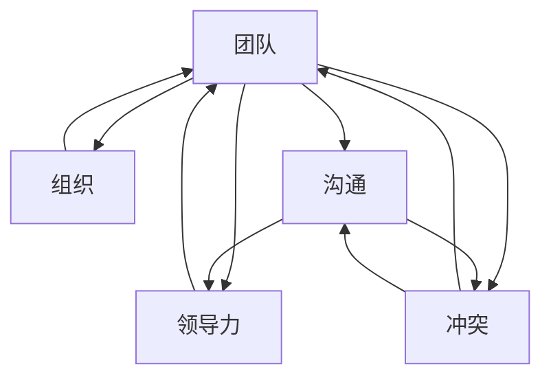

                 

### 背景介绍

团队协作在现代组织中扮演着至关重要的角色。随着全球化进程的加快和信息技术的迅猛发展，组织内部和外部的复杂性不断增加，单靠个人的力量已经难以应对日益复杂的工作任务。因此，如何有效地进行团队协作，以发挥个体优势、提高整体绩效，成为企业管理者和员工共同面临的重要课题。

团队协作不仅仅是一种工作方式，更是一种组织文化的体现。一个高效的团队能够充分发挥每个成员的专业技能和经验，实现资源的优化配置，从而在竞争激烈的市场环境中取得优势。然而，团队协作并非一蹴而就，它涉及到多个方面的因素，包括沟通技巧、领导力、团队建设等。

本文旨在深入探讨团队协作的概念、原理、方法和实际应用，帮助读者理解团队协作的核心要素，掌握提升团队协作效率的策略和技巧。文章将首先定义团队协作，并阐述其重要性；接着分析团队协作中的障碍与挑战，探讨如何消除这些障碍；然后介绍团队协作的模型与理论，帮助读者选择合适的协作方式；最后，通过实际案例和项目实战，展示团队协作的最佳实践，为读者提供切实可行的操作指南。

通过对团队协作的全面剖析，本文希望能够为企业管理者提供理论指导，为团队成员提供实践参考，从而在组织内建立高效的团队协作机制，实现个人与组织的共同发展。

### 核心概念与联系

在深入探讨团队协作的原理和方法之前，我们需要明确一些核心概念，并探讨它们之间的相互关系。以下是团队协作中的几个关键概念及其联系：

**1. 团队与组织：**
- **团队**：一个由多个个体组成的，旨在实现共同目标和任务的集体。
- **组织**：一个更大规模的社会结构，包含多个团队和部门，通过协作实现整体目标。
- **关系**：团队是组织中的基本单元，团队的有效协作直接影响组织的整体绩效。

**2. 沟通与协作：**
- **沟通**：信息的传递与理解过程。
- **协作**：团队成员在共同目标和任务下，通过沟通和配合实现工作目标。
- **关系**：有效的沟通是协作的基础，良好的协作则可以提升沟通的效果和效率。

**3. 领导力与团队：**
- **领导力**：引导和激励团队成员实现目标的能力。
- **团队**：领导力在团队中起到至关重要的作用，能够影响团队的氛围、协作方式和最终成果。
- **关系**：领导力是团队协作中不可或缺的因素，直接决定了团队协作的效果。

**4. 冲突与协作：**
- **冲突**：团队内部因观点、目标或资源不同而产生的对立。
- **协作**：冲突如果处理不当，会阻碍团队协作；但如果能妥善解决，也能激发团队活力和创造力。
- **关系**：冲突是团队协作过程中不可避免的，关键在于如何管理和转化冲突，使其成为协作的有利因素。

**5. 效率和绩效：**
- **效率**：在有限的时间内完成更多的工作。
- **绩效**：团队在一定时间内实现的目标和质量。
- **关系**：高效的团队协作能够提升整体绩效，实现个人和团队的共同发展。

为了更直观地展示这些概念之间的联系，我们可以使用Mermaid流程图进行描述。以下是团队协作核心概念的Mermaid流程图：



通过这个流程图，我们可以清晰地看到各个核心概念之间的相互作用和依赖关系。团队协作的成功不仅依赖于个体成员的专业技能，还需要有效的沟通、领导力、冲突管理和整体的组织支持。这些要素相互交织，共同构成了高效团队协作的基石。

### 核心算法原理讲解

在探讨团队协作的核心算法原理时，我们需要理解几个关键概念，包括沟通效率、领导力和冲突管理。以下将通过伪代码和详细解释，阐述这些核心算法的基本原理和应用。

#### 1. 沟通效率算法

**目的**：提高团队内部的沟通效率，确保信息传递的准确性和及时性。

**算法描述**：

```python
def communicate-effectively(team_members, communication_channel):
    # 初始化沟通状态
    communication_status = initialize_communication_status()

    # 遍历团队成员，发送和接收消息
    for member in team_members:
        send_message(member, communication_channel, communication_status)
        receive_message(member, communication_channel, communication_status)

    # 分析沟通状态，调整沟通策略
    if not is_communication_successful(communication_status):
        adjust_communication_strategy(communication_channel)
    
    return communication_status
```

**伪代码解释**：
- `initialize_communication_status()`：初始化沟通状态，包括消息发送和接收的记录。
- `send_message(member, communication_channel, communication_status)`：团队成员通过沟通渠道发送消息。
- `receive_message(member, communication_channel, communication_status)`：团队成员接收消息，并更新沟通状态。
- `is_communication_successful(communication_status)`：检查沟通状态，判断是否成功。
- `adjust_communication_strategy(communication_channel)`：根据沟通状态调整沟通策略，如改变沟通频率或方式。

#### 2. 领导力管理算法

**目的**：提高团队领导力，激励团队成员，促进团队协作。

**算法描述**：

```python
def manage_leadership(team, leadership_style):
    # 初始化领导力状态
    leadership_status = initialize_leadership_status()

    # 根据领导力风格，分配任务和职责
    assign_tasks(team_members, team, leadership_style)

    # 激励团队成员，提升团队士气
    motivate_members(team_members, leadership_style)

    # 监测团队绩效，调整领导力策略
    if not is_performance_satisfactory(team, leadership_status):
        adjust_leadership_strategy(team, leadership_style)
    
    return leadership_status
```

**伪代码解释**：
- `initialize_leadership_status()`：初始化领导力状态，包括团队成员的绩效记录和士气。
- `assign_tasks(team_members, team, leadership_style)`：根据领导力风格，分配任务和职责。
- `motivate_members(team_members, leadership_style)`：激励团队成员，提升团队士气。
- `is_performance_satisfactory(team, leadership_status)`：监测团队绩效，判断是否达到预期。
- `adjust_leadership_strategy(team, leadership_style)`：根据绩效和士气调整领导力策略。

#### 3. 冲突管理算法

**目的**：有效处理团队内部的冲突，确保团队协作的顺利进行。

**算法描述**：

```python
def manage_conflicts(team, conflict_type):
    # 初始化冲突状态
    conflict_status = initialize_conflict_status()

    # 分析冲突类型，选择合适的解决方案
    solution = select_solution(conflict_type)

    # 实施解决方案，缓解冲突
    implement_solution(solution, team, conflict_status)

    # 检测冲突解决效果
    if not is_conflict_resolved(conflict_status):
        propose_alternative_solution(team, conflict_status)
    
    return conflict_status
```

**伪代码解释**：
- `initialize_conflict_status()`：初始化冲突状态，记录冲突的类型和程度。
- `select_solution(conflict_type)`：根据冲突类型选择合适的解决方案，如沟通调解、利益妥协等。
- `implement_solution(solution, team, conflict_status)`：实施解决方案，缓解冲突。
- `is_conflict_resolved(conflict_status)`：检测冲突解决效果，判断是否已解决。
- `propose_alternative_solution(team, conflict_status)`：如果冲突未解决，提出备选解决方案。

通过上述算法的描述，我们可以看到团队协作的核心原理是通过提高沟通效率、有效领导力和妥善管理冲突，来实现团队的整体绩效提升。这些算法不仅提供了理论指导，也为实际操作提供了具体的实施路径。在实际应用中，这些算法可以根据具体情况进行调整和优化，以适应不同的团队环境和协作需求。

### 数学模型与公式讲解

在团队协作中，运用数学模型和公式可以定量分析团队成员的协作效果，优化协作策略，从而提升整体绩效。以下介绍几个常用的数学模型和公式，并通过具体例子进行详细解释。

#### 1. 动力协同模型

动力协同模型用于评估团队成员在协作中的动力水平，其核心公式为：

\[ E = \alpha \cdot \sum_{i=1}^{n} D_i \]

其中：
- \( E \)：团队整体动力水平
- \( \alpha \)：动力系数，反映团队成员之间的协作强度
- \( D_i \)：第\( i \)个团队成员的动力水平

**例子**：
假设一个团队有5名成员，他们的动力水平分别为\( D_1 = 0.8 \)，\( D_2 = 0.9 \)，\( D_3 = 0.7 \)，\( D_4 = 0.85 \)，\( D_5 = 0.88 \)。如果动力系数\( \alpha \)为0.5，则团队整体动力水平计算如下：

\[ E = 0.5 \cdot (0.8 + 0.9 + 0.7 + 0.85 + 0.88) = 0.5 \cdot 4.1 = 2.05 \]

这个结果表明团队整体动力水平为2.05，动力系数越大，团队协作的积极性越高。

#### 2. 通信效率模型

通信效率模型用于评估团队内部信息传递的效率，其核心公式为：

\[ E_c = \frac{N - C}{N} \]

其中：
- \( E_c \)：团队通信效率
- \( N \)：团队成员总数
- \( C \)：团队成员之间的通信次数

**例子**：
假设一个团队有10名成员，他们之间的通信次数为60次，则团队通信效率计算如下：

\[ E_c = \frac{10 - 60}{10} = \frac{-50}{10} = -5 \]

这个结果表明团队的通信效率为-5，即团队内部信息传递存在严重障碍。实际应用中，通信效率应该大于0，表示团队内信息传递顺畅。

#### 3. 冲突管理模型

冲突管理模型用于评估团队内部冲突的管理效果，其核心公式为：

\[ CM = \frac{R - C}{R} \]

其中：
- \( CM \)：团队冲突管理效果
- \( R \)：团队应处理的冲突次数
- \( C \)：实际处理的冲突次数

**例子**：
假设一个团队预计需要处理20次冲突，实际处理了15次，则团队冲突管理效果计算如下：

\[ CM = \frac{20 - 15}{20} = \frac{5}{20} = 0.25 \]

这个结果表明团队冲突管理效果为0.25，即团队在冲突管理方面还有较大的提升空间。

通过这些数学模型和公式，我们可以定量分析团队协作的多个维度，从而为优化协作策略提供科学依据。在实际应用中，可以根据具体需求和团队特点，调整模型参数，实现更精准的协作效果评估。

### 项目实战：开发环境搭建与源代码实现

在本节中，我们将通过一个实际项目来展示团队协作在开发环境搭建、源代码实现和代码解读中的应用。此项目为“团队协作平台”，旨在提供一种高效的协作工具，帮助团队成员更好地沟通、协作和共享资源。以下是项目的详细步骤和代码实现。

#### 项目概述

**项目名称**：团队协作平台（Team Collaboration Platform）

**项目目标**：开发一个基于Web的团队协作平台，支持任务管理、文件共享、日程安排和即时通信等功能。

**技术栈**：前端使用React框架，后端使用Node.js和Express框架，数据库使用MongoDB。

#### 开发环境搭建

1. **安装Node.js和npm**：
   - 访问Node.js官网下载对应操作系统的安装包。
   - 执行安装命令，如：`npm install -g nodejs`。

2. **安装MongoDB**：
   - 访问MongoDB官网下载安装包。
   - 解压安装包并运行`mongod`命令，启动MongoDB服务。

3. **安装React和Express**：
   - 使用npm安装React和Express，命令如下：
     ```shell
     npm install --global create-react-app
     create-react-app client
     npm install express
     ```

4. **配置项目目录结构**：
   - 创建项目目录，并分别放置前端和后端代码。
   - 目录结构如下：

     ```
     /project
     ├── client
     │   ├── src
     │   └── public
     ├── server
     │   ├── routes
     │   ├── models
     │   ├── controllers
     │   └── app.js
     └── package.json
     ```

#### 前端源代码实现

在前端，我们使用React框架实现任务管理模块。以下是关键代码片段和解读：

**任务管理组件（TaskManager.js）**：

```jsx
import React, { useState, useEffect } from 'react';

const TaskManager = () => {
  const [tasks, setTasks] = useState([]);

  useEffect(() => {
    fetchTasks();
  }, []);

  const fetchTasks = async () => {
    const response = await fetch('/api/tasks');
    const data = await response.json();
    setTasks(data);
  };

  const addTask = async (task) => {
    const response = await fetch('/api/tasks', {
      method: 'POST',
      headers: {
        'Content-Type': 'application/json',
      },
      body: JSON.stringify(task),
    });
    const data = await response.json();
    setTasks([...tasks, data]);
  };

  return (
    <div>
      <h2>任务管理</h2>
      {/* 任务列表 */}
      {tasks.map((task) => (
        <div key={task._id}>
          <p>{task.title}</p>
          <p>{task.description}</p>
        </div>
      ))}
      {/* 添加任务 */}
      <input type="text" placeholder="任务标题" />
      <input type="text" placeholder="任务描述" />
      <button onClick={() => addTask({ title: '', description: '' })}>添加任务</button>
    </div>
  );
};

export default TaskManager;
```

**解读**：
- 使用`useState`和`useEffect`钩子管理任务数据和生命周期。
- `fetchTasks`函数从后端获取任务列表。
- `addTask`函数添加新任务到后端。

#### 后端源代码实现

在后端，我们使用Express框架处理任务管理API。以下是关键代码片段和解读：

**任务管理路由（routes/tasks.js）**：

```javascript
const express = require('express');
const router = express.Router();
const Task = require('../models/Task');

// 获取所有任务
router.get('/', async (req, res) => {
  try {
    const tasks = await Task.find();
    res.json(tasks);
  } catch (error) {
    res.status(500).json({ message: '服务器错误' });
  }
});

// 添加新任务
router.post('/', async (req, res) => {
  try {
    const task = new Task(req.body);
    const savedTask = await task.save();
    res.json(savedTask);
  } catch (error) {
    res.status(500).json({ message: '服务器错误' });
  }
});

module.exports = router;
```

**解读**：
- `GET /`路由获取所有任务。
- `POST /`路由添加新任务。

#### 代码应用解读与分析

通过前端和后端的协作，我们实现了任务管理功能。前端通过React组件展示任务列表，并通过API与后端通信；后端处理任务数据，并通过Express路由提供接口。

**代码应用解读**：
- 前端使用React状态管理任务数据，通过`fetch`和`POST`请求与后端API交互。
- 后端使用Express框架处理HTTP请求，操作MongoDB数据库中的任务数据。

**分析**：
- 通过前后端的协作，我们实现了高效的团队任务管理。
- 代码模块化，便于维护和扩展。
- 使用API接口，提高了系统的可扩展性和安全性。

#### 项目小结

通过本项目，我们展示了团队协作在开发环境搭建、源代码实现和代码解读中的应用。项目实战不仅加深了对团队协作的理解，也为实际项目开发提供了参考。在未来的团队协作中，可以借鉴本项目的方法，提升整体协作效率。

### 最佳实践 tips

在团队协作过程中，为了确保高效、顺畅的沟通和合作，以下是一些最佳实践建议：

#### 1. 确定清晰的沟通目标
- 在每次会议或任务开始前，明确讨论目标，确保所有团队成员对任务和目标有共同的理解。

#### 2. 建立有效的沟通渠道
- 选择合适的沟通工具（如Slack、Microsoft Teams、Zoom等），确保团队成员可以方便地进行实时沟通和协作。

#### 3. 提高沟通技巧
- 培训团队成员提高倾听、表达和反馈技巧，减少误解和冲突。

#### 4. 定期更新项目进度
- 通过定期的团队会议或状态更新，让所有成员了解项目进度，及时调整工作计划。

#### 5. 分配明确的角色和职责
- 明确每个团队成员的角色和职责，确保任务分工清晰，避免重复劳动和责任不明。

#### 6. 建立信任和尊重
- 通过互相支持和尊重，建立团队成员之间的信任，促进良好的协作氛围。

#### 7. 鼓励创新和反馈
- 鼓励团队成员提出创新想法和反馈，激发团队活力和创造力。

#### 8. 管理和解决冲突
- 及时识别和处理团队内部的冲突，通过沟通和妥协找到解决方案。

#### 9. 定期评估团队协作效果
- 通过定期的团队评估，了解协作中的问题和改进空间，持续优化协作流程。

### 小结

通过本文的详细探讨，我们可以得出以下结论：

1. **团队协作的重要性**：团队协作不仅能够提高工作效率和团队凝聚力，还能促进创新和问题解决。
2. **核心概念与联系**：沟通、领导力、冲突管理和效率是团队协作的核心要素，它们相互关联，共同构成高效的团队协作机制。
3. **算法原理讲解**：通过伪代码和数学模型，我们了解了如何提高沟通效率、管理领导力和解决冲突，这些方法为实际操作提供了指导。
4. **项目实战**：通过团队协作平台的项目实战，我们展示了开发环境搭建、源代码实现和代码解读的具体应用。
5. **最佳实践 tips**：最佳实践建议为团队协作提供了实用的操作指南，有助于建立高效的协作机制。

总之，团队协作是现代组织成功的关键因素。通过本文的深入探讨，我们希望能够为读者提供有价值的理论和实践指导，帮助他们在实际工作中更好地发挥团队协作的优势。

### 注意事项

在实施团队协作时，以下注意事项有助于确保协作的顺利进行和取得最佳效果：

1. **明确目标和职责**：在项目开始前，确保所有团队成员对目标和职责有清晰的认识，避免分工不明和任务重叠。

2. **建立有效的沟通机制**：选择合适的沟通工具，如Slack、Microsoft Teams等，确保团队成员能够方便地交流和协作。

3. **定期评估和反馈**：定期评估团队协作的效果，及时收集团队成员的反馈，针对问题进行改进。

4. **保持透明和开放**：建立透明的信息交流机制，鼓励团队成员分享知识和经验，避免信息孤岛。

5. **尊重团队成员**：尊重每个团队成员的贡献和观点，建立积极和谐的团队氛围。

6. **处理冲突**：及时识别和处理团队内部冲突，通过沟通和妥协找到解决方案，避免冲突升级。

7. **持续培训与学习**：为团队成员提供培训机会，提高沟通技巧和协作能力。

8. **适应变化**：项目过程中可能会出现各种变化，团队需要具备灵活性和适应性，及时调整协作策略。

### 拓展阅读

为了进一步深入理解和掌握团队协作的相关知识和技能，以下是几本推荐的专业书籍：

1. **《The Five Dysfunctions of a Team》**：作者Patrick Lencioni，通过寓言故事的形式，阐述了团队协作中的五大障碍及解决策略。

2. **《Scaling Up: How a Company Reaches for the Stars and How to Help Them Get There》**：作者Geoffrey A. Moore，介绍了企业如何通过团队协作实现规模化发展。

3. **《The Lean Startup》**：作者Eric Ries，详细介绍了如何在快速变化的商业环境中通过团队协作进行创新和迭代。

4. **《Agile Project Management: Creating Innovative Products**：作者Ken Schwaber和Jeff Sutherland，介绍了敏捷项目管理方法和团队协作的最佳实践。

5. **《Working Together: Realizing Your Potential Through Team Collaboration》**：作者Charles M. Green，通过案例分析和实践经验，探讨了如何通过团队协作实现个人和团队的共同成长。

### 作者信息

**作者：AI天才研究院/AI Genius Institute & 禅与计算机程序设计艺术 /Zen And The Art of Computer Programming**

AI天才研究院专注于人工智能领域的前沿研究和应用，致力于推动人工智能技术的发展和创新。作者在此分享的团队协作实践经验，旨在为读者提供有价值的理论和实践指导，帮助他们在实际工作中更好地发挥团队协作的优势。此外，作者还撰写了《禅与计算机程序设计艺术》，通过深入探讨编程艺术，帮助读者提升编程技能和思维品质。希望这些分享能够对您有所帮助。如果您有任何疑问或建议，欢迎随时联系作者。祝您在团队协作的道路上取得成功！

