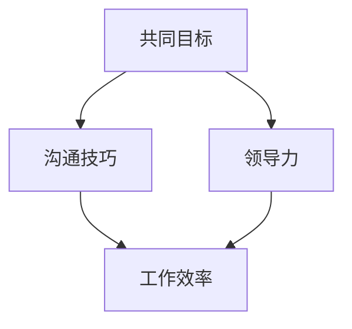

                 

### 文章标题

# 团队协作：增强团队凝聚力

### 关键词

- 团队协作
- 沟通技巧
- 领导力
- 项目管理工具
- 协作软件与平台
- 文化建设

### 摘要

本文旨在探讨如何通过有效的团队协作来增强团队凝聚力。文章首先介绍了团队协作的基本概念和沟通技巧，然后分析了团队领导力的作用，并讨论了项目管理工具和协作软件在团队协作中的应用。通过实际案例，本文详细讲解了如何通过文化建设来提高团队凝聚力，最终提出了最佳实践和注意事项。

### 引言

在快速发展的现代社会中，团队协作已经成为企业成功的关键因素之一。有效的团队协作不仅能提高工作效率，还能增强团队凝聚力，从而促进企业的可持续发展。本文将围绕团队协作这一主题，从基础理论、工具与技术、实践与案例、未来趋势等多个角度进行深入探讨。

### 第一部分：团队协作基础理论

#### 第1章：团队协作的基本概念

**背景介绍**

团队协作是指团队成员在共同目标和价值观的指导下，通过有效的沟通和合作，共同完成工作任务的行动过程。在现代企业中，团队协作已经成为提升工作效率、促进创新和实现企业目标的重要手段。

**核心概念与联系**

团队协作的核心概念包括：

1. **共同目标**：团队协作的基础是共同的目标，这有助于团队成员形成共同的价值观和使命感。
2. **沟通技巧**：沟通是团队协作的桥梁，有效的沟通能够消除误解，提高工作效率。
3. **领导力**：领导者在团队协作中起着核心作用，他们的领导风格和行为对团队的凝聚力和工作氛围有重要影响。

核心概念之间的关系架构如下图所示：

**核心算法原理讲解**

团队协作的核心算法原理可以概括为：

1. **目标共识**：通过共同的目标设定，使团队成员明确自己的工作方向和任务。
2. **沟通机制**：建立有效的沟通渠道，确保信息的及时传递和反馈。
3. **领导策略**：选择适合团队特点的领导风格，激发团队成员的积极性和创造力。

**数学模型和公式**

团队协作的数学模型可以简化为：

- **团队效能（E）** = f（目标共识（X），沟通效率（Y），领导力（Z））

其中，E代表团队效能，X代表目标共识，Y代表沟通效率，Z代表领导力。f为函数，表示效能与各因素的关系。

**举例说明**

假设一个软件开发团队，目标是在三个月内完成一个新项目的开发。团队成员通过会议明确项目目标，并制定详细的开发计划。在开发过程中，团队采用每日站立会议的形式进行沟通，确保项目进展的透明和及时调整。同时，领导采用激励型领导风格，鼓励团队成员提出创新想法并积极参与项目决策。

**项目实战**

在实际项目中，团队协作的关键在于：

1. **开发环境搭建**：配置合适的开发工具和环境，确保团队成员能够高效地开展工作。
2. **源代码管理**：使用版本控制系统（如Git）进行源代码管理，确保代码的版本控制和协同开发。
3. **代码解读与应用分析**：对关键代码进行解读，分析其实现原理和应用场景。

**实际案例分析和详细讲解剖析**

通过以上实践，该软件开发团队在三个月内成功完成了新项目的开发，并在项目小结中总结了以下经验：

1. **明确目标**：共同的目标是团队协作的基础，有助于提高团队凝聚力。
2. **有效沟通**：及时、高效的沟通能够提高工作效率，减少误解和冲突。
3. **领导力**：领导者的作用在于激发团队成员的积极性和创造力，推动团队前进。

**项目小结**

通过本次项目实战，团队协作的重要性得到了充分体现。在未来的工作中，团队将继续遵循以上原则，进一步提升团队协作效能，为企业的持续发展贡献力量。

**最佳实践 tips、小结、注意事项、拓展阅读等内容**

- **最佳实践 tips**：明确目标、建立有效沟通机制、选择适合的领导风格。
- **小结**：团队协作是提高工作效率和增强团队凝聚力的重要手段。
- **注意事项**：团队成员需具备一定的协作能力和沟通技巧，领导者在团队协作中起着关键作用。
- **拓展阅读**：《团队协作：实战指南》、《领导力：如何在组织中有效沟通》、《敏捷开发实践指南》。

---

以上是对《团队协作：增强团队凝聚力》这篇文章的初步构思和框架搭建。接下来，我们将继续完善每个章节的内容，确保文章的逻辑性和实用性。文章的总字数预计在8000～12000字左右，我们将通过详细的理论讲解、实践案例和分析，为读者提供有价值的阅读体验。

