                 

### **团队协作与沟通的基本概念**

在信息技术领域，团队协作是项目成功的关键因素之一。团队协作不仅仅是团队成员之间相互配合，更是通过有效的沟通来确保项目目标的达成。因此，理解团队协作和沟通的基本概念是构建高效团队的第一步。

#### **团队协作的概念与重要性**

**团队协作**是指多个个体为了共同的目标而相互协作的过程。它涉及共享资源、信息交流、分工合作和共同承担责任。团队协作的重要性体现在以下几个方面：

1. **提高项目效率**：团队成员可以互补技能，协同完成复杂的任务，从而提高工作效率。
2. **提升决策质量**：多个人共同讨论和分析问题，可以提供更全面的视角和解决方案。
3. **增强创新能力**：团队成员之间的思想碰撞和合作，往往能激发创新的火花。
4. **促进知识共享**：团队成员在协作过程中，可以分享经验和知识，提高整体团队的能力。

#### **沟通的定义与类型**

**沟通**是指信息在发送者和接收者之间的传递和理解的过程。有效的沟通对于团队协作至关重要。沟通的类型主要包括以下几种：

1. **口头沟通**：通过口头语言进行的沟通，如会议、讨论等。
2. **书面沟通**：通过文字进行的沟通，如报告、邮件等。
3. **非语言沟通**：通过肢体语言、面部表情、声音等非语言方式进行的信息传递。
4. **电子沟通**：通过电子邮件、即时通讯工具、社交媒体等电子方式进行的沟通。

#### **团队协作中的沟通障碍与解决策略**

尽管沟通对于团队协作至关重要，但实际操作中常常会遇到各种沟通障碍，如语言障碍、文化差异、信息误解等。为了克服这些障碍，可以采取以下策略：

1. **明确沟通目标**：在沟通前明确目的，确保信息的传递是为了解决问题或达成目标。
2. **建立共同语言**：使用清晰、简洁的语言，避免专业术语或行话，确保所有团队成员都能理解。
3. **促进积极反馈**：鼓励团队成员提供反馈，确保信息的准确性。
4. **使用多种沟通方式**：结合口头、书面和非语言沟通，确保信息能够被有效传达。
5. **建立信任**：通过透明、开放的沟通方式，建立团队成员之间的信任，减少误解和冲突。

#### **团队协作中的角色与职责**

在团队协作中，每个成员都扮演着特定的角色，拥有明确的职责。常见的角色包括：

1. **领导者**：负责团队的整体方向、规划和决策。
2. **开发者**：负责具体的编程和开发工作。
3. **测试员**：负责测试和验证软件的质量。
4. **产品经理**：负责产品的规划和管理。
5. **设计师**：负责软件的用户界面和用户体验设计。

明确每个角色的职责，有助于团队高效运作，减少职责重叠和冲突。

#### **团队协作与个体绩效的关系**

团队协作不仅影响团队整体绩效，也影响个体绩效。团队成员在团队中的角色和职责，以及沟通的效率和质量，都会对个体的工作表现产生影响。有效的团队协作可以提高个体的工作满意度、成就感和职业发展。

**核心概念与联系**

为了更好地理解团队协作和沟通的基本概念，我们可以使用Mermaid流程图来展示它们之间的联系：

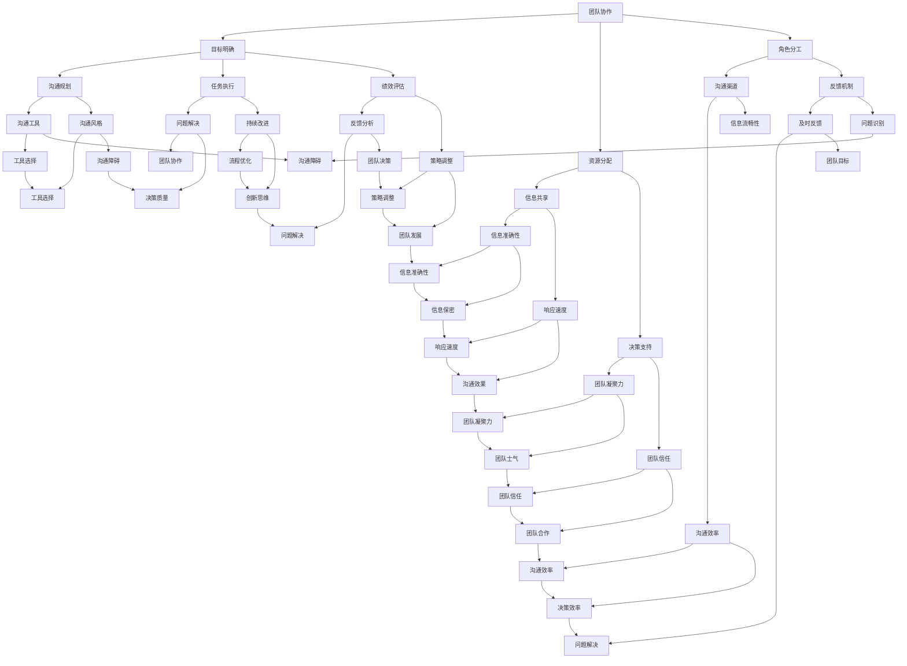

这个流程图展示了团队协作与沟通的基本概念之间的关系，包括团队协作的目标明确、资源分配、角色分工、沟通规划、任务执行、绩效评估等环节，以及信息共享、决策支持、沟通渠道、反馈机制等要素。通过这个流程图，我们可以更清晰地理解团队协作和沟通的各个环节如何相互作用，共同推动团队的成功。

### **团队协作技巧**

在团队协作中，有效的技巧是确保项目成功的关键。以下是一些关键的团队协作技巧，包括明确目标与愿景、提升团队凝聚力、提高沟通效率和优化工作流程。

#### **明确目标与愿景**

**确定团队目标**：团队的目标应当清晰、具体，并且与组织的整体目标保持一致。在项目开始之前，团队应该共同制定明确的目标，并将它们分解为可操作的步骤。

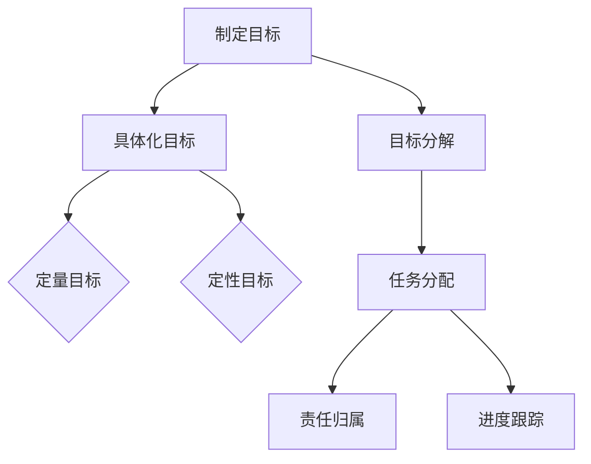

**建立共同愿景**：除了具体的短期目标，团队还应当有一个共同的长期愿景。这个愿景应当激励团队成员，让他们感到自己的工作是有意义和有价值的。

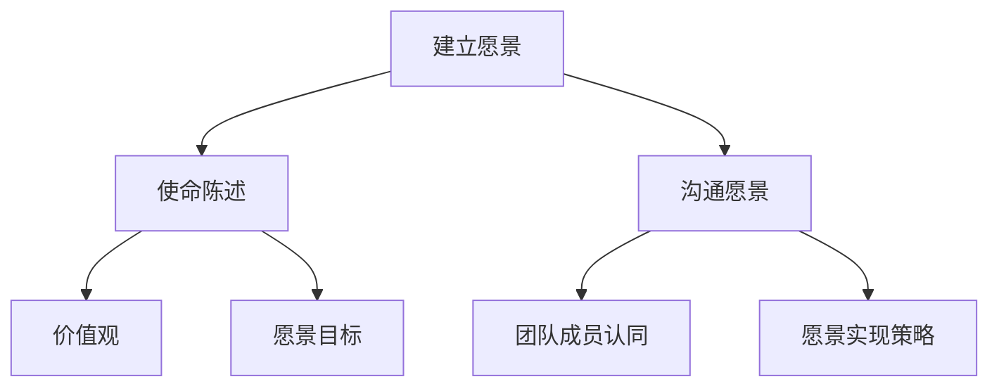

#### **提升团队凝聚力**

**增强团队信任**：信任是团队协作的基石。团队成员之间需要建立互信，通过开放、诚实和透明的沟通来建立信任关系。

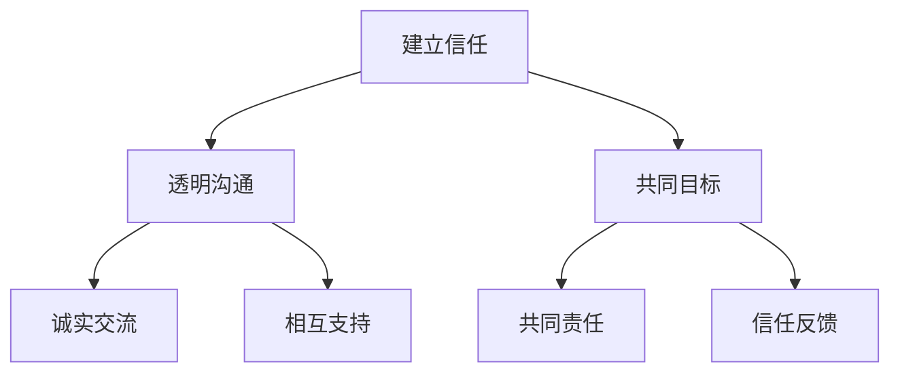

**培养团队归属感**：归属感可以增强团队成员对团队的忠诚度和参与度。通过团队建设活动和共享成功的庆祝，可以加强团队的凝聚力。

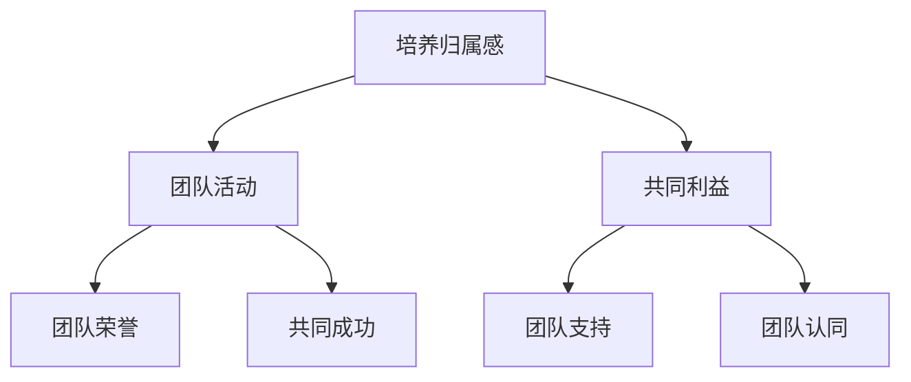

**促进有效冲突解决**：团队中不可避免地会出现冲突，但有效的冲突解决可以增强团队凝聚力。团队成员应当学会倾听、理解和尊重彼此的意见，并通过合作找到解决问题的方法。

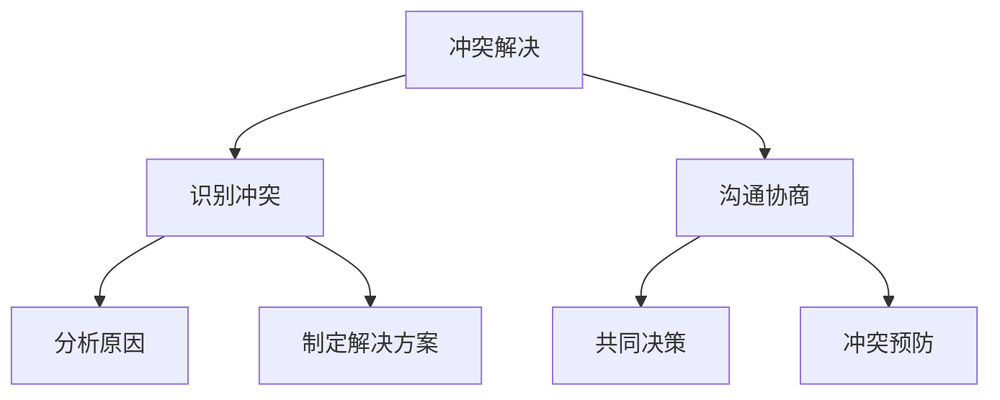

#### **提高沟通效率**

**选择合适的沟通工具**：不同的沟通需求可能需要不同的工具。例如，电子邮件适合正式的书面沟通，而即时通讯工具适合快速交流。

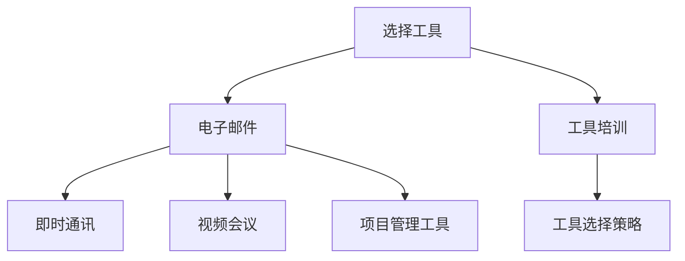

**改善沟通技巧**：团队成员需要具备良好的沟通技巧，包括倾听、表达和反馈。这些技巧可以通过培训和实践来提高。

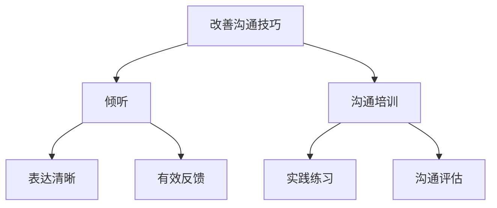

**简化沟通流程**：通过简化沟通流程，可以减少沟通的时间和复杂度，提高效率。例如，制定明确的沟通规范和流程图。

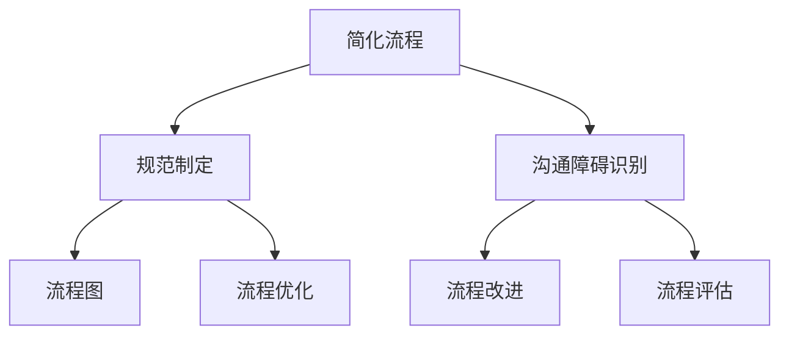

#### **优化工作流程**

**流程分析**：对当前的工作流程进行评估和分析，识别出存在的瓶颈和问题。

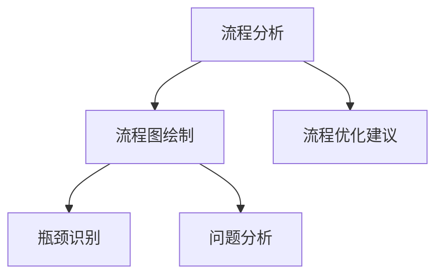

**流程优化策略**：根据分析结果，制定相应的优化策略，如自动化、标准化和简化流程。

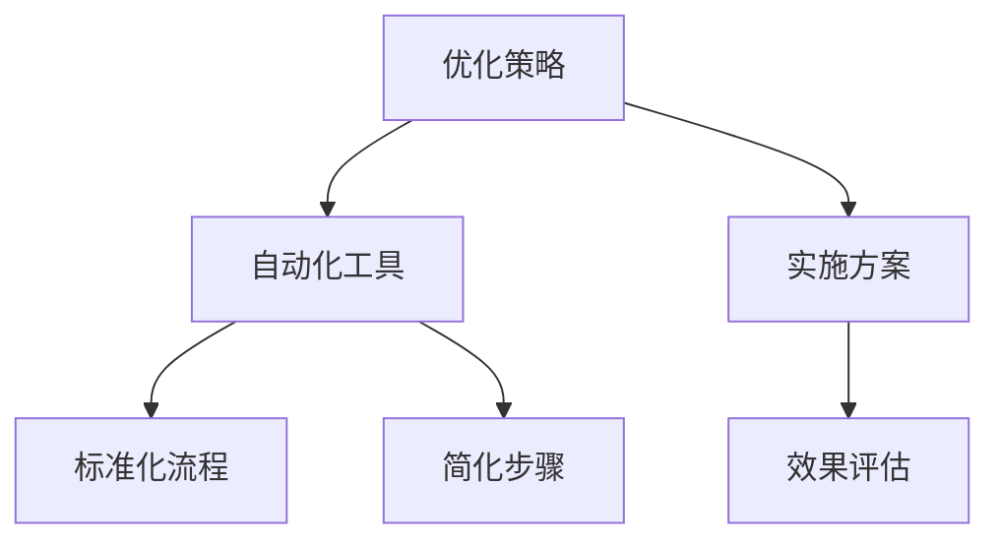

**流程改进案例**：通过具体的案例，展示流程优化后的效果，并为其他团队提供参考。

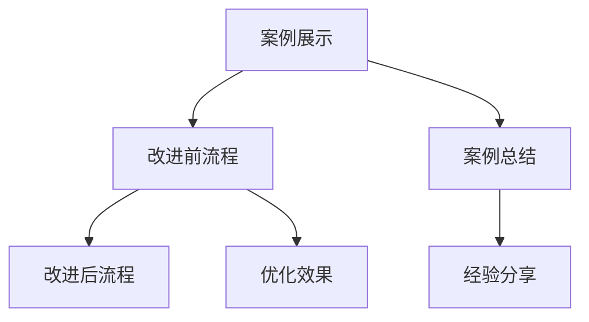

通过以上团队协作技巧，团队可以更好地协调工作、提高效率，最终实现项目的成功。这些技巧不仅适用于信息技术领域，也适用于其他需要团队合作的工作环境。

### **建立高效沟通渠道**

在团队协作中，建立高效沟通渠道是确保项目顺利推进和团队内部沟通畅通的关键。为了实现这一目标，需要从多个方面进行规划和实施，包括制定沟通计划、实施沟通计划、评估沟通效果以及不断改进沟通渠道。

#### **制定沟通计划**

**确定沟通目标**：在制定沟通计划之前，首先要明确沟通的目标。沟通目标应当具体、可衡量，并与团队的目标和项目的需求相一致。例如，确保每个团队成员都能及时了解项目的进展情况，或者确保关键决策能够迅速传达并得到执行。

**选择沟通方法**：根据团队的需求和实际情况，选择合适的沟通方法。常见的沟通方法包括面对面会议、电话会议、电子邮件、即时通讯工具（如Slack、Microsoft Teams）以及项目管理工具（如Jira、Trello）。每种方法都有其适用的场景，需要根据沟通的内容和紧急程度进行选择。

**制定沟通时间表**：沟通的时间表应当明确沟通的频率和具体时间。例如，每周召开一次项目进展会议，每天早上进行简报会议，或者在特定的时间节点进行专项讨论。时间表的制定要考虑团队成员的工作时间和项目的进度，确保沟通的及时性和有效性。

**分配沟通责任**：在沟通计划中，要明确每个团队成员在沟通中的角色和责任。例如，项目负责人负责组织会议和传达关键决策，开发人员负责报告进度和遇到的问题，测试人员负责提供测试结果和反馈。明确责任有助于提高沟通的效率，避免信息传递的遗漏和错误。

#### **实施沟通计划**

**保持沟通的一致性**：在实施沟通计划时，要确保所有团队成员都遵循同样的沟通规则和流程。一致性包括使用统一的沟通工具、遵守沟通的时间表以及保持沟通的风格和格式。这样可以减少沟通中的混乱，提高信息的传递效率。

**确保信息传递的准确性**：信息的准确性是有效沟通的关键。在传递信息时，要确保信息的完整性和正确性。可以通过以下方法来提高信息传递的准确性：

- **重复确认**：在传递重要信息时，可以要求接收方进行确认，确保信息被正确理解。
- **使用明确的语言**：避免使用模糊或歧义的语言，确保信息表达清晰明确。
- **提供背景信息**：在传递信息时，提供必要的背景信息，帮助接收方更好地理解信息的含义。

**及时反馈与调整**：在沟通过程中，要鼓励团队成员及时提供反馈，并根据反馈进行调整。及时反馈可以及时发现和纠正沟通中的问题，确保信息的准确性和沟通的顺畅。

#### **沟通渠道的评估与改进**

**评估沟通效果**：定期对沟通渠道的效果进行评估，可以了解沟通的效率和质量。评估可以从多个方面进行，包括：

- **沟通频率**：是否达到了计划中的沟通频率？
- **信息传递速度**：信息是否能够及时传递到需要的人员？
- **信息准确性**：信息是否被正确理解和执行？
- **团队满意度**：团队成员对沟通渠道的满意度如何？

**改进沟通渠道**：根据评估结果，对沟通渠道进行改进。改进措施可以包括：

- **调整沟通工具**：如果发现现有工具无法满足需求，可以考虑更换或添加新的沟通工具。
- **优化沟通流程**：通过简化流程、明确规则和责任，提高沟通效率。
- **培训沟通技能**：对团队成员进行沟通技能培训，提高他们的沟通能力。

**培训沟通技能**：为了确保团队成员具备良好的沟通技能，可以定期组织沟通技能培训。培训内容可以包括：

- **倾听技巧**：如何更好地倾听他人的意见和需求。
- **表达技巧**：如何清晰、准确地表达自己的观点。
- **反馈技巧**：如何提供有建设性的反馈，促进团队的改进。

通过制定、实施和评估沟通计划，以及不断改进沟通渠道，团队可以建立高效的沟通机制，确保项目顺利进行，实现团队的目标。

### **团队协作案例分析**

为了更好地理解团队协作与沟通技巧在实际项目中的应用，以下将介绍三个具体的案例分析，详细说明每个案例的背景、挑战、解决方案及实际效果。

#### **案例一：高效团队协作的实践**

**背景**：一家大型软件开发公司接受了一个复杂的客户项目，要求在短时间内开发出一款具有创新功能的企业级软件。团队成员来自不同的部门，包括开发、测试、UI设计和项目管理。

**挑战**：由于团队成员来自不同的部门，他们有着不同的工作习惯和沟通风格。项目时间紧迫，且需求多变，使得沟通的难度和复杂性大大增加。

**解决方案**：

1. **明确目标和愿景**：项目启动时，团队首先明确了项目的目标和愿景，并制定了详细的项目计划，确保所有成员都了解项目的整体方向和预期结果。
2. **使用项目管理工具**：团队采用了Jira作为项目管理工具，实时跟踪项目的进展和任务分配，确保每个人都清楚自己的职责和进度。
3. **定期沟通会议**：每周召开一次全员参与的沟通会议，会议内容包括项目进展、遇到的问题和解决方案的讨论。此外，还设置了每日的晨会，简短地总结当天的计划和目标。
4. **促进信息共享**：团队在内部建立了Wiki，用于记录项目的需求、设计文档和开发日志，确保所有成员都能够随时查阅相关资料。
5. **培训和提升沟通技能**：对团队成员进行了沟通技能培训，包括有效倾听、清晰表达和反馈技巧，以提高团队整体的沟通效率。

**实际效果**：通过以上措施，团队在短时间内高效地完成了项目，客户对软件的满意度很高。团队成员之间的沟通变得更加顺畅，合作也更加紧密，项目的整体效率和质量得到了显著提升。

#### **案例二：沟通渠道的优化实践**

**背景**：一家初创公司正在开发一款社交媒体应用，团队成员包括前端开发、后端开发、产品经理和设计师。由于公司规模较小，团队成员之间的沟通主要通过即时通讯工具进行，但效率不高。

**挑战**：由于团队成员的工作时间不一致，且项目需求频繁变动，导致沟通渠道不畅，信息传递不及时，影响了项目的进度。

**解决方案**：

1. **制定详细的沟通计划**：团队制定了详细的沟通计划，包括沟通的目标、方法和时间表。例如，每天早上进行一次团队晨会，每周进行一次项目回顾和计划会议。
2. **选择合适的沟通工具**：团队选择了Slack作为主要的沟通工具，并设置了多个频道，用于不同类型的信息交流。例如，创建了一个专门的频道用于项目讨论，另一个频道用于技术问题交流。
3. **明确沟通责任**：每个团队成员都明确了在沟通中的角色和责任，确保信息能够及时、准确地传递。
4. **实施沟通反馈机制**：团队设立了反馈机制，鼓励成员在沟通过程中提供即时反馈，以便及时发现和解决问题。
5. **定期评估和改进**：团队定期评估沟通渠道的效果，并根据评估结果进行改进，如调整沟通频率、改进沟通流程等。

**实际效果**：通过优化沟通渠道，团队成员之间的沟通变得更加高效和及时，信息传递的准确率显著提高。项目的进度得到了有效控制，团队成员的工作满意度也有所提升，项目的整体质量得到了保证。

#### **案例三：跨部门协作的挑战与应对**

**背景**：一家大型金融机构正在开发一个复杂的金融管理系统，涉及多个部门，包括技术部、市场部、风险控制和客户服务部。

**挑战**：由于部门之间的工作内容和技术领域不同，跨部门协作面临着沟通难度大、信息不一致等问题。

**解决方案**：

1. **建立跨部门沟通机制**：公司建立了一个跨部门沟通小组，由各部门的代表组成，定期召开会议，确保各部门的信息共享和协作。
2. **使用统一的项目管理工具**：团队使用了统一的项目管理工具，如Jira，用于跟踪项目的进展和任务分配，确保各部门的工作协调一致。
3. **建立明确的沟通标准和流程**：公司制定了明确的沟通标准和流程，规定了各部门之间的沟通方式、频率和责任。
4. **开展跨部门培训和研讨会**：定期组织跨部门培训和研讨会，促进不同部门之间的了解和合作。
5. **建立反馈机制**：公司设立了反馈机制，鼓励各部门在沟通中发现问题和提出改进建议，不断优化跨部门协作。

**实际效果**：通过建立跨部门沟通机制和优化沟通渠道，金融机构的跨部门协作效率显著提高，信息传递更加及时和准确，项目的整体进度和质量得到了有效保障。

通过以上案例分析，我们可以看到，团队协作和沟通技巧在实际项目中发挥着重要作用。通过明确的沟通计划、合适的沟通工具和有效的沟通渠道，团队可以克服各种挑战，实现高效协作，确保项目的成功。

### **团队协作工具推荐**

在现代信息技术环境中，团队协作工具的选择和应用对于提升团队效率和项目成功至关重要。以下将介绍几款常用的团队协作工具，并比较其优缺点。

#### **项目管理工具**

**Trello**：Trello是一款基于看板的项目管理工具，用户可以通过卡片和列表直观地跟踪项目进展。优点包括界面简洁、易于操作和灵活的定制。缺点是数据存储量有限，且不适合大型项目。

**Jira**：Jira是一款功能强大的项目管理工具，适用于敏捷开发团队。优点包括强大的任务跟踪功能、集成插件和丰富的报表。缺点是学习曲线较陡，可能需要一定时间来熟悉。

**Asana**：Asana是一款综合性的项目管理工具，适合不同规模和类型的团队。优点包括用户界面友好、协作功能强大和灵活的任务分配。缺点是对于小型项目可能功能过于复杂。

#### **即时通讯工具**

**Slack**：Slack是一款流行的即时通讯工具，支持文件共享、频道交流和集成第三方服务。优点包括用户界面友好、功能丰富和跨平台支持。缺点是免费版功能有限，需升级至专业版。

**Microsoft Teams**：Microsoft Teams是微软的即时通讯和协作平台，与Office 365深度集成。优点包括集成度高、支持多种设备和强大的团队协作功能。缺点是免费版功能有限，需订阅Office 365。

**WhatsApp**：WhatsApp是一款基于手机的即时通讯工具，支持群聊和语音通话。优点包括用户量巨大、使用方便和跨平台。缺点是隐私保护问题，不适合企业内部沟通。

#### **文档协作工具**

**Google Docs**：Google Docs是一款在线文档协作工具，支持实时编辑和多人协作。优点包括云端存储、版本控制和实时更新。缺点是仅支持Google账户，部分功能需专业版。

**Notion**：Notion是一款多功能的文档协作工具，支持笔记、数据库和任务管理。优点包括灵活的布局、强大的自定义和良好的跨平台支持。缺点是学习曲线较陡，功能较为复杂。

**Confluence**：Confluence是一款专业的文档协作工具，适用于团队知识管理和协作。优点包括丰富的模板、版本控制和权限管理。缺点是免费版功能有限，需升级至专业版。

#### **工具选择与比较**

选择合适的团队协作工具时，需要根据团队的需求、规模和预算进行权衡。以下是比较表格：

| 工具名称 | 项目管理 | 即时通讯 | 文档协作 | 优点 | 缺点 |
| --- | --- | --- | --- | --- | --- |
| Trello | √ | × | × | 界面简洁、灵活定制 | 数据存储有限 |
| Jira | √ | × | × | 强大任务跟踪、插件丰富 | 学习曲线陡 |
| Asana | √ | √ | √ | 用户界面友好、灵活任务分配 | 功能复杂 |
| Slack | × | √ | √ | 功能丰富、跨平台支持 | 需专业版 |
| Microsoft Teams | √ | √ | √ | 集成度高、支持多种设备 | 需订阅Office 365 |
| WhatsApp | × | √ | × | 用户量大、使用方便 | 隐私保护问题 |
| Google Docs | √ | × | √ | 云端存储、版本控制 | 部分功能需专业版 |
| Notion | √ | × | √ | 多功能、强大的自定义 | 学习曲线陡 |
| Confluence | √ | × | √ | 丰富的模板、权限管理 | 需升级至专业版 |

通过以上推荐和比较，团队可以根据自己的实际情况选择合适的协作工具，从而提升工作效率和项目质量。

### **附录**

为了更好地帮助读者深入理解和应用团队协作与沟通的技巧，以下提供了一些团队协作与沟通的资源，包括书籍、在线课程和工具指南。

#### **团队协作书籍推荐**

1. **《团队的智慧：打造高效团队的核心方法》（Team of Teams: How Three Renegade Contractors Changed the Business of Battle）**：本书通过军事和商业案例，探讨了团队协作的原理和实践。
2. **《高效能人士的七个习惯》（The 7 Habits of Highly Effective People）**：这本书详细介绍了如何通过习惯的培养来提高个人和团队的效能。
3. **《敏捷团队实践指南》（Agile Project Management: Creating Innovative Products）**：该书介绍了敏捷开发的方法和团队协作的最佳实践。

#### **在线课程推荐**

1. **Coursera上的《团队协作与沟通》（Team Collaboration and Communication）**：由华盛顿大学提供，涵盖团队沟通的基础知识和实践技巧。
2. **Udemy上的《敏捷项目管理》（Agile Project Management）**：课程内容包括敏捷方法的原理和实践，适用于希望提高团队协作效率的学员。
3. **LinkedIn Learning上的《团队建设与领导力》（Team Building and Leadership）**：该课程提供了实用的团队建设技巧和领导力培养策略。

#### **工具指南推荐**

1. **Trello指南**：Trello的官方指南，提供了详细的使用教程和最佳实践，帮助用户更好地利用这款工具。
2. **Jira用户手册**：Atlassian提供的Jira用户手册，涵盖了Jira的基本功能和高级技巧，适用于不同层次的用户。
3. **Asana官方文档**：Asana的官方文档，提供了全面的指南和视频教程，帮助用户深入了解Asana的使用方法和应用场景。

通过阅读这些书籍、参加在线课程和参考工具指南，读者可以进一步提升团队协作和沟通的能力，为项目成功奠定坚实的基础。

### **小结**

在本文中，我们深入探讨了团队协作与沟通的重要性和实际应用技巧。从基本概念到具体实践，再到案例分析，我们系统地阐述了如何通过有效的沟通和协作来提升团队效率和项目成功。以下是对全文内容的总结和归纳：

**主要观点：**

1. **团队协作与沟通的基本概念**：团队协作是多个个体为了共同目标而相互配合的过程，沟通是团队协作的核心。理解沟通的定义、类型和障碍，以及明确团队协作中的角色与职责，是构建高效团队的基础。

2. **团队协作技巧**：明确目标与愿景、提升团队凝聚力、提高沟通效率和优化工作流程是团队协作的关键技巧。通过制定具体的目标、建立共同愿景、增强信任、改善沟通技巧和简化流程，可以提升团队的整体效能。

3. **建立高效沟通渠道**：制定沟通计划、实施计划、评估沟通效果和不断改进沟通渠道是建立高效沟通机制的关键步骤。通过保持沟通的一致性、确保信息传递的准确性、及时反馈与调整，以及定期评估和改进，可以提高沟通的质量。

4. **团队协作案例分析**：通过具体案例，我们展示了如何在不同环境中应用团队协作与沟通技巧，如高效的团队协作实践、沟通渠道的优化实践和跨部门协作的挑战与应对。

5. **团队协作工具推荐**：推荐了多种团队协作工具，包括项目管理工具、即时通讯工具和文档协作工具，并进行了比较，帮助团队根据实际需求选择合适的工具。

**最佳实践 tips：**

- **明确目标与愿景**：确保团队的目标与组织的整体目标一致，建立清晰的愿景，激励团队成员。
- **增强团队信任**：通过开放、诚实和透明的沟通建立信任，鼓励团队成员相互支持。
- **优化沟通技巧**：培训团队成员的沟通技巧，包括倾听、表达和反馈，提高沟通效率。
- **选择合适的工具**：根据团队的需求和项目特点，选择合适的团队协作工具，确保工具的应用能够提升工作效率。

**注意事项：**

- **沟通障碍**：要识别并解决团队协作中的沟通障碍，如语言障碍、文化差异和信息误解。
- **持续改进**：团队协作和沟通不是一次性的任务，而是一个持续改进的过程。要定期评估和优化沟通渠道和协作技巧。

**拓展阅读：**

- **《团队的智慧：打造高效团队的核心方法》**：深入了解团队协作的理论和实践。
- **《高效能人士的七个习惯》**：学习如何通过个人习惯的提升来促进团队协作。
- **《敏捷团队实践指南》**：掌握敏捷开发团队协作的最佳实践。

通过本文，我们希望读者能够深刻理解团队协作与沟通的重要性，掌握实际应用技巧，并在实际工作中有效运用，从而提升团队效率和项目成功率。

