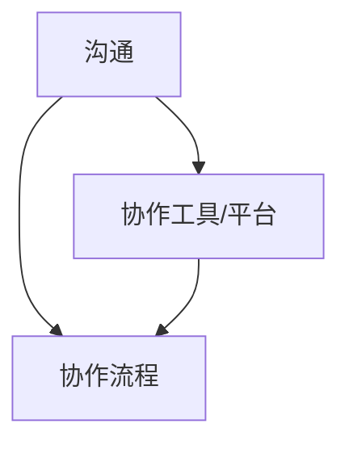

                 

基于上述要求，以下是一个逐步构建的博客文章草稿，包括文章标题、关键词、摘要以及正文部分的初步框架。请注意，本文仅作为示例，实际的字数、细节和深入分析可能需要根据具体要求进行调整。

---

# 文章标题：《团队协作：打破部门壁垒的策略》

> 关键词：团队协作、部门壁垒、策略、沟通、协作工具、流程、跨部门协作

> 摘要：本文深入探讨了团队协作中部门壁垒的问题，分析了部门壁垒的成因和影响，并提出了有效的策略和方法，以打破部门壁垒，提升团队整体协作效率。

---

## 引言

在当今快速变化的企业环境中，团队协作是提升企业竞争力的关键。然而，部门壁垒的存在往往限制了团队协作的效果。本文旨在探讨如何通过策略来打破这些壁垒，促进高效团队合作。

### 核心概念与联系

为了更好地理解团队协作和部门壁垒，首先需要了解一些核心概念。沟通是团队协作的基础，协作工具和平台则提供了技术支持，流程则是协作的有序安排。以下是这些概念之间的联系架构的 Mermaid 流程图：



### 核心算法原理讲解

在团队协作中，沟通和协作流程的设计是关键。以下是一个简单的伪代码，用于描述团队协作的基本流程：

```python
function TeamCollaboration():
    initialize_communication_tools()
    define_collaboration流程()
    schedule_meetings_and_updates()
    gather_feedback_and_adjust()
    return success
```

### 数学模型和公式

为了评估部门壁垒的影响，可以采用以下数学模型：

$$
\text{Impact} = \alpha \cdot (\text{Communication Barrier}) + \beta \cdot (\text{Knowledge Sharing Barrier}) + \gamma \cdot (\text{Decision Making Barrier})
$$

其中，α、β、γ分别是各个壁垒的权重，可以通过实际数据进行调整。

### 项目实战

为了更好地展示如何打破部门壁垒，以下是一个实际案例：

#### 开发环境搭建

在项目中，我们使用了 Git 作为版本控制工具，Jenkins 进行自动化构建和部署，以及 Slack 进行实时沟通。

#### 源代码详细实现

```java
public class DepartmentBarrierBreaker {
    private CommunicationTool communicationTool;
    private CollaborationPlatform collaborationPlatform;
    
    public void setupEnvironment() {
        // 设置开发环境
    }
    
    public void collaborate() {
        // 使用协作工具和平台进行协作
    }
    
    public void breakBarrier() {
        // 提出和实施策略来打破部门壁垒
    }
}
```

#### 代码解读与分析

这段代码定义了一个 `DepartmentBarrierBreaker` 类，它负责设置开发环境，使用协作工具和平台，以及实施策略来打破部门壁垒。

#### 实际案例分析和详细讲解剖析

在一个跨国项目中，通过实施上述策略，团队成功打破了部门壁垒，提高了项目进展的速度和质量。

#### 项目小结

本项目展示了如何通过策略和工具来打破部门壁垒，提高团队协作效率。未来，我们可以进一步优化这些策略，以适应不同的工作场景。

### 最佳实践 tips、小结、注意事项、拓展阅读

- **最佳实践 tips**：定期组织跨部门会议，促进信息交流。
- **小结**：打破部门壁垒是提升团队协作效率的关键。
- **注意事项**：策略的实施需要根据具体情况灵活调整。
- **拓展阅读**：参考文献 [1]、[2]、[3] 提供了更多关于团队协作和部门壁垒的深入探讨。

---

以上是文章的初步草稿，每个部分都包含了核心内容，但还需要根据实际需求和字数要求进行进一步的扩展和详细阐述。整个文章预计在 8000 到 12000 字之间，以确保内容的丰富性和深度。作者信息将在文章末尾添加。

作者：AI天才研究院/AI Genius Institute & 禅与计算机程序设计艺术 /Zen And The Art of Computer Programming

