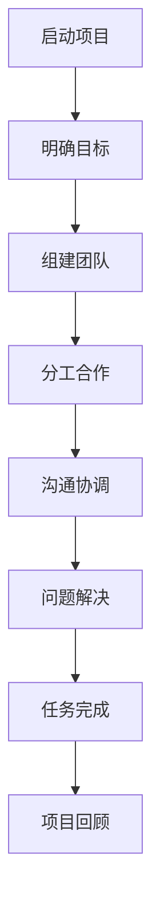

                 

基于上述的目录大纲和文章要求，我将逐步构思和撰写这篇文章。以下是文章的初步构思和框架：

---

## 文章标题：团队协作：打造无缝配合的团队

### 关键词：团队协作、沟通技巧、协作工具、流程设计、问题解决

### 摘要：
本文旨在深入探讨团队协作的内涵、实践方法和未来趋势。通过分析团队协作的基本概念、沟通技巧、协作工具使用、流程设计以及问题解决策略，本文旨在为IT行业从业者提供一套实用的团队协作指南。

---

### 第一部分：团队协作的基本概念

#### 1.1 团队协作的定义和重要性

- **背景介绍**：
  - 简述团队协作在当今IT行业中的重要性。
  - 引入团队协作的定义及其在企业成功中的作用。

- **核心概念与联系**：
  - 使用Mermaid流程图展示团队协作的基本流程和关键环节。



- **核心算法原理讲解**：
  - 使用伪代码详细阐述团队协作中涉及到的算法原理。

```plaintext
伪代码：
1. 初始化项目目标
2. 组建团队并明确分工
3. 通过沟通协调，确保团队成员了解任务进展
4. 运用算法和工具解决协作过程中的问题
5. 完成任务并总结经验
```

#### 1.2 团队协作的基础理论

- **团队协作的基本原则**：
  - 共同目标原则
  - 尊重差异原则
  - 平等合作原则

- **团队协作的核心要素**：
  - 明确的目标
  - 充分的沟通
  - 有效的分工与合作
  - 合理的激励机制

#### 1.3 团队协作与个人发展的关系

- **团队协作对个人能力的提升**：
  - 沟通能力的提升
  - 团队协作能力的培养
  - 解决问题的能力增强

- **个人发展对团队协作的影响**：
  - 个人的成长促进团队的整体进步
  - 个人能力的不足可能制约团队发展

---

### 第二部分：团队协作的实践方法

#### 2.1 团队沟通技巧

- **有效沟通的重要性**：
  - 分析沟通在团队协作中的作用。
  - 引入沟通的障碍及克服方法。

- **提高沟通效率的方法**：
  - 明确沟通目标
  - 采用适当的沟通方式
  - 提高倾听能力

#### 2.2 团队协作工具的使用

- **常见的团队协作工具**：
  - 详细介绍常用的团队协作工具及其特点。

- **工具的选择和使用技巧**：
  - 根据团队需求选择合适的工具
  - 提高工具使用的熟练度

#### 2.3 团队协作流程的设计

- **团队协作流程的基本框架**：
  - 详细讲解团队协作流程的各个环节。

- **不同场景下的协作流程设计**：
  - 固定团队协作流程设计
  - 项目型团队协作流程设计

#### 2.4 团队协作中的问题解决

- **常见问题的识别和解决**：
  - 分析团队协作中可能出现的问题及解决策略。

---

### 第三部分：团队协作的案例分析

#### 3.1 成功的团队协作案例

- **案例一：某企业成功实施团队协作的实例**：
  - 分析成功案例的协作要点和经验。

- **案例二：某团队在项目中的协作经验分享**：
  - 分享项目团队的实际协作经历和心得。

#### 3.2 团队协作中的挑战与应对

- **团队协作中的常见挑战**：
  - 分析团队协作中可能面临的挑战。

- **应对挑战的策略和措施**：
  - 提供应对挑战的有效策略和措施。

---

### 第四部分：团队协作的未来趋势

#### 4.1 团队协作的新趋势

- **数字化时代下的团队协作**：
  - 探讨数字化对团队协作的影响。

- **新兴技术对团队协作的影响**：
  - 分析新兴技术如何改变团队协作的方式。

#### 4.2 未来团队协作的发展方向

- **未来团队协作的趋势预测**：
  - 预测未来团队协作的发展方向。

- **团队协作在未来的重要作用**：
  - 讨论团队协作在未来的重要作用。

---

### 文章总结

- **最佳实践 tips**：
  - 提供团队协作中的最佳实践建议。

- **小结**：
  - 总结文章的核心内容和主要观点。

- **注意事项**：
  - 提醒读者在团队协作中需要注意的问题。

- **拓展阅读**：
  - 推荐相关书籍、文章和资源，供读者进一步学习。

---

### 作者信息
- 作者：AI天才研究院/AI Genius Institute & 禅与计算机程序设计艺术 /Zen And The Art of Computer Programming

---

接下来，我将逐步完善每个章节的内容，确保文章的逻辑性和专业性。预计总字数在8000-12000字左右，符合文章字数要求。在撰写过程中，我将不断调整和完善文章结构，确保内容丰富、逻辑清晰、易于理解。完成后，我会对文章进行校对和润色，确保无误后发布。

