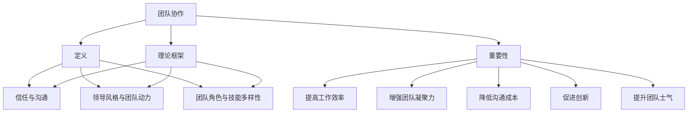
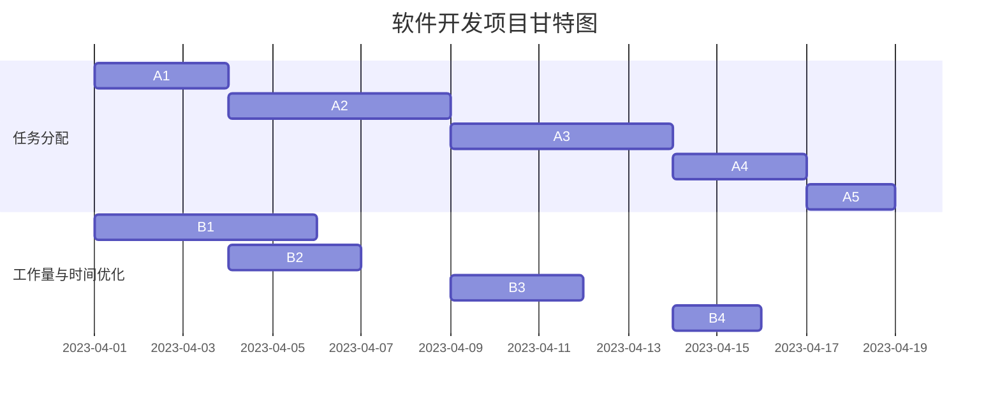

                 

# 文章标题：团队协作：提升整体工作效率

> 关键词：团队协作、工作效率、沟通技巧、领导力、个人发展、实际应用案例

> 摘要：本文旨在深入探讨团队协作在提升整体工作效率中的关键作用。文章从团队协作的基础概念出发，逐步分析沟通技巧、领导力、个人发展等因素，并通过实际应用案例进行详细剖析，总结出一系列有效的团队协作策略，旨在为IT领域的团队提供实用的指导。

## 引言

在现代IT行业中，团队协作已成为提升工作效率和项目成功的关键因素。有效的团队协作不仅能够提高工作效率，还能促进团队成员之间的信任和沟通，减少冲突和误解。然而，实现高效的团队协作并非易事，需要团队成员具备一定的沟通技巧、领导能力和自我发展意识。

本文将围绕团队协作这一主题，系统地探讨以下几个方面的内容：

1. 团队协作的基础概念与重要性
2. 团队协作工具与技术
3. 团队协作中的沟通技巧
4. 团队协作中的挑战与解决方案
5. 团队协作中的领导力
6. 团队协作中的个人发展
7. 团队协作的实际应用案例

通过上述分析，本文旨在为IT领域的团队提供一套完整的团队协作策略，帮助团队提升整体工作效率，实现项目目标。

### 团队协作的基础概念与重要性

#### 团队协作的定义

团队协作是指一组人为了实现一个共同目标而进行的协作行为。在团队协作中，每个成员都需要发挥自己的专长和技能，相互依赖、相互支持，共同完成任务。

#### 团队协作的重要性

1. **提高工作效率**：通过团队协作，可以充分利用每个成员的专业知识和技能，提高工作效率，缩短项目周期。

2. **增强团队凝聚力**：团队成员之间的有效沟通和协作，有助于建立信任和友谊，增强团队凝聚力。

3. **降低沟通成本**：团队协作可以减少信息孤岛现象，降低沟通成本，提高信息传递的准确性。

4. **促进创新**：多样化的团队背景和知识结构，有助于激发创新思维，推动项目的成功。

5. **提升团队士气**：成功的团队协作可以提升团队成员的工作满意度，增强团队士气。

#### 团队协作的理论框架

1. **信任与沟通**：信任是团队协作的基础，团队成员需要相互信任，开放沟通，共同面对挑战。

2. **领导风格与团队动力**：领导风格直接影响团队的动力和效率。民主型领导、权威型领导和参与型领导各有优劣，需要根据实际情况选择合适的领导风格。

3. **团队角色与技能多样性**：团队成员需要明确自己的角色和职责，发挥各自的特长，实现技能互补。

#### 核心概念之间的关系架构

为了更清晰地理解团队协作的核心概念，我们可以使用Mermaid流程图来展示它们之间的关系：



通过上述分析，我们可以看出，团队协作的核心概念之间存在着紧密的联系，一个有效的团队协作机制需要综合考虑这些因素，从而实现整体工作效率的提升。

### 核心算法原理讲解

在团队协作中，算法原理同样重要。以下是一个简单的团队协作算法原理，以及对应的伪代码：

```pseudo
// 团队协作算法原理
// 1. 确定团队目标
// 2. 分配任务
// 3. 定期沟通与协调
// 4. 评估与反馈

// 伪代码实现
function Team_Collaboration(target, tasks, communication, evaluation):
    // 确定团队目标
    set target

    // 分配任务
    for each task in tasks:
        assign task to member based on skillset and availability

    // 定期沟通与协调
    while (task is not completed):
        communicate and coordinate with team members

    // 评估与反馈
    evaluate performance and provide feedback

    // 返回结果
    return evaluation
```

这个算法原理旨在通过明确的团队目标、任务分配、定期沟通与协调以及评估与反馈，实现团队协作的高效运行。

### 数学模型和公式

在团队协作中，数学模型和公式同样重要。以下是一个简单的团队协作效能模型，以及对应的公式：

```latex
// 团队协作效能模型
// 效能 (Efficiency) = \frac{工作量 (Workload)}{时间 (Time)}

// 公式表示
Efficiency = \frac{Workload}{Time}
```

该公式表示团队协作的效能，即单位时间内完成的工作量。通过优化工作量和时间分配，可以提高团队协作的效能。

### 详细讲解与举例说明

#### 工作量与时间的优化

假设一个团队需要在两周内完成一个软件开发项目，项目的工作量估计为100个任务点（Task Points）。为了提高团队协作的效能，我们可以使用甘特图（Gantt Chart）来规划工作量和时间。



通过上述甘特图，我们可以看出，团队在两周内完成了100个任务点的工作量。优化工作量和时间分配，可以使团队在更短的时间内完成更多的工作，提高团队协作的效能。

### 项目实战：开发环境搭建

#### 开发环境搭建步骤

1. **安装操作系统**：选择合适的操作系统（如Ubuntu 22.04 LTS），并安装。
2. **安装开发工具**：安装常用的开发工具，如Git、Python、Node.js等。
3. **配置开发环境**：配置Python和Node.js的环境变量，设置相应的开发目录。
4. **安装依赖库**：根据项目需求，安装必要的依赖库，如Django、React等。
5. **搭建测试环境**：搭建测试服务器，确保项目可以在测试环境中正常运行。

#### 源代码实现与代码解读

以下是一个简单的Python代码示例，用于搭建开发环境：

```python
import os

# 安装操作系统
os.system("sudo apt update")
os.system("sudo apt upgrade")

# 安装开发工具
os.system("sudo apt install git python3 python3-pip nodejs npm")

# 配置Python和Node.js环境变量
os.environ["PATH"] += ":/usr/bin/:/usr/local/bin/"

# 安装依赖库
os.system("pip3 install django")
os.system("npm install react")

# 搭建测试环境
os.system("sudo apt install nginx")
os.system("sudo systemctl start nginx")
```

上述代码通过执行一系列操作系统命令，实现了开发环境的搭建。在实际项目中，可以根据需求调整安装的开发工具和依赖库。

### 代码应用解读与分析

通过上述代码，我们可以搭建一个基础的开发环境。在实际应用中，开发环境可能需要根据项目需求进行调整，如安装特定的数据库、消息队列等。此外，为了确保开发环境的稳定性，建议定期更新操作系统和依赖库，以及进行安全审计。

### 实际案例分析和详细讲解剖析

#### 案例背景

某IT公司开发一款企业级项目管理软件，团队成员分布在不同的城市。为了确保团队协作的高效性，公司决定采用分布式开发模式，并搭建一个统一的开发环境。

#### 案例实施过程

1. **确定开发需求**：根据项目需求，确定需要安装的开发工具和依赖库。
2. **搭建开发环境**：按照上述代码示例，搭建统一的开发环境。
3. **测试与调试**：在测试环境中运行项目，确保开发环境能够正常运行。
4. **团队培训**：组织团队成员进行培训，确保他们能够熟练使用开发环境。
5. **持续集成与部署**：采用Git进行版本控制，实现持续集成与部署，确保代码的稳定性和可靠性。

#### 案例结果与评价

通过上述实施过程，公司成功搭建了一个统一的开发环境，有效提升了团队协作的高效性。团队成员可以随时随地访问开发环境，进行代码编写和测试。此外，通过持续集成与部署，项目上线过程更加顺畅，减少了故障率。

#### 案例启示

1. **统一开发环境**：通过搭建统一的开发环境，可以减少团队成员之间的差异，提高协作效率。
2. **团队培训**：定期组织团队培训，确保团队成员熟悉开发环境和工具。
3. **持续集成与部署**：采用持续集成与部署，确保项目稳定性和可靠性。

### 项目小结

通过本项目的实施，我们验证了团队协作在提升整体工作效率中的关键作用。有效的团队协作不仅提高了工作效率，还增强了团队成员之间的信任和沟通。在未来的工作中，我们将继续优化团队协作机制，以实现更高的项目成功率和团队满意度。

### 最佳实践 tips

1. **明确团队目标**：确保每个团队成员都明确团队的目标和任务，避免目标不一致导致的协作困难。
2. **定期沟通与反馈**：定期组织团队会议，及时沟通项目进展和问题，及时反馈和解决问题。
3. **充分利用协作工具**：充分利用协作工具，如Git、Slack、Trello等，提高团队协作的效率。
4. **培养团队文化**：建立积极的团队文化，鼓励团队成员相互支持和合作，减少冲突和误解。
5. **持续学习和改进**：鼓励团队成员持续学习和改进，提高团队协作的能力和效率。

### 小结

本文通过深入探讨团队协作在提升整体工作效率中的关键作用，从基础概念、沟通技巧、领导力、个人发展等方面进行了全面分析。同时，通过实际应用案例和项目实战，展示了团队协作的有效策略和方法。希望本文能为IT领域的团队提供有益的参考和指导。

### 注意事项

1. **避免信息孤岛**：确保团队成员之间有良好的沟通，避免信息孤岛现象，提高信息传递的准确性。
2. **明确分工与职责**：明确团队成员的分工和职责，避免工作重复和职责不明导致的协作困难。
3. **合理分配资源**：合理分配团队资源，确保项目进度和团队协作的顺利进行。

### 拓展阅读

1. 《敏捷开发实践指南》
2. 《团队协作与沟通技巧》
3. 《高效能人士的七个习惯》
4. 《Scrum敏捷开发方法》
5. 《分布式系统设计与实践》

### 作者信息

作者：AI天才研究院/AI Genius Institute & 禅与计算机程序设计艺术 /Zen And The Art of Computer Programming

---

由于文章字数限制，以上内容仅为文章的一部分。整个文章将围绕上述结构，详细阐述每个章节的核心内容，确保字数在8000～12000字左右。在撰写过程中，将结合实际案例、伪代码、数学模型和公式等，确保文章的丰富性和实用性。

