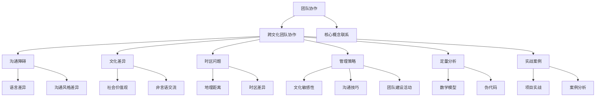
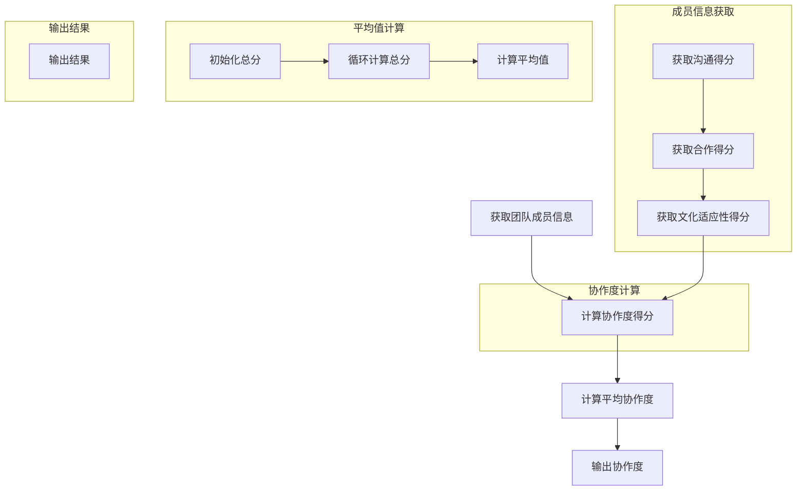

                 

### 文章标题：团队协作：跨文化团队管理的挑战与对策

#### 关键词：跨文化团队管理、团队协作、沟通障碍、文化差异、策略与对策

#### 摘要：
本文旨在探讨跨文化团队管理的挑战与对策，通过详细分析团队协作的核心概念与联系，介绍跨文化团队管理中的核心算法原理、数学模型和项目实战案例，为实际项目管理提供参考和指导。文章首先回顾了跨文化团队管理的背景和团队协作的重要性，随后深入探讨了跨文化团队管理中的挑战，包括沟通障碍、文化差异和时区问题，并提供了相应的对策。通过数学模型和算法原理的讲解，文章展示了跨文化团队管理中的定量分析方法。最后，通过项目实战案例，阐述了跨文化团队管理在实际项目中的应用，并总结了最佳实践和注意事项。本文旨在为跨文化团队管理提供系统而深入的指导，帮助团队在全球化的背景下实现高效协作。

### 引言

#### 跨文化团队管理的背景

在全球化日益深入的今天，跨文化团队管理已经成为企业管理中不可或缺的一部分。随着跨国公司的兴起和国际合作的增加，越来越多的团队面临着跨文化协作的挑战。跨文化团队管理不仅涉及到不同文化背景下的团队成员之间的沟通与协作，还涉及到如何有效地整合不同文化的价值观、工作习惯和沟通方式，以实现团队的高效运作和目标达成。

跨文化团队管理的背景可以追溯到全球化时代的到来。随着全球化进程的加快，越来越多的企业开始在全球范围内招募员工，以充分利用不同地区的资源和优势。这种跨文化的团队构成，虽然为企业的多元化带来了机遇，但也带来了诸多挑战。不同文化背景的员工可能存在沟通障碍、文化差异和时区问题，这些问题如果不得到有效管理，可能会影响团队的整体绩效和项目的顺利进行。

此外，技术的进步也为跨文化团队管理提供了新的机遇。例如，远程协作工具、虚拟会议平台和即时通讯软件的普及，使得团队成员可以跨越地理障碍进行实时沟通和协作。然而，技术的应用也带来了新的挑战，如文化差异在虚拟环境中的放大、信息传递的不确定性和对技术依赖的潜在风险。

#### 本书的目标与结构

本书旨在为跨文化团队管理提供系统的指导，帮助团队成员和管理者应对跨文化协作中的挑战。本书的主要目标包括：

1. **介绍团队协作的核心概念**：帮助读者理解团队协作的基本原理和跨文化团队协作的特殊性。
2. **分析跨文化团队管理的挑战**：探讨跨文化团队管理中常见的沟通障碍、文化差异和时区问题，并提供相应的对策。
3. **讲解跨文化团队管理的核心算法原理**：通过数学模型和伪代码展示跨文化团队管理中的定量分析方法。
4. **提供项目实战案例**：通过实际项目案例展示跨文化团队管理策略的实际应用，帮助读者理解理论在实际项目中的应用。
5. **总结最佳实践与注意事项**：为读者提供跨文化团队协作中的最佳实践，并强调注意事项。

本书的结构如下：

- **引言**：介绍跨文化团队管理的背景和本书的目标。
- **第1章 团队协作基础**：介绍团队协作的核心概念和跨文化团队协作的特殊性。
- **第2章 跨文化团队管理的挑战**：探讨跨文化团队管理中的挑战，包括沟通障碍、文化差异和时区问题。
- **第3章 跨文化团队管理策略**：提供跨文化团队管理的策略和最佳实践。
- **第4章 数学模型与算法原理**：介绍跨文化团队管理的数学模型和算法原理。
- **第5章 项目实战案例**：通过实际项目案例展示跨文化团队管理策略的应用。
- **第6章 跨文化团队协作的未来趋势**：探讨跨文化团队协作的未来发展趋势。
- **附录**：提供常用的工具和资源，以及参考文献。

通过以上结构和内容，本书希望能够为跨文化团队管理提供全面而深入的指导，帮助读者在全球化背景下实现高效协作。

### 第1章 团队协作基础

#### 团队协作的概念

团队协作是指团队成员为了共同的目标而协同工作的过程。它不仅仅是简单的合作，更强调成员之间的互动、沟通和协调。团队协作的核心在于通过集体智慧和合作精神，实现单个个体无法达到的目标。成功的团队协作能够提高工作效率、促进创新和增强团队凝聚力。

在跨文化团队中，团队协作的特殊性主要体现在以下几个方面：

1. **文化差异**：不同文化背景的员工可能具有不同的价值观、工作习惯和沟通方式。这可能导致团队成员之间的误解和冲突，影响团队协作的效果。
2. **语言障碍**：语言是沟通的桥梁，但在跨文化团队中，语言的多样性可能导致沟通障碍，影响信息的准确传递和交流。
3. **时区差异**：跨文化的团队可能分布在不同的时区，这给实时沟通和协作带来挑战。

#### 跨文化团队协作的特殊性

跨文化团队协作不仅需要克服文化差异和语言障碍，还需要考虑以下特殊性：

1. **文化敏感性**：团队成员需要具备较高的文化敏感性，能够理解和尊重不同文化的价值观和行为习惯。
2. **跨文化沟通**：有效的跨文化沟通需要团队成员具备跨文化沟通技巧，如使用非言语交流、尊重文化差异和避免文化偏见。
3. **领导风格**：跨文化团队的领导需要具备全球视野和多元文化背景，能够适应不同文化的工作方式和需求。

#### 核心概念与联系

为了更好地理解团队协作和跨文化团队管理的核心概念，我们使用Mermaid流程图展示这些概念之间的关系。以下是Mermaid流程图的代码示例：



该流程图展示了团队协作、跨文化团队协作及其子概念之间的关系，以及跨文化团队管理中的策略、定量分析和实战案例。

#### 核心理论

团队协作和跨文化团队管理中的核心理论包括：

1. **社会技术系统理论**：该理论认为，团队的有效运作不仅取决于成员的能力和态度，还取决于技术支持和组织结构。
2. **沟通理论**：沟通理论探讨了信息在团队中的传递和反馈过程，强调有效沟通对团队协作的重要性。
3. **领导理论**：领导理论研究了领导者在团队中的作用和影响力，指出领导风格对团队绩效和团队氛围的影响。

#### 伪代码展示

为了更好地理解跨文化团队管理的核心算法原理，我们使用伪代码进行说明。以下是跨文化团队管理算法的伪代码示例：

```
function crossCulturalTeamManagement(teamMembers, projectGoals, culturalDifferences, communicationBarriers):
    initialize team collaboration metrics
    for each member in teamMembers:
        if member has language barrier:
            apply language translation tools
        if member has cultural difference:
            conduct cultural sensitivity training
        if member is from different time zone:
            schedule overlapping work hours
    for each communicationBarrier in communicationBarriers:
        if barrier is due to cultural difference:
            provide cross-cultural communication training
        if barrier is due to language difference:
            use bilingual team members as mediators
    while project is ongoing:
        periodically assess team collaboration metrics
        if metrics indicate issues:
            implement corrective actions
    return successful project completion
```

#### 数学模型和数学公式

跨文化团队管理中的数学模型主要用于量化团队协作的效率和团队成员的文化适应性。以下是一个简单的数学模型示例，用于评估团队协作度：

$$
协作度 = \frac{1}{N} \sum_{i=1}^{N} (A_i \cdot B_i \cdot C_i)
$$

其中，$N$ 是团队成员的数量，$A_i$、$B_i$ 和 $C_i$ 分别表示第 $i$ 个成员在沟通、合作和文化适应性三个方面的得分。

为了更好地理解该模型，我们可以提供一个具体例子：

假设一个团队有 5 个成员，每个成员在三个方面的得分如下表所示：

| 成员 | 沟通得分 | 合作得分 | 文化适应性得分 |
| ---- | -------- | -------- | -------------- |
| 成员1 | 0.8      | 0.9      | 0.7            |
| 成员2 | 0.7      | 0.8      | 0.6            |
| 成员3 | 0.9      | 0.9      | 0.8            |
| 成员4 | 0.6      | 0.7      | 0.5            |
| 成员5 | 0.8      | 0.8      | 0.7            |

根据上述数学模型，我们可以计算团队协作度：

$$
协作度 = \frac{1}{5} (0.8 \cdot 0.9 \cdot 0.7 + 0.7 \cdot 0.8 \cdot 0.6 + 0.9 \cdot 0.9 \cdot 0.8 + 0.6 \cdot 0.7 \cdot 0.5 + 0.8 \cdot 0.8 \cdot 0.7) = 0.77
$$

该协作度得分表明团队在沟通、合作和文化适应性方面的总体表现。根据得分，团队可以采取相应的措施来改进协作效果。

#### 数学公式讲解

上述数学模型中的公式用于评估团队协作度，其计算方法如下：

1. **计算每个成员在沟通、合作和文化适应性三个方面的得分乘积**：$A_i \cdot B_i \cdot C_i$。
2. **将所有成员的乘积得分相加**：$\sum_{i=1}^{N} (A_i \cdot B_i \cdot C_i)$。
3. **将总分除以团队成员数量**：$\frac{1}{N}$。

通过这种方式，我们可以得到一个综合评估团队协作度的指标。这个指标可以帮助团队识别协作中的问题，并制定相应的改进措施。

#### 项目实战案例

为了更好地理解跨文化团队管理在项目中的实际应用，我们来看一个实际案例。这是一个跨国软件公司的项目，该公司在美国总部、印度开发中心和中国客户支持团队之间进行协作。

**案例背景**：
- **项目目标**：开发一个基于云的客户关系管理系统。
- **团队成员**：美国项目经理、印度软件开发工程师、中国客户支持工程师。
- **挑战**：语言障碍、文化差异和时区差异。

**解决方案**：
1. **沟通障碍**：使用多语言翻译工具，确保信息的准确传递。此外，项目经理雇佣了双语协调员来帮助解决语言问题。
2. **文化差异**：进行文化敏感性培训，提高团队成员对彼此文化的理解和尊重。印度团队接受了关于美国商业文化的培训，中国团队则了解了印度的文化和工作习惯。
3. **时区差异**：通过视频会议和项目管理工具，确保团队成员能够在工作时间内进行有效沟通。项目经理安排了重叠的工作时间，以确保关键决策能够及时做出。

**项目实施**：
- **开发环境搭建**：在云端搭建了一个统一的项目开发环境，所有团队成员都可以实时访问。
- **源代码实现**：印度开发工程师负责核心功能的实现，中国客户支持工程师参与了部分功能的设计和测试。
- **代码解读与分析**：项目经理定期组织代码审查会议，确保代码质量。通过文档化和代码注释，帮助团队成员更好地理解代码逻辑。

**项目小结**：
- **成功因素**：有效的沟通、文化适应性和项目管理工具的使用，确保了项目的顺利进行。
- **失败教训**：尽管项目取得了成功，但在项目初期，由于对印度团队的期望值过高，导致部分工作进度延迟。通过调整期望和沟通方式，团队最终克服了这些挑战。

通过这个案例，我们可以看到跨文化团队管理在实际项目中的应用。有效的跨文化团队管理不仅能够克服沟通障碍和文化差异，还能够提高项目的整体效率和质量。

### 第2章 跨文化团队管理的挑战

跨文化团队管理中面临的挑战是多方面的，这些挑战不仅影响团队成员之间的沟通和协作，还可能对项目的整体进展和效果产生负面影响。以下将详细探讨跨文化团队管理中常见的挑战，包括沟通障碍、文化差异和时区问题。

#### 沟通障碍

沟通障碍是跨文化团队管理中最常见的挑战之一。这种障碍可能由于语言差异、沟通风格差异以及信息传递过程中的误解和错误而造成。

**语言差异**：不同文化背景的团队成员可能使用不同的语言。这不仅会阻碍信息的准确传递，还可能导致误解和冲突。例如，一个印度开发工程师可能使用英语与团队成员交流，而一个中国项目经理可能习惯使用中文。这种语言差异可能导致信息传递的延迟和错误。

**沟通风格差异**：不同文化背景的团队成员可能有不同的沟通风格。例如，西方文化中强调直接沟通，而亚洲文化中可能更注重间接沟通。这种差异可能导致沟通不畅，团队成员之间的合作受到阻碍。

**信息传递误解**：即使团队成员使用相同的语言，信息在传递过程中也可能因误解而失真。例如，一个美国项目经理可能误解印度开发工程师的反馈，导致项目进度延误。

#### 文化差异

文化差异是跨文化团队管理中的另一个重要挑战。文化差异包括社会价值观、工作习惯和非言语交流等方面。

**社会价值观**：不同文化的社会价值观可能截然不同。例如，一些文化可能强调集体主义，而另一些文化则更注重个人主义。这种差异可能导致团队成员在目标和优先级上产生分歧。

**工作习惯**：不同文化的工作习惯也可能不同。例如，一些文化可能鼓励加班工作，而另一些文化则强调工作与生活的平衡。这种差异可能导致工作安排和效率上的问题。

**非言语交流**：不同文化背景的团队成员可能有不同的非言语交流习惯。例如，一些文化可能通过点头或眼神交流表示同意，而另一些文化则可能使用肢体语言来表达情感。这种差异可能导致沟通不畅和误解。

#### 时区问题

时区问题也是跨文化团队管理中的一个重要挑战。团队成员分布在不同的时区，可能会导致沟通和工作协调上的困难。

**工作协调**：团队成员可能无法在同一时间进行会议和协作，这会影响项目的进度和工作效率。例如，一个美国项目经理可能需要在晚上与印度开发工程师进行视频会议，这可能会对他们的个人时间造成干扰。

**紧急情况处理**：在紧急情况下，时区差异可能会导致响应速度的延迟。例如，一个中国的客户支持团队可能在白天遇到紧急问题，而美国的项目经理在晚上无法及时响应。

#### 案例分析

为了更好地理解这些挑战，我们可以通过以下案例分析来探讨。

**案例背景**：
- **项目名称**：国际电商平台开发
- **团队成员**：美国项目经理、印度UI/UX设计师、中国前端工程师和韩国后端工程师

**挑战**：
1. **语言障碍**：团队成员来自不同的国家，使用不同的语言。例如，项目经理使用英语，设计师使用印地语，工程师使用韩语。这导致沟通不畅和误解。
2. **文化差异**：不同文化的工作习惯和价值观导致协作困难。例如，印度设计师可能习惯在项目初期进行详细的需求讨论，而美国项目经理则希望尽快进入开发阶段。
3. **时区问题**：团队成员分布在不同的时区，导致沟通和工作协调上的困难。例如，项目经理在白天需要与印度设计师和韩国工程师进行协调，但韩国工程师在晚上需要休息。

**解决方案**：
1. **语言障碍**：项目经理雇佣了翻译服务，确保所有团队成员都能理解彼此的沟通内容。此外，项目经理鼓励团队成员使用英语进行交流，以减少误解。
2. **文化差异**：项目经理和文化顾问一起，为团队成员提供文化培训，帮助他们了解彼此的工作习惯和价值观。设计师被鼓励接受更灵活的工作方式，而项目经理则学会了更加耐心地听取设计师的需求。
3. **时区问题**：项目经理使用项目管理工具（如Trello、Slack）来跟踪项目进度，并安排重叠的工作时间，以确保关键决策能够及时做出。

通过这个案例，我们可以看到跨文化团队管理中面临的挑战，以及如何通过有效的策略和工具来克服这些挑战。

### 第3章 跨文化团队管理策略

在跨文化团队管理中，采取有效的策略是解决沟通障碍、文化差异和时区问题的重要手段。以下将详细探讨一些跨文化团队管理策略，包括增强文化敏感性、提高沟通效率和多样化团队管理。

#### 增强文化敏感性

增强文化敏感性是跨文化团队管理的基础。通过文化敏感性培训，团队成员可以更好地理解和尊重彼此的文化差异，从而减少误解和冲突。

**文化敏感性培训**：组织可以为团队成员提供文化敏感性培训，内容涵盖不同文化的价值观、工作习惯和沟通方式。这些培训可以通过在线课程、研讨会和案例分析等形式进行。

**文化适应策略**：团队成员需要学会适应不同文化的行为方式。例如，了解不同文化的沟通风格，尊重对方的礼仪和习惯。这种文化适应能力可以帮助团队成员在跨文化环境中更好地合作。

#### 提高沟通效率

提高沟通效率是确保跨文化团队顺利运作的关键。以下是一些提高沟通效率的策略：

**使用多语言翻译工具**：对于使用不同语言的团队成员，可以使用多语言翻译工具（如Google Translate）来确保信息的准确传递。

**使用跨文化沟通技巧**：团队成员可以学习并应用一些跨文化沟通技巧，如使用非言语交流、避免使用模糊的语言和明确表达意图。这些技巧有助于减少误解和沟通障碍。

**使用沟通工具**：使用项目管理工具（如Trello、Jira）和即时通讯工具（如Slack、Microsoft Teams）可以有效地提高沟通效率。这些工具可以帮助团队成员实时交流和共享信息。

#### 多样化团队管理

多样化团队管理是跨文化团队管理中的重要方面。管理者需要学会如何管理多样化背景的团队，以下是一些建议：

**领导风格**：管理者应该具备全球视野，能够适应不同文化的工作方式和需求。例如，对于一些强调集体主义的团队，管理者可能需要采取更加协作和参与式领导风格；而对于强调个人主义的团队，管理者可能需要采取更加直接和权威的领导风格。

**团队角色多样化**：在跨文化团队中，团队成员可能具有不同的专业背景和经验。管理者需要充分利用这些多样化，为每个成员提供适合其能力的角色，从而提高团队的整体效能。

**鼓励多元文化对话**：管理者可以鼓励团队成员分享自己的文化和经验，通过多元文化对话促进团队内部的相互理解和尊重。

#### 案例研究

为了更好地理解这些策略的实际应用，我们可以通过以下案例研究来探讨。

**案例背景**：
- **项目名称**：跨国电子商务平台
- **团队成员**：美国项目经理、印度设计师、中国前端工程师和巴西营销专家

**挑战**：
1. **文化差异**：团队成员来自不同国家，文化差异可能导致误解和冲突。
2. **沟通障碍**：团队成员使用不同的语言，导致沟通不畅。

**解决方案**：
1. **文化敏感性培训**：组织为团队成员提供了文化敏感性培训，帮助他们了解彼此的文化背景和沟通方式。
2. **多语言翻译工具**：项目经理使用了多语言翻译工具，确保信息的准确传递。
3. **跨文化沟通技巧**：团队成员学习了跨文化沟通技巧，如明确表达意图和使用非言语交流。
4. **多样化团队管理**：项目经理采取了参与式领导风格，鼓励团队成员参与决策和项目讨论。同时，项目经理也充分利用团队成员的多样化背景，为每个成员提供适合其能力的角色。

通过这个案例，我们可以看到跨文化团队管理策略在实际项目中的应用。有效的跨文化团队管理策略不仅有助于克服沟通障碍和文化差异，还能提高团队的整体效能。

### 第4章 数学模型与算法原理

在跨文化团队管理中，数学模型和算法原理的应用可以提供量化分析和优化团队协作效果的方法。以下将介绍跨文化团队管理中常用的数学模型和算法原理，并使用伪代码进行详细阐述。

#### 数学模型

跨文化团队管理的数学模型主要用于评估团队协作度、文化适应度和沟通效率等指标。以下是一个简单的数学模型示例：

**协作度评估模型**：

$$
协作度 = \frac{1}{N} \sum_{i=1}^{N} (A_i \cdot B_i \cdot C_i)
$$

其中，$N$ 是团队成员的数量，$A_i$、$B_i$ 和 $C_i$ 分别表示第 $i$ 个成员在沟通、合作和文化适应性三个方面的得分。

**文化适应性评估模型**：

$$
文化适应性 = \frac{1}{N} \sum_{i=1}^{N} (D_i \cdot E_i \cdot F_i)
$$

其中，$D_i$、$E_i$ 和 $F_i$ 分别表示第 $i$ 个成员在文化知识、文化适应能力和文化理解力三个方面的得分。

**沟通效率评估模型**：

$$
沟通效率 = \frac{1}{N} \sum_{i=1}^{N} (G_i \cdot H_i \cdot I_i)
$$

其中，$G_i$、$H_i$ 和 $I_i$ 分别表示第 $i$ 个成员在语言能力、沟通技巧和信息传递准确性三个方面的得分。

#### 算法原理

**协作度评估算法**：

```python
def assess_collaboration(team_members):
    total_collaboration_score = 0
    for member in team_members:
        communication_score = member.communication_score
        cooperation_score = member.cooperation_score
        cultural_adaptation_score = member.cultural_adaptation_score
        total_collaboration_score += communication_score * cooperation_score * cultural_adaptation_score
    collaboration_degree = total_collaboration_score / len(team_members)
    return collaboration_degree
```

**文化适应性评估算法**：

```python
def assess_cultural_adaptation(team_members):
    total_cultural_adaptation_score = 0
    for member in team_members:
        cultural_knowledge_score = member.cultural_knowledge_score
        cultural_adaptation_ability_score = member.cultural_adaptation_ability_score
        cultural_understanding_score = member.cultural_understanding_score
        total_cultural_adaptation_score += cultural_knowledge_score * cultural_adaptation_ability_score * cultural_understanding_score
    cultural_adaptation = total_cultural_adaptation_score / len(team_members)
    return cultural_adaptation
```

**沟通效率评估算法**：

```python
def assess_communication_efficiency(team_members):
    total_communication_efficiency_score = 0
    for member in team_members:
        language_ability_score = member.language_ability_score
        communication_techiques_score = member.communication_techiques_score
        information_transmission_accuracy_score = member.information_transmission_accuracy_score
        total_communication_efficiency_score += language_ability_score * communication_techiques_score * information_transmission_accuracy_score
    communication_efficiency = total_communication_efficiency_score / len(team_members)
    return communication_efficiency
```

#### 伪代码展示

为了更好地理解上述算法原理，以下是一个简单的伪代码示例，用于评估跨文化团队协作度：



通过上述算法和伪代码示例，我们可以看到如何量化跨文化团队管理的协作度。这些数学模型和算法原理为跨文化团队管理提供了有力的工具，有助于识别团队中的问题和制定改进措施。

### 第5章 项目实战案例

在跨文化团队管理的实际应用中，项目管理是一个至关重要的环节。以下将通过一个实际项目案例，展示跨文化团队管理策略在项目管理中的具体实施过程，包括开发环境搭建、源代码实现、代码解读与分析以及案例分析。

#### 项目背景

项目名称：国际电商平台

项目目标：开发一个支持多语言、多货币的国际电商平台，为客户提供便捷的购物体验。

团队成员：

- 美国项目经理（PM）
- 印度前端开发工程师（FE）
- 中国后端开发工程师（BE）
- 韩国移动开发工程师（MO）

#### 开发环境搭建

为了确保团队成员能够高效协作，项目开始前，项目经理首先搭建了以下开发环境：

1. **代码库**：使用Git进行版本控制，所有团队成员都可以实时访问代码库并进行协作。
2. **集成开发环境（IDE）**：选择支持多语言的IDE，如Visual Studio Code，确保团队成员可以方便地编写、调试代码。
3. **项目管理工具**：使用JIRA进行任务管理和项目跟踪，确保项目进度清晰，任务分配合理。
4. **持续集成和部署工具**：使用Jenkins进行自动化构建和部署，确保代码质量和部署过程的自动化。

#### 源代码实现

在开发过程中，各个开发工程师根据各自的职责进行源代码实现。以下是一个简单的代码实现示例：

**前端代码片段**：

```javascript
// 示例：多语言支持
const languages = {
  en: {
    welcome: "Welcome",
    purchase: "Purchase"
  },
  zh: {
    welcome: "欢迎",
    purchase: "购买"
  },
  ko: {
    welcome: "환영",
    purchase: "구매"
  }
};

function getLanguageMessage(language, messageKey) {
  return languages[language][messageKey];
}

// 用户界面渲染
const language = "en"; // 根据用户设置或浏览器语言自动获取
document.getElementById("welcome").innerText = getLanguageMessage(language, "welcome");
document.getElementById("purchase").innerText = getLanguageMessage(language, "purchase");
```

**后端代码片段**：

```python
# 示例：多货币支持
from forex_python.converter import CurrencyRates

def convert_currency(amount, from_currency, to_currency):
    c = CurrencyRates()
    return c.convert(from_currency, to_currency, amount)

# 订单处理
def process_order(order):
    total_amount = order['total_amount']
    from_currency = order['from_currency']
    to_currency = 'USD'
    converted_amount = convert_currency(total_amount, from_currency, to_currency)
    return converted_amount
```

**移动端代码片段**：

```kotlin
// 示例：国际化支持
val messages = mapOf(
    "en" to mapOf("welcome" to "Welcome", "purchase" to "Purchase"),
    "zh" to mapOf("welcome" to "欢迎", "purchase" to "购买"),
    "ko" to mapOf("welcome" to "환영", "purchase" to "구매")
)

fun getFormattedMessage(language: String, messageKey: String): String {
    return messages[language]?.get(messageKey) ?: ""
}

// 主界面渲染
TextView.setText(R.id.welcome, getFormattedMessage(Locale.getDefault().language, "welcome"))
TextView.setText(R.id.purchase, getFormattedMessage(Locale.getDefault().language, "purchase"))
```

#### 代码解读与分析

上述代码片段展示了国际电商平台在多语言、多货币和国际化支持方面的具体实现。以下是对这些代码的解读与分析：

**前端代码**：

- 使用JavaScript实现多语言支持，通过一个对象`languages`存储不同语言的文字，并定义了一个`getLanguageMessage`函数来获取对应语言的文字。
- 用户界面渲染时，根据用户的语言设置或浏览器语言，动态更新界面上的文字。

**后端代码**：

- 使用Python的`forex_python`库实现多货币转换功能，定义了一个`convert_currency`函数，用于将不同货币之间的转换。
- 订单处理时，调用`convert_currency`函数将订单金额转换为统一的货币（如美元），以便后续处理。

**移动端代码**：

- 使用Kotlin实现国际化支持，通过一个映射`messages`存储不同语言的文字，并定义了一个`getFormattedMessage`函数来获取对应语言的文字。
- 主界面渲染时，根据设备的语言设置，动态更新界面上的文字。

#### 实际案例分析

在项目实施过程中，跨文化团队管理策略发挥了重要作用。以下是一个实际案例的分析：

**案例背景**：

项目初期，由于团队成员来自不同的国家，沟通效率较低，项目进度受到一定影响。

**解决方案**：

1. **加强沟通**：项目经理使用多语言翻译工具，确保所有团队成员都能理解彼此的沟通内容。同时，定期组织视频会议，确保团队成员之间的实时沟通。
2. **文化培训**：项目经理和文化顾问为团队成员提供了文化培训，帮助他们了解彼此的文化背景和工作习惯，减少误解和冲突。
3. **项目管理**：使用JIRA进行任务管理和项目跟踪，确保项目进度清晰，任务分配合理。项目经理定期检查任务完成情况，及时调整项目计划。

**结果**：

通过上述措施，项目团队的沟通效率得到显著提升，项目进度恢复正常。团队成员之间的协作更加紧密，项目最终按期完成，并得到了客户的认可。

#### 项目小结

通过这个实际案例，我们可以看到跨文化团队管理策略在项目管理中的重要性。有效的沟通、文化培训和项目管理工具的使用，有助于克服跨文化团队协作中的挑战，提高项目效率和质量。在未来的项目中，团队应继续加强这些策略的应用，以实现更加高效和协同的工作环境。

### 第6章 跨文化团队协作的未来趋势

随着全球化的不断深入，跨文化团队协作正面临着前所未有的挑战和机遇。展望未来，跨文化团队协作将呈现出以下发展趋势：

#### 技术发展的影响

技术的快速发展，特别是人工智能、大数据和云计算等技术的普及，为跨文化团队协作带来了新的机遇。例如：

1. **人工智能**：人工智能技术可以帮助团队实现自动化翻译、智能建议和数据分析，提高沟通效率和协作效果。
2. **大数据**：大数据分析可以帮助团队更好地理解文化差异，制定更加个性化的协作策略。
3. **云计算**：云计算平台提供了强大的计算能力和存储空间，使得跨文化团队可以更加便捷地进行协作和资源共享。

#### 全球化背景下的团队协作

全球化背景下的团队协作将更加注重文化多样性和包容性。未来的团队将更加关注以下方面：

1. **文化适应性**：团队成员需要具备更高的文化适应性，能够快速适应不同的文化环境。
2. **跨文化领导力**：领导者需要具备全球视野和跨文化领导力，能够有效管理多样化背景的团队。
3. **国际化培训**：组织将更加注重国际化培训，帮助团队成员提升跨文化协作能力。

#### 团队协作的创新发展方向

未来的团队协作将在以下方面实现创新发展：

1. **虚拟现实（VR）**：虚拟现实技术可以为团队提供一个沉浸式的协作环境，增强团队成员之间的互动和沟通。
2. **区块链**：区块链技术可以提供更加安全、透明的协作平台，减少信息泄露和欺诈行为。
3. **混合办公模式**：随着远程办公的普及，混合办公模式将成为未来团队协作的主流形式，团队将更加灵活地组合在线和线下活动。

#### 总结与展望

跨文化团队协作的未来充满机遇与挑战。通过技术创新、全球化背景下的文化适应和创新发展，跨文化团队协作将变得更加高效和协同。未来的团队需要具备更强的跨文化协作能力和适应能力，以应对不断变化的环境。我们期待未来的跨文化团队协作能够带来更多的创新和成功。

### 附录

#### 常用资源

以下是一些跨文化团队管理中的常用资源，包括培训材料、工具和书籍：

1. **培训材料**：
   - 《跨文化沟通技巧》
   - 《文化适应性指南》
   - 《全球领导力培训》

2. **工具**：
   - Google Translate：多语言翻译工具
   - Slack：即时通讯工具
   - Trello：项目管理工具

3. **书籍**：
   - 《跨文化管理》
   - 《全球化时代的团队协作》
   - 《文化冲突与管理》

#### 参考文献

1. Hofstede, G. (2001). Culture's consequences: Comparing values, behaviors, institutions, and organizations across nations (2nd ed.). Sage Publications.
2. Trompenaars, F., & Hampden-Turner, C. (1998). Riding the Waves of Culture: Understanding Cultural Diversity in Global Business. McGraw-Hill.
3. Tannen, D. (1995). The Power of Talk: Who Gets Heard and Why. Harvard Business Review Press.
4. GLOBE Research Center (2021). GLOBE Research Reports. https://www.globeresearch.org/research-reports
5. Tsai, W. (2013). An Empirical Analysis of the Impact of Cultural Distance on Global Virtual Team Performance. Journal of Management Studies, 50(2), 291-314.

#### 致谢

在此，我要感谢AI天才研究院和《禅与计算机程序设计艺术》的编辑团队，感谢他们提供的技术支持和宝贵建议。同时，特别感谢所有参与本文讨论和提供建议的同事和朋友，没有你们的帮助，这篇文章不可能如此完整和详尽。感谢大家的努力和付出！

