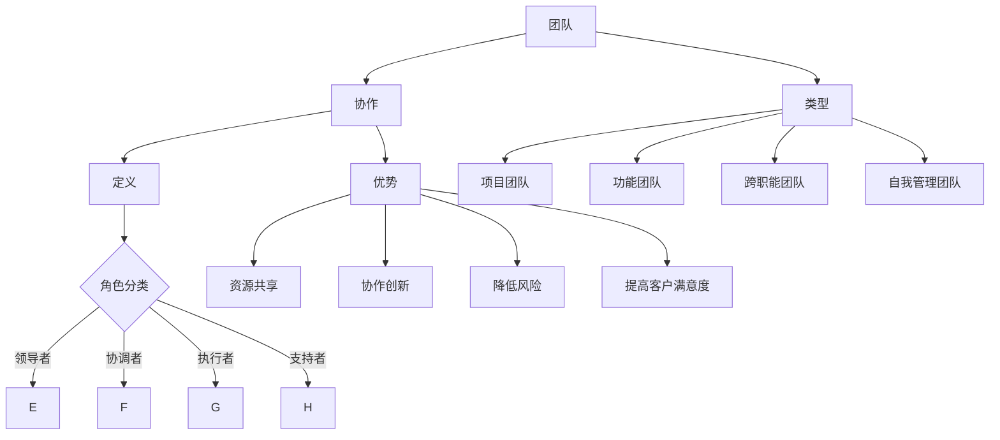

                 

### 引言

#### 1.1 团队协作的背景和目的

在当今快速变化且高度复杂的工作环境中，团队协作已成为许多组织成功的关键因素。无论是软件开发、项目管理、市场营销还是产品开发，跨职能团队的高效协作都能显著提升项目的成功率、创新能力和整体绩效。团队协作不仅有助于各个团队成员发挥各自的专业优势，还能促进不同部门和职能之间的沟通与理解，从而实现资源的最优配置。

本书旨在探讨团队协作，特别是跨职能合作的挑战与策略。首先，我们将介绍团队协作的基本概念、原则和理论基础，帮助读者建立起对团队协作的整体认识。随后，我们将深入探讨实践中如何进行有效的沟通、选择合适的协作工具、管理时间和解决冲突，为跨职能合作提供具体的操作方法和技巧。

此外，本书还将分析团队协作过程中可能遇到的障碍，并提出相应的解决方案。通过这些分析，读者将了解如何识别和克服这些障碍，确保团队协作的顺利进行。最后，我们将探讨制定团队协作计划和策略的重要性，并提供实用的指导和建议。

总之，本书的目标是帮助读者深入了解团队协作的各个方面，掌握有效的协作技巧，制定合理的策略和计划，从而实现跨职能团队的卓越表现。

#### 1.2 目标读者和本书结构

本书的目标读者包括各级管理人员、项目经理、团队成员以及任何对团队协作感兴趣的人士。无论您是刚刚步入职场的新人，还是经验丰富的资深管理者，本书都能为您提供实用的知识和策略。

为了帮助读者更好地理解并应用团队协作的原理和方法，本书分为以下几个部分：

1. **引言**：介绍团队协作的背景、目的以及本书的结构和内容安排。
2. **理论基础**：阐述团队协作的基本概念、原则和理论基础，包括团队的定义、角色、类型和跨职能合作的优势。
3. **实践技巧**：介绍跨职能合作的实际操作方法和技巧，包括沟通技巧、协作工具、时间管理和冲突解决等。
4. **挑战与解决**：分析团队协作中的障碍，并提供解决方案，帮助读者识别和克服这些障碍。
5. **策略与规划**：探讨团队协作的长期策略和规划，包括制定团队协作计划和策略的实用方法。
6. **案例研究**：通过实际案例分享，分析团队协作的成功经验和教训。
7. **结论与展望**：总结本书的主要观点，展望团队协作的未来发展趋势。

通过本书的阅读，读者将能够全面了解团队协作的重要性，掌握有效的协作技巧，制定合理的策略和计划，从而在跨职能合作中取得卓越的成果。

### 理论基础

#### 2.1 团队协作的基本概念

团队协作是指一组人员为了实现共同的目标而相互依赖、相互配合的工作方式。团队协作的核心在于通过共享资源和知识，提高工作效率和绩效，实现个体无法单独完成的任务。在团队协作中，每个成员都扮演着特定的角色，承担特定的职责，通过共同努力达成团队目标。

**定义和角色**

团队可以定义为一种由两个或多个个体组成的组织，他们通过相互协作来共同实现目标。团队成员的角色通常分为以下几类：

- **领导者**：负责制定团队目标和计划，协调成员之间的关系，确保团队工作顺利进行。
- **协调者**：协助领导者管理团队，处理成员之间的冲突，确保团队内部沟通顺畅。
- **执行者**：直接参与任务执行，负责实现团队目标的具体工作。
- **支持者**：为团队提供技术或资源支持，帮助团队解决遇到的困难。

**类型**

团队协作可以分为多种类型，每种类型都有其特定的应用场景和优势。以下是一些常见的团队类型：

- **项目团队**：专注于完成特定项目的团队，通常由来自不同职能部门的成员组成。
- **功能团队**：根据职能划分的团队，如研发团队、市场团队等，通常负责特定的职能领域。
- **跨职能团队**：由不同职能部门和专业领域的成员组成，旨在实现复杂项目的目标，具备较高的灵活性和适应性。
- **自我管理团队**：成员自主管理、自我协调，拥有更大的决策权和责任感，能够更高效地完成任务。

**跨职能合作的优势**

跨职能合作是指不同职能或部门的团队成员共同合作，共同完成一项任务或项目。跨职能合作的优势包括：

- **资源共享**：通过跨职能合作，团队可以共享不同领域的专业知识和资源，提高整体工作效率。
- **协作创新**：不同职能和背景的成员可以相互启发，激发创新思维，推动项目的进展。
- **降低风险**：通过跨职能合作，可以更早地识别和解决项目中的潜在问题，降低项目风险。
- **提高客户满意度**：跨职能团队可以更全面地了解客户需求和期望，提供更优质的服务。

**核心概念之间的关系架构**

为了更好地理解团队协作的基本概念，我们可以用Mermaid流程图来表示各个核心概念之间的关系：

通过上述内容，我们可以看到团队协作的基本概念和其各个组成部分之间的关系。在接下来的章节中，我们将进一步探讨团队协作的具体实践方法和策略，帮助读者在实际工作中更好地应用这些理论。

### 实践技巧

#### 3.1 沟通技巧

沟通技巧是团队协作中至关重要的一环，有效的沟通能够确保信息的准确传递，减少误解和冲突，提高团队的工作效率。以下是一些关键的沟通技巧，帮助团队实现高效协作。

##### 3.1.1 有效沟通的重要性

在团队协作中，沟通不仅包括信息的传递，还涉及情感、态度和意图的表达。有效沟通的重要性体现在以下几个方面：

- **减少误解**：清晰、明确的沟通可以减少信息的误解，确保团队成员对任务和目标有共同的理解。
- **提高效率**：有效的沟通可以迅速解决工作中的问题，减少沟通成本，提高团队的整体效率。
- **增强团队凝聚力**：良好的沟通有助于团队成员之间建立信任，增强团队的凝聚力。
- **提升决策质量**：通过广泛的沟通，团队可以收集更多的意见和信息，从而做出更全面、更准确的决策。

##### 3.1.2 沟通障碍及应对策略

尽管沟通在团队协作中至关重要，但实际情况中常常存在各种沟通障碍。以下是几种常见的沟通障碍及相应的应对策略：

- **信息过载**：过多的信息可能导致接收者无法有效处理，从而影响沟通效果。应对策略包括简化信息、突出重点，并合理安排沟通的时间和频率。
- **文化差异**：不同文化背景的团队成员可能在沟通时存在障碍。为了克服这一障碍，团队需要建立共同的文化价值观，鼓励开放和包容的沟通氛围。
- **技术障碍**：随着远程工作和虚拟团队的增加，技术障碍成为一个重要问题。选择合适的沟通工具和平台，确保技术设备的稳定性和可靠性，是解决技术障碍的关键。
- **个人差异**：团队成员的个性、经验和价值观差异可能导致沟通不畅。团队需要培养成员之间的相互理解和尊重，建立开放和诚实的沟通环境。

##### 3.1.3 沟通技巧的实际应用

在实际应用中，以下几种技巧可以帮助团队实现更高效的沟通：

- **积极倾听**：倾听不仅仅是听对方说什么，更重要的是理解对方的意图和情感。积极倾听可以通过复述、提问和反馈来实现。
- **明确表达**：在沟通时，尽量使用简洁、具体和明确的语言，避免使用模糊或含糊的表述，这样可以减少误解。
- **适时反馈**：及时给予反馈可以帮助确认信息的准确性，同时也是对对方的一种尊重。反馈可以是正面的也可以是建设性的。
- **利用非语言沟通**：非语言沟通包括肢体语言、面部表情和声音等。合理的非语言沟通可以增强信息的表达效果，帮助传达情感和态度。

#### 3.2 协作工具

在现代团队协作中，选择合适的协作工具是确保团队高效运作的关键。以下是一些常用的协作工具及其应用场景。

##### 3.2.1 常用协作工具介绍

1. **Slack**：Slack 是一款流行的即时通讯工具，适用于团队内部沟通和协作。其丰富的功能包括聊天室、直接消息、文件共享和集成其他应用程序等。

2. **Trello**：Trello 是一个基于看板的项目管理工具，适合团队进行任务分配和进度跟踪。用户可以通过卡片、列表和标签来组织和可视化项目。

3. **Asana**：Asana 是一款功能强大的项目管理工具，提供任务分配、时间跟踪和进度报告等功能，适用于不同规模和类型的团队。

4. **Google Workspace**：Google Workspace 是一系列云协作工具的集合，包括 Gmail、Google Docs、Google Sheets 等，支持多人实时协作。

5. **Microsoft Teams**：Microsoft Teams 是一款集通讯、会议和协作于一体的平台，适用于企业级团队。

##### 3.2.2 如何选择合适的协作工具

选择合适的协作工具需要考虑以下几个方面：

1. **团队规模和需求**：小型团队可能只需要简单的即时通讯工具，而大型团队则可能需要功能更全面的工具，如项目管理软件。
2. **协作频率和形式**：高频次的协作可能需要实时通讯工具，而长周期的项目则更适合使用项目管理工具。
3. **跨平台支持**：确保协作工具可以在团队成员的常用设备上运行，以提高便利性和协作效率。
4. **集成能力**：选择可以与其他常用应用程序集成的工具，以便更好地管理和整合团队的工作流程。
5. **成本和预算**：根据团队的预算选择性价比高的协作工具，避免不必要的开支。

通过上述介绍和策略，团队可以选择合适的协作工具，提高工作效率和协作质量。

#### 3.3 时间管理

时间管理是团队协作中一个至关重要的环节，它不仅影响个人绩效，还直接关系到整个团队的工作效率和项目成功。以下是一些关键的时间管理技巧和工具，帮助团队实现更高效的时间利用。

##### 3.3.1 时间管理的重要性

时间管理在团队协作中的重要性体现在以下几个方面：

- **提高工作效率**：通过合理规划和管理时间，团队成员可以更专注于关键任务，提高工作效率和产出。
- **减少拖延**：良好的时间管理可以减少任务拖延，确保各项工作按时完成。
- **平衡工作与生活**：合理的时间管理可以帮助团队成员在工作与生活之间找到平衡，避免工作过度占用个人时间。
- **优化资源分配**：通过时间管理，团队可以更好地分配资源和任务，确保资源的高效利用。

##### 3.3.2 时间管理技巧和工具

1. **优先级排序**：明确任务的重要性和紧迫性，将任务分为“重要且紧急”、“重要但不紧急”、“不重要但紧急”和“不重要且不紧急”四个类别，优先处理重要且紧急的任务。

2. **时间块管理**：将一天的时间划分为不同的时间块，并为每个时间块分配特定的任务或活动。这种方法有助于提高专注度，减少任务切换带来的效率损失。

3. **番茄工作法**：这是一种流行的专注技巧，将工作时间分为25分钟的工作周期（称为“番茄钟”），每个周期后休息5分钟。通过这种方法，可以有效地提高专注力和工作效率。

4. **Gantt图**：Gantt图是一种常用的项目管理工具，用于可视化项目的时间线和进度。通过Gantt图，团队可以清晰地了解项目的进度和关键节点，及时调整计划和资源。

5. **日历同步**：使用日历同步工具，如Google Calendar或Microsoft Outlook，可以方便地安排和协调团队会议和活动，避免时间冲突。

6. **时间追踪工具**：如Toggl或Harvest，这些工具可以帮助团队成员追踪工作时间，了解工作效率和项目进度，从而进行有效的反馈和调整。

通过上述时间管理技巧和工具，团队可以更好地规划和管理时间，确保工作的高效和有序进行。

#### 3.4 冲突解决

在团队协作过程中，冲突是不可避免的。有效的冲突解决策略可以帮助团队克服障碍，保持和谐的工作氛围，提高整体绩效。以下是一些关于冲突解决的核心原则和策略。

##### 3.4.1 冲突的原因和类型

冲突可以分为以下几种类型：

1. **目标冲突**：团队成员对于项目的目标或优先级存在不同的看法，导致意见不一致。
2. **资源冲突**：团队在有限的资源（如人力、时间、资金）上出现争夺，导致合作受阻。
3. **利益冲突**：团队成员的个人利益与团队利益发生冲突，如个人目标与团队目标不一致。
4. **文化冲突**：由于团队成员来自不同的文化背景，可能在价值观、沟通方式和工作习惯上存在差异。

冲突产生的原因可能包括沟通不畅、目标不明确、资源不足、个人压力等。

##### 3.4.2 冲突解决的策略和方法

1. **预防策略**：

   - **明确目标和期望**：在项目启动阶段，明确团队的目标和期望，确保所有成员对任务和目标有共同的理解。
   - **建立沟通机制**：建立开放的沟通渠道，鼓励团队成员表达意见和建议，减少误解和冲突的发生。
   - **培养团队文化**：建立积极、包容的团队文化，鼓励成员之间的相互尊重和理解，减少文化冲突。
   - **资源合理分配**：在项目规划阶段，充分考虑团队成员的能力和资源需求，避免资源过度集中或分配不均。

2. **解决策略**：

   - **面对冲突**：冲突发生时，应正视问题，避免逃避或抑制情绪，保持冷静和客观。
   - **了解各方立场**：倾听冲突各方的观点和感受，了解他们的需求和动机，避免片面决策。
   - **寻找共同点**：在冲突中寻找共同目标和利益，通过协商和妥协找到双赢的解决方案。
   - **使用第三方调解**：如果冲突无法通过内部解决，可以考虑引入第三方调解人，帮助团队找到公正的解决方案。

3. **解决方法**：

   - **理性分析**：通过逻辑分析和事实依据，帮助团队理性看待冲突，找到解决问题的方法。
   - **建设性对话**：鼓励团队成员进行开放和诚实的对话，表达各自的看法和意见，避免指责和攻击。
   - **制定行动计划**：在冲突解决后，制定明确的行动计划，确保解决方案能够有效执行，并防止类似冲突的再次发生。

通过上述策略和方法，团队可以有效地解决冲突，保持和谐的工作氛围，促进团队协作的顺利进行。

### 挑战与解决

#### 4.1 团队协作中的障碍

在团队协作过程中，障碍是不可避免的。这些障碍可能来自内部或外部，影响团队的工作效率和项目进展。以下是一些常见的内部和外部障碍，以及如何识别和克服这些障碍。

##### 4.1.1 内部障碍

**内部障碍**主要包括以下几个方面：

1. **沟通不畅**：团队成员之间的沟通不畅可能导致误解和冲突，影响工作进度。这可能是由于文化差异、沟通技能不足或沟通渠道不畅引起的。

   **解决方案**：建立有效的沟通机制，鼓励团队成员积极沟通，提供沟通培训，使用适当的沟通工具和平台，如Slack或Trello。

2. **角色不清**：团队成员的角色和职责不明确，可能导致任务重叠或责任缺失，影响工作效果。

   **解决方案**：在项目启动阶段明确团队成员的角色和职责，制定详细的工作分配计划，确保每个人都知道自己的任务和目标。

3. **资源不足**：团队在人力、时间和资金等方面的资源不足，可能导致任务无法按时完成。

   **解决方案**：在项目规划阶段充分考虑资源需求，确保资源的合理分配和调度，必要时寻求外部支持或资源。

4. **个人冲突**：团队成员之间可能因为个人差异、价值观不同等原因产生冲突，影响团队和谐。

   **解决方案**：建立积极、包容的团队文化，鼓励团队成员相互理解和尊重，提供冲突解决培训，及时处理和化解个人冲突。

##### 4.1.2 外部障碍

**外部障碍**主要包括以下几个方面：

1. **市场变化**：外部市场的变化可能对项目产生重大影响，如竞争对手的动向、市场需求的变化等。

   **解决方案**：建立市场监控机制，及时获取市场信息，根据市场变化调整项目计划和策略。

2. **技术限制**：项目可能面临技术限制，如现有技术的不足、技术更新速度过快等。

   **解决方案**：与技术团队紧密合作，评估技术风险，采用前沿技术或寻求技术解决方案。

3. **法规和政策**：项目可能受到法律法规和政策的限制，如政府监管、行业规定等。

   **解决方案**：了解和遵守相关法律法规，与法律顾问保持沟通，确保项目合规。

4. **外部依赖**：项目可能依赖于外部供应商或合作伙伴，如延迟交付或质量问题等。

   **解决方案**：建立稳定的外部合作关系，明确双方的责任和义务，制定应急预案以应对外部依赖问题。

##### 4.1.3 识别和克服障碍

**识别障碍**：

1. **定期评估**：定期对项目进展进行评估，识别潜在的问题和障碍。
2. **反馈机制**：建立有效的反馈机制，鼓励团队成员提出问题和建议，及时发现和解决问题。
3. **沟通透明**：保持沟通透明，确保团队成员了解项目的进展和潜在问题。

**克服障碍**：

1. **问题解决会议**：定期召开问题解决会议，讨论和解决团队协作中的问题。
2. **资源调整**：根据项目进展和需求，调整资源和任务分配，确保资源的合理利用。
3. **培训与支持**：提供必要的培训和支持，提升团队成员的技能和解决问题的能力。
4. **调整策略**：根据外部环境的变化，灵活调整项目计划和策略，以应对外部障碍。

通过识别和克服这些障碍，团队可以更好地应对挑战，确保项目顺利进行。

### 策略与规划

#### 5.1 制定团队协作计划

在团队协作中，制定一个详细的协作计划是确保项目顺利进行的关键。一个有效的团队协作计划可以明确团队成员的角色和责任，合理安排时间和资源，从而提高工作效率和项目成功率。以下是如何制定团队协作计划的详细步骤。

##### 5.1.1 团队协作计划的要素

一个团队协作计划应包括以下关键要素：

1. **项目目标**：明确项目的目标，确保团队成员对项目方向有共同的理解。
2. **任务分配**：详细列出每个成员的任务和责任，确保任务明确且可执行。
3. **时间表**：制定项目的时间表，包括关键节点、里程碑和截止日期。
4. **资源需求**：列出项目所需的资源，包括人力、时间和资金等。
5. **风险评估**：评估项目可能面临的风险，并制定相应的应对策略。
6. **沟通计划**：确定团队成员之间的沟通方式、频率和渠道，确保信息传递的及时和准确。
7. **绩效评估**：设定绩效指标和评估标准，以便在项目结束后对团队成员进行评估。

##### 5.1.2 团队协作计划的具体步骤

1. **明确项目目标**：

   - 与团队成员讨论并明确项目的目标，确保目标具体、可行且与组织的战略目标一致。
   - 将项目目标分解为更具体的子目标，便于后续的任务分配和进度跟踪。

2. **任务分配**：

   - 根据团队成员的技能和经验，分配任务和责任，确保每个成员都有明确的职责。
   - 为每个任务设定优先级，区分关键任务和非关键任务，确保团队聚焦于最重要的工作。

3. **制定时间表**：

   - 将项目分为不同的阶段，为每个阶段设定里程碑和截止日期。
   - 根据任务的复杂性和依赖关系，合理安排各阶段的执行时间。
   - 定期更新时间表，确保项目进度与预期相符。

4. **资源需求**：

   - 列出项目所需的资源，包括人力、设备和资金等。
   - 评估现有资源的可用性，必要时进行资源调配或寻求外部支持。
   - 确保资源分配合理，避免资源浪费和过度依赖。

5. **风险评估**：

   - 识别项目可能面临的风险，包括技术风险、市场风险和人员风险等。
   - 分析每个风险的可能性和影响，制定相应的预防和应对策略。
   - 定期评估和更新风险清单，确保风险得到及时控制和解决。

6. **沟通计划**：

   - 确定团队成员之间的沟通方式，如定期会议、即时通讯工具或电子邮件等。
   - 设定沟通频率和渠道，确保团队成员能够及时获取项目信息。
   - 建立沟通规范，明确信息传递的格式和流程，减少误解和冲突。

7. **绩效评估**：

   - 设定绩效指标和评估标准，以便在项目结束后对团队成员的工作进行评估。
   - 定期进行绩效反馈，鼓励团队成员不断改进和提高。
   - 根据评估结果，为团队成员提供必要的培训和指导。

通过上述步骤，团队可以制定出一个详细且实用的协作计划，为项目的顺利进行提供有力保障。

#### 5.2 制定团队协作策略

在团队协作中，除了制定详细的协作计划，合理的团队协作策略同样至关重要。一个有效的团队协作策略可以帮助团队克服障碍，提高协作效率，实现项目目标。以下是如何制定团队协作策略的详细步骤。

##### 5.2.1 团队协作策略的类型

团队协作策略可以根据不同的维度进行分类，常见的策略类型包括：

1. **目标导向策略**：以明确的目标为导向，通过设定具体的里程碑和绩效指标，激励团队成员努力实现目标。
2. **资源优化策略**：通过合理分配和调配资源，确保团队在有限资源下实现最大效益。
3. **风险管理策略**：识别潜在风险，并制定相应的预防和应对措施，减少项目风险对团队协作的影响。
4. **沟通协调策略**：建立有效的沟通机制，确保信息传递的及时性和准确性，减少误解和冲突。
5. **激励与反馈策略**：通过奖励和认可，激励团队成员积极参与协作，提供及时的反馈，促进团队成员的持续改进。

##### 5.2.2 如何制定有效的团队协作策略

1. **确定策略目标**：

   - 根据项目目标和团队需求，明确协作策略的目标，如提高工作效率、优化资源分配、减少沟通障碍等。
   - 确保策略目标与项目整体目标保持一致，避免策略目标偏离项目方向。

2. **评估团队现状**：

   - 分析团队的结构、技能和资源状况，了解团队的优势和劣势。
   - 评估团队在协作过程中可能面临的问题和挑战，为策略制定提供依据。

3. **制定具体策略**：

   - **目标导向策略**：制定具体的里程碑和绩效指标，确保团队成员明确目标并付出努力。例如，设定每月完成特定功能模块的目标，并定期进行进度检查和反馈。
   - **资源优化策略**：根据团队需求和资源状况，制定资源调配计划。例如，合理安排人力和时间，确保关键任务得到优先处理。
   - **风险管理策略**：识别项目中的潜在风险，制定预防和应对措施。例如，制定应急预案，确保在风险发生时能够迅速响应和解决问题。
   - **沟通协调策略**：建立有效的沟通渠道和机制，确保信息传递的及时性和准确性。例如，定期召开团队会议，使用即时通讯工具进行日常沟通。
   - **激励与反馈策略**：制定奖励和认可机制，激励团队成员积极参与协作。例如，设立团队奖励基金，对表现优异的成员进行表彰和奖励。

4. **执行和监控**：

   - 确保策略得到有效执行，定期检查和评估策略的实际效果。
   - 根据实际情况调整和优化策略，确保策略与团队的动态变化保持一致。

通过上述步骤，团队可以制定出一个有效的协作策略，提高协作效率，实现项目目标。

### 案例研究

#### 6.1 案例分析

在本章节中，我们将通过两个实际案例来探讨团队协作的成功经验和教训。这些案例分别来自不同的行业和团队规模，旨在展示跨职能团队在不同情境下的协作实践。

##### 6.1.1 案例一：跨部门项目协作

**背景**：某国际知名科技公司正在进行一款新产品开发的跨部门项目。该项目涉及研发、市场、销售和客户支持等多个部门，目标是确保产品从研发到上市的全过程高效、顺利。

**挑战**：由于涉及多个部门，协作过程中面临沟通不畅、职责不清、资源分配不均等问题。各部门在目标和利益上存在差异，导致协作效率低下。

**解决方案**：

1. **建立跨部门协作团队**：成立由各部门核心成员组成的跨部门协作团队，明确每个成员的职责和目标。
2. **定期召开协作会议**：每周定期召开跨部门协作会议，讨论项目进展、解决冲突和协调资源。
3. **使用协作工具**：采用Trello和Slack等协作工具，确保信息传递的及时性和准确性。
4. **制定项目时间表**：详细制定项目时间表，明确每个阶段的关键节点和责任分工。
5. **建立沟通规范**：制定沟通规范，明确各部门之间的沟通渠道和频率，减少误解和冲突。

**结果**：通过上述措施，项目进展顺利，各部门之间的协作效率显著提高。最终，产品成功上市，获得市场的高度认可。

##### 6.1.2 案例二：小型团队协作

**背景**：某初创公司开发一款新型移动应用，团队规模较小，只有五名成员，包括产品经理、开发工程师、UI设计师和测试工程师。

**挑战**：由于团队规模较小，成员需要承担更多的职责。在项目推进过程中，团队成员在任务分配、时间管理和资源利用方面面临挑战。

**解决方案**：

1. **明确角色和责任**：明确每个团队成员的角色和职责，确保任务分工合理。
2. **定期进度会议**：每周召开进度会议，讨论项目进展、解决问题和调整任务分配。
3. **使用敏捷开发方法**：采用敏捷开发方法，将项目分解为多个迭代周期，确保团队成员能够高效地完成任务。
4. **时间管理和任务追踪工具**：使用Trello和JIRA等工具进行时间管理和任务追踪，确保项目进度清晰、可控。
5. **灵活调整策略**：根据项目进展和实际情况，灵活调整任务和资源分配，确保团队始终专注于最重要和最有价值的工作。

**结果**：通过上述措施，团队协作效率显著提高，项目在预定时间内完成，并成功上线。团队成员在项目中的经验和技能也得到了提升。

通过以上案例，我们可以看到跨职能团队和小型团队在协作过程中都面临不同的挑战，但通过合理的策略和措施，可以有效地克服这些挑战，实现项目目标。这些案例为其他团队提供了宝贵的经验和借鉴。

### 结论与展望

#### 7.1 团队协作的重要性和发展趋势

团队协作在现代组织中发挥着至关重要的作用。在日益复杂和多变的工作环境中，跨职能团队的高效协作不仅有助于提升项目的成功率，还能推动组织的创新能力和整体绩效。有效的团队协作能够促进信息共享、知识整合和资源优化，从而实现单个个体无法达到的目标。随着远程工作和数字化转型的普及，团队协作正变得更加重要和必要。

未来，团队协作的发展趋势将体现在以下几个方面：

1. **技术驱动**：随着人工智能、大数据和云计算等技术的不断发展，团队协作工具将变得更加智能化和集成化，提高协作效率和用户体验。
2. **远程协作**：远程工作的常态化将推动远程协作技术的发展，增强团队成员之间的沟通与协作，减少地域限制。
3. **个性化和定制化**：团队协作将更加注重个性化和定制化，根据不同团队和项目的需求，灵活调整协作方式和策略。
4. **灵活性和敏捷性**：组织将更加重视团队协作的灵活性和敏捷性，以快速响应市场变化和客户需求，提高竞争力。

#### 7.2 未来改进方向和建议

为了进一步提升团队协作的效果，以下是一些建议：

1. **加强沟通培训**：定期为团队成员提供沟通技巧培训，提高团队成员的沟通能力和协作效率。
2. **完善协作工具**：持续评估和优化协作工具，确保工具的功能性和易用性，满足团队成员的实际需求。
3. **建立有效的反馈机制**：建立完善的反馈机制，鼓励团队成员提出意见和建议，及时发现和解决协作中的问题。
4. **注重团队文化建设**：培养积极、包容和创新的团队文化，促进团队成员之间的相互理解和信任，提高团队凝聚力。
5. **持续学习和改进**：鼓励团队成员不断学习和掌握新的协作技巧和工具，不断优化团队协作流程和方法。

总之，团队协作是组织成功的关键因素，未来需要不断探索和改进，以应对日益复杂的工作环境和市场需求。通过持续的努力和改进，团队协作将助力组织实现更高的效率和绩效。

### 作者信息

- **作者**：AI天才研究院/AI Genius Institute & 禅与计算机程序设计艺术 /Zen And The Art of Computer Programming
- **简介**：AI天才研究院致力于推动人工智能技术的研究与应用，培养下一代人工智能科学家和工程师。同时，研究院成员也是《禅与计算机程序设计艺术》一书的作者，该书以其深刻的哲学思考和卓越的技术分析，在全球范围内享有盛誉。本书《团队协作：跨职能合作的挑战与策略》旨在帮助读者掌握有效的团队协作技巧，实现跨职能团队的高效合作。

