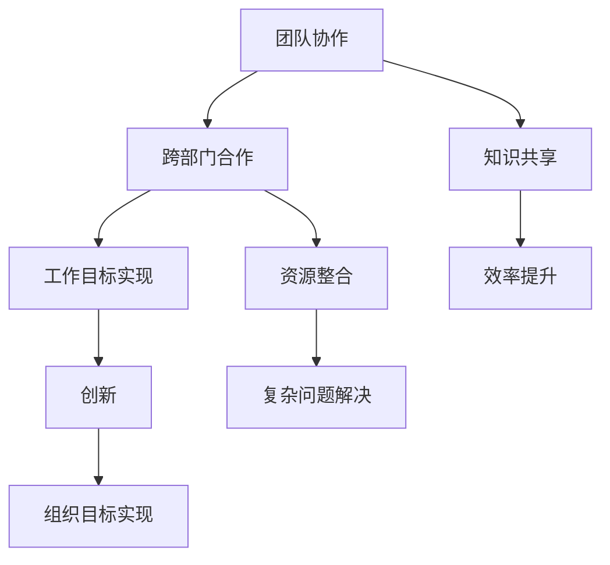

                 

## 文章标题：团队协作：跨部门合作的重要性

在当今复杂多变的企业环境中，团队协作和跨部门合作已经成为提高工作效率、促进创新和实现组织目标的关键因素。本文将围绕这一主题展开，通过逻辑清晰、结构紧凑的论述，探讨团队协作与跨部门合作的重要性、原理和实践方法，并展望其未来趋势。

> **关键词：** 团队协作，跨部门合作，工作流程，创新，组织效率

> **摘要：** 本文首先介绍团队协作和跨部门合作的核心概念，随后深入探讨其重要性、原理和实践方法，通过案例分析总结成功经验和失败教训，最后展望未来趋势，为读者提供全面的指导。

## 1. 核心概念与联系

### 1.1 团队协作的定义

团队协作是指团队成员通过相互沟通、协调和配合，共同完成工作目标的过程。它强调的是团队成员之间的互动和协作，以达到个人无法实现的目标。

### 1.2 跨部门合作的重要性

跨部门合作能够整合不同部门的专业知识，提高工作效率，促进创新。它不仅有助于解决复杂问题，还能够促进组织内部的知识共享和资源整合。

### 1.3 团队协作与跨部门合作的关系

团队协作是跨部门合作的基础，而跨部门合作则是团队协作的深化和扩展。团队协作强调的是团队成员之间的协作，而跨部门合作则强调的是不同部门之间的协作。

### 1.4 核心概念原理之间的关系架构

为了更清晰地理解团队协作与跨部门合作的关系，我们可以使用Mermaid流程图来展示它们之间的互动关系：

### 1.5 核心算法原理讲解

团队协作与跨部门合作的核心算法原理可以概括为以下步骤：

1. **明确目标**：首先需要明确团队和跨部门合作的目标。
2. **资源整合**：整合团队成员和不同部门的专业知识和资源。
3. **沟通协调**：通过有效的沟通和协调，确保团队成员和跨部门合作能够顺利推进。
4. **知识共享**：在合作过程中，促进团队成员和跨部门之间的知识共享。
5. **评估与反馈**：定期评估合作效果，并根据反馈进行调整和优化。

### 1.6 数学模型和公式

为了量化团队协作和跨部门合作的效果，我们可以引入以下数学模型和公式：

1. **协同效应系数**：

   $$\text{协同效应系数} = \frac{\text{合作后的工作效率}}{\text{各自独立工作效率之和}}$$

   该系数可以衡量跨部门合作带来的效率提升。

2. **知识共享指数**：

   $$\text{知识共享指数} = \frac{\text{知识共享量}}{\text{知识总量}}$$

   该指数可以衡量团队成员和跨部门之间的知识共享程度。

### 1.7 项目实战

在项目实战中，团队协作和跨部门合作的关键在于如何搭建一个高效的工作流程。以下是一个简单的项目实战案例：

1. **项目背景**：开发一款企业级协作平台。
2. **团队协作**：
   - **明确目标**：开发一款功能完善、用户体验优秀的协作平台。
   - **资源整合**：整合前端、后端、UI/UX设计等团队的专业知识和资源。
   - **沟通协调**：定期召开项目会议，讨论进度和解决问题。
   - **知识共享**：通过文档、代码仓库等工具，实现团队成员之间的知识共享。
3. **跨部门合作**：
   - **明确目标**：确保协作平台满足不同部门的需求。
   - **资源整合**：与市场营销、客户支持等部门的协作，了解用户需求。
   - **沟通协调**：定期与相关部门召开需求研讨会，确保协作平台的功能符合预期。
   - **知识共享**：通过需求文档、用户反馈等工具，实现跨部门之间的知识共享。

通过这个案例，我们可以看到团队协作和跨部门合作在实际项目中的应用和效果。

### 1.8 最佳实践 tips、小结、注意事项、拓展阅读

**最佳实践 tips：**
- **明确目标**：确保团队和跨部门合作的目标一致。
- **沟通协调**：建立有效的沟通机制，确保信息传递畅通。
- **知识共享**：使用合适的工具和平台，促进团队成员和跨部门之间的知识共享。

**小结：**
团队协作和跨部门合作是提高工作效率、促进创新和实现组织目标的关键。通过明确目标、资源整合、沟通协调和知识共享，可以有效地实现团队协作和跨部门合作。

**注意事项：**
- **尊重差异**：不同部门之间存在差异，需要尊重和包容。
- **持续改进**：团队协作和跨部门合作是一个持续改进的过程。

**拓展阅读：**
- 《敏捷开发实践指南》
- 《跨部门协作的技巧与艺术》
- 《团队合作的力量》

### 1.9 总结

本文介绍了团队协作和跨部门合作的核心概念、原理和实践方法，并通过案例分析和数学模型，展示了它们在实际应用中的效果。通过本文的阅读，读者可以更好地理解团队协作和跨部门合作的重要性，并学会如何有效地应用这些理念，提升工作效率，实现团队和组织的成功。

