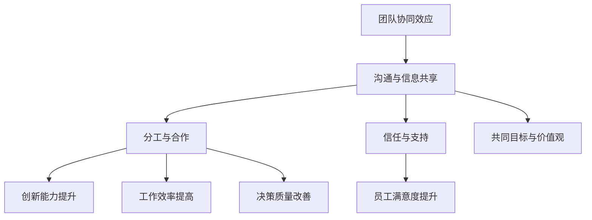

                 

# 文章标题
## 团队协同效应：maximizing team synergy

### 关键词
- 团队协同效应
- 沟通与信息共享
- 分工与合作
- 信任与支持
- 共同目标与价值观
- 创新能力
- 工作效率
- 决策质量
- 员工满意度

### 摘要
本文深入探讨了团队协同效应的定义、机制、表现形式及其在团队工作中的重要性。通过理论探讨和实践指南，本文为团队领导者和管理者提供了提升团队协同效应的策略和工具。同时，通过案例分析，本文展示了成功实现团队协同效应的实际案例，为读者提供了宝贵的实践参考。

---

### 引言

#### 团队协同效应的重要性

团队协同效应（Team Synergy）指的是一个团队的整体表现超过其各个成员表现之和的现象。在当今快速变化和高度复杂的工作环境中，团队协同效应的重要性愈发突出。有效的团队协同可以带来创新、效率提升、决策优化等多方面的优势，从而推动组织达成战略目标。

#### 书籍目标

本书旨在帮助读者深入了解团队协同效应的原理和实践，通过系统的理论和案例研究，为团队成员和管理者提供切实可行的策略和工具。本书的目标是：

1. **澄清概念**：解释团队协同效应的核心概念，包括协同效应的定义、机制及其在团队工作中的重要性。
2. **理论探讨**：介绍团队协同效应的理论基础，探讨协同效应的影响因素，如沟通、信任、团队结构等。
3. **实践指南**：提供实用的策略和方法，帮助团队领导者和管理者提升团队协同效应，包括团队建设活动、沟通技巧、冲突解决等。
4. **案例分析**：通过丰富的案例分析，展示成功实现团队协同效应的实际案例，为读者提供实践参考。

#### 内容结构

本书内容分为五个部分：

1. **第一部分：核心概念与联系**：介绍团队协同效应的基本概念，核心原理及其在团队工作中的表现。
2. **第二部分：理论探讨**：深入探讨团队协同效应的理论基础，包括相关理论和模型。
3. **第三部分：实践指南**：提供实用的团队协同效应提升策略和工具。
4. **第四部分：项目实战**：通过实际案例展示如何实现团队协同效应。
5. **第五部分：案例分析**：分析成功实现团队协同效应的案例，总结关键成功因素。

### 团队协同效应：maximizing team synergy## 核心概念与联系

### 2.1 团队协同效应的定义与机制

#### 团队协同效应的定义

团队协同效应是指在团队内部，成员之间的相互协作和互动能够产生比单独个体工作更大的效果。具体来说，它指的是团队的整体性能超过了个体成员能力之和的现象。这一效应可以表现在多个方面，如提高工作效率、促进创新、优化决策等。

#### 团队协同效应的机制

团队协同效应的实现离不开以下几个关键因素：

1. **沟通与信息共享**：有效的沟通和信息共享是团队协同效应的基础。团队成员之间需要建立开放的沟通渠道，共享信息资源，以便快速响应问题并作出决策。
2. **分工与合作**：合理的分工能够使团队成员各司其职，发挥各自的专业优势。同时，团队内的协作能够使成员之间的互补效应得到充分发挥。
3. **信任与支持**：信任是团队协同效应的润滑剂。团队成员之间需要建立相互信任的关系，愿意在遇到困难时互相支持。
4. **共同目标与价值观**：明确的目标和共同的价值观能够凝聚团队成员，使他们朝着共同的方向努力，从而提高团队的整体绩效。

### 2.2 团队协同效应的表现形式

团队协同效应在团队工作中可以表现为以下几个方面：

1. **创新能力的提升**：团队协同效应有助于团队成员之间的思想碰撞，激发创新思维，从而推动团队在产品开发、市场拓展等方面取得突破。
2. **工作效率的提高**：通过团队成员之间的协作和分工，可以优化工作流程，减少重复劳动，提高工作效率。
3. **决策质量的改善**：团队协同效应有助于团队成员在决策过程中集思广益，减少个体决策的盲点，提高决策的质量。
4. **员工满意度和忠诚度的提升**：团队协同效应能够增强团队成员之间的信任和合作，提高员工的满意度和忠诚度，从而减少人员流失。

### 2.3 团队协同效应的核心概念与联系

#### 核心概念

- **协同**：指团队成员之间的协作和互动，是团队协同效应实现的基础。
- **效应**：指团队协同带来的积极影响，如创新、效率、决策质量等。

#### 团队协同效应的联系

- **沟通**：沟通是协同的前提，没有良好的沟通就无法实现有效的协同。
- **信任**：信任是协同的保障，缺乏信任的团队很难实现协同效应。
- **目标与价值观**：共同的目标和价值观是协同的导向，使团队成员能够朝着共同的方向努力。

### 团队协同效应 Mermaid 流程图



### 2.4 团队协同效应的核心算法原理讲解

为了更好地理解团队协同效应的核心算法原理，我们可以从以下几个方面进行探讨：

#### 1. 沟通算法

沟通是团队协同效应实现的基础。一个有效的沟通算法应包括以下几个关键步骤：

1. **信息采集**：团队成员需要收集各自的工作情况和问题，以便在团队内部进行共享。
2. **信息分类**：将采集到的信息进行分类，以便于团队成员有针对性地进行讨论和决策。
3. **信息共享**：通过共享平台（如会议、邮件、即时通讯工具等）将分类后的信息传递给团队成员。
4. **反馈与调整**：团队成员根据共享的信息进行讨论，并提出反馈和改进意见，以便调整团队的工作方向。

以下是一个简单的伪代码示例：

```python
def communicate(team_members, work_status):
    # 步骤1：信息采集
    for member in team_members:
        member.collect_work_status()

    # 步骤2：信息分类
    categorized_info = categorize_info(team_members)

    # 步骤3：信息共享
    share_info(categorized_info)

    # 步骤4：反馈与调整
    feedback = get_feedback()
    adjust_work_direction(feedback)
```

#### 2. 协作算法

协作是团队协同效应的核心。一个有效的协作算法应包括以下几个关键步骤：

1. **任务分配**：根据团队成员的能力和兴趣，将任务合理地分配给各个成员。
2. **进度跟踪**：对任务的进度进行实时监控，确保任务按时完成。
3. **协作工具**：使用合适的协作工具（如项目管理系统、文档共享平台等），以便团队成员能够高效地合作。
4. **问题解决**：在协作过程中，及时解决遇到的问题，以确保团队的工作顺利进行。

以下是一个简单的伪代码示例：

```python
def collaborate(team_members, tasks):
    # 步骤1：任务分配
    assign_tasks(team_members, tasks)

    # 步骤2：进度跟踪
    track_progress(tasks)

    # 步骤3：协作工具
    use_collaboration_tools(team_members)

    # 步骤4：问题解决
    solve_issues()
```

#### 3. 信任与支持算法

信任与支持是团队协同效应的润滑剂。一个有效的信任与支持算法应包括以下几个关键步骤：

1. **建立信任**：通过沟通、合作和共同经历，逐步建立团队成员之间的信任。
2. **提供支持**：在团队成员遇到困难时，及时提供帮助和支持。
3. **反馈与激励**：对团队成员的表现进行及时反馈和激励，以增强团队成员的自信心和积极性。

以下是一个简单的伪代码示例：

```python
def trust_and_support(team_members):
    # 步骤1：建立信任
    build_trust(team_members)

    # 步骤2：提供支持
    provide_support(team_members)

    # 步骤3：反馈与激励
    give_feedback_and_incentives(team_members)
```

#### 4. 目标与价值观算法

明确的目标和共同的价值观是团队协同效应的导向。一个有效的目标与价值观算法应包括以下几个关键步骤：

1. **设定目标**：根据团队的战略目标和实际情况，设定具体、可衡量的团队目标。
2. **传递价值观**：通过沟通和教育，确保团队成员理解并认同团队的价值观。
3. **监督与调整**：对团队目标的实现情况进行监督和调整，以确保团队始终朝着正确的方向努力。

以下是一个简单的伪代码示例：

```python
def goal_and_values(team_members, goals, values):
    # 步骤1：设定目标
    set_goals(team_members, goals)

    # 步骤2：传递价值观
    communicate_values(team_members, values)

    # 步骤3：监督与调整
    monitor_and_adjust_goals(team_members, goals)
```

通过上述核心算法原理的讲解，我们可以更好地理解团队协同效应的实现机制。在实际应用中，这些算法可以根据具体情况进行调整和优化，以实现团队的最大协同效应。

### 2.5 团队协同效应的数学模型和公式

在团队协同效应的研究中，数学模型和公式可以帮助我们更好地理解和分析团队的整体表现。以下是一些常用的数学模型和公式：

#### 1. 赫尔曼公式（Herman's Formula）

赫尔曼公式是一个用于计算团队协同效应的基本公式，它由以下三个部分组成：

$$
E = \sum_{i=1}^{n} (T_i - \bar{T})
$$

其中，$E$ 表示团队协同效应，$T_i$ 表示第 $i$ 个成员的贡献，$\bar{T}$ 表示团队平均贡献。

这个公式表示团队协同效应是各个成员贡献与团队平均贡献之差的加和。如果所有成员的贡献都高于团队平均水平，则团队协同效应为正；反之，如果所有成员的贡献都低于团队平均水平，则团队协同效应为负。

#### 2. 群体智力模型（Collective Intelligence Model）

群体智力模型用于衡量团队的整体智力水平。它由以下公式表示：

$$
CI = \frac{\sum_{i=1}^{n} (T_i \cdot S_i)}{n}
$$

其中，$CI$ 表示群体智力，$T_i$ 表示第 $i$ 个成员的智力水平，$S_i$ 表示第 $i$ 个成员的社交影响力。

这个公式表示群体智力是各个成员智力水平与其社交影响力乘积的加和，再除以成员总数。社交影响力较大的成员对团队智力水平的提升有更大的影响。

#### 3. 信任指数模型（Trust Index Model）

信任指数模型用于衡量团队成员之间的信任程度。它由以下公式表示：

$$
TI = \frac{\sum_{i=1}^{n} (T_{ij} \cdot W_i)}{n}
$$

其中，$TI$ 表示信任指数，$T_{ij}$ 表示第 $i$ 个成员对第 $j$ 个成员的信任程度，$W_i$ 表示第 $i$ 个成员的权重。

这个公式表示信任指数是各个成员之间信任程度的加权平均值。权重可以根据成员在团队中的角色和贡献进行调整。

#### 4. 创新能力模型（Innovation Capability Model）

创新能力模型用于衡量团队的创新能力。它由以下公式表示：

$$
IC = \alpha \cdot (CI + TI)
$$

其中，$IC$ 表示创新能力，$CI$ 表示群体智力，$TI$ 表示信任指数，$\alpha$ 是一个常数，用于调整群体智力和信任指数对创新能力的影响程度。

这个公式表示创新能力是群体智力和信任指数的加权和。较高的群体智力和信任指数有助于提高团队的创新能力。

通过上述数学模型和公式，我们可以从定量角度分析团队协同效应的各种因素，为团队的管理和优化提供有力的理论支持。

### 2.6 团队协同效应的实际案例与详细讲解

为了更好地理解团队协同效应的实际应用，我们可以通过以下几个成功案例进行详细讲解。

#### 1. 案例一：谷歌的团队协作文化

谷歌是一家以创新和协作著称的公司。在谷歌，团队协作文化深入人心，团队协同效应得到了充分发挥。以下是一些关键成功因素：

- **开放的沟通渠道**：谷歌鼓励团队成员之间进行开放、坦诚的沟通。公司内部有多个沟通平台（如邮件、即时通讯、项目管理系统等），使团队成员能够方便地交流和共享信息。
- **灵活的团队结构**：谷歌采用扁平化的团队结构，使团队成员能够快速响应问题并作出决策。团队成员可以根据项目需要自由组队，形成跨职能的团队，从而提高工作效率。
- **共同的价值观**：谷歌强调“不作恶”的价值观，使团队成员在共同的目标下努力，增强了团队的凝聚力。
- **激励机制**：谷歌通过股票期权、奖金等多种激励机制，鼓励团队成员为团队的成功贡献力量。

通过上述措施，谷歌成功地实现了团队协同效应，推动了公司在技术、产品、市场等方面的持续创新。

#### 2. 案例二：红帽公司的开放协作模式

红帽公司是一家以开源软件著称的公司，其开放协作模式为团队协同效应的实现提供了有力支持。以下是一些关键成功因素：

- **开放源代码**：红帽公司坚持开放源代码的原则，使团队成员可以自由地访问和修改代码，从而促进了团队之间的信息共享和协作。
- **贡献者激励机制**：红帽公司鼓励外部开发者参与公司的项目，并为贡献者提供奖励和认可，从而增强了团队成员之间的信任和合作。
- **跨职能团队**：红帽公司采用跨职能团队的模式，使团队成员能够在不同的项目之间灵活调配，充分发挥各自的专业优势。
- **社区支持**：红帽公司建立了强大的社区支持体系，为团队成员提供技术交流和合作的平台，从而提高了团队的创新能力。

通过上述措施，红帽公司成功地实现了团队协同效应，推动了公司开源软件的快速发展。

#### 3. 案例三：IBM的团队文化建设

IBM是一家具有悠久历史的科技公司，其团队文化建设为团队协同效应的实现提供了有力支持。以下是一些关键成功因素：

- **领导力的培养**：IBM注重领导力的培养，为团队成员提供领导力培训和发展机会，从而提高了团队的整体领导能力。
- **团队合作的精神**：IBM强调团队合作的重要性，鼓励团队成员在共同的目标下努力，建立了良好的团队氛围。
- **开放的沟通机制**：IBM建立了开放的沟通机制，使团队成员能够自由地表达意见和建议，促进了团队的民主决策。
- **多样化的团队**：IBM鼓励团队成员之间的多样性和包容性，使团队在跨文化、跨专业方面具备更强的协同能力。

通过上述措施，IBM成功地实现了团队协同效应，推动了公司在技术创新、市场拓展等方面的持续发展。

通过以上实际案例的详细讲解，我们可以看到团队协同效应在不同领域、不同组织中的应用效果。这些成功因素为其他组织提供了宝贵的经验和借鉴。

### 2.7 团队协同效应的最佳实践 tips、小结、注意事项、拓展阅读

#### 最佳实践 tips

1. **建立有效的沟通机制**：确保团队成员之间有开放的沟通渠道，便于信息共享和协作。
2. **明确团队目标与价值观**：制定共同的目标和价值观，使团队成员有共同的方向和动力。
3. **培养团队成员的信任**：通过共同经历和沟通，建立团队成员之间的信任关系。
4. **合理分工与合作**：根据团队成员的能力和兴趣，合理分配任务，提高团队的工作效率。

#### 小结

团队协同效应是团队整体表现超过个体成员表现之和的现象。有效的团队协同可以带来创新、效率提升、决策优化等多方面的优势。通过建立有效的沟通机制、明确团队目标与价值观、培养团队成员的信任和合理分工与合作，我们可以实现团队协同效应的最大化。

#### 注意事项

1. **避免过度分工**：过度分工可能导致团队成员之间缺乏协作，降低团队的整体绩效。
2. **防止沟通障碍**：沟通是团队协同效应实现的基础，要确保沟通渠道的畅通和信息的及时传递。
3. **关注团队成员的满意度**：团队成员的满意度直接影响团队的协同效应，要关注团队成员的感受，及时解决他们的问题。

#### 拓展阅读

1. 《团队协作的艺术》（The Art of Teamwork）：作者通过丰富的案例，详细阐述了团队协作的方法和技巧。
2. 《协同效应：团队协作的力量》（Synergy: The Beauty of Teams）：作者深入探讨了团队协同效应的原理和实现方法。
3. 《团队的智慧：集体创造力的本质与技巧》（The Wisdom of Teams: Creating the High-Performance Organization）：作者从心理学和管理学的角度，分析了团队协同效应的影响因素和提升策略。

通过阅读这些书籍，我们可以进一步了解团队协同效应的理论和实践，为团队的管理和优化提供有力支持。

