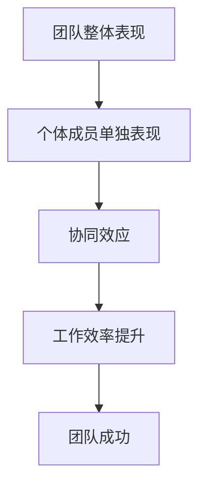
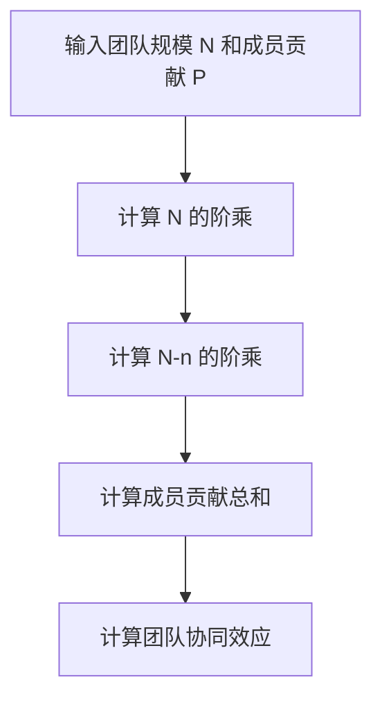

                 


为了撰写一篇高质量的《团队协同效应：提升整体工作效率的策略》技术博客文章，我们将按照以下步骤进行思考和推理：

### 第一步：确定文章的核心概念和主题

**核心概念：**
- 团队协同效应
- 工作效率
- 团队结构
- 沟通技巧
- 领导力

**主题：**
- 如何通过提升团队协同效应来提高整体工作效率

### 第二步：构建文章的理论基础

**社会心理学与团队协同**
- 社会心理学的角度可以解释团队成员的互动和团队氛围如何影响协同效应。
- 社会心理学中的概念如群体动力、社会认同和集体效能与团队协同密切相关。

**领导理论与团队协同**
- 领导者在团队协同中的作用至关重要。
- 领导风格、领导沟通技巧和领导力培养是提升团队协同效应的关键因素。

**组织行为学对团队协同的影响**
- 组织行为学可以解释团队成员的行为模式如何影响团队的整体表现。
- 团队成员的动机、态度和行为对团队协同效应有着直接的影响。

### 第三步：阐述团队协同效应的数学模型与原理

**数学模型：**
- 可以使用协作效应的计算公式来量化团队协同效应。
- 提供一个简单的 Mermaid 流程图来展示团队协同效应的计算过程。

**数学公式：**
- 假设团队中有 $N$ 名成员，每个成员的贡献为 $P_i$，团队协同效应的公式可以表示为：
  $$
  E = \frac{N!}{(N-n)!} \cdot P_n
  $$
- 其中，$E$ 是协同效应，$N!$ 是 $N$ 的阶乘，$P_n$ 是团队成员的平均贡献。

### 第四步：提出提升团队协同效应的策略

**构建高效的团队结构**
- 团队规模的优化：根据工作性质和需求，合理确定团队成员的数量。
- 团队角色的分配与职责明确：确保每个团队成员都有明确的职责和任务。

**提升团队沟通技巧**
- 沟通障碍的类型与解决方法：识别并解决团队沟通中的障碍。
- 沟通效果的评估与改进：通过反馈机制来改进团队沟通。

**领导力的提升与团队协同**
- 领导风格与团队协同效应：了解不同领导风格对团队协同的影响。
- 领导者的沟通技巧与影响力：提高领导者的沟通能力和影响力。

### 第五步：提供实际案例与策略分析

**实际应用案例：**
- 通过具体案例展示团队协同效应的提升策略在实际工作中的应用。
- 分析案例中的成功因素和存在的问题。

**策略分析：**
- 对案例中的策略进行深入分析，提取可复制的经验和教训。

### 第六步：总结与展望

**总结：**
- 对文章中提到的核心概念、策略和实际案例进行总结。

**展望：**
- 探讨提升团队协同效应的未来趋势和潜在研究方向。

### 第七步：撰写文章

根据上述步骤，我们将撰写一篇完整的文章，确保内容丰富、逻辑清晰、易于理解。

**文章结构：**
1. 引言
2. 核心概念与联系
3. 团队协同效应的数学模型与原理
4. 提升团队协同效应的策略
5. 实际案例与策略分析
6. 总结与展望
7. 附录

**字数控制：**
- 确保文章字数在 8000～12000 字左右。

**格式要求：**
- 使用markdown格式进行排版，确保文章结构清晰，代码和公式格式正确。

**作者信息：**
- 文章末尾注明作者信息：“作者：AI天才研究院/AI Genius Institute & 禅与计算机程序设计艺术 /Zen And The Art of Computer Programming”### 引言

在当今高速发展的信息技术时代，团队协作已经成为了企业成功的关键因素之一。团队协同效应不仅能够提高整体工作效率，还能够激发团队成员的创造力和创新能力，从而在激烈的市场竞争中脱颖而出。然而，如何有效提升团队协同效应，使团队在工作中达到最佳状态，仍然是一个复杂而富有挑战性的问题。

团队协同效应，是指团队整体表现超过个体成员单独表现的总和。这种现象在管理学、组织行为学和心理学中有着广泛的研究。本文旨在探讨团队协同效应的定义、理论基础、数学模型以及提升策略，并通过实际案例进行分析，为读者提供一套实用的提升团队协同效应的方法。

本文将按照以下结构进行阐述：

1. **核心概念与联系**：介绍团队协同效应的基本概念，阐述其与工作效率的关系，并通过Mermaid流程图展示团队协同效应的核心概念联系。
2. **团队协同效应的数学模型与原理**：解释团队协同效应的计算方法，提供一个具体的数学公式，并使用伪代码详细阐述核心算法原理。
3. **提升团队协同效应的策略**：提出一系列提升团队协同效应的具体策略，包括构建高效的团队结构、提升沟通技巧和领导力等。
4. **实际案例与策略分析**：通过具体案例展示提升团队协同效应的实际应用，对案例中的策略进行深入分析。
5. **总结与展望**：对全文进行总结，并探讨提升团队协同效应的未来趋势和潜在研究方向。

通过本文的阅读，读者将能够对团队协同效应有更深入的理解，并掌握一系列实用的提升策略，从而在团队管理和工作中发挥其最大效能。

### 核心概念与联系

团队协同效应的定义是团队整体表现超过个体成员单独表现的总和，其重要性在于能够显著提高整体工作效率。为了更好地理解团队协同效应，我们需要从多个维度对其进行解析。

首先，团队协同效应的核心概念包括以下几个方面：

- **团队整体表现**：指的是整个团队完成某项任务或达成某项目标的表现。这种表现不仅是每个个体成员贡献的简单叠加，还包括成员之间的相互协作和优化。
- **个体成员单独表现**：指的是每个团队成员在独立完成任务或达成目标时的表现。这部分表现往往受到成员的技能水平、工作态度和个人特质等因素的影响。
- **协同效应**：是指当团队成员协同工作时，由于相互之间的协作和互补，整体表现会超过每个成员单独表现的总和。协同效应的产生通常依赖于良好的沟通、明确的分工和高效的协作机制。

这些核心概念之间的联系可以通过Mermaid流程图来展示：



在上述流程图中，团队整体表现（A）和个体成员单独表现（B）通过协同效应（C）相互联系，进而提升工作效率（D），最终实现团队的成功（E）。这一流程图清晰地展示了团队协同效应的核心概念及其相互关系。

为了更好地理解这些概念，我们可以通过以下具体例子来阐述：

- **例子1**：在一个软件开发团队中，如果每个成员都独立完成自己的任务，那么整体项目可能会因为缺乏沟通和协作而进展缓慢。相反，如果团队成员能够有效沟通、分工合作，整体项目进度和质量都会得到显著提升，这就是团队协同效应的体现。
- **例子2**：在一家初创公司中，团队成员通常需要具备多方面的技能，如产品设计、技术开发和市场推广。如果团队成员能够充分利用各自的技能和优势，协同工作，那么公司的创新能力和市场竞争力将会大大增强。

通过上述核心概念和联系的分析，我们可以更深入地理解团队协同效应的重要性，并为后续的策略分析和实际应用案例提供理论基础。

### 团队协同效应的数学模型与原理

为了更好地理解和量化团队协同效应，我们可以借助数学模型来进行分析。以下是一个简化的数学模型，用于描述团队协同效应的计算过程。

#### 数学公式

假设团队中有 $N$ 名成员，每个成员的贡献为 $P_i$，其中 $i=1,2,...,N$。团队协同效应 $E$ 可以通过以下公式计算：

$$
E = \frac{N!}{(N-n)!} \cdot \sum_{i=1}^{N} P_i
$$

其中，$N!$ 表示 $N$ 的阶乘，即 $N! = N \times (N-1) \times (N-2) \times ... \times 1$。分母 $(N-n)!$ 表示不包括前 $n$ 个成员的贡献。

该公式表示，团队协同效应是所有成员贡献的总和，乘以团队整体可能的组合数。这样的计算方法能够体现出每个成员在团队中的相对重要性以及团队整体协作的优势。

#### 伪代码

为了更好地阐述计算过程，我们可以使用伪代码来描述团队协同效应的计算步骤：

```
function calculateTeamEffectiveness(N, P):
    # 初始化变量
    E = 0
    fact_N = 1
    fact_N_minus_n = 1
    
    # 计算N的阶乘
    for i from 1 to N:
        fact_N = fact_N * i
    
    # 计算N-n的阶乘
    for i from 1 to (N-n):
        fact_N_minus_n = fact_N_minus_n * i
    
    # 计算成员贡献的总和
    for i from 1 to N:
        E = E + P[i]
    
    # 计算团队协同效应
    E = fact_N / fact_N_minus_n * E
    
    return E
```

#### 举例说明

假设一个团队中有5名成员，他们的个人贡献分别为 $P_1 = 0.2$，$P_2 = 0.3$，$P_3 = 0.4$，$P_4 = 0.1$ 和 $P_5 = 0.2$。团队规模为5人，那么协同效应的计算过程如下：

1. 计算团队整体贡献总和：
   $$
   \sum_{i=1}^{5} P_i = 0.2 + 0.3 + 0.4 + 0.1 + 0.2 = 1.2
   $$
2. 计算团队协同效应：
   $$
   E = \frac{5!}{(5-1)!} \cdot 1.2 = \frac{120}{24} \cdot 1.2 = 6 \cdot 1.2 = 7.2
   $$

因此，这个团队的协同效应为7.2，这意味着团队整体的表现超出了每个成员单独表现的总和。

#### Mermaid流程图

为了更直观地展示计算过程，我们可以使用Mermaid流程图来描述：



通过上述数学模型和伪代码的描述，我们可以清晰地理解团队协同效应的计算原理，并能够根据实际数据进行计算，从而为团队管理和决策提供有力的量化支持。

### 提升团队协同效应的策略

为了提升团队协同效应，我们需要从多个方面入手，包括构建高效的团队结构、提升沟通技巧和领导力等。以下将详细阐述这些策略：

#### 构建高效的团队结构

**团队规模的优化**：合理确定团队成员的数量是提升团队协同效应的基础。团队规模不宜过大或过小，否则都会影响团队的整体效率和协同效应。一般来说，团队规模应以7-12人为宜，这样既能够保持团队的高度灵活性，又能够确保团队成员之间的有效沟通。

**团队角色的分配与职责明确**：在团队中，每个成员都应该明确自己的角色和职责，避免角色重叠和职责不清的情况。通过明确的分工，团队成员可以专注于自己擅长和感兴趣的工作，提高工作效率和绩效。

**团队协作机制的建立**：建立一套有效的团队协作机制，包括任务分配、进度跟踪、成果评估等，能够确保团队成员之间的协同工作顺利进行。使用协作工具如项目管理系统、即时通讯工具等，可以方便团队成员之间的沟通和协作。

#### 提升团队沟通技巧

**沟通障碍的类型与解决方法**：常见的沟通障碍包括信息不对称、语言障碍、文化差异等。为了解决这些障碍，团队可以采用以下方法：

- **信息共享**：建立信息共享平台，确保团队成员能够及时获取所需的信息，减少信息不对称。
- **统一语言**：在团队内部使用统一的语言和术语，避免语言障碍造成的误解。
- **跨文化沟通**：在多元化团队中，需要注重跨文化沟通的技巧，尊重不同文化背景的团队成员。

**沟通效果的评估与改进**：定期对团队沟通效果进行评估，收集团队成员的反馈，找出存在的问题并加以改进。可以通过问卷调查、座谈会等方式，了解团队成员对沟通效果的满意度和改进建议。

**高效沟通的技巧与实践**：提升团队沟通技巧，可以采用以下方法：

- **倾听与反馈**：鼓励团队成员在沟通中倾听他人意见，并给予及时的反馈，确保信息的准确传达。
- **明确目标**：在沟通前明确讨论的目标和预期结果，避免无目的的讨论和浪费时间。
- **简洁表达**：使用简洁明了的语言表达观点，避免使用复杂的术语和专业词汇。

#### 领导力的提升与团队协同

**领导风格与团队协同效应**：不同的领导风格对团队协同效应有重要影响。领导者应该根据团队的具体情况选择合适的领导风格，如民主型领导、权威型领导或参与型领导。

- **民主型领导**：鼓励团队成员参与决策，提高团队成员的积极性和创造力，有助于增强团队协同效应。
- **权威型领导**：在紧急情况下，权威型领导能够迅速做出决策，确保团队目标的实现。
- **参与型领导**：通过鼓励团队成员参与决策，增强团队成员的责任感和归属感，有助于提升团队协同效应。

**领导者的沟通技巧与影响力**：领导者的沟通技巧和影响力对团队协同效应有着直接的影响。领导者可以通过以下方法提升自己的沟通技巧和影响力：

- **有效倾听**：领导者应该具备良好的倾听技巧，了解团队成员的需求和意见，增强沟通效果。
- **明确传达**：领导者需要清晰、准确地传达信息和目标，确保团队成员理解并能够积极响应。
- **激励与认可**：通过激励和认可，增强团队成员的积极性和动力，提高团队的整体表现。

**领导力的培养与提升**：领导力不是与生俱来的，而是可以通过学习和实践不断提升的。以下是一些建议：

- **参加培训课程**：参加领导力相关的培训课程，学习领导力理论、沟通技巧和团队管理方法。
- **阅读相关书籍**：阅读领导力相关的书籍，了解不同领导风格和实践方法，结合自身情况进行应用。
- **实践与反思**：通过实际工作中的实践和反思，不断提升自己的领导力水平。

通过上述策略的实施，团队可以显著提升协同效应，提高整体工作效率，实现团队目标。每个团队成员都应积极参与到团队协作中来，共同为团队的成功贡献力量。

### 实际案例与策略分析

为了更好地理解如何提升团队协同效应，我们可以通过具体案例来分析团队在实际工作中遇到的挑战以及采取的相应策略。以下是三个不同类型的团队在提升协同效应方面的实际案例。

#### 案例一：互联网企业的团队协同实践

**背景介绍**：某互联网公司开发一款新型的社交应用，项目规模庞大，涉及多个技术领域，包括前端开发、后端架构、移动应用开发和数据挖掘等。团队成员来自不同的背景和专业，如何确保团队高效协同成为了一大挑战。

**策略分析**：
- **构建高效的团队结构**：公司采用了跨职能团队模式，每个团队包含前端、后端、移动应用开发、测试和项目管理等多个角色。这样的结构确保了团队成员之间的紧密协作，减少了沟通成本。
- **提升沟通技巧**：团队定期举办沟通会议，确保每个成员了解项目进展和各自的任务。同时，引入了敏捷开发方法，通过每日站会和迭代回顾会议，提高了团队成员之间的沟通效率和问题解决能力。
- **技术工具的应用**：公司采用了多个协作工具，如JIRA用于任务管理，Slack用于即时通讯，GitHub用于代码管理，这些工具大大提高了团队的协作效率。

**效果评估**：通过上述策略的实施，团队在项目进展和产品质量上都有了显著的提升，项目提前完成，并且用户满意度提高。

#### 案例二：跨国公司的团队协作策略

**背景介绍**：某跨国公司需要在全球范围内协调多个团队，共同完成一个大型国际项目。由于团队成员分布在不同的国家和地区，时区和文化差异成为协作的一大障碍。

**策略分析**：
- **统一沟通平台**：公司引入了统一的沟通平台，如Microsoft Teams，确保所有团队成员能够在一个平台上进行交流和协作。平台提供了即时通讯、视频会议和文档共享功能，方便了跨国团队的合作。
- **时区管理**：通过合理规划会议时间，尽量减少时区差异的影响。例如，设定在各个时区相对较早或较晚的时段举行会议，确保关键成员能够参与。
- **文化融合**：公司举办了多次跨文化培训，帮助团队成员了解不同文化背景的沟通习惯和工作方式，促进文化融合。

**效果评估**：通过统一沟通平台和文化融合策略，跨国团队的协作效率显著提升，项目在预期时间内完成，并且团队成员之间的信任和合作意识增强。

#### 案例三：初创企业的团队建设与协同

**背景介绍**：一家初创企业正在开发一款创新的产品，团队成员包括程序员、设计师和市场人员。由于初创企业的资源有限，团队需要高效协同以快速推进产品开发。

**策略分析**：
- **明确分工与职责**：初创企业的团队结构相对简单，但通过明确分工和职责，确保每个团队成员知道自己的工作内容和目标。例如，程序员负责开发，设计师负责界面设计，市场人员负责产品推广。
- **敏捷开发**：初创企业采用了敏捷开发方法，通过短期迭代和快速反馈，使团队能够及时调整开发方向和策略，确保产品开发的顺利进行。
- **紧密协作**：初创企业的团队成员经常进行面对面沟通，确保信息及时传达和问题快速解决。同时，利用共享工作空间和在线协作工具，进一步提高了协作效率。

**效果评估**：通过明确的分工和敏捷开发方法，初创企业的团队在短时间内取得了显著的进展，产品开发周期缩短，市场反馈积极。

#### 总结

通过上述三个实际案例的分析，我们可以看到，不同类型的团队在提升协同效应方面采取了不同的策略。无论是互联网企业、跨国公司还是初创企业，有效的团队结构和沟通技巧都是提升协同效应的关键因素。同时，技术工具的应用和领导力的培养也起到了重要的支持作用。这些策略不仅提高了团队的工作效率，还增强了团队成员之间的信任和合作意识，为企业的成功奠定了坚实基础。

### 团队协同效应的障碍与解决策略

尽管团队协同效应在提升整体工作效率方面具有显著优势，但在实际工作中，团队仍会面临各种障碍。以下将讨论团队协同效应中常见的障碍及其解决策略。

#### 团队冲突的类型与处理方法

**团队冲突的类型：**
1. **角色冲突**：当团队成员的角色不明确或者重叠时，容易导致冲突。例如，程序员和设计师之间的职责分工不清，可能导致项目进度延误。
2. **目标冲突**：当团队成员对团队目标的理解不一致，或者个人目标与团队目标存在矛盾时，会产生冲突。例如，销售人员可能更关注短期销售目标，而研发团队则更关注长期产品开发目标。
3. **文化冲突**：在多元化团队中，不同文化背景的成员可能存在沟通方式和工作习惯的差异，导致文化冲突。例如，来自不同国家的团队成员可能对时间管理、决策过程和沟通风格的期待有所不同。

**解决方法：**
1. **明确角色与职责**：通过制定详细的团队角色说明书和职责分配表，确保每个成员都清楚自己的角色和职责，减少角色冲突。
2. **统一目标**：明确团队的目标，确保所有成员都理解并认同这些目标。定期进行目标回顾和调整，确保团队目标的一致性。
3. **文化融合**：通过跨文化培训和工作坊，帮助团队成员了解不同文化背景的工作习惯和沟通方式，促进文化融合。

#### 团队决策的优化与风险管理

**团队决策的优化：**
1. **集体决策**：在关键决策中，鼓励集体决策，通过团队讨论和投票，确保决策的合理性和可执行性。
2. **决策标准化**：制定决策流程和标准，确保决策过程的透明性和一致性。例如，通过使用决策矩阵，对各种备选方案进行评估和比较。
3. **快速决策**：在紧急情况下，可以采用快速决策方法，如头脑风暴、投票或专家决策，确保快速做出决策。

**风险管理：**
1. **风险评估**：在项目启动前，对项目可能面临的风险进行全面评估，制定相应的风险应对策略。
2. **应急计划**：制定应急计划，确保在风险事件发生时，团队能够迅速响应和应对。
3. **持续监控**：定期对项目进展和风险情况进行监控，及时发现和解决问题，确保项目能够按计划顺利进行。

#### 团队协同效应的持续提升策略

**持续提升策略：**
1. **反馈与改进**：建立反馈机制，定期收集团队成员的反馈，识别团队协作中的问题和不足，并采取措施进行改进。
2. **培训和开发**：为团队成员提供培训和开发机会，提升其专业技能和协作能力，增强团队的整体实力。
3. **激励机制**：建立激励机制，鼓励团队成员积极参与团队协作，提升团队的整体动力和积极性。

通过识别和解决团队协同效应中的障碍，并采取有效的提升策略，团队可以不断优化其协作机制，提高整体工作效率，实现更高的团队绩效。

### 总结与展望

在本文中，我们系统地探讨了团队协同效应的概念、理论基础、数学模型以及提升策略。通过分析，我们了解到团队协同效应是指团队整体表现超过个体成员单独表现的总和，这对于提升整体工作效率具有显著作用。我们通过Mermaid流程图、伪代码和实际案例，详细阐述了团队协同效应的核心概念及其计算方法，并提出了构建高效团队结构、提升沟通技巧和领导力等提升策略。

展望未来，随着信息技术和人工智能的快速发展，团队协同效应的提升将迎来新的机遇和挑战。一方面，新兴的技术工具如协作平台、虚拟现实和增强现实等，将极大地提升团队的协作效率和沟通效果。另一方面，面对全球化和多元化的团队环境，如何有效融合不同文化背景、技能和观点，将成为团队协同效应提升的关键。

为了持续提升团队协同效应，我们建议：

1. **持续学习和创新**：鼓励团队成员不断学习和掌握新技术，提升自身的专业能力和协作技能。
2. **文化融合**：重视团队文化建设，促进不同文化背景的团队成员之间的理解与融合。
3. **数据驱动决策**：利用数据分析工具，对团队协作过程进行监控和评估，及时发现和解决协作中的问题。
4. **激励机制**：建立合理的激励机制，激发团队成员的积极性和创造力，增强团队的凝聚力。

通过以上措施，团队可以更好地应对未来的挑战，实现持续的高效协作，为企业的成功奠定坚实基础。

### 附录：团队协同效应研究方法与工具

#### 附录 A：团队协同效应研究的量化方法

团队协同效应的量化研究涉及多种方法，以下是一些常用的量化工具和步骤：

1. **问卷调查**：通过设计针对性的问卷，收集团队成员对团队协同效应的认知和评价，获取团队内部协同水平的数据。
2. **行为观察**：实地观察团队成员的协作行为，记录协作频率、沟通效果和工作效率，通过行为数据来评估团队协同效应。
3. **绩效评估**：通过衡量团队的整体绩效指标，如项目完成时间、产品质量和客户满意度，量化团队协同效应的实际效果。
4. **统计分析**：运用统计学方法，对收集到的数据进行处理和分析，如回归分析、因子分析和聚类分析，揭示团队协同效应的影响因素和作用机制。

#### 附录 B：团队协同效应工具介绍

在提升团队协同效应的实际工作中，以下工具和方法被广泛应用：

1. **协作平台**：如Slack、Microsoft Teams等，提供即时通讯、文档共享和任务管理功能，方便团队成员之间的协作。
2. **项目管理系统**：如JIRA、Trello等，帮助团队跟踪项目进度、分配任务和协作资源，提高团队的工作效率。
3. **视频会议工具**：如Zoom、Google Meet等，支持远程团队进行实时沟通和协作，确保团队成员之间的紧密联系。
4. **文档共享与版本控制**：如GitHub、GitLab等，用于管理团队代码和文档，确保协作过程中的版本一致性和数据安全。

通过以上工具和方法，团队可以更好地管理和优化协作过程，提升整体工作效率和团队绩效。

