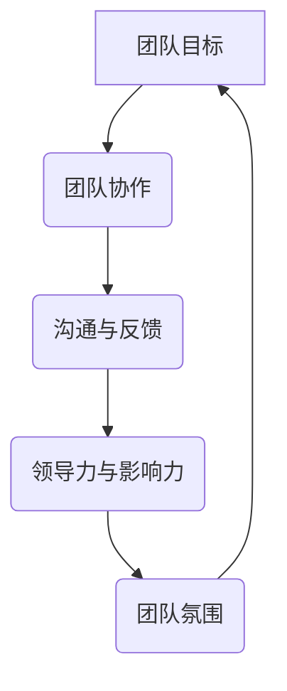
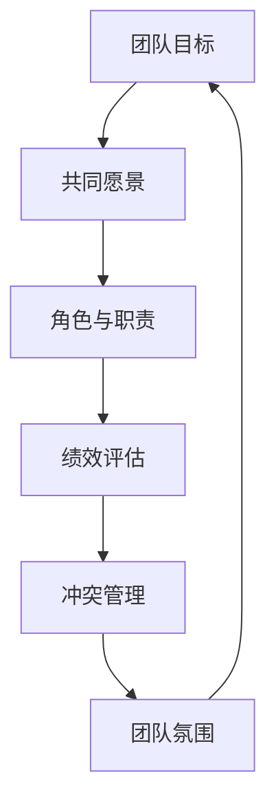
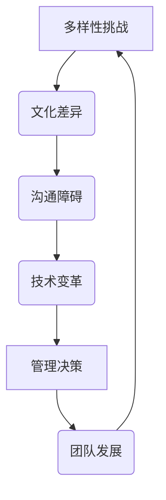
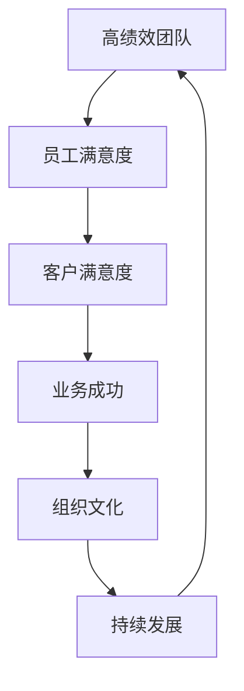

                 


### 深度思考：团队协同与团队绩效的关系

在讨论团队协同与团队绩效的关系时，我们必须明确团队协同不仅仅是团队成员之间的简单互动，而是一个复杂而动态的系统。团队协同与团队绩效之间存在着紧密的相互关系，这种关系可以通过以下几个维度来深入探讨。

#### 一、团队协同对团队绩效的直接影响

团队协同的有效性直接决定了团队的整体绩效。一个高效的团队协同系统可以：

1. **提高决策效率**：通过有效的沟通和协调，团队成员能够在短时间内达成共识，快速作出决策，从而减少不必要的时间浪费。
2. **提升工作质量**：团队成员之间的紧密协作可以确保工作的每个环节都能得到高质量的执行，从而提高整体项目的完成质量。
3. **减少错误和返工**：通过定期的反馈和沟通，团队成员能够及时发现并纠正工作中的错误，避免重复劳动，降低返工率。

#### 二、团队绩效对团队协同的反馈作用

团队绩效不仅是团队协同的结果，同时也对团队协同产生反馈。高绩效的团队往往具有以下特点：

1. **持续改进的文化**：高绩效的团队往往注重持续改进，他们会不断评估和优化团队协同的方法，以确保协同效率不断提升。
2. **更高的员工满意度**：高绩效的团队通常能够提供更好的工作环境和职业发展机会，这会提高员工的工作满意度和忠诚度，从而增强团队协同的效果。
3. **积极的团队氛围**：高绩效的团队往往拥有积极向上的团队氛围，这种氛围会激励团队成员更积极地参与团队协作，提高协同效率。

#### 三、协同与绩效的数学模型

为了更好地理解团队协同与团队绩效之间的关系，我们可以通过数学模型来描述这一过程。

假设团队绩效 \( P \) 是团队协同 \( C \) 的函数，即 \( P = f(C) \)。团队协同又可以分解为沟通 \( M \)、协作 \( W \) 和反馈 \( F \) 的综合效应，即 \( C = g(M, W, F) \)。我们可以建立如下模型：

$$
P = f(g(M, W, F))
$$

- **沟通 \( M \)**：沟通的质量直接影响团队的信息流动效率。假设沟通效率 \( \eta_M \) 取决于沟通渠道的质量和团队成员的沟通技能，即 \( M = \eta_M \cdot H \)，其中 \( H \) 代表沟通渠道。
- **协作 \( W \)**：协作效率 \( \eta_W \) 取决于团队成员之间的配合度和工作分工的合理性，即 \( W = \eta_W \cdot D \)，其中 \( D \) 代表分工。
- **反馈 \( F \)**：反馈的及时性和准确性对团队协同的调整至关重要。假设反馈效率 \( \eta_F \) 取决于团队成员对反馈的响应速度和处理能力，即 \( F = \eta_F \cdot R \)，其中 \( R \) 代表反馈机制。

将这些因素结合起来，我们可以得到团队协同的详细模型：

$$
C = g(\eta_M \cdot H, \eta_W \cdot D, \eta_F \cdot R)
$$

最终，团队绩效可以表示为：

$$
P = f(g(\eta_M \cdot H, \eta_W \cdot D, \eta_F \cdot R))
$$

通过这个模型，我们可以看到，团队协同的每一个组成部分都对团队绩效产生直接影响，而且这些影响是通过复杂的相互作用和反馈机制实现的。

### 举例说明：沟通效率对团队绩效的影响

为了更直观地理解沟通效率对团队绩效的影响，我们可以通过一个简单的例子来说明。

假设一个项目团队由5名成员组成，他们需要完成一个复杂的软件开发任务。团队的目标是确保项目在预定时间内高质量地完成。

1. **初始状态**：团队成员之间的沟通渠道有限，沟通技能也参差不齐，导致信息流动效率较低。假设沟通效率 \( \eta_M \) 为0.5。

2. **改进措施**：团队引入了高效的沟通工具，并进行了沟通技能培训，沟通效率提高到 \( \eta_M \) 为0.8。

3. **结果分析**：随着沟通效率的提高，团队成员能够更快速地理解项目需求，减少了误解和冲突。决策效率也显著提高，项目进度加快。最终，项目提前两周完成，且质量符合预期。

通过这个例子，我们可以看到，提升沟通效率对团队绩效的正面影响。沟通是团队协同的核心，高效的沟通不仅能提高工作效率，还能增强团队凝聚力，从而推动团队绩效的不断提升。

### 结论

团队协同与团队绩效之间的关系是相辅相成的。一个高效的团队协同系统能够显著提升团队绩效，而优秀的团队绩效又会反过来增强团队协同的效果。通过数学模型的建立，我们可以更深入地理解这种关系的复杂性。在实际操作中，我们需要关注团队沟通、协作和反馈的每一个环节，不断优化团队协同的方法，从而实现团队绩效的持续提升。

在接下来的章节中，我们将进一步探讨团队协同中的关键挑战，以及如何通过有效的策略和工具来解决这些问题。希望通过本文的探讨，能够为读者提供有价值的见解和实践指导。


-------------------------------------------------------------------

# 文章标题：团队协同：打造高绩效团队的秘诀

> 关键词：团队协同、团队绩效、沟通、协作、反馈、高绩效团队

> 摘要：本文深入探讨了团队协同与团队绩效之间的关系，通过理论分析和实际案例，揭示了高效团队协同的关键要素。本文旨在为读者提供一套系统的团队协同方法论，帮助读者在复杂的团队环境中打造高绩效团队，实现组织的持续成功。

---

## 引言

在当今快速变化和高度竞争的商业环境中，团队协作已成为组织成功的关键因素之一。一个高效的团队不仅能够迅速响应市场需求，还能在复杂的项目中保持高质量的工作水平。然而，打造一个高绩效团队并非易事，它需要明确的团队协同策略和持续的努力。本文将探讨团队协同的核心概念、算法原理，以及与团队绩效的紧密关系，旨在为读者提供一套系统的团队协同方法论。

本文结构如下：

1. **核心概念与联系**：介绍团队协同的基础概念，并展示这些概念之间的联系。
2. **核心算法原理讲解**：深入讲解团队协同中的核心算法原理，使用伪代码进行阐述。
3. **团队协同与团队绩效的关系**：探讨团队协同对团队绩效的直接影响，以及团队绩效对团队协同的反馈作用，并通过数学模型进行分析。
4. **项目实战**：通过实际案例，展示如何在实际项目中应用团队协同方法，实现高绩效团队。
5. **最佳实践与总结**：总结团队协同的最佳实践，并提供实用的小结、注意事项和拓展阅读。

---

## 核心概念与联系

### 1.1 团队协同基础

#### 1.1.1 团队协同概述

团队协同是一个复杂而动态的系统，它涉及团队成员之间的沟通、协作和反馈。有效的团队协同不仅能够提高工作效率，还能增强团队凝聚力，从而提升整体绩效。以下是一个简化的团队协同流程图，展示了关键环节之间的关系：



#### 1.1.2 关键概念联系

团队协同的各个核心概念之间存在着紧密的联系。以下是一个扩展的流程图，展示了这些概念之间的互动关系：



#### 1.1.3 团队协同的挑战与机遇

在实际操作中，团队协同面临着诸多挑战，如文化差异、沟通障碍、技术变革等。然而，这些挑战同时也带来了机遇，通过有效的管理策略，可以转化为团队发展的动力。以下是一个简化的挑战与机遇关系图：



#### 1.1.4 团队协同的重要性

团队协同对高绩效团队的形成至关重要。以下是一个简化的团队协同与高绩效团队关系图，展示了团队协同如何影响团队绩效：



### 1.2 核心算法原理讲解

团队协同不仅需要理论指导，更需要实际操作的方法和工具。以下我们将介绍团队协同中的核心算法原理，并使用伪代码进行详细阐述。

#### 1.2.1 沟通与反馈算法原理

沟通和反馈是团队协同的基础。有效的沟通可以确保信息的准确传递，而及时的反馈可以促进团队成员之间的理解和协作。

##### 1.2.1.1 沟通模型

```python
def communication_model(sender, receiver, message):
    # Sender encodes the message
    encoded_message = encode_message(message)
    
    # Message is transmitted
    transmitted_message = transmit_message(encoded_message)
    
    # Receiver decodes the message
    decoded_message = decode_message(transmitted_message)
    
    # Feedback loop
    feedback = receiver.feedback_on_message(decoded_message)
    
    return feedback
```

##### 1.2.1.2 反馈机制

```python
def feedback_mechanism(response, evaluation):
    # Evaluate the response
    evaluation_score = evaluate_response(response)
    
    # Provide feedback
    feedback = generate_feedback(evaluation_score)
    
    return feedback
```

##### 1.2.1.3 沟通效率优化

```python
def optimize_communication(channel, noise_level):
    # Select optimal channel based on noise level
    optimal_channel = select_channel(channel, noise_level)
    
    # Apply error correction techniques
    corrected_message = apply_error_correction(optimal_channel)
    
    return corrected_message
```

#### 1.2.2 协作与冲突管理算法原理

协作和冲突管理是团队协同的重要组成部分。有效的协作可以提升团队的工作效率，而合理的冲突管理可以促进团队的持续改进。

##### 1.2.2.1 协作机制

```python
def collaboration_mechanism(role, task, resources):
    # Assign roles and tasks
    assigned_role = assign_role(role, task)
    
    # Allocate resources
    allocated_resources = allocate_resources(resources)
    
    # Monitor progress
    progress = monitor_progress(assigned_role, allocated_resources)
    
    return progress
```

##### 1.2.2.2 冲突管理

```python
def conflict_management(conflict, participants):
    # Analyze conflict
    conflict_analy

