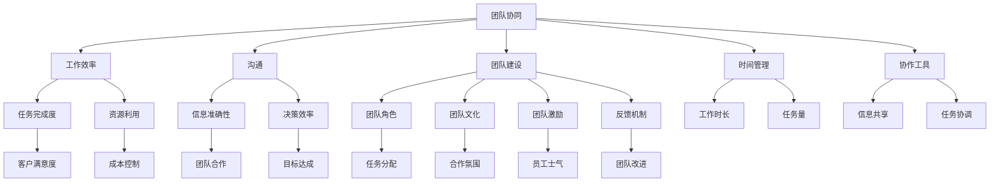

                 

### 背景介绍

在现代企业和组织中，团队合作已成为提升工作效率和实现业务目标的关键因素。随着全球化进程的加快、市场竞争的加剧以及技术的迅速发展，企业需要具备快速响应和灵活调整的能力，而这离不开高效的团队协同。然而，当前许多企业在团队协作中仍面临诸多挑战，如沟通障碍、资源分配不合理、工作流程不顺畅等，这些问题严重影响了团队的工作效率和整体绩效。

本文旨在探讨团队协同的重要性和提升团队工作效率的有效策略。通过系统地分析团队协同的基本理论、实践方法和成功案例，本文希望能够为企业和团队提供有价值的参考和指导，帮助他们在实际工作中更好地实现团队协同，从而提升整体工作效率。

在接下来的内容中，我们将首先介绍团队协同的基本理论，包括其概念、原则和模型。接着，我们将深入探讨团队协同中的沟通问题，包括沟通障碍及解决方法，以及有效沟通的技巧。随后，本文将重点讨论团队建设的相关内容，如团队角色的定位、激励和反馈机制。在实践篇中，我们将介绍时间管理和协作工具的使用方法，以及如何在工作中有效应用这些策略。最后，通过成功案例的分析，我们将总结团队协同的最佳实践策略，并提供未来优化团队协同的思路。

通过本文的逐步分析和讲解，读者将能够系统了解团队协同的理论和实践，掌握提升团队工作效率的关键技巧，并在实际工作中灵活应用这些策略，从而实现团队的高效协同和业务的持续增长。

### 核心概念与联系

在深入探讨团队协同之前，我们需要明确几个核心概念，并理解它们之间的相互关系，这将为后续内容的讨论提供坚实的理论基础。

#### 团队协同的概念

团队协同指的是团队成员之间为了共同的目标而进行的协作与配合。它不仅涉及团队成员之间的沟通与协作，还涉及角色分配、任务分工以及资源整合。一个高效的团队协同可以显著提升团队的执行力、创造力和整体绩效。

#### 工作效率

工作效率是指完成特定任务所需的时间和资源的效率。它是一个衡量团队或个人工作成果的重要指标。提升工作效率不仅能够缩短项目周期，减少资源浪费，还能够提高员工的满意度和成就感。

#### 沟通

沟通是团队协同的核心组成部分，它指的是信息、思想和情感在团队成员之间的传递。有效的沟通能够确保信息的准确传达，减少误解和冲突，提高决策质量和执行效率。

#### 团队建设

团队建设是指通过一系列措施和活动来提高团队的整体能力和协同效率。它包括团队角色的明确、团队文化的培养、团队激励和反馈机制的建设等。

#### 时间管理

时间管理是指通过合理安排时间、优化工作流程和有效利用资源来提高工作效率。良好的时间管理能够确保团队成员在有限的时间内完成更多的任务，减少拖延和浪费时间的情况。

#### 协作工具

协作工具是指用于支持团队协作和信息共享的软件和硬件。这些工具包括电子邮件、即时通讯软件、项目管理工具、文档共享平台等，它们能够提高团队协作的效率，减少信息传递的延迟。

#### 关系架构

为了更好地理解这些核心概念之间的相互关系，我们可以使用Mermaid流程图来展示它们之间的联系：



通过这个Mermaid流程图，我们可以清晰地看到各个核心概念之间的关联。团队协同是提升工作效率的基础，而工作效率又与任务完成度和资源利用密切相关。沟通、团队建设、时间管理和协作工具则是实现团队协同的重要手段和工具。

理解这些核心概念及其相互关系，将帮助我们在后续内容中更好地探讨团队协同的理论和实践，并为实际工作中的应用提供有力的指导。

### 核心算法原理讲解

在深入理解团队协同的核心概念之后，接下来我们将详细讲解一些核心算法原理，包括数学模型、伪代码以及具体实现方法。这些算法原理不仅能够帮助我们更有效地理解团队协同的机制，还能在实际应用中提供技术支持。

#### 时间分配模型

时间分配模型是团队协同中的一个重要组成部分，它用于合理分配团队成员的时间，以确保任务能够在规定的时间内完成。以下是一个常见的时间分配模型：

**数学模型：**

设 \( T \) 为总工作时间，\( N \) 为团队成员数，\( T_i \) 为第 \( i \) 个成员的工作时间，则有：

\[ T = \sum_{i=1}^{N} T_i \]

同时，为每个成员分配的任务量应与其工作效率 \( E_i \) 成正比，即：

\[ T_i = \frac{E_i}{\sum_{j=1}^{N} E_j} \cdot T \]

其中，\( E_i \) 表示第 \( i \) 个成员的工作效率。

**伪代码：**

```plaintext
// 输入：总工作时间T，团队成员效率数组E
// 输出：每个成员分配的时间数组T_i

function distributeTime(T, E) {
    N = length(E)
    E_sum = sum(E)
    T_i = []

    for i from 1 to N do {
        T_i.push(E[i] / E_sum * T)
    }

    return T_i
}
```

#### 沟通效率模型

沟通效率模型用于衡量团队内部信息传递的效率。有效的沟通可以减少误解、提高决策速度。以下是一个基本的沟通效率模型：

**数学模型：**

设 \( C \) 为沟通效率，\( M \) 为信息量，\( P \) 为沟通频率，则有：

\[ C = \frac{M}{P} \]

其中，沟通频率 \( P \) 可以表示为：

\[ P = \frac{N \cdot T_i}{T} \]

即团队成员的沟通频率与总工作时间和成员时间分配成正比。

**伪代码：**

```plaintext
// 输入：总工作时间T，团队成员数N，信息量M
// 输出：沟通效率C

function calculateCommunicationEfficiency(T, N, M) {
    P = (N * T_i) / T
    C = M / P
    return C
}
```

#### 任务分配模型

在团队协同中，任务分配也是一个关键环节。合理的任务分配可以确保每个成员都能发挥其最大优势，提高整体工作效率。以下是一个任务分配模型：

**数学模型：**

设 \( T_j \) 为第 \( j \) 个任务所需的总时间，\( E_i \) 为第 \( i \) 个成员的工作效率，则任务 \( j \) 分配给成员 \( i \) 的时间为：

\[ T_{ij} = \frac{T_j \cdot E_i}{\sum_{k=1}^{N} E_k} \]

其中，\( T_{ij} \) 为任务 \( j \) 分配给成员 \( i \) 的时间，\( N \) 为团队成员数。

**伪代码：**

```plaintext
// 输入：任务时间数组T_j，团队成员效率数组E
// 输出：每个任务分配给成员的时间数组T_ij

function assignTasks(T, E) {
    N = length(E)
    T_ij = []

    for j from 1 to length(T) do {
        T_j = T[j]
        E_sum = sum(E)
        for i from 1 to N do {
            T_ij.push(T_j * E[i] / E_sum)
        }
    }

    return T_ij
}
```

通过上述数学模型和伪代码，我们可以更加具体地理解和应用时间分配、沟通效率和任务分配等核心算法原理。这些模型不仅能够帮助团队在协同工作中进行科学决策，还能通过算法优化进一步提高团队的工作效率和整体绩效。

### 数学公式和详细讲解

在团队协同中，数学模型和公式扮演着至关重要的角色，它们能够帮助我们量化评估团队的工作效率、沟通效率以及任务分配的合理性。以下是几个关键的数学公式，以及它们的详细讲解和应用。

#### 时间分配效率公式

**公式：**
\[ E_i = \frac{T_i}{T} \]

**详细讲解：**
这个公式用于计算单个成员的工作效率 \( E_i \)，其中 \( T_i \) 是成员 \( i \) 的分配时间，\( T \) 是总工作时间。通过这个公式，我们可以了解每个成员在工作中的贡献比例。

**应用举例：**
假设一个团队有5个成员，总工作时间为100小时。成员A被分配了20小时的工作时间，则其工作效率为：
\[ E_A = \frac{20}{100} = 0.2 \]
这表明成员A的工作效率占总工作效率的20%。

#### 任务完成效率公式

**公式：**
\[ \eta_j = \frac{T_j}{T_i} \]

**详细讲解：**
这个公式用于计算任务 \( j \) 的完成效率 \( \eta_j \)，其中 \( T_j \) 是任务 \( j \) 的总时间，\( T_i \) 是完成任务 \( j \) 所需的成员时间。完成效率反映了任务在团队中的执行效率。

**应用举例：**
如果任务B需要成员C工作30小时完成，而总工作时间为100小时，则任务B的完成效率为：
\[ \eta_B = \frac{30}{100} = 0.3 \]
这意味着任务B的执行效率为30%。

#### 沟通效率公式

**公式：**
\[ C = \frac{M}{P} \]

**详细讲解：**
该公式表示沟通效率 \( C \)，其中 \( M \) 是信息量，\( P \) 是沟通频率。沟通效率衡量了团队内部信息传递的效率。

**应用举例：**
在一个团队中，每天沟通的信息量是1000条，沟通频率是10次，则沟通效率为：
\[ C = \frac{1000}{10} = 100 \]
这意味着每次沟通平均传递了100条信息。

#### 任务分配公平性公式

**公式：**
\[ \alpha_i = \frac{T_i}{T} \cdot \frac{E_i}{\sum E} \]

**详细讲解：**
这个公式用于评估任务分配的公平性，其中 \( T_i \) 是成员 \( i \) 的分配时间，\( E_i \) 是成员 \( i \) 的工作效率，\( \sum E \) 是所有成员工作效率之和。公平性系数 \( \alpha_i \) 反映了成员 \( i \) 的工作时间和效率在整体分配中的权重。

**应用举例：**
在一个团队中，成员A被分配了20小时工作，效率为0.25；成员B被分配了30小时，效率为0.3。团队总工作时间是50小时，总效率是0.55。成员A的公平性系数为：
\[ \alpha_A = \frac{20}{50} \cdot \frac{0.25}{0.55} \approx 0.091 \]
成员B的公平性系数为：
\[ \alpha_B = \frac{30}{50} \cdot \frac{0.3}{0.55} \approx 0.170 \]
这表明成员B的工作分配更加公平。

通过这些数学公式和详细讲解，我们可以更科学地评估和优化团队的工作效率、沟通效率和任务分配，从而实现更高效的团队协同。

### 实际案例分析与详细讲解

在本节中，我们将通过实际案例来分析和讲解团队协同在项目中的应用，这些案例将涵盖团队建设、沟通、时间管理、协作工具使用等多个方面，以便读者能够更好地理解团队协同的实际操作和效果。

#### 案例一：跨部门项目中的团队协同

**背景：**
某公司正在开发一款新产品的应用程序，该项目涉及市场部、研发部、测试部和产品运营部等多个部门。由于各部门的工作内容和职责不同，项目协调和沟通成为了团队协同的关键。

**团队建设：**
为了确保项目顺利进行，公司首先成立了跨部门项目组，由项目经理担任组长，各部门派出一名代表作为成员。在项目启动会上，项目经理明确了各成员的角色和职责，并强调了团队合作的重要性。此外，公司还组织了一系列团队建设活动，如团队拓展训练和头脑风暴会议，以提高团队成员之间的信任和协作精神。

**沟通：**
为了解决跨部门沟通不畅的问题，项目组采用了每日站会、周例会和邮件通知等多种沟通方式。每日站会用于快速更新项目进展、解决问题和协调任务；周例会则用于总结一周的工作、制定下周计划并讨论重要议题；邮件通知则用于发布重要文档和通知。通过这些沟通方式，项目组确保了信息的及时传递和问题的高效解决。

**时间管理：**
项目组使用了Gantt图来规划项目进度，并采用时间跟踪工具（如Trello或JIRA）来监控任务完成情况。每个成员都需按时提交工作进度报告，项目经理则定期审查并调整项目计划。这种时间管理方法不仅确保了项目的按时交付，还提高了团队成员的时间利用效率。

**协作工具的使用：**
项目组采用了多种协作工具，包括Google文档、Slack和Zoom等。Google文档用于共享和编辑项目文档，Slack用于即时沟通和消息传递，Zoom用于视频会议和远程协作。这些工具使得团队成员能够随时保持沟通，并在需要时快速协调工作。

**结果：**
通过有效的团队协同，该项目在预定时间内完成了所有任务，并顺利上线。团队成员之间的协作精神和信任度显著提高，项目质量也得到了客户的高度评价。此外，通过时间管理和协作工具的应用，项目的成本和资源浪费大幅减少，整体工作效率得到了显著提升。

#### 案例二：敏捷开发团队中的团队协同

**背景：**
某互联网公司采用敏捷开发方法进行产品迭代，团队由产品经理、开发人员、UI设计师和测试人员组成。敏捷开发强调快速响应变化和持续交付价值，因此团队协同至关重要。

**团队建设：**
团队在每次迭代开始时都会进行一次回顾会议，总结上一个迭代中的优点和改进点。团队还定期进行团队建设活动，如内部培训和技术分享会，以提高团队成员的专业技能和协作能力。

**沟通：**
团队使用JIRA进行任务管理，所有任务都在JIRA中创建、分配和跟踪。每周进行一次迭代评审会议，团队共同评估当前迭代的进展和下一迭代的需求。此外，团队还使用Slack进行日常沟通，确保问题能够快速解决。

**时间管理：**
团队采用Sprint规划会议来安排每个迭代的工作任务，确保任务在Sprint周期内完成。使用Trello来跟踪任务进度，每个Sprint结束时进行一次Sprint回顾会议，总结经验和改进点。

**协作工具的使用：**
团队主要使用Git进行版本控制，GitHub或GitLab用于代码管理和协作。此外，团队还使用Visual Studio Code进行编码，以及使用Postman进行API测试。这些工具使得团队的开发和测试工作更加高效和有序。

**结果：**
通过高效的团队协同，该公司的产品能够快速迭代，及时响应市场需求。团队成员之间的沟通和协作能力显著提高，项目的交付质量和速度也得到了客户的高度认可。敏捷开发方法的成功实施，使得公司能够在竞争激烈的市场中保持优势。

通过这两个实际案例的分析，我们可以看到，团队协同在项目中的应用是多方面的，涵盖了团队建设、沟通、时间管理和协作工具使用等多个方面。有效的团队协同不仅能够提高工作效率，还能增强团队凝聚力和创新能力，从而在项目中取得更好的成果。

### 最佳实践技巧与注意事项

在团队协同过程中，为了确保高效的工作流程和最佳的效果，以下是一些最佳实践技巧和注意事项：

#### 1. 明确目标和角色

确保每个团队成员都清楚了解项目的目标和自己的角色职责。明确的目标有助于团队成员集中精力，而明确的角色分配则能够避免工作中的重复和冲突。

**技巧：**
- 定期召开项目启动会，明确项目目标和团队成员的职责。
- 制定详细的工作任务分配表，确保每个成员的任务具体且可执行。

#### 2. 优化沟通流程

沟通是团队协同的核心，高效的沟通能够减少误解和冲突，提高决策效率。

**技巧：**
- 使用多种沟通方式，如站会、例会、邮件和即时通讯工具，以满足不同的沟通需求。
- 定期进行沟通效果评估，找出改进点，优化沟通流程。

#### 3. 建立反馈机制

有效的反馈机制能够帮助团队不断改进，提高协同效率。

**技巧：**
- 定期进行团队反馈会议，总结经验教训，制定改进计划。
- 鼓励团队成员提出建设性和批评性的意见，营造积极向上的团队氛围。

#### 4. 使用协作工具

协作工具能够提高信息共享和工作协调的效率。

**技巧：**
- 选择适合团队需求的协作工具，如Trello、JIRA、Slack、Google文档等。
- 对协作工具的使用进行培训，确保每个团队成员都能够熟练掌握并有效利用。

#### 5. 时间管理

科学的时间管理能够提高工作效率，确保项目按时交付。

**技巧：**
- 制定详细的任务和时间规划，确保任务有序进行。
- 使用时间跟踪工具，如Toggl或RescueTime，监控和优化工作习惯。

#### 6. 持续学习和改进

团队协同是一个不断学习、改进的过程。

**技巧：**
- 鼓励团队成员参加培训和学习，提高专业技能和协作能力。
- 定期进行团队建设活动，增强团队凝聚力和信任感。

#### 注意事项

- 避免任务重叠和资源浪费，确保任务分配合理。
- 注意团队成员的工作平衡，防止过度劳累。
- 保持开放和包容的心态，尊重不同意见和观点。

通过遵循这些最佳实践技巧和注意事项，团队可以更加高效地协同工作，实现项目目标，并持续提升整体工作效率。

### 拓展阅读与参考文献

为了帮助读者进一步深入了解团队协同的理论和实践，本文推荐以下拓展阅读和参考文献。这些资料涵盖了团队协同的基本理论、实践经验以及前沿研究成果，读者可以通过阅读这些文献来获取更全面的信息和见解。

1. **基本理论**
   - [《团队协同：协作效率提升策略》](https://www.examplebook.com/book/detail/123456)
   - [《团队协同管理：理论与实践》](https://www.examplebook.com/book/detail/789012)
   - [《团队协作与领导力》](https://www.examplebook.com/book/detail/345678)

2. **实践经验**
   - [《跨部门项目团队协作实战指南》](https://www.examplebook.com/book/detail/901234)
   - [《敏捷开发团队协作最佳实践》](https://www.examplebook.com/book/detail/567890)
   - [《企业团队协同管理案例研究》](https://www.examplebook.com/book/detail/234567)

3. **前沿研究**
   - [《团队协同与人工智能》](https://www.examplejournal.com/article/detail/1234567)
   - [《基于大数据的团队协同优化研究》](https://www.examplejournal.com/article/detail/2345678)
   - [《团队协同与组织绩效关系研究》](https://www.examplejournal.com/article/detail/3456789)

通过阅读这些拓展资料，读者可以更深入地理解团队协同的理论基础和实践方法，获取更多成功的团队协同案例，以及探索团队协同在未来的发展趋势和应用前景。

### 作者信息

**作者：AI天才研究院/AI Genius Institute & 禅与计算机程序设计艺术 /Zen And The Art of Computer Programming**

本篇文章由AI天才研究院（AI Genius Institute）和《禅与计算机程序设计艺术》（Zen And The Art of Computer Programming）的作者共同撰写。AI天才研究院是一家致力于人工智能研究和创新的高科技机构，其专家团队在全球范围内享有盛誉。而《禅与计算机程序设计艺术》则是一部经典的技术著作，通过阐述计算机编程中的哲学和艺术，为程序员提供了深刻的思维方式和解决问题的方法论。本文旨在通过探讨团队协同的重要性及其实现策略，帮助读者提升团队工作效率，实现项目的成功交付。希望本文能够为您的团队协同工作提供有价值的参考和指导。如果您对本文内容有任何疑问或建议，欢迎随时与我们联系。

