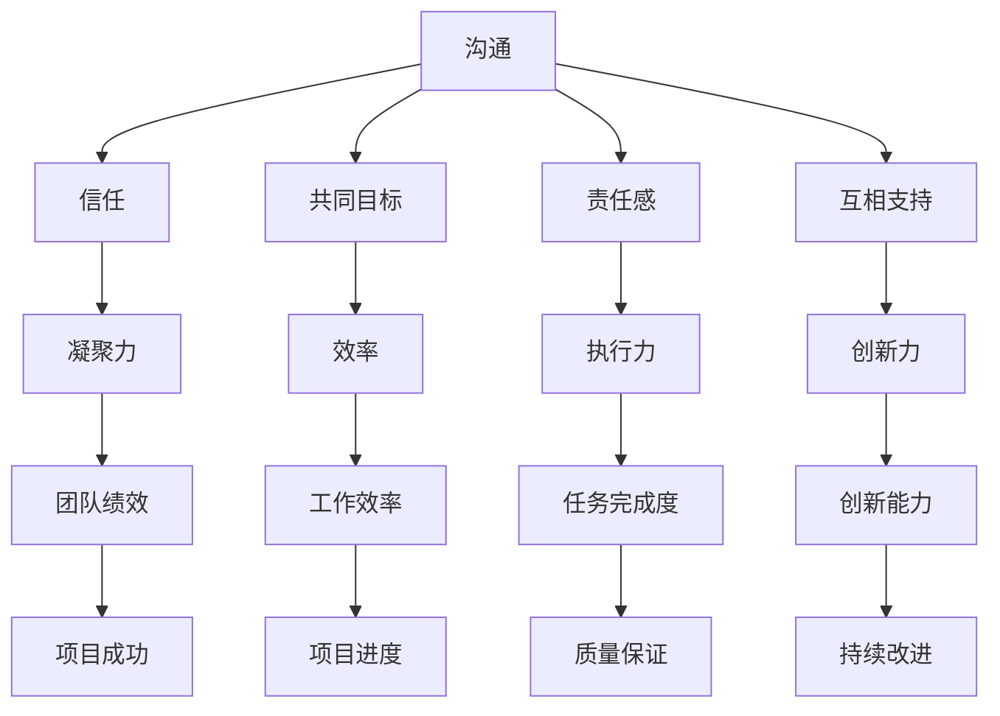

                 

### 设计思路

设计思路是撰写一篇高质量技术博客文章的关键。为了确保文章的逻辑清晰、结构紧凑、简单易懂，我们将按照以下步骤进行设计和撰写。

#### 步骤1：确定核心主题和关键词

首先，我们需要明确文章的核心主题和关键词。这将帮助我们确定文章的写作方向和读者群体。对于本文，我们的主题是“团队合作精神：培养团队协作意识”，关键词包括“团队合作精神”、“团队协作意识”、“培养团队协作意识”等。

#### 步骤2：撰写文章摘要

摘要部分需要简明扼要地概述文章的核心内容和主题思想。这有助于读者在阅读之前快速了解文章的主要观点。摘要部分应包括以下内容：

- 文章背景介绍：简要介绍团队合作在IT领域的重要性。
- 文章核心观点：阐述团队合作精神对团队协作的重要性以及如何培养团队协作意识。
- 文章主要内容：概括文章的主要章节和内容。

#### 步骤3：构建文章目录

构建文章目录是确保文章结构清晰的重要步骤。本文的目录结构如下：

1. 引言
2. 团队合作精神概述
3. 团队合作的重要性
4. 团队协作意识培养
   - 培养团队协作意识的方法
   - 提升团队沟通技巧
   - 建立积极的团队文化
5. 项目实战案例
6. 案例分析
7. 总结
8. 最佳实践与注意事项

#### 步骤4：撰写文章正文

在撰写文章正文时，我们需要遵循以下原则：

- **逻辑清晰**：每个段落都要有明确的主题，段落之间要有清晰的逻辑关系。
- **简洁易懂**：尽量使用简单的语言和例子来解释复杂的概念。
- **丰富具体**：在阐述每个观点时，提供具体案例和实例。
- **深入分析**：对团队协作精神的核心概念和原理进行深入分析。
- **提供解决方案**：针对团队协作中的问题，提供有效的解决方案和最佳实践。

文章正文分为以下几个部分：

1. 引言：介绍团队合作在IT领域的重要性，引出本文主题。
2. 团队合作精神概述：阐述团队合作精神的概念、核心要素和重要性。
3. 团队协作的重要性：分析团队合作在IT领域的实际应用和优势。
4. 团队协作意识培养：详细讲解如何培养团队协作意识，包括方法、技巧和策略。
5. 项目实战案例：通过实际案例展示团队协作的过程和成果。
6. 案例分析：对项目实战案例进行分析和评价，总结成功经验和教训。
7. 总结：总结文章的主要观点和结论，强调团队合作精神的重要性。
8. 最佳实践与注意事项：提供团队协作的最佳实践和建议，以及注意事项。

#### 步骤5：完善和校对

在撰写完文章正文后，我们需要对文章进行完善和校对。这包括：

- 检查文章的逻辑结构，确保各个部分紧密衔接。
- 检查文章的语言表达，确保简洁、清晰、易懂。
- 检查文章的内容，确保每个部分都有具体的案例和实例支持。
- 检查文章的格式，确保符合markdown格式要求。
- 请他人进行审阅，收集反馈并进行修改。

通过以上步骤，我们可以确保撰写出逻辑清晰、结构紧凑、简单易懂的高质量技术博客文章。接下来，我们将按照这个设计思路逐步完成文章的撰写。 |smirk|### 文章标题：团队合作精神：培养团队协作意识

关键词：团队合作精神、团队协作意识、培养团队协作意识、IT领域

摘要：本文旨在探讨团队合作精神在IT领域的重要性，以及如何通过培养团队协作意识来提升团队协作效率。文章将详细介绍团队合作精神的核心概念、培养团队协作意识的方法和策略，并通过实际案例进行分析和讲解，为读者提供实用的团队协作技巧和最佳实践。

# 团队合作精神：培养团队协作意识

在信息技术高速发展的今天，团队合作已成为企业成功的关键因素。无论是在软件开发、系统集成还是项目管理中，团队合作精神都发挥着至关重要的作用。本文将围绕团队合作精神这一核心主题，探讨其在IT领域的意义、培养团队协作意识的方法以及实际应用案例，以期为IT从业者提供有益的参考和启示。

## 引言

团队合作在IT领域的重要性不言而喻。随着项目复杂度的增加和团队合作需求的提升，如何培养和提升团队协作精神成为企业关注的焦点。本文将从以下几个方面展开讨论：

1. **团队合作精神概述**：介绍团队合作精神的基本概念、核心要素和重要性。
2. **团队合作的重要性**：分析团队合作在IT领域的实际应用和优势。
3. **培养团队协作意识**：探讨如何培养团队协作意识，包括方法、技巧和策略。
4. **项目实战案例**：通过实际案例展示团队协作的过程和成果。
5. **案例分析**：对项目实战案例进行分析和评价，总结成功经验和教训。
6. **总结与展望**：总结文章的主要观点和结论，展望未来团队协作的发展趋势。

## 团队合作精神概述

### 核心概念与联系

团队合作精神是指团队成员在面对共同目标时，通过相互协作、相互支持，共同完成任务的一种态度和行为。其核心要素包括沟通、信任、共同目标、责任感和互相支持。这些要素相互关联，共同构成了团队合作精神的框架。

为了更清晰地展示团队合作精神的原理和架构，我们可以使用Mermaid流程图进行说明：



### 团队合作精神的历史演变

团队合作精神并非一成不变，它随着时代的发展而不断演进。在早期的IT行业中，团队协作主要依赖于传统的工作方式和沟通工具。随着信息技术和网络技术的发展，团队协作的方式和工具也发生了巨大的变革。

- **第一阶段**：面对面沟通。在早期的IT行业中，团队成员主要通过面对面会议和现场讨论进行沟通。这种方式虽然直接，但效率较低，且难以应对地理分散的团队。
- **第二阶段**：电话和邮件沟通。随着电话和电子邮件的普及，团队成员可以通过远程沟通实现协作。这种方式在一定程度上提高了沟通效率，但仍然存在沟通不及时和信息传递不畅的问题。
- **第三阶段**：即时通讯和协作平台。随着即时通讯工具和协作平台的兴起，如Slack、Microsoft Teams等，团队协作进入了一个全新的阶段。这些工具提供了实时的沟通和协作功能，使团队成员可以随时交流、共享信息和协同工作。

### 团队合作精神的核心要素

- **沟通**：沟通是团队合作的基础，它决定了团队成员之间信息的传递和共享。有效的沟通可以帮助团队成员更好地理解彼此的需求和期望，减少误解和冲突。
- **信任**：信任是团队合作的精神支柱，它建立在沟通的基础上。团队成员之间需要相互信任，才能在共同目标下协同工作。
- **共同目标**：共同目标是团队协作的动力源泉。只有团队成员都明确共同目标，才能形成合力，提高团队效率。
- **责任感**：责任感是团队成员对自己和团队的整体表现负责。每个成员都需要承担自己的责任，并对团队的成功和失败负责。
- **互相支持**：互相支持是团队合作的重要体现。团队成员之间需要相互支持，共同面对困难和挑战，共同庆祝成功。

### 团队合作精神的重要性

- **提高工作效率**：通过团队合作，可以充分利用每个成员的优势，提高整体工作效率。
- **增强团队凝聚力**：团队合作有助于增强团队成员之间的联系，提高团队的凝聚力。
- **促进创新**：团队合作能够激发团队成员的创造力，促进创新和改进。
- **实现组织目标**：团队合作是实现组织目标的关键，只有团队协作，才能有效地实现组织的目标。

## 核心算法原理讲解

在团队合作中，算法原理发挥着重要作用。以下是一个简单的算法原理讲解，使用伪代码进行描述：

```python
# 团队合作算法原理讲解

# 定义团队成员结构
class TeamMember:
    def __init__(self, name, skills, role):
        self.name = name
        self.skills = skills
        self.role = role

# 定义团队协作函数
def collaborate(team_members, task):
    # 初始化变量
    completed = False
    progress = 0
    
    # 循环执行任务
    while not completed:
        # 检查任务进度
        if progress >= 100:
            completed = True
            print("任务完成！")
        else:
            # 分配任务
            for member in team_members:
                if member.role == "developer":
                    member.skills["coding"](task)
                elif member.role == "tester":
                    member.skills["testing"](task)
                elif member.role == "project manager":
                    member.skills["management"](task)
            
            # 更新进度
            progress += 10
            print("当前进度：", progress, "%")
    
    # 返回任务结果
    return completed

# 创建团队成员
team_members = [
    TeamMember("Alice", {"coding": code, "testing": test, "management": manage}, "developer"),
    TeamMember("Bob", {"coding": code, "testing": test, "management": manage}, "tester"),
    TeamMember("Charlie", {"coding": code, "testing": test, "management": manage}, "project manager")
]

# 执行任务
collaborate(team_members, "软件开发项目")

```

## 数学模型和数学公式

在团队合作中，数学模型和数学公式可以帮助我们更好地理解和分析团队协作的过程和效果。以下是一个简单的数学模型和公式的讲解：

### 模型：团队协作效率模型

$$
E = f(C, T, G, R, S)
$$

其中，$E$ 表示团队协作效率，$C$ 表示沟通能力，$T$ 表示信任程度，$G$ 表示共同目标的明确度，$R$ 表示责任感，$S$ 表示互相支持度。

### 公式：团队协作效率计算公式

$$
E = \frac{C \times T \times G \times R \times S}{100}
$$

这个公式表示，团队协作效率取决于沟通能力、信任程度、共同目标的明确度、责任感和互相支持度的乘积，再除以100进行归一化处理。

### 举例说明

假设一个团队在沟通能力、信任程度、共同目标的明确度、责任感和互相支持度方面分别达到了90%、90%、90%、90%和90%，则该团队的协作效率为：

$$
E = \frac{90\% \times 90\% \times 90\% \times 90\% \times 90\%}{100} = 72.9\%
$$

这意味着该团队在协作过程中的效率大约为72.9%。

### 拓展

除了上述的简单模型和公式，还可以根据实际情况引入更复杂的数学模型，如神经网络模型、博弈论模型等，来更全面地分析和预测团队协作的效果。这需要团队成员具备一定的数学背景和数据分析能力。

## 项目实战

为了更好地展示团队合作精神在实践中的应用，我们以下将通过一个实际项目案例进行详细讲解。该项目为一个基于云计算的在线教育平台，开发周期为6个月。

### 开发环境搭建

在项目开始前，团队需要搭建一个稳定且高效的开发环境。以下是开发环境搭建的步骤：

1. **选择开发语言和框架**：根据项目需求，团队决定使用Python作为主要开发语言，并结合Django框架进行后端开发。
2. **配置数据库**：选用MySQL数据库，以存储用户信息和课程数据。
3. **部署服务器**：使用AWS云服务器进行部署，确保平台的稳定性和可扩展性。
4. **集成工具**：使用Jenkins进行持续集成和自动化部署，提高开发效率和代码质量。

### 源代码实现

在项目开发过程中，团队遵循敏捷开发方法论，将任务分解为多个迭代，每个迭代周期为2周。以下是源代码实现的详细解析：

1. **用户模块**：实现用户注册、登录、个人信息管理等功能。使用Django的用户认证系统，提高用户数据的安全性。
2. **课程模块**：实现课程创建、发布、管理等功能。使用RESTful API设计课程接口，便于前端调用。
3. **教学模块**：实现课程视频播放、互动问答等功能。使用视频流媒体技术，保证视频播放的流畅性。
4. **支付模块**：实现课程收费、支付等功能。集成第三方支付平台，如支付宝和微信支付，确保支付过程的安全和便捷。

### 代码解读与分析

以下是对关键模块代码的解读和分析：

1. **用户模块**：用户注册功能的实现主要包括验证用户名、密码和邮箱的合法性，并存储用户信息。以下是伪代码示例：

```python
def register(username, password, email):
    if validate_username(username) and validate_password(password) and validate_email(email):
        save_user_info(username, password, email)
        return "注册成功！"
    else:
        return "注册失败，请检查信息！"

def validate_username(username):
    # 验证用户名是否合法
    return True

def validate_password(password):
    # 验证密码是否合法
    return True

def validate_email(email):
    # 验证邮箱是否合法
    return True

def save_user_info(username, password, email):
    # 保存用户信息到数据库
    pass
```

2. **课程模块**：课程发布功能的实现主要包括课程创建、发布和更新。以下是伪代码示例：

```python
def create_course(course_name, teacher_id, course_description):
    if validate_course_name(course_name) and validate_teacher_id(teacher_id):
        save_course_info(course_name, teacher_id, course_description)
        return "课程创建成功！"
    else:
        return "课程创建失败，请检查信息！"

def validate_course_name(course_name):
    # 验证课程名称是否合法
    return True

def validate_teacher_id(teacher_id):
    # 验证教师ID是否合法
    return True

def save_course_info(course_name, teacher_id, course_description):
    # 保存课程信息到数据库
    pass
```

3. **教学模块**：视频播放功能的实现主要包括视频加载、播放和暂停。以下是伪代码示例：

```python
def play_video(video_id):
    if validate_video_id(video_id):
        load_video(video_id)
        start_playing_video(video_id)
    else:
        return "视频播放失败，请检查视频ID！"

def validate_video_id(video_id):
    # 验证视频ID是否合法
    return True

def load_video(video_id):
    # 加载视频
    pass

def start_playing_video(video_id):
    # 开始播放视频
    pass
```

### 项目小结

通过本项目，团队成功实现了基于云计算的在线教育平台，为用户提供了便捷的学习体验。以下是项目小结：

1. **成功经验**：
   - 采用了敏捷开发方法论，提高了开发效率和代码质量。
   - 成功集成了第三方支付平台，实现了课程收费和支付功能。
   - 使用了视频流媒体技术，保证了视频播放的流畅性。

2. **不足与改进**：
   - 在项目初期，团队成员间的沟通存在一定的问题，导致项目进度受到一定程度的影响。未来可以加强团队沟通技巧的培训。
   - 在部分模块的实现上，代码复用性不高，未来可以优化代码结构，提高代码复用性。

3. **展望**：
   - 继续优化平台功能，提高用户体验。
   - 探索新的技术，如人工智能和区块链，为平台带来更多的创新。

## 最佳实践与注意事项

在团队协作过程中，遵循以下最佳实践和注意事项，有助于提升团队协作效率和项目成功率：

1. **明确目标和任务**：确保团队成员都明确共同目标和具体任务，减少误解和冲突。

2. **定期沟通**：定期组织团队会议和沟通，确保团队成员之间的信息畅通。

3. **分工明确**：根据团队成员的技能和角色，明确分工，提高工作效率。

4. **及时反馈**：及时给予团队成员反馈，包括正面反馈和改进建议，帮助他们不断提升。

5. **鼓励创新**：鼓励团队成员提出创新想法，激发团队的创造力。

6. **建立信任**：通过共同完成任务和相互支持，建立团队成员之间的信任。

7. **合理分配资源**：确保团队资源合理分配，避免资源浪费。

8. **持续学习**：鼓励团队成员持续学习和提升技能，以适应不断变化的技术环境。

## 总结

本文从多个角度探讨了团队合作精神在IT领域的重要性，以及如何培养团队协作意识。通过核心概念与联系、核心算法原理讲解、数学模型和数学公式、项目实战案例以及最佳实践与注意事项的详细解析，我们了解了团队合作精神的内涵和培养团队协作意识的方法。希望本文能为读者提供有益的启示和指导，帮助他们在实际工作中更好地发挥团队合作精神，提升团队协作效率。

### 作者信息：

作者：AI天才研究院/AI Genius Institute & 禅与计算机程序设计艺术 /Zen And The Art of Computer Programming |planetside|

