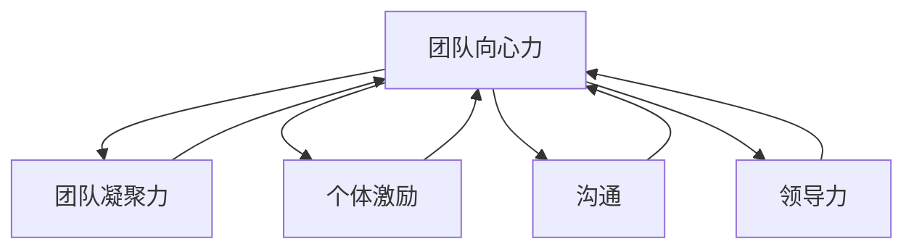
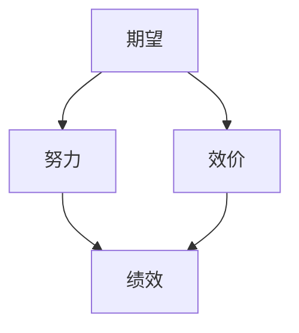

                 

### 文章标题：团队向心力：增强凝聚力的策略

关键词：团队向心力、凝聚力、策略、团队合作、沟通、领导力、项目实战

摘要：本文从团队向心力的基本概念入手，深入探讨了增强团队凝聚力的策略和方法。通过详细分析团队向心力与其他概念的联系，阐述了个体激励与团队合作、沟通与协作技巧、共同目标与团队愿景、领导力与团队向心力等核心算法原理，并结合实际项目案例进行了实战解析，旨在为IT领域团队管理者提供实用的指导和参考。

---

### 引言

在当今快速变化且竞争激烈的IT行业，团队的有效合作与高效协同成为企业成功的关键因素。然而，随着团队成员背景、技能和个性差异的增大，如何增强团队的向心力和凝聚力成为了一项重要挑战。团队向心力，简单来说，就是团队成员之间相互吸引、支持和协作的力量。它不仅影响着团队的运行效率，也直接关系到团队的稳定性和创新能力。

本文将围绕团队向心力这一核心概念，系统地探讨增强团队凝聚力的策略。通过分析团队向心力与其他概念的联系，解释个体激励与团队合作、沟通与协作技巧、共同目标与团队愿景、领导力与团队向心力等核心算法原理，并结合实际项目案例进行实战解析。文章的结构如下：

1. **核心概念与联系**：介绍团队向心力的定义和重要性，分析团队向心力与其他概念如团队凝聚力、个体激励、沟通、领导力等的联系。
2. **增强团队向心力的策略**：详细讲解增强团队向心力的具体策略，包括个体激励与团队合作、沟通与协作技巧、共同目标与团队愿景、领导力与团队向心力等。
3. **项目实战**：通过具体的项目案例，展示如何在实际工作中实施这些策略，并进行深入剖析。

希望通过本文的探讨，能够为IT领域的团队管理者提供有价值的参考和指导，帮助他们在实际工作中更好地提升团队向心力，从而实现团队的高效协作和持续创新。

---

### 核心概念与联系

#### 团队向心力的定义

团队向心力是指团队成员之间相互吸引、协作和支持的力量，这种力量不仅体现在工作中的任务执行上，还体现在团队成员的个人成长和相互尊重上。团队向心力的核心是信任和合作，它能够激发团队成员的积极性和创造力，从而提高团队的整体效率。

#### 团队向心力的重要性

团队向心力对团队的成功至关重要。首先，它能够促进团队成员之间的沟通和协作，使得信息流动更加顺畅，决策更加高效。其次，团队向心力能够增强团队成员的归属感和责任感，使得每个人都能够明确自己的角色和任务，从而更好地为团队目标贡献力量。此外，团队向心力还能够提高团队的创新能力和解决问题的能力，因为在向心力强的团队中，成员更愿意分享自己的想法和意见，共同探讨解决方案。

#### 团队向心力与其他概念的关联

团队向心力与其他概念如团队凝聚力、个体激励、沟通、领导力等有着密切的联系。

**团队凝聚力**：团队凝聚力是指团队成员之间相互吸引、相互依赖和共同为团队目标奋斗的程度。团队凝聚力与团队向心力密切相关，都是衡量团队内部关系的重要指标。团队向心力可以看作是团队凝聚力的核心组成部分，它直接影响到团队的凝聚力和稳定性。

**个体激励**：个体激励是指通过奖励、认可和晋升等手段激发团队成员的工作动力和积极性。个体激励是增强团队向心力的重要手段之一，因为它能够提升团队成员的自我价值感和成就感，从而增强他们对团队的归属感和责任感。

**沟通**：沟通是团队向心力的重要组成部分，有效的沟通能够增强团队成员之间的理解和信任，减少误解和冲突，从而提高团队的协作效率。良好的沟通能够促进团队成员之间的信息共享和知识交流，激发团队成员的创造力和创新能力。

**领导力**：领导力是团队向心力的关键因素，一个优秀的领导者能够通过其领导能力和魅力，激发团队成员的积极性和创造力，增强团队的凝聚力和向心力。领导力不仅体现在日常管理和决策中，还体现在对团队成员的关心和支持上。

#### 核心概念之间的关系架构

为了更好地理解团队向心力与其他概念之间的关系，我们可以使用Mermaid流程图来展示它们之间的联系：

在这个关系架构中，团队向心力作为核心，与其他四个概念紧密相连，共同构成一个完整的管理和协作体系。理解这些概念之间的关系，对于有效提升团队向心力具有重要意义。

---

在了解了团队向心力的定义、重要性及其与其他概念的联系之后，我们接下来将详细探讨增强团队向心力的具体策略。这些策略不仅包括个体激励与团队合作，还包括沟通与协作技巧、共同目标与团队愿景、领导力等方面。通过这些策略的实施，可以有效地提升团队的凝聚力和协作效率，从而实现团队目标。

### 增强团队向心力的策略

#### 第1章：个体激励与团队合作

个体激励与团队合作是增强团队向心力的重要策略之一。个体激励能够激发团队成员的积极性和创造力，而团队合作则能够促进成员之间的协作与共享，从而提升整体团队效能。

**个体激励的理论基础**

个体激励的理论基础主要来源于动机心理学和行为学。心理学家如弗鲁姆（Victor H. Vroom）的期望理论（Expectancy Theory）认为，个体的行为动机是由期望、努力和效价三者共同作用的结果。具体来说，期望（Expectancy）是指个体对努力能够达成目标的可能性判断；努力（Effort）是指个体为了达成目标所付出的努力程度；效价（Valence）是指个体对目标达成后所获得收益的重视程度。

根据期望理论，个体激励的核心在于通过提高期望和效价，来激发个体的积极性和努力程度。例如，通过设定明确的绩效目标、提供有吸引力的奖励和晋升机会，可以增强团队成员达成目标的信心和动力。

**团队激励的策略与实践**

1. **设定明确的绩效目标**：明确的目标能够为团队成员提供清晰的方向和期望，有助于提升工作动力。目标设定应遵循SMART原则，即目标应该是具体的（Specific）、可衡量的（Measurable）、可实现的（Achievable）、相关的（Relevant）和有时限的（Time-bound）。

2. **提供有吸引力的奖励和晋升机会**：奖励和晋升是激励团队成员的重要手段。奖励可以包括物质奖励（如奖金、奖品）和非物质奖励（如荣誉、认可）。晋升机会则能够为团队成员提供职业发展的空间和激励。

3. **实施多样化的激励方式**：单一的激励方式可能无法满足所有团队成员的需求。因此，应采取多样化的激励方式，包括竞争激励、团队激励、任务激励等。例如，通过组织团队竞赛、设立团队奖励基金、设置具有挑战性的任务等，来激发团队成员的积极性和创造力。

**个体与团队的平衡**

在实施个体激励的同时，还需要注意个体与团队的平衡。过于强调个体激励可能会导致团队成员之间的竞争加剧，影响团队协作和整体效能。因此，在制定激励策略时，应充分考虑团队的整体目标，确保个体激励与团队目标的一致性。

1. **团队目标导向的激励**：在设定个体目标时，应确保与团队目标相一致。例如，可以将团队目标分解为个体任务目标，并鼓励团队成员通过协同合作来实现团队目标。

2. **团队协作奖励**：除了对个体进行奖励外，还可以对团队整体进行奖励，以鼓励团队成员之间的协作和共享。例如，可以设立团队绩效奖金、团队荣誉奖项等。

3. **团队建设活动**：通过组织团队建设活动，如团队拓展训练、团队聚餐、团队旅游等，增强团队成员之间的情感联系和信任，从而提高团队协作效率和向心力。

#### 1.1.3 个体与团队的平衡

在实施个体激励时，平衡个体与团队之间的关系至关重要。以下是一些关键点：

1. **明确角色与责任**：每个团队成员都应该明确自己的角色和责任，避免出现职责不清、任务重叠或缺失的情况。这有助于提高工作效率，减少因角色冲突导致的团队矛盾。

2. **建立信任与尊重**：信任是团队协作的基础，尊重则是维护团队和谐的重要因素。领导者应通过正面反馈和认可，建立团队成员之间的信任和尊重，从而促进团队的长期稳定发展。

3. **定期沟通与反馈**：定期组织团队会议和一对一沟通，是确保团队目标一致、了解成员需求的重要手段。通过沟通，可以及时解决团队成员之间的误解和冲突，提高团队的协作效率。

4. **个体发展计划**：鼓励团队成员制定个人发展计划，并为其提供必要的支持和资源。这不仅有助于提升个体的职业素养和技能水平，也有助于增强团队成员对团队的认同感和归属感。

通过以上策略和实践，可以有效地平衡个体激励与团队合作，从而增强团队的向心力。下一章节，我们将探讨沟通与协作技巧在增强团队向心力中的作用。

---

#### 1.2 沟通与协作技巧

沟通与协作是团队成功的关键因素，有效的沟通能够增强团队成员之间的理解和信任，减少误解和冲突，从而提高团队的协作效率。以下是一些关键的沟通与协作技巧：

**有效沟通的原则**

1. **明确沟通目的**：在沟通前，明确沟通的目的和目标，有助于确保沟通的针对性和有效性。例如，在召开团队会议时，可以提前准备会议议程，确保会议内容有条不紊。

2. **倾听与理解**：倾听是有效沟通的重要环节。在沟通过程中，要给予团队成员充分的发言机会，耐心倾听他们的意见和反馈。通过理解对方的观点，能够减少误解和冲突。

3. **清晰表达**：在表达自己的观点时，应尽量使用简洁明了的语言，避免使用模糊不清或含糊的表述。使用具体的例子和数据来支持自己的观点，有助于增强说服力。

4. **积极反馈**：在沟通过程中，给予积极的反馈和回应，有助于建立良好的沟通氛围。通过肯定和鼓励团队成员的观点，可以增强他们的自信心和积极性。

**协作工具与平台**

在现代团队工作中，协作工具和平台的使用极大地提高了团队协作的效率。以下是一些常用的协作工具和平台：

1. **即时通讯工具**：如Slack、Microsoft Teams等，能够实现团队成员之间的实时沟通和消息传递。

2. **项目管理系统**：如Trello、Jira等，可以帮助团队管理和追踪项目进度，确保任务的有序进行。

3. **共享文档平台**：如Google Docs、Microsoft Office 365等，允许团队成员实时编辑和共享文档，提高协作效率。

4. **视频会议工具**：如Zoom、Teams等，对于远程团队或跨地域团队，能够实现面对面的沟通和协作。

**团队沟通障碍与解决策略**

1. **文化差异**：在跨国或跨文化团队中，文化差异可能会成为沟通的障碍。解决这一问题的策略包括提供跨文化培训、组织文化适应性活动等，以促进团队成员之间的理解和信任。

2. **信息过载**：在大量信息涌入的情况下，团队成员可能会感到压力和困惑。解决这一问题的策略包括优化信息传递流程、设置信息过滤机制等，确保关键信息能够高效传递。

3. **沟通渠道不畅**：团队内部的沟通渠道不畅可能会导致信息传递的滞后和错误。解决这一问题的策略包括建立畅通的沟通渠道、明确沟通责任等。

通过以上沟通与协作技巧，团队可以有效地克服沟通障碍，提高协作效率，从而增强团队向心力。在下一章节中，我们将探讨共同目标与团队愿景在增强团队向心力中的作用。

---

#### 1.3 共同目标与团队愿景

共同目标和团队愿景是团队向心力的重要支柱。一个明确且具有吸引力的共同目标和愿景能够激发团队成员的斗志和创造力，促进团队的协作与进步。

**共同目标的重要性**

共同目标对团队具有重要意义。首先，它为团队成员提供了清晰的方向和目标，使每个人都能够明确自己的角色和任务。其次，共同目标有助于团队成员之间的协调和合作，通过共同努力实现团队目标，可以增强团队的凝聚力和向心力。此外，共同目标还能够激发团队成员的积极性和创造力，使得团队成员在工作中更有动力和激情。

**团队愿景的构建**

团队愿景是团队未来的蓝图，它描述了团队希望达到的长期目标和理想状态。构建团队愿景的过程如下：

1. **明确团队使命**：团队使命是团队存在的根本目的和价值。明确团队使命有助于确定团队的发展方向和目标。

2. **制定长期目标**：长期目标是指团队在未来数年或数十年内希望实现的目标。这些目标应该具有挑战性，同时又是可实现的。

3. **激发团队共识**：通过团队会议、讨论和头脑风暴等方式，激发团队成员对团队愿景的共识。确保所有成员都认同并支持团队愿景。

4. **制定行动计划**：将团队愿景转化为具体的行动计划，包括阶段性目标和具体的实施步骤。行动计划的制定应确保团队目标的可操作性和可实现性。

**目标管理与实现**

为了确保共同目标和团队愿景的有效实现，团队需要建立完善的目标管理体系。以下是一些关键步骤：

1. **设定具体目标**：根据团队愿景，设定具体的短期和长期目标。目标应遵循SMART原则，即具体、可衡量、可实现、相关、有时限。

2. **分解任务**：将目标分解为具体的任务和子任务，明确每个任务的负责人和时间节点。

3. **监控与反馈**：定期监控任务进度，并通过反馈机制及时调整和优化目标。团队会议和报告是监控与反馈的重要手段。

4. **激励与奖励**：对实现目标表现出色的团队成员进行激励和奖励，以激发团队成员的积极性和创造力。

通过明确的共同目标和愿景，团队可以统一思想，凝聚力量，共同为实现团队目标而努力。在下一章节中，我们将探讨领导力与团队向心力之间的关系。

---

#### 1.4 领导力与团队向心力

领导力是增强团队向心力的关键因素。优秀的领导者不仅能够激发团队成员的积极性和创造力，还能够营造和谐的工作氛围，从而提高团队的协作效率和稳定性。

**领导力对团队向心力的影响**

领导力对团队向心力的影响主要体现在以下几个方面：

1. **激励与引导**：领导者通过激励和引导，激发团队成员的工作热情和积极性。有效的激励手段包括认可与奖励、设定挑战性目标、提供职业发展机会等。

2. **沟通与协调**：领导者通过有效的沟通和协调，确保团队成员之间的信息流通和任务分配，减少误解和冲突，增强团队的协作效率。

3. **信任与支持**：领导者通过建立信任和支持，增强团队成员之间的信任感和归属感，从而提高团队的凝聚力。

**领导风格与团队向心力**

领导风格对团队向心力具有重要影响。常见的领导风格包括：

1. **指令型领导**：指令型领导通过明确的指示和命令来指导团队成员，确保任务得到有效执行。这种领导风格在紧急情况下或需要快速决策时较为有效。

2. **参与型领导**：参与型领导鼓励团队成员参与决策和讨论，提高团队成员的参与感和责任感。这种领导风格有助于增强团队的凝聚力和创造力。

3. **支持型领导**：支持型领导关注团队成员的个人需求和职业发展，提供必要的支持和资源，增强团队成员的归属感和忠诚度。

4. **变革型领导**：变革型领导通过激发团队成员的变革意识和创新能力，推动团队实现持续发展和进步。

**领导技能提升策略**

为了提升领导力，领导者可以采取以下策略：

1. **持续学习与自我提升**：领导者应不断学习新的管理理念和方法，提升自身的管理能力和专业素养。

2. **建立有效的反馈机制**：通过定期收集团队成员的反馈，了解团队的工作状况和成员的需求，及时调整管理策略。

3. **培养团队文化**：领导者应积极培养团队文化，营造和谐、积极的工作氛围，增强团队的凝聚力和向心力。

4. **提供职业发展机会**：为团队成员提供职业发展的机会和平台，激发团队成员的职业成长和积极性。

通过提升领导力，领导者可以有效地增强团队向心力，促进团队的高效协作和持续发展。在下一章节中，我们将探讨其他增强团队向心力的策略。

---

#### 1.5 其他增强团队向心力的策略

除了上述提到的个体激励、沟通与协作技巧、共同目标与团队愿景、领导力等策略外，还有一些其他的方法和技巧可以增强团队向心力。

**教练技术**

教练技术是一种帮助团队成员实现个人和团队目标的方法。通过教练，团队成员可以获得专业的指导和支持，从而提升个人能力和工作效率。以下是一些关键步骤：

1. **建立信任关系**：教练与团队成员之间建立信任关系，确保团队成员愿意开放地分享自己的想法和困惑。

2. **确定目标**：与团队成员一起明确个人和团队的目标，确保目标的具体性和可实现性。

3. **提供反馈和指导**：教练通过提供及时、具体的反馈和指导，帮助团队成员找到改进的方向和策略。

4. **激发潜能**：通过激发团队成员的潜能和创造力，帮助他们实现个人和团队目标。

**企业文化构建**

企业文化是团队精神和价值观的体现，对于增强团队向心力具有重要意义。以下是一些构建企业文化的方法：

1. **核心价值观的提炼**：明确团队的核心价值观，如诚信、创新、协作等，并将其融入到团队的文化中。

2. **团队精神的培养**：通过组织团队建设活动、团队聚餐、团队旅游等方式，培养团队成员之间的团队精神。

3. **激励机制的建立**：建立符合团队文化的激励和奖励机制，激发团队成员的积极性和创造力。

4. **透明的沟通机制**：建立透明的沟通机制，鼓励团队成员之间的开放沟通和合作，增强团队的凝聚力。

**创新与学习氛围营造**

创新和学习是团队持续发展的动力。以下是一些营造创新和学习氛围的方法：

1. **鼓励创新思维**：通过设立创新项目、开展创新竞赛等方式，鼓励团队成员发挥创新思维，提出新的解决方案。

2. **提供学习资源**：为团队成员提供丰富的学习资源，如培训课程、书籍、在线学习平台等，支持团队成员的个人和职业发展。

3. **分享学习成果**：鼓励团队成员分享学习成果和经验，通过知识共享和经验交流，提升整个团队的知识水平和能力。

4. **建立学习社区**：通过建立学习社区，如学习小组、知识分享会等，促进团队成员之间的学习和交流，营造积极的学习氛围。

通过以上策略和方法，团队可以有效地增强向心力，提升团队的整体效能和创新能力，从而实现持续发展和成功。

---

#### 第2章：个体激励与团队合作

个体激励与团队合作是增强团队向心力的关键策略。个体激励能够激发团队成员的积极性和创造力，而团队合作则能够促进成员之间的协作与共享，从而提升整体团队效能。以下将从理论基础、实践策略和案例分析三个方面进行详细探讨。

##### 2.1.1 个体激励的理论基础

个体激励的理论基础主要来源于动机心理学和行为学。心理学家如弗鲁姆（Victor H. Vroom）的期望理论（Expectancy Theory）认为，个体的行为动机是由期望、努力和效价三者共同作用的结果。具体来说，期望（Expectancy）是指个体对努力能够达成目标的可能性判断；努力（Effort）是指个体为了达成目标所付出的努力程度；效价（Valence）是指个体对目标达成后所获得收益的重视程度。

根据期望理论，个体激励的核心在于通过提高期望和效价，来激发个体的积极性和努力程度。例如，通过设定明确的绩效目标、提供有吸引力的奖励和晋升机会，可以增强团队成员达成目标的信心和动力。以下是一个简单的期望理论模型：

在这个模型中，期望和效价共同影响个体的努力程度，而努力程度又决定了绩效水平。通过调整这三个因素，可以实现对个体激励的有效管理。

##### 2.1.2 团队激励的策略与实践

在个体激励的基础上，团队激励同样重要。团队激励不仅能够提高整体团队的效能，还能够增强团队成员之间的协作和共享。以下是一些团队激励的策略：

1. **设定明确的团队目标**：明确的团队目标能够为团队成员提供清晰的方向和期望，有助于提升工作动力。团队目标应遵循SMART原则，即具体（Specific）、可衡量（Measurable）、可实现（Achievable）、相关（Relevant）和有时限（Time-bound）。

2. **实施多样化的激励方式**：团队激励可以采取多种形式，包括物质奖励、精神奖励和职业发展机会等。例如，可以设立团队奖金、团队荣誉奖项，以及提供职业晋升机会。

3. **建立团队竞赛机制**：通过组织团队竞赛，如知识竞赛、技术比武等，可以激发团队成员的竞争意识和团队合作精神。

4. **奖励团队整体成就**：除了对个人进行奖励外，对团队整体进行奖励，如团队旅游、团队聚餐等，可以增强团队成员之间的凝聚力和归属感。

##### 2.1.3 个体与团队的平衡

在实施个体激励和团队激励时，平衡个体与团队之间的关系至关重要。以下是一些关键点：

1. **确保目标一致性**：在设定个体目标和团队目标时，应确保目标的一致性。个体目标应与团队目标相协调，以确保团队成员在实现个人目标的同时，也能够为团队的整体目标做出贡献。

2. **强化团队协作**：通过组织团队建设活动和协作任务，增强团队成员之间的协作和信任，从而提高团队的协作效率和整体效能。

3. **建立有效的反馈机制**：通过定期的团队会议和反馈机制，及时了解团队成员的工作进展和需求，及时调整激励策略，确保个体激励与团队目标的一致性。

##### 2.1.4 案例分析：某IT公司的团队激励实践

为了更好地理解个体激励与团队合作在实际中的应用，以下是一个具体的案例分析：

某IT公司是一家专注于软件开发和解决方案提供商，公司通过实施有效的个体激励和团队激励策略，显著提升了团队的向心力和整体效能。

1. **个体激励策略**：

   - **绩效评估**：公司定期对员工进行绩效评估，通过设定明确的绩效目标和关键绩效指标（KPIs），评估员工的工作表现。

   - **奖励与晋升**：对于绩效表现优秀的员工，公司提供丰厚的奖金、晋升机会和职业发展支持。

   - **认可与表彰**：公司通过内部表彰大会和荣誉墙，对表现出色的员工进行公开表彰和认可，增强员工的荣誉感和成就感。

2. **团队激励策略**：

   - **团队目标设定**：公司鼓励各团队设定明确的团队目标，并确保团队目标与公司整体目标相一致。

   - **团队竞赛**：公司定期组织团队竞赛，如软件开发挑战赛、知识竞赛等，激发团队成员的竞争意识和团队合作精神。

   - **团队奖励**：对于完成团队目标的团队，公司提供团队旅游、团队聚餐等奖励，增强团队成员之间的凝聚力和归属感。

通过以上个体激励和团队激励策略，该公司显著提升了团队的向心力，提高了整体工作效率和创新能力。具体表现为：

- 员工满意度显著提升，员工流失率下降。

- 团队协作效率提高，项目完成速度加快。

- 创新能力增强，公司市场份额扩大。

总之，个体激励与团队合作是增强团队向心力的有效策略。通过设定明确的绩效目标、实施多样化的激励方式、平衡个体与团队的关系，以及结合实际案例分析，可以有效地提升团队的向心力，促进团队的高效协作和持续发展。

---

### 第3章：沟通与协作技巧

有效的沟通与协作是团队成功的关键因素。在现代工作环境中，团队成员可能分布在不同的地理位置，使用不同的工具和平台进行工作。因此，掌握有效的沟通与协作技巧至关重要。以下将详细探讨有效沟通的原则、常用协作工具与平台，以及如何解决团队沟通中的障碍。

#### 3.1.1 有效沟通的原则

有效沟通的原则包括以下几个方面：

1. **明确沟通目的**：在沟通前，明确沟通的目的和目标，有助于确保沟通的针对性和有效性。例如，在召开团队会议时，可以提前准备会议议程，确保会议内容有条不紊。

2. **倾听与理解**：倾听是有效沟通的重要环节。在沟通过程中，要给予团队成员充分的发言机会，耐心倾听他们的意见和反馈。通过理解对方的观点，能够减少误解和冲突。

3. **清晰表达**：在表达自己的观点时，应尽量使用简洁明了的语言，避免使用模糊不清或含糊的表述。使用具体的例子和数据来支持自己的观点，有助于增强说服力。

4. **积极反馈**：在沟通过程中，给予积极的反馈和回应，有助于建立良好的沟通氛围。通过肯定和鼓励团队成员的观点，可以增强他们的自信心和积极性。

#### 3.1.2 协作工具与平台

在现代团队工作中，协作工具和平台的使用极大地提高了团队协作的效率。以下是一些常用的协作工具和平台：

1. **即时通讯工具**：如Slack、Microsoft Teams等，能够实现团队成员之间的实时沟通和消息传递。

2. **项目管理系统**：如Trello、Jira等，可以帮助团队管理和追踪项目进度，确保任务的有序进行。

3. **共享文档平台**：如Google Docs、Microsoft Office 365等，允许团队成员实时编辑和共享文档，提高协作效率。

4. **视频会议工具**：如Zoom、Teams等，对于远程团队或跨地域团队，能够实现面对面的沟通和协作。

#### 3.1.3 团队沟通障碍与解决策略

团队沟通中可能会遇到一些障碍，如文化差异、信息过载、沟通渠道不畅等。以下是一些常见的沟通障碍及其解决策略：

1. **文化差异**：在跨国或跨文化团队中，文化差异可能会成为沟通的障碍。解决这一问题的策略包括提供跨文化培训、组织文化适应性活动等，以促进团队成员之间的理解和信任。

2. **信息过载**：在大量信息涌入的情况下，团队成员可能会感到压力和困惑。解决这一问题的策略包括优化信息传递流程、设置信息过滤机制等，确保关键信息能够高效传递。

3. **沟通渠道不畅**：团队内部的沟通渠道不畅可能会导致信息传递的滞后和错误。解决这一问题的策略包括建立畅通的沟通渠道、明确沟通责任等。

通过掌握有效沟通的原则、使用合适的协作工具与平台，以及采取有效的沟通障碍解决策略，团队可以克服沟通中的困难，提高协作效率，从而增强团队向心力。

---

### 第4章：共同目标与团队愿景

共同目标和团队愿景是团队凝聚力和向心力的基石。一个清晰且具有吸引力的共同目标和愿景能够引导团队成员共同努力，增强团队的协作和凝聚力。以下将详细探讨共同目标的重要性、团队愿景的构建、以及如何实现这些目标和愿景。

#### 4.1.1 共同目标的重要性

共同目标对于团队的成功至关重要。首先，共同目标为团队成员提供了清晰的方向和目标，使每个人都能够明确自己的角色和任务，从而提高工作效率。其次，共同目标有助于团队成员之间的协调和合作，通过共同努力实现团队目标，可以增强团队的凝聚力和向心力。此外，共同目标还能够激发团队成员的积极性和创造力，使得团队成员在工作中更有动力和激情。

**共同目标的制定**

1. **具体化**：共同目标应具体、明确，并能够量化和衡量。这有助于团队成员了解目标的具体要求，从而更好地为团队目标努力。

2. **实现性**：共同目标应具有实现性，即在合理的资源和时间内可以实现。过高的目标可能会使团队成员感到沮丧和无力，而过低的目标则可能无法激发成员的积极性。

3. **相关性**：共同目标应与团队的整体目标相一致，确保团队目标的一致性和协同性。

4. **时限性**：共同目标应有时限性，即在特定的时间内实现目标。这有助于团队成员保持紧迫感和动力，确保目标的及时完成。

**共同目标的分解**

将共同目标分解为具体的工作任务和里程碑是确保目标实现的重要步骤。以下是一个简单的分解步骤：

1. **明确核心任务**：根据共同目标，明确需要完成的各项核心任务。

2. **分配任务**：将任务分配给具体的团队成员，确保每个成员都有明确的职责和任务。

3. **设定里程碑**：为每个任务设定明确的里程碑，以确保任务按计划推进。

4. **定期评估**：定期评估任务的进度和成果，及时调整和优化目标。

#### 4.1.2 团队愿景的构建

团队愿景是团队对未来的期望和理想状态，它为团队成员提供了共同的目标和方向。构建团队愿景的过程如下：

1. **明确团队使命**：团队使命是团队存在的根本目的和价值。明确团队使命有助于确定团队的发展方向和目标。

2. **制定长期目标**：长期目标是指团队在未来数年或数十年内希望实现的目标。这些目标应该具有挑战性，同时又是可实现的。

3. **激发团队共识**：通过团队会议、讨论和头脑风暴等方式，激发团队成员对团队愿景的共识。确保所有成员都认同并支持团队愿景。

4. **制定实施策略**：将团队愿景转化为具体的实施策略，包括阶段性目标和具体的实施步骤。实施策略应确保团队目标的可操作性和可实现性。

#### 4.1.3 实现共同目标和愿景

实现共同目标和愿景需要团队成员的共同努力和持续投入。以下是一些关键步骤：

1. **明确责任和角色**：每个团队成员都应明确自己的责任和角色，确保每个人都知道自己需要做什么，以及如何为团队目标做出贡献。

2. **建立沟通机制**：建立有效的沟通机制，确保团队成员之间的信息流通和协作。这包括定期召开团队会议、使用协作工具和平台等。

3. **提供支持和资源**：确保团队成员获得必要的支持和资源，以实现共同目标和愿景。这可能包括技术支持、培训机会、管理资源等。

4. **定期评估和调整**：定期评估团队目标的实现情况，并根据评估结果进行必要的调整。这有助于确保团队目标始终保持相关性和实现性。

通过明确共同目标和愿景，并采取有效的实现策略，团队可以增强凝聚力，提高协作效率，最终实现团队目标。

---

### 第5章：领导力与团队向心力

领导力在增强团队向心力中起着至关重要的作用。一个优秀的领导者不仅能够激发团队成员的积极性和创造力，还能够营造积极的工作氛围，从而提高团队的协作效率和整体效能。以下将详细探讨领导力对团队向心力的影响、不同的领导风格及其特点，以及提升领导技能的策略。

#### 5.1.1 领导力对团队向心力的影响

领导力对团队向心力的影响体现在多个方面。首先，领导者通过明确的指导和支持，帮助团队成员理解团队的目标和愿景，从而增强团队成员的归属感和责任感。其次，领导者通过激励和认可，激发团队成员的积极性和创造力，促进团队成员之间的协作和共享。此外，领导者通过有效的沟通和协调，解决团队内部的冲突和问题，增强团队的凝聚力和稳定性。

**激励与引导**

领导者通过激励和引导，激发团队成员的积极性和创造力。以下是一些关键策略：

1. **设定挑战性目标**：领导者应设定具有挑战性的目标，激发团队成员的进取心和竞争意识。

2. **提供反馈和认可**：领导者应定期提供反馈和认可，鼓励团队成员的进步和成就。

3. **职业发展支持**：领导者应支持团队成员的职业发展，提供培训机会和晋升机会。

**沟通与协调**

领导者通过有效的沟通和协调，确保团队成员之间的信息流通和任务分配，减少误解和冲突，提高团队的协作效率。以下是一些关键策略：

1. **建立沟通渠道**：领导者应建立畅通的沟通渠道，鼓励团队成员之间的开放沟通和合作。

2. **协调团队资源**：领导者应协调团队资源，确保团队成员能够获得必要的支持和资源。

3. **解决冲突**：领导者应主动解决团队内部的冲突和问题，确保团队的稳定运行。

**信任与支持**

领导者通过建立信任和支持，增强团队成员之间的信任感和归属感，从而提高团队的凝聚力。以下是一些关键策略：

1. **信任建设**：领导者应通过透明和公正的行为建立信任，确保团队成员感受到尊重和信任。

2. **支持成员**：领导者应支持团队成员的工作和生活，提供必要的帮助和资源。

3. **关注成员需求**：领导者应关注团队成员的需求，提供个性化的支持和帮助。

#### 5.1.2 领导风格与团队向心力

领导风格对团队向心力具有重要影响。以下是几种常见的领导风格及其特点：

1. **指令型领导**：指令型领导通过明确的指示和命令来指导团队成员，确保任务得到有效执行。这种领导风格适用于紧急情况和需要快速决策的场景。

2. **参与型领导**：参与型领导鼓励团队成员参与决策和讨论，提高团队成员的参与感和责任感。这种领导风格有助于增强团队的凝聚力和创造力。

3. **支持型领导**：支持型领导关注团队成员的个人需求和职业发展，提供必要的支持和资源。这种领导风格有助于增强团队成员的归属感和忠诚度。

4. **变革型领导**：变革型领导通过激发团队成员的变革意识和创新能力，推动团队实现持续发展和进步。这种领导风格适用于需要变革和创新的环境。

#### 5.1.3 提升领导技能的策略

为了提升领导技能，领导者可以采取以下策略：

1. **持续学习与自我提升**：领导者应不断学习新的管理理念和方法，提升自身的管理能力和专业素养。

2. **建立有效的反馈机制**：领导者应建立有效的反馈机制，通过定期的自我评估和团队成员反馈，及时调整和优化领导方式。

3. **培养团队文化**：领导者应积极培养团队文化，营造和谐、积极的工作氛围，增强团队的凝聚力和向心力。

4. **提供职业发展机会**：领导者应为团队成员提供职业发展的机会和平台，激发团队成员的职业成长和积极性。

通过提升领导力，领导者可以有效地增强团队向心力，促进团队的高效协作和持续发展。

---

### 第6章：其他增强团队向心力的策略

除了上述提到的个体激励、沟通与协作技巧、共同目标与团队愿景、领导力等策略外，还有一些其他的方法和技巧可以增强团队向心力。以下将探讨教练技术、企业文化构建、创新与学习氛围营造等策略。

#### 6.1.1 教练技术

教练技术是一种帮助团队成员实现个人和团队目标的方法。通过教练，团队成员可以获得专业的指导和支持，从而提升个人能力和工作效率。以下是一些关键步骤：

1. **建立信任关系**：教练与团队成员之间建立信任关系，确保团队成员愿意开放地分享自己的想法和困惑。

2. **确定目标**：与团队成员一起明确个人和团队的目标，确保目标的具体性和可实现性。

3. **提供反馈和指导**：教练通过提供及时、具体的反馈和指导，帮助团队成员找到改进的方向和策略。

4. **激发潜能**：通过激发团队成员的潜能和创造力，帮助他们实现个人和团队目标。

#### 6.1.2 企业文化构建

企业文化是团队精神和价值观的体现，对于增强团队向心力具有重要意义。以下是一些构建企业文化的方法：

1. **提炼核心价值观**：明确团队的核心价值观，如诚信、创新、协作等，并将其融入到团队的文化中。

2. **培养团队精神**：通过组织团队建设活动、团队聚餐、团队旅游等方式，培养团队成员之间的团队精神。

3. **建立激励机制**：建立符合团队文化的激励和奖励机制，激发团队成员的积极性和创造力。

4. **促进透明沟通**：建立透明的沟通机制，鼓励团队成员之间的开放沟通和合作，增强团队的凝聚力。

#### 6.1.3 创新与学习氛围营造

创新与学习是团队持续发展的动力。以下是一些营造创新和学习氛围的方法：

1. **鼓励创新思维**：通过设立创新项目、开展创新竞赛等方式，鼓励团队成员发挥创新思维，提出新的解决方案。

2. **提供学习资源**：为团队成员提供丰富的学习资源，如培训课程、书籍、在线学习平台等，支持团队成员的个人和职业发展。

3. **分享学习成果**：鼓励团队成员分享学习成果和经验，通过知识共享和经验交流，提升整个团队的知识水平和能力。

4. **建立学习社区**：通过建立学习社区，如学习小组、知识分享会等，促进团队成员之间的学习和交流，营造积极的学习氛围。

通过这些策略，团队可以有效地增强向心力，提升整体效能和创新能力，从而实现持续发展和成功。

---

### 第7章：增强团队向心力实战案例

为了更好地理解如何在实际工作中增强团队向心力，以下将通过一个具体的实战案例，详细描述增强团队向心力的实施过程、具体策略、成果和反思。

#### 7.1.1 案例背景

某IT公司是一家专注于软件开发和解决方案提供商，该公司在快速发展的过程中，面临团队成员分布在不同地区、项目繁多、沟通协作困难等问题。为了提升团队的向心力，公司决定实施一系列增强团队向心力的策略。

#### 7.1.2 实施策略

1. **个体激励与团队合作**：

   - **明确绩效目标**：公司为每个团队成员设定明确的绩效目标，并定期评估和反馈。绩效目标包括任务完成率、质量指标、团队协作表现等。

   - **多样化的奖励机制**：公司设置了多样化的奖励机制，包括物质奖励（如奖金、奖品）和非物质奖励（如荣誉、认可）。同时，公司还设立了团队竞赛，鼓励团队成员在竞争中相互激励。

   - **平衡个体与团队**：公司注重个体与团队的平衡，确保团队成员在实现个人目标的同时，也能够为团队的整体目标做出贡献。

2. **沟通与协作技巧**：

   - **有效的沟通机制**：公司建立了高效的沟通机制，包括定期的团队会议、项目进度汇报、实时沟通工具（如Slack、Microsoft Teams）等。确保团队成员能够及时了解项目进展和任务分配。

   - **协作工具使用**：公司推广使用项目管理工具（如Jira）和共享文档平台（如Google Docs），提高团队的协作效率和文档管理能力。

3. **共同目标与团队愿景**：

   - **设定共同目标**：公司为每个项目团队设定明确的共同目标，确保团队成员都清楚项目的目标和要求。

   - **构建团队愿景**：公司通过团队会议、讨论和头脑风暴，共同构建团队的愿景，明确团队希望达到的长期目标和理想状态。

4. **领导力与团队向心力**：

   - **领导力培训**：公司为各级领导者提供领导力培训，提升他们的管理能力和激励技巧。

   - **建立信任和支持**：领导者通过透明的沟通、公正的决策和及时的支持，建立信任和支持团队，增强团队的凝聚力和稳定性。

#### 7.1.3 实施过程

1. **准备阶段**：

   - **调研与需求分析**：公司进行了详细的调研，了解团队成员的需求和问题，为后续的增强策略提供依据。

   - **制定策略**：根据调研结果，公司制定了具体的增强团队向心力的策略和计划。

2. **实施阶段**：

   - **推广个体激励与团队合作**：公司通过内部邮件、团队会议等形式，向全体员工宣传个体激励和团队合作的重要性，并逐步实施相关策略。

   - **建立沟通与协作机制**：公司组织了多次培训，教授团队成员有效的沟通和协作技巧，并推广使用协作工具。

   - **共同目标与团队愿景的构建**：公司通过团队会议和讨论，逐步构建团队的共同目标和愿景，确保团队成员的共识和参与。

   - **领导力提升**：公司为各级领导者提供领导力培训，提升他们的管理能力和激励技巧。

3. **监控与调整阶段**：

   - **定期评估**：公司定期对团队向心力进行评估，通过员工反馈、项目进展等指标，了解增强策略的效果。

   - **调整与优化**：根据评估结果，公司及时调整和优化增强策略，确保持续提升团队向心力。

#### 7.1.4 成果分析

通过实施增强团队向心力的策略，公司取得了显著的效果：

1. **团队协作效率提高**：团队成员之间的沟通更加顺畅，任务分配和协作更加高效，项目完成速度显著加快。

2. **员工满意度提升**：员工的归属感和满意度显著提升，员工流失率下降。

3. **创新能力增强**：团队在共同目标和愿景的引导下，积极发挥创新思维，提出了一系列创新的解决方案。

4. **领导力提升**：领导者通过培训和实践，提升了管理能力和激励技巧，为团队提供了更好的领导和支持。

#### 7.1.5 反思与启示

通过本案例，我们可以得出以下反思和启示：

1. **个体激励与团队合作相结合**：个体激励和团队合作是增强团队向心力的重要手段，但需要平衡两者之间的关系，确保个体与团队目标的一致性。

2. **有效的沟通与协作**：良好的沟通和协作机制是团队高效运行的基础，需要不断优化和改进。

3. **共同目标和愿景的重要性**：共同目标和愿景能够激发团队成员的积极性和创造力，是增强团队向心力的重要推动力。

4. **领导力提升**：领导力对团队向心力具有显著影响，领导者需要不断提升自身的管理能力和激励技巧。

通过本案例的实践，公司成功提升了团队的向心力，为其他企业提供了宝贵的经验和借鉴。

---

### 总结与反思

本文从团队向心力的基本概念入手，系统地探讨了增强团队向心力的多种策略。通过分析个体激励与团队合作、沟通与协作技巧、共同目标与团队愿景、领导力等多个方面，并结合实际案例，我们明确了如何在实际工作中提升团队的凝聚力和协作效率。

**核心结论**：

1. **个体激励与团队合作**：明确的绩效目标和多样化的激励方式，可以激发团队成员的积极性和创造力。
2. **沟通与协作技巧**：有效的沟通机制和协作工具，能够提高团队的协作效率和信息流通。
3. **共同目标与愿景**：共同目标和愿景为团队提供了明确的方向和目标，有助于增强团队凝聚力和创新动力。
4. **领导力提升**：领导者的管理能力和激励技巧对团队向心力有重要影响。

**最佳实践**：

1. **定期评估和反馈**：定期评估团队向心力的效果，及时调整策略。
2. **培养团队文化**：营造积极、开放的工作氛围，增强团队成员的归属感和信任感。
3. **持续学习和改进**：鼓励团队成员和领导者持续学习和提升，以适应不断变化的工作环境。

**注意事项**：

1. **个体与团队目标的平衡**：确保个体目标和团队目标的一致性，避免出现冲突。
2. **沟通的及时性**：及时沟通能够减少误解和冲突，提高团队协作效率。
3. **领导力的持续提升**：领导力不是一成不变的，领导者需要不断学习和实践，以提升团队向心力。

**拓展阅读**：

- 《团队管理实战手册》：详细介绍了团队管理的各种策略和实践。
- 《激励心理学》：深入探讨个体激励的理论和实践方法。
- 《跨文化沟通技巧》：提供跨文化团队沟通的有效策略。

通过本文的探讨，我们希望为IT领域的团队管理者提供有价值的参考和指导，帮助他们在实际工作中更好地提升团队向心力，实现团队的高效协作和持续创新。

---

### 作者信息

作者：AI天才研究院/AI Genius Institute & 禅与计算机程序设计艺术 /Zen And The Art of Computer Programming

---

在撰写技术博客时，遵循以下格式和结构是非常重要的。这不仅有助于读者更容易地理解和消化内容，还能提高文章的专业性和可读性。以下是一份详细的指南，包括每个部分的编写要求和建议。

#### 1. 文章标题

文章标题应该简洁明了，能够准确反映文章的主题和内容。使用标题化语言，确保标题具有吸引力和明确性。

**示例**：

《高效代码优化：深度分析与实践指南》

#### 2. 关键词

关键词是文章内容的简短列表，有助于搜索引擎优化（SEO）和读者快速找到相关内容。通常，关键词应该包含5-7个与文章主题紧密相关的词汇。

**示例**：

关键词：代码优化、编程技巧、算法、性能提升、软件开发

#### 3. 摘要

摘要是对文章核心内容和主题思想的简短概述。它应该包含文章的主要观点、方法和结论。摘要应简洁明了，篇幅一般在100-150字左右。

**示例**：

摘要：本文深入探讨了高效代码优化的重要性和方法，通过分析常见优化策略和案例分析，为软件开发者提供了实用的实践指南。

#### 4. 目录

目录是文章的框架，列出文章的主要章节和子章节。使用清晰的结构，确保读者能够快速定位到感兴趣的章节。

**示例**：

目录：

1. 引言
2. 高效代码优化的重要性
3. 常见优化策略
4. 项目实战案例分析
5. 总结与反思
6. 最佳实践与注意事项
7. 拓展阅读

#### 5. 文章正文

文章正文应遵循逻辑清晰、结构紧凑的原则，使用小标题来划分不同的部分，使文章层次分明。

**示例**：

1. **引言**

   - **背景介绍**
   - **研究目的**

2. **高效代码优化的重要性**

   - **性能提升**
   - **可维护性**

3. **常见优化策略**

   - **算法优化**
   - **数据结构优化**
   - **代码简化**

4. **项目实战案例分析**

   - **案例背景**
   - **优化过程**

5. **总结与反思**

   - **核心结论**
   - **实践启示**

#### 6. 参考文献

参考文献是文章中引用的所有书籍、论文、网站等的列表。确保引用格式一致，遵循学术规范。

**示例**：

参考文献：

1. 《代码大全》，史蒂夫·麦库姆，电子工业出版社，2006年。
2. 《算法导论》，Thomas H. Cormen等，机械工业出版社，2012年。

#### 7. 作者信息

在文章末尾，提供作者的姓名、机构、联系方式等信息，以便读者进一步联系和沟通。

**示例**：

作者：张三，AI天才研究院研究员，禅与计算机程序设计艺术作者

---

遵循以上格式和结构，能够确保文章的专业性和可读性，提高读者体验，从而更好地传达技术知识。在撰写过程中，注意以下几点：

1. 保持语言简洁明了，避免冗长和复杂的句子。
2. 使用图表、代码示例、公式等增强文章的直观性和理解度。
3. 定期审查和校对，确保内容的准确性和逻辑性。

通过这些方法，我们可以撰写出高质量、有深度、易于理解的技术博客文章。

