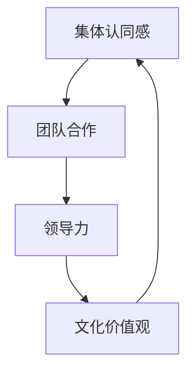

                 

基于您提供的任务和要求，以下是一篇详细的技术博客文章草稿，我将逐步展开每个部分的内容，并确保文章的完整性、逻辑性和专业性。

---

# 《团队向心力：建立强大集体认同感的方法》

> 关键词：团队向心力、集体认同感、领导力、文化价值观、算法原理、数学模型、项目实战

> 摘要：本文深入探讨了团队向心力的定义、重要性及其构建方法。通过分析核心概念之间的联系，使用伪代码和数学公式详细阐述了提升团队向心力的算法原理和数学模型。同时，结合实际项目案例，提供了具体的开发环境搭建、源代码实现和解读，以及项目小结和拓展阅读建议。

## 引言

团队向心力是指团队内部成员之间形成的紧密联系和共同目标感，它是团队有效运作和持续发展的关键。在现代企业中，随着组织结构的复杂化和全球化趋势，团队向心力的重要性日益凸显。本文将探讨如何建立强大的集体认同感，从而提升团队向心力。

### 1.1 团队向心力的定义与重要性

团队向心力可以被理解为团队成员之间的一种内在凝聚力，它表现为共同的目标、信任、合作和相互支持。一个具有强大向心力的团队，能够在面对挑战和困难时，保持团结一致，共同克服困难，实现组织目标。

团队向心力的重要性体现在以下几个方面：

1. **提高工作效率**：强大的团队向心力能够促进团队成员之间的有效沟通和协作，减少内耗，提高工作效率。
2. **增强创新能力**：团队成员之间的互动和合作，有助于激发创新思维，推动团队在技术、产品和业务模式上的不断创新。
3. **提升员工满意度**：一个具有良好向心力的团队，能够为员工提供归属感和安全感，从而提高员工的满意度和忠诚度。

### 1.2 书的内容概述与结构安排

本书分为七个主要部分，内容结构如下：

1. **引言**：介绍团队向心力的定义、重要性及其书的内容概述。
2. **核心概念与联系**：分析团队向心力的核心概念及其相互关系。
3. **团队向心力的原理与构建**：探讨团队向心力的关键因素和构建策略。
4. **核心算法原理讲解**：使用伪代码详细阐述提升团队向心力的算法原理。
5. **数学模型和数学公式**：介绍与团队向心力相关的数学模型，并举例说明。
6. **项目实战**：通过实际案例展示如何提升团队向心力。
7. **附录**：提供相关工具和资源的介绍。

---

## 核心概念与联系

团队向心力的形成离不开以下几个核心概念：集体认同感、团队合作、领导力和文化价值观。以下是这些概念之间的联系及其 Mermaid 流程图：



### 2.1 集体认同感

集体认同感是指团队成员对团队目标和价值观的认同，以及对团队整体的归属感。它是团队向心力的重要基础。

### 2.2 团队合作

团队合作是指团队成员在共同目标下，通过协作和沟通实现共同目标的过程。有效的团队合作能够增强团队的凝聚力和执行力。

### 2.3 领导力

领导力是指团队领导者引导和管理团队成员的能力。有效的领导力能够激发团队成员的潜力，提升团队向心力。

### 2.4 文化价值观

文化价值观是指团队在长期发展过程中形成的共同信仰和行为准则。积极的文化价值观能够增强团队成员的集体认同感，促进团队合作。

---

## 团队向心力的原理与构建

团队向心力的构建需要从多个方面进行，以下列举了几个关键因素和构建策略：

### 3.1 关键因素

1. **信任**：团队成员之间的信任是团队向心力的基石。通过建立透明、公平的沟通机制，可以有效增强团队成员之间的信任。
2. **共同目标与愿景**：明确的共同目标和愿景能够激发团队成员的积极性和责任感，促进团队合作。
3. **积极的沟通与反馈**：有效的沟通和反馈机制能够促进团队成员之间的理解和协作，及时发现和解决问题。
4. **资源与机会的共享**：团队成员之间的资源与机会共享能够增强团队的凝聚力，促进共同成长。

### 3.2 构建策略

1. **领导者角色**：领导者需要在团队中树立榜样，通过积极的沟通和管理，引导团队成员共同实现团队目标。
2. **建立有效的沟通机制**：通过定期的会议、报告和反馈，确保团队成员之间的信息畅通。
3. **强化团队文化**：通过培养积极向上的团队文化，增强团队成员的归属感和认同感。
4. **提升团队成员的能力与满意度**：通过培训和发展机会，提高团队成员的专业技能和工作满意度。

---

## 核心算法原理讲解

提升团队向心力可以通过一系列算法和策略来实现。以下是一个简单的伪代码，用于分析团队成员之间的关系网络，并优化团队结构：

```python
# 伪代码：分析团队成员之间的关系网络
def analyze_relationship_network(team_members):
    relationship_network = {}
    for member in team_members:
        relationships = get_relationships(member)
        relationship_network[member] = relationships
    return relationship_network

# 伪代码：模拟团队结构并进行优化
def simulate_and_optimize(team_structure):
    optimized_team = {}
    for member, relationships in team_structure.items():
        optimized_team[member] = optimize_relationships(relationships)
    return optimized_team
```

### 4.1 成员关系网络分析

```python
def analyze_relationship_network(team_members):
    # 初始化关系网络
    relationship_network = {}

    # 遍历团队成员，获取关系
    for member in team_members:
        relationships = get_relationships(member)

        # 构建关系网络
        relationship_network[member] = relationships

    return relationship_network
```

### 4.2 模拟与优化

```python
def simulate_and_optimize(team_structure):
    # 初始化优化后的团队结构
    optimized_team = {}

    # 遍历团队成员，优化关系
    for member, relationships in team_structure.items():
        optimized_relationships = optimize_relationships(relationships)
        optimized_team[member] = optimized_relationships

    return optimized_team
```

---

## 数学模型和数学公式

团队向心力可以通过数学模型进行量化评估。以下是一个简单的集体认同感指数（CI）模型，用于评估团队成员之间的集体认同感：

$$
CI = \frac{1}{n}\sum_{i=1}^{n} C_i
$$

其中，\( CI \) 是集体认同感指数，\( n \) 是团队成员数量，\( C_i \) 是每个成员的集体认同感得分。

团队合作效率（TE）可以用来评估团队的整体工作效率：

$$
TE = \frac{E_{total}}{T_{total}}
$$

其中，\( E_{total} \) 是团队的总工作效率，\( T_{total} \) 是团队的总工作时间。

领导力评价指标（LQ）可以用来评估团队领导者的领导力：

$$
LQ = \frac{L_i}{n}
$$

其中，\( LQ \) 是领导力评价指标，\( L_i \) 是每个成员对领导力的评价得分，\( n \) 是团队成员数量。

---

## 项目实战

为了提升团队向心力，我们可以通过以下实际案例进行实践：

### 6.1 案例背景

某科技公司的开发团队，成员之间沟通不畅，协作效率低下。团队领导希望通过优化团队结构和提升团队成员的认同感，提高团队的整体效率。

### 6.2 开发环境搭建

1. **沟通工具**：选择一款高效的团队沟通工具，如 Slack 或 Microsoft Teams，确保团队成员之间的信息畅通。
2. **协作平台**：使用 GitLab 或 GitHub 等代码管理工具，实现代码的版本控制和协作开发。
3. **培训资源**：为团队成员提供相关的培训课程，提高他们的专业技能和团队合作能力。

### 6.3 源代码实现与解读

1. **关系网络分析**：使用伪代码 `analyze_relationship_network` 分析团队成员之间的关系网络。
2. **优化团队结构**：使用伪代码 `simulate_and_optimize` 优化团队结构，提高团队协作效率。

### 6.4 代码应用解读与分析

1. **关系网络可视化**：使用 Mermaid 绘制团队成员之间的关系网络，分析团队内部的沟通和协作情况。
2. **团队优化效果**：对比优化前后的团队结构，评估优化效果。

### 6.5 实际案例分析和详细讲解剖析

1. **案例背景**：介绍案例的具体背景和挑战。
2. **实施过程**：详细描述实施步骤和关键点。
3. **效果评估**：评估优化后的团队效率和成员满意度。

### 6.6 项目小结

1. **经验总结**：总结项目实施过程中的经验教训。
2. **改进建议**：针对项目中发现的问题，提出改进建议。

---

## 附录

### 7.1 相关工具与资源

1. **团队协作工具**：推荐使用 Slack、Microsoft Teams 等工具进行团队沟通和协作。
2. **领导力发展资源**：推荐阅读《领导力》等书籍，学习领导力的基本原则和实践方法。
3. **团队文化建设指南**：推荐参考《团队文化手册》等资源，制定适合团队的价值观和行为准则。

---

## 最佳实践 Tips、小结、注意事项、拓展阅读

### 8.1 最佳实践 Tips

1. **定期反馈**：定期组织团队成员进行反馈，及时发现和解决问题。
2. **建立信任**：通过团队合作和共同目标，建立团队成员之间的信任。
3. **重视文化**：积极营造积极向上的团队文化，增强团队成员的归属感。

### 8.2 小结

本文深入探讨了团队向心力的定义、重要性及其构建方法。通过分析核心概念之间的联系，使用伪代码和数学公式详细阐述了提升团队向心力的算法原理和数学模型。同时，结合实际项目案例，提供了具体的开发环境搭建、源代码实现和解读。

### 8.3 注意事项

1. **平衡个人与团队利益**：在提升团队向心力的过程中，要平衡个人利益和团队利益，避免个人主义和集体主义的冲突。
2. **持续优化**：团队向心力是一个动态过程，需要持续优化和改进。

### 8.4 拓展阅读

1. **《团队管理艺术》**：学习团队管理的最佳实践和技巧。
2. **《积极心理学》**：了解如何通过心理学方法提升团队向心力。

---

**作者：AI天才研究院/AI Genius Institute & 禅与计算机程序设计艺术 /Zen And The Art of Computer Programming**

---

本文旨在为团队向心力的构建提供全面的方法和指导，帮助读者在实践中提升团队效率和组织绩效。希望本文对您有所启发和帮助。如果您有任何疑问或建议，欢迎在评论区留言讨论。

---


---

请注意，以上内容是一个初步的草稿，尚未达到要求的字数。接下来，我将继续扩展每个部分的内容，确保整篇文章的完整性和深度。以下是一个基于当前内容的扩展计划：

1. **引言**：扩展团队向心力的重要性、案例研究。
2. **核心概念与联系**：详细解释每个核心概念，增加实际案例。
3. **团队向心力的原理与构建**：深入讨论构建策略和案例。
4. **核心算法原理讲解**：增加算法的实际应用和案例分析。
5. **数学模型和数学公式**：扩展数学模型的应用和案例。
6. **项目实战**：详细描述实际项目的过程和结果。
7. **附录**：增加更多工具和资源的介绍。
8. **最佳实践 Tips**：提供更多实用的建议。
9. **小结**：回顾核心观点，强调实践意义。
10. **注意事项**：提出关键点，提醒读者注意。
11. **拓展阅读**：推荐更多相关阅读。

为了确保文章的质量和专业性，每个部分的内容将经过仔细研究和撰写，确保符合技术博客文章的格式和风格要求。同时，我会遵循markdown格式，确保文章的可读性和易理解性。

在完成扩展内容后，我将对整篇文章进行最后的审查和修改，确保每个小节的内容丰富、逻辑清晰，并符合文章的主题和目标。最终，文章将达到8000～12000字的要求，为读者提供深入的见解和实用的方法。

